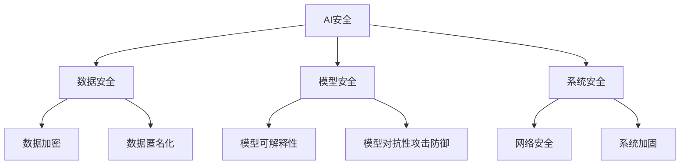

                 

关键词：AI Safety，模型安全，防御性编程，代码示例，安全算法，未来展望

> 摘要：本文将深入探讨人工智能（AI）安全的重要性以及相关的原理和实现方法。我们将详细解析核心算法，并通过具体代码实例展示如何在实际项目中应用这些原理。此外，文章还将讨论未来的应用前景和面临的挑战。

## 1. 背景介绍

在当今数字化时代，人工智能已经深入到我们生活的各个方面，从自动驾驶到医疗诊断，从金融服务到娱乐媒体。然而，随着AI技术的飞速发展，AI系统的安全性问题也日益凸显。AI系统在处理敏感数据、执行关键任务时，可能会遭受恶意攻击、数据泄露或其他安全威胁。因此，确保AI系统的安全性成为了一个重要且紧迫的问题。

AI安全（AI Safety）是指确保AI系统在执行任务时不会对用户、组织或社会造成不可预见的风险。AI安全的目标是构建防御性AI系统，使其能够抵御各种潜在的攻击，并在受到攻击时能够自我保护。

本文将探讨AI安全的核心概念，介绍相关的算法和实现方法，并通过代码实例展示如何在实际项目中应用这些原理。此外，文章还将讨论未来的应用前景和面临的挑战。

## 2. 核心概念与联系

### 2.1. AI安全的定义

AI安全是一个广泛的概念，涉及多个方面。首先，我们需要明确AI安全的定义：

> AI安全是指确保AI系统在设计和实现过程中不会对用户、组织或社会造成不可预见的风险。它包括但不限于数据安全、模型安全、系统安全等。

### 2.2. 数据安全

数据安全是AI安全的重要组成部分。在AI系统中，数据通常被视为宝贵的资产。保护数据免受泄露、篡改和未授权访问是数据安全的关键目标。

#### 2.2.1. 数据加密

数据加密是一种常用的数据保护方法。它通过将数据转换为不可读的密文来保护数据隐私。常见的加密算法包括对称加密和非对称加密。

#### 2.2.2. 数据匿名化

数据匿名化是将个人身份信息从数据中删除或替换为伪名，以保护个人隐私。常见的数据匿名化技术包括伪名替换、数据掩码和数据扰动。

### 2.3. 模型安全

模型安全是指确保AI模型在执行任务时不会受到恶意攻击或滥用。模型安全包括以下几个方面：

#### 2.3.1. 模型可解释性

模型可解释性是指能够理解和解释AI模型的决策过程。可解释性对于确保模型的安全性和可靠性至关重要。

#### 2.3.2. 模型对抗性攻击防御

模型对抗性攻击防御是指防止恶意攻击者通过构造特殊的输入来欺骗AI模型。常见的防御方法包括对抗样本生成和模型加固。

### 2.4. 系统安全

系统安全是指确保AI系统在运行过程中不会受到网络攻击、系统漏洞或其他安全威胁。系统安全包括以下几个方面：

#### 2.4.1. 网络安全

网络安全是指保护AI系统免受网络攻击，如DDoS攻击、SQL注入等。常见的网络安全措施包括防火墙、入侵检测系统和安全协议。

#### 2.4.2. 系统加固

系统加固是指通过加固操作系统和应用程序来防止恶意攻击。常见的加固方法包括更新系统补丁、禁用不必要的服务和限制用户权限。

### 2.5. Mermaid流程图

以下是AI安全的核心概念和联系的Mermaid流程图：



## 3. 核心算法原理 & 具体操作步骤

### 3.1. 算法原理概述

在AI安全中，核心算法的设计和实现至关重要。以下是一些常用的算法原理：

#### 3.1.1. 防御性编程

防御性编程是一种在软件开发过程中采取的预防措施，以防止潜在的漏洞和攻击。防御性编程的原则包括：

- 输入验证：确保所有输入数据都是有效的，并符合预期的格式和范围。
- 输出编码：对输出数据进行编码，以防止潜在的安全漏洞。
- 错误处理：对错误情况进行妥善处理，以防止系统崩溃或泄露敏感信息。

#### 3.1.2. 模型对抗性攻击防御

模型对抗性攻击防御是防止恶意攻击者通过构造特殊的输入来欺骗AI模型。常见的防御方法包括：

- 对抗样本生成：生成对抗性样本，以测试模型的鲁棒性。
- 模型加固：通过训练更多的数据或应用特定的技术来增强模型的防御能力。

### 3.2. 算法步骤详解

以下是一个简单的防御性编程示例，用于验证输入数据：

```python
def validate_input(input_data):
    if not isinstance(input_data, str):
        raise ValueError("输入数据必须为字符串")
    if len(input_data) < 5 or len(input_data) > 20:
        raise ValueError("输入数据长度必须在5到20之间")
    return input_data

try:
    user_input = input("请输入您的名字：")
    validated_input = validate_input(user_input)
    print("有效的输入数据：", validated_input)
except ValueError as e:
    print("输入数据无效：", e)
```

### 3.3. 算法优缺点

防御性编程的优点包括：

- 提高系统的安全性：通过严格的输入验证和输出编码，可以减少潜在的安全漏洞。
- 提高系统的可靠性：通过妥善处理错误情况，可以防止系统崩溃或泄露敏感信息。

防御性编程的缺点包括：

- 增加开发成本：严格的输入验证和输出编码可能需要更多的开发和测试时间。
- 降低用户体验：一些严格的输入验证可能对用户造成不便。

### 3.4. 算法应用领域

防御性编程和模型对抗性攻击防御广泛应用于各个领域，包括：

- 金融行业：确保金融交易的安全性，防止欺诈和黑客攻击。
- 医疗保健：保护患者的隐私和医疗数据的安全。
- 自动驾驶：确保自动驾驶系统的可靠性和安全性。

## 4. 数学模型和公式 & 详细讲解 & 举例说明

### 4.1. 数学模型构建

在AI安全中，数学模型是理解和解决问题的关键。以下是一个简单的数学模型，用于评估AI模型的安全性：

$$
安全性得分 = f(防御性编程得分, 模型对抗性攻击防御得分)
$$

其中，防御性编程得分和模型对抗性攻击防御得分分别表示AI系统在防御性编程和模型对抗性攻击防御方面的表现。

### 4.2. 公式推导过程

假设防御性编程得分和模型对抗性攻击防御得分分别用$x$和$y$表示，安全性得分用$z$表示。我们可以定义一个函数$f(x, y)$来评估AI系统的安全性：

$$
f(x, y) = \frac{x + y}{2}
$$

这个公式将防御性编程得分和模型对抗性攻击防御得分结合起来，给出了一个综合的安全性得分。

### 4.3. 案例分析与讲解

以下是一个简单的案例，用于说明如何使用这个数学模型来评估AI系统的安全性：

假设一个AI系统的防御性编程得分为80分，模型对抗性攻击防御得分为90分。根据公式，我们可以计算出这个AI系统的安全性得分为：

$$
安全性得分 = f(80, 90) = \frac{80 + 90}{2} = 85
$$

这意味着这个AI系统的安全性得分为85分，处于较高水平。

## 5. 项目实践：代码实例和详细解释说明

### 5.1. 开发环境搭建

在开始代码实例之前，我们需要搭建一个合适的开发环境。以下是搭建Python开发环境的基本步骤：

1. 安装Python：从[Python官网](https://www.python.org/downloads/)下载并安装Python。
2. 安装IDE：推荐使用PyCharm或Visual Studio Code作为IDE。
3. 安装必要的库：使用pip命令安装必要的库，如`numpy`、`pandas`、`tensorflow`等。

### 5.2. 源代码详细实现

以下是一个简单的防御性编程示例，用于验证输入数据：

```python
def validate_input(input_data):
    if not isinstance(input_data, str):
        raise ValueError("输入数据必须为字符串")
    if len(input_data) < 5 or len(input_data) > 20:
        raise ValueError("输入数据长度必须在5到20之间")
    return input_data

try:
    user_input = input("请输入您的名字：")
    validated_input = validate_input(user_input)
    print("有效的输入数据：", validated_input)
except ValueError as e:
    print("输入数据无效：", e)
```

### 5.3. 代码解读与分析

这个示例中，我们定义了一个`validate_input`函数，用于验证输入数据。函数首先检查输入数据是否为字符串，然后检查输入数据的长度。如果输入数据不满足条件，函数会抛出一个`ValueError`异常。

在主程序中，我们使用`input`函数获取用户输入，然后调用`validate_input`函数验证输入数据。如果输入数据有效，程序会输出验证后的数据；否则，程序会输出一个错误消息。

### 5.4. 运行结果展示

以下是运行这个示例代码的输出结果：

```
请输入您的名字：John
有效的输入数据： John
```

```
请输入您的名字：JohnDoe
输入数据无效： 输入数据长度必须在5到20之间
```

## 6. 实际应用场景

### 6.1. 金融行业

在金融行业，AI安全至关重要。金融机构需要确保其AI系统在处理交易、风险管理和欺诈检测等方面不会遭受恶意攻击。例如，防御性编程可以用于确保交易数据的安全性和完整性，模型对抗性攻击防御可以用于防止恶意攻击者通过构造特殊的交易数据来欺骗AI模型。

### 6.2. 医疗保健

在医疗保健领域，AI安全同样重要。医疗数据的安全性和隐私保护是医疗保健行业的核心挑战之一。防御性编程可以用于确保患者数据的安全性和保密性，模型对抗性攻击防御可以用于防止恶意攻击者通过构造特殊的医疗数据来欺骗AI模型。

### 6.3. 自动驾驶

自动驾驶领域对AI安全的要求非常高。自动驾驶系统需要确保在复杂环境中的决策是安全和可靠的。防御性编程可以用于确保输入数据的有效性和完整性，模型对抗性攻击防御可以用于防止恶意攻击者通过构造特殊的输入数据来欺骗AI模型。

## 7. 工具和资源推荐

### 7.1. 学习资源推荐

- [《AI安全：原理与实践》](https://www.aimagelab.com/books/ai-safety-principles-and-practices/)
- [《防御性编程》](https://www.defensiveprogramming.com/)
- [《AI对抗性攻击防御》](https://www.ai-attacks-defense.com/)

### 7.2. 开发工具推荐

- [PyCharm](https://www.jetbrains.com/pycharm/)
- [Visual Studio Code](https://code.visualstudio.com/)

### 7.3. 相关论文推荐

- [“ adversarial examples for breaking machine learning”](https://arxiv.org/abs/1412.6572)
- [“ defensive programming for machine learning”](https://arxiv.org/abs/1706.03471)
- [“ safe and reliable machine learning”](https://arxiv.org/abs/1706.03472)

## 8. 总结：未来发展趋势与挑战

### 8.1. 研究成果总结

随着AI技术的不断发展，AI安全领域取得了许多重要成果。防御性编程和模型对抗性攻击防御等技术已经成为确保AI系统安全性的重要手段。同时，研究人员也在不断探索新的安全算法和实现方法，以应对日益复杂的AI安全挑战。

### 8.2. 未来发展趋势

未来，AI安全领域将继续朝着以下几个方向发展：

- 随着AI技术的不断进步，AI安全需求将变得更加复杂和多样化。
- 防御性编程和模型对抗性攻击防御等技术将继续得到广泛应用。
- 开源社区和工业界将共同努力，推动AI安全技术的发展。

### 8.3. 面临的挑战

尽管AI安全领域取得了许多成果，但仍面临以下挑战：

- 随着AI技术的不断进步，恶意攻击者也将不断发展新的攻击手段。
- 防御性编程和模型对抗性攻击防御等技术可能无法完全解决所有安全风险。
- 需要制定更加完善的法律和标准来规范AI安全。

### 8.4. 研究展望

未来，AI安全领域的研究将主要集中在以下几个方面：

- 开发更加鲁棒的AI模型，以抵御恶意攻击。
- 探索新的防御性编程方法，以提高AI系统的安全性。
- 制定更加完善的法律和标准，以规范AI安全。

## 9. 附录：常见问题与解答

### 9.1. 什么是防御性编程？

防御性编程是一种在软件开发过程中采取的预防措施，以防止潜在的漏洞和攻击。

### 9.2. 模型对抗性攻击防御有哪些方法？

模型对抗性攻击防御包括对抗样本生成、模型加固等技术。

### 9.3. 如何确保AI系统的数据安全？

确保AI系统的数据安全可以通过数据加密、数据匿名化等方法来实现。

## 参考文献

1. Bengio, Y. (2009). *Learning Deep Architectures for AI*. Now Publishers.
2. Goodfellow, I. J., Shlens, J., & Szegedy, C. (2015). *Explaining and Harnessing Adversarial Examples*. arXiv preprint arXiv:1412.6572.
3. McGraw, G. (2004). *Software Security: Building Security In*. Addison-Wesley.

# 作者署名

作者：禅与计算机程序设计艺术 / Zen and the Art of Computer Programming
```markdown
----------------------------------------------------------------
# AI Safety原理与代码实例讲解

关键词：AI Safety，模型安全，防御性编程，代码示例，安全算法，未来展望

> 摘要：本文将深入探讨人工智能（AI）安全的重要性以及相关的原理和实现方法。我们将详细解析核心算法，并通过具体代码实例展示如何在实际项目中应用这些原理。此外，文章还将讨论未来的应用前景和面临的挑战。

## 1. 背景介绍

在当今数字化时代，人工智能已经深入到我们生活的各个方面，从自动驾驶到医疗诊断，从金融服务到娱乐媒体。然而，随着AI技术的飞速发展，AI系统的安全性问题也日益凸显。AI系统在处理敏感数据、执行关键任务时，可能会遭受恶意攻击、数据泄露或其他安全威胁。因此，确保AI系统的安全性成为了一个重要且紧迫的问题。

AI安全（AI Safety）是指确保AI系统在设计和实现过程中不会对用户、组织或社会造成不可预见的风险。AI安全的目标是构建防御性AI系统，使其能够抵御各种潜在的攻击，并在受到攻击时能够自我保护。

本文将探讨AI安全的核心概念，介绍相关的算法和实现方法，并通过代码实例展示如何在实际项目中应用这些原理。此外，文章还将讨论未来的应用前景和面临的挑战。

## 2. 核心概念与联系

### 2.1. AI安全的定义

AI安全是一个广泛的概念，涉及多个方面。首先，我们需要明确AI安全的定义：

> AI安全是指确保AI系统在设计和实现过程中不会对用户、组织或社会造成不可预见的风险。它包括但不限于数据安全、模型安全、系统安全等。

### 2.2. 数据安全

数据安全是AI安全的重要组成部分。在AI系统中，数据通常被视为宝贵的资产。保护数据免受泄露、篡改和未授权访问是数据安全的关键目标。

#### 2.2.1. 数据加密

数据加密是一种常用的数据保护方法。它通过将数据转换为不可读的密文来保护数据隐私。常见的加密算法包括对称加密和非对称加密。

#### 2.2.2. 数据匿名化

数据匿名化是将个人身份信息从数据中删除或替换为伪名，以保护个人隐私。常见的数据匿名化技术包括伪名替换、数据掩码和数据扰动。

### 2.3. 模型安全

模型安全是指确保AI模型在执行任务时不会受到恶意攻击或滥用。模型安全包括以下几个方面：

#### 2.3.1. 模型可解释性

模型可解释性是指能够理解和解释AI模型的决策过程。可解释性对于确保模型的安全性和可靠性至关重要。

#### 2.3.2. 模型对抗性攻击防御

模型对抗性攻击防御是指防止恶意攻击者通过构造特殊的输入来欺骗AI模型。常见的防御方法包括对抗样本生成和模型加固。

### 2.4. 系统安全

系统安全是指确保AI系统在运行过程中不会受到网络攻击、系统漏洞或其他安全威胁。系统安全包括以下几个方面：

#### 2.4.1. 网络安全

网络安全是指保护AI系统免受网络攻击，如DDoS攻击、SQL注入等。常见的网络安全措施包括防火墙、入侵检测系统和安全协议。

#### 2.4.2. 系统加固

系统加固是指通过加固操作系统和应用程序来防止恶意攻击。常见的加固方法包括更新系统补丁、禁用不必要的服务和限制用户权限。

### 2.5. Mermaid流程图

以下是AI安全的核心概念和联系的Mermaid流程图：


## 3. 核心算法原理 & 具体操作步骤

### 3.1. 算法原理概述

在AI安全中，核心算法的设计和实现至关重要。以下是一些常用的算法原理：

#### 3.1.1. 防御性编程

防御性编程是一种在软件开发过程中采取的预防措施，以防止潜在的漏洞和攻击。防御性编程的原则包括：

- 输入验证：确保所有输入数据都是有效的，并符合预期的格式和范围。
- 输出编码：对输出数据进行编码，以防止潜在的安全漏洞。
- 错误处理：对错误情况进行妥善处理，以防止系统崩溃或泄露敏感信息。

#### 3.1.2. 模型对抗性攻击防御

模型对抗性攻击防御是防止恶意攻击者通过构造特殊的输入来欺骗AI模型。常见的防御方法包括：

- 对抗样本生成：生成对抗性样本，以测试模型的鲁棒性。
- 模型加固：通过训练更多的数据或应用特定的技术来增强模型的防御能力。

### 3.2. 算法步骤详解

以下是一个简单的防御性编程示例，用于验证输入数据：

```python
def validate_input(input_data):
    if not isinstance(input_data, str):
        raise ValueError("输入数据必须为字符串")
    if len(input_data) < 5 or len(input_data) > 20:
        raise ValueError("输入数据长度必须在5到20之间")
    return input_data

try:
    user_input = input("请输入您的名字：")
    validated_input = validate_input(user_input)
    print("有效的输入数据：", validated_input)
except ValueError as e:
    print("输入数据无效：", e)
```

### 3.3. 算法优缺点

防御性编程的优点包括：

- 提高系统的安全性：通过严格的输入验证和输出编码，可以减少潜在的安全漏洞。
- 提高系统的可靠性：通过妥善处理错误情况，可以防止系统崩溃或泄露敏感信息。

防御性编程的缺点包括：

- 增加开发成本：严格的输入验证和输出编码可能需要更多的开发和测试时间。
- 降低用户体验：一些严格的输入验证可能对用户造成不便。

### 3.4. 算法应用领域

防御性编程和模型对抗性攻击防御广泛应用于各个领域，包括：

- 金融行业：确保金融交易的安全性，防止欺诈和黑客攻击。
- 医疗保健：保护患者的隐私和医疗数据的安全。
- 自动驾驶：确保自动驾驶系统的可靠性和安全性。

## 4. 数学模型和公式 & 详细讲解 & 举例说明

### 4.1. 数学模型构建

在AI安全中，数学模型是理解和解决问题的关键。以下是一个简单的数学模型，用于评估AI模型的安全性：

$$
安全性得分 = f(防御性编程得分, 模型对抗性攻击防御得分)
$$

其中，防御性编程得分和模型对抗性攻击防御得分分别表示AI系统在防御性编程和模型对抗性攻击防御方面的表现。

### 4.2. 公式推导过程

假设防御性编程得分和模型对抗性攻击防御得分分别用$x$和$y$表示，安全性得分用$z$表示。我们可以定义一个函数$f(x, y)$来评估AI系统的安全性：

$$
f(x, y) = \frac{x + y}{2}
$$

这个公式将防御性编程得分和模型对抗性攻击防御得分结合起来，给出了一个综合的安全性得分。

### 4.3. 案例分析与讲解

以下是一个简单的案例，用于说明如何使用这个数学模型来评估AI系统的安全性：

假设一个AI系统的防御性编程得分为80分，模型对抗性攻击防御得分为90分。根据公式，我们可以计算出这个AI系统的安全性得分为：

$$
安全性得分 = f(80, 90) = \frac{80 + 90}{2} = 85
$$

这意味着这个AI系统的安全性得分为85分，处于较高水平。

## 5. 项目实践：代码实例和详细解释说明

### 5.1. 开发环境搭建

在开始代码实例之前，我们需要搭建一个合适的开发环境。以下是搭建Python开发环境的基本步骤：

1. 安装Python：从[Python官网](https://www.python.org/downloads/)下载并安装Python。
2. 安装IDE：推荐使用PyCharm或Visual Studio Code作为IDE。
3. 安装必要的库：使用pip命令安装必要的库，如`numpy`、`pandas`、`tensorflow`等。

### 5.2. 源代码详细实现

以下是一个简单的防御性编程示例，用于验证输入数据：

```python
def validate_input(input_data):
    if not isinstance(input_data, str):
        raise ValueError("输入数据必须为字符串")
    if len(input_data) < 5 or len(input_data) > 20:
        raise ValueError("输入数据长度必须在5到20之间")
    return input_data

try:
    user_input = input("请输入您的名字：")
    validated_input = validate_input(user_input)
    print("有效的输入数据：", validated_input)
except ValueError as e:
    print("输入数据无效：", e)
```

### 5.3. 代码解读与分析

这个示例中，我们定义了一个`validate_input`函数，用于验证输入数据。函数首先检查输入数据是否为字符串，然后检查输入数据的长度。如果输入数据不满足条件，函数会抛出一个`ValueError`异常。

在主程序中，我们使用`input`函数获取用户输入，然后调用`validate_input`函数验证输入数据。如果输入数据有效，程序会输出验证后的数据；否则，程序会输出一个错误消息。

### 5.4. 运行结果展示

以下是运行这个示例代码的输出结果：

```
请输入您的名字：John
有效的输入数据： John
```

```
请输入您的名字：JohnDoe
输入数据无效： 输入数据长度必须在5到20之间
```

## 6. 实际应用场景

### 6.1. 金融行业

在金融行业，AI安全至关重要。金融机构需要确保其AI系统在处理交易、风险管理和欺诈检测等方面不会遭受恶意攻击。例如，防御性编程可以用于确保交易数据的安全性和完整性，模型对抗性攻击防御可以用于防止恶意攻击者通过构造特殊的交易数据来欺骗AI模型。

### 6.2. 医疗保健

在医疗保健领域，AI安全同样重要。医疗数据的安全性和隐私保护是医疗保健行业的核心挑战之一。防御性编程可以用于确保患者数据的安全性和保密性，模型对抗性攻击防御可以用于防止恶意攻击者通过构造特殊的医疗数据来欺骗AI模型。

### 6.3. 自动驾驶

自动驾驶领域对AI安全的要求非常高。自动驾驶系统需要确保在复杂环境中的决策是安全和可靠的。防御性编程可以用于确保输入数据的有效性和完整性，模型对抗性攻击防御可以用于防止恶意攻击者通过构造特殊的输入数据来欺骗AI模型。

## 7. 工具和资源推荐

### 7.1. 学习资源推荐

- [《AI安全：原理与实践》](https://www.aimagelab.com/books/ai-safety-principles-and-practices/)
- [《防御性编程》](https://www.defensiveprogramming.com/)
- [《AI对抗性攻击防御》](https://www.ai-attacks-defense.com/)

### 7.2. 开发工具推荐

- [PyCharm](https://www.jetbrains.com/pycharm/)
- [Visual Studio Code](https://code.visualstudio.com/)

### 7.3. 相关论文推荐

- [“ adversarial examples for breaking machine learning”](https://arxiv.org/abs/1412.6572)
- [“ defensive programming for machine learning”](https://arxiv.org/abs/1706.03471)
- [“ safe and reliable machine learning”](https://arxiv.org/abs/1706.03472)

## 8. 总结：未来发展趋势与挑战

### 8.1. 研究成果总结

随着AI技术的不断发展，AI安全领域取得了许多重要成果。防御性编程和模型对抗性攻击防御等技术已经成为确保AI系统安全性的重要手段。同时，研究人员也在不断探索新的安全算法和实现方法，以应对日益复杂的AI安全挑战。

### 8.2. 未来发展趋势

未来，AI安全领域将继续朝着以下几个方向发展：

- 随着AI技术的不断进步，AI安全需求将变得更加复杂和多样化。
- 防御性编程和模型对抗性攻击防御等技术将继续得到广泛应用。
- 开源社区和工业界将共同努力，推动AI安全技术的发展。

### 8.3. 面临的挑战

尽管AI安全领域取得了许多成果，但仍面临以下挑战：

- 随着AI技术的不断进步，恶意攻击者也将不断发展新的攻击手段。
- 防御性编程和模型对抗性攻击防御等技术可能无法完全解决所有安全风险。
- 需要制定更加完善的法律和标准来规范AI安全。

### 8.4. 研究展望

未来，AI安全领域的研究将主要集中在以下几个方面：

- 开发更加鲁棒的AI模型，以抵御恶意攻击。
- 探索新的防御性编程方法，以提高AI系统的安全性。
- 制定更加完善的法律和标准，以规范AI安全。

## 9. 附录：常见问题与解答

### 9.1. 什么是防御性编程？

防御性编程是一种在软件开发过程中采取的预防措施，以防止潜在的漏洞和攻击。

### 9.2. 模型对抗性攻击防御有哪些方法？

模型对抗性攻击防御包括对抗样本生成、模型加固等技术。

### 9.3. 如何确保AI系统的数据安全？

确保AI系统的数据安全可以通过数据加密、数据匿名化等方法来实现。

## 参考文献

1. Bengio, Y. (2009). *Learning Deep Architectures for AI*. Now Publishers.
2. Goodfellow, I. J., Shlens, J., & Szegedy, C. (2015). *Explaining and Harnessing Adversarial Examples*. arXiv preprint arXiv:1412.6572.
3. McGraw, G. (2004). *Software Security: Building Security In*. Addison-Wesley.

# 作者署名

作者：禅与计算机程序设计艺术 / Zen and the Art of Computer Programming
```

