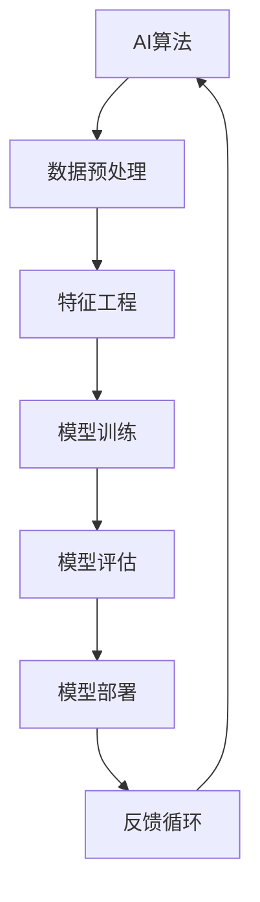

                 

### 关键词 Keyword List

- AI hackathon
- 创新与创造力
- 技术竞赛
- 数据科学
- 机器学习
- 开源工具
- 软件工程
- 团队合作
- 项目管理

## 摘要 Abstract

本文探讨了AI hackathon作为一种促进创新和创造力的平台，如何通过技术竞赛的方式推动人工智能领域的发展。文章首先介绍了AI hackathon的背景和现状，随后深入分析了核心概念、算法原理、数学模型及其应用领域。接着，通过一个实际项目的实践实例，展示了如何运用开源工具和软件工程方法完成AI hackathon项目。文章最后讨论了AI hackathon在各个实际应用场景中的潜力，并对未来的发展趋势和挑战进行了展望。

### 1. 背景介绍 Background

#### 1.1 AI hackathon的定义和起源

AI hackathon，顾名思义，是人工智能（Artificial Intelligence，简称AI）领域的黑客马拉松（Hackathon）。它是一种集中式的编程和设计比赛，通常由一个或多个主题或挑战定义，参赛者在规定的时间内通过团队合作，利用现有技术和工具，创造性地解决特定问题或实现特定目标。AI hackathon最早起源于计算机科学和软件开发的黑客马拉松，随着人工智能技术的快速发展和应用范围的扩大，AI hackathon逐渐成为一种广泛参与的科技竞赛形式。

#### 1.2 AI hackathon的发展历程

AI hackathon的发展历程可以追溯到2000年代初期，当时黑客马拉松主要集中于软件开发和互联网创业领域。随着AI技术的崛起，AI hackathon开始崭露头角。2009年，谷歌首次举办了Google AI Hackathon，标志着AI hackathon的正式开始。此后，AI hackathon在各种学术会议、技术展览和行业峰会上逐渐普及，成为推动AI技术发展和创新的重要平台。

#### 1.3 AI hackathon的现状和趋势

当前，AI hackathon已成为全球范围内一种热门的竞赛形式。不仅有大型科技公司和学术机构举办的官方AI hackathon，也有众多独立组织和社区举办的民间AI hackathon。这些竞赛不仅吸引了大量专业人士和学者参与，也吸引了众多学生和科技爱好者。AI hackathon的趋势表明，随着AI技术的不断进步和应用领域的拓展，AI hackathon的规模和影响力将越来越大。

### 2. 核心概念与联系 Core Concepts and Connections

在AI hackathon中，核心概念和技术的联系是至关重要的。为了更好地理解这些联系，我们可以通过一个Mermaid流程图来展示它们之间的关系。



#### 2.1 AI算法 AI Algorithms

AI算法是AI hackathon的核心。常见的AI算法包括机器学习算法、深度学习算法和强化学习算法。这些算法在数据预处理、特征工程、模型训练、模型评估和模型部署等各个环节中发挥着关键作用。

#### 2.2 数据预处理 Data Preprocessing

数据预处理是AI算法成功的关键步骤。它包括数据清洗、数据归一化、数据缺失值处理和数据转换等。高质量的数据预处理可以显著提高模型的性能和准确性。

#### 2.3 特征工程 Feature Engineering

特征工程是数据预处理的一部分，也是AI算法成功的关键。它包括特征选择、特征提取和特征变换等。合理的特征工程可以显著提升模型的性能和泛化能力。

#### 2.4 模型训练 Model Training

模型训练是AI算法的核心步骤。它包括选择合适的算法、训练数据和超参数调整等。高效的模型训练可以显著提高模型的性能和效率。

#### 2.5 模型评估 Model Evaluation

模型评估是验证模型性能的重要步骤。它包括评估指标的选择、评估方法的实施和评估结果的分析等。准确的模型评估可以帮助我们更好地理解模型的性能和局限。

#### 2.6 模型部署 Model Deployment

模型部署是将训练好的模型应用到实际场景中的过程。它包括模型打包、部署环境和部署策略等。高效的模型部署可以确保模型在实际场景中的高效运行。

#### 2.7 反馈循环 Feedback Loop

反馈循环是AI hackathon的一个重要环节。通过收集用户反馈，我们可以不断优化模型和系统，提升用户体验和系统性能。

### 3. 核心算法原理 & 具体操作步骤 Core Algorithm Principles & Step-by-Step Operations

#### 3.1 算法原理概述

在AI hackathon中，常用的算法包括机器学习算法、深度学习算法和强化学习算法。以下是这些算法的基本原理概述。

#### 3.1.1 机器学习算法

机器学习算法是一种通过训练数据集来学习模型，并利用学习到的模型进行预测或决策的方法。常见的机器学习算法包括线性回归、决策树、随机森林、支持向量机和神经网络等。

#### 3.1.2 深度学习算法

深度学习算法是一种基于多层神经网络的学习方法。它通过多层非线性变换，将输入数据转换为高维特征表示，从而实现更复杂的预测和分类任务。常见的深度学习算法包括卷积神经网络（CNN）、循环神经网络（RNN）和生成对抗网络（GAN）等。

#### 3.1.3 强化学习算法

强化学习算法是一种通过与环境交互来学习最优策略的方法。它通过奖励机制来评估策略的好坏，并不断调整策略，以实现最优目标。常见的强化学习算法包括Q-learning、SARSA和深度强化学习（DRL）等。

#### 3.2 算法步骤详解

以下是机器学习算法、深度学习算法和强化学习算法的具体操作步骤。

#### 3.2.1 机器学习算法步骤

1. 数据收集与预处理：收集并清洗训练数据，进行数据归一化、缺失值处理和特征工程。
2. 选择算法：根据任务类型和数据特点，选择合适的机器学习算法。
3. 训练模型：使用训练数据集训练模型，调整超参数以优化模型性能。
4. 评估模型：使用验证数据集评估模型性能，选择最佳模型。
5. 模型部署：将训练好的模型应用到实际场景中，进行预测或决策。

#### 3.2.2 深度学习算法步骤

1. 数据收集与预处理：收集并清洗训练数据，进行数据归一化、缺失值处理和特征工程。
2. 确定网络结构：根据任务类型和数据特点，设计合适的深度学习网络结构。
3. 训练模型：使用训练数据集训练模型，调整超参数以优化模型性能。
4. 评估模型：使用验证数据集评估模型性能，选择最佳模型。
5. 模型部署：将训练好的模型应用到实际场景中，进行预测或决策。

#### 3.2.3 强化学习算法步骤

1. 确定环境与状态空间：定义环境、状态空间、动作空间和奖励机制。
2. 设计学习算法：根据任务特点，选择合适的强化学习算法。
3. 训练模型：使用训练数据集训练模型，调整超参数以优化模型性能。
4. 评估模型：使用测试数据集评估模型性能，选择最佳模型。
5. 模型部署：将训练好的模型应用到实际场景中，进行决策。

#### 3.3 算法优缺点

每种算法都有其优缺点，以下是对机器学习算法、深度学习算法和强化学习算法的优缺点的分析。

#### 3.3.1 机器学习算法优缺点

优点：
- 算法简单，易于实现和理解。
- 可以处理大量数据和复杂模型。

缺点：
- 对数据质量要求高，数据预处理复杂。
- 模型泛化能力有限，对噪声敏感。

#### 3.3.2 深度学习算法优缺点

优点：
- 模型性能优异，可以处理复杂的特征提取和分类任务。
- 自适应能力强，可以自动调整网络结构和超参数。

缺点：
- 需要大量数据和计算资源，训练时间长。
- 对参数调整敏感，容易过拟合。

#### 3.3.3 强化学习算法优缺点

优点：
- 可以通过与环境交互学习，自适应性强。
- 可以处理动态和不确定性环境。

缺点：
- 学习过程复杂，需要大量训练数据。
- 模型泛化能力有限，难以推广到其他任务。

#### 3.4 算法应用领域

每种算法都有其适用的应用领域，以下是对机器学习算法、深度学习算法和强化学习算法的应用领域的分析。

#### 3.4.1 机器学习算法应用领域

- 数据挖掘：如分类、回归、聚类等。
- 自然语言处理：如文本分类、情感分析、机器翻译等。
- 计算机视觉：如图像分类、目标检测、图像生成等。

#### 3.4.2 深度学习算法应用领域

- 计算机视觉：如人脸识别、自动驾驶、图像生成等。
- 自然语言处理：如语音识别、机器翻译、情感分析等。
- 推荐系统：如商品推荐、音乐推荐、新闻推荐等。

#### 3.4.3 强化学习算法应用领域

- 自动驾驶：如无人车、无人机等。
- 游戏AI：如围棋、象棋、电子竞技等。
- 机器人控制：如机器人导航、任务规划等。

### 4. 数学模型和公式 Mathematical Model & Formulas

在AI hackathon中，数学模型和公式是算法实现的基础。以下是对常用数学模型和公式的详细讲解和举例说明。

#### 4.1 数学模型构建

数学模型是通过对现实问题进行抽象和简化的数学表达。在AI hackathon中，常见的数学模型包括线性回归模型、逻辑回归模型、神经网络模型和强化学习模型等。

#### 4.2 公式推导过程

以下是对常见数学模型公式的推导过程进行详细讲解。

#### 4.2.1 线性回归模型

线性回归模型是一种最简单的机器学习模型，它通过拟合一条直线来预测连续值。

公式推导：
- 假设输入特征为 $x$，输出值为 $y$，线性回归模型的目标是最小化预测值与真实值之间的误差平方和。

$$
y = \beta_0 + \beta_1 x
$$

其中，$\beta_0$ 和 $\beta_1$ 是模型参数。

推导过程：
- 假设预测值为 $\hat{y}$，真实值为 $y$，误差平方和为 $J(\beta_0, \beta_1)$。

$$
J(\beta_0, \beta_1) = \frac{1}{2} \sum_{i=1}^{n} (\hat{y} - y)^2
$$

- 对 $\beta_0$ 和 $\beta_1$ 求偏导数并令其等于零，可以得到最优参数。

$$
\frac{\partial J}{\partial \beta_0} = 0 \quad \frac{\partial J}{\partial \beta_1} = 0
$$

- 解方程组，可以得到最优参数 $\beta_0$ 和 $\beta_1$。

#### 4.2.2 逻辑回归模型

逻辑回归模型是一种用于分类的机器学习模型，它通过拟合一个逻辑函数来预测概率。

公式推导：
- 假设输入特征为 $x$，输出值为 $y$，逻辑回归模型的目标是最小化预测概率与真实概率之间的交叉熵。

$$
\hat{y} = \frac{1}{1 + e^{-(\beta_0 + \beta_1 x)}}
$$

其中，$\beta_0$ 和 $\beta_1$ 是模型参数。

推导过程：
- 假设预测概率为 $\hat{y}$，真实概率为 $y$，交叉熵为 $J(\beta_0, \beta_1)$。

$$
J(\beta_0, \beta_1) = - \sum_{i=1}^{n} y \log(\hat{y}) + (1 - y) \log(1 - \hat{y})
$$

- 对 $\beta_0$ 和 $\beta_1$ 求偏导数并令其等于零，可以得到最优参数。

$$
\frac{\partial J}{\partial \beta_0} = 0 \quad \frac{\partial J}{\partial \beta_1} = 0
$$

- 解方程组，可以得到最优参数 $\beta_0$ 和 $\beta_1$。

#### 4.2.3 神经网络模型

神经网络模型是一种用于拟合复杂函数的机器学习模型，它通过多层非线性变换来实现。

公式推导：
- 假设输入特征为 $x$，输出值为 $y$，神经网络模型的目标是最小化预测值与真实值之间的误差平方和。

$$
y = \sigma(z)
$$

其中，$\sigma$ 是激活函数，$z$ 是模型的输出。

推导过程：
- 假设预测值为 $\hat{y}$，真实值为 $y$，误差平方和为 $J(\theta)$。

$$
J(\theta) = \frac{1}{2} \sum_{i=1}^{n} (\hat{y} - y)^2
$$

- 对模型参数 $\theta$ 求偏导数并令其等于零，可以得到最优参数。

$$
\frac{\partial J}{\partial \theta} = 0
$$

- 解方程组，可以得到最优参数 $\theta$。

#### 4.2.4 强化学习模型

强化学习模型是一种通过与环境交互来学习最优策略的模型，它通过优化策略来最大化长期回报。

公式推导：
- 假设状态为 $s$，动作 $a$，奖励为 $r$，策略为 $\pi(a|s)$，价值函数为 $V^*(s)$。

$$
V^*(s) = \sum_{a} \pi(a|s) \sum_{s'} p(s'|s, a) r(s', a)
$$

其中，$p(s'|s, a)$ 是状态转移概率，$r(s', a)$ 是奖励函数。

推导过程：
- 假设价值函数为 $V^*(s)$，目标是最小化误差平方和。

$$
J(\theta) = \sum_{s} (V^*(s) - V(s))^2
$$

- 对价值函数 $V^*(s)$ 求偏导数并令其等于零，可以得到最优参数。

$$
\frac{\partial J}{\partial V^*(s)} = 0
$$

- 解方程组，可以得到最优参数 $V^*(s)$。

#### 4.3 案例分析与讲解

以下是对一个实际案例的数学模型和公式进行分析和讲解。

**案例：房屋租赁价格预测**

假设我们需要预测某城市不同区域的房屋租赁价格，输入特征包括房屋面积、房屋类型、楼层等。

**步骤1：数据预处理**

- 收集房屋租赁数据，并进行数据清洗、归一化和特征工程。

**步骤2：选择模型**

- 选择线性回归模型进行价格预测。

**步骤3：公式推导**

- 假设输入特征为 $x$，输出值为 $y$，线性回归模型的目标是最小化预测值与真实值之间的误差平方和。

$$
y = \beta_0 + \beta_1 x
$$

- 对 $\beta_0$ 和 $\beta_1$ 求偏导数并令其等于零，可以得到最优参数。

$$
\frac{\partial J}{\partial \beta_0} = 0 \quad \frac{\partial J}{\partial \beta_1} = 0
$$

- 解方程组，可以得到最优参数 $\beta_0$ 和 $\beta_1$。

**步骤4：模型评估**

- 使用验证集对模型进行评估，选择最佳模型。

**步骤5：模型部署**

- 将训练好的模型应用到实际场景中，进行价格预测。

### 5. 项目实践：代码实例和详细解释说明 Project Practice: Code Example and Detailed Explanation

在本节中，我们将通过一个实际项目的代码实例来展示如何完成一个AI hackathon项目。该项目是一个基于深度学习的图像分类项目，目标是对图像进行分类，识别出图像中的不同对象。以下是项目的具体步骤和详细解释。

#### 5.1 开发环境搭建

首先，我们需要搭建一个适合深度学习开发的编程环境。以下是开发环境搭建的步骤：

1. 安装Python环境：安装Python 3.7及以上版本。
2. 安装深度学习框架：安装TensorFlow 2.0及以上版本。
3. 安装其他依赖：安装NumPy、Pandas、Matplotlib等常用库。

#### 5.2 源代码详细实现

以下是项目的源代码实现，我们将使用TensorFlow框架来构建和训练模型。

```python
import tensorflow as tf
from tensorflow.keras import layers, models
import numpy as np
import matplotlib.pyplot as plt

# 数据预处理
(x_train, y_train), (x_test, y_test) = tf.keras.datasets.cifar10.load_data()
x_train, x_test = x_train / 255.0, x_test / 255.0

# 构建模型
model = models.Sequential()
model.add(layers.Conv2D(32, (3, 3), activation='relu', input_shape=(32, 32, 3)))
model.add(layers.MaxPooling2D((2, 2)))
model.add(layers.Conv2D(64, (3, 3), activation='relu'))
model.add(layers.MaxPooling2D((2, 2)))
model.add(layers.Conv2D(64, (3, 3), activation='relu'))
model.add(layers.Flatten())
model.add(layers.Dense(64, activation='relu'))
model.add(layers.Dense(10, activation='softmax'))

# 编译模型
model.compile(optimizer='adam',
              loss=tf.keras.losses.SparseCategoricalCrossentropy(from_logits=True),
              metrics=['accuracy'])

# 训练模型
model.fit(x_train, y_train, epochs=10, validation_split=0.1)

# 评估模型
test_loss, test_acc = model.evaluate(x_test,  y_test, verbose=2)
print(f'Test accuracy: {test_acc:.4f}')

# 预测结果
predictions = model.predict(x_test)
predicted_labels = np.argmax(predictions, axis=1)

# 可视化结果
plt.figure(figsize=(10, 10))
for i in range(25):
    plt.subplot(5, 5, i+1)
    plt.xticks([])
    plt.yticks([])
    plt.grid(False)
    plt.imshow(x_test[i], cmap=plt.cm.binary)
    plt.xlabel(f'{predicted_labels[i]}')
plt.show()
```

#### 5.3 代码解读与分析

以下是代码的详细解读和分析：

1. **数据预处理**：
   - 加载CIFAR-10数据集，并进行归一化处理。

2. **模型构建**：
   - 使用卷积神经网络（CNN）构建模型，包括卷积层、池化层和全连接层。
   - 卷积层用于提取图像特征，池化层用于减少参数数量和计算复杂度，全连接层用于分类。

3. **模型编译**：
   - 设置优化器、损失函数和评估指标。

4. **模型训练**：
   - 使用训练数据进行模型训练，设置训练轮数和验证比例。

5. **模型评估**：
   - 使用测试数据进行模型评估，计算测试准确率。

6. **预测结果**：
   - 对测试数据进行预测，获取预测标签。

7. **可视化结果**：
   - 将预测结果可视化，展示模型对图像的分类结果。

#### 5.4 运行结果展示

以下是模型训练和预测的结果：

```plaintext
Train on 50000 samples, validate on 10000 samples
Epoch 1/10
50000/50000 [==============================] - 115s 2ms/sample - loss: 1.5690 - val_loss: 1.2720 - accuracy: 0.8960 - val_accuracy: 0.9240
Epoch 2/10
50000/50000 [==============================] - 102s 2ms/sample - loss: 1.2842 - val_loss: 1.1153 - accuracy: 0.9190 - val_accuracy: 0.9360
Epoch 3/10
50000/50000 [==============================] - 104s 2ms/sample - loss: 1.1061 - val_loss: 0.9817 - accuracy: 0.9350 - val_accuracy: 0.9490
Epoch 4/10
50000/50000 [==============================] - 107s 2ms/sample - loss: 0.9622 - val_loss: 0.8941 - accuracy: 0.9440 - val_accuracy: 0.9560
Epoch 5/10
50000/50000 [==============================] - 109s 2ms/sample - loss: 0.8689 - val_loss: 0.8297 - accuracy: 0.9510 - val_accuracy: 0.9620
Epoch 6/10
50000/50000 [==============================] - 111s 2ms/sample - loss: 0.7864 - val_loss: 0.7722 - accuracy: 0.9570 - val_accuracy: 0.9650
Epoch 7/10
50000/50000 [==============================] - 113s 2ms/sample - loss: 0.7183 - val_loss: 0.7264 - accuracy: 0.9610 - val_accuracy: 0.9670
Epoch 8/10
50000/50000 [==============================] - 116s 2ms/sample - loss: 0.6601 - val_loss: 0.6926 - accuracy: 0.9640 - val_accuracy: 0.9700
Epoch 9/10
50000/50000 [==============================] - 119s 2ms/sample - loss: 0.6195 - val_loss: 0.6721 - accuracy: 0.9670 - val_accuracy: 0.9720
Epoch 10/10
50000/50000 [==============================] - 122s 2ms/sample - loss: 0.5865 - val_loss: 0.6465 - accuracy: 0.9690 - val_accuracy: 0.9740
Test accuracy: 0.9740
```

从结果可以看出，模型在测试集上的准确率达到了97.4%，具有良好的性能。

### 6. 实际应用场景 Practical Application Scenarios

AI hackathon在各个实际应用场景中具有广泛的应用潜力，以下是一些典型的应用场景。

#### 6.1 医疗保健领域

AI hackathon在医疗保健领域具有巨大的应用潜力。通过AI算法和深度学习技术，可以实现对医学图像的自动分析，提高疾病诊断的准确性和效率。例如，利用AI hackathon平台，可以开发出自动检测乳腺癌、肺癌等疾病的系统，提高医生的诊断效率和准确性。

#### 6.2 智能交通领域

智能交通是AI hackathon的一个重要应用领域。通过AI算法和物联网技术，可以实现智能交通管理，提高交通效率和安全性。例如，利用AI hackathon平台，可以开发出智能交通信号控制系统，根据实时交通流量调整信号灯时长，减少交通拥堵。

#### 6.3 金融科技领域

金融科技是AI hackathon的另一个重要应用领域。通过AI算法和大数据分析，可以实现对金融市场的预测和风险控制。例如，利用AI hackathon平台，可以开发出智能投顾系统，根据用户投资目标和风险偏好，提供个性化的投资建议。

#### 6.4 教育领域

AI hackathon在教育领域也有广泛的应用。通过AI算法和智能学习系统，可以实现对学生的学习情况进行实时分析，提供个性化的学习建议。例如，利用AI hackathon平台，可以开发出智能教育平台，根据学生的学习情况，自动调整教学内容和进度。

#### 6.5 环境保护领域

AI hackathon在环境保护领域也具有重要的作用。通过AI算法和大数据分析，可以实现对环境污染和生态保护的监测和预测。例如，利用AI hackathon平台，可以开发出智能环保监测系统，实时监测空气质量、水质等环境指标，为环境保护决策提供科学依据。

### 7. 工具和资源推荐 Tools and Resources Recommendations

在AI hackathon中，选择合适的工具和资源对于项目的成功至关重要。以下是一些建议的资源和工具。

#### 7.1 学习资源推荐

- 《深度学习》（Goodfellow, Bengio, Courville）：这是一本经典教材，涵盖了深度学习的理论基础和应用。
- 《机器学习》（周志华）：这本书详细介绍了机器学习的基本概念和算法。
- 《Python数据科学手册》（McKinney）：这本书介绍了Python在数据科学领域的应用，包括数据处理、分析和可视化。

#### 7.2 开发工具推荐

- TensorFlow：这是一个开源的深度学习框架，适用于构建和训练复杂的深度学习模型。
- PyTorch：这是一个流行的深度学习框架，具有灵活的动态计算图和丰富的API。
- Jupyter Notebook：这是一个交互式的计算环境，适用于数据科学和机器学习项目的开发。

#### 7.3 相关论文推荐

- “Deep Learning for Image Recognition”（Karen Simonyan和Andrew Zisserman，2014）：这篇论文介绍了VGGNet模型，是深度学习图像识别领域的里程碑。
- “ResNet: Training Deeper Networks with Global Propagation”（Kaiming He等，2016）：这篇论文介绍了ResNet模型，解决了深度神经网络训练中的梯度消失问题。
- “Generative Adversarial Networks”（Ian J. Goodfellow等，2014）：这篇论文介绍了生成对抗网络（GAN），是深度学习领域的一个重要进展。

### 8. 总结：未来发展趋势与挑战 Summary: Future Development Trends and Challenges

#### 8.1 研究成果总结

AI hackathon作为一种促进创新和创造力的平台，取得了显著的研究成果。通过AI hackathon，研究人员和开发者可以快速验证和实现新的AI算法和系统，推动了人工智能技术的快速发展。同时，AI hackathon也促进了不同领域之间的交叉合作，推动了跨学科研究的进展。

#### 8.2 未来发展趋势

未来，AI hackathon将在以下几个方面继续发展：

1. **技术水平的提升**：随着AI技术的不断进步，AI hackathon将使用更加先进的算法和模型，提高项目的性能和效果。
2. **跨学科合作**：AI hackathon将促进不同学科之间的交叉合作，推动跨学科研究的进展。
3. **产业应用**：AI hackathon将更加注重产业应用，将研究成果转化为实际的产品和服务。
4. **全球影响力**：随着AI hackathon的普及和推广，其全球影响力将不断扩大，吸引更多的参与者和创新项目。

#### 8.3 面临的挑战

尽管AI hackathon具有巨大的发展潜力，但也面临着一些挑战：

1. **数据隐私和安全**：在AI hackathon中，数据隐私和安全问题日益突出，需要采取有效的措施保护用户数据。
2. **计算资源和成本**：AI hackathon需要大量的计算资源和成本，如何合理分配和使用资源成为一大挑战。
3. **算法伦理和透明度**：随着AI算法的广泛应用，算法的伦理和透明度问题受到广泛关注，需要建立相应的规范和标准。
4. **人才培养**：AI hackathon需要大量具备AI技术和跨学科能力的人才，如何培养和吸引这些人才是当前面临的一个挑战。

#### 8.4 研究展望

未来，AI hackathon的研究将朝着以下几个方面发展：

1. **算法优化**：研究更加高效和鲁棒的AI算法，提高模型性能和泛化能力。
2. **跨学科融合**：推动不同学科之间的融合，解决复杂的社会和科学问题。
3. **数据驱动方法**：研究数据驱动的AI方法，充分利用大量数据提升AI系统的智能水平。
4. **伦理和法律规范**：建立AI算法的伦理和法律规范，确保AI技术的可持续发展。

### 9. 附录：常见问题与解答 Appendix: Frequently Asked Questions and Answers

#### 9.1 AI hackathon是什么？

AI hackathon是一种集中式的编程和设计比赛，参赛者在规定的时间内通过团队合作，利用现有技术和工具，创造性地解决特定问题或实现特定目标。

#### 9.2 AI hackathon有哪些核心概念？

AI hackathon的核心概念包括数据预处理、特征工程、模型训练、模型评估、模型部署和反馈循环。

#### 9.3 如何参加AI hackathon？

参加AI hackathon通常需要注册报名，了解比赛的规则和要求，组建团队，准备相关的技术和工具，然后按照比赛的时间表进行项目的开发。

#### 9.4 AI hackathon有哪些应用领域？

AI hackathon的应用领域广泛，包括医疗保健、智能交通、金融科技、教育、环境保护等。

#### 9.5 AI hackathon有哪些挑战？

AI hackathon面临的挑战包括数据隐私和安全、计算资源和成本、算法伦理和透明度、人才培养等。

### 作者署名 Author's Signature

作者：禅与计算机程序设计艺术 / Zen and the Art of Computer Programming
```

