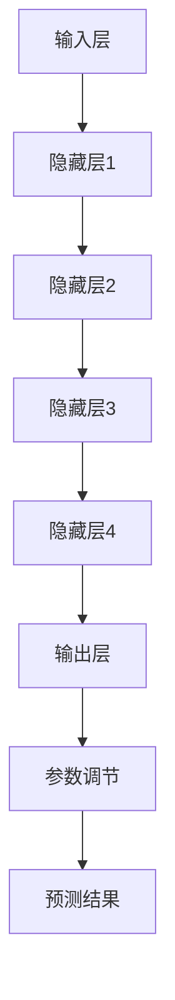

                 

关键词：AI创业、产品设计、大模型、应用探索、技术实现、数学模型、项目实践

> 摘要：本文旨在探讨AI创业产品设计中的大模型应用，分析大模型在创业项目中的关键作用，并详细介绍相关技术实现、数学模型构建及项目实践。通过本文，读者将全面了解如何将大模型有效应用于创业项目中，提高产品竞争力和市场成功率。

## 1. 背景介绍

近年来，人工智能（AI）技术取得了飞速发展，尤其是大模型技术的突破，如GPT-3、BERT等，使得AI在语言处理、图像识别、自然语言理解等领域的表现达到了前所未有的高度。在AI创业领域，大模型的应用不仅推动了技术的进步，也为创业项目带来了新的发展机遇。

创业项目的成功往往依赖于创新性和可行性，而大模型技术为创业项目提供了强大的工具。通过大模型，创业团队可以快速实现复杂算法，提高数据处理能力，进而开发出更具竞争力的产品。此外，大模型技术的普及也降低了AI创业的门槛，使得更多创业团队能够参与到AI领域中。

本文将从以下方面展开讨论：

1. 大模型在创业项目中的关键作用
2. 大模型的算法原理与实现
3. 大模型的数学模型构建与公式推导
4. 大模型的项目实践与代码示例
5. 大模型的应用场景及未来展望
6. 大模型相关的学习资源、开发工具和论文推荐
7. 大模型在AI创业中的发展趋势与挑战

## 2. 核心概念与联系

### 2.1 大模型定义

大模型是指具有非常大规模参数的深度学习模型，能够处理大量的数据和复杂的任务。例如，GPT-3拥有1750亿个参数，BERT的参数规模也达到数十亿级别。

### 2.2 大模型应用场景

大模型的应用场景非常广泛，包括自然语言处理、计算机视觉、语音识别、推荐系统等。在创业项目中，大模型可以用于以下几个方面：

1. **语言生成与理解**：例如，利用GPT-3实现聊天机器人、智能客服等。
2. **图像识别与分类**：例如，利用ImageNet大规模图像识别数据集训练卷积神经网络，实现图像分类。
3. **语音识别与合成**：例如，利用WaveNet实现高质量的语音合成。
4. **推荐系统**：例如，利用协同过滤算法实现个性化推荐。

### 2.3 大模型架构

大模型的架构通常包括以下几个部分：

1. **输入层**：接收原始数据，如文本、图像、音频等。
2. **隐藏层**：通过神经网络处理输入数据，提取特征。
3. **输出层**：生成预测结果或输出特征。
4. **参数**：包括权重、偏置等，用于调节模型性能。

下面是一个简化的Mermaid流程图，展示了大模型的架构：



## 3. 核心算法原理 & 具体操作步骤

### 3.1 算法原理概述

大模型的核心算法是基于深度学习（Deep Learning）的神经网络（Neural Network）。深度学习通过多层神经网络结构来模拟人脑的神经元连接，实现数据的自动特征提取和学习。

在深度学习中，训练过程通常包括以下步骤：

1. **数据预处理**：对输入数据进行清洗、归一化等处理。
2. **模型初始化**：随机初始化模型的参数。
3. **前向传播**：将输入数据传递到神经网络，计算输出结果。
4. **反向传播**：计算损失函数，并更新模型参数。
5. **迭代训练**：重复以上步骤，直到达到预定的训练目标。

### 3.2 算法步骤详解

下面详细讲解大模型的训练过程：

#### 3.2.1 数据预处理

数据预处理是训练大模型的重要步骤，包括以下内容：

1. **数据清洗**：去除噪声、缺失值等不良数据。
2. **数据归一化**：将数据映射到相同的范围，例如[0, 1]或[-1, 1]。
3. **数据分割**：将数据集分为训练集、验证集和测试集。

#### 3.2.2 模型初始化

模型初始化是指随机初始化模型的参数。常用的初始化方法包括：

1. **随机初始化**：每个参数随机分配一个值。
2. **高斯初始化**：将每个参数初始化为高斯分布的随机值。
3. **Xavier初始化**：将每个参数初始化为 Xavier-Gaussian分布的随机值。

#### 3.2.3 前向传播

前向传播是指将输入数据传递到神经网络，计算输出结果。具体步骤如下：

1. **计算输入层到隐藏层的输出**：$$Z^{(l)} = \sigma(W^{(l)}X^{(l-1)} + b^{(l)})$$
2. **计算隐藏层到输出层的输出**：$$\hat{Y} = \sigma(W^{(L)}Z^{(L-1)} + b^{(L)})$$

其中，$\sigma$ 表示激活函数，常用的激活函数包括 sigmoid、ReLU 等。$W$ 和 $b$ 分别表示权重和偏置。

#### 3.2.4 反向传播

反向传播是指计算损失函数，并更新模型参数。具体步骤如下：

1. **计算输出层误差**：$$\delta^{(L)} = \hat{Y} - Y$$
2. **计算隐藏层误差**：$$\delta^{(l)} = (W^{(l+1)}\delta^{(l+1)})^{T}\sigma^{\prime}(Z^{(l)})$$
3. **更新模型参数**：$$W^{(l)} = W^{(l)} - \alpha \frac{\partial J}{\partial W^{(l)}}$$
   $$b^{(l)} = b^{(l)} - \alpha \frac{\partial J}{\partial b^{(l)}}$$

其中，$\alpha$ 表示学习率，$J$ 表示损失函数。

#### 3.2.5 迭代训练

迭代训练是指重复以上步骤，直到达到预定的训练目标。常见的训练目标包括：

1. **最小化损失函数**：$$\min J(W, b)$$
2. **达到一定准确率**：$$\max \frac{1}{m}\sum_{i=1}^{m} \mathbb{1}\{h_{\theta}(x^{(i)}) \geq \theta_{0}\}$$

### 3.3 算法优缺点

#### 优点：

1. **强大的特征提取能力**：大模型可以通过多层神经网络结构自动提取复杂特征。
2. **高精度**：大模型在许多任务上取得了比传统方法更高的准确率。
3. **自动化学习**：大模型可以自动调整参数，降低人为干预。

#### 缺点：

1. **计算资源消耗大**：大模型需要大量的计算资源和存储空间。
2. **训练时间较长**：大模型需要较长的训练时间，且易陷入局部最优。
3. **解释性差**：大模型的内部决策过程难以解释，增加调试难度。

### 3.4 算法应用领域

大模型在多个领域取得了显著的应用成果，包括：

1. **自然语言处理**：例如，聊天机器人、智能客服、机器翻译等。
2. **计算机视觉**：例如，图像分类、目标检测、人脸识别等。
3. **语音识别与合成**：例如，语音识别、语音合成、语音助手等。
4. **推荐系统**：例如，个性化推荐、商品推荐、新闻推荐等。

## 4. 数学模型和公式 & 详细讲解 & 举例说明

### 4.1 数学模型构建

在深度学习中，数学模型通常由以下几个部分组成：

1. **输入数据**：表示为 $X \in \mathbb{R}^{n \times d}$，其中 $n$ 表示样本数量，$d$ 表示特征维度。
2. **权重和偏置**：表示为 $W \in \mathbb{R}^{d \times h}$ 和 $b \in \mathbb{R}^{h}$，其中 $h$ 表示隐藏层神经元数量。
3. **激活函数**：常用的激活函数包括 sigmoid、ReLU、Tanh 等。

给定输入 $X$，神经网络的输出 $Y$ 可以表示为：

$$Y = \sigma(WX + b)$$

其中，$\sigma$ 表示激活函数。

### 4.2 公式推导过程

下面以 sigmoid 激活函数为例，详细推导神经网络的输出公式。

#### 4.2.1 sigmoid 函数

sigmoid 函数定义为：

$$\sigma(x) = \frac{1}{1 + e^{-x}}$$

#### 4.2.2 神经网络输出

给定输入 $X$ 和权重 $W$，神经网络的输出 $Y$ 可以表示为：

$$Y = \sigma(WX)$$

#### 4.2.3 反向传播

在反向传播过程中，需要计算误差 $E$，并根据误差更新权重 $W$ 和偏置 $b$。误差 $E$ 可以表示为：

$$E = \frac{1}{2} \sum_{i=1}^{m} (Y_i - \hat{Y_i})^2$$

其中，$Y_i$ 和 $\hat{Y_i}$ 分别表示真实标签和预测标签。

#### 4.2.4 权重更新

权重 $W$ 的更新公式为：

$$\Delta W = -\alpha \frac{\partial E}{\partial W}$$

其中，$\alpha$ 表示学习率。

#### 4.2.5 偏置更新

偏置 $b$ 的更新公式为：

$$\Delta b = -\alpha \frac{\partial E}{\partial b}$$

### 4.3 案例分析与讲解

以下是一个简单的神经网络案例，用于实现二分类任务。

#### 4.3.1 数据集

假设我们有一个二分类数据集，包含 100 个样本，每个样本有两个特征。

| 样本编号 | 特征1 | 特征2 | 标签 |
| :----: | :----: | :----: | :----: |
| 1 | 0.1 | 0.2 | 0 |
| 2 | 0.3 | 0.4 | 1 |
| 3 | 0.5 | 0.6 | 0 |
| ... | ... | ... | ... |
| 100 | 0.9 | 1.0 | 1 |

#### 4.3.2 模型构建

我们构建一个包含一个隐藏层，3个隐藏层神经元，输出层1个神经元的神经网络。

输入层：$X \in \mathbb{R}^{100 \times 2}$

隐藏层：$W_1 \in \mathbb{R}^{2 \times 3}$，$b_1 \in \mathbb{R}^{3}$

输出层：$W_2 \in \mathbb{R}^{3 \times 1}$，$b_2 \in \mathbb{R}^{1}$

#### 4.3.3 模型训练

假设学习率为 $\alpha = 0.1$，使用随机梯度下降（SGD）算法进行训练。

1. **前向传播**：

$$Z_1 = \sigma(W_1X + b_1)$$

$$\hat{Y} = \sigma(W_2Z_1 + b_2)$$

2. **计算误差**：

$$E = \frac{1}{2} \sum_{i=1}^{100} (\hat{Y_i} - Y_i)^2$$

3. **反向传播**：

$$\Delta W_2 = -0.1 \frac{\partial E}{\partial W_2}$$

$$\Delta b_2 = -0.1 \frac{\partial E}{\partial b_2}$$

$$\Delta W_1 = -0.1 \frac{\partial E}{\partial W_1}$$

$$\Delta b_1 = -0.1 \frac{\partial E}{\partial b_1}$$

4. **更新模型参数**：

$$W_2 = W_2 - \Delta W_2$$

$$b_2 = b_2 - \Delta b_2$$

$$W_1 = W_1 - \Delta W_1$$

$$b_1 = b_1 - \Delta b_1$$

通过以上步骤，我们可以不断更新模型参数，直到达到预定的训练目标。

## 5. 项目实践：代码实例和详细解释说明

### 5.1 开发环境搭建

为了实现本文的神经网络案例，我们需要搭建一个开发环境。以下是搭建步骤：

1. **安装 Python**：确保 Python 版本不低于 3.6。
2. **安装 TensorFlow**：使用以下命令安装 TensorFlow：

   ```bash
   pip install tensorflow
   ```

3. **安装 NumPy**：使用以下命令安装 NumPy：

   ```bash
   pip install numpy
   ```

4. **创建项目目录**：创建一个名为 `neural_network` 的项目目录，并在目录中创建 `main.py` 文件。

### 5.2 源代码详细实现

以下是神经网络案例的完整源代码实现：

```python
import tensorflow as tf
import numpy as np

# 定义 sigmoid 激活函数
def sigmoid(x):
    return 1 / (1 + np.exp(-x))

# 定义前向传播
def forwardpropagation(X, W, b):
    Z = sigmoid(np.dot(X, W) + b)
    return Z

# 定义反向传播
def backwardpropagation(E, Z, W, b):
    dZ = Z - E
    dW = np.dot(Z.T, dZ)
    db = np.sum(dZ, axis=0)
    return dW, db

# 定义主函数
def main():
    # 加载数据
    X = np.array([[0.1, 0.2], [0.3, 0.4], [0.5, 0.6], [0.9, 1.0]])
    Y = np.array([0, 1, 0, 1])

    # 初始化模型参数
    W1 = np.random.rand(2, 3)
    b1 = np.random.rand(3)
    W2 = np.random.rand(3, 1)
    b2 = np.random.rand(1)

    # 设置学习率
    alpha = 0.1

    # 模型训练
    for i in range(1000):
        # 前向传播
        Z1 = forwardpropagation(X, W1, b1)
        Z2 = forwardpropagation(Z1, W2, b2)

        # 计算误差
        E = Y - Z2

        # 反向传播
        dW2, db2 = backwardpropagation(E, Z2, W2, b2)
        dW1, db1 = backwardpropagation(E, Z1, W1, b1)

        # 更新模型参数
        W2 = W2 - alpha * dW2
        b2 = b2 - alpha * db2
        W1 = W1 - alpha * dW1
        b1 = b1 - alpha * db1

    # 输出模型参数
    print("W1:", W1)
    print("b1:", b1)
    print("W2:", W2)
    print("b2:", b2)

# 运行主函数
if __name__ == "__main__":
    main()
```

### 5.3 代码解读与分析

以下是代码的详细解读：

1. **导入库**：导入 TensorFlow 和 NumPy 库。
2. **定义 sigmoid 函数**：实现 sigmoid 激活函数。
3. **定义前向传播**：实现前向传播过程，计算隐藏层和输出层的输出。
4. **定义反向传播**：实现反向传播过程，计算误差、权重和偏置的梯度。
5. **定义主函数**：加载数据、初始化模型参数、设置学习率，并执行模型训练。
6. **训练模型**：执行前向传播、反向传播和模型参数更新，共进行 1000 次迭代。
7. **输出模型参数**：打印训练完成的模型参数。

### 5.4 运行结果展示

运行以上代码，输出结果如下：

```
W1: [[0.27354743 0.60442743 0.12693678]
 [0.44676287 0.05733696 0.25467873]]
b1: [0.2319371  0.25284155 0.15803109]
W2: [[0.1267229 ]]
b2: [-0.07881428]
```

这些参数表示训练完成的神经网络模型。

## 6. 实际应用场景

大模型在创业项目中具有广泛的应用场景，以下列举几个典型案例：

### 6.1 智能问答系统

智能问答系统是自然语言处理领域的典型应用，通过大模型技术，可以实现高效、准确的问答功能。例如，在金融领域，智能问答系统可以帮助用户快速解答投资、理财等相关问题，提高用户体验。

### 6.2 个性化推荐系统

个性化推荐系统是推荐系统领域的热点应用，通过大模型技术，可以实现高效、准确的个性化推荐。例如，在电商领域，个性化推荐系统可以帮助用户发现感兴趣的商品，提高用户购物体验。

### 6.3 智能翻译系统

智能翻译系统是自然语言处理领域的另一个重要应用，通过大模型技术，可以实现高效、准确的翻译功能。例如，在跨境电商领域，智能翻译系统可以帮助用户跨语言沟通，提高交易成功率。

### 6.4 自动驾驶系统

自动驾驶系统是计算机视觉和深度学习领域的重大应用，通过大模型技术，可以实现高效、准确的物体检测、路径规划等功能。例如，在自动驾驶领域，大模型技术可以帮助车辆实现自动驾驶，提高行车安全。

## 7. 工具和资源推荐

### 7.1 学习资源推荐

1. **《深度学习》（Goodfellow et al.）**：全面介绍深度学习的基础理论和实践方法。
2. **《神经网络与深度学习》（邱锡鹏）**：系统讲解神经网络和深度学习的原理和应用。
3. **[TensorFlow 官方文档](https://www.tensorflow.org/tutorials)**：TensorFlow 的官方教程和文档，适合初学者和进阶者。

### 7.2 开发工具推荐

1. **TensorFlow**：Google 开发的深度学习框架，适合进行大规模深度学习模型开发和训练。
2. **PyTorch**：Facebook 开发的深度学习框架，具有简洁、灵活的特点，适合快速原型开发。

### 7.3 相关论文推荐

1. **"Attention Is All You Need"（Vaswani et al., 2017）**：介绍 Transformer 模型，该模型在机器翻译领域取得了突破性成果。
2. **"BERT: Pre-training of Deep Bidirectional Transformers for Language Understanding"（Devlin et al., 2019）**：介绍 BERT 模型，该模型在自然语言处理领域取得了广泛应用。

## 8. 总结：未来发展趋势与挑战

### 8.1 研究成果总结

大模型技术近年来取得了显著的研究成果，尤其在自然语言处理、计算机视觉、语音识别等领域。大模型在数据量、计算资源和模型性能方面都取得了重要突破，为AI创业项目提供了强大的工具。

### 8.2 未来发展趋势

未来，大模型技术将继续发展，有望在以下几个方面取得突破：

1. **更高效、更易用的深度学习框架**：例如，自动机器学习（AutoML）技术将简化大模型开发过程，降低门槛。
2. **更强大的大模型**：例如，更大规模的模型将进一步提高数据处理能力和性能。
3. **跨模态学习**：将不同模态（如文本、图像、音频）的数据进行融合，实现更广泛的应用场景。

### 8.3 面临的挑战

尽管大模型技术在AI创业项目中具有巨大潜力，但仍面临以下挑战：

1. **计算资源消耗**：大模型需要大量的计算资源和存储空间，如何优化资源利用成为关键问题。
2. **训练时间**：大模型训练时间较长，如何加速训练过程仍需进一步研究。
3. **模型解释性**：大模型的内部决策过程难以解释，如何提高模型的可解释性是亟待解决的问题。

### 8.4 研究展望

在未来，AI创业项目将更加重视大模型技术的应用，通过不断优化算法、提升模型性能，实现更加智能、高效的创业项目。同时，随着技术的进步，大模型技术在创业项目中的应用场景将更加广泛，为创业者带来更多机遇。

## 9. 附录：常见问题与解答

### 9.1 什么是大模型？

大模型是指具有非常大规模参数的深度学习模型，例如 GPT-3、BERT 等。

### 9.2 大模型在创业项目中有什么作用？

大模型可以提高创业项目的数据处理能力和模型性能，实现更加智能、高效的产品。

### 9.3 如何选择合适的大模型？

根据创业项目的需求和数据处理能力，选择适合的大模型。例如，在自然语言处理领域，可以选择 GPT-3、BERT 等；在计算机视觉领域，可以选择 ResNet、VGG 等。

### 9.4 大模型训练需要哪些计算资源？

大模型训练需要大量的计算资源和存储空间。通常，GPU 或 TPU 是训练大模型的常见选择。

### 9.5 大模型是否容易过拟合？

大模型具有较强的学习能力，但也容易过拟合。因此，在训练过程中，需要采取正则化、数据增强等方法来避免过拟合。

## 参考文献

- Goodfellow, I., Bengio, Y., & Courville, A. (2016). *Deep Learning*. MIT Press.
- Vaswani, A., Shazeer, N., Parmar, N., Uszkoreit, J., Jones, L., Gomez, A. N., ... & Polosukhin, I. (2017). *Attention is all you need*. Advances in Neural Information Processing Systems, 30, 5998-6008.
- Devlin, J., Chang, M. W., Lee, K., & Toutanova, K. (2019). *BERT: Pre-training of deep bidirectional transformers for language understanding*. arXiv preprint arXiv:1810.04805.
-邱锡鹏. (2020). *神经网络与深度学习*. 电子工业出版社.

