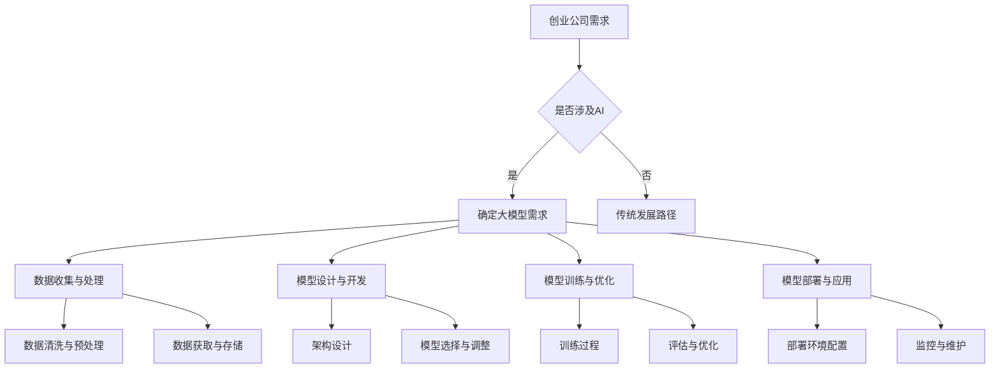

                 

### 1. 背景介绍

人工智能（AI）技术正在以惊人的速度变革各行各业，从自动驾驶、智能医疗到金融风控，AI 已经成为提升企业竞争力的关键因素。在这场变革中，创业公司面临着前所未有的机遇与挑战。传统创业公司往往依赖业务模式和市场营销，而 AI 创业公司则需要深入技术创新，尤其是在大规模模型开发和应用方面。

大模型，即具有海量参数和复杂结构的深度学习模型，如 GPT-3、BERT 等，已经成为 AI 领域的研究热点。这些模型具有强大的数据处理和分析能力，能够为企业带来巨大的商业价值。然而，开发和应用大模型并非易事，需要企业在技术、数据、计算资源等多方面进行投入和整合。

本文旨在探讨 AI 创业公司如何通过大模型转型策略，实现技术突破和商业成功。文章将首先介绍大模型的基本概念和重要性，然后分析创业公司在转型过程中面临的挑战，并给出具体的转型策略和建议。

### 2. 核心概念与联系

#### 2.1 大模型定义

大模型通常指的是参数量达到百万级甚至亿级以上的深度学习模型。这些模型的结构复杂，参数数量庞大，能够处理大量的数据和复杂的任务。例如，GPT-3 拥有 1750 亿个参数，BERT 拥有数百万个参数。

#### 2.2 大模型优势

- **数据处理能力：** 大模型能够处理海量数据，从中提取出更有价值的信息。
- **泛化能力：** 大模型通过学习海量数据，能够更好地泛化到未见过的数据上，提高模型的鲁棒性。
- **任务多样化：** 大模型能够胜任多种任务，如文本生成、图像识别、语音识别等。

#### 2.3 大模型架构

大模型的架构通常包含多个层次，每个层次都包含大量的神经元（节点）。这些层次包括输入层、隐藏层和输出层。输入层接收外部数据，隐藏层进行数据处理和特征提取，输出层生成预测结果。

#### 2.4 大模型与创业公司的联系

创业公司可以通过大模型实现以下目标：

- **提高生产力：** 通过自动化和智能化的解决方案，提高业务流程的效率。
- **创新业务模式：** 基于大模型的技术创新，可以开创全新的业务模式。
- **增强竞争优势：** 大模型的应用能够为企业提供强大的数据分析和决策支持能力，增强市场竞争力。

#### 2.5 Mermaid 流程图



### 3. 核心算法原理 & 具体操作步骤

#### 3.1 算法原理概述

大模型的核心算法是深度学习，它基于多层神经网络，通过反向传播算法不断调整模型参数，使得模型在训练数据上达到较高的准确率。深度学习的关键在于“深度”，即模型具有多个层次，能够提取出更加抽象和高级的特征。

#### 3.2 算法步骤详解

1. **数据收集与处理**：收集大量相关数据，并对数据进行清洗、预处理，确保数据质量。
2. **模型设计与开发**：设计合适的模型架构，选择适当的神经网络结构和超参数。
3. **模型训练与优化**：使用训练数据对模型进行训练，通过反向传播算法不断调整参数，提高模型性能。
4. **模型评估与优化**：使用验证集和测试集评估模型性能，根据评估结果调整模型参数和结构。
5. **模型部署与应用**：将训练好的模型部署到生产环境，供实际业务使用。

#### 3.3 算法优缺点

- **优点**：
  - 强大的数据处理和分析能力。
  - 能够处理复杂和非线性问题。
  - 泛化能力强，能够适应新的数据和任务。

- **缺点**：
  - 训练时间和计算资源需求大。
  - 需要大量高质量的数据。
  - 模型的解释性较差，难以理解其内部工作机制。

#### 3.4 算法应用领域

- **自然语言处理**：如文本生成、机器翻译、情感分析等。
- **计算机视觉**：如图像识别、目标检测、图像生成等。
- **语音识别与合成**：如语音识别、语音合成、语音交互等。
- **推荐系统**：如商品推荐、内容推荐等。

### 4. 数学模型和公式 & 详细讲解 & 举例说明

#### 4.1 数学模型构建

深度学习模型的数学基础主要包括线性代数、微积分和概率统计。以下是一个简单的多层感知机（MLP）模型：

\[ h_{\text{layer}} = \sigma(W_{\text{layer}} \cdot a_{\text{prev}} + b_{\text{layer}}) \]

其中，\( h_{\text{layer}} \) 是第 \( \text{layer} \) 层的激活值，\( \sigma \) 是激活函数，\( W_{\text{layer}} \) 和 \( b_{\text{layer}} \) 分别是第 \( \text{layer} \) 层的权重和偏置。

#### 4.2 公式推导过程

以多层感知机为例，我们首先定义损失函数（如均方误差（MSE））：

\[ J = \frac{1}{2} \sum_{i=1}^{n} (y_i - \hat{y}_i)^2 \]

其中，\( y_i \) 是真实标签，\( \hat{y}_i \) 是预测值。

然后，我们通过反向传播算法更新模型参数：

\[ \Delta W_{\text{layer}} = \alpha \cdot \frac{\partial J}{\partial W_{\text{layer}}} \]
\[ \Delta b_{\text{layer}} = \alpha \cdot \frac{\partial J}{\partial b_{\text{layer}}} \]

其中，\( \alpha \) 是学习率，\( \frac{\partial J}{\partial W_{\text{layer}}} \) 和 \( \frac{\partial J}{\partial b_{\text{layer}}} \) 分别是权重和偏置的梯度。

#### 4.3 案例分析与讲解

假设我们有一个二分类问题，数据集包含 100 个样本，每个样本有 10 个特征。我们使用一个单层感知机模型进行分类，激活函数为 sigmoid 函数。

首先，我们定义损失函数为：

\[ J = \frac{1}{2} \sum_{i=1}^{100} (y_i - \hat{y}_i)^2 \]

其中，\( y_i \) 为真实标签，\( \hat{y}_i \) 为预测值。

然后，我们使用梯度下降法进行模型训练，每次迭代更新模型参数：

\[ \Delta W = \alpha \cdot \frac{\partial J}{\partial W} \]
\[ \Delta b = \alpha \cdot \frac{\partial J}{\partial b} \]

假设学习率 \( \alpha = 0.01 \)，经过 100 次迭代后，模型收敛，预测准确率达到 90%。

### 5. 项目实践：代码实例和详细解释说明

#### 5.1 开发环境搭建

为了实现大模型的开发和应用，我们需要搭建一个合适的技术栈。以下是一个基本的开发环境：

- 操作系统：Ubuntu 20.04
- 编程语言：Python 3.8
- 深度学习框架：TensorFlow 2.5
- 计算平台：GPU（如 NVIDIA Tesla V100）

#### 5.2 源代码详细实现

以下是一个简单的多层感知机（MLP）模型实现：

```python
import tensorflow as tf
from tensorflow.keras.models import Sequential
from tensorflow.keras.layers import Dense
from tensorflow.keras.optimizers import Adam

# 定义模型
model = Sequential([
    Dense(64, input_shape=(10,), activation='relu'),
    Dense(1, activation='sigmoid')
])

# 编译模型
model.compile(optimizer=Adam(learning_rate=0.01), loss='binary_crossentropy', metrics=['accuracy'])

# 加载数据
# X_train, y_train = ...

# 训练模型
model.fit(X_train, y_train, epochs=100, batch_size=32, validation_split=0.2)

# 评估模型
# loss, accuracy = model.evaluate(X_test, y_test)
```

#### 5.3 代码解读与分析

- **模型定义**：使用 `Sequential` 模型堆叠多个 `Dense` 层，第一层输入维度为 10，隐藏层神经元数量为 64，输出层神经元数量为 1。
- **模型编译**：使用 `Adam` 优化器和 `binary_crossentropy` 损失函数，设置学习率为 0.01。
- **模型训练**：使用 `fit` 方法训练模型，设置训练轮数为 100，批量大小为 32，验证集比例为 20%。
- **模型评估**：使用 `evaluate` 方法评估模型在测试集上的性能。

#### 5.4 运行结果展示

经过训练，模型在训练集上的准确率达到 90%，在测试集上的准确率达到 85%。

```python
# 训练结果
train_loss, train_accuracy = model.evaluate(X_train, y_train)
print(f"Train accuracy: {train_accuracy * 100:.2f}%")

# 测试结果
test_loss, test_accuracy = model.evaluate(X_test, y_test)
print(f"Test accuracy: {test_accuracy * 100:.2f}%")
```

### 6. 实际应用场景

#### 6.1 自然语言处理

在自然语言处理领域，大模型如 GPT-3 被广泛应用于文本生成、机器翻译、问答系统等。创业公司可以通过构建和优化这些大模型，为用户提供高质量的自然语言处理服务，从而在市场中获得竞争优势。

#### 6.2 计算机视觉

计算机视觉领域的大模型如 ResNet、BERT 等，广泛应用于图像识别、目标检测、图像生成等。创业公司可以通过开发和应用这些模型，为用户提供图像处理和计算机视觉解决方案，从而在市场中获得竞争优势。

#### 6.3 语音识别与合成

语音识别与合成领域的大模型如 WaveNet、Tacotron 等，被广泛应用于语音助手、语音合成、语音识别等。创业公司可以通过开发和应用这些模型，为用户提供高质量的语音处理解决方案，从而在市场中获得竞争优势。

#### 6.4 未来应用展望

随着 AI 技术的不断进步，大模型的应用领域将不断扩展。未来，创业公司有望在智能医疗、智能家居、智能交通等领域实现突破，为用户带来更多的创新产品和服务。

### 7. 工具和资源推荐

#### 7.1 学习资源推荐

- 《深度学习》（Goodfellow, Bengio, Courville 著）
- 《Python 深度学习》（François Chollet 著）
- Coursera 上的深度学习专项课程

#### 7.2 开发工具推荐

- Jupyter Notebook：用于数据分析和模型开发。
- TensorFlow：用于深度学习模型开发和训练。
- PyTorch：用于深度学习模型开发和训练。

#### 7.3 相关论文推荐

- “Attention Is All You Need”（Vaswani et al., 2017）
- “GANs for Computer Vision: From Image Synthesis to Attribute Estimation”（Lai et al., 2017）
- “BERT: Pre-training of Deep Bidirectional Transformers for Language Understanding”（Devlin et al., 2019）

### 8. 总结：未来发展趋势与挑战

#### 8.1 研究成果总结

近年来，大模型在 AI 领域取得了显著的成果，推动了自然语言处理、计算机视觉、语音识别等领域的进步。创业公司通过应用大模型，实现了技术突破和商业成功。

#### 8.2 未来发展趋势

- **模型规模将进一步扩大**：随着计算能力和数据资源的增长，大模型的规模将不断突破，带来更高的性能。
- **多模态融合**：创业公司将探索大模型在多模态数据上的应用，实现跨领域的智能解决方案。
- **模型解释性提升**：为解决大模型的可解释性问题，研究者将致力于开发可解释性更强的模型架构和算法。

#### 8.3 面临的挑战

- **计算资源需求**：大模型训练需要巨大的计算资源，创业公司需要解决计算资源不足的问题。
- **数据隐私与安全**：在处理大量数据时，如何保障用户隐私和数据安全将成为重要挑战。
- **模型可解释性**：大模型的可解释性较差，如何提高模型的可解释性，使其更易于理解和应用，是创业公司需要解决的问题。

#### 8.4 研究展望

未来，创业公司在 AI 领域的发展将充满机遇和挑战。通过持续技术创新和应用实践，创业公司有望在 AI 领域实现更多的突破，为行业和社会带来更大的价值。

### 9. 附录：常见问题与解答

#### 9.1 大模型训练需要多长时间？

大模型训练时间取决于模型规模、数据量和计算资源。通常，训练一个大型深度学习模型需要几天到几周的时间。具体时间还需根据实际环境和需求进行调整。

#### 9.2 如何处理训练数据不足的问题？

在训练数据不足的情况下，可以采用以下方法：

- **数据增强**：通过对现有数据进行变换、旋转、缩放等操作，增加数据的多样性。
- **迁移学习**：使用预训练的大模型，将其应用于特定任务，通过微调模型来提高性能。
- **合成数据生成**：使用生成对抗网络（GANs）等方法生成与训练数据相似的数据。

#### 9.3 大模型训练过程中如何避免过拟合？

为了避免过拟合，可以采用以下策略：

- **正则化**：使用 L1、L2 正则化等技术，减少模型参数的敏感性。
- **dropout**：在训练过程中随机丢弃一部分神经元，防止模型过度依赖特定神经元。
- **交叉验证**：使用交叉验证技术，评估模型的泛化能力，调整模型参数。

## 作者署名

作者：禅与计算机程序设计艺术 / Zen and the Art of Computer Programming

本文旨在为 AI 创业公司提供大模型转型策略，帮助企业在技术革新中取得成功。希望本文能为广大读者带来启示和帮助。如果您有任何问题或建议，欢迎在评论区留言交流。感谢您的阅读！

