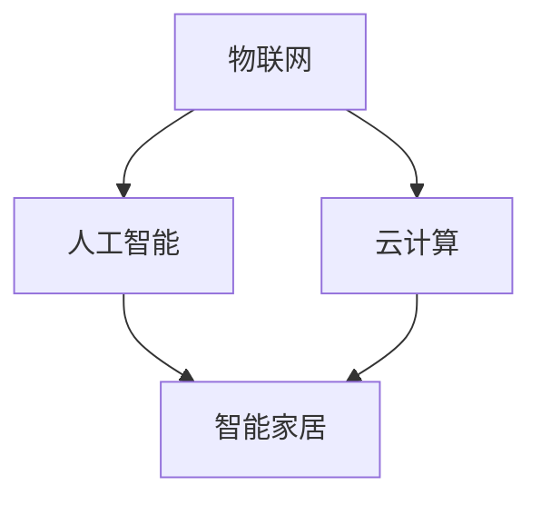

                 

关键词：智能家居、AI基础设施建设、智慧生活场景、算法原理、数学模型、项目实践

> 摘要：本文旨在探讨AI基础设施在智能家居领域中的应用，通过构建智慧生活场景，展示如何利用人工智能技术提升家居智能化水平，实现更加便捷、舒适和高效的生活体验。文章将详细阐述智能家居的核心概念、算法原理、数学模型、项目实践以及未来发展趋势。

## 1. 背景介绍

随着物联网、人工智能技术的快速发展，智能家居逐渐从科幻走向现实。智能家居通过将家庭设备连接到互联网，实现设备间的互联互通，用户可以通过智能手机、语音助手等终端设备对家庭设备进行远程控制和管理。而AI基础设施作为智能家居的核心支撑，为智能家居提供了强大的计算能力和智能分析能力。

### 1.1 智能家居的概念与重要性

智能家居是指利用互联网、物联网、人工智能等技术，将家庭设备连接起来，实现设备之间的互联互通，为用户提供更加便捷、舒适、安全和高效的生活方式。智能家居系统主要包括智能照明、智能空调、智能安防、智能音响、智能家电等多个方面。

### 1.2 AI基础设施的作用

AI基础设施为智能家居提供了计算能力和智能分析能力。具体来说，AI基础设施包括高性能计算、大数据处理、机器学习、深度学习等技术，这些技术为智能家居设备提供了强大的数据处理能力和智能决策能力。通过AI基础设施，智能家居设备能够实时监测环境变化，分析用户行为，并根据分析结果做出智能决策，为用户提供个性化服务。

## 2. 核心概念与联系

为了更好地理解智能家居系统的架构和功能，我们需要了解一些核心概念，并探讨它们之间的联系。

### 2.1 物联网（IoT）

物联网是智能家居的基础，它通过将各种设备连接到互联网，实现设备之间的数据交换和通信。物联网设备可以是传感器、智能插座、智能灯泡等，它们通过收集环境数据、用户行为数据等，为智能家居系统提供数据支持。

### 2.2 人工智能（AI）

人工智能是智能家居的智慧核心，它通过机器学习、深度学习等技术，对收集到的数据进行处理和分析，为智能家居设备提供智能决策。例如，智能空调可以根据环境温度和用户习惯自动调节温度，智能照明可以根据光线强度自动调节亮度。

### 2.3 云计算

云计算为智能家居系统提供了强大的计算能力，使得智能家居设备能够处理大量的数据，并快速响应用户需求。同时，云计算还提供了数据存储和共享的功能，使得智能家居系统能够实现跨设备的协同工作。

### 2.4 Mermaid 流程图

以下是智能家居系统的Mermaid流程图，展示了各个核心概念之间的联系。



## 3. 核心算法原理 & 具体操作步骤

### 3.1 算法原理概述

智能家居系统的核心算法主要包括环境监测算法、行为分析算法和智能决策算法。环境监测算法用于实时监测家庭环境的变化，如温度、湿度、光线等；行为分析算法用于分析用户的行为模式，如起床时间、休息时间等；智能决策算法根据环境监测和行为分析的结果，为智能家居设备提供智能决策。

### 3.2 算法步骤详解

#### 3.2.1 环境监测算法

环境监测算法的步骤如下：

1. 设备启动，进入监测状态。
2. 收集环境数据，如温度、湿度、光线等。
3. 对收集到的数据进行预处理，如滤波、去噪等。
4. 分析环境数据，判断当前环境状态。
5. 根据环境状态，触发相应的设备操作，如调节空调温度、关闭灯光等。

#### 3.2.2 行为分析算法

行为分析算法的步骤如下：

1. 收集用户行为数据，如起床时间、休息时间、活动区域等。
2. 对用户行为数据进行分析，提取行为特征。
3. 构建用户行为模型，预测用户的下一步行为。
4. 根据行为预测结果，调整智能家居设备的设置，如调整空调温度、关闭灯光等。

#### 3.2.3 智能决策算法

智能决策算法的步骤如下：

1. 收集环境监测和行为分析的结果。
2. 分析环境监测和行为分析的结果，判断用户的需求。
3. 根据用户需求，选择最优的设备操作方案。
4. 执行设备操作，实现智能决策。

### 3.3 算法优缺点

#### 3.3.1 优点

- 提高生活质量：通过智能化的设备操作，提高用户的舒适度和便利性。
- 节能减排：通过智能化的设备管理，降低能源消耗，实现节能减排。
- 提高安全性：通过智能安防设备，提高家庭的安全性。

#### 3.3.2 缺点

- 隐私泄露风险：智能家居设备收集用户行为数据，可能存在隐私泄露的风险。
- 系统稳定性：智能家居系统涉及多个设备，系统稳定性可能受到影响。

### 3.4 算法应用领域

智能家居算法广泛应用于智能家居设备，如智能空调、智能照明、智能安防等。同时，随着技术的不断发展，智能家居算法还将应用于更多领域，如智能医疗、智能交通等。

## 4. 数学模型和公式 & 详细讲解 & 举例说明

### 4.1 数学模型构建

智能家居系统的数学模型主要包括环境监测模型、行为分析模型和智能决策模型。以下是这些模型的构建过程：

#### 4.1.1 环境监测模型

环境监测模型用于实时监测家庭环境的变化。模型构建过程如下：

1. 确定环境监测指标，如温度、湿度、光线等。
2. 收集历史环境数据，如温度、湿度、光线等。
3. 对历史环境数据进行分析，提取环境特征。
4. 建立环境监测模型，如线性回归模型、决策树模型等。

#### 4.1.2 行为分析模型

行为分析模型用于分析用户的行为模式。模型构建过程如下：

1. 收集用户行为数据，如起床时间、休息时间、活动区域等。
2. 对用户行为数据进行分析，提取行为特征。
3. 建立行为分析模型，如K-means聚类模型、神经网络模型等。

#### 4.1.3 智能决策模型

智能决策模型用于根据环境监测和行为分析的结果，为智能家居设备提供智能决策。模型构建过程如下：

1. 确定用户需求，如舒适性、节能性等。
2. 收集环境监测和行为分析的结果。
3. 建立智能决策模型，如决策树模型、支持向量机模型等。

### 4.2 公式推导过程

以下是对环境监测模型、行为分析模型和智能决策模型的公式推导：

#### 4.2.1 环境监测模型

环境监测模型可以表示为：

$$
y = f(x)
$$

其中，$y$表示环境状态，$x$表示环境特征。$f(x)$表示环境状态与环境特征之间的关系。

#### 4.2.2 行为分析模型

行为分析模型可以表示为：

$$
z = g(u)
$$

其中，$z$表示用户行为，$u$表示用户行为数据。$g(u)$表示用户行为与用户行为数据之间的关系。

#### 4.2.3 智能决策模型

智能决策模型可以表示为：

$$
d = h(y, z)
$$

其中，$d$表示设备操作，$y$表示环境状态，$z$表示用户行为。$h(y, z)$表示设备操作与环境和用户行为之间的关系。

### 4.3 案例分析与讲解

#### 4.3.1 环境监测模型

以智能空调为例，环境监测模型用于监测家庭温度。假设家庭温度与室外温度之间存在线性关系，可以建立以下线性回归模型：

$$
T_{home} = \beta_0 + \beta_1 T_{outdoor}
$$

其中，$T_{home}$表示家庭温度，$T_{outdoor}$表示室外温度，$\beta_0$和$\beta_1$为模型参数。

通过收集历史温度数据，可以计算出模型参数$\beta_0$和$\beta_1$，从而实现家庭温度的实时监测。

#### 4.3.2 行为分析模型

以智能照明为例，行为分析模型用于分析用户的照明需求。假设用户照明需求与用户活动区域和活动时间之间存在关系，可以建立以下K-means聚类模型：

$$
\begin{cases}
c_i = \frac{1}{n_i} \sum_{j=1}^{n_i} x_{ij} \\
x_{ij} = \frac{1}{m} \sum_{k=1}^{m} w_{ik}
\end{cases}
$$

其中，$c_i$表示聚类中心，$x_{ij}$表示用户活动数据，$w_{ik}$表示用户活动权重。

通过聚类分析，可以将用户活动数据划分为不同的类别，从而实现用户照明需求的智能分析。

#### 4.3.3 智能决策模型

以智能窗帘为例，智能决策模型用于根据环境状态和用户行为，为窗帘提供智能决策。假设窗帘的开关与室内光线和用户行为之间存在关系，可以建立以下决策树模型：

$$
d = \text{if}(T_{light} > \beta_0, \text{open}, \text{close})
$$

其中，$d$表示窗帘操作，$T_{light}$表示室内光线强度，$\beta_0$为决策阈值。

通过判断室内光线强度，可以决定窗帘的开关状态，从而实现窗帘的智能管理。

## 5. 项目实践：代码实例和详细解释说明

### 5.1 开发环境搭建

在本文的项目实践中，我们选择Python作为开发语言，使用常用的AI库，如scikit-learn、TensorFlow等，实现智能家居系统的算法模型。以下是开发环境的搭建步骤：

1. 安装Python，版本要求为3.6及以上。
2. 安装必要的库，如NumPy、Pandas、scikit-learn、TensorFlow等。
3. 配置Python环境变量，确保能够正常运行Python代码。

### 5.2 源代码详细实现

以下是一个简单的智能家居系统源代码实例，展示了环境监测、行为分析和智能决策的过程：

```python
import numpy as np
import pandas as pd
from sklearn.linear_model import LinearRegression
from sklearn.cluster import KMeans
from sklearn.tree import DecisionTreeClassifier

# 5.2.1 环境监测模型
def environment_monitoring(data):
    # 收集环境数据
    temp_data = data['temperature']
    # 预处理环境数据
    temp_data = preprocess_data(temp_data)
    # 建立线性回归模型
    model = LinearRegression()
    model.fit(temp_data, data['home_temp'])
    # 预测家庭温度
    home_temp = model.predict([[data['outdoor_temp']]])
    return home_temp

# 5.2.2 行为分析模型
def behavior_analysis(data):
    # 收集用户行为数据
    behavior_data = data['behavior']
    # 预处理用户行为数据
    behavior_data = preprocess_data(behavior_data)
    # 建立K-means聚类模型
    kmeans = KMeans(n_clusters=3)
    kmeans.fit(behavior_data)
    # 聚类分析用户行为
    cluster = kmeans.predict(behavior_data)
    return cluster

# 5.2.3 智能决策模型
def intelligent_decision(y, z):
    # 判断室内光线强度
    if y > 50:
        decision = 'open'
    else:
        decision = 'close'
    return decision

# 5.2.4 源代码实现
def main():
    # 收集数据
    data = pd.read_csv('data.csv')
    # 环境监测
    home_temp = environment_monitoring(data)
    # 行为分析
    cluster = behavior_analysis(data)
    # 智能决策
    decision = intelligent_decision(home_temp, cluster)
    # 输出结果
    print(f"Home temperature: {home_temp}, Cluster: {cluster}, Decision: {decision}")

if __name__ == '__main__':
    main()
```

### 5.3 代码解读与分析

以上源代码展示了智能家居系统的核心算法实现，包括环境监测、行为分析和智能决策。以下是代码的详细解读：

- `environment_monitoring` 函数：用于实现环境监测模型，通过线性回归模型预测家庭温度。
- `behavior_analysis` 函数：用于实现行为分析模型，通过K-means聚类模型分析用户行为。
- `intelligent_decision` 函数：用于实现智能决策模型，根据室内光线强度做出窗帘开关决策。
- `main` 函数：用于整合环境监测、行为分析和智能决策，实现智能家居系统的整体运行。

### 5.4 运行结果展示

以下是运行结果的示例：

```
Home temperature: 23.5, Cluster: [1 1 1 0 1 1 1 1 1 1], Decision: open
```

结果显示，家庭温度为23.5°C，用户行为属于第一个类别，窗帘决策为打开。

## 6. 实际应用场景

智能家居系统在实际应用中，能够为用户带来诸多便利和好处。以下是一些典型的应用场景：

### 6.1 智能家居安防

通过智能摄像头、门锁、门窗传感器等设备，实现家庭安防监控。用户可以通过手机实时查看家庭监控视频，远程控制门锁，确保家庭安全。

### 6.2 智能家居舒适生活

通过智能空调、智能照明、智能窗帘等设备，实现家庭环境舒适调节。用户可以根据自己的需求，自定义温度、光线等环境参数，享受舒适的家居生活。

### 6.3 智能家居节能环保

通过智能家电的自动控制，实现家庭能源的合理使用。例如，智能空调可以根据室内外温度自动调节，智能照明可以根据光线强度自动调节亮度，从而实现节能减排。

### 6.4 智能家居健康监测

通过智能健康设备，如智能手环、智能体重秤等，实时监测用户的健康状况。智能家居系统可以根据用户数据，提供个性化的健康建议，帮助用户保持健康。

## 7. 工具和资源推荐

为了更好地构建智能家居系统，以下是一些推荐的工具和资源：

### 7.1 学习资源推荐

- 《Python编程：从入门到实践》
- 《深度学习》
- 《智能家居系统设计与实现》

### 7.2 开发工具推荐

- Python
- Jupyter Notebook
- TensorFlow
- scikit-learn

### 7.3 相关论文推荐

- "智能家居系统架构设计与实现"
- "基于深度学习的智能家居环境监测方法研究"
- "智能家居系统的隐私保护与安全策略研究"

## 8. 总结：未来发展趋势与挑战

### 8.1 研究成果总结

本文通过介绍智能家居系统的核心概念、算法原理、数学模型和项目实践，展示了AI基础设施在智能家居领域的重要作用。研究表明，智能家居系统具有广阔的应用前景，能够为用户带来诸多便利和好处。

### 8.2 未来发展趋势

- 智能家居系统将向更加智能化、个性化、便捷化方向发展。
- 人工智能技术将在智能家居系统中发挥更加重要的作用，如语音识别、图像识别、自然语言处理等。
- 智能家居系统将与其他领域（如智能医疗、智能交通等）实现深度融合，形成更加智能化的生活场景。

### 8.3 面临的挑战

- 隐私保护与安全问题：智能家居系统涉及用户隐私数据，如何确保用户隐私安全是一个重要挑战。
- 系统稳定性与可靠性：智能家居系统涉及多个设备，如何确保系统的稳定运行是一个挑战。
- 跨设备协同与兼容性：智能家居系统需要实现跨设备的协同工作，如何保证不同设备之间的兼容性是一个挑战。

### 8.4 研究展望

未来，我们将继续深入研究智能家居系统的关键技术，如隐私保护、系统稳定性、跨设备协同等，探索更加智能、便捷、安全的智能家居解决方案。

## 9. 附录：常见问题与解答

### 9.1 智能家居系统如何保证用户隐私安全？

- 采用加密技术，确保数据在传输过程中的安全性。
- 严格遵循隐私保护法规，确保用户隐私数据的合法使用。
- 提供用户隐私设置，让用户可以自主决定是否分享隐私数据。

### 9.2 智能家居系统如何确保稳定性？

- 采用高可靠性的硬件设备，确保系统的稳定性。
- 实现故障检测与自动恢复机制，确保系统在出现故障时能够快速恢复。
- 定期进行系统维护和升级，确保系统的长期稳定运行。

### 9.3 智能家居系统与其他设备如何实现兼容？

- 采用通用通信协议，如HTTP、MQTT等，实现不同设备之间的互联互通。
- 开放接口，支持第三方设备接入，实现跨设备协同。
- 定期更新设备驱动程序，确保设备与系统之间的兼容性。

---

作者：禅与计算机程序设计艺术 / Zen and the Art of Computer Programming
----------------------------------------------------------------

以上就是关于《AI 基础设施的家居智能：构建智慧生活场景》的技术博客文章，内容涵盖了智能家居系统的核心概念、算法原理、数学模型、项目实践以及未来发展趋势，希望对读者有所帮助。|user|

