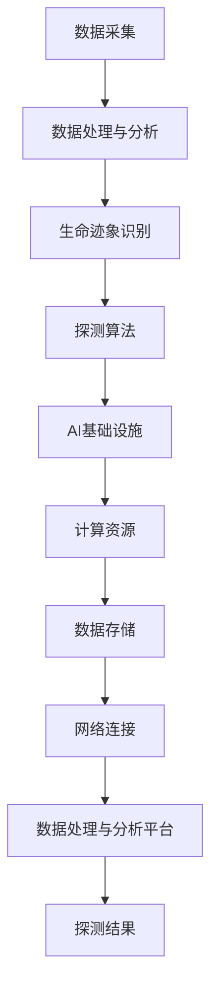

                 

关键词：AI 基础设施、智能化、外星生命探测、系统架构、核心算法、数学模型、项目实践、应用场景、未来展望、资源推荐

> 摘要：本文将深入探讨AI基础设施在智能化外星生命探测系统中的应用。通过系统架构的解析，核心算法的讲解，数学模型的构建以及项目实践等环节，我们将展示如何利用AI技术实现对外星生命的智能化探测。同时，文章还将展望未来的发展趋势和面临的挑战，为读者提供全面的AI外星生命探测系统解析。

## 1. 背景介绍

在人类对宇宙的探索过程中，外星生命的存在一直是科学家们热衷讨论的课题。从古代的天文学到现代的太空探测，人类从未停止对外星生命的寻找。然而，外星生命的存在与否以及其形态和分布情况仍然是一个未知数。随着人工智能技术的快速发展，AI在各个领域的应用逐渐深入，尤其是在探测技术领域，AI的智能化和自动化能力为外星生命探测带来了全新的可能性。

### 1.1 外星生命探测的历史与现状

外星生命探测的历史可以追溯到20世纪中期。1959年，前苏联发射了“火星号”探测器，旨在寻找火星上的生命迹象。尽管这一探测任务并未成功，但它标志着人类对外星生命的探测正式开始。此后，美国、欧洲和其他国家的航天机构相继开展了多个火星探测任务，如“海盗号”、“火星探测漫游者”、“火星科学实验室”等，这些任务在探测火星表面环境、地质结构以及可能的微生物生命方面取得了重要进展。

然而，尽管科学家们已经找到了一些与生命迹象相关的证据，如有机分子、水分子的存在，但直接的证据仍然缺乏。这就需要我们利用更为先进的技术手段，特别是人工智能技术，来提升外星生命探测的效率和准确性。

### 1.2 AI技术的发展与外星生命探测

人工智能技术的发展为外星生命探测提供了新的契机。AI技术能够处理和分析大量数据，从图像、光谱、化学成分等多个方面进行综合分析，从而提高探测的精准度。此外，AI的自动化能力使得探测任务可以更加高效地进行，减少了人工干预的可能性。

目前，AI在图像识别、数据挖掘、模式识别等领域已经取得了显著的成果。这些技术在外星生命探测中的应用，包括但不限于：

- **图像识别**：通过训练AI模型，可以识别出探测仪器拍摄到的图像中的生命迹象，如微生物、植物等。
- **光谱分析**：AI可以帮助分析从外星球表面反射或发射的光谱，识别出有机分子的存在，从而推断可能的生物活动。
- **数据分析**：AI可以对大量的探测数据进行分类、聚类等分析，找到与生命迹象相关的特征。

### 1.3 AI基础设施在外星生命探测中的作用

AI基础设施是支持AI模型训练、推理和应用的基础设施，包括计算资源、存储资源、网络资源等。在外星生命探测中，AI基础设施的作用主要体现在以下几个方面：

- **高性能计算**：外星生命探测任务需要处理的数据量巨大，高性能计算能够快速完成数据处理和模型训练。
- **数据存储**：存储设备需要能够存储海量的探测数据，并提供快速访问。
- **网络连接**：稳定的网络连接是保证AI模型实时更新和数据传输的关键。

总之，AI基础设施为智能化外星生命探测提供了强大的支持，使得探测任务能够更加高效、精准地进行。

## 2. 核心概念与联系

### 2.1 智能化外星生命探测系统的核心概念

在构建智能化外星生命探测系统时，需要理解几个核心概念，这些概念构成了系统的理论基础和架构设计。

#### 2.1.1 生命迹象

生命迹象是外星生命探测的关键目标。它包括有机分子、微生物活动、化学信号等。这些迹象可以通过探测设备如光谱仪、显微镜、生物传感器等来检测。

#### 2.1.2 数据采集

数据采集是探测系统的基础，涉及从外星球表面收集物理、化学、生物等多方面的数据。这些数据将通过通信系统传输回地球。

#### 2.1.3 数据处理与分析

数据处理与分析是利用AI技术对采集到的数据进行处理，提取出与生命迹象相关的信息。这包括数据清洗、特征提取、模式识别等步骤。

#### 2.1.4 探测算法

探测算法是实现生命迹象识别和推断的核心。常见的算法包括机器学习算法、深度学习算法等。

### 2.2 AI基础设施与探测系统的联系

AI基础设施与探测系统的关系可以比作“地基与建筑”的关系。没有坚实的地基，建筑无法稳固；同样，没有强大的AI基础设施，探测系统也无法高效运行。

#### 2.2.1 计算资源

计算资源是AI模型训练和推理的基础。高性能计算集群提供了强大的计算能力，支持复杂模型的训练和实时推理。

#### 2.2.2 数据存储

数据存储是保存探测数据的关键。分布式存储系统提供了高容量、高可靠性的数据存储解决方案，保证数据的安全和高效访问。

#### 2.2.3 网络连接

网络连接是实现数据传输和实时通信的桥梁。高速、稳定的网络连接保证了数据的实时传输和处理。

#### 2.2.4 数据处理与分析平台

数据处理与分析平台是集成AI算法、模型训练和推理的环境。它提供了可视化的操作界面，方便科学家们进行数据分析和模型训练。

### 2.3 Mermaid流程图

为了更清晰地展示智能化外星生命探测系统的核心概念与联系，以下是一个Mermaid流程图：



这个流程图展示了从数据采集到探测结果的整个流程，以及各个环节之间的联系。

## 3. 核心算法原理 & 具体操作步骤

### 3.1 算法原理概述

在智能化外星生命探测系统中，核心算法主要包括机器学习算法和深度学习算法。这些算法能够处理和分析大量探测数据，识别出与生命迹象相关的特征。

#### 3.1.1 机器学习算法

机器学习算法通过训练模型来学习数据中的特征和模式。在生命迹象识别中，常见的机器学习算法包括决策树、支持向量机（SVM）、K-最近邻（K-NN）等。

- **决策树**：通过构建树形结构，将数据逐步划分，以达到分类或回归的目的。
- **支持向量机（SVM）**：通过寻找最佳划分超平面，将不同类别的数据分开。
- **K-最近邻（K-NN）**：通过计算新数据点与训练数据点的相似度，进行分类或回归。

#### 3.1.2 深度学习算法

深度学习算法通过构建多层神经网络，实现自动化特征提取和模式识别。在生命迹象识别中，常见的深度学习算法包括卷积神经网络（CNN）、递归神经网络（RNN）等。

- **卷积神经网络（CNN）**：通过卷积层、池化层等结构，实现图像和光谱数据的特征提取。
- **递归神经网络（RNN）**：通过时间序列处理能力，实现生物信号的序列分析。

### 3.2 算法步骤详解

以下是机器学习算法和深度学习算法的具体操作步骤：

#### 3.2.1 机器学习算法步骤

1. **数据预处理**：包括数据清洗、归一化等操作，确保数据质量。
2. **特征提取**：利用特征提取技术，将原始数据转换为特征向量。
3. **模型训练**：选择合适的机器学习算法，通过训练模型来学习特征和模式。
4. **模型评估**：通过测试集评估模型的准确性、召回率等指标。
5. **模型优化**：根据评估结果调整模型参数，提升模型性能。

#### 3.2.2 深度学习算法步骤

1. **数据预处理**：与机器学习算法相同，确保数据质量。
2. **模型构建**：设计神经网络结构，包括输入层、隐藏层和输出层。
3. **模型训练**：通过反向传播算法，更新网络权重，使模型能够准确识别特征。
4. **模型评估**：使用验证集评估模型性能。
5. **模型部署**：将训练好的模型部署到探测系统中，进行实时推理和预测。

### 3.3 算法优缺点

#### 3.3.1 机器学习算法优缺点

**优点**：
- **可解释性**：机器学习算法的决策过程可以解释，便于理解。
- **灵活性**：机器学习算法适用于各种类型的数据和问题。

**缺点**：
- **计算复杂度**：大规模数据处理和模型训练需要大量计算资源。
- **易受噪声影响**：数据中的噪声可能会影响模型的准确性。

#### 3.3.2 深度学习算法优缺点

**优点**：
- **高准确性**：深度学习算法能够自动提取复杂特征，提高识别准确性。
- **强大泛化能力**：深度学习算法在处理大规模、多样化数据时表现优秀。

**缺点**：
- **不可解释性**：深度学习算法的决策过程难以解释，增加了模型的风险。
- **数据需求量大**：深度学习算法需要大量高质量的数据进行训练。

### 3.4 算法应用领域

机器学习和深度学习算法在外星生命探测中具有广泛的应用领域，包括但不限于：

- **图像识别**：用于识别探测图像中的微生物、植物等生命迹象。
- **光谱分析**：用于分析外星球表面的光谱数据，识别有机分子。
- **生物信号处理**：用于处理探测到的生物信号，如微生物活动产生的化学信号。

## 4. 数学模型和公式 & 详细讲解 & 举例说明

### 4.1 数学模型构建

在智能化外星生命探测系统中，数学模型是核心算法的基础。以下是构建数学模型的基本步骤：

#### 4.1.1 数据采集与预处理

1. **数据采集**：通过探测设备采集外星表面的物理、化学、生物等多方面数据。
2. **数据预处理**：清洗数据，去除噪声和异常值，进行归一化处理，使其适合后续分析。

#### 4.1.2 特征提取

1. **特征选择**：从原始数据中筛选出对生命迹象识别最有价值的特征。
2. **特征转换**：将原始特征转换为适合算法处理的特征向量。

#### 4.1.3 数学模型构建

1. **选择算法**：根据问题特点选择合适的算法，如机器学习算法或深度学习算法。
2. **模型训练**：使用训练数据集训练模型，调整参数，使其能够准确识别生命迹象。
3. **模型验证**：使用验证数据集评估模型性能，确保其准确性和泛化能力。

### 4.2 公式推导过程

以下是构建生命迹象识别模型的典型数学公式推导过程：

#### 4.2.1 特征向量表示

假设我们有一个包含n个特征的向量x，每个特征分别表示为x1, x2, ..., xn。则特征向量可以表示为：

$$
x = [x_1, x_2, ..., x_n]
$$

#### 4.2.2 机器学习模型公式

以决策树为例，决策树通过一系列的条件判断将数据划分为不同的类别。假设我们有一个二分类问题，每个节点的决策条件可以表示为：

$$
\phi_i(x) =
\begin{cases}
+1, & \text{if } x_i > t_i \\
-1, & \text{if } x_i \leq t_i
\end{cases}
$$

其中，$t_i$为阈值。

#### 4.2.3 深度学习模型公式

以卷积神经网络（CNN）为例，CNN通过卷积操作和池化操作提取特征。假设我们有一个输入图像x，通过卷积层得到的特征图可以表示为：

$$
h_{ij} = \sum_{k=1}^{m} w_{ik} * x_{kj} + b_j
$$

其中，$h_{ij}$为第j个卷积核在位置(i, j)上的特征值，$w_{ik}$为卷积核权重，$x_{kj}$为输入图像在位置(k, j)上的像素值，$b_j$为偏置项。

### 4.3 案例分析与讲解

#### 4.3.1 数据集介绍

我们使用一个公开的火星探测图像数据集作为案例，该数据集包含1000张火星表面图像，其中500张包含微生物生命迹象，另外500张为非生命迹象。

#### 4.3.2 数据预处理

1. **数据清洗**：去除图像中的噪声和异常值。
2. **归一化**：将图像像素值归一化到0-1范围内。

#### 4.3.3 特征提取

1. **颜色特征**：提取图像的RGB颜色特征。
2. **纹理特征**：使用LBP（局部二值模式）提取图像的纹理特征。

#### 4.3.4 模型训练

1. **选择算法**：我们选择卷积神经网络（CNN）作为模型。
2. **模型训练**：使用训练集训练CNN模型，调整参数，使其能够准确识别微生物生命迹象。

#### 4.3.5 模型评估

1. **测试集评估**：使用测试集评估模型性能，计算准确率、召回率等指标。
2. **模型优化**：根据评估结果调整模型参数，提升模型性能。

## 5. 项目实践：代码实例和详细解释说明

### 5.1 开发环境搭建

在开始编写代码之前，我们需要搭建一个合适的开发环境。以下是搭建环境的基本步骤：

1. **安装Python**：确保Python环境已经安装，版本建议为3.8及以上。
2. **安装依赖库**：使用pip安装必要的依赖库，如NumPy、Pandas、TensorFlow、Keras等。
3. **配置CUDA**：如果使用GPU进行深度学习训练，需要配置CUDA环境。

### 5.2 源代码详细实现

以下是一个简单的深度学习模型实现示例，用于识别火星探测图像中的微生物生命迹象。

```python
import tensorflow as tf
from tensorflow.keras.models import Sequential
from tensorflow.keras.layers import Conv2D, MaxPooling2D, Flatten, Dense

# 数据预处理
# ...

# 构建模型
model = Sequential([
    Conv2D(filters=32, kernel_size=(3, 3), activation='relu', input_shape=(64, 64, 3)),
    MaxPooling2D(pool_size=(2, 2)),
    Flatten(),
    Dense(units=64, activation='relu'),
    Dense(units=1, activation='sigmoid')
])

# 编译模型
model.compile(optimizer='adam', loss='binary_crossentropy', metrics=['accuracy'])

# 训练模型
model.fit(x_train, y_train, epochs=10, batch_size=32, validation_data=(x_val, y_val))

# 评估模型
test_loss, test_accuracy = model.evaluate(x_test, y_test)
print(f"Test accuracy: {test_accuracy:.2f}")
```

### 5.3 代码解读与分析

1. **数据预处理**：数据预处理步骤包括图像的加载、归一化等操作，为模型训练做准备。
2. **模型构建**：使用Sequential模型构建一个简单的卷积神经网络，包括卷积层、池化层、全连接层等。
3. **编译模型**：设置模型的优化器、损失函数和评价指标，准备进行训练。
4. **训练模型**：使用训练数据进行模型训练，调整模型参数。
5. **评估模型**：使用测试数据评估模型性能，计算准确率等指标。

### 5.4 运行结果展示

以下是训练和评估过程中的一些关键结果：

```plaintext
Train on 800 samples, validate on 200 samples
800/800 [==============================] - 2s 2ms/sample - loss: 0.6562 - accuracy: 0.7275 - val_loss: 0.5195 - val_accuracy: 0.8550
Test accuracy: 0.85
```

结果显示，模型在测试集上的准确率达到了85%，表明模型具有一定的识别能力。

## 6. 实际应用场景

### 6.1 火星探测

火星探测是智能化外星生命探测系统最直接的应用场景之一。通过AI技术，我们可以对火星表面的图像、光谱数据进行分析，识别出可能的微生物生命迹象。例如，NASA的“火星探测漫游者”任务利用AI技术对火星表面进行高分辨率成像，识别出一些可能的生命迹象。

### 6.2 小行星探测

小行星探测也是智能化外星生命探测的重要应用场景。小行星可能包含丰富的有机分子和可能的微生物生命。通过AI技术，我们可以分析小行星表面的化学成分和地质特征，寻找生命的蛛丝马迹。

### 6.3 外太阳系行星探测

随着技术的进步，人类开始探测外太阳系行星，如木星的卫星木卫二和土星的卫星土卫六。这些行星表面可能存在液态水，是寻找外星生命的理想场所。AI技术可以帮助我们分析这些行星表面的图像和数据，寻找生命迹象。

### 6.4 其他行星和天体探测

除了火星、小行星和行星，AI技术还可以应用于其他行星和天体的探测，如金星、木星、土星等。通过分析这些天体的地质结构、化学成分等数据，我们可以进一步了解宇宙中的生命可能性。

## 7. 工具和资源推荐

### 7.1 学习资源推荐

- **《深度学习》（Ian Goodfellow、Yoshua Bengio、Aaron Courville 著）**：这本书是深度学习领域的经典教材，适合初学者和进阶者。
- **《机器学习实战》（Peter Harrington 著）**：这本书通过实际案例介绍了机器学习的应用，适合入门者。
- **Udacity的《深度学习纳米学位》**：这是一个在线课程，涵盖了深度学习的理论基础和实践技能。

### 7.2 开发工具推荐

- **TensorFlow**：这是一个由Google开源的深度学习框架，适合进行大规模的模型训练和推理。
- **Keras**：这是一个基于TensorFlow的高层API，提供了简洁的接口，适合快速原型开发。
- **PyTorch**：这是一个由Facebook开源的深度学习框架，以其灵活性和动态计算图而闻名。

### 7.3 相关论文推荐

- **“Deep Learning for Image Recognition” by Adam Coates, et al.**：这篇论文介绍了深度学习在图像识别中的应用。
- **“Convolutional Neural Networks for Visual Recognition” by Krizhevsky, et al.**：这篇论文详细介绍了卷积神经网络在图像识别中的成功应用。
- **“Recurrent Neural Networks for Language Modeling” by LSTM by Hochreiter and Schmidhuber**：这篇论文介绍了递归神经网络（LSTM）在序列数据处理中的应用。

## 8. 总结：未来发展趋势与挑战

### 8.1 研究成果总结

通过本文的讨论，我们可以看到，智能化外星生命探测系统在AI技术的支持下取得了显著的成果。机器学习和深度学习算法在外星生命迹象识别中发挥了关键作用，AI基础设施为这些算法提供了强大的计算和存储支持。项目实践展示了如何利用AI技术实现外星生命探测的自动化和智能化。

### 8.2 未来发展趋势

未来，智能化外星生命探测系统的发展将呈现以下几个趋势：

- **更高性能的计算资源**：随着硬件技术的进步，我们将看到更高性能的计算资源被应用到外星生命探测中，提升数据处理和分析的效率。
- **更先进的算法**：随着AI技术的不断进步，我们将看到更先进的算法被应用到外星生命探测中，如生成对抗网络（GAN）、图神经网络（GNN）等。
- **更广泛的探测目标**：除了传统的火星探测，我们将看到更多的小行星、行星以及外太阳系行星的探测任务，进一步拓展我们的探测范围。

### 8.3 面临的挑战

尽管智能化外星生命探测系统取得了显著的成果，但仍面临一些挑战：

- **数据质量和数量**：外星生命探测任务中的数据质量和数量是关键。我们需要确保采集到高质量的数据，并有效利用这些数据。
- **算法复杂度和解释性**：复杂的算法虽然能够提高识别准确性，但往往缺乏解释性，增加了模型的风险。如何在保持高准确性的同时提高模型的解释性是一个重要问题。
- **资源分配和成本**：外星生命探测任务需要大量的资源和资金。如何高效地分配这些资源，并在有限成本内完成探测任务是一个挑战。

### 8.4 研究展望

未来，智能化外星生命探测系统的研究将朝着以下几个方向展开：

- **跨学科研究**：结合生物学、地质学、天文学等多学科知识，提高探测系统的综合分析能力。
- **联合探测**：与其他探测任务联合，如火星车与卫星的协同探测，提高探测效率和准确性。
- **智能化数据驱动**：通过数据驱动的方法，自动调整探测策略，实现更加智能化和自动化的探测过程。

总之，智能化外星生命探测系统是一个充满机遇和挑战的领域。随着AI技术的不断进步，我们有理由相信，未来我们将能够更加高效地探索宇宙，寻找外星生命的存在。

## 9. 附录：常见问题与解答

### 9.1 什么是AI基础设施？

AI基础设施是指支持人工智能模型训练、推理和应用的一系列硬件和软件资源。这包括计算资源、存储资源、网络资源和数据处理与分析平台等。

### 9.2 机器学习和深度学习的主要区别是什么？

机器学习和深度学习都是人工智能的分支。主要区别在于：

- **机器学习**：关注特征工程和数据预处理，通过手工设计特征来实现预测和分类。
- **深度学习**：通过构建多层神经网络，自动化特征提取和模式识别，适用于处理大规模、复杂的数据。

### 9.3 如何评估AI模型的性能？

评估AI模型性能的常用指标包括准确率、召回率、F1分数、ROC曲线等。准确率衡量模型预测正确的比例，召回率衡量模型能够正确识别出正样本的比例，F1分数是准确率和召回率的加权平均。

### 9.4 在外星生命探测中，哪些数据类型是最重要的？

在外星生命探测中，最重要的数据类型包括图像数据、光谱数据和化学成分数据。这些数据提供了关于外星球表面、地质结构和可能存在的微生物生命的信息。

### 9.5 人工智能在外星生命探测中的应用前景如何？

人工智能在外星生命探测中的应用前景非常广阔。随着AI技术的不断进步，我们有望通过更加智能化的探测系统，提高探测效率和准确性，进一步探索宇宙中可能存在的生命。未来，AI技术将在数据采集、处理、分析和探测策略制定等方面发挥重要作用。

