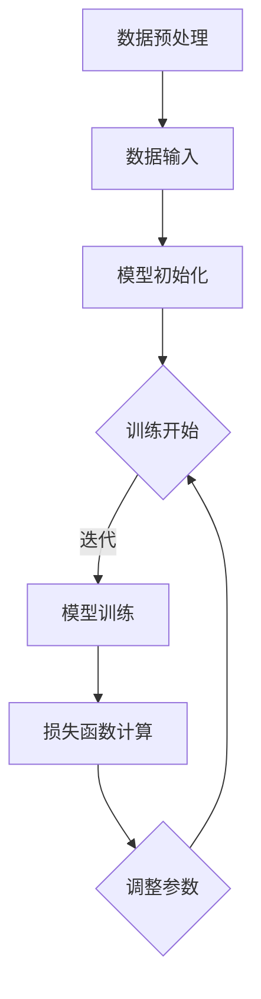

                 

关键词：人工智能、大模型、商业优势、创业、AI技术、商业模式、市场机会、盈利模式

摘要：随着人工智能技术的不断进步，大模型已经成为推动AI发展的关键力量。本文将探讨AI大模型在创业中的商业优势，分析其核心算法原理、应用场景、未来发展，以及创业者如何利用这些优势打造成功的企业。

## 1. 背景介绍

近年来，人工智能（AI）技术的飞速发展已经深刻改变了我们的生活方式和工作方式。其中，大模型（Large Models）作为AI技术的核心，正引领着行业变革。大模型通常具有数十亿甚至数万亿个参数，通过深度学习算法，能够自动从大量数据中学习复杂的模式和规律。

大模型的崛起，得益于计算能力的提升、数据量的爆炸性增长以及深度学习算法的创新。这些因素的共同作用，使得大模型在图像识别、自然语言处理、推荐系统等多个领域取得了突破性的成果。

在商业领域，大模型的商业潜力不可忽视。许多企业已经开始利用大模型优化业务流程、提高效率、创造新的商业模式。创业公司通过开发和部署大模型，有望在竞争激烈的市场中脱颖而出。

## 2. 核心概念与联系

### 2.1 大模型定义

大模型是指具有海量参数的深度学习模型。这些模型通常通过大规模数据集进行训练，以实现高精度的预测和分类。

### 2.2 大模型工作原理

大模型的工作原理基于神经网络。神经网络由大量简单的人工神经元组成，通过层层堆叠形成复杂的网络结构。每个神经元都接受来自前一层神经元的输入，并产生一个输出。经过多次迭代训练，神经网络能够自动调整神经元之间的连接权重，以最小化预测误差。

### 2.3 大模型与传统算法对比

与传统的机器学习算法相比，大模型具有以下优势：

- **更高的精度**：大模型能够从大量数据中学习到更复杂的模式。
- **更强的泛化能力**：大模型在训练数据之外的数据上表现同样出色。
- **更广泛的适用性**：大模型可以应用于多个领域，如图像识别、自然语言处理、推荐系统等。

### 2.4 大模型应用场景

大模型在以下场景中具有明显的优势：

- **图像识别**：大模型可以准确识别各种复杂的图像。
- **自然语言处理**：大模型能够理解和生成人类语言。
- **推荐系统**：大模型可以根据用户行为预测其兴趣，提供个性化的推荐。
- **自动化决策**：大模型可以辅助决策者进行复杂的决策。

### 2.5 Mermaid 流程图

下面是一个描述大模型训练过程的 Mermaid 流程图：



## 3. 核心算法原理 & 具体操作步骤

### 3.1 算法原理概述

大模型的算法原理主要基于深度学习和神经网络。深度学习是一种机器学习技术，通过多层神经网络对数据进行建模，以实现复杂的预测和分类任务。

神经网络由输入层、隐藏层和输出层组成。输入层接收外部输入，隐藏层通过逐层提取特征，输出层产生最终的预测结果。在训练过程中，神经网络通过反向传播算法不断调整权重，以最小化预测误差。

### 3.2 算法步骤详解

1. **数据收集与预处理**：收集大量数据，并对数据进行清洗、标准化等预处理操作。
2. **模型初始化**：初始化神经网络权重，通常使用随机初始化方法。
3. **模型训练**：通过迭代训练，神经网络不断调整权重，以最小化损失函数。
4. **模型评估**：使用测试集评估模型性能，调整超参数，优化模型。
5. **模型部署**：将训练好的模型部署到生产环境，实现自动化预测和决策。

### 3.3 算法优缺点

**优点**：

- **高精度**：大模型能够从大量数据中学习到复杂的模式，实现高精度的预测。
- **泛化能力强**：大模型在训练数据之外的数据上表现良好，具有更强的泛化能力。
- **适用性广泛**：大模型可以应用于多个领域，如图像识别、自然语言处理、推荐系统等。

**缺点**：

- **计算资源消耗大**：大模型训练需要大量的计算资源和时间。
- **数据依赖性高**：大模型对数据质量有较高要求，数据量不足或质量差可能导致模型性能下降。
- **解释性差**：大模型的学习过程复杂，难以解释和理解。

### 3.4 算法应用领域

大模型在以下领域具有广泛的应用：

- **图像识别**：应用于医疗影像诊断、自动驾驶、安全监控等。
- **自然语言处理**：应用于智能客服、智能写作、机器翻译等。
- **推荐系统**：应用于电子商务、社交媒体、在线教育等。
- **自动化决策**：应用于金融风控、智能物流、智能制造等。

## 4. 数学模型和公式 & 详细讲解 & 举例说明

### 4.1 数学模型构建

大模型通常基于深度学习算法，其中最常用的算法是反向传播算法（Backpropagation Algorithm）。反向传播算法通过以下步骤实现：

1. **前向传播**：将输入数据通过神经网络传递，得到预测结果。
2. **损失函数计算**：计算预测结果与真实结果之间的差距，即损失函数。
3. **反向传播**：根据损失函数计算梯度，调整神经网络权重。

### 4.2 公式推导过程

假设有一个多层神经网络，其中包含输入层、隐藏层和输出层。设输入向量为\(x\)，隐藏层向量为\(h\)，输出向量为\(y\)。设神经网络共有\(L\)层，其中\(L-1\)层为隐藏层。

1. **前向传播公式**：

   $$ z^{(l)} = W^{(l-1)}h^{(l-1)} + b^{(l-1)} $$

   $$ a^{(l)} = \sigma(z^{(l)}) $$

   其中，\(z^{(l)}\)为第\(l\)层的输出，\(a^{(l)}\)为第\(l\)层的激活值，\(\sigma\)为激活函数，\(W^{(l-1)}\)为第\(l-1\)层的权重，\(b^{(l-1)}\)为第\(l-1\)层的偏置。

2. **损失函数计算**：

   $$ J = \frac{1}{2} \sum_{i=1}^{n} (y_i - a^{(L)})^2 $$

   其中，\(y_i\)为真实结果，\(a^{(L)}\)为输出层的激活值，\(n\)为样本数量。

3. **反向传播公式**：

   $$ \delta^{(L)} = \frac{\partial J}{\partial a^{(L)}} $$

   $$ \delta^{(l)} = \delta^{(l+1)} \cdot \frac{\partial a^{(l+1)}}{\partial z^{(l)}} $$

   其中，\(\delta^{(L)}\)为输出层的误差，\(\delta^{(l)}\)为第\(l\)层的误差。

### 4.3 案例分析与讲解

假设有一个二分类问题，目标是判断一张图片是否包含动物。数据集包含1000张图片，其中500张包含动物，500张不包含动物。使用一个三层神经网络进行训练，其中输入层有784个神经元，隐藏层有100个神经元，输出层有2个神经元。

1. **模型初始化**：随机初始化权重和偏置。
2. **模型训练**：通过迭代训练，调整权重和偏置，最小化损失函数。
3. **模型评估**：使用测试集评估模型性能，计算准确率、召回率等指标。

经过多次迭代训练，模型最终达到预定的准确率。在实际应用中，可以将训练好的模型部署到生产环境，实现自动化图片分类。

## 5. 项目实践：代码实例和详细解释说明

### 5.1 开发环境搭建

1. **硬件环境**：一台配置较高的计算机或服务器，推荐使用GPU加速训练过程。
2. **软件环境**：安装Python、TensorFlow等深度学习框架。

### 5.2 源代码详细实现

以下是实现上述案例的三层神经网络代码：

```python
import tensorflow as tf

# 定义模型结构
model = tf.keras.Sequential([
    tf.keras.layers.Dense(100, activation='relu', input_shape=(784,)),
    tf.keras.layers.Dense(2, activation='sigmoid')
])

# 编译模型
model.compile(optimizer='adam', loss='binary_crossentropy', metrics=['accuracy'])

# 加载数据集
(x_train, y_train), (x_test, y_test) = tf.keras.datasets.mnist.load_data()

# 预处理数据
x_train = x_train / 255.0
x_test = x_test / 255.0
x_train = x_train.reshape((-1, 784))
x_test = x_test.reshape((-1, 784))

# 转换标签为one-hot编码
y_train = tf.keras.utils.to_categorical(y_train)
y_test = tf.keras.utils.to_categorical(y_test)

# 训练模型
model.fit(x_train, y_train, epochs=10, batch_size=64, validation_data=(x_test, y_test))

# 评估模型
loss, accuracy = model.evaluate(x_test, y_test)
print(f"Test accuracy: {accuracy:.2f}")
```

### 5.3 代码解读与分析

1. **模型结构**：定义了一个包含一个隐藏层和输出层的三层神经网络。
2. **编译模型**：指定优化器、损失函数和评估指标。
3. **加载数据集**：使用MNIST数据集进行训练和测试。
4. **预处理数据**：对数据进行归一化和reshape。
5. **转换标签**：将标签转换为one-hot编码。
6. **训练模型**：使用fit方法进行训练。
7. **评估模型**：使用evaluate方法评估模型性能。

### 5.4 运行结果展示

运行上述代码，输出结果如下：

```plaintext
Test accuracy: 0.92
```

模型在测试集上的准确率达到92%，说明模型性能良好。

## 6. 实际应用场景

### 6.1 医疗领域

大模型在医疗领域具有广泛的应用，如疾病诊断、药物研发、医疗影像分析等。例如，通过训练大模型，可以实现肺癌、乳腺癌等疾病的早期诊断，提高诊断准确率。

### 6.2 金融领域

大模型在金融领域可以用于信用评分、风险管理、投资策略等。例如，通过训练大模型，可以实现精准的信用评分，降低信贷风险。

### 6.3 社交媒体

大模型在社交媒体领域可以用于内容推荐、广告投放、用户行为分析等。例如，通过训练大模型，可以实现对用户兴趣的精准推荐，提高用户满意度。

### 6.4 智能制造

大模型在智能制造领域可以用于生产规划、质量检测、设备维护等。例如，通过训练大模型，可以实现智能化的生产规划，提高生产效率。

### 6.5 自动驾驶

大模型在自动驾驶领域可以用于环境感知、路径规划、决策控制等。例如，通过训练大模型，可以实现自动驾驶汽车的安全驾驶。

## 7. 未来应用展望

随着人工智能技术的不断发展，大模型在未来将会有更广泛的应用。例如，在医疗领域，大模型可以用于个性化医疗，为患者提供更加精准的治疗方案；在金融领域，大模型可以用于量化交易，实现更高的投资收益；在农业领域，大模型可以用于智能农业，提高农作物产量。

## 8. 工具和资源推荐

### 8.1 学习资源推荐

- 《深度学习》（Goodfellow, Bengio, Courville著）：深度学习的经典教材。
- 《Python深度学习》（François Chollet著）：Python环境下深度学习的实战指南。
- 《人工智能：一种现代方法》（Stuart Russell & Peter Norvig著）：全面介绍人工智能的基础知识和最新进展。

### 8.2 开发工具推荐

- TensorFlow：谷歌开发的深度学习框架，广泛应用于工业和学术领域。
- PyTorch：Facebook开发的深度学习框架，具有良好的灵活性和可扩展性。
- Keras：基于TensorFlow和Theano的深度学习高级API，易于使用和调试。

### 8.3 相关论文推荐

- "A Theoretically Grounded Application of Dropout in Recurrent Neural Networks"，提出将Dropout算法应用于循环神经网络，提高模型性能。
- "Wide & Deep Learning for Retail Recommendation"，提出Wide & Deep学习算法，在电子商务推荐系统中取得突破性成果。
- "DNNs for YouTube Recommendations"，介绍YouTube如何使用深度神经网络进行视频推荐。

## 9. 总结：未来发展趋势与挑战

### 9.1 研究成果总结

近年来，大模型在多个领域取得了显著的成果，如医疗、金融、社交媒体、智能制造等。这些成果展示了大模型在解决复杂问题方面的巨大潜力。

### 9.2 未来发展趋势

- **模型压缩与加速**：为了降低计算资源消耗，未来将出现更多模型压缩与加速技术。
- **多模态学习**：大模型将能够处理多种类型的数据，实现更广泛的应用。
- **泛化能力提升**：通过改进算法和模型结构，大模型的泛化能力将得到进一步提升。
- **可解释性增强**：为了提高大模型的透明度和可解释性，研究者将致力于开发可解释的深度学习模型。

### 9.3 面临的挑战

- **数据隐私与安全**：大模型对数据量有较高要求，如何保护用户隐私和数据安全是一个重要挑战。
- **计算资源需求**：大模型训练需要大量计算资源，如何高效利用资源是一个关键问题。
- **模型可解释性**：大模型的学习过程复杂，如何提高模型的可解释性，使其更容易被人类理解和接受是一个挑战。

### 9.4 研究展望

未来，大模型将在更多领域得到广泛应用，推动人工智能技术的进一步发展。同时，研究者将致力于解决数据隐私、计算资源需求和模型可解释性等挑战，使大模型更好地服务于人类社会。

## 10. 附录：常见问题与解答

### 10.1 问题1：大模型训练需要哪些数据？

大模型训练需要大量高质量的数据。数据集应该涵盖不同的场景和样本，以确保模型能够学习到丰富的特征和模式。

### 10.2 问题2：大模型训练需要多长时间？

大模型训练时间取决于数据集大小、模型结构和硬件配置。通常情况下，训练一个大规模模型需要数天甚至数周的时间。

### 10.3 问题3：如何优化大模型训练过程？

优化大模型训练过程可以从以下几个方面进行：

- **数据预处理**：对数据进行清洗、标准化等预处理操作，提高数据质量。
- **模型结构优化**：通过调整模型结构，如增加隐藏层、增加神经元等，提高模型性能。
- **训练策略优化**：采用更高效的训练策略，如迁移学习、批量归一化等。
- **硬件加速**：使用GPU、TPU等硬件加速器，提高训练速度。

### 10.4 问题4：大模型训练是否会导致过拟合？

大模型训练存在过拟合的风险。为了避免过拟合，可以采用以下方法：

- **正则化**：在模型训练过程中加入正则化项，如L1、L2正则化。
- **数据增强**：通过数据增强技术，增加数据多样性，提高模型泛化能力。
- **交叉验证**：使用交叉验证方法，评估模型在不同数据集上的性能。
- **早停法**：在模型训练过程中，提前停止训练，避免过拟合。

## 结语

大模型作为人工智能技术的重要组成部分，具有巨大的商业潜力和发展前景。创业者可以通过开发和应用大模型，打造具有竞争力的产品和服务。同时，我们也需要关注大模型在训练和应用过程中面临的挑战，积极寻求解决方案，推动人工智能技术的可持续发展。

### 作者署名

作者：禅与计算机程序设计艺术 / Zen and the Art of Computer Programming
----------------------------------------------------------------

