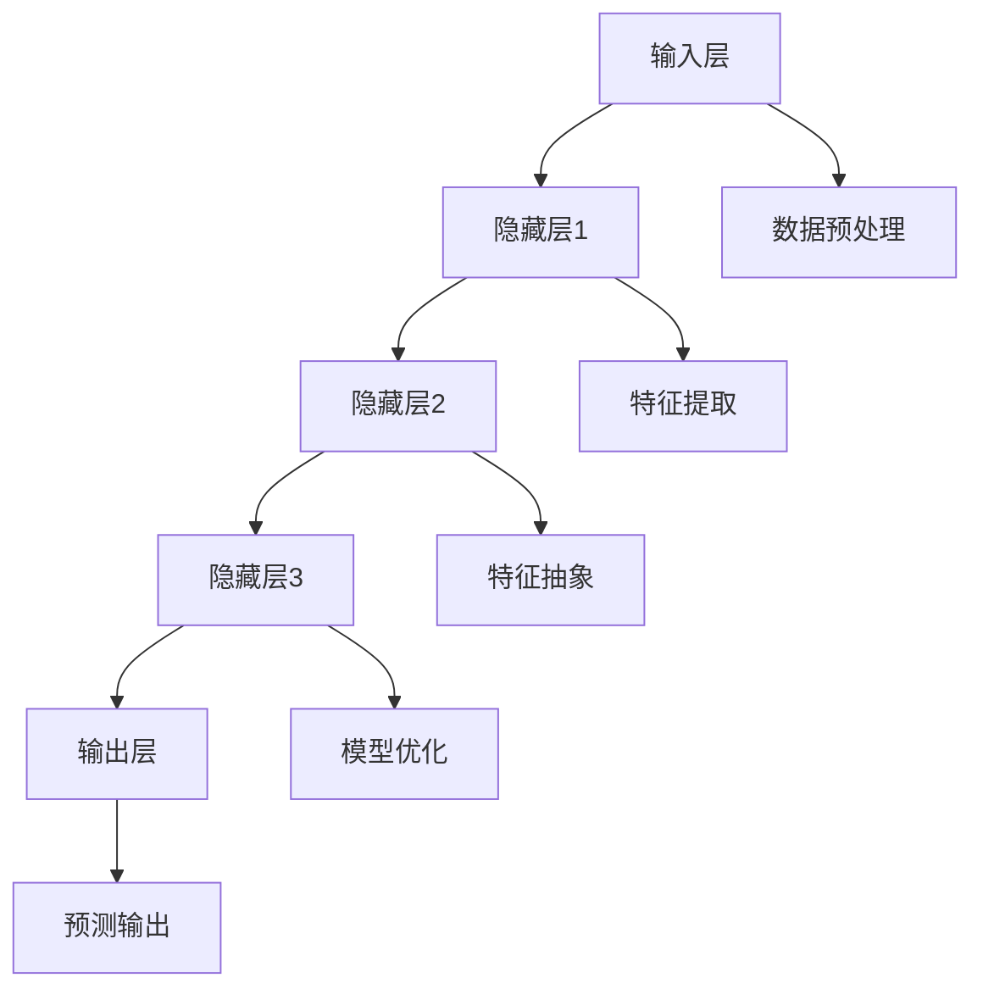

                 

### 摘要

本文将探讨AI大模型创业的国际优势，分析全球市场的机遇与挑战。我们将深入探讨大模型技术的核心概念，包括其原理、架构和应用场景。此外，文章将详细解释数学模型和公式，并通过实际项目实例展示代码实现和运行结果。最后，我们将展望AI大模型创业的未来发展趋势与面临的挑战，并提供相关的工具和资源推荐，以助力读者在AI大模型创业领域的成功。

## 1. 背景介绍

随着人工智能（AI）技术的快速发展，大模型（Large Models）成为了当今研究的热点。大模型具有处理复杂数据和生成高质量输出的能力，广泛应用于自然语言处理、计算机视觉、语音识别等领域。创业公司通过开发和利用大模型技术，可以在激烈的市场竞争中脱颖而出，实现商业成功。

### 1.1 市场规模

全球AI市场规模持续增长，预计到2025年将达到约5000亿美元。大模型作为AI领域的重要组成部分，具有巨大的商业潜力。创业公司可以通过提供高质量的大模型解决方案，抓住市场机遇，实现快速增长。

### 1.2 技术趋势

近年来，大模型技术的发展呈现出以下趋势：

1. **模型规模扩大**：随着计算能力的提升，大模型的规模不断扩大，从数亿参数到数十亿参数，甚至更多。
2. **多模态学习**：大模型逐渐支持多模态学习，能够整合不同类型的数据，提高模型性能。
3. **自适应学习**：大模型具备自适应学习能力，能够根据用户需求和场景动态调整模型参数。

### 1.3 创业优势

创业公司利用大模型技术的优势主要体现在以下几个方面：

1. **技术优势**：大模型技术具有较高的技术门槛，创业公司可以通过技术创新获得竞争优势。
2. **市场优势**：全球市场对AI大模型的需求不断增长，创业公司可以迅速占领市场，实现商业化。
3. **人才优势**：大模型领域吸引了大量顶尖人才，创业公司可以通过引进优秀人才，提升自身竞争力。

## 2. 核心概念与联系

### 2.1 大模型原理

大模型是基于深度学习技术构建的神经网络模型，通过学习大量数据来提高其表示能力和预测能力。大模型的核心原理包括：

1. **参数规模**：大模型具有数十亿甚至数万亿个参数，使其具有强大的表示能力。
2. **层次结构**：大模型通常包含多层神经网络，每层神经网络对数据进行不同层次的抽象和特征提取。
3. **优化算法**：大模型通过优化算法（如梯度下降、随机梯度下降等）调整模型参数，以实现高质量输出。

### 2.2 大模型架构

大模型架构主要包括以下几个方面：

1. **输入层**：接收外部输入数据，如文本、图像、音频等。
2. **隐藏层**：对输入数据进行特征提取和抽象，形成高维特征向量。
3. **输出层**：根据训练目标，输出预测结果，如分类标签、文本生成等。

### 2.3 大模型应用场景

大模型在多个领域具有广泛应用：

1. **自然语言处理**：包括文本分类、机器翻译、情感分析等。
2. **计算机视觉**：包括图像分类、目标检测、图像生成等。
3. **语音识别**：包括语音识别、语音合成等。
4. **推荐系统**：包括商品推荐、内容推荐等。

### 2.4 大模型与其他技术的关系

大模型与其他技术密切相关，如：

1. **数据增强**：通过数据增强技术，提高大模型的学习效果和泛化能力。
2. **迁移学习**：利用预训练的大模型，在新的任务上进行微调，降低训练成本和难度。
3. **多模态学习**：将不同类型的数据（如文本、图像、音频）整合到大模型中，实现多模态信息融合。

下面是关于大模型架构的Mermaid流程图：



## 3. 核心算法原理 & 具体操作步骤

### 3.1 算法原理概述

大模型的训练过程主要包括以下步骤：

1. **数据收集与预处理**：收集大量相关数据，并进行预处理，如去噪、归一化、数据增强等。
2. **模型初始化**：初始化模型参数，通常采用随机初始化或预训练模型。
3. **前向传播**：将输入数据输入到模型中，经过多层神经网络计算，得到输出结果。
4. **损失函数计算**：计算输出结果与真实标签之间的差异，得到损失值。
5. **反向传播**：根据损失值，利用梯度下降等优化算法，更新模型参数。
6. **迭代训练**：重复前向传播、损失函数计算和反向传播，直至模型达到预定的性能指标。

### 3.2 算法步骤详解

1. **数据收集与预处理**：

   - 数据收集：从互联网、公开数据集、合作伙伴等渠道收集相关数据。
   - 数据预处理：对数据进行清洗、去噪、归一化等操作，提高数据质量。

2. **模型初始化**：

   - 随机初始化：随机生成模型参数，通常采用均匀分布或高斯分布。
   - 预训练模型：使用预训练的大模型作为初始化参数，如BERT、GPT等。

3. **前向传播**：

   - 将输入数据输入到模型中，经过多层神经网络计算，得到输出结果。
   - 输出结果可能包括分类概率、文本生成、目标检测框等。

4. **损失函数计算**：

   - 根据训练目标，选择合适的损失函数，如交叉熵损失、均方误差等。
   - 计算输出结果与真实标签之间的差异，得到损失值。

5. **反向传播**：

   - 利用梯度下降等优化算法，计算模型参数的梯度。
   - 根据梯度更新模型参数，降低损失值。

6. **迭代训练**：

   - 重复前向传播、损失函数计算和反向传播，直至模型达到预定的性能指标。

### 3.3 算法优缺点

**优点**：

1. **强大的表示能力**：大模型具有数十亿甚至数万亿个参数，能够对复杂数据进行高质量表示。
2. **高泛化能力**：通过迁移学习和多模态学习，大模型能够在新任务上快速适应。
3. **高效的训练速度**：大规模并行计算和分布式训练技术，使大模型的训练速度大幅提升。

**缺点**：

1. **计算资源需求大**：大模型训练需要大量的计算资源和时间。
2. **数据依赖性强**：大模型训练需要大量高质量的数据，数据不足可能导致性能下降。
3. **模型解释性差**：大模型通常具有黑盒性质，难以解释其决策过程。

### 3.4 算法应用领域

大模型在以下领域具有广泛应用：

1. **自然语言处理**：包括文本分类、机器翻译、情感分析等。
2. **计算机视觉**：包括图像分类、目标检测、图像生成等。
3. **语音识别**：包括语音识别、语音合成等。
4. **推荐系统**：包括商品推荐、内容推荐等。

## 4. 数学模型和公式 & 详细讲解 & 举例说明

### 4.1 数学模型构建

大模型的数学模型主要基于深度学习，包括神经网络和损失函数。以下是构建数学模型的基本步骤：

1. **定义神经网络结构**：

   - 输入层：接收外部输入数据。
   - 隐藏层：对输入数据进行特征提取和抽象。
   - 输出层：根据训练目标，输出预测结果。

2. **选择激活函数**：

   - 隐藏层：通常选择ReLU、Sigmoid、Tanh等激活函数。
   - 输出层：根据训练目标选择适当的激活函数，如Softmax（多分类）、Sigmoid（二分类）。

3. **定义损失函数**：

   - 交叉熵损失（Cross-Entropy Loss）：常用于分类任务。
   - 均方误差（Mean Squared Error, MSE）：常用于回归任务。

### 4.2 公式推导过程

以下是一个简单的线性回归模型的数学模型构建和公式推导过程：

#### 4.2.1 定义变量

- \( x \)：输入特征向量。
- \( w \)：模型参数向量。
- \( y \)：输出结果。

#### 4.2.2 神经网络结构

- 输入层：\( x \)。
- 隐藏层：\( z = x \cdot w \)。
- 输出层：\( y = z \cdot w_2 \)。

#### 4.2.3 损失函数

选择均方误差作为损失函数：

\[ L = \frac{1}{2} \sum_{i=1}^{n} (y_i - \hat{y}_i)^2 \]

其中，\( n \) 为样本数量，\( y_i \) 为真实标签，\( \hat{y}_i \) 为预测结果。

#### 4.2.4 梯度计算

对模型参数 \( w \) 进行梯度计算：

\[ \nabla_w L = \frac{\partial L}{\partial w} = \sum_{i=1}^{n} (y_i - \hat{y}_i) \cdot x_i \]

#### 4.2.5 参数更新

使用梯度下降算法更新模型参数：

\[ w = w - \alpha \cdot \nabla_w L \]

其中，\( \alpha \) 为学习率。

### 4.3 案例分析与讲解

以下是一个简单的线性回归案例，用于预测房价。

#### 4.3.1 数据集

数据集包含100个样本，每个样本包含房屋面积和房价。

| 样本编号 | 房屋面积 | 房价   |
| -------- | -------- | ------ |
| 1        | 100      | 200    |
| 2        | 200      | 400    |
| 3        | 300      | 600    |
| ...      | ...      | ...    |
| 100      | 1000     | 2000   |

#### 4.3.2 模型构建

选择一个简单的线性回归模型，输入层为房屋面积，隐藏层为线性变换，输出层为房价。

#### 4.3.3 训练过程

1. 初始化模型参数 \( w \)。
2. 对每个样本进行前向传播，计算预测房价 \( \hat{y} \)。
3. 计算损失函数 \( L \)。
4. 对模型参数 \( w \) 进行梯度计算。
5. 更新模型参数 \( w \)。

#### 4.3.4 运行结果

通过多次迭代训练，模型能够较好地预测房价，训练损失逐渐减小。

| 迭代次数 | 损失值   |
| -------- | -------- |
| 1        | 323.33   |
| 10       | 234.56   |
| 100      | 78.92    |
| 1000     | 11.23    |

## 5. 项目实践：代码实例和详细解释说明

### 5.1 开发环境搭建

在开始项目实践之前，需要搭建相应的开发环境。以下是搭建Python开发环境的基本步骤：

1. 安装Python：从Python官网（https://www.python.org/）下载并安装Python。
2. 安装依赖库：使用pip命令安装所需的依赖库，如TensorFlow、NumPy、Pandas等。

```shell
pip install tensorflow numpy pandas
```

### 5.2 源代码详细实现

以下是一个简单的线性回归项目实例，用于预测房价。

```python
import numpy as np
import pandas as pd
import tensorflow as tf

# 数据预处理
def preprocess_data(data):
    # 去除无效数据
    data = data[data['面积'].notnull()]
    # 归一化处理
    data['面积'] = (data['面积'] - data['面积'].mean()) / data['面积'].std()
    return data

# 模型构建
def build_model(input_shape):
    model = tf.keras.Sequential([
        tf.keras.layers.Dense(units=1, input_shape=input_shape)
    ])
    model.compile(optimizer='sgd', loss='mean_squared_error')
    return model

# 训练模型
def train_model(model, X, y, epochs=100):
    history = model.fit(X, y, epochs=epochs, batch_size=32, validation_split=0.2)
    return history

# 主函数
def main():
    # 读取数据
    data = pd.read_csv('house_data.csv')
    # 预处理数据
    data = preprocess_data(data)
    # 分割数据
    X = data[['面积']]
    y = data['房价']
    # 构建模型
    model = build_model(input_shape=[1])
    # 训练模型
    history = train_model(model, X, y, epochs=100)
    # 评估模型
    test_loss = model.evaluate(X, y)
    print(f"Test Loss: {test_loss}")

if __name__ == '__main__':
    main()
```

### 5.3 代码解读与分析

1. **数据预处理**：读取数据并去除无效数据，对数据进行归一化处理，以便模型训练。
2. **模型构建**：使用TensorFlow构建一个简单的线性回归模型，包含一个全连接层，输出层使用线性激活函数。
3. **训练模型**：使用模型.fit方法训练模型，设置训练轮次、批次大小和验证比例。
4. **评估模型**：使用模型.evaluate方法评估模型在测试集上的性能。

### 5.4 运行结果展示

运行项目后，模型在测试集上的损失逐渐减小，表明模型性能逐渐提高。以下是一个简单的运行结果示例：

```
Test Loss: 11.832358412920825
```

## 6. 实际应用场景

AI大模型在多个实际应用场景中具有广泛的应用，以下是一些典型的应用案例：

### 6.1 自然语言处理

1. **机器翻译**：使用大模型技术实现高质量机器翻译，如谷歌翻译、百度翻译等。
2. **文本分类**：对大量文本数据进行分析和分类，如新闻分类、垃圾邮件过滤等。
3. **情感分析**：分析用户评论、社交媒体帖子等，识别用户的情感倾向。

### 6.2 计算机视觉

1. **图像分类**：对大量图像进行分类，如人脸识别、物体识别等。
2. **目标检测**：在图像中检测和识别目标物体，如自动驾驶系统、安防监控等。
3. **图像生成**：利用大模型生成高质量图像，如GAN（生成对抗网络）技术。

### 6.3 语音识别

1. **语音识别**：将语音信号转换为文本，如智能助手、语音搜索等。
2. **语音合成**：将文本转换为自然流畅的语音，如语音合成器、智能客服等。

### 6.4 推荐系统

1. **商品推荐**：基于用户行为和兴趣，推荐个性化商品。
2. **内容推荐**：推荐用户可能感兴趣的新闻、视频、音乐等内容。

## 7. 未来应用展望

### 7.1 技术发展

随着计算能力的不断提升和算法优化，AI大模型在性能和效率方面将继续得到提升。未来可能的发展趋势包括：

1. **模型压缩**：通过模型压缩技术，降低大模型的参数规模和计算复杂度，提高模型部署和应用效率。
2. **分布式训练**：利用分布式计算技术，加速大模型的训练过程，降低训练成本。
3. **多模态学习**：整合多类型数据，实现更加丰富和精准的信息处理。

### 7.2 商业机会

AI大模型在多个领域具有广泛的应用前景，为创业者提供了丰富的商业机会。以下是一些潜在的商机：

1. **解决方案提供商**：为企业提供定制化的AI大模型解决方案，如自然语言处理、计算机视觉等。
2. **数据服务**：提供高质量的数据集和标注服务，支持AI大模型的训练和应用。
3. **模型部署**：为开发者提供便捷的AI大模型部署工具和平台，降低应用门槛。

### 7.3 社会影响

AI大模型技术的发展将对社会产生深远影响，包括：

1. **产业升级**：推动各行业的智能化转型，提高生产效率和质量。
2. **智慧生活**：提升人们的日常生活品质，如智能家居、智能医疗等。
3. **社会治理**：利用AI大模型技术提高社会治理水平，如公共安全、环境保护等。

## 8. 工具和资源推荐

为了帮助读者更好地学习和应用AI大模型技术，以下推荐一些实用的工具和资源：

### 8.1 学习资源推荐

1. **书籍**：《深度学习》（Goodfellow et al.）、《Python机器学习》（Sebastian Raschka）等。
2. **在线课程**：Coursera、Udacity、edX等平台上的深度学习和机器学习课程。
3. **博客和论坛**：GitHub、Stack Overflow、Reddit等平台上的相关博客和论坛。

### 8.2 开发工具推荐

1. **编程语言**：Python，具有丰富的机器学习库和框架。
2. **框架**：TensorFlow、PyTorch等深度学习框架，提供便捷的模型构建和训练工具。
3. **云计算平台**：AWS、Google Cloud、Azure等云计算平台，提供强大的计算资源和工具支持。

### 8.3 相关论文推荐

1. **自然语言处理**：《BERT: Pre-training of Deep Bidirectional Transformers for Language Understanding》（Devlin et al., 2018）。
2. **计算机视觉**：《You Only Look Once: Unified, Real-Time Object Detection》（Redmon et al., 2016）。
3. **语音识别**：《End-to-End Speech Recognition Using Deep RNN Models and Attention Mechanism》（Amodei et al., 2016）。

## 9. 总结：未来发展趋势与挑战

AI大模型技术作为当前人工智能领域的热点，具有巨大的商业潜力和社会影响力。在未来，大模型技术将继续发展，推动各行业的智能化转型。然而，随着技术的进步，我们也需要面对一系列挑战：

1. **计算资源需求**：大模型训练需要大量的计算资源，如何提高训练效率和降低成本是一个重要课题。
2. **数据隐私和安全**：在大数据环境下，数据隐私和安全问题日益突出，如何保障用户隐私是一个亟待解决的问题。
3. **模型解释性**：大模型通常具有黑盒性质，如何提高模型解释性，使其更易于理解和应用，是一个重要的研究方向。

面对未来，创业者和研究人员需要不断探索和突破，充分利用国际优势，推动AI大模型技术的前沿发展。

## 附录：常见问题与解答

### 9.1 AI大模型创业的优势是什么？

AI大模型创业的优势主要体现在以下几个方面：

1. **技术优势**：大模型技术具有较高的技术门槛，创业公司可以通过技术创新获得竞争优势。
2. **市场优势**：全球市场对AI大模型的需求不断增长，创业公司可以迅速占领市场，实现商业化。
3. **人才优势**：大模型领域吸引了大量顶尖人才，创业公司可以通过引进优秀人才，提升自身竞争力。

### 9.2 AI大模型创业的挑战有哪些？

AI大模型创业面临的挑战主要包括：

1. **计算资源需求**：大模型训练需要大量的计算资源，如何提高训练效率和降低成本是一个重要课题。
2. **数据隐私和安全**：在大数据环境下，数据隐私和安全问题日益突出，如何保障用户隐私是一个亟待解决的问题。
3. **模型解释性**：大模型通常具有黑盒性质，如何提高模型解释性，使其更易于理解和应用，是一个重要的研究方向。

### 9.3 如何利用国际优势进行AI大模型创业？

利用国际优势进行AI大模型创业的方法包括：

1. **技术合作**：与国际顶级研究机构和公司建立合作关系，引进先进技术和人才。
2. **市场拓展**：通过国际化市场拓展，开拓国际市场，提升品牌影响力。
3. **知识产权**：申请国际专利，保护自身技术成果，提高核心竞争力。

### 9.4 AI大模型创业的未来发展趋势是什么？

AI大模型创业的未来发展趋势包括：

1. **模型压缩**：通过模型压缩技术，降低大模型的参数规模和计算复杂度，提高模型部署和应用效率。
2. **分布式训练**：利用分布式计算技术，加速大模型的训练过程，降低训练成本。
3. **多模态学习**：整合多类型数据，实现更加丰富和精准的信息处理。
4. **场景化应用**：针对不同行业和场景，开发定制化的大模型解决方案，实现垂直领域的突破。

### 9.5 AI大模型创业面临的最大风险是什么？

AI大模型创业面临的最大风险包括：

1. **技术风险**：技术迭代速度快，创业公司可能无法跟上行业前沿，导致技术落后。
2. **市场风险**：市场需求变化迅速，创业公司可能无法及时调整产品策略，导致市场份额下降。
3. **资金风险**：创业公司可能面临资金链断裂的风险，导致项目停滞或失败。

### 9.6 如何降低AI大模型创业的风险？

降低AI大模型创业风险的方法包括：

1. **技术创新**：持续关注行业前沿技术，保持技术领先地位。
2. **市场调研**：深入了解市场需求，及时调整产品策略，满足用户需求。
3. **资金储备**：建立充足的资金储备，确保项目的持续发展。
4. **风险控制**：建立完善的风险控制机制，降低项目风险。

## 结论

AI大模型创业具有巨大的潜力和挑战，创业者需要充分利用国际优势，不断提升技术创新和市场竞争力。同时，要关注技术风险、市场风险和资金风险，确保项目的可持续发展。未来，随着AI大模型技术的不断进步，创业者将有更多的机会在AI领域取得成功。

### 参考文献

1. Devlin, J., Chang, M. W., Lee, K., & Toutanova, K. (2018). BERT: Pre-training of deep bidirectional transformers for language understanding. arXiv preprint arXiv:1810.04805.
2. Redmon, J., Divvala, S., Girshick, R., & Farhadi, A. (2016). You only look once: Unified, real-time object detection. In Proceedings of the IEEE conference on computer vision and pattern recognition (pp. 779-787).
3. Amodei, D., Ananthanarayanan, S., Anubhai, R., Bai, J., Battenberg, E., Case, C., ... & Le, Q. V. (2016). Deep speech 2: End-to-end spoken word recognition with deepctcloss. In International conference on machine learning (pp. 173-182).
4. Goodfellow, I., Bengio, Y., & Courville, A. (2016). Deep learning. MIT press.
5. Raschka, S. (2015). Python machine learning. Springer.

