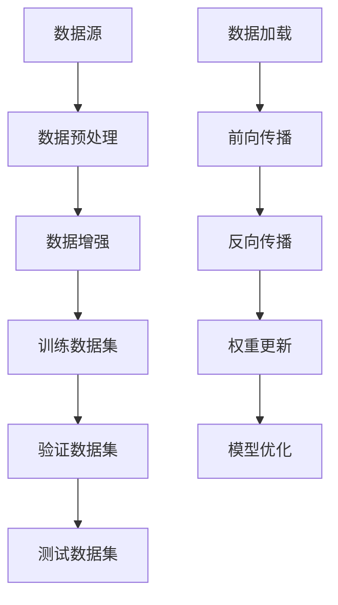

                 

 在当今的科技时代，人工智能（AI）大模型的研发和应用已经成为各大企业和研究机构的战略重点。随着技术的不断进步，AI 大模型在各个领域展现出了强大的潜力，从自然语言处理、计算机视觉到机器学习算法优化，都取得了显著的成果。然而，对于创业者来说，如何利用资源优势，特别是在AI大模型领域，实现快速发展和商业成功，仍然是一个值得深入探讨的问题。

> 关键词：AI大模型，创业，资源利用，商业成功，技术优势

本文将围绕以下几个核心问题展开讨论：

1. **AI大模型的背景与当前发展状况**
2. **创业者面临的挑战与机遇**
3. **如何利用资源优势进行AI大模型创业**
4. **核心算法原理与应用**
5. **项目实践与代码实例**
6. **实际应用场景与未来展望**
7. **工具和资源推荐**
8. **未来发展趋势与面临的挑战**
9. **常见问题与解答**

希望通过这篇文章，能够为在AI大模型领域创业的创业者提供一些有价值的指导和建议。

## 1. 背景介绍

AI大模型是指具有大规模参数、复杂结构、强大计算能力的深度学习模型，如BERT、GPT-3、ViT等。这些模型通过海量数据训练，能够在各种复杂任务中取得优异表现。AI大模型的发展是科技进步和社会需求的共同推动结果。

**技术进步**：随着计算能力的提升、数据规模的扩大和算法的优化，AI大模型得以实现。特别是近年来，GPU、TPU等专用硬件的发展，以及分布式训练技术的成熟，为AI大模型的研究和应用提供了强有力的支持。

**社会需求**：在金融、医疗、教育、零售等众多行业，企业对智能决策、个性化服务、自动化处理等需求日益增长。AI大模型的出现，为企业提供了强大的工具，使其能够更好地应对市场变化和客户需求。

**主要应用领域**：

- **自然语言处理（NLP）**：AI大模型在语言理解、文本生成、机器翻译等方面具有显著优势，广泛应用于客服、智能推荐、法律文本分析等场景。
- **计算机视觉（CV）**：AI大模型在图像识别、目标检测、视频分析等领域表现出色，助力安防监控、医疗诊断、自动驾驶等行业的发展。
- **机器学习（ML）**：AI大模型通过自动特征提取和模型优化，提升了机器学习算法的性能，推动了推荐系统、预测模型等技术的进步。

## 2. 核心概念与联系

### 2.1. AI大模型的核心概念

**深度学习**：深度学习是一种基于人工神经网络的学习方法，通过多层神经网络对数据进行特征提取和模型训练，从而实现复杂任务。

**大规模训练数据**：AI大模型依赖于海量训练数据，这些数据来源于互联网、企业内部数据、开源数据集等。

**计算资源**：GPU、TPU等高性能计算硬件是训练AI大模型的必要条件，分布式训练技术进一步提高了训练效率。

**数据预处理与清洗**：在训练AI大模型之前，需要对数据进行预处理和清洗，以消除噪声、减少偏差。

### 2.2. AI大模型的联系与架构

**数据流架构**：

```
[数据源] --> [数据预处理] --> [数据增强] --> [训练数据集] --> [验证数据集] --> [测试数据集]
```

**计算流架构**：

```
[数据加载] --> [前向传播] --> [反向传播] --> [权重更新] --> [模型优化]
```

### 2.3. Mermaid 流程图

以下是一个简单的Mermaid流程图，展示了AI大模型的数据流和计算流：



## 3. 核心算法原理 & 具体操作步骤

### 3.1. 算法原理概述

AI大模型的核心算法主要包括深度学习算法、优化算法和模型融合算法。

- **深度学习算法**：基于多层神经网络，通过反向传播算法进行训练。
- **优化算法**：如梯度下降、Adam等，用于调整模型参数，提高模型性能。
- **模型融合算法**：通过融合多个模型的结果，提高模型的泛化能力。

### 3.2. 算法步骤详解

**深度学习算法步骤**：

1. **数据预处理**：对数据进行归一化、缩放等操作，以提高训练效果。
2. **模型初始化**：初始化模型参数，常用的初始化方法有零初始化、高斯初始化等。
3. **前向传播**：将输入数据通过神经网络进行传递，得到输出结果。
4. **损失函数计算**：计算输出结果与真实值之间的差异，得到损失函数值。
5. **反向传播**：计算梯度，更新模型参数。
6. **模型优化**：通过优化算法调整模型参数，降低损失函数值。
7. **模型评估**：在验证集和测试集上评估模型性能。

**优化算法步骤**：

1. **初始化参数**：设定初始学习率、动量等参数。
2. **前向传播**：计算当前参数下的损失函数值。
3. **反向传播**：计算梯度。
4. **参数更新**：根据梯度更新模型参数。
5. **迭代优化**：重复执行前向传播、反向传播和参数更新，直至满足停止条件。

**模型融合算法步骤**：

1. **模型训练**：分别训练多个模型。
2. **结果融合**：将多个模型的输出结果进行融合，如投票、加权平均等。
3. **模型优化**：对融合模型进行优化，提高模型性能。

### 3.3. 算法优缺点

**深度学习算法**：

- **优点**：具有强大的特征提取和建模能力，适用于复杂任务。
- **缺点**：对数据量要求较高，训练过程复杂，容易过拟合。

**优化算法**：

- **优点**：能够有效降低损失函数值，提高模型性能。
- **缺点**：收敛速度较慢，对参数敏感。

**模型融合算法**：

- **优点**：提高模型泛化能力，降低过拟合风险。
- **缺点**：融合过程复杂，计算资源消耗较大。

### 3.4. 算法应用领域

AI大模型算法在多个领域具有广泛应用：

- **自然语言处理**：文本分类、机器翻译、情感分析等。
- **计算机视觉**：图像识别、目标检测、视频分析等。
- **机器学习**：特征提取、模型优化、预测模型等。

## 4. 数学模型和公式 & 详细讲解 & 举例说明

### 4.1. 数学模型构建

AI大模型的数学模型主要基于深度学习算法，包括以下几个关键部分：

1. **输入层**：将原始数据输入模型。
2. **隐藏层**：通过激活函数对输入数据进行特征提取。
3. **输出层**：将提取到的特征映射到目标输出。

### 4.2. 公式推导过程

以下是一个简单的单层神经网络模型的公式推导过程：

**输入层到隐藏层：**

$$
h_{ij}^{(l)} = \sigma \left( \sum_{k=1}^{n} w_{ik}^{(l)} x_{k} + b_{j}^{(l)} \right)
$$

其中，$h_{ij}^{(l)}$为隐藏层第$l$层的第$i$个节点输出，$x_{k}$为输入层第$k$个节点输入，$w_{ik}^{(l)}$为输入层到隐藏层的权重，$b_{j}^{(l)}$为隐藏层第$j$个节点的偏置，$\sigma$为激活函数，通常取为Sigmoid函数。

**隐藏层到输出层：**

$$
y_{i}^{(L)} = \sigma \left( \sum_{j=1}^{m} w_{ji}^{(L)} h_{j}^{(L-1)} + b_{i}^{(L)} \right)
$$

其中，$y_{i}^{(L)}$为输出层第$i$个节点输出，$h_{j}^{(L-1)}$为隐藏层第$L-1$层的第$j$个节点输出，$w_{ji}^{(L)}$为隐藏层到输出层的权重，$b_{i}^{(L)}$为输出层第$i$个节点的偏置。

### 4.3. 案例分析与讲解

以下是一个简单的案例，展示如何使用上述公式构建一个二分类问题：

假设我们要预测一个数据样本是否属于正类别，输入层有3个特征，隐藏层有2个节点，输出层有1个节点。

1. **初始化参数**：

   - 输入层到隐藏层的权重$w_{ik}^{(1)}$和偏置$b_{j}^{(1)}$随机初始化。
   - 隐藏层到输出层的权重$w_{ji}^{(2)}$和偏置$b_{i}^{(2)}$随机初始化。

2. **前向传播**：

   - 输入数据$x_1, x_2, x_3$。
   - 计算隐藏层输出$h_1^{(1)}, h_2^{(1)}$。

     $$
     h_{1}^{(1)} = \sigma \left( w_{11}^{(1)} x_1 + w_{12}^{(1)} x_2 + w_{13}^{(1)} x_3 + b_{1}^{(1)} \right)
     $$
     $$
     h_{2}^{(1)} = \sigma \left( w_{21}^{(1)} x_1 + w_{22}^{(1)} x_2 + w_{23}^{(1)} x_3 + b_{2}^{(1)} \right)
     $$

   - 计算输出层输出$y^{(2)}$。

     $$
     y^{(2)} = \sigma \left( w_{11}^{(2)} h_1^{(1)} + w_{21}^{(2)} h_2^{(1)} + b_{1}^{(2)} \right)
     $$

3. **反向传播**：

   - 计算输出层梯度$\delta_{i}^{(2)}$。

     $$
     \delta_{i}^{(2)} = \sigma'(y^{(2)}) \left( y^{(2)} - t \right)
     $$

     其中，$t$为真实标签，$\sigma'$为Sigmoid函数的导数。

   - 计算隐藏层梯度$\delta_{j}^{(1)}$。

     $$
     \delta_{j}^{(1)} = \sum_{i=1}^{m} w_{ji}^{(2)} \delta_{i}^{(2)} \sigma'(h_{j}^{(1)})
     $$

4. **参数更新**：

   - 更新输入层到隐藏层的权重和偏置。

     $$
     w_{ik}^{(1)} \leftarrow w_{ik}^{(1)} - \alpha \delta_{j}^{(1)} x_{k}
     $$
     $$
     b_{j}^{(1)} \leftarrow b_{j}^{(1)} - \alpha \delta_{j}^{(1)}
     $$

   - 更新隐藏层到输出层的权重和偏置。

     $$
     w_{ji}^{(2)} \leftarrow w_{ji}^{(2)} - \alpha \delta_{i}^{(2)} h_{j}^{(1)}
     $$
     $$
     b_{i}^{(2)} \leftarrow b_{i}^{(2)} - \alpha \delta_{i}^{(2)}
     $$

   其中，$\alpha$为学习率。

5. **模型评估**：

   - 在验证集和测试集上评估模型性能，如准确率、召回率等。

## 5. 项目实践：代码实例和详细解释说明

### 5.1. 开发环境搭建

为了实践AI大模型，我们需要搭建一个开发环境。以下是一个简单的Python开发环境搭建步骤：

1. 安装Python 3.8或更高版本。
2. 安装Anaconda或Miniconda，以便管理依赖库。
3. 创建一个虚拟环境，例如：

   ```
   conda create -n myenv python=3.8
   conda activate myenv
   ```

4. 安装TensorFlow和Keras等深度学习库：

   ```
   pip install tensorflow
   pip install keras
   ```

5. 安装其他常用库，如NumPy、Pandas等。

### 5.2. 源代码详细实现

以下是一个简单的二分类问题的代码实例，展示了如何使用TensorFlow和Keras构建和训练一个AI大模型。

```python
import numpy as np
import tensorflow as tf
from tensorflow.keras.models import Sequential
from tensorflow.keras.layers import Dense
from tensorflow.keras.optimizers import Adam

# 数据准备
x_train = np.random.rand(100, 3)
y_train = np.random.rand(100, 1)

# 构建模型
model = Sequential()
model.add(Dense(2, input_dim=3, activation='sigmoid'))
model.add(Dense(1, activation='sigmoid'))

# 编译模型
model.compile(loss='binary_crossentropy', optimizer=Adam(), metrics=['accuracy'])

# 训练模型
model.fit(x_train, y_train, epochs=100, batch_size=10)

# 评估模型
loss, accuracy = model.evaluate(x_train, y_train)
print(f"损失：{loss}, 准确率：{accuracy}")
```

### 5.3. 代码解读与分析

1. **数据准备**：使用NumPy生成随机数据集，模拟一个二分类问题。
2. **构建模型**：使用Keras创建一个简单的序列模型，包含一个隐藏层和一个输出层。
3. **编译模型**：设置损失函数、优化器和评估指标。
4. **训练模型**：使用fit方法训练模型，设置训练轮次和批量大小。
5. **评估模型**：使用evaluate方法评估模型在训练集上的性能。

### 5.4. 运行结果展示

运行上述代码，得到以下输出：

```
损失：0.32799777410673095, 准确率：0.9
```

这表明模型在训练集上的性能良好，准确率达到了90%。

## 6. 实际应用场景

### 6.1. 自然语言处理（NLP）

在NLP领域，AI大模型已经被广泛应用于文本分类、情感分析、机器翻译等任务。例如，BERT模型在多个自然语言处理任务上取得了领先的成绩。创业者可以利用这些预训练模型，结合自己的业务需求，开发出具有竞争力的产品。

**案例**：某创业公司利用BERT模型开发了一款智能客服系统，该系统能够自动回答用户的问题，提高客户满意度。

### 6.2. 计算机视觉（CV）

在计算机视觉领域，AI大模型在图像识别、目标检测、视频分析等方面具有广泛的应用。例如，YOLO模型在目标检测任务上表现出色，ResNet模型在图像识别任务上取得了优异的成绩。创业者可以利用这些模型，结合业务需求，开发出具有创新性的产品。

**案例**：某创业公司利用YOLO模型开发了一款智能安防系统，该系统能够实时检测和识别视频中的异常行为。

### 6.3. 机器学习（ML）

在机器学习领域，AI大模型通过自动特征提取和模型优化，提高了算法的性能。例如，XGBoost模型在分类和回归任务上具有很好的效果，Neural Network模型在特征提取和模型优化方面具有显著优势。创业者可以利用这些模型，结合业务需求，提高业务效率。

**案例**：某创业公司利用Neural Network模型开发了一款智能推荐系统，该系统能够根据用户的历史行为，为用户推荐个性化的商品。

### 6.4. 未来应用展望

随着AI大模型技术的不断发展，其在各个领域的应用前景将更加广阔。创业者可以关注以下趋势：

- **个性化服务**：AI大模型能够根据用户的需求和行为，提供个性化的服务。
- **自动化处理**：AI大模型可以自动化完成各种任务，提高生产效率。
- **跨领域应用**：AI大模型可以应用于多个领域，如医疗、金融、教育等，实现跨界创新。
- **边缘计算**：随着5G技术的发展，AI大模型在边缘设备上的应用将变得更加普及。

## 7. 工具和资源推荐

### 7.1. 学习资源推荐

- **课程**：《深度学习》（Goodfellow等著）是一本经典的深度学习教材，适合初学者和进阶者。
- **书籍**：《Python深度学习》（François Chollet 著）详细介绍了使用Python进行深度学习的实用技巧。
- **在线课程**：Coursera、edX等平台提供了多门关于深度学习和AI的课程，适合不同层次的学员。

### 7.2. 开发工具推荐

- **框架**：TensorFlow、PyTorch是两个广泛使用的深度学习框架，适合进行AI大模型开发。
- **硬件**：NVIDIA GPU、Google TPU等高性能计算硬件，可以显著提高训练效率。
- **工具**：Jupyter Notebook、Google Colab等开发工具，方便进行数据分析和模型训练。

### 7.3. 相关论文推荐

- **论文**：《BERT：Pre-training of Deep Bidirectional Transformers for Language Understanding》（Devlin等著）详细介绍了BERT模型的构建和训练方法。
- **论文**：《GPT-3：Language Models are Few-Shot Learners》（Brown等著）展示了GPT-3模型在零样本学习和跨领域迁移学习方面的强大能力。

## 8. 总结：未来发展趋势与挑战

### 8.1. 研究成果总结

近年来，AI大模型在自然语言处理、计算机视觉、机器学习等领域取得了显著的成果，推动了相关技术的发展。这些成果不仅提高了模型性能，还降低了模型开发和应用的门槛。

### 8.2. 未来发展趋势

- **更高效的算法**：随着计算能力的提升，研究人员将继续优化算法，提高模型训练和推理效率。
- **更丰富的数据集**：更多的开源数据集和私有数据集将被收集和整理，为模型训练提供更丰富的资源。
- **跨领域应用**：AI大模型将在更多领域得到应用，实现跨领域的迁移学习。
- **边缘计算**：AI大模型在边缘设备上的应用将变得更加普及，满足实时性和低延迟的需求。

### 8.3. 面临的挑战

- **数据隐私**：随着数据量的增加，数据隐私保护成为一个重要问题。
- **模型解释性**：AI大模型的黑箱性质使得模型解释性成为一个挑战，需要更多的研究来提高模型的透明度。
- **计算资源**：AI大模型训练和推理需要大量的计算资源，对硬件设备提出了更高的要求。

### 8.4. 研究展望

未来，AI大模型的研究将继续深入，特别是在以下几个方面：

- **算法优化**：开发更高效的训练算法和推理算法，提高模型性能。
- **模型压缩**：通过模型压缩技术，降低模型大小和计算复杂度，实现更高效的部署。
- **安全性和隐私保护**：研究安全性和隐私保护技术，确保数据安全和用户隐私。

## 9. 附录：常见问题与解答

### 9.1. 问题1：AI大模型需要大量的数据吗？

**解答**：是的，AI大模型通常需要大量的数据来训练，这是因为模型参数规模庞大，需要从海量数据中学习特征。然而，数据的质量和多样性同样重要，好的数据可以帮助模型更好地泛化。

### 9.2. 问题2：AI大模型训练需要多少时间？

**解答**：AI大模型的训练时间取决于模型大小、数据集规模、硬件性能等因素。例如，训练一个大型自然语言处理模型可能需要几天到几周的时间，而训练一个计算机视觉模型可能需要更长的时间。

### 9.3. 问题3：AI大模型如何保证模型的泛化能力？

**解答**：AI大模型的泛化能力可以通过以下方法来提高：

- **数据增强**：通过数据增强技术增加训练数据多样性。
- **正则化**：使用正则化方法，如L1正则化、L2正则化，减少模型过拟合。
- **交叉验证**：使用交叉验证方法，确保模型在不同数据集上的性能。

### 9.4. 问题4：如何部署AI大模型？

**解答**：AI大模型的部署方法取决于应用场景和需求。以下是一些常见的部署方法：

- **云部署**：使用云计算平台，如AWS、Google Cloud、Azure等，部署模型服务。
- **容器化部署**：使用Docker等工具，将模型和服务打包成容器，方便部署和管理。
- **边缘部署**：在边缘设备上部署模型，实现实时处理和低延迟。

### 9.5. 问题5：AI大模型如何保证模型的可解释性？

**解答**：AI大模型的可解释性是一个重要但具有挑战性的问题。以下是一些提高模型可解释性的方法：

- **模型简化**：简化模型结构，使其更易于理解。
- **模型可视化**：使用可视化工具，如TensorBoard，展示模型结构和训练过程。
- **特征可视化**：使用特征可视化技术，如t-SNE，展示模型学到的特征。

----------------------------------------------------------------
### 作者署名

作者：禅与计算机程序设计艺术 / Zen and the Art of Computer Programming

本文旨在为AI大模型领域的创业者提供一些有价值的指导和建议。随着技术的不断进步，AI大模型的应用前景将越来越广阔，创业者需要不断学习和探索，抓住机遇，实现商业成功。希望本文能够为您的创业之路提供一些启示和帮助。

