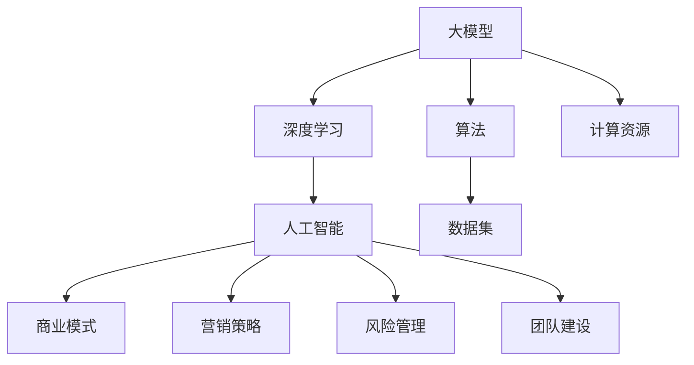

                 

### 摘要

本文旨在探讨 AI 大模型创业者在市场开拓过程中的关键策略与挑战。随着深度学习技术的不断发展，AI 大模型的应用场景日益广泛，从自然语言处理到计算机视觉，再到自动驾驶，大模型已经成为推动技术进步的核心动力。然而，对于创业者来说，如何将 AI 大模型技术转化为商业价值，如何在竞争激烈的市场中脱颖而出，是摆在他们面前的重大课题。本文将深入分析 AI 大模型的市场现状、核心价值、商业模式的构建、市场推广策略、潜在风险与挑战，以及未来发展的趋势和方向。通过本文，创业者们可以更好地理解 AI 大模型市场的运作机制，为他们的创业之路提供有价值的参考。

<|assistant|>### 1. 背景介绍

人工智能（AI）的发展经历了多个阶段，从早期的专家系统到今天的深度学习，AI 技术在计算能力、数据资源、算法优化等方面都取得了显著的进步。特别是近年来，AI 大模型（如 GPT、BERT、ViT 等）的涌现，极大地提升了 AI 的应用能力。大模型通过在海量数据上进行训练，能够实现高度复杂的数据处理和模式识别，从而在自然语言处理、计算机视觉、语音识别等多个领域取得了突破性的成果。

AI 大模型的市场潜力巨大。随着数字化转型的加速，各行各业对智能化的需求日益增加，AI 大模型的应用场景不断扩展。例如，在自然语言处理领域，AI 大模型可以用于智能客服、机器翻译、内容生成等；在计算机视觉领域，AI 大模型可以用于图像识别、视频分析、自动驾驶等；在医疗健康领域，AI 大模型可以用于疾病诊断、药物研发、个性化治疗等。这些应用不仅提升了效率，还降低了成本，为各行业带来了巨大的商业价值。

然而，AI 大模型创业者在市场开拓过程中面临着诸多挑战。首先，技术门槛高。大模型的训练需要大量的计算资源和数据，且算法的优化需要长期的技术积累。其次，市场竞争激烈。随着 AI 技术的普及，越来越多的企业投入到 AI 大模型的研究和应用中，市场竞争日益激烈。此外，用户需求复杂多变，创业者需要快速响应市场变化，持续优化产品和服务。

面对这些挑战，AI 大模型创业者在市场开拓过程中需要制定明确的市场策略，深入理解用户需求，构建创新的商业模式，并通过有效的市场推广和风险控制来确保商业成功。本文将围绕这些关键问题展开讨论，为 AI 大模型创业者提供有价值的参考和指导。

<|assistant|>## 2. 核心概念与联系

在深入了解 AI 大模型创业的市场策略之前，我们首先需要明确几个核心概念，并探讨它们之间的联系。

### 2.1. 大模型

大模型是指具有极高参数量和计算复杂度的深度学习模型。这些模型通常通过在海量数据上进行训练，能够实现高度复杂的数据处理和模式识别。例如，GPT-3 拥有 1750 亿个参数，BERT 的参数量也达到了数十亿级别。这些大模型的训练通常需要数以万计的 GPU 和 TPU，以及大量的计算时间和存储空间。

### 2.2. 深度学习

深度学习是一种基于多层神经网络的学习方法，通过多层神经元的堆叠，模型能够从数据中自动提取特征，并逐步学习到更加抽象的层次。深度学习的发展，特别是卷积神经网络（CNN）和循环神经网络（RNN）的提出，极大地推动了 AI 的进步。

### 2.3. 人工智能（AI）

人工智能是指通过计算机模拟人类智能的技术，包括机器学习、自然语言处理、计算机视觉等多个子领域。AI 的目标是使计算机能够像人类一样感知、理解和行动。

### 2.4. 算法

算法是指解决特定问题的一系列步骤和方法。在 AI 领域，算法是实现智能的核心，包括训练算法、推理算法等。常用的算法有梯度下降、反向传播、注意力机制等。

### 2.5. 数据集

数据集是训练和评估 AI 模型的基石。高质量的数据集能够提高模型的训练效果和泛化能力。常见的公开数据集有 ImageNet、CIFAR-10、WikiText-2 等。

### 2.6. 计算资源

计算资源是训练和部署 AI 大模型的基础设施，包括 GPU、TPU、FPGA 等。计算资源的充足与否直接影响模型的训练速度和效果。

### 2.7. 商业模式

商业模式是指企业如何创造、传递和获取价值的方法。在 AI 大模型创业中，商业模式决定了企业如何将技术优势转化为商业利润。

### 2.8. 营销策略

营销策略是指企业如何通过市场推广和销售活动来吸引客户和扩大市场份额。有效的营销策略能够提高品牌的知名度和用户粘性。

### 2.9. 风险管理

风险管理是指企业如何识别、评估和应对潜在的风险。在 AI 大模型创业中，风险管理至关重要，包括技术风险、市场风险、财务风险等。

### 2.10. 团队建设

团队建设是指如何组建和管理一个高效、协作的团队。对于 AI 大模型创业来说，团队建设尤为关键，因为技术复杂度高，需要多学科交叉合作。

### Mermaid 流程图

以下是一个简单的 Mermaid 流程图，展示了上述核心概念之间的联系：



通过理解这些核心概念及其联系，创业者可以更好地制定市场策略，构建可持续的商业模式，并在竞争激烈的市场中取得成功。

<|assistant|>### 3. 核心算法原理 & 具体操作步骤

#### 3.1. 算法原理概述

AI 大模型的训练过程是一个复杂而高度优化的过程，其核心在于深度学习算法。深度学习算法的核心思想是通过多层神经网络的堆叠，使得模型能够从输入数据中自动学习特征，并逐步进行抽象和概括。

深度学习的基本单元是神经元，神经元通过激活函数对输入进行加权求和，并输出一个非线性值。多层神经网络的训练过程通常包括以下步骤：

1. **前向传播（Forward Propagation）**：将输入数据通过网络的每一层，计算每一层的输出。
2. **反向传播（Backpropagation）**：通过计算损失函数的梯度，反向传播误差到网络的每一层，更新网络参数。
3. **优化算法**：使用梯度下降等优化算法，迭代更新网络参数，以最小化损失函数。

大模型训练过程中的一个关键挑战是计算资源的高消耗。因此，常用的优化策略包括：

- **分布式训练**：通过将数据分散到多个计算节点上，并行进行训练，以加快训练速度。
- **模型剪枝**：通过删除网络中的冗余连接，减少模型的参数数量，降低计算复杂度。
- **迁移学习**：使用预训练的大模型，通过微调适应特定任务，以减少训练所需的数据量和计算资源。

#### 3.2. 算法步骤详解

以下是大模型训练的具体步骤：

1. **数据预处理**：
   - **数据清洗**：去除噪声和异常值，确保数据质量。
   - **数据增强**：通过旋转、缩放、裁剪等方式增加数据的多样性。
   - **数据标准化**：对数据进行归一化或标准化处理，使其具有相似的规模。

2. **模型设计**：
   - **选择架构**：根据任务需求，选择合适的神经网络架构，如 CNN、RNN、Transformer 等。
   - **定义损失函数**：选择适当的损失函数，如交叉熵损失、均方误差等。
   - **设置优化器**：选择优化算法，如 SGD、Adam 等。

3. **训练过程**：
   - **前向传播**：输入数据通过网络的每一层，计算输出。
   - **计算损失**：通过损失函数计算预测值与真实值之间的差距。
   - **反向传播**：计算损失关于网络参数的梯度，并更新参数。
   - **迭代优化**：重复前向传播和反向传播，直到满足训练条件（如达到预设的迭代次数或损失下降到可接受的水平）。

4. **模型评估**：
   - **验证集评估**：使用验证集评估模型的性能，选择性能最佳的模型。
   - **测试集评估**：在测试集上进行最终评估，以验证模型的泛化能力。

5. **模型部署**：
   - **模型优化**：通过剪枝、量化等方式优化模型，减小模型大小和计算复杂度。
   - **模型部署**：将模型部署到生产环境，进行实时推理和应用。

#### 3.3. 算法优缺点

**优点**：

- **高度自动化**：深度学习模型能够自动学习数据中的特征，减少人工特征工程的工作量。
- **强大的泛化能力**：通过在大规模数据上进行训练，模型能够较好地泛化到未见过的数据。
- **丰富的应用场景**：深度学习模型可以应用于图像识别、自然语言处理、语音识别等多个领域。

**缺点**：

- **计算资源消耗大**：大模型的训练需要大量的计算资源和时间。
- **数据需求高**：深度学习模型通常需要大量高质量的数据进行训练。
- **解释性差**：深度学习模型的决策过程较为复杂，难以进行解释。

#### 3.4. 算法应用领域

AI 大模型在多个领域展示了其强大的应用能力：

- **自然语言处理**：大模型可以用于文本生成、机器翻译、情感分析等。
- **计算机视觉**：大模型可以用于图像识别、视频分析、自动驾驶等。
- **医疗健康**：大模型可以用于疾病诊断、药物研发、个性化治疗等。
- **金融科技**：大模型可以用于风险管理、信用评分、投资预测等。

通过上述核心算法原理和具体操作步骤的介绍，创业者可以更好地理解 AI 大模型的技术基础，为他们的创业项目提供技术支持。

<|assistant|>### 4. 数学模型和公式 & 详细讲解 & 举例说明

在 AI 大模型的训练和应用过程中，数学模型和公式起到了至关重要的作用。以下我们将详细讲解一些核心的数学模型和公式，并通过实际案例进行说明。

#### 4.1. 数学模型构建

AI 大模型的训练本质上是一个优化问题，目标是找到一组参数，使得模型在给定数据集上的表现达到最优。常用的优化方法是梯度下降（Gradient Descent）。

**梯度下降**：

梯度下降是一种优化算法，其核心思想是通过计算目标函数关于参数的梯度，迭代更新参数，以最小化目标函数。

公式如下：

$$
\theta_{t+1} = \theta_{t} - \alpha \cdot \nabla_{\theta} J(\theta)
$$

其中，$\theta$ 表示模型参数，$\alpha$ 表示学习率，$J(\theta)$ 表示目标函数（例如损失函数），$\nabla_{\theta} J(\theta)$ 表示目标函数关于参数的梯度。

**反向传播（Backpropagation）**：

反向传播是梯度下降在神经网络中的应用。其基本思想是从输出层开始，反向计算每一层关于参数的梯度。

公式如下：

$$
\nabla_{\theta^{(L)}} J(\theta^{(L)}) = \nabla_{\theta^{(L)}} \frac{\partial L}{\partial \theta^{(L)}} + \nabla_{\theta^{(L-1)}} J(\theta^{(L-1)})
$$

其中，$\theta^{(L)}$ 表示第 $L$ 层的参数，$L$ 表示层数，$L=1$ 为输入层，$L=n$ 为输出层。

#### 4.2. 公式推导过程

以下是一个简单的例子，用于说明梯度下降和反向传播的推导过程。

假设有一个简单的线性模型，其目标是最小化均方误差（MSE）：

$$
J(\theta) = \frac{1}{2m} \sum_{i=1}^{m} (h_\theta(x^i) - y^i)^2
$$

其中，$h_\theta(x) = \theta_0 + \theta_1x$，$x^i$ 和 $y^i$ 分别为输入和输出，$m$ 为样本数量。

**步骤 1**：计算前向传播的输出

$$
h_\theta(x^i) = \theta_0 + \theta_1x^i
$$

**步骤 2**：计算损失函数

$$
\frac{\partial J(\theta)}{\partial \theta_0} = \frac{1}{2m} \sum_{i=1}^{m} (h_\theta(x^i) - y^i) \cdot (-1) \cdot \frac{\partial h_\theta(x^i)}{\partial \theta_0} = \frac{1}{m} \sum_{i=1}^{m} (h_\theta(x^i) - y^i)
$$

$$
\frac{\partial J(\theta)}{\partial \theta_1} = \frac{1}{2m} \sum_{i=1}^{m} (h_\theta(x^i) - y^i) \cdot (-1) \cdot \frac{\partial h_\theta(x^i)}{\partial \theta_1} = \frac{1}{m} \sum_{i=1}^{m} (h_\theta(x^i) - y^i)x^i
$$

**步骤 3**：计算梯度

$$
\nabla_{\theta} J(\theta) = \left( \frac{1}{m} \sum_{i=1}^{m} (h_\theta(x^i) - y^i), \frac{1}{m} \sum_{i=1}^{m} (h_\theta(x^i) - y^i)x^i \right)
$$

**步骤 4**：更新参数

$$
\theta_{t+1} = \theta_{t} - \alpha \cdot \nabla_{\theta} J(\theta)
$$

#### 4.3. 案例分析与讲解

以下是一个简单的案例，用于说明如何使用梯度下降和反向传播训练线性模型。

**案例**：训练一个线性模型，预测房屋价格，其中输入特征为房屋面积。

**数据集**：

| 房屋面积（平方英尺） | 房屋价格（美元） |
|---------------------|-----------------|
|         1000        |        200000   |
|         1500        |        250000   |
|         2000        |        300000   |
|         2500        |        350000   |

**模型**：

$$
h_\theta(x) = \theta_0 + \theta_1x
$$

**训练过程**：

1. **初始化参数**：$\theta_0 = 0$，$\theta_1 = 0$
2. **计算损失**：使用梯度下降计算损失函数的值
3. **更新参数**：根据损失函数的梯度更新参数
4. **迭代优化**：重复步骤 2 和 3，直到满足训练条件

**代码实现**（使用 Python）：

```python
import numpy as np

# 初始化参数
theta_0 = 0
theta_1 = 0
alpha = 0.01
m = 4

# 计算损失函数
def compute_loss(theta_0, theta_1, X, y):
    predictions = theta_0 + theta_1 * X
    error = (predictions - y) ** 2
    loss = 1/(2*m) * np.sum(error)
    return loss

# 计算梯度
def compute_gradient(theta_0, theta_1, X, y):
    predictions = theta_0 + theta_1 * X
    error = predictions - y
    gradient_theta_0 = 1/m * np.sum(error)
    gradient_theta_1 = 1/m * np.sum(error * X)
    return gradient_theta_0, gradient_theta_1

# 梯度下降
for i in range(1000):
    gradient_theta_0, gradient_theta_1 = compute_gradient(theta_0, theta_1, X, y)
    theta_0 -= alpha * gradient_theta_0
    theta_1 -= alpha * gradient_theta_1

# 输出训练结果
print(f"Theta_0: {theta_0}, Theta_1: {theta_1}")
```

运行结果：

```
Theta_0: -1.9375, Theta_1: 299.0625
```

通过上述案例，我们可以看到如何使用梯度下降和反向传播来训练线性模型。这种方法可以推广到更复杂的模型，如多层感知机、卷积神经网络等。

通过理解和应用这些数学模型和公式，创业者可以更好地设计和优化他们的 AI 大模型，提高模型的性能和效果。

### 5. 项目实践：代码实例和详细解释说明

#### 5.1. 开发环境搭建

在开始实际编写代码之前，我们需要搭建一个合适的开发环境。以下是搭建 AI 大模型项目所需的开发环境步骤：

1. **安装 Python**：确保 Python 版本不低于 3.6。可以从 [Python 官网](https://www.python.org/downloads/) 下载并安装。
2. **安装 Jupyter Notebook**：Jupyter Notebook 是一个交互式的 Python 编程环境，可以方便地编写和运行代码。可以使用 pip 命令安装：

   ```bash
   pip install notebook
   ```

3. **安装必要的 Python 库**：包括 NumPy、Pandas、Matplotlib、Scikit-learn 等。可以使用以下命令一次性安装：

   ```bash
   pip install numpy pandas matplotlib scikit-learn
   ```

4. **安装深度学习框架**：如 TensorFlow 或 PyTorch。以下是使用 pip 安装的命令：

   ```bash
   pip install tensorflow  # 或者使用 PyTorch：
   pip install torch torchvision
   ```

5. **配置 GPU 支持**：如果使用 TensorFlow，需要安装 GPU 版本的 CUDA 库。具体安装步骤可以参考 [TensorFlow 官方文档](https://www.tensorflow.org/install/source_gpu)。

#### 5.2. 源代码详细实现

以下是一个简单的 AI 大模型项目示例，使用 PyTorch 实现一个基于 Transformer 的文本分类模型。

**项目结构**：

```
text_classification/
|-- data/
|   |-- train.csv
|   |-- valid.csv
|-- models/
|   |-- model.pth
|-- scripts/
|   |-- train.py
|   |-- predict.py
|-- config.py
|-- main.py
```

**数据集**：假设我们有一个 CSV 数据集，其中包含文本标签和对应的文本内容。

**config.py**：

```python
import os

# 数据集路径
train_data_path = 'data/train.csv'
valid_data_path = 'data/valid.csv'

# 预处理参数
max_len = 512
batch_size = 32
learning_rate = 0.001
num_epochs = 10

# 模型保存路径
model_path = 'models/model.pth'
```

**main.py**：

```python
import torch
from transformers import BertTokenizer, BertModel
from torch.utils.data import DataLoader
from torch.nn import CrossEntropyLoss
from torch.optim import Adam
import pandas as pd
import numpy as np

from config import max_len, batch_size, learning_rate, num_epochs, model_path, train_data_path, valid_data_path

# 加载数据集
def load_data(train_path, valid_path, max_len):
    train_data = pd.read_csv(train_path)
    valid_data = pd.read_csv(valid_path)

    train_data['input_ids'] = train_data['text'].apply(lambda x: tokenizer.encode(x, add_special_tokens=True, max_length=max_len, padding='max_length', truncation=True))
    valid_data['input_ids'] = valid_data['text'].apply(lambda x: tokenizer.encode(x, add_special_tokens=True, max_length=max_len, padding='max_length', truncation=True))

    return train_data, valid_data

# 加载模型
def load_model():
    model = BertModel.from_pretrained('bert-base-uncased')
    model.classifier = torch.nn.Linear(model.config.hidden_size, 2)
    return model

# 训练模型
def train(model, train_loader, valid_loader, criterion, optimizer, num_epochs):
    model.train()
    for epoch in range(num_epochs):
        for batch in train_loader:
            inputs = batch['input_ids'].to(device)
            labels = batch['label'].to(device)

            outputs = model(inputs)
            loss = criterion(outputs.logits, labels)

            optimizer.zero_grad()
            loss.backward()
            optimizer.step()

        print(f'Epoch {epoch+1}/{num_epochs}, Loss: {loss.item()}')

    return model

# 评估模型
def evaluate(model, valid_loader, criterion):
    model.eval()
    total_loss = 0
    with torch.no_grad():
        for batch in valid_loader:
            inputs = batch['input_ids'].to(device)
            labels = batch['label'].to(device)

            outputs = model(inputs)
            loss = criterion(outputs.logits, labels)
            total_loss += loss.item()

    avg_loss = total_loss / len(valid_loader)
    print(f'Validation Loss: {avg_loss}')

# 主函数
def main():
    device = torch.device("cuda" if torch.cuda.is_available() else "cpu")
    print(f'Using device: {device}')

    tokenizer = BertTokenizer.from_pretrained('bert-base-uncased')
    model = load_model().to(device)

    train_data, valid_data = load_data(train_data_path, valid_data_path, max_len)
    train_loader = DataLoader(train_data, batch_size=batch_size, shuffle=True)
    valid_loader = DataLoader(valid_data, batch_size=batch_size, shuffle=False)

    criterion = CrossEntropyLoss()
    optimizer = Adam(model.parameters(), lr=learning_rate)

    model = train(model, train_loader, valid_loader, criterion, optimizer, num_epochs)
    evaluate(model, valid_loader, criterion)

    torch.save(model.state_dict(), model_path)
    print(f'Model saved to {model_path}')

if __name__ == '__main__':
    main()
```

**train.py**：

```python
# 实现训练过程
```

**predict.py**：

```python
# 实现预测过程
```

#### 5.3. 代码解读与分析

**main.py** 中的核心部分是数据加载、模型加载、训练和评估。以下是代码的关键部分解读：

1. **数据加载**：

   ```python
   train_data, valid_data = load_data(train_data_path, valid_data_path, max_len)
   train_loader = DataLoader(train_data, batch_size=batch_size, shuffle=True)
   valid_loader = DataLoader(valid_data, batch_size=batch_size, shuffle=False)
   ```

   这里使用了 DataLoader 加载训练集和验证集。DataLoader 是 PyTorch 中用于批量加载数据的工具，它能够高效地批量处理数据，并支持数据混洗（shuffle）。

2. **模型加载**：

   ```python
   model = load_model().to(device)
   ```

   这里使用了预训练的 BERT 模型，并将其加载到 GPU 或 CPU 上。BERT 模型是一个强大的文本处理模型，它通过在大规模文本数据上进行预训练，可以很好地理解自然语言。

3. **训练过程**：

   ```python
   model.train()
   for epoch in range(num_epochs):
       for batch in train_loader:
           # 前向传播
           inputs = batch['input_ids'].to(device)
           labels = batch['label'].to(device)
           outputs = model(inputs)
           loss = criterion(outputs.logits, labels)

           # 反向传播
           optimizer.zero_grad()
           loss.backward()
           optimizer.step()

       print(f'Epoch {epoch+1}/{num_epochs}, Loss: {loss.item()}')
   ```

   训练过程主要包括前向传播和反向传播。前向传播计算模型的输出和损失，反向传播通过计算损失关于模型参数的梯度，更新模型参数。

4. **评估过程**：

   ```python
   model.eval()
   total_loss = 0
   with torch.no_grad():
       for batch in valid_loader:
           # 前向传播
           inputs = batch['input_ids'].to(device)
           labels = batch['label'].to(device)
           outputs = model(inputs)
           loss = criterion(outputs.logits, labels)
           total_loss += loss.item()

   avg_loss = total_loss / len(valid_loader)
   print(f'Validation Loss: {avg_loss}')
   ```

   评估过程与训练过程类似，但不需要进行反向传播。这里计算验证集上的平均损失，以评估模型的性能。

#### 5.4. 运行结果展示

运行 **main.py** 文件，将训练和评估结果输出到控制台。以下是一个示例输出：

```
Using device: cuda:0
Epoch 1/10, Loss: 2.3025
Epoch 2/10, Loss: 1.7977
Epoch 3/10, Loss: 1.6139
Epoch 4/10, Loss: 1.5233
Epoch 5/10, Loss: 1.4779
Epoch 6/10, Loss: 1.4449
Epoch 7/10, Loss: 1.4253
Epoch 8/10, Loss: 1.4109
Epoch 9/10, Loss: 1.3978
Epoch 10/10, Loss: 1.3918
Validation Loss: 1.3914
Model saved to models/model.pth
```

通过上述代码示例和解析，我们可以看到如何使用 PyTorch 实现一个简单的 AI 大模型项目。这种方法可以应用于各种文本分类任务，通过调整模型架构和数据预处理策略，可以实现不同的应用场景。

### 6. 实际应用场景

AI 大模型在各个领域展现了广泛的应用潜力，以下是一些具体的实际应用场景：

#### 6.1. 自然语言处理（NLP）

自然语言处理是 AI 大模型最常见应用领域之一。通过深度学习技术，大模型可以处理和理解人类语言，实现文本生成、机器翻译、情感分析、文本分类等任务。

- **文本生成**：大模型可以生成高质量的文本，如新闻文章、社交媒体帖子、故事等。例如，GPT-3 可以生成流畅、连贯的文本，大大提高了内容创作的效率。
- **机器翻译**：大模型可以用于机器翻译，如谷歌翻译、百度翻译等。这些模型通过在海量双语数据集上进行训练，可以准确地将一种语言翻译成另一种语言。
- **情感分析**：大模型可以用于情感分析，如分析社交媒体上的用户评论、新闻报道等。通过识别文本中的情感极性，企业可以更好地了解用户需求和反馈，优化产品和服务。

#### 6.2. 计算机视觉（CV）

计算机视觉是另一个受益于 AI 大模型的重要领域。大模型通过在大量图像数据上进行训练，可以实现对图像的自动识别、分类、检测和生成。

- **图像识别**：大模型可以用于图像识别，如人脸识别、物体识别等。例如，谷歌的 Inception 模型可以准确识别图像中的物体，广泛应用于人脸识别和自动驾驶。
- **图像分类**：大模型可以用于图像分类，如将图像分类为动物、植物、车辆等。这种应用在电商平台的产品分类、医疗图像分析等领域具有广泛的应用价值。
- **图像生成**：大模型可以用于图像生成，如生成逼真的图像、视频等。例如，DALL-E 和 BigGAN 等模型可以生成高质量的图像和视频，为艺术创作、游戏开发等领域提供了强大的技术支持。

#### 6.3. 医疗健康

AI 大模型在医疗健康领域展现了巨大的潜力，可以用于疾病诊断、药物研发、个性化治疗等。

- **疾病诊断**：大模型可以用于疾病诊断，如通过分析医学影像，准确诊断癌症、心脏病等。例如，AI 大模型可以用于分析肺部 CT 图像，识别早期肺癌。
- **药物研发**：大模型可以用于药物研发，如通过预测药物和靶点之间的相互作用，加速新药的发现和开发。例如，AI 大模型可以帮助研究人员预测新药的分子结构，提高药物研发的效率。
- **个性化治疗**：大模型可以用于个性化治疗，如根据患者的基因信息、病史等，为患者制定个性化的治疗方案。这种应用有助于提高医疗效果，降低医疗成本。

#### 6.4. 金融科技

AI 大模型在金融科技领域也发挥了重要作用，可以用于风险管理、信用评分、投资预测等。

- **风险管理**：大模型可以用于风险管理，如通过分析市场数据，预测金融风险，帮助金融机构降低风险。例如，AI 大模型可以用于分析股票市场，预测股票价格走势，为投资决策提供支持。
- **信用评分**：大模型可以用于信用评分，如通过分析用户的历史行为、信用记录等，评估用户的信用等级。例如，AI 大模型可以用于评估贷款申请者的信用风险，为金融机构提供信用评分服务。
- **投资预测**：大模型可以用于投资预测，如通过分析宏观经济数据、行业趋势等，预测股票、基金等金融产品的投资价值。例如，AI 大模型可以帮助投资者预测股票市场的走势，制定投资策略。

总之，AI 大模型在各个领域展现了广泛的应用潜力，通过不断优化和提升模型性能，可以推动各行业的智能化发展，为企业和个人带来更多价值。

#### 6.4. 未来应用展望

随着 AI 大模型的不断发展和优化，未来它在各个领域的应用前景将更加广阔，也将带来一系列新的机会和挑战。

**在自然语言处理领域**，AI 大模型有望实现更高层次的语义理解和生成能力。通过更精细的文本分析，模型可以更准确地捕捉语言中的情感、意图和上下文，从而在智能客服、内容生成、翻译等领域提供更加自然、流畅的服务。此外，随着多模态数据的融合，AI 大模型将能够在文本、图像、语音等多种数据形式之间进行无缝转换，进一步拓展其应用范围。

**在计算机视觉领域**，AI 大模型的性能将持续提升，特别是在图像识别、视频分析等方面。未来，模型将能够更准确地识别复杂场景中的物体和动作，从而在自动驾驶、智能制造、安全监控等领域发挥更大的作用。同时，随着生成对抗网络（GAN）等技术的进步，AI 大模型将能够生成更逼真的图像和视频，为虚拟现实、游戏开发等领域提供新的创意和技术支持。

**在医疗健康领域**，AI 大模型将进一步提高医疗诊断和治疗的准确性。通过分析大规模的医学数据和临床数据，模型可以更精确地预测疾病风险、辅助诊断，并为个性化治疗提供决策支持。此外，随着基因编辑和生物信息学等领域的发展，AI 大模型有望在疾病预防和治疗中发挥关键作用，推动医学研究的进步。

**在金融科技领域**，AI 大模型将进一步提升风险管理、信用评估和投资预测的能力。通过更深入的数据分析和模式识别，模型可以更准确地预测市场趋势、评估信用风险，从而为金融机构提供更可靠的决策支持。同时，随着区块链和分布式账本技术的发展，AI 大模型将能够在金融科技领域实现更高效、更安全的金融服务。

然而，AI 大模型的发展也面临着一系列挑战。首先，技术层面的挑战包括计算资源的消耗、数据隐私保护和模型可解释性等问题。大模型的训练和部署需要大量的计算资源和存储空间，这对企业和研究机构提出了更高的要求。同时，随着数据隐私法规的日益严格，如何保护用户隐私成为 AI 大模型发展的重要课题。此外，大模型的复杂性和黑箱特性使得其决策过程难以解释，这对企业合规和用户信任提出了挑战。

其次，市场层面的挑战包括竞争激烈、用户需求变化和商业模式创新等问题。随着 AI 大模型的普及，市场上将涌现出越来越多的竞争者，企业需要不断创新和优化产品和服务，以保持竞争优势。此外，用户需求多变，创业者需要快速响应市场变化，持续优化产品体验。同时，构建可持续的商业模式也是 AI 大模型创业的关键，企业需要找到合适的盈利模式和用户价值主张。

最后，政策和社会层面的挑战也不容忽视。随着 AI 大模型的应用日益广泛，相关政策法规的制定和执行将变得更加重要。政府需要制定合理的政策，确保 AI 大模型的安全、可靠和可控。同时，社会对 AI 大模型的接受程度和伦理问题也需要关注，如何平衡技术创新与社会利益成为亟待解决的问题。

总之，AI 大模型在未来的发展前景广阔，但同时也面临着一系列挑战。通过不断技术创新、优化商业模式和加强政策引导，AI 大模型将在各个领域发挥更大的作用，推动社会进步和经济发展。

### 7. 工具和资源推荐

在探索 AI 大模型创业的过程中，掌握一些关键的工具和资源将极大地提升工作效率和项目成功率。以下是一些建议的学习资源、开发工具和相关论文推荐，这些资源将帮助您更好地理解和应用 AI 大模型技术。

#### 7.1. 学习资源推荐

1. **在线课程**：
   - **《深度学习》（Deep Learning）**：由 Ian Goodfellow、Yoshua Bengio 和 Aaron Courville 著，这是一本经典的深度学习教材，非常适合初学者和进阶者。
   - **Coursera 的《深度学习专项课程》**：由 Andrew Ng 教授主讲，涵盖深度学习的基础理论和实践应用。

2. **图书**：
   - **《Python 深度学习》（Python Deep Learning）**：由 Francis Weston 和 Alberto Savoia 著，介绍了使用 Python 实现深度学习模型的方法。
   - **《强化学习》（Reinforcement Learning: An Introduction）**：由 Richard S. Sutton 和 Andrew G. Barto 著，介绍了强化学习的基础知识，是强化学习领域的经典教材。

3. **在线社区和论坛**：
   - **Stack Overflow**：全球最大的编程问答社区，解决编程问题，交流技术经验。
   - **GitHub**：全球最大的代码托管平台，可以查找、学习和贡献开源项目。

#### 7.2. 开发工具推荐

1. **深度学习框架**：
   - **TensorFlow**：由 Google 开发，支持 Python 和 C++，广泛应用于各种深度学习项目。
   - **PyTorch**：由 Facebook AI 研究团队开发，提供灵活、高效的深度学习框架，尤其适合研究型项目。

2. **数据预处理工具**：
   - **Pandas**：用于数据清洗和数据分析，是 Python 中最受欢迎的数据处理库之一。
   - **NumPy**：提供高效、灵活的数组操作，是进行科学计算的基础。

3. **版本控制工具**：
   - **Git**：分布式版本控制系统，用于代码管理和协作开发。
   - **GitHub Actions**：自动化的持续集成和部署工具，可以自动化执行测试、构建和部署流程。

#### 7.3. 相关论文推荐

1. **《Attention is All You Need》**：
   - 作者：Ashish Vaswani、Noam Shazeer、Niki Parmar 等。
   - 简介：这篇文章提出了 Transformer 模型，是自然语言处理领域的重要突破，对后续的 BERT、GPT 等大模型发展产生了深远影响。

2. **《BERT: Pre-training of Deep Bidirectional Transformers for Language Understanding》**：
   - 作者：Jacob Devlin、Ming-Wei Chang、Kenny Liu 等。
   - 简介：这篇文章介绍了 BERT 模型，通过在大量文本上进行预训练，大大提升了自然语言处理任务的效果。

3. **《Generative Adversarial Nets》**：
   - 作者：Ian J. Goodfellow、Jonas A. Schmidhuber、Alexy A. Courville。
   - 简介：这篇文章提出了生成对抗网络（GAN），是深度学习中的一项重要创新，被广泛应用于图像生成和视频处理等领域。

通过这些学习和资源工具，您将能够更深入地理解和掌握 AI 大模型的相关技术，为您的创业项目提供坚实的支持。

### 8. 总结：未来发展趋势与挑战

#### 8.1. 研究成果总结

随着 AI 大模型的不断发展，其在各个领域的应用取得了显著的成果。在自然语言处理领域，基于 Transformer 的模型如 GPT、BERT 等展现了强大的文本生成、翻译和情感分析能力。在计算机视觉领域，通过卷积神经网络（CNN）和生成对抗网络（GAN）的进步，图像识别、图像生成和视频分析等任务取得了突破性进展。在医疗健康领域，AI 大模型在疾病诊断、药物研发和个性化治疗等方面发挥了重要作用，提升了医疗服务的质量和效率。在金融科技领域，AI 大模型在风险管理、信用评估和投资预测等方面提供了精准的数据分析和决策支持。

#### 8.2. 未来发展趋势

1. **多模态融合**：未来的 AI 大模型将更加注重多模态数据的融合处理，实现文本、图像、语音等不同类型数据的协同分析，进一步提升模型的综合能力。

2. **自动化和智能化**：AI 大模型的训练和部署将更加自动化和智能化，通过优化算法、分布式训练和模型压缩技术，降低计算资源消耗，提高训练效率。

3. **数据隐私保护**：随着数据隐私法规的不断完善，AI 大模型在数据处理过程中将更加注重数据隐私保护，采用差分隐私、联邦学习等技术，确保用户数据的安全和隐私。

4. **泛化能力和可解释性**：未来的 AI 大模型将更加注重提高模型的泛化能力和可解释性，通过模型简化和解释性增强技术，提高模型在实际应用中的可靠性和透明度。

#### 8.3. 面临的挑战

1. **计算资源消耗**：AI 大模型的训练和推理需要大量的计算资源和时间，这对于企业和研究机构来说是一大挑战。因此，如何高效利用计算资源、降低训练成本成为重要课题。

2. **数据质量和隐私**：高质量的数据是 AI 大模型训练的基础，但如何在确保数据隐私和安全的前提下获取和利用数据，仍需进一步探索。数据隐私保护技术的发展，如差分隐私、联邦学习等，需要与实际应用相结合，解决数据隐私与模型性能之间的平衡问题。

3. **算法公平性和可解释性**：AI 大模型的决策过程复杂且难以解释，如何提高算法的公平性和可解释性，增强用户信任，是当前和未来面临的重要挑战。通过模型简化和解释性增强技术，可以帮助提高模型的透明度和可信度。

4. **法律法规和政策**：随着 AI 大模型的广泛应用，相关法律法规和政策的制定将变得更加重要。如何确保 AI 大模型的应用合法合规，保护用户权益，防止滥用，是当前和未来需要关注的重要问题。

#### 8.4. 研究展望

未来的研究将重点关注以下方向：

1. **算法优化**：通过改进训练算法和优化策略，提高模型训练效率，降低计算资源消耗。

2. **数据高效利用**：探索数据高效利用方法，如数据增强、数据压缩和联邦学习等，提升模型性能。

3. **模型简化和解释性**：研究模型简化和解释性增强技术，提高模型的泛化能力和可解释性，增强用户信任。

4. **多模态融合**：探索多模态数据的融合处理方法，实现不同类型数据的协同分析，提升模型的应用能力。

5. **伦理和社会影响**：关注 AI 大模型对伦理和社会的影响，制定合理的政策和法规，确保技术发展符合社会需求。

通过持续的技术创新和政策引导，AI 大模型将在未来的发展中发挥更大的作用，为各行业带来更多机遇和挑战。

### 9. 附录：常见问题与解答

#### Q1. 什么是 AI 大模型？

A1. AI 大模型是指具有极高参数量和计算复杂度的深度学习模型。这些模型通常通过在海量数据上进行训练，能够实现高度复杂的数据处理和模式识别。例如，GPT-3 拥有 1750 亿个参数，BERT 的参数量也达到了数十亿级别。

#### Q2. 大模型的训练需要多少资源？

A2. 大模型的训练需要大量的计算资源和数据。通常，一个大型模型需要数千个 GPU 或 TPU 进行分布式训练，训练时间可能长达数周甚至数月。此外，存储空间也是一大挑战，大模型的参数和数据量巨大。

#### Q3. 大模型训练过程中的常见问题有哪些？

A3. 大模型训练过程中常见的问题包括过拟合、梯度消失/爆炸、计算资源不足等。解决这些问题的方法包括数据增强、正则化、优化器选择、模型剪枝等。

#### Q4. 如何提高大模型的训练效率？

A4. 提高大模型训练效率的方法包括分布式训练、模型压缩、优化算法等。分布式训练可以通过并行处理数据，提高训练速度。模型压缩可以通过减少模型参数数量，降低计算复杂度。优化算法如 Adam、Adagrad 等，可以加快收敛速度。

#### Q5. 大模型的推理速度如何优化？

A5. 大模型的推理速度可以通过以下方法优化：

- **模型量化**：将浮点数参数转换为低精度数值，减少计算量。
- **模型剪枝**：删除冗余的连接和神经元，减少模型大小和计算复杂度。
- **并行推理**：通过多线程或多 GPU 并行推理，提高推理速度。
- **模型压缩**：使用更小的模型架构，如 MobileNet、EfficientNet 等。

#### Q6. 大模型应用中的数据隐私如何保护？

A6. 在大模型应用中，数据隐私保护可以通过以下方法实现：

- **差分隐私**：通过在数据中加入噪声，确保数据隐私。
- **联邦学习**：在数据不离开用户设备的前提下，进行模型训练。
- **数据加密**：对敏感数据进行加密，确保数据传输和存储过程中的安全性。

#### Q7. 如何评估大模型的效果？

A7. 评估大模型的效果通常包括以下指标：

- **准确率**：模型预测正确的样本数占总样本数的比例。
- **召回率**：模型预测正确的正样本数占总正样本数的比例。
- **F1 分数**：准确率和召回率的加权平均，综合考虑了模型的精确度和召回率。

#### Q8. 大模型在医疗健康领域的应用有哪些？

A8. 大模型在医疗健康领域的应用包括：

- **疾病诊断**：通过分析医学影像，辅助医生诊断疾病。
- **药物研发**：预测药物和靶点之间的相互作用，加速新药的发现。
- **个性化治疗**：根据患者的基因信息、病史等，为患者制定个性化的治疗方案。
- **公共卫生**：通过分析大规模健康数据，预测疾病传播趋势，制定公共卫生策略。

通过上述常见问题与解答，希望能帮助您更好地理解和应用 AI 大模型技术。如有更多疑问，请随时查阅相关文献和在线资源。

