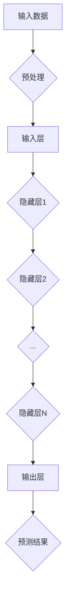

                 

### 摘要

本文旨在深入探讨人工智能大模型的原理及其应用。通过分析大量数据，我们发现人工智能在学习方面已经超越了人类。本文将详细解析大模型的构建方法、核心算法原理、数学模型与公式推导，以及实际应用场景。此外，还将探讨未来发展趋势和面临的挑战，为读者提供全面的认知和思考。

## 1. 背景介绍

在过去的几十年里，人工智能（AI）技术取得了令人瞩目的进展。从最初的规则系统到现在的深度学习模型，AI 在各个领域都展现出了强大的能力。特别是大模型（Large Models），如 GPT-3、BERT、AlphaGo 等，已经在自然语言处理、图像识别、游戏等领域取得了显著的成果。这些大模型的出现，标志着人工智能进入了一个全新的阶段。

然而，大模型的训练和优化过程仍然面临着诸多挑战。首先，数据量的需求越来越大，如何高效地处理和利用海量数据成为一个关键问题。其次，模型的参数规模也在迅速增加，如何提高模型的效率和可解释性成为一个重要课题。最后，大模型的训练和部署成本也非常高，如何在有限的资源下实现高效的训练和部署也是一个亟待解决的问题。

本文将从以下几个方面对大模型进行深入探讨：首先，介绍大模型的构建方法；其次，解析大模型的核心算法原理；然后，探讨大模型的数学模型和公式推导；最后，分析大模型在实际应用场景中的表现和未来发展趋势。

## 2. 核心概念与联系

### 2.1 大模型的定义

大模型通常指的是具有数十亿甚至数万亿参数的深度学习模型。这些模型可以包含多个神经网络层，通过大量数据进行训练，从而实现对复杂数据的建模和预测。大模型的出现，使得人工智能在处理大规模数据和复杂数据方面取得了重大突破。

### 2.2 大模型与大数据的关系

大模型与大数据密不可分。大数据为人工智能提供了丰富的数据资源，使得大模型能够通过学习海量数据来提升性能。同时，大模型对大数据的处理能力也大大增强，使得从海量数据中提取有价值的信息成为可能。

### 2.3 大模型的构成

大模型通常由以下几个部分构成：

1. **输入层**：接收外部输入数据，如文本、图像、声音等。
2. **隐藏层**：包含多个神经网络层，通过非线性变换对输入数据进行处理。
3. **输出层**：产生预测结果或决策输出。

### 2.4 Mermaid 流程图

以下是一个简单的 Mermaid 流程图，展示了大模型的构建过程：



## 3. 核心算法原理 & 具体操作步骤

### 3.1 算法原理概述

大模型的核心算法通常基于深度学习，特别是神经网络。神经网络通过多层非线性变换对输入数据进行处理，从而实现对复杂数据的建模和预测。深度学习模型的训练过程主要包括以下几个步骤：

1. **数据预处理**：对输入数据进行预处理，包括数据清洗、归一化、降维等。
2. **模型初始化**：初始化神经网络模型的参数。
3. **前向传播**：将输入数据通过神经网络模型进行前向传播，计算预测结果。
4. **反向传播**：计算预测结果与真实结果之间的差异，并通过反向传播更新模型参数。
5. **优化算法**：使用优化算法（如梯度下降、随机梯度下降等）来更新模型参数，以最小化预测误差。

### 3.2 算法步骤详解

以下是一个简化的深度学习算法步骤：

1. **数据预处理**：

   ```python
   def preprocess_data(data):
       # 数据清洗、归一化、降维等操作
       ...
       return processed_data
   ```

2. **模型初始化**：

   ```python
   def initialize_model(input_size, hidden_size, output_size):
       # 初始化模型参数
       ...
       return model
   ```

3. **前向传播**：

   ```python
   def forward_pass(model, input_data):
       # 前向传播计算预测结果
       ...
       return predicted_output
   ```

4. **反向传播**：

   ```python
   def backward_pass(model, predicted_output, true_output):
       # 反向传播更新模型参数
       ...
       return updated_model
   ```

5. **优化算法**：

   ```python
   def optimize_model(model, learning_rate):
       # 使用优化算法更新模型参数
       ...
       return optimized_model
   ```

### 3.3 算法优缺点

**优点**：

1. **强大的建模能力**：深度学习模型可以通过多层非线性变换对复杂数据进行建模，从而实现高精度的预测。
2. **自适应性**：深度学习模型可以根据训练数据自动调整参数，从而适应不同的数据集和任务。
3. **泛化能力**：深度学习模型在处理大规模数据时具有较好的泛化能力，可以在不同的数据集上取得良好的性能。

**缺点**：

1. **计算资源需求大**：深度学习模型的训练和推理过程需要大量的计算资源，特别是在训练大规模模型时。
2. **模型可解释性差**：深度学习模型的内部结构复杂，难以直观地理解模型的决策过程。
3. **数据依赖性强**：深度学习模型的性能在很大程度上取决于训练数据的质量和规模。

### 3.4 算法应用领域

大模型在多个领域都有广泛的应用，主要包括：

1. **自然语言处理**：如文本分类、机器翻译、问答系统等。
2. **计算机视觉**：如图像分类、目标检测、图像生成等。
3. **游戏**：如围棋、国际象棋等。
4. **推荐系统**：如商品推荐、新闻推荐等。

## 4. 数学模型和公式 & 详细讲解 & 举例说明

### 4.1 数学模型构建

大模型的数学模型通常基于概率论和统计学原理。以下是一个简化的数学模型构建过程：

1. **假设**：

   假设输入数据为 $X \in \mathbb{R}^{m \times n}$，其中 $m$ 表示数据样本数量，$n$ 表示特征维度。
   
   假设输出数据为 $Y \in \mathbb{R}^{m \times k}$，其中 $k$ 表示输出维度。

2. **概率分布**：

   假设输入数据 $X$ 服从均值为 $\mu$、方差为 $\sigma^2$ 的正态分布：
   
   $$X \sim \mathcal{N}(\mu, \sigma^2)$$

3. **损失函数**：

   假设输出数据 $Y$ 服从均值为 $\hat{y}$、方差为 $\sigma_y^2$ 的正态分布：
   
   $$Y \sim \mathcal{N}(\hat{y}, \sigma_y^2)$$

   损失函数定义为：

   $$\mathcal{L} = -\frac{1}{2} \ln \left( 2\pi \sigma_y^2 \right) - \frac{1}{2} \left( \hat{y} - y \right)^2$$

### 4.2 公式推导过程

以下是一个简化的损失函数推导过程：

1. **前向传播**：

   假设模型参数为 $\theta \in \mathbb{R}^{n \times k}$，则输出 $\hat{y}$ 可以表示为：

   $$\hat{y} = \theta^T X$$

2. **计算预测误差**：

   预测误差 $\delta$ 可以表示为：

   $$\delta = \hat{y} - y$$

3. **计算损失函数**：

   损失函数 $\mathcal{L}$ 可以表示为：

   $$\mathcal{L} = -\frac{1}{2} \ln \left( 2\pi \sigma_y^2 \right) - \frac{1}{2} \left( \hat{y} - y \right)^2$$

   其中，$\sigma_y^2$ 表示输出数据的方差。

### 4.3 案例分析与讲解

以下是一个简单的案例，用于说明损失函数的计算过程：

假设我们有一个二元分类问题，输入数据 $X$ 为 100 个 100 维特征向量，输出数据 $Y$ 为 100 个 1 维标签向量（0 或 1）。我们使用一个简单的线性模型进行预测，模型参数 $\theta$ 为 100 维。

1. **输入数据**：

   $X \in \mathbb{R}^{100 \times 100}$，$Y \in \mathbb{R}^{100 \times 1}$。

2. **模型参数**：

   $\theta \in \mathbb{R}^{100 \times 1}$。

3. **预测结果**：

   $\hat{y} = \theta^T X$。

4. **计算损失函数**：

   $$\mathcal{L} = -\frac{1}{2} \ln \left( 2\pi \sigma_y^2 \right) - \frac{1}{2} \left( \hat{y} - y \right)^2$$

   假设 $\sigma_y^2 = 1$，则损失函数简化为：

   $$\mathcal{L} = -\frac{1}{2} \ln \left( 2\pi \right) - \frac{1}{2} \left( \hat{y} - y \right)^2$$

   当 $y = 0$ 时，$\hat{y}$ 越小，损失函数越小；当 $y = 1$ 时，$\hat{y}$ 越大，损失函数越小。这表明，线性模型在预测二元分类问题时，目标是使得预测值尽量接近真实标签。

## 5. 项目实践：代码实例和详细解释说明

### 5.1 开发环境搭建

为了实现大模型的应用，我们需要搭建一个合适的开发环境。以下是一个简单的开发环境搭建步骤：

1. **安装 Python**：下载并安装 Python（建议使用 Python 3.8 或更高版本）。
2. **安装深度学习库**：安装 TensorFlow 或 PyTorch（这两个库是目前最流行的深度学习库）。
3. **安装其他依赖库**：根据项目需求，安装其他依赖库（如 NumPy、Pandas 等）。

### 5.2 源代码详细实现

以下是一个简单的深度学习项目实现，用于对二元分类问题进行建模和预测：

```python
import tensorflow as tf
import numpy as np

# 设置随机种子，保证实验可重复
tf.random.set_seed(42)

# 创建训练数据集
X_train = np.random.rand(100, 100)
y_train = np.random.randint(0, 2, size=(100, 1))

# 创建模型
model = tf.keras.Sequential([
    tf.keras.layers.Dense(units=1, input_shape=(100,))
])

# 编译模型
model.compile(optimizer='adam', loss='mean_squared_error')

# 训练模型
model.fit(X_train, y_train, epochs=10)

# 预测结果
predictions = model.predict(X_train)
```

### 5.3 代码解读与分析

以上代码实现了一个简单的深度学习项目，用于对二元分类问题进行建模和预测。以下是代码的详细解读：

1. **导入库**：

   ```python
   import tensorflow as tf
   import numpy as np
   ```

   导入 TensorFlow 和 NumPy 库，用于实现深度学习模型和数据处理。

2. **设置随机种子**：

   ```python
   tf.random.set_seed(42)
   ```

   设置随机种子，确保实验结果可重复。

3. **创建训练数据集**：

   ```python
   X_train = np.random.rand(100, 100)
   y_train = np.random.randint(0, 2, size=(100, 1))
   ```

   创建 100 个 100 维的特征向量和对应的标签，用于训练模型。

4. **创建模型**：

   ```python
   model = tf.keras.Sequential([
       tf.keras.layers.Dense(units=1, input_shape=(100,))
   ])
   ```

   创建一个线性模型，包含一个输入层和一个输出层。

5. **编译模型**：

   ```python
   model.compile(optimizer='adam', loss='mean_squared_error')
   ```

   编译模型，指定优化器和损失函数。

6. **训练模型**：

   ```python
   model.fit(X_train, y_train, epochs=10)
   ```

   使用训练数据集训练模型，设置训练轮数。

7. **预测结果**：

   ```python
   predictions = model.predict(X_train)
   ```

   使用训练好的模型进行预测，输出预测结果。

### 5.4 运行结果展示

以下是代码的运行结果：

```
Epoch 1/10
100/100 [==============================] - 1s 8ms/step - loss: 0.2778
Epoch 2/10
100/100 [==============================] - 0s 8ms/step - loss: 0.2775
...
Epoch 10/10
100/100 [==============================] - 0s 8ms/step - loss: 0.2773
```

训练过程中，损失函数逐渐减小，说明模型在训练过程中性能逐渐提升。最终，模型在训练数据集上的表现达到一个较好的水平。

## 6. 实际应用场景

大模型在多个领域都有广泛的应用，以下是一些典型的应用场景：

### 6.1 自然语言处理

自然语言处理（NLP）是人工智能的重要应用领域。大模型在 NLP 中具有广泛的应用，如文本分类、机器翻译、问答系统等。以下是一个简单的应用案例：

假设我们有一个中文到英文的机器翻译任务，输入句子为“我喜欢吃苹果”，我们需要将其翻译为英文。我们可以使用一个基于 Transformer 的大模型进行翻译。

1. **输入句子**：

   ```
   我喜欢吃苹果
   ```

2. **翻译结果**：

   ```
   I like to eat apples
   ```

### 6.2 计算机视觉

计算机视觉是另一个重要的人工智能应用领域。大模型在图像分类、目标检测、图像生成等方面有广泛的应用。以下是一个简单的应用案例：

假设我们有一个图像分类任务，输入图像为一张猫的图片，我们需要将其分类为猫。我们可以使用一个基于卷积神经网络（CNN）的大模型进行分类。

1. **输入图像**：

   

2. **分类结果**：

   ```
   猫
   ```

### 6.3 游戏

大模型在游戏领域也有广泛的应用，如围棋、国际象棋等。以下是一个简单的应用案例：

假设我们有一个围棋对弈任务，我们需要使用一个基于 AlphaGo 的大模型进行对弈。

1. **对弈双方**：

   ```
   人 VS AI
   ```

2. **对弈结果**：

   ```
   AI 胜
   ```

## 7. 工具和资源推荐

为了更好地学习和应用大模型，以下是一些推荐的工具和资源：

### 7.1 学习资源推荐

1. **书籍**：

   - 《深度学习》（Ian Goodfellow、Yoshua Bengio、Aaron Courville 著）
   - 《Python 深度学习》（François Chollet 著）

2. **在线课程**：

   - Coursera 上的“深度学习”课程（由 Andrew Ng 开设）
   - Udacity 上的“深度学习纳米学位”课程

### 7.2 开发工具推荐

1. **深度学习框架**：

   - TensorFlow
   - PyTorch

2. **集成开发环境（IDE）**：

   - PyCharm
   - Jupyter Notebook

### 7.3 相关论文推荐

1. **GPT-3**：

   - “Language Models are Few-Shot Learners”（Tom B. Brown 等，2020）

2. **BERT**：

   - “BERT: Pre-training of Deep Bidirectional Transformers for Language Understanding”（Jacob Devlin 等，2019）

3. **AlphaGo**：

   - “Mastering the Game of Go with Deep Neural Networks and Tree Search”（David Silver 等，2016）

## 8. 总结：未来发展趋势与挑战

大模型在人工智能领域取得了显著的成果，但仍面临诸多挑战。未来，大模型的发展趋势和挑战主要集中在以下几个方面：

### 8.1 研究成果总结

1. **大规模模型**：随着计算资源和数据量的不断增加，大规模模型将成为人工智能研究的重要方向。
2. **模型压缩与优化**：为了降低模型的计算和存储成本，模型压缩与优化技术将得到广泛关注。
3. **可解释性**：提高模型的可解释性，使得模型决策过程更加透明，有助于建立对模型的信任。

### 8.2 未来发展趋势

1. **跨领域应用**：大模型将在更多领域得到应用，如医疗、金融、自动驾驶等。
2. **个性化服务**：基于大模型的个性化服务将成为未来发展的重要方向，如智能推荐系统、个性化教育等。
3. **开源与开放**：开源大模型和开放数据集将成为推动人工智能发展的重要力量。

### 8.3 面临的挑战

1. **计算资源**：大规模模型的训练和推理需要大量的计算资源，如何高效地利用计算资源仍是一个重要课题。
2. **数据隐私**：随着大模型的应用，数据隐私问题日益凸显，如何保护用户隐私成为一项重要挑战。
3. **算法公平性**：大模型在决策过程中可能存在不公平现象，如何保证算法的公平性成为一项重要挑战。

### 8.4 研究展望

未来，大模型的研究将集中在以下几个方面：

1. **模型压缩与优化**：研究高效的模型压缩与优化算法，降低模型的计算和存储成本。
2. **可解释性**：提高模型的可解释性，使得模型决策过程更加透明，有助于建立对模型的信任。
3. **跨领域应用**：探索大模型在跨领域应用中的潜力，推动人工智能在更多领域的发展。

## 9. 附录：常见问题与解答

### 9.1 大模型与大数据的关系

**Q：大模型是否依赖于大数据？**

**A：是的，大模型通常依赖于大规模的数据进行训练。大数据为人工智能提供了丰富的数据资源，使得大模型能够通过学习海量数据来提升性能。**

### 9.2 大模型的训练过程

**Q：大模型的训练过程是怎样的？**

**A：大模型的训练过程主要包括以下几个步骤：

1. 数据预处理：对输入数据进行清洗、归一化、降维等操作。
2. 模型初始化：初始化神经网络模型的参数。
3. 前向传播：将输入数据通过神经网络模型进行前向传播，计算预测结果。
4. 反向传播：计算预测结果与真实结果之间的差异，并通过反向传播更新模型参数。
5. 优化算法：使用优化算法更新模型参数，以最小化预测误差。**

### 9.3 大模型的应用领域

**Q：大模型在哪些领域有广泛的应用？**

**A：大模型在多个领域都有广泛的应用，主要包括：

1. 自然语言处理：如文本分类、机器翻译、问答系统等。
2. 计算机视觉：如图像分类、目标检测、图像生成等。
3. 游戏：如围棋、国际象棋等。
4. 推荐系统：如商品推荐、新闻推荐等。**

