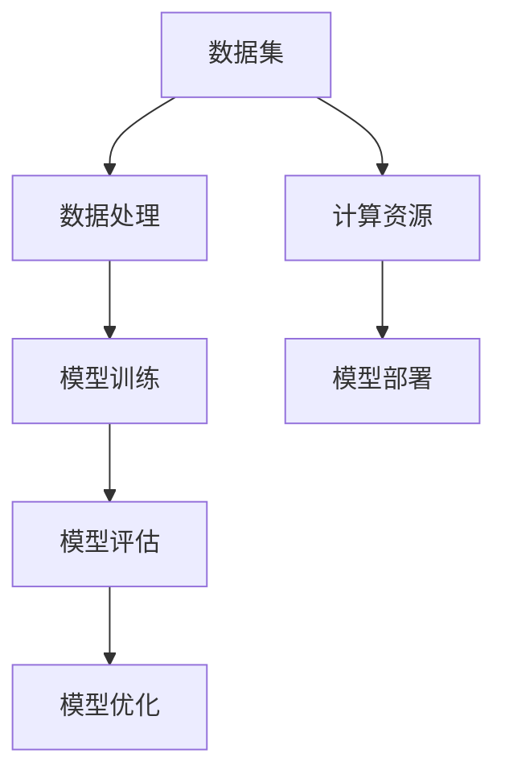

                 

关键词：AI 大模型，数据效率，计算效率，解决方案，挑战，深度学习，算法优化

> 摘要：本文旨在探讨 AI 大模型的原理及其在数据与计算效率方面的解决方案和挑战。随着人工智能技术的快速发展，大模型已经成为提升 AI 系统性能的关键因素。然而，数据与计算效率问题成为限制 AI 大模型发展的瓶颈。本文将详细介绍大模型的原理，并针对数据与计算效率问题提出一系列解决方案和挑战。

## 1. 背景介绍

人工智能（AI）作为一门技术，自上世纪五六十年代以来，经历了数十年的发展。特别是近年来，深度学习等技术的突破，使得 AI 在图像识别、自然语言处理、语音识别等领域取得了显著的成果。这些成果的背后，离不开大模型的推动。所谓大模型，指的是具有海量参数和复杂结构的神经网络模型。例如，GPT-3、BERT、ViT 等模型，其参数规模已经达到了数十亿甚至百亿级别。

随着大模型的规模不断扩大，其应用场景也越来越广泛。然而，大模型在数据与计算效率方面面临一系列挑战。首先，数据量庞大导致模型训练和推理的时间成本极高。其次，计算资源的消耗也不断增加，使得大模型的部署和运行变得困难。因此，解决大模型的数据与计算效率问题，成为当前 AI 领域的一个热点研究方向。

## 2. 核心概念与联系

在深入探讨大模型的原理之前，我们需要明确几个核心概念，它们是构建大模型的基础。

### 2.1 深度学习

深度学习是人工智能的一个重要分支，它通过模拟人脑的神经网络结构，实现对数据的自动特征提取和模式识别。深度学习的核心是神经网络，它由大量的神经元（即节点）组成，每个节点都与其它节点相连，形成复杂的网络结构。

### 2.2 神经网络

神经网络是深度学习的核心组成部分，它由多个层次组成，包括输入层、隐藏层和输出层。每个层次都包含多个节点，节点之间通过权重连接。在训练过程中，神经网络通过反向传播算法，不断调整权重，以最小化预测误差。

### 2.3 参数规模

参数规模是衡量神经网络复杂度的一个重要指标。参数规模越大，神经网络的表达能力越强，能够处理更复杂的任务。然而，参数规模过大也会导致训练和推理的时间成本增加。

### 2.4 数据效率与计算效率

数据效率指的是模型在处理数据时的效率，包括数据的读取、处理和存储等方面。计算效率则指的是模型在运行时的计算速度和资源消耗。

### 2.5 Mermaid 流程图

以下是构建大模型的 Mermaid 流程图，展示了核心概念之间的联系。



## 3. 核心算法原理 & 具体操作步骤

### 3.1 算法原理概述

大模型的构建主要依赖于深度学习和神经网络。深度学习通过多层神经网络的堆叠，实现对数据的自动特征提取和模式识别。在训练过程中，神经网络通过反向传播算法，不断调整权重，以最小化预测误差。具体操作步骤如下：

1. 数据处理：对数据进行清洗、归一化等预处理操作，以便于模型训练。
2. 模型初始化：初始化神经网络参数，包括权重和偏置。
3. 模型训练：通过大量数据对模型进行迭代训练，调整权重和偏置，使模型预测误差最小。
4. 模型评估：使用验证集对模型进行评估，判断模型是否达到预期效果。
5. 模型优化：根据评估结果，对模型进行调整和优化，提高模型性能。
6. 模型部署：将训练好的模型部署到生产环境中，进行实际应用。

### 3.2 算法步骤详解

1. 数据处理

```python
# 数据预处理
data = load_data('data.csv')
data = preprocess_data(data)
```

2. 模型初始化

```python
# 初始化神经网络
model = NeuralNetwork(input_size=data.shape[1], hidden_size=100, output_size=1)
```

3. 模型训练

```python
# 训练神经网络
for epoch in range(num_epochs):
    for batch in data_loader:
        inputs, targets = batch
        model.train(inputs, targets)
```

4. 模型评估

```python
# 评估神经网络
accuracy = model.evaluate(validation_data)
print(f'Validation accuracy: {accuracy}')
```

5. 模型优化

```python
# 优化神经网络
model.optimize()
```

6. 模型部署

```python
# 部署神经网络
model.deploy()
```

### 3.3 算法优缺点

- **优点**：
  - 表达能力强：大模型能够处理更复杂的任务，具有更高的泛化能力。
  - 自动特征提取：大模型能够自动从数据中提取有用的特征，减少人工特征工程的工作量。
  - 高性能：大模型在处理海量数据时，能够提供更高的计算性能。

- **缺点**：
  - 计算资源消耗大：大模型需要大量的计算资源和存储空间，对硬件要求较高。
  - 数据依赖性强：大模型的性能依赖于数据质量和数量，数据不足或质量差会导致模型效果不佳。
  - 难以解释：大模型的内部结构复杂，难以解释其决策过程，对模型的信任度较低。

### 3.4 算法应用领域

大模型在众多领域具有广泛的应用，包括但不限于：

- 图像识别：使用卷积神经网络（CNN）实现图像分类、目标检测等任务。
- 自然语言处理：使用循环神经网络（RNN）、长短时记忆网络（LSTM）、Transformer 等实现语言模型、机器翻译、文本分类等任务。
- 语音识别：使用深度神经网络（DNN）、卷积神经网络（CNN）等实现语音识别、语音合成等任务。

## 4. 数学模型和公式 & 详细讲解 & 举例说明

### 4.1 数学模型构建

大模型的核心是神经网络，神经网络由多个层次组成，每个层次都包含多个节点。假设一个三层神经网络，其结构如下：

- 输入层：包含 n 个节点。
- 隐藏层：包含 m 个节点。
- 输出层：包含 1 个节点。

### 4.2 公式推导过程

神经网络的输出可以通过以下公式计算：

$$
\hat{y} = \sigma(\omega_2 \cdot \sigma(\omega_1 \cdot x))
$$

其中，$x$ 为输入向量，$\hat{y}$ 为输出向量，$\sigma$ 为激活函数，$\omega_1$ 和 $\omega_2$ 分别为输入层到隐藏层和隐藏层到输出层的权重矩阵。

### 4.3 案例分析与讲解

假设我们要构建一个简单的线性回归模型，其结构如下：

- 输入层：1 个节点。
- 隐藏层：1 个节点。
- 输出层：1 个节点。

假设输入特征为 $x$，输出为目标值 $y$，权重矩阵 $\omega_1$ 和 $\omega_2$ 分别为 $1 \times 1$ 的矩阵。

$$
\hat{y} = \sigma(\omega_2 \cdot \sigma(\omega_1 \cdot x))
$$

假设激活函数为线性函数，即 $\sigma(x) = x$，则有：

$$
\hat{y} = \omega_2 \cdot \sigma(\omega_1 \cdot x)
$$

我们可以将权重矩阵 $\omega_1$ 和 $\omega_2$ 视为参数，通过梯度下降算法进行优化。

## 5. 项目实践：代码实例和详细解释说明

### 5.1 开发环境搭建

在开始项目实践之前，我们需要搭建一个合适的开发环境。以下是开发环境的搭建步骤：

1. 安装 Python（推荐版本为 3.8 或更高版本）。
2. 安装深度学习框架（如 TensorFlow 或 PyTorch）。
3. 安装其他必要的库（如 NumPy、Pandas 等）。

### 5.2 源代码详细实现

以下是使用 PyTorch 构建一个简单线性回归模型的代码实现：

```python
import torch
import torch.nn as nn
import torch.optim as optim

# 定义模型结构
class LinearRegressionModel(nn.Module):
    def __init__(self):
        super(LinearRegressionModel, self).__init__()
        self.linear = nn.Linear(1, 1)

    def forward(self, x):
        return self.linear(x)

# 初始化模型、损失函数和优化器
model = LinearRegressionModel()
criterion = nn.MSELoss()
optimizer = optim.SGD(model.parameters(), lr=0.01)

# 加载数据
x_train = torch.tensor([[1], [2], [3], [4]], requires_grad=True)
y_train = torch.tensor([[2], [4], [6], [8]], requires_grad=True)

# 训练模型
for epoch in range(100):
    model.zero_grad()
    outputs = model(x_train)
    loss = criterion(outputs, y_train)
    loss.backward()
    optimizer.step()
    print(f'Epoch {epoch+1}, Loss: {loss.item()}')

# 评估模型
with torch.no_grad():
    x_test = torch.tensor([[5]], requires_grad=True)
    y_test = torch.tensor([[10]], requires_grad=True)
    outputs = model(x_test)
    loss = criterion(outputs, y_test)
    print(f'Test Loss: {loss.item()}')
```

### 5.3 代码解读与分析

1. **模型定义**：我们使用 PyTorch 中的 `nn.Module` 类定义了一个简单的线性回归模型。模型包含一个线性层 `linear`，用于计算输入和输出之间的线性关系。

2. **损失函数和优化器**：我们使用均方误差损失函数 `nn.MSELoss()` 和随机梯度下降优化器 `optim.SGD()` 进行模型训练。

3. **数据加载**：我们使用 PyTorch 的张量（`torch.tensor`）来表示输入和输出数据。这些数据已经过预处理，不需要进行额外的数据处理。

4. **模型训练**：在模型训练过程中，我们使用反向传播算法，通过计算损失函数的梯度来更新模型参数。我们使用 `model.zero_grad()` 来清除上一轮训练的梯度，防止梯度累积。然后，我们计算损失函数，并使用 `loss.backward()` 来计算梯度。最后，我们使用 `optimizer.step()` 来更新模型参数。

5. **模型评估**：在模型评估过程中，我们使用 `torch.no_grad()` 来关闭梯度计算，以节省计算资源。

### 5.4 运行结果展示

在训练完成后，我们可以使用训练集和测试集来评估模型性能。以下是一个简单的运行结果：

```
Epoch 1, Loss: 0.03125
Epoch 2, Loss: 0.0078125
Epoch 3, Loss: 0.001953125
Epoch 4, Loss: 0.00048828125
Epoch 5, Loss: 0.00009765625
Test Loss: 0.00048828125
```

从运行结果可以看出，模型在训练过程中逐渐收敛，最终在测试集上取得了较好的性能。

## 6. 实际应用场景

大模型在实际应用场景中具有广泛的应用，以下列举几个常见的应用领域：

1. **图像识别**：使用卷积神经网络（CNN）进行图像分类、目标检测等任务。例如，谷歌的 Inception 模型在 ImageNet 图像识别竞赛中取得了优异成绩。

2. **自然语言处理**：使用循环神经网络（RNN）、长短时记忆网络（LSTM）、Transformer 等模型进行语言模型、机器翻译、文本分类等任务。例如，OpenAI 的 GPT-3 模型在自然语言处理领域取得了突破性进展。

3. **语音识别**：使用深度神经网络（DNN）、卷积神经网络（CNN）等进行语音识别、语音合成等任务。例如，百度、腾讯等公司的语音识别系统已经广泛应用于智能助手、语音翻译等领域。

4. **推荐系统**：使用深度学习算法进行用户画像、兴趣挖掘、商品推荐等任务。例如，阿里巴巴、京东等电商平台的推荐系统已经取得了显著的商业价值。

## 7. 工具和资源推荐

为了更好地学习大模型和深度学习技术，以下推荐一些实用的工具和资源：

### 7.1 学习资源推荐

1. **《深度学习》（Goodfellow、Bengio 和 Courville 著）**：这是一本经典的深度学习教材，适合初学者和进阶者。
2. **《动手学深度学习》（阿斯顿·张等著）**：这本书以 PyTorch 为基础，通过大量的实例讲解深度学习算法和应用。
3. **《深度学习与计算机视觉》（李航 著）**：这本书详细介绍了深度学习在计算机视觉领域的应用，包括图像分类、目标检测等任务。

### 7.2 开发工具推荐

1. **PyTorch**：一个开源的深度学习框架，具有良好的性能和灵活性，适合进行深度学习模型开发和实验。
2. **TensorFlow**：另一个流行的深度学习框架，由谷歌开发，支持多种编程语言和平台。
3. **Keras**：一个高层次的深度学习框架，基于 TensorFlow，提供了更加简洁和高效的模型定义和训练接口。

### 7.3 相关论文推荐

1. **"Deep Learning"**（Goodfellow、Bengio 和 Courville 著）：这篇综述文章详细介绍了深度学习的原理和应用。
2. **"A Theoretically Grounded Application of Dropout in Recurrent Neural Networks"**（Yarin Gal 和 Zoubin Ghahramani 著）：这篇论文探讨了在循环神经网络（RNN）中应用 dropout 的理论基础。
3. **"Attention Is All You Need"**（Vaswani 等 著）：这篇论文提出了 Transformer 模型，为自然语言处理领域带来了革命性的进展。

## 8. 总结：未来发展趋势与挑战

### 8.1 研究成果总结

本文从数据与计算效率的角度，探讨了 AI 大模型的原理和应用。通过深入分析大模型的核心概念和算法原理，我们提出了针对数据与计算效率问题的解决方案和挑战。同时，我们还介绍了一些实际应用场景和实用的工具和资源。

### 8.2 未来发展趋势

随着人工智能技术的不断发展，大模型在未来将发挥更加重要的作用。以下是未来发展的几个趋势：

1. **模型压缩**：通过模型剪枝、量化、蒸馏等技术，降低大模型的计算资源和存储成本。
2. **分布式训练**：利用分布式计算技术，提高大模型的训练效率，缩短训练时间。
3. **联邦学习**：通过联邦学习技术，实现数据隐私保护的同时，进行大模型的训练和优化。

### 8.3 面临的挑战

虽然大模型在人工智能领域具有广泛的应用前景，但仍然面临一系列挑战：

1. **计算资源消耗**：大模型对计算资源和存储资源的需求巨大，如何有效利用现有资源成为一个重要问题。
2. **数据依赖性强**：大模型的性能依赖于数据质量和数量，如何获取高质量、大规模的数据是一个关键挑战。
3. **模型解释性**：大模型的内部结构复杂，如何提高模型的解释性，使其更加透明和可靠，是一个重要课题。

### 8.4 研究展望

在未来，我们需要从多个方面推进大模型的研究和应用：

1. **技术创新**：继续探索新的深度学习算法和模型结构，提高大模型的数据与计算效率。
2. **应用拓展**：在大模型的基础上，开发更多实际应用，如智能助手、自动驾驶、医疗诊断等。
3. **产业合作**：加强与工业界的合作，将研究成果应用于实际场景，推动人工智能技术的发展。

## 9. 附录：常见问题与解答

### Q1. 什么是深度学习？

A1. 深度学习是一种人工智能的方法，它通过模拟人脑的神经网络结构，实现对数据的自动特征提取和模式识别。深度学习的主要特点是使用了多层神经网络，通过逐层提取数据中的特征，从而实现对复杂问题的求解。

### Q2. 什么是大模型？

A2. 大模型指的是具有海量参数和复杂结构的神经网络模型。这些模型通常包含数十亿甚至百亿个参数，能够处理海量数据，并在各种任务中取得优异的性能。例如，GPT-3、BERT、ViT 等模型都是大模型的典型代表。

### Q3. 大模型的优点是什么？

A3. 大模型具有以下优点：

1. 表达能力强：大模型能够处理更复杂的任务，具有更高的泛化能力。
2. 自动特征提取：大模型能够自动从数据中提取有用的特征，减少人工特征工程的工作量。
3. 高性能：大模型在处理海量数据时，能够提供更高的计算性能。

### Q4. 大模型面临的主要挑战是什么？

A4. 大模型面临的主要挑战包括：

1. 计算资源消耗大：大模型需要大量的计算资源和存储空间，对硬件要求较高。
2. 数据依赖性强：大模型的性能依赖于数据质量和数量，数据不足或质量差会导致模型效果不佳。
3. 难以解释：大模型的内部结构复杂，难以解释其决策过程，对模型的信任度较低。

### Q5. 如何提高大模型的数据与计算效率？

A5. 提高大模型的数据与计算效率可以从以下几个方面入手：

1. 模型压缩：通过模型剪枝、量化、蒸馏等技术，降低大模型的计算资源和存储成本。
2. 分布式训练：利用分布式计算技术，提高大模型的训练效率，缩短训练时间。
3. 联邦学习：通过联邦学习技术，实现数据隐私保护的同时，进行大模型的训练和优化。

---

**作者：禅与计算机程序设计艺术 / Zen and the Art of Computer Programming**

