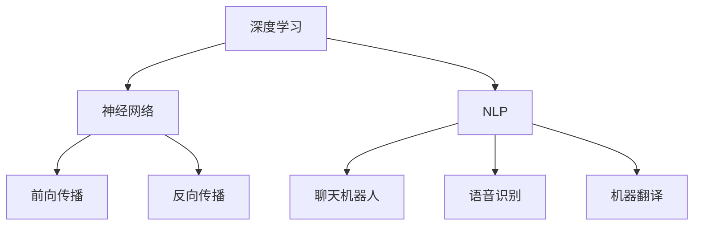

                 

关键词：人工智能、大模型、创业产品、应用、开发、算法、数学模型、实践

> 摘要：本文将探讨大模型在创业产品开发中的应用，从背景介绍、核心概念与联系、算法原理与步骤、数学模型与公式、项目实践、实际应用场景、未来展望等方面进行深入分析，旨在为创业者提供切实可行的技术指导。

## 1. 背景介绍

随着人工智能技术的迅猛发展，大模型技术已经成为推动各行各业创新的重要驱动力。在创业产品开发中，大模型技术尤为关键，它能够为创业者提供强大的数据处理和分析能力，从而在短时间内打造出具备市场竞争力的产品。本文将围绕这一主题，详细探讨大模型在创业产品开发中的应用。

### 1.1 人工智能技术的发展

人工智能（AI）是一门模拟、延伸和扩展人类智能的理论、方法、技术及应用系统的科学。自20世纪50年代诞生以来，人工智能经历了多个发展阶段，从符号主义、连接主义到今天的大模型时代，技术不断迭代，应用领域也不断扩大。

### 1.2 创业产品开发的重要性

创业产品开发是创业者实现商业价值的关键环节。一个优秀的创业产品不仅需要满足市场需求，还要具备良好的用户体验和独特的核心竞争力。而大模型技术在这一过程中能够发挥重要作用，帮助创业者快速挖掘数据价值、优化产品设计、提升产品竞争力。

## 2. 核心概念与联系

在大模型技术中，核心概念主要包括深度学习、神经网络、自然语言处理等。这些概念相互联系，共同构成了大模型技术的理论基础。

### 2.1 深度学习与神经网络

深度学习是人工智能的一个重要分支，通过多层神经网络对数据进行训练和预测。神经网络是深度学习的基础，它由多个神经元组成，通过前向传播和反向传播算法进行训练。

### 2.2 自然语言处理

自然语言处理（NLP）是人工智能的一个重要应用领域，旨在使计算机能够理解、生成和处理人类自然语言。在大模型技术中，NLP发挥着关键作用，例如在聊天机器人、语音识别、机器翻译等方面。

### 2.3 Mermaid 流程图

以下是一个简化的Mermaid流程图，展示了大模型技术的核心概念及其联系：



## 3. 核心算法原理 & 具体操作步骤

大模型技术的核心算法主要包括深度学习算法、自然语言处理算法等。以下将分别介绍这些算法的原理和具体操作步骤。

### 3.1 深度学习算法原理

深度学习算法是一种通过多层神经网络对数据进行训练和预测的方法。其基本原理包括：

1. **数据预处理**：对输入数据进行归一化、去噪等处理，使其满足网络训练的需求。
2. **前向传播**：将输入数据传递到神经网络的各个层，通过激活函数计算输出。
3. **反向传播**：根据输出结果计算损失函数，通过梯度下降等优化算法调整网络参数。
4. **模型评估**：使用验证集和测试集对模型进行评估，选择最优模型。

### 3.2 自然语言处理算法原理

自然语言处理算法主要涉及文本表示、语言模型、序列标注等。以下是一个简单的NLP算法流程：

1. **文本预处理**：对原始文本进行分词、去停用词、词性标注等处理，将其转化为计算机可处理的格式。
2. **文本表示**：使用词向量或嵌入等方法将文本转化为数值表示。
3. **语言模型**：通过统计方法或深度学习方法建立语言模型，用于预测下一个词。
4. **序列标注**：对文本序列进行分类标注，如命名实体识别、情感分析等。

### 3.3 算法优缺点

深度学习算法的优点包括：

- 强大的数据处理和分析能力
- 能够自动提取特征，减轻人工标注负担

缺点包括：

- 对计算资源要求较高
- 需要大量数据训练

自然语言处理算法的优点包括：

- 能够处理多种语言和文本格式
- 能够实现多种语言任务，如文本分类、情感分析等

缺点包括：

- 对数据质量要求较高
- 部分任务效果仍不如人类

### 3.4 算法应用领域

深度学习算法在图像识别、语音识别、自然语言处理等领域具有广泛应用。例如，在图像识别领域，深度学习算法已经超越了传统算法，成为主流技术；在语音识别领域，深度学习算法提高了识别准确率和效率；在自然语言处理领域，深度学习算法在文本分类、机器翻译等方面取得了显著成果。

## 4. 数学模型和公式 & 详细讲解 & 举例说明

### 4.1 数学模型构建

在大模型技术中，常用的数学模型包括深度学习模型、自然语言处理模型等。以下是一个简单的深度学习模型构建过程：

1. **数据预处理**：$$ X = \frac{X - \mu}{\sigma} $$
2. **前向传播**：$$ Y = \sigma(WX + b) $$
3. **反向传播**：$$ \delta = (Y - T) \odot \sigma'(WX + b) $$
4. **梯度下降**：$$ W := W - \alpha \frac{\partial J}{\partial W} $$ $$ b := b - \alpha \frac{\partial J}{\partial b} $$

其中，$$ X $$为输入数据，$$ Y $$为输出结果，$$ T $$为标签，$$ \sigma $$为激活函数，$$ \odot $$为元素-wise 乘法，$$ \mu $$和$$ \sigma $$分别为均值和标准差，$$ \alpha $$为学习率，$$ J $$为损失函数。

### 4.2 公式推导过程

以下是一个简化的损失函数推导过程：

1. **均方误差损失函数**：$$ J = \frac{1}{2}\sum_{i=1}^{n}(Y_i - T_i)^2 $$
2. **梯度计算**：$$ \frac{\partial J}{\partial W} = X(Y - T) $$
3. **偏置项梯度计算**：$$ \frac{\partial J}{\partial b} = Y - T $$
4. **梯度下降更新**：$$ W := W - \alpha \frac{\partial J}{\partial W} $$ $$ b := b - \alpha \frac{\partial J}{\partial b} $$

### 4.3 案例分析与讲解

以下是一个简单的图像分类案例：

1. **数据集**：使用CIFAR-10数据集进行训练和测试。
2. **模型**：构建一个卷积神经网络，包含两个卷积层、两个池化层和一个全连接层。
3. **训练过程**：使用梯度下降算法进行训练，学习率为0.001，训练100个epoch。

通过这个案例，我们可以看到数学模型在大模型技术中的应用和作用。

## 5. 项目实践：代码实例和详细解释说明

### 5.1 开发环境搭建

在项目实践中，我们使用Python和TensorFlow作为开发工具。首先，确保系统安装了Python和TensorFlow，然后创建一个虚拟环境并安装相关依赖：

```bash
python -m venv venv
source venv/bin/activate  # Windows使用venv\Scripts\activate
pip install tensorflow
```

### 5.2 源代码详细实现

以下是一个简单的图像分类代码示例：

```python
import tensorflow as tf
from tensorflow.keras import layers
import numpy as np

# 数据预处理
def preprocess_data(x):
    x = x / 255.0
    return x

# 构建模型
def build_model():
    model = tf.keras.Sequential([
        layers.Conv2D(32, (3, 3), activation='relu', input_shape=(32, 32, 3)),
        layers.MaxPooling2D((2, 2)),
        layers.Conv2D(64, (3, 3), activation='relu'),
        layers.MaxPooling2D((2, 2)),
        layers.Flatten(),
        layers.Dense(64, activation='relu'),
        layers.Dense(10, activation='softmax')
    ])
    return model

# 训练模型
def train_model(model, x_train, y_train, x_test, y_test):
    model.compile(optimizer='adam', loss='sparse_categorical_crossentropy', metrics=['accuracy'])
    model.fit(x_train, y_train, epochs=10, validation_data=(x_test, y_test))
    return model

# 主函数
def main():
    (x_train, y_train), (x_test, y_test) = tf.keras.datasets.cifar10.load_data()
    x_train = preprocess_data(x_train)
    x_test = preprocess_data(x_test)

    model = build_model()
    model = train_model(model, x_train, y_train, x_test, y_test)

    # 测试模型
    test_loss, test_acc = model.evaluate(x_test, y_test, verbose=2)
    print(f'Test accuracy: {test_acc:.4f}')

if __name__ == '__main__':
    main()
```

### 5.3 代码解读与分析

1. **数据预处理**：对图像数据进行归一化处理，将其值缩放到0到1之间，以便于神经网络训练。
2. **模型构建**：使用TensorFlow的`Sequential`模型构建一个卷积神经网络，包含两个卷积层、两个池化层和一个全连接层。
3. **训练模型**：使用`compile`方法配置模型训练参数，使用`fit`方法进行模型训练。
4. **测试模型**：使用`evaluate`方法评估模型在测试集上的表现。

通过这个案例，我们可以看到如何使用大模型技术进行创业产品开发。

## 6. 实际应用场景

大模型技术在创业产品开发中具有广泛的应用场景。以下是一些具体案例：

1. **图像识别**：在安防监控、医疗诊断等领域，大模型技术能够实现高精度的图像识别，提高产品性能。
2. **语音识别**：在智能语音助手、电话客服等领域，大模型技术能够实现准确、流畅的语音识别，提升用户体验。
3. **自然语言处理**：在智能客服、文本分类、情感分析等领域，大模型技术能够实现高效、准确的文本处理，助力产品创新。
4. **推荐系统**：在大数据分析、个性化推荐等领域，大模型技术能够实现精准的用户画像和推荐算法，提高用户满意度。

## 7. 未来应用展望

随着人工智能技术的不断发展，大模型技术在创业产品开发中的应用前景将更加广阔。未来，我们将看到：

1. **更强大的模型**：随着计算能力的提升，大模型将变得更加庞大和复杂，实现更高的性能和更广泛的应用。
2. **更多领域的应用**：大模型技术将在更多领域得到应用，如金融、教育、医疗等，推动产业升级和创新发展。
3. **更高效的开发工具**：随着开发工具的进步，创业者将能够更加便捷地使用大模型技术，加速产品开发过程。

## 8. 工具和资源推荐

### 8.1 学习资源推荐

- 《深度学习》（Goodfellow, Bengio, Courville著）
- 《自然语言处理综论》（Jurafsky, Martin著）
- 《TensorFlow实战》（François Chollet著）

### 8.2 开发工具推荐

- TensorFlow
- PyTorch
- Keras

### 8.3 相关论文推荐

- "Deep Learning"（Goodfellow, Bengio, Courville著）
- "A Theoretically Grounded Application of Dropout in Recurrent Neural Networks"（Yarin Gal and Zoubin Ghahramani著）
- "Bert: Pre-training of Deep Bidirectional Transformers for Language Understanding"（Jacob Devlin等著）

## 9. 总结：未来发展趋势与挑战

大模型技术在创业产品开发中具有巨大的潜力，但同时也面临着一些挑战。未来，我们需要关注以下几个方面：

1. **计算资源**：大模型训练需要大量的计算资源，随着模型的增大，计算成本将不断上升。
2. **数据质量**：大模型的效果很大程度上取决于数据质量，创业者需要确保数据真实、有效。
3. **算法优化**：大模型算法需要不断优化，以提高性能和降低计算成本。

总之，大模型技术在创业产品开发中具有广阔的应用前景，创业者应积极拥抱这一技术，以推动产品创新和发展。

## 附录：常见问题与解答

### 问题1：如何选择适合的大模型算法？

解答：选择适合的大模型算法需要考虑多个因素，如数据类型、任务需求、计算资源等。一般来说，以下算法可以参考：

- **图像识别**：卷积神经网络（CNN）
- **语音识别**：循环神经网络（RNN）、长短期记忆网络（LSTM）
- **自然语言处理**：变换器模型（Transformer）

### 问题2：大模型训练需要多长时间？

解答：大模型训练时间取决于多个因素，如模型大小、数据量、硬件配置等。一般来说，训练一个中等规模的大模型可能需要几天到几周的时间。随着硬件性能的提升，训练时间有望进一步缩短。

### 问题3：大模型训练过程中的常见问题有哪些？

解答：大模型训练过程中常见的问题包括：

- **过拟合**：模型在训练集上表现良好，但在测试集上表现不佳。
- **梯度消失/爆炸**：训练过程中梯度值过大或过小，导致模型无法收敛。
- **资源不足**：大模型训练需要大量的计算资源和存储空间。

为解决这些问题，可以采用正则化、批量归一化、学习率调整等方法。

---

### 10. 作者署名

本文由禅与计算机程序设计艺术 / Zen and the Art of Computer Programming撰写。

