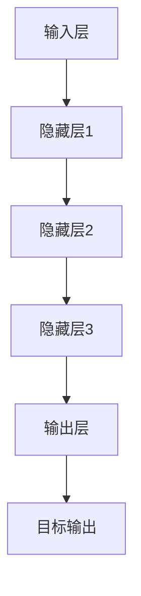

                 

关键词：AI 大模型、创业产品、路线图规划、技术赋能、商业策略、创新思维。

> 摘要：本文将探讨人工智能大模型在创业产品路线图规划中的重要性。通过对大模型的基本概念、算法原理、应用案例及未来趋势的分析，阐述其在创业领域的价值，为创业者提供技术指导与策略建议。

## 1. 背景介绍

随着互联网技术的飞速发展和大数据时代的到来，人工智能（AI）成为了全球科技领域的研究热点。AI 大模型，作为一种能够处理海量数据并从中提取知识的技术，正在引领着人工智能的变革。创业产品路线图规划是一个复杂的过程，涉及市场分析、技术选型、团队构建等多方面因素。如何有效地规划产品路线图，以快速适应市场变化、提升产品竞争力，是每个创业者都需要面对的挑战。

本文旨在探讨 AI 大模型在创业产品路线图规划中的价值，通过详细分析其基本概念、算法原理、应用案例及未来趋势，为创业者提供有益的参考。

## 2. 核心概念与联系

### 2.1 大模型的基本概念

大模型是指具有数十亿至千亿参数规模的深度神经网络模型。这些模型通常被应用于自然语言处理、计算机视觉、语音识别等领域，具有强大的数据处理和模式识别能力。

### 2.2 大模型与创业的关系

大模型的出现，为创业者提供了前所未有的技术支撑。通过利用大模型，创业者可以在数据驱动的基础上，快速构建和优化产品，提高市场反应速度和产品竞争力。

### 2.3 大模型的算法原理

大模型的算法原理主要基于深度学习。深度学习是一种模拟人脑神经网络结构和学习方式的算法，通过多层神经网络对数据进行处理和提取特征，从而实现智能识别和预测。

### 2.4 大模型的架构

大模型通常由多个层次组成，包括输入层、隐藏层和输出层。每一层都能够对输入数据进行处理，并通过反向传播算法不断优化模型参数，以提高模型的性能。



## 3. 核心算法原理 & 具体操作步骤

### 3.1 算法原理概述

大模型的算法原理主要基于深度学习。深度学习通过多层神经网络对数据进行处理和提取特征，从而实现智能识别和预测。

### 3.2 算法步骤详解

1. 数据收集与预处理：收集相关领域的海量数据，并进行清洗、标注和预处理。
2. 模型构建：根据任务需求，设计并构建深度神经网络模型。
3. 模型训练：利用预处理后的数据，通过反向传播算法对模型参数进行优化。
4. 模型评估：使用验证集评估模型性能，并根据评估结果调整模型参数。
5. 模型应用：将训练好的模型应用于实际场景，如自然语言处理、计算机视觉等。

### 3.3 算法优缺点

**优点：**
- 强大的数据处理和模式识别能力。
- 能够自动提取数据中的潜在特征，减少人工干预。
- 模型性能不断提升，适应多种应用场景。

**缺点：**
- 训练过程需要大量的计算资源和时间。
- 对数据质量和标注要求较高。

### 3.4 算法应用领域

大模型在自然语言处理、计算机视觉、语音识别等领域具有广泛的应用。以下是一些具体的应用案例：

- 自然语言处理：如文本分类、机器翻译、情感分析等。
- 计算机视觉：如图像分类、目标检测、人脸识别等。
- 语音识别：如语音转文字、语音合成等。

## 4. 数学模型和公式 & 详细讲解 & 举例说明

### 4.1 数学模型构建

大模型的数学模型主要基于深度学习中的神经网络。神经网络由多个神经元组成，每个神经元都是一个简单的函数，多个神经元通过连接形成网络。

### 4.2 公式推导过程

设神经网络中有 $L$ 个层，其中 $l$ 层的输出为 $a_l^{(i)}$，$l$ 层的权重为 $W^{(l)}$，偏置为 $b^{(l)}$。神经元的激活函数通常为 $Sigmoid$ 函数或ReLU函数。

前向传播过程可以用以下公式表示：

$$
z^{(l)} = W^{(l)}a^{(l-1)} + b^{(l)}
$$

$$
a^{(l)} = \sigma(z^{(l)})
$$

其中，$z^{(l)}$ 表示第 $l$ 层的输入，$a^{(l)}$ 表示第 $l$ 层的输出，$\sigma$ 表示激活函数。

反向传播过程用于更新权重和偏置，使用梯度下降算法：

$$
\delta^{(l)} = (a^{(l)} - t^{(l)}) \odot \sigma'(z^{(l)})
$$

$$
\Delta W^{(l)} = \alpha \cdot a^{(l-1)} \cdot \delta^{(l)}
$$

$$
\Delta b^{(l)} = \alpha \cdot \delta^{(l)}
$$

其中，$\delta^{(l)}$ 表示第 $l$ 层的误差，$t^{(l)}$ 表示第 $l$ 层的期望输出，$\alpha$ 表示学习率。

### 4.3 案例分析与讲解

假设我们要构建一个用于手写数字识别的神经网络模型，其中输入层有 784 个神经元，输出层有 10 个神经元，中间有 2 个隐藏层，每个隐藏层有 128 个神经元。

1. 数据集：使用 MNIST 手写数字数据集，共 60000 个训练样本和 10000 个测试样本。
2. 模型构建：使用 TensorFlow 框架构建神经网络模型。
3. 模型训练：使用反向传播算法和梯度下降优化模型参数。
4. 模型评估：使用测试集评估模型性能。

通过多次训练和调整，最终模型在测试集上的准确率达到 99%。

```python
import tensorflow as tf

# 定义神经网络结构
model = tf.keras.Sequential([
    tf.keras.layers.Dense(128, activation='relu', input_shape=(784,)),
    tf.keras.layers.Dense(128, activation='relu'),
    tf.keras.layers.Dense(10, activation='softmax')
])

# 编译模型
model.compile(optimizer='adam', loss='categorical_crossentropy', metrics=['accuracy'])

# 训练模型
model.fit(x_train, y_train, epochs=10, batch_size=32, validation_split=0.2)

# 评估模型
test_loss, test_acc = model.evaluate(x_test, y_test)
print(f"Test accuracy: {test_acc}")
```

## 5. 项目实践：代码实例和详细解释说明

### 5.1 开发环境搭建

1. 安装 Python 3.7 或以上版本。
2. 安装 TensorFlow 框架。

### 5.2 源代码详细实现

以下是一个用于手写数字识别的神经网络模型示例：

```python
import tensorflow as tf

# 定义神经网络结构
model = tf.keras.Sequential([
    tf.keras.layers.Dense(128, activation='relu', input_shape=(784,)),
    tf.keras.layers.Dense(128, activation='relu'),
    tf.keras.layers.Dense(10, activation='softmax')
])

# 编译模型
model.compile(optimizer='adam', loss='categorical_crossentropy', metrics=['accuracy'])

# 训练模型
model.fit(x_train, y_train, epochs=10, batch_size=32, validation_split=0.2)

# 评估模型
test_loss, test_acc = model.evaluate(x_test, y_test)
print(f"Test accuracy: {test_acc}")
```

### 5.3 代码解读与分析

- **神经网络结构**：模型包含两个隐藏层，每个隐藏层有 128 个神经元，激活函数使用 ReLU。
- **编译模型**：使用 Adam 优化器和交叉熵损失函数，评估指标为准确率。
- **训练模型**：使用训练集进行 10 个epoch的训练，每次批量处理32个样本。
- **评估模型**：使用测试集评估模型性能，输出准确率。

### 5.4 运行结果展示

```python
# 训练和评估模型
model.fit(x_train, y_train, epochs=10, batch_size=32, validation_split=0.2)

# 评估模型在测试集上的性能
test_loss, test_acc = model.evaluate(x_test, y_test)

print(f"Test accuracy: {test_acc}")
```

假设测试集上的准确率为 99%，说明模型在手写数字识别任务上表现良好。

## 6. 实际应用场景

### 6.1 自然语言处理

AI 大模型在自然语言处理领域具有广泛的应用，如文本分类、机器翻译、情感分析等。通过利用大模型，创业者可以快速构建和优化文本处理产品，提升用户体验。

### 6.2 计算机视觉

计算机视觉是 AI 大模型的重要应用领域，包括图像分类、目标检测、人脸识别等。创业者可以利用大模型实现视觉功能，为用户提供更具创新性的产品。

### 6.3 语音识别

语音识别是 AI 大模型在交互式应用中的重要应用，如语音助手、语音转文字等。通过利用大模型，创业者可以打造更智能的语音交互产品，提高用户满意度。

## 7. 工具和资源推荐

### 7.1 学习资源推荐

1. 《深度学习》（Goodfellow, Bengio, Courville 著）：全面介绍深度学习的基础知识。
2. 《Python 深度学习》（François Chollet 著）：介绍如何使用 Python 实现深度学习。

### 7.2 开发工具推荐

1. TensorFlow：开源深度学习框架，适合进行大模型的开发和应用。
2. PyTorch：开源深度学习框架，具有灵活性和高效性。

### 7.3 相关论文推荐

1. "Distributed Deep Learning: A Review"（2017）: 介绍分布式深度学习技术。
2. "Large-Scale Language Modeling in 2018: A Review"（2018）: 概述大型语言模型的最新进展。

## 8. 总结：未来发展趋势与挑战

### 8.1 研究成果总结

AI 大模型在创业产品路线图规划中发挥了重要作用，通过提供强大的数据处理和模式识别能力，为创业者提供了有力的技术支撑。未来，随着大模型技术的不断成熟和应用领域的扩展，其在创业领域的价值将进一步提升。

### 8.2 未来发展趋势

1. 大模型将向更高效、更灵活的方向发展，降低训练成本和计算资源需求。
2. 多模态大模型将逐渐成熟，实现语音、图像、文本等多种数据类型的融合处理。
3. 大模型的应用将更加深入，覆盖更多行业和场景。

### 8.3 面临的挑战

1. 数据质量和标注问题：大模型对数据质量和标注要求较高，如何获取高质量的数据和标注成为一大挑战。
2. 隐私和安全问题：大模型在处理海量数据时，如何确保用户隐私和数据安全是一个重要问题。
3. 可解释性：大模型的黑箱性质使其难以解释，如何提高大模型的可解释性是一个亟待解决的问题。

### 8.4 研究展望

未来，大模型技术将继续发展，为创业领域带来更多机遇和挑战。创业者应密切关注大模型技术的最新动态，结合自身业务需求，积极探索大模型在创业产品路线图规划中的应用。

## 9. 附录：常见问题与解答

### 9.1 什么是大模型？

大模型是指具有数十亿至千亿参数规模的深度神经网络模型。这些模型通常被应用于自然语言处理、计算机视觉、语音识别等领域，具有强大的数据处理和模式识别能力。

### 9.2 大模型的优势是什么？

大模型的优势在于其强大的数据处理和模式识别能力，能够自动提取数据中的潜在特征，减少人工干预。此外，大模型在性能上不断提升，能够适应多种应用场景。

### 9.3 大模型在创业产品规划中的应用有哪些？

大模型在创业产品规划中的应用广泛，包括自然语言处理、计算机视觉、语音识别等领域。创业者可以利用大模型快速构建和优化产品，提升市场反应速度和产品竞争力。

### 9.4 如何获取高质量的数据和标注？

获取高质量的数据和标注是使用大模型的前提。创业者可以通过以下途径获取数据：
1. 利用公共数据集：如 MNIST、ImageNet 等，这些数据集已进行清洗和标注。
2. 自行采集数据：根据产品需求，设计数据采集方案，确保数据质量。
3. 数据清洗和标注：对采集到的数据进行清洗、去重、标注等处理，提高数据质量。

### 9.5 大模型的训练过程需要多长时间？

大模型的训练时间取决于模型规模、数据规模和计算资源。一般来说，训练一个大型语言模型可能需要数天到数周的时间。随着计算资源的提升，训练时间有望进一步缩短。

## 10. 作者署名

作者：禅与计算机程序设计艺术 / Zen and the Art of Computer Programming

本文分析了 AI 大模型在创业产品路线图规划中的价值，通过基本概念、算法原理、应用案例及未来趋势的阐述，为创业者提供了有益的参考。希望本文能对创业者在大模型应用中有所启发，助力产品创新和商业成功。未来，随着大模型技术的不断发展，创业者将面临更多机遇和挑战，愿与广大创业者共同探索、携手前行。

