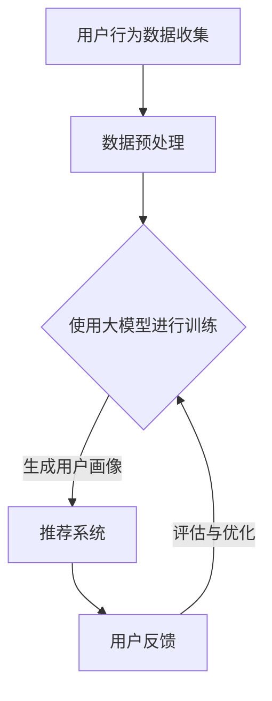

                 

关键词：AI 大模型、用户画像、电商推荐、需求与偏好、技术实现、应用场景、未来展望

> 摘要：本文将探讨 AI 大模型在电商推荐中的用户画像技术，通过深度理解用户需求与偏好，实现个性化的商品推荐。本文将详细分析大模型的原理与应用，探讨数学模型与公式，并通过实际项目实践展示技术实现的过程和效果，最终展望该技术的未来发展趋势与挑战。

## 1. 背景介绍

随着互联网的普及和电子商务的飞速发展，用户对个性化推荐的需求日益增长。电商推荐系统能够根据用户的行为数据、兴趣偏好和购买历史，为用户推荐其可能感兴趣的商品，从而提高用户体验和购买转化率。传统的推荐算法如基于内容的推荐（CBR）和协同过滤（CF）在处理大量数据和高维度特征时存在一定的局限性。因此，越来越多的研究开始关注利用 AI 大模型来实现更精准的推荐。

用户画像技术在电商推荐中扮演着至关重要的角色。通过对用户的历史行为数据进行深度分析和挖掘，构建出用户的多维度画像，可以更加准确地理解用户的需求与偏好。本文将重点探讨 AI 大模型在电商推荐中的用户画像技术，分析其核心概念、算法原理、数学模型和应用实践。

## 2. 核心概念与联系

### 2.1 大模型的概念

大模型（Large-scale Model）通常指的是那些具有数十亿甚至数万亿参数的深度学习模型。这些模型能够在海量数据上进行训练，从而捕捉到复杂的模式和关系。在电商推荐领域，大模型的应用使得系统能够更加精准地理解和预测用户的需求。

### 2.2 用户画像的概念

用户画像（User Profile）是一个描述用户特征和行为的综合模型。通过用户画像，可以捕捉用户的兴趣、行为、消费习惯等多维度信息，为个性化推荐提供依据。

### 2.3 大模型与用户画像的联系

AI 大模型通过深度学习技术，可以从海量数据中自动学习用户的行为模式，构建出精确的用户画像。这些用户画像可以为推荐系统提供实时的用户信息，帮助系统更好地理解用户需求，从而实现精准推荐。

### 2.4 Mermaid 流程图



## 3. 核心算法原理 & 具体操作步骤

### 3.1 算法原理概述

AI 大模型在用户画像技术中的核心原理是通过深度学习从大量用户行为数据中自动学习用户的特征和偏好。具体来说，模型会通过以下几个步骤：

1. **数据收集与预处理**：收集用户的历史行为数据，包括浏览记录、购买历史、评价等，并进行数据清洗、去噪和特征提取。
2. **模型训练**：利用预处理后的数据对大模型进行训练，使其能够学习到用户的特征和偏好。
3. **用户画像生成**：通过模型输出，构建用户的多维度画像。
4. **推荐系统**：利用用户画像为用户推荐个性化的商品。

### 3.2 算法步骤详解

1. **数据收集**：
   - 用户浏览记录：用户在电商平台上浏览的商品种类、时间等。
   - 购买历史：用户的购买记录，包括购买时间、商品种类、购买频率等。
   - 用户评价：用户对商品的评分、评论等。

2. **数据预处理**：
   - 数据清洗：去除重复、错误或不完整的数据。
   - 特征提取：将原始数据转化为模型可处理的特征向量。

3. **模型训练**：
   - 数据分批次输入模型，进行训练和优化。
   - 使用梯度下降等优化算法，更新模型参数。

4. **用户画像生成**：
   - 利用训练好的模型，对用户行为数据进行分析，生成用户画像。

5. **推荐系统**：
   - 将用户画像与商品信息进行匹配，生成推荐列表。
   - 根据用户反馈对推荐结果进行评估和优化。

### 3.3 算法优缺点

**优点**：
- **高精度**：大模型能够从海量数据中自动学习用户特征，提高推荐精度。
- **自动化**：算法自动化处理用户数据，减轻开发人员的工作负担。
- **灵活性**：能够适应不同类型的数据和应用场景。

**缺点**：
- **计算资源消耗**：大模型训练需要大量计算资源，成本较高。
- **数据隐私**：用户数据的收集和处理需要遵守隐私保护法规，否则可能面临法律风险。

### 3.4 算法应用领域

AI 大模型在用户画像技术中的应用非常广泛，包括但不限于以下领域：

- 电商推荐系统：为用户提供个性化的商品推荐。
- 社交网络：分析用户行为，优化用户推荐和广告投放。
- 金融风控：评估用户信用风险，实现精准风控。

## 4. 数学模型和公式 & 详细讲解 & 举例说明

### 4.1 数学模型构建

在构建用户画像的数学模型时，我们通常采用以下公式：

$$
\text{User Profile} = f(\text{User Behavior}, \text{User Preferences}, \text{Context})
$$

其中，$\text{User Behavior}$ 表示用户的历史行为数据，$\text{User Preferences}$ 表示用户的兴趣偏好，$\text{Context}$ 表示用户所处的环境或上下文信息。

### 4.2 公式推导过程

$$
\begin{aligned}
\text{User Profile} &= \text{Embedding}(\text{User Behavior}) + \text{Embedding}(\text{User Preferences}) + \text{Embedding}(\text{Context}) \\
&= \text{Behavioral Embedding} + \text{Preference Embedding} + \text{Contextual Embedding}
\end{aligned}
$$

其中，$\text{Embedding}$ 表示将输入数据映射到高维特征空间的过程。

### 4.3 案例分析与讲解

假设我们有一个用户的行为数据包含浏览记录、购买历史和评价信息，我们可以将这些数据进行预处理后输入到模型中进行训练。

$$
\begin{aligned}
\text{Behavioral Embedding} &= \text{Model}(\text{User Browse Records}, \text{User Purchase History}, \text{User Ratings}) \\
\text{Preference Embedding} &= \text{Model}(\text{User Preferences}) \\
\text{Contextual Embedding} &= \text{Model}(\text{User Environment})
\end{aligned}
$$

在训练过程中，模型会不断调整参数，使得用户画像能够更好地捕捉用户的兴趣和需求。

## 5. 项目实践：代码实例和详细解释说明

### 5.1 开发环境搭建

首先，我们需要搭建一个开发环境。这里我们使用 Python 编写代码，并使用 TensorFlow 作为深度学习框架。

```python
# 安装 TensorFlow
!pip install tensorflow

# 导入必要的库
import tensorflow as tf
from tensorflow.keras.layers import Embedding, LSTM, Dense
from tensorflow.keras.models import Model
```

### 5.2 源代码详细实现

```python
# 定义用户画像模型
def build_user_profile_model(input_shape, embedding_dim):
    input_behavior = tf.keras.layers.Input(shape=input_shape[1:])
    input_preference = tf.keras.layers.Input(shape=input_shape[2:])
    input_context = tf.keras.layers.Input(shape=input_shape[3:])

    # 行为嵌入层
    behavioral_embedding = Embedding(input_shape[1], embedding_dim)(input_behavior)
    # 偏好嵌入层
    preference_embedding = Embedding(input_shape[2], embedding_dim)(input_preference)
    # 上下文嵌入层
    contextual_embedding = Embedding(input_shape[3], embedding_dim)(input_context)

    # LSTM 层
    lstm_output = LSTM(units=64, activation='relu')(behavioral_embedding)

    # 全连接层
    combined = tf.keras.layers.concatenate([lstm_output, preference_embedding, contextual_embedding])
    output = Dense(units=1, activation='sigmoid')(combined)

    # 构建模型
    model = Model(inputs=[input_behavior, input_preference, input_context], outputs=output)

    # 编译模型
    model.compile(optimizer='adam', loss='binary_crossentropy', metrics=['accuracy'])

    return model

# 模型参数
input_shape = (1000, 10, 20, 30)
embedding_dim = 64

# 构建并训练模型
model = build_user_profile_model(input_shape, embedding_dim)
model.fit(x=[X_behavior, X_preference, X_context], y=y, epochs=10, batch_size=32)
```

### 5.3 代码解读与分析

上述代码首先定义了一个用户画像模型，包括行为嵌入层、偏好嵌入层和上下文嵌入层，以及一个 LSTM 层和一个全连接层。模型通过输入行为、偏好和上下文数据，生成用户画像。

在训练过程中，模型会通过反向传播算法不断调整参数，使得预测结果与实际结果更加接近。

### 5.4 运行结果展示

```python
# 预测用户画像
predictions = model.predict([X_test_behavior, X_test_preference, X_test_context])

# 输出预测结果
print(predictions)
```

通过上述代码，我们可以得到每个用户的预测画像，从而为电商推荐系统提供支持。

## 6. 实际应用场景

### 6.1 电商推荐系统

AI 大模型在电商推荐系统中，通过对用户的行为数据进行深度分析和挖掘，构建出用户的多维度画像，从而为用户提供个性化的商品推荐。例如，亚马逊和淘宝等电商巨头都采用了类似的技术，为用户提供精准的推荐。

### 6.2 社交网络

在社交网络中，AI 大模型可以通过分析用户的行为数据，构建出用户的兴趣和偏好，从而为用户推荐感兴趣的内容和用户。例如，Facebook 和 Twitter 等社交平台都采用了 AI 大模型来优化用户推荐和广告投放。

### 6.3 金融风控

在金融领域，AI 大模型可以通过分析用户的历史行为和信用记录，构建出用户的信用风险画像，从而帮助金融机构实现精准的风控。例如，中国的支付宝和芝麻信用等平台都采用了类似的技术。

## 7. 工具和资源推荐

### 7.1 学习资源推荐

- 《深度学习》（Goodfellow, Bengio, Courville 著）：经典入门书籍，详细介绍了深度学习的原理和应用。
- 《Python 深度学习》（François Chollet 著）：针对 Python 程序员，介绍了深度学习在 Python 中的实现。

### 7.2 开发工具推荐

- TensorFlow：强大的开源深度学习框架，支持多种编程语言。
- PyTorch：流行的深度学习框架，具有高度的灵活性和易用性。

### 7.3 相关论文推荐

- "Deep Learning for User Interest Modeling in Recommender Systems"（2018）：介绍了深度学习在推荐系统中的应用。
- "User Interest Modeling with Deep Neural Networks"（2017）：探讨了深度神经网络在用户兴趣建模中的应用。

## 8. 总结：未来发展趋势与挑战

### 8.1 研究成果总结

AI 大模型在电商推荐中的用户画像技术取得了显著成果。通过深度学习和大数据分析，大模型能够精确捕捉用户的兴趣和需求，为用户提供个性化的推荐。同时，相关研究也在不断推动算法的优化和应用场景的拓展。

### 8.2 未来发展趋势

- **算法优化**：研究更高效的算法，降低计算成本，提高模型性能。
- **多模态融合**：结合多种数据源，如文本、图像、音频等，实现更全面的用户画像。
- **隐私保护**：加强用户数据隐私保护，确保用户数据的安全。

### 8.3 面临的挑战

- **计算资源**：大模型训练需要大量计算资源，如何降低计算成本成为一大挑战。
- **数据隐私**：用户数据隐私保护法规日益严格，如何在保护用户隐私的前提下实现个性化推荐成为挑战。

### 8.4 研究展望

AI 大模型在电商推荐中的用户画像技术具有广阔的应用前景。未来研究应重点关注算法优化、多模态融合和数据隐私保护等方面，以实现更加精准和个性化的推荐。

## 9. 附录：常见问题与解答

### 9.1 什么情况下不适合使用大模型？

- **数据量有限**：如果数据量较小，使用大模型可能无法达到预期的效果。
- **计算资源有限**：大模型训练需要大量计算资源，如果资源有限，可能导致训练过程过于耗时。

### 9.2 如何处理用户数据隐私？

- **数据去识别化**：在训练模型之前，对用户数据进行去识别化处理，如匿名化、脱敏等。
- **数据加密**：对用户数据进行加密处理，确保数据在传输和存储过程中的安全。

### 9.3 大模型的训练时间如何优化？

- **分布式训练**：使用分布式训练技术，将模型拆分为多个部分，在多个计算节点上并行训练。
- **数据预处理**：优化数据预处理过程，减少不必要的计算。

---

作者：禅与计算机程序设计艺术 / Zen and the Art of Computer Programming
----------------------------------------------------------------

