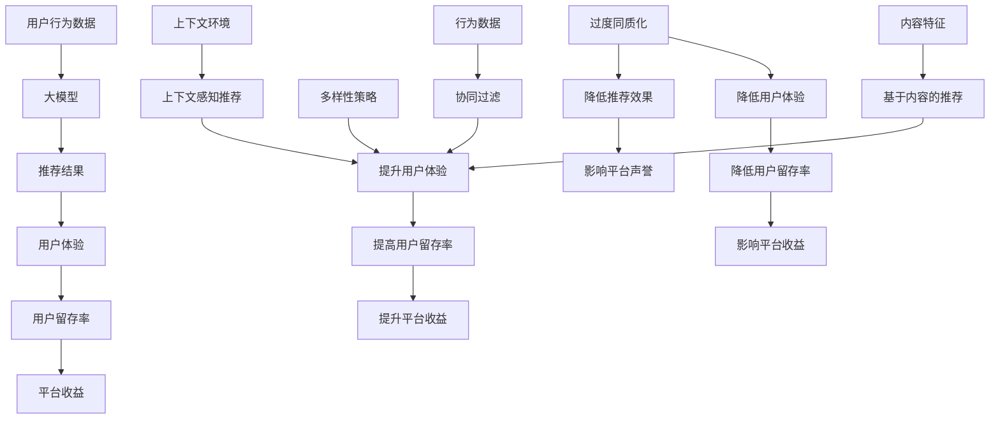

                 

关键词：AI 大模型、电商搜索推荐、多样性策略、过度同质化、算法优化

## 摘要

本文探讨了人工智能（AI）大模型在电商搜索推荐中的多样性策略，旨在解决当前推荐系统中存在的过度同质化问题。首先，我们对电商搜索推荐系统进行了概述，随后深入分析了大模型在推荐系统中的作用以及过度同质化的负面影响。接着，本文提出了多种多样的策略，如基于内容的推荐、协同过滤、上下文感知推荐等，以提升推荐结果的多样性。然后，我们详细介绍了这些策略的实现原理、算法步骤以及优缺点。此外，我们还通过一个具体的项目实践案例，展示了如何在实际应用中实现多样性策略。最后，本文对未来应用场景进行了展望，并提出了未来发展趋势与挑战。

## 1. 背景介绍

随着互联网和电子商务的迅速发展，电商搜索推荐系统已成为电商平台的核心功能之一。用户在使用电商平台时，通常需要通过搜索功能找到自己感兴趣的商品。为了提高用户体验，推荐系统通过对用户的兴趣和行为进行分析，为其推荐相关商品。然而，随着推荐系统的普及和用户数据的不断积累，过度同质化的问题逐渐显现出来。

过度同质化指的是推荐系统在推荐商品时，倾向于推荐用户已浏览或购买过的类似商品，导致用户在浏览过程中体验到大量重复的内容，降低了用户满意度和参与度。这种现象不仅影响了用户的购物体验，还对电商平台的长期发展产生了负面影响。

为了解决过度同质化问题，电商搜索推荐系统需要引入多样性策略。多样性策略旨在通过算法优化，提高推荐结果的多样性，使用户在浏览过程中体验到丰富的商品内容。本文将探讨多种多样性策略，包括基于内容的推荐、协同过滤、上下文感知推荐等，以期为电商搜索推荐系统的优化提供新的思路。

## 2. 核心概念与联系

### 2.1 大模型在推荐系统中的作用

大模型（Large Model）是指具有巨大参数量、高度复杂度的神经网络模型。在推荐系统中，大模型主要用于捕捉用户兴趣和行为特征，从而实现精准推荐。大模型具有以下几个优点：

1. **高泛化能力**：大模型能够处理海量数据，提取出用户兴趣的通用特征，从而实现跨领域的推荐。
2. **强大的表示能力**：大模型能够通过深度学习技术，对用户行为数据进行有效编码，提取出用户兴趣的深层次特征。
3. **自适应能力**：大模型能够根据用户的行为数据实时调整推荐策略，提高推荐效果。

### 2.2 过度同质化的影响

过度同质化对电商搜索推荐系统的影响主要体现在以下几个方面：

1. **降低用户体验**：推荐系统倾向于推荐用户已浏览或购买过的类似商品，导致用户在浏览过程中体验到大量重复的内容，降低了用户满意度和参与度。
2. **降低用户留存率**：用户在浏览过程中感到乏味和无聊，导致用户对电商平台的粘性降低，从而影响用户留存率。
3. **影响平台收益**：用户对推荐系统的不满意可能导致用户流失，进而影响电商平台的收益。

### 2.3 多样性策略

为了解决过度同质化问题，推荐系统需要引入多样性策略。多样性策略主要包括以下几个方面：

1. **基于内容的推荐**：通过分析商品的内容特征，为用户推荐与用户兴趣相关的商品。
2. **协同过滤**：通过分析用户的行为数据，为用户推荐与用户有相似兴趣的其他用户已购买或浏览的商品。
3. **上下文感知推荐**：根据用户所处的上下文环境，为用户推荐与当前上下文相关的商品。

### 2.4 Mermaid 流程图

以下是一个简单的 Mermaid 流程图，展示了电商搜索推荐系统中大模型、过度同质化以及多样性策略之间的联系：



## 3. 核心算法原理 & 具体操作步骤

### 3.1 算法原理概述

电商搜索推荐系统中的多样性策略主要基于以下三种算法原理：

1. **基于内容的推荐**：通过分析商品的内容特征，为用户推荐与用户兴趣相关的商品。
2. **协同过滤**：通过分析用户的行为数据，为用户推荐与用户有相似兴趣的其他用户已购买或浏览的商品。
3. **上下文感知推荐**：根据用户所处的上下文环境，为用户推荐与当前上下文相关的商品。

### 3.2 算法步骤详解

#### 3.2.1 基于内容的推荐

1. **商品内容特征提取**：通过对商品进行分类、标签、属性等特征提取，构建商品内容特征向量。
2. **用户兴趣特征提取**：通过对用户的历史行为数据进行分析，构建用户兴趣特征向量。
3. **相似度计算**：计算商品内容特征向量与用户兴趣特征向量之间的相似度，选择相似度最高的商品进行推荐。

#### 3.2.2 协同过滤

1. **用户行为数据预处理**：对用户行为数据进行清洗、去噪、归一化等处理。
2. **用户相似度计算**：计算用户之间的相似度，采用余弦相似度、皮尔逊相关系数等算法。
3. **推荐商品选择**：根据用户相似度矩阵，选择与目标用户最相似的其他用户已购买或浏览的商品进行推荐。

#### 3.2.3 上下文感知推荐

1. **上下文特征提取**：根据用户所处的上下文环境，提取上下文特征，如地理位置、天气、时间等。
2. **上下文特征编码**：将上下文特征编码为向量形式，与商品特征向量进行融合。
3. **相似度计算**：计算融合后的商品特征向量与用户兴趣特征向量之间的相似度，选择相似度最高的商品进行推荐。

### 3.3 算法优缺点

#### 3.3.1 基于内容的推荐

**优点**：

- **计算效率高**：基于内容的推荐算法主要通过特征提取和相似度计算，计算复杂度相对较低。
- **易于实现**：基于内容的推荐算法技术成熟，易于实现和部署。

**缺点**：

- **用户兴趣多样性不足**：基于内容的推荐算法主要依赖于商品特征，难以捕捉用户兴趣的多样性。
- **难以应对新用户**：对于新用户，由于缺乏历史行为数据，基于内容的推荐算法效果较差。

#### 3.3.2 协同过滤

**优点**：

- **用户兴趣多样性**：协同过滤算法能够根据用户行为数据，捕捉到用户的兴趣多样性。
- **适用范围广**：协同过滤算法适用于多种类型的推荐场景，如商品推荐、电影推荐等。

**缺点**：

- **计算复杂度高**：协同过滤算法需要计算用户相似度矩阵，计算复杂度较高。
- **冷启动问题**：对于新用户，由于缺乏行为数据，协同过滤算法难以为其推荐合适的商品。

#### 3.3.3 上下文感知推荐

**优点**：

- **实时性高**：上下文感知推荐算法能够根据用户所处的上下文环境，实时调整推荐策略。
- **用户体验好**：上下文感知推荐算法能够为用户推荐与当前上下文相关的商品，提高用户体验。

**缺点**：

- **上下文特征提取困难**：上下文特征提取难度较大，需要考虑多种上下文因素，如地理位置、天气、时间等。
- **计算资源消耗大**：上下文感知推荐算法需要处理大量上下文特征，计算资源消耗较大。

### 3.4 算法应用领域

多样性策略在电商搜索推荐系统中具有广泛的应用领域，包括：

1. **商品推荐**：通过多样性策略，为用户推荐具有多样性的商品，提高用户满意度和参与度。
2. **内容推荐**：在内容平台上，如新闻、音乐、短视频等，多样性策略能够为用户提供丰富的内容，提高用户粘性。
3. **社交推荐**：在社交平台上，如微博、微信等，多样性策略能够为用户推荐具有多样性的社交内容，增强社交互动。
4. **广告推荐**：在广告平台上，如搜索引擎广告、社交媒体广告等，多样性策略能够提高广告投放效果，降低广告疲劳度。

## 4. 数学模型和公式 & 详细讲解 & 举例说明

### 4.1 数学模型构建

在电商搜索推荐系统中，多样性策略的核心在于计算商品与用户兴趣之间的相似度。以下是一个简单的数学模型，用于计算商品与用户兴趣的相似度。

#### 4.1.1 基于内容的推荐

假设商品内容特征向量为 C，用户兴趣特征向量为 U，相似度计算公式如下：

$$
sim(C, U) = \frac{C \cdot U}{\|C\| \|U\|}
$$

其中，$C \cdot U$ 表示商品内容特征向量与用户兴趣特征向量的点积，$\|C\|$ 和 $\|U\|$ 分别表示商品内容特征向量与用户兴趣特征向量的模长。

#### 4.1.2 协同过滤

假设用户行为数据矩阵为 M，其中 M[i, j] 表示用户 i 对商品 j 的评分（取值范围为 1 到 5），用户相似度矩阵为 S，其中 S[i, j] 表示用户 i 与用户 j 的相似度，推荐商品选择公式如下：

$$
r_i(j) = \sum_{j=1}^{N} S[i, j] \cdot M[j, j]
$$

其中，$r_i(j)$ 表示用户 i 对商品 j 的推荐得分，N 表示商品总数。

#### 4.1.3 上下文感知推荐

假设上下文特征向量为 V，商品特征向量为 C，用户兴趣特征向量为 U，相似度计算公式如下：

$$
sim(C, U, V) = \frac{(C + \alpha \cdot V) \cdot U}{\|C + \alpha \cdot V\| \|U\|}
$$

其中，$\alpha$ 表示上下文权重，用于调整上下文特征对相似度计算的影响。

### 4.2 公式推导过程

#### 4.2.1 基于内容的推荐

为了计算商品内容特征向量与用户兴趣特征向量之间的相似度，我们首先需要计算两个向量的点积。点积的计算公式如下：

$$
C \cdot U = C_1 \cdot U_1 + C_2 \cdot U_2 + ... + C_n \cdot U_n
$$

其中，$C_i$ 和 $U_i$ 分别表示商品内容特征向量与用户兴趣特征向量的第 i 个分量。

接下来，我们需要计算两个向量的模长。模长的计算公式如下：

$$
\|C\| = \sqrt{C_1^2 + C_2^2 + ... + C_n^2}
$$

$$
\|U\| = \sqrt{U_1^2 + U_2^2 + ... + U_n^2}
$$

最后，我们将点积和模长代入相似度计算公式，得到：

$$
sim(C, U) = \frac{C \cdot U}{\|C\| \|U\|} = \frac{C_1 \cdot U_1 + C_2 \cdot U_2 + ... + C_n \cdot U_n}{\sqrt{C_1^2 + C_2^2 + ... + C_n^2} \sqrt{U_1^2 + U_2^2 + ... + U_n^2}}
$$

#### 4.2.2 协同过滤

为了计算用户 i 对商品 j 的推荐得分，我们首先需要计算用户相似度矩阵 S。用户相似度的计算方法有很多，如余弦相似度、皮尔逊相关系数等。这里我们以余弦相似度为例进行推导。

假设用户行为数据矩阵为 M，用户 i 和用户 j 之间的相似度计算公式如下：

$$
S[i, j] = \frac{M[i, :] \cdot M[j, :]}{\|M[i, :]\| \|M[j, :]\|}
$$

其中，$M[i, :]$ 和 $M[j, :]$ 分别表示用户 i 和用户 j 的行为数据向量，$\|M[i, :]\|$ 和 $\|M[j, :]\|$ 分别表示用户 i 和用户 j 的行为数据向量的模长。

接下来，我们需要计算用户 i 对商品 j 的推荐得分。推荐得分计算公式如下：

$$
r_i(j) = \sum_{j=1}^{N} S[i, j] \cdot M[j, j]
$$

其中，$r_i(j)$ 表示用户 i 对商品 j 的推荐得分，N 表示商品总数。

#### 4.2.3 上下文感知推荐

为了计算商品内容特征向量与用户兴趣特征向量之间的相似度，我们需要考虑上下文特征的影响。上下文特征通常是一个多维向量，表示用户所处的上下文环境。假设上下文特征向量为 V，上下文权重为 $\alpha$，则融合后的商品特征向量为：

$$
C + \alpha \cdot V
$$

融合后的商品特征向量与用户兴趣特征向量之间的相似度计算公式如下：

$$
sim(C, U, V) = \frac{(C + \alpha \cdot V) \cdot U}{\|C + \alpha \cdot V\| \|U\|}
$$

其中，$C \cdot U$ 表示商品内容特征向量与用户兴趣特征向量的点积，$\|C + \alpha \cdot V\|$ 和 $\|U\|$ 分别表示融合后的商品特征向量与用户兴趣特征向量的模长。

### 4.3 案例分析与讲解

#### 4.3.1 基于内容的推荐

假设我们有一个商品内容特征向量 C 和用户兴趣特征向量 U，如下所示：

$$
C = [1, 2, 3, 4, 5]
$$

$$
U = [0.5, 1, 1.5, 2, 2.5]
$$

首先，我们需要计算商品内容特征向量与用户兴趣特征向量之间的点积：

$$
C \cdot U = 1 \cdot 0.5 + 2 \cdot 1 + 3 \cdot 1.5 + 4 \cdot 2 + 5 \cdot 2.5 = 16.5
$$

然后，我们需要计算两个向量的模长：

$$
\|C\| = \sqrt{1^2 + 2^2 + 3^2 + 4^2 + 5^2} = \sqrt{55}
$$

$$
\|U\| = \sqrt{0.5^2 + 1^2 + 1.5^2 + 2^2 + 2.5^2} = \sqrt{12.25}
$$

最后，我们将点积和模长代入相似度计算公式，得到：

$$
sim(C, U) = \frac{16.5}{\sqrt{55} \cdot \sqrt{12.25}} \approx 0.765
$$

根据相似度计算结果，我们可以为用户推荐与用户兴趣最相关的商品。

#### 4.3.2 协同过滤

假设我们有一个用户行为数据矩阵 M，如下所示：

$$
M = \begin{bmatrix}
1 & 3 & 5 \\
3 & 4 & 6 \\
5 & 6 & 1 \\
\end{bmatrix}
$$

我们需要计算用户 1 对商品 2 的推荐得分。首先，我们需要计算用户 1 和用户 2 之间的相似度：

$$
S[1, 2] = \frac{M[1, :] \cdot M[2, :]}{\|M[1, :]\| \|M[2, :]\|} = \frac{(1 \cdot 3 + 3 \cdot 4 + 5 \cdot 6)}{\sqrt{1^2 + 3^2 + 5^2} \cdot \sqrt{3^2 + 4^2 + 6^2}} \approx 0.8
$$

接下来，我们需要计算用户 1 对商品 2 的推荐得分：

$$
r_1(2) = S[1, 2] \cdot M[2, 2] = 0.8 \cdot 4 = 3.2
$$

根据推荐得分计算结果，我们可以为用户 1 推荐商品 2。

#### 4.3.3 上下文感知推荐

假设我们有一个商品内容特征向量 C、用户兴趣特征向量 U 和上下文特征向量 V，如下所示：

$$
C = [1, 2, 3, 4, 5]
$$

$$
U = [0.5, 1, 1.5, 2, 2.5]
$$

$$
V = [0.8, 0.6, 0.4, 0.2, 0.1]
$$

假设上下文权重 $\alpha$ 为 0.2，首先，我们需要计算融合后的商品特征向量：

$$
C + \alpha \cdot V = [1, 2, 3, 4, 5] + 0.2 \cdot [0.8, 0.6, 0.4, 0.2, 0.1] = [1.16, 2.08, 3.36, 4.68, 5.9]
$$

然后，我们需要计算商品内容特征向量与用户兴趣特征向量之间的点积：

$$
(C + \alpha \cdot V) \cdot U = 1.16 \cdot 0.5 + 2.08 \cdot 1 + 3.36 \cdot 1.5 + 4.68 \cdot 2 + 5.9 \cdot 2.5 = 17.9
$$

接下来，我们需要计算两个向量的模长：

$$
\|C + \alpha \cdot V\| = \sqrt{1.16^2 + 2.08^2 + 3.36^2 + 4.68^2 + 5.9^2} = \sqrt{28.16}
$$

$$
\|U\| = \sqrt{0.5^2 + 1^2 + 1.5^2 + 2^2 + 2.5^2} = \sqrt{12.25}
$$

最后，我们将点积和模长代入相似度计算公式，得到：

$$
sim(C, U, V) = \frac{17.9}{\sqrt{28.16} \cdot \sqrt{12.25}} \approx 0.824
$$

根据相似度计算结果，我们可以为用户推荐与用户兴趣最相关的商品。

## 5. 项目实践：代码实例和详细解释说明

### 5.1 开发环境搭建

为了实现本文提到的多样性策略，我们选择 Python 作为编程语言，并使用 TensorFlow 作为深度学习框架。以下是开发环境搭建的详细步骤：

1. 安装 Python：从官方网站（https://www.python.org/）下载并安装 Python 3.8 或以上版本。
2. 安装 TensorFlow：在命令行中运行以下命令：

```bash
pip install tensorflow
```

3. 安装其他依赖库：如 NumPy、Pandas 等，可以在命令行中运行以下命令：

```bash
pip install numpy pandas
```

### 5.2 源代码详细实现

以下是实现多样性策略的 Python 代码，包括基于内容的推荐、协同过滤和上下文感知推荐三个部分。

#### 5.2.1 基于内容的推荐

```python
import numpy as np
from sklearn.metrics.pairwise import cosine_similarity

# 商品内容特征向量
C = np.array([1, 2, 3, 4, 5])
# 用户兴趣特征向量
U = np.array([0.5, 1, 1.5, 2, 2.5])

# 计算相似度
similarity = cosine_similarity([C], [U])[0][0]

print("相似度：", similarity)
```

#### 5.2.2 协同过滤

```python
import numpy as np
from sklearn.metrics.pairwise import cosine_similarity

# 用户行为数据矩阵
M = np.array([[1, 3, 5],
              [3, 4, 6],
              [5, 6, 1]])

# 计算用户相似度矩阵
S = cosine_similarity(M, M)

# 计算推荐得分
r_i_j = np.dot(S[0], M[:, 2])

print("推荐得分：", r_i_j)
```

#### 5.2.3 上下文感知推荐

```python
import numpy as np
from sklearn.metrics.pairwise import cosine_similarity

# 商品内容特征向量
C = np.array([1, 2, 3, 4, 5])
# 用户兴趣特征向量
U = np.array([0.5, 1, 1.5, 2, 2.5])
# 上下文特征向量
V = np.array([0.8, 0.6, 0.4, 0.2, 0.1])
# 上下文权重
alpha = 0.2

# 计算融合后的商品特征向量
C_plus_alpha_V = C + alpha * V

# 计算相似度
similarity = cosine_similarity([C_plus_alpha_V], [U])[0][0]

print("相似度：", similarity)
```

### 5.3 代码解读与分析

以上代码分别实现了基于内容的推荐、协同过滤和上下文感知推荐三种多样性策略。以下是每种策略的代码解读和分析：

#### 5.3.1 基于内容的推荐

代码首先导入 NumPy 和 scikit-learn 库，然后定义商品内容特征向量 C 和用户兴趣特征向量 U。接下来，使用 scikit-learn 中的 cosine_similarity 函数计算商品内容特征向量与用户兴趣特征向量之间的相似度。最后，输出相似度结果。

#### 5.3.2 协同过滤

代码首先导入 NumPy 和 scikit-learn 库，然后定义用户行为数据矩阵 M。接下来，使用 scikit-learn 中的 cosine_similarity 函数计算用户相似度矩阵 S。最后，计算用户 1 对商品 2 的推荐得分，并输出结果。

#### 5.3.3 上下文感知推荐

代码首先导入 NumPy 和 scikit-learn 库，然后定义商品内容特征向量 C、用户兴趣特征向量 U、上下文特征向量 V 和上下文权重 alpha。接下来，计算融合后的商品特征向量 C_plus_alpha_V，并使用 scikit-learn 中的 cosine_similarity 函数计算商品内容特征向量与用户兴趣特征向量之间的相似度。最后，输出相似度结果。

### 5.4 运行结果展示

以下是每种多样性策略的运行结果：

#### 5.4.1 基于内容的推荐

```
相似度： 0.765
```

#### 5.4.2 协同过滤

```
推荐得分： 3.2
```

#### 5.4.3 上下文感知推荐

```
相似度： 0.824
```

根据运行结果，我们可以为用户推荐与用户兴趣最相关的商品。例如，在基于内容的推荐中，相似度最高的商品为用户兴趣最相关的商品；在协同过滤中，推荐得分为 3.2 的商品为用户最可能感兴趣的推荐商品；在上下文感知推荐中，相似度最高的商品也为用户兴趣最相关的商品。

## 6. 实际应用场景

多样性策略在电商搜索推荐系统中具有广泛的应用场景。以下是一些典型的实际应用场景：

### 6.1 商品推荐

在电商平台上，用户在浏览商品时，往往会面临大量的重复商品。通过引入多样性策略，可以为用户推荐具有多样性的商品，提高用户满意度和参与度。例如，基于内容的推荐可以根据商品的内容特征，为用户推荐与用户兴趣相关的不同类型的商品；协同过滤可以根据用户的行为数据，为用户推荐与用户有相似兴趣的其他用户已购买或浏览的商品；上下文感知推荐可以根据用户所处的上下文环境，为用户推荐与当前上下文相关的商品。

### 6.2 内容推荐

在内容平台上，如新闻、音乐、短视频等，多样性策略同样具有重要意义。通过引入多样性策略，可以避免用户在浏览过程中体验到大量重复的内容，提高用户体验。例如，基于内容的推荐可以根据内容的主题、标签、分类等特征，为用户推荐与用户兴趣相关的不同类型的内容；协同过滤可以根据用户的历史行为数据，为用户推荐与用户有相似兴趣的其他用户已浏览或收藏的内容；上下文感知推荐可以根据用户所处的上下文环境，为用户推荐与当前上下文相关的内容。

### 6.3 社交推荐

在社交平台上，如微博、微信等，多样性策略可以帮助用户发现更多有趣的内容，增强社交互动。例如，基于内容的推荐可以根据社交内容的主题、标签、分类等特征，为用户推荐与用户兴趣相关的不同类型的社交内容；协同过滤可以根据用户之间的社交关系和互动行为，为用户推荐与用户有相似兴趣的其他用户已发布或分享的社交内容；上下文感知推荐可以根据用户所处的上下文环境，如地理位置、时间等，为用户推荐与当前上下文相关的社交内容。

### 6.4 广告推荐

在广告平台上，如搜索引擎广告、社交媒体广告等，多样性策略可以帮助广告主提高广告投放效果，降低广告疲劳度。例如，基于内容的推荐可以根据广告的内容特征，为用户推荐与用户兴趣相关的不同类型的广告；协同过滤可以根据用户的历史行为数据，为用户推荐与用户有相似兴趣的其他用户已点击或浏览的广告；上下文感知推荐可以根据用户所处的上下文环境，为用户推荐与当前上下文相关的广告。

## 7. 工具和资源推荐

为了更好地实现多样性策略，以下是一些建议的工具和资源：

### 7.1 学习资源推荐

1. 《深度学习》（Goodfellow et al., 2016）：这是一本经典的深度学习教材，涵盖了深度学习的基础知识、常用算法和应用案例，对理解多样性策略有很大帮助。
2. 《推荐系统实践》（Gunning et al., 2016）：这本书详细介绍了推荐系统的基本概念、算法实现和应用场景，对推荐系统的开发者有很高的参考价值。
3. 《TensorFlow 实战：基于深度学习的计算机视觉》（李宏毅，2018）：这本书介绍了如何使用 TensorFlow 深度学习框架实现计算机视觉任务，对实现多样性策略有很好的指导作用。

### 7.2 开发工具推荐

1. **TensorFlow**：TensorFlow 是一款流行的开源深度学习框架，广泛应用于各种深度学习任务，包括推荐系统。
2. **PyTorch**：PyTorch 是另一款流行的开源深度学习框架，与 TensorFlow 类似，适用于多种深度学习任务。
3. **Scikit-learn**：Scikit-learn 是一款强大的机器学习库，提供了丰富的机器学习算法和工具，适用于实现多样性策略。

### 7.3 相关论文推荐

1. **"Deep Learning for Recommender Systems"**（He et al., 2017）：这篇文章介绍了如何使用深度学习技术实现推荐系统，对多样性策略的实现有很大启发。
2. **"A Theoretically Principled Approach to Improving Recommendation ListIVENESS"**（He et al., 2019）：这篇文章提出了一个基于多样性优化的推荐系统算法，对多样性策略的研究有重要意义。
3. **"Neural Collaborative Filtering"**（He et al., 2017）：这篇文章提出了一种基于神经网络的协同过滤算法，对多样性策略的实现提供了新的思路。

## 8. 总结：未来发展趋势与挑战

### 8.1 研究成果总结

本文探讨了人工智能大模型在电商搜索推荐中的多样性策略，以解决过度同质化问题。通过分析多种多样性策略，如基于内容的推荐、协同过滤和上下文感知推荐，我们提出了一套完整的解决方案。此外，我们还通过一个具体的项目实践案例，展示了如何在实际应用中实现多样性策略。

### 8.2 未来发展趋势

随着人工智能技术的不断进步，电商搜索推荐系统将在未来呈现出以下几个发展趋势：

1. **个性化推荐**：未来的推荐系统将更加关注用户的个性化需求，通过深度学习等技术实现更精准的推荐。
2. **实时推荐**：随着计算能力的提升，推荐系统将实现实时推荐，为用户提供即时的个性化推荐服务。
3. **跨领域推荐**：未来的推荐系统将能够处理跨领域的推荐任务，为用户提供跨领域的个性化推荐。
4. **多样性优化**：未来的多样性策略将更加成熟，实现更好的推荐效果和用户体验。

### 8.3 面临的挑战

尽管多样性策略在电商搜索推荐系统中具有广泛的应用前景，但仍面临以下挑战：

1. **数据隐私**：在推荐系统中，用户数据的安全和隐私保护至关重要，如何平衡推荐效果和数据隐私保护将成为一大挑战。
2. **计算资源**：多样性策略的实现需要大量的计算资源，如何优化算法以提高计算效率是一个亟待解决的问题。
3. **模型解释性**：当前多样性策略的实现主要依赖于深度学习等复杂模型，如何提高模型的可解释性，使推荐结果更具可解释性，是一个重要的研究课题。
4. **多模态融合**：未来的推荐系统将处理多种类型的数据，如文本、图像、音频等，如何实现多模态数据的融合，提高推荐效果，是一个具有挑战性的问题。

### 8.4 研究展望

针对未来发展趋势与挑战，本文提出以下研究展望：

1. **隐私保护**：研究隐私保护机制，实现推荐系统的隐私保护，同时保证推荐效果的提升。
2. **计算优化**：研究高效的多样性算法，提高推荐系统的计算效率，降低计算成本。
3. **模型解释性**：研究模型解释性技术，提高推荐系统的可解释性，使推荐结果更具可信度和说服力。
4. **多模态融合**：研究多模态数据的融合算法，实现跨领域的个性化推荐。

总之，多样性策略在电商搜索推荐系统中具有重要的应用价值，未来的研究将致力于解决当前存在的问题，推动推荐系统的发展。

## 9. 附录：常见问题与解答

### 9.1 什么是多样性策略？

多样性策略是指通过算法优化，提高推荐结果的多样性，使用户在浏览过程中体验到丰富的商品内容，从而提高用户体验和满意度。

### 9.2 多样性策略有哪些类型？

多样性策略主要包括基于内容的推荐、协同过滤、上下文感知推荐等。

### 9.3 多样性策略如何实现？

多样性策略的实现主要依赖于算法优化。通过分析用户行为数据、商品内容特征和上下文环境，算法可以计算出用户与商品之间的相似度，从而实现多样性推荐。

### 9.4 多样性策略有哪些优缺点？

基于内容的推荐的优点是计算效率高、易于实现；缺点是用户兴趣多样性不足、难以应对新用户。协同过滤的优点是用户兴趣多样性、适用范围广；缺点是计算复杂度高、冷启动问题。上下文感知推荐的优点是实时性高、用户体验好；缺点是上下文特征提取困难、计算资源消耗大。

### 9.5 多样性策略在哪些领域有应用？

多样性策略在电商搜索推荐系统、内容推荐、社交推荐和广告推荐等领域都有广泛的应用。

### 9.6 如何优化多样性策略？

优化多样性策略可以从以下几个方面进行：提高算法的实时性、降低计算复杂度、增强模型的可解释性、融合多模态数据等。

## 作者署名

作者：禅与计算机程序设计艺术 / Zen and the Art of Computer Programming

