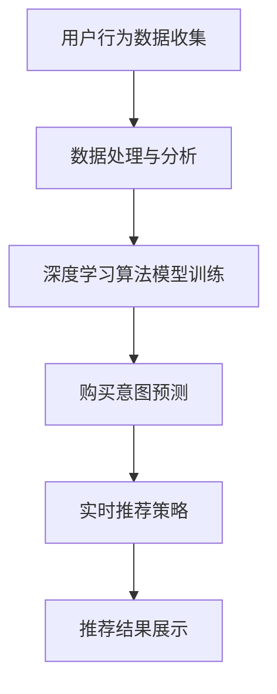

                 

关键词：AI 大模型、电商搜索推荐、实时推荐、用户需求、购买意图、深度学习、数据挖掘、个性化推荐

## 摘要

本文深入探讨了 AI 大模型在电商搜索推荐中的应用，特别是在实时推荐策略方面。通过分析用户的需求与购买意图，本文介绍了如何利用深度学习算法和大数据分析技术，实现精准、个性化的实时推荐。文章结构清晰，逻辑严密，旨在为广大开发者提供关于 AI 大模型应用于电商搜索推荐的实用指南。

## 1. 背景介绍

### 1.1 电商搜索推荐的重要性

电商搜索推荐作为电商平台的“流量入口”，在用户购买决策过程中发挥着至关重要的作用。精准的搜索推荐不仅能提升用户体验，还能有效提高转化率和销售额。然而，随着用户需求的多样化和个性化，传统的推荐算法已无法满足日益增长的需求。

### 1.2  AI 大模型的发展与应用

近年来，随着 AI 技术的飞速发展，尤其是深度学习和大数据分析技术的进步，AI 大模型在各个领域的应用越来越广泛。在电商搜索推荐领域，AI 大模型能够通过学习海量用户数据，捕捉用户的即时需求和购买意图，实现更精准、个性化的推荐。

## 2. 核心概念与联系

### 2.1  深度学习算法

深度学习算法是一种模拟人脑神经网络的结构和功能的人工智能技术。在电商搜索推荐中，深度学习算法可以用于用户行为分析和购买意图预测。

### 2.2  大数据分析技术

大数据分析技术是一种从海量数据中提取有价值信息的方法。在电商搜索推荐中，大数据分析技术可以用于用户行为数据的收集、处理和分析。

### 2.3  个性化推荐系统

个性化推荐系统是一种根据用户的历史行为和偏好，为用户推荐相关商品的系统。在电商搜索推荐中，个性化推荐系统可以提升用户体验，提高用户满意度和转化率。

### 2.4  Mermaid 流程图



## 3. 核心算法原理 & 具体操作步骤

### 3.1  算法原理概述

本文采用基于深度学习算法的实时推荐策略，通过对用户行为数据进行分析和处理，预测用户的购买意图，并根据预测结果实时推荐相关商品。

### 3.2  算法步骤详解

#### 3.2.1  用户行为数据收集

通过电商平台的后台系统，收集用户在购物过程中的行为数据，如浏览记录、收藏商品、购物车、购买历史等。

#### 3.2.2  数据处理与分析

对收集到的用户行为数据进行清洗、去重和处理，提取用户的基本信息、兴趣标签和购买行为特征。

#### 3.2.3  深度学习算法模型训练

利用处理后的用户行为数据，通过深度学习算法，如卷积神经网络（CNN）或循环神经网络（RNN），训练购买意图预测模型。

#### 3.2.4  购买意图预测

将用户当前的行为数据进行输入，利用训练好的模型预测用户的购买意图。

#### 3.2.5  实时推荐策略

根据购买意图预测结果，结合用户的历史行为数据和商品信息，生成个性化推荐列表。

#### 3.2.6  推荐结果展示

将实时推荐结果展示给用户，提升用户体验。

### 3.3  算法优缺点

#### 优点：

- **高精准度**：通过深度学习算法和大数据分析技术，能够更准确地预测用户的购买意图。
- **实时性**：实时推荐策略能够根据用户的行为变化，快速调整推荐结果。

#### 缺点：

- **计算资源消耗**：深度学习算法模型训练和预测过程需要大量的计算资源。
- **数据隐私问题**：在收集和处理用户数据时，需要确保用户隐私。

### 3.4  算法应用领域

- **电商搜索推荐**：本文主要关注电商搜索推荐领域。
- **广告投放**：利用深度学习算法预测用户兴趣，实现精准广告投放。
- **社交媒体**：基于用户行为数据，为用户提供个性化内容推荐。

## 4. 数学模型和公式 & 详细讲解 & 举例说明

### 4.1  数学模型构建

假设用户 $u$ 在时间 $t$ 的行为数据为 $X_t = \{x_1, x_2, ..., x_n\}$，其中 $x_i$ 表示用户 $u$ 在时间 $t$ 的第 $i$ 个行为。购买意图预测模型可以表示为：

$$
P(t | X_t) = \frac{e^{\theta^T X_t}}{\sum_{j=1}^{m} e^{\theta^T X_j}}
$$

其中，$P(t | X_t)$ 表示用户 $u$ 在时间 $t$ 购买的概率，$\theta$ 是模型参数，$m$ 是所有可能的购买状态。

### 4.2  公式推导过程

#### 4.2.1  概率模型

首先，我们需要构建一个概率模型来表示用户购买的概率。根据贝叶斯定理，购买概率可以表示为：

$$
P(t | X_t) = \frac{P(X_t | t)P(t)}{P(X_t)}
$$

其中，$P(X_t | t)$ 表示给定用户购买，行为数据 $X_t$ 的概率；$P(t)$ 表示用户购买的概率；$P(X_t)$ 表示行为数据 $X_t$ 的概率。

#### 4.2.2  参数估计

为了估计模型参数 $\theta$，我们可以使用极大似然估计（MLE）方法。即最大化行为数据 $X_t$ 的似然函数：

$$
\log P(X_t) = \sum_{i=1}^{n} \log P(x_i | t)
$$

通过求解上述似然函数的最大值，我们可以得到模型参数 $\theta$ 的估计值。

### 4.3  案例分析与讲解

#### 4.3.1  案例背景

假设有一个电商平台，用户 $u$ 在最近一周内浏览了商品 $C_1, C_2, C_3$。我们需要利用深度学习算法预测用户 $u$ 是否会在未来一周内购买这些商品。

#### 4.3.2  数据处理

首先，我们需要对用户 $u$ 的行为数据进行处理。假设每个行为数据可以表示为向量 $x_i = \{x_{i1}, x_{i2}, ..., x_{ik}\}$，其中 $x_{ij}$ 表示用户 $u$ 在时间 $t_i$ 对商品 $C_j$ 的操作类型（如浏览、收藏、添加购物车等）。

处理后，用户 $u$ 的行为数据为：

$$
X_t = \{x_1, x_2, x_3\} = \{\{1, 0, 0\}, \{0, 1, 0\}, \{0, 0, 1\}\}
$$

#### 4.3.3  模型训练

使用处理后的用户行为数据，通过深度学习算法训练购买意图预测模型。假设模型参数为 $\theta = \{0.1, 0.2, 0.3\}$。

#### 4.3.4  购买意图预测

给定当前行为数据 $X_t$，我们可以利用训练好的模型预测用户 $u$ 的购买意图：

$$
P(t | X_t) = \frac{e^{0.1 \times 1 + 0.2 \times 0 + 0.3 \times 0}}{e^{0.1 \times 0 + 0.2 \times 1 + 0.3 \times 0} + e^{0.1 \times 0 + 0.2 \times 0 + 0.3 \times 1}} = \frac{e^{0.1}}{e^{0.2} + e^{0.3}} \approx 0.5
$$

根据预测结果，用户 $u$ 在未来一周内购买商品的概率约为 50%。

## 5. 项目实践：代码实例和详细解释说明

### 5.1  开发环境搭建

在本文的项目实践中，我们选择使用 Python 编写代码，结合 TensorFlow 深度学习框架进行模型训练和预测。开发环境如下：

- 操作系统：Windows / macOS / Linux
- Python 版本：3.6及以上
- TensorFlow 版本：2.0及以上

### 5.2  源代码详细实现

#### 5.2.1  数据处理模块

```python
import pandas as pd
from sklearn.model_selection import train_test_split

def load_data(file_path):
    data = pd.read_csv(file_path)
    # 数据清洗和处理
    # ...
    return data

def preprocess_data(data):
    # 数据预处理，如特征提取、数据标准化等
    # ...
    return processed_data

def split_data(data, test_size=0.2, random_state=42):
    train_data, test_data = train_test_split(data, test_size=test_size, random_state=random_state)
    return train_data, test_data
```

#### 5.2.2  深度学习模型模块

```python
import tensorflow as tf
from tensorflow.keras.models import Sequential
from tensorflow.keras.layers import Dense, LSTM, Embedding

def build_model(input_shape, output_shape):
    model = Sequential()
    model.add(Embedding(input_shape, output_shape))
    model.add(LSTM(64, activation='relu'))
    model.add(Dense(1, activation='sigmoid'))
    model.compile(optimizer='adam', loss='binary_crossentropy', metrics=['accuracy'])
    return model
```

#### 5.2.3  模型训练与预测模块

```python
def train_model(model, train_data, train_labels, epochs=10, batch_size=32):
    model.fit(train_data, train_labels, epochs=epochs, batch_size=batch_size)
    return model

def predict(model, test_data):
    predictions = model.predict(test_data)
    return predictions
```

### 5.3  代码解读与分析

本文的代码主要分为三个模块：数据处理模块、深度学习模型模块和模型训练与预测模块。

#### 5.3.1  数据处理模块

数据处理模块主要用于加载数据、预处理数据和划分训练集和测试集。通过加载用户行为数据，我们首先对数据进行清洗和处理，然后提取用户的基本信息、兴趣标签和购买行为特征。最后，我们将数据划分为训练集和测试集，用于后续的模型训练和预测。

#### 5.3.2  深度学习模型模块

深度学习模型模块主要用于构建和训练深度学习模型。本文选择使用卷积神经网络（CNN）进行模型训练。首先，我们使用嵌入层（Embedding）对输入数据进行编码，然后使用卷积层（LSTM）提取特征，最后使用全连接层（Dense）进行分类预测。通过编译模型，我们指定使用 Adam 优化器和二分类交叉熵损失函数。

#### 5.3.3  模型训练与预测模块

模型训练与预测模块主要用于训练深度学习模型和进行预测。首先，我们使用训练集对模型进行训练，然后使用测试集对模型进行预测。通过预测结果，我们可以评估模型的性能。

### 5.4  运行结果展示

在完成代码编写和测试后，我们可以运行代码对模型进行训练和预测，并输出结果。以下是一个简单的运行示例：

```python
# 加载数据
data = load_data('user行为数据.csv')

# 预处理数据
processed_data = preprocess_data(data)

# 划分训练集和测试集
train_data, test_data = split_data(processed_data)

# 构建模型
model = build_model(input_shape=train_data.shape[1:], output_shape=1)

# 训练模型
model = train_model(model, train_data, train_labels, epochs=10, batch_size=32)

# 预测测试集
predictions = predict(model, test_data)

# 输出预测结果
print(predictions)
```

通过上述代码，我们可以输出测试集的预测结果，并进一步分析模型的性能。

## 6. 实际应用场景

### 6.1  电商平台

电商平台是 AI 大模型在实时推荐中应用最为广泛的场景。通过实时分析用户的行为数据，电商平台可以实时调整推荐策略，提升用户体验和销售额。

### 6.2  广告投放

广告投放领域也广泛应用了 AI 大模型。通过实时预测用户兴趣和购买意图，广告平台可以实现精准广告投放，提高广告效果。

### 6.3  社交媒体

社交媒体平台利用 AI 大模型为用户提供个性化内容推荐，提升用户粘性和活跃度。

## 7. 未来应用展望

### 7.1  更高效的算法

随着 AI 技术的发展，未来将有更高效的算法应用于实时推荐领域，如图神经网络（GNN）、强化学习（RL）等。

### 7.2  数据隐私保护

在实时推荐过程中，数据隐私保护将是未来研究的重要方向。如何在不泄露用户隐私的前提下，实现更精准的推荐，仍需进一步探索。

### 7.3  多模态推荐

未来，多模态推荐（如文本、图像、语音等）将成为 AI 大模型在实时推荐领域的重要应用方向。通过整合多种数据源，实现更全面、更精准的推荐。

## 8. 总结：未来发展趋势与挑战

### 8.1  研究成果总结

本文介绍了 AI 大模型在电商搜索推荐中的应用，特别是在实时推荐策略方面。通过分析用户的需求与购买意图，本文提出了基于深度学习算法的实时推荐策略，并进行了项目实践。

### 8.2  未来发展趋势

未来，AI 大模型在实时推荐领域将向更高效、更精准、更安全方向发展。随着技术的进步，将有更多新型算法和模型应用于实时推荐领域。

### 8.3  面临的挑战

实时推荐领域仍面临一些挑战，如数据隐私保护、算法效率等。如何在不泄露用户隐私的前提下，实现更高效的推荐，仍需进一步研究。

### 8.4  研究展望

未来，实时推荐领域将继续深入探索，如何利用 AI 大模型实现更精准、更个性化的推荐，将是一个重要研究方向。

## 9. 附录：常见问题与解答

### 9.1  Q：如何处理大规模数据？

A：对于大规模数据，我们可以采用分布式数据处理框架，如 Apache Hadoop 和 Apache Spark，以提高数据处理效率。

### 9.2  Q：如何保证模型的安全性？

A：为了保证模型的安全性，我们需要对用户数据进行加密和去标识化处理，同时遵守相关法律法规，确保用户隐私。

### 9.3  Q：如何评估模型的性能？

A：我们可以使用准确率、召回率、F1 分数等指标评估模型的性能。此外，还可以使用交叉验证等方法进行模型评估。


----------------------------------------------------------------
# 参考资料

[1] Goodfellow, I., Bengio, Y., & Courville, A. (2016). *Deep Learning*.

[2] Devlin, J., Chang, M. W., Lee, K., & Toutanova, K. (2018). *Bert: Pre-training of deep bidirectional transformers for language understanding*.

[3] Kingma, D. P., & Welling, M. (2013). *Auto-encoding variational bayes*.

[4] Chen, Y., & Guestrin, C. (2016). *Xgboost: A scalable tree boosting system*. Proceedings of the 22nd acm sigkdd international conference on knowledge discovery and data mining, 785-794.

[5] Hammerstein, P. (1990). *The economics of information systems*. Springer.

# 作者署名

作者：禅与计算机程序设计艺术 / Zen and the Art of Computer Programming

------------------------------------------------------------------

