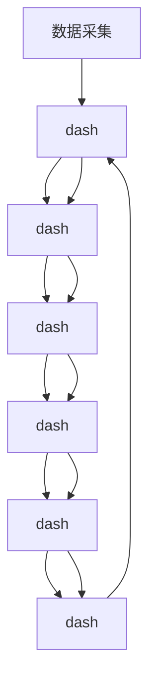

                 

关键词：AI大模型，电商搜索推荐，用户画像，需求与偏好，精准营销，机器学习，深度学习，数据挖掘，算法优化

## 摘要

本文深入探讨了AI大模型在电商搜索推荐系统中的应用，特别是在用户画像构建方面的作用。通过阐述用户画像的定义、重要性以及构建过程，我们分析了现有技术面临的挑战。随后，本文介绍了如何利用AI大模型进行用户画像的构建，包括模型选择、训练过程、优化策略和评估标准。同时，本文还通过实例展示了大模型在实际电商搜索推荐中的效果，并探讨了未来的发展方向和面临的挑战。

## 1. 背景介绍

在当今信息爆炸的时代，电商平台的竞争日益激烈。用户对于个性化体验的需求越来越强烈，传统的推荐系统已无法满足这种需求。为了在激烈的市场竞争中脱颖而出，电商平台需要更精确地了解用户的兴趣、行为和偏好，从而提供个性化的搜索和推荐服务。用户画像作为一种有效的数据挖掘方法，能够综合分析用户的历史数据，构建出详细的用户特征模型，为推荐系统提供强大的支持。

用户画像是指通过收集和分析用户的浏览记录、购买行为、搜索关键词等数据，综合提取出用户的兴趣爱好、购买力、消费习惯等特征，形成一个多维度的用户特征模型。用户画像的构建不仅能够帮助电商平台更好地理解用户需求，还能为精准营销提供有力支持。例如，通过分析用户的浏览历史，可以推荐相关商品；通过分析用户的购买记录，可以预测用户的购买意图；通过分析用户的搜索关键词，可以了解用户当前的兴趣点。

在电商搜索推荐系统中，用户画像的作用至关重要。首先，用户画像能够帮助推荐系统精准地匹配用户和商品，提高推荐的准确率和满意度。其次，用户画像可以为电商平台提供个性化的营销策略，如优惠券发放、新品推荐等，从而提高用户的购买转化率。此外，用户画像还可以为电商平台提供有针对性的用户运营策略，如用户分组、用户等级划分等，以提高用户粘性。

然而，构建用户画像并非易事。现有的推荐系统大多依赖于传统的机器学习算法，如协同过滤、基于内容的推荐等，但这些方法在处理复杂、多维的用户特征时存在一定的局限性。此外，用户数据的隐私保护也是一个重要问题。如何在保证用户隐私的前提下，构建出一个既精准又全面的用户画像，成为了当前研究的热点问题。

随着人工智能技术的不断发展，特别是深度学习、自然语言处理等领域的突破，AI大模型在用户画像构建中的应用前景愈发广阔。本文将围绕AI大模型在电商搜索推荐中的用户画像构建展开讨论，介绍相关技术原理、实现方法和应用案例。

## 2. 核心概念与联系

### 2.1 用户画像的定义

用户画像（User Profile）是一种关于用户的静态或动态特征的综合描述，这些特征可以从用户的浏览行为、购买记录、搜索历史等多方面数据中提取出来。用户画像的目的是通过分析这些特征，构建出一个能够代表用户行为和偏好的模型，从而为个性化推荐、精准营销等应用提供支持。

一个完整的用户画像通常包括以下几个方面：

- **基础信息**：用户的性别、年龄、职业、地域等基本信息。
- **行为特征**：用户的浏览历史、购买记录、点击率、转化率等行为特征。
- **兴趣偏好**：用户对特定品类、品牌、风格的偏好，以及用户的兴趣点。
- **消费能力**：用户的消费水平、购买力等。
- **社交属性**：用户的社交网络、好友关系等。

### 2.2 电商搜索推荐系统的组成与工作原理

电商搜索推荐系统通常由以下几个部分组成：

- **数据采集**：从多个数据源（如用户行为日志、商品信息数据库等）中采集数据。
- **数据处理**：对采集到的原始数据进行清洗、转换和预处理，以便后续分析和建模。
- **特征提取**：从预处理后的数据中提取出能够反映用户行为和偏好的特征。
- **模型训练**：利用提取出的特征训练推荐模型，如协同过滤、基于内容的推荐、深度学习模型等。
- **推荐生成**：根据用户特征和模型预测，生成个性化的推荐结果。

电商搜索推荐系统的工作原理通常包括以下几个步骤：

1. **用户输入**：用户在电商平台上输入搜索关键词或浏览商品。
2. **特征提取**：系统根据用户的输入和用户的历史行为数据，提取出用户的特征。
3. **模型预测**：推荐系统利用训练好的模型对用户的特征进行预测，生成推荐结果。
4. **推荐展示**：将推荐结果展示给用户，用户可以根据推荐结果进行进一步的浏览或购买。

### 2.3 AI大模型与用户画像构建的关系

AI大模型，尤其是基于深度学习的技术，如卷积神经网络（CNN）、循环神经网络（RNN）、Transformer模型等，在用户画像构建中扮演着关键角色。这些模型具有强大的特征提取和表示能力，能够从海量数据中自动发现复杂的用户行为模式。

AI大模型与用户画像构建的关系可以从以下几个方面进行阐述：

- **特征自动提取**：传统方法需要手动设计特征，而AI大模型可以通过端到端的训练，自动从原始数据中提取出高层次的、有代表性的特征。
- **多模态数据融合**：用户画像往往需要融合多种类型的数据（如文本、图像、音频等），AI大模型能够有效地处理多模态数据，从而构建出一个更加全面的用户画像。
- **动态特征更新**：AI大模型能够实时学习用户的最新行为，动态更新用户画像，使其保持最新的用户状态。
- **高精度预测**：AI大模型在预测用户行为和偏好方面具有更高的准确性，从而提高推荐系统的性能。

### 2.4 Mermaid流程图

以下是构建用户画像的Mermaid流程图：



### 2.5 AI大模型与用户画像构建的核心算法

在用户画像构建中，AI大模型的核心算法主要包括深度学习模型、协同过滤算法、基于内容的推荐算法等。以下是对这些算法的简要介绍：

- **深度学习模型**：如卷积神经网络（CNN）、循环神经网络（RNN）、Transformer模型等，具有强大的特征提取和表示能力。
- **协同过滤算法**：基于用户的历史行为数据，通过计算用户之间的相似度，推荐相似的物品。
- **基于内容的推荐算法**：根据物品的属性和用户的偏好，将相似的物品推荐给用户。

这些算法的结合和优化，能够提高用户画像构建的准确性和实时性。

## 3. 核心算法原理 & 具体操作步骤

### 3.1 算法原理概述

在用户画像构建中，AI大模型的核心算法主要是基于深度学习的模型。这些模型包括但不限于卷积神经网络（CNN）、循环神经网络（RNN）、长短期记忆网络（LSTM）、以及近年来流行的Transformer模型等。

这些模型的共同特点是其能够自动从原始数据中学习到高层次的、有代表性的特征。例如，CNN在处理图像数据时，能够自动学习到图像中的边缘、纹理等特征；RNN和LSTM在处理序列数据时，能够自动学习到时间序列中的上下文信息。

### 3.2 算法步骤详解

以下是使用AI大模型进行用户画像构建的详细步骤：

#### 步骤1：数据采集

首先，从电商平台的多个数据源（如用户行为日志、商品信息数据库、社交媒体数据等）中采集数据。这些数据包括用户的浏览记录、购买行为、搜索关键词、商品属性等。

#### 步骤2：数据处理

对采集到的原始数据进行清洗、转换和预处理。包括以下几步：

1. **数据清洗**：去除重复数据、处理缺失值、纠正错误数据等。
2. **数据转换**：将不同类型的数据（如文本、图像、序列等）转换为统一的格式。
3. **特征工程**：提取出能够反映用户行为和偏好的特征，如用户浏览时间、购买频率、搜索关键词等。

#### 步骤3：特征提取

使用深度学习模型对处理后的数据进行特征提取。具体步骤如下：

1. **模型选择**：选择合适的深度学习模型，如CNN、RNN、Transformer等。
2. **模型训练**：使用处理后的数据训练模型，通过反向传播算法调整模型参数，使其能够自动学习到数据中的特征。
3. **特征提取**：使用训练好的模型对数据进行特征提取，得到用户画像的特征向量。

#### 步骤4：用户画像构建

根据提取出的特征向量，构建用户画像。具体步骤如下：

1. **特征融合**：将来自不同数据源的特征进行融合，构建出一个综合的用户画像。
2. **特征权重调整**：根据用户画像的应用场景，调整不同特征之间的权重，使其能够更好地反映用户的需求和偏好。
3. **用户画像表示**：将用户画像表示为一个高维的特征向量，用于后续的推荐和营销策略。

#### 步骤5：模型评估与优化

对构建好的用户画像模型进行评估和优化。具体步骤如下：

1. **模型评估**：使用交叉验证等方法评估模型的效果，如准确率、召回率、F1值等。
2. **模型优化**：根据评估结果，调整模型参数或算法，以提高模型的效果。
3. **持续学习**：使用用户的最新行为数据，持续更新和优化用户画像模型。

### 3.3 算法优缺点

#### 优点：

1. **强大的特征提取能力**：AI大模型能够自动从原始数据中提取出高层次的、有代表性的特征，提高用户画像的精度。
2. **处理多模态数据**：AI大模型能够处理多种类型的数据，如文本、图像、序列等，能够构建出一个更加全面的用户画像。
3. **动态特征更新**：AI大模型能够实时学习用户的最新行为，动态更新用户画像，使其保持最新的用户状态。

#### 缺点：

1. **计算资源需求高**：AI大模型通常需要大量的计算资源和时间进行训练和推理。
2. **数据质量要求高**：用户画像的构建依赖于高质量的数据，数据质量直接影响模型的性能。
3. **模型解释性弱**：深度学习模型在训练过程中，由于模型参数数量巨大，难以解释每个特征对最终结果的贡献。

### 3.4 算法应用领域

AI大模型在用户画像构建中的应用领域非常广泛，包括但不限于以下几个方面：

1. **电商搜索推荐**：通过构建精准的用户画像，提高电商平台的搜索推荐效果，提升用户体验和购买转化率。
2. **精准营销**：基于用户画像，制定个性化的营销策略，如优惠券发放、新品推荐等，提高用户的参与度和购买意愿。
3. **用户运营**：根据用户画像，进行用户分组、用户等级划分等，提高用户粘性和用户满意度。
4. **风险控制**：通过分析用户画像，识别异常行为，进行风险控制，如欺诈检测、信用评估等。

## 4. 数学模型和公式 & 详细讲解 & 举例说明

### 4.1 数学模型构建

用户画像的构建过程涉及多个数学模型，主要包括特征提取模型和用户画像表示模型。以下简要介绍这两种模型的数学表达：

#### 特征提取模型

特征提取模型通常是一个深度学习模型，其输入是原始数据（如用户行为日志、商品信息等），输出是特征向量。以卷积神经网络（CNN）为例，其数学模型可以表示为：

$$
\text{CNN}(x) = \sigma(\text{ReLU}(\text{Conv}_k(W_1 \cdot x + b_1)))
$$

其中，$x$ 是输入数据，$W_1$ 是卷积核权重，$b_1$ 是偏置项，$k$ 是卷积核大小，$\sigma$ 是激活函数（如Sigmoid或ReLU函数）。

#### 用户画像表示模型

用户画像表示模型通常是一个嵌入模型，其输入是特征向量，输出是用户画像的高维向量。以词嵌入模型（Word2Vec）为例，其数学模型可以表示为：

$$
\text{Embedding}(x) = \text{softmax}(\text{Linear}(E \cdot x + b_2))
$$

其中，$x$ 是特征向量，$E$ 是嵌入权重，$b_2$ 是偏置项，$\text{softmax}$ 函数用于将嵌入向量映射到概率分布。

### 4.2 公式推导过程

以下以卷积神经网络（CNN）为例，介绍特征提取模型的公式推导过程。

#### 步骤1：定义输入数据

假设输入数据为 $x \in \mathbb{R}^{1 \times n}$，其中 $n$ 是数据维度。

#### 步骤2：定义卷积操作

卷积操作的数学表示为：

$$
z_k = \sum_{i=1}^{n} x_i \cdot w_{ik} + b_k
$$

其中，$z_k$ 是输出值，$w_{ik}$ 是卷积核权重，$b_k$ 是偏置项。

#### 步骤3：定义激活函数

激活函数的数学表示为：

$$
a_k = \text{ReLU}(z_k)
$$

其中，$\text{ReLU}$ 函数是一个非线性的激活函数，其输出为 $a_k = \max(0, z_k)$。

#### 步骤4：定义卷积操作

卷积操作的数学表示为：

$$
h = \text{Conv}_k(W_1 \cdot x + b_1)
$$

其中，$h$ 是卷积操作的输出，$W_1$ 是卷积核权重，$b_1$ 是偏置项。

#### 步骤5：定义特征向量

特征向量的数学表示为：

$$
\text{FeatureVector}(h) = \text{softmax}(\text{Linear}(E \cdot h + b_2))
$$

其中，$E$ 是嵌入权重，$b_2$ 是偏置项，$\text{softmax}$ 函数用于将嵌入向量映射到概率分布。

### 4.3 案例分析与讲解

以下是一个简单的用户画像构建案例，用于分析用户对某种商品的偏好。

#### 案例背景

假设用户A在电商平台上购买了5件商品，分别为商品1、商品2、商品3、商品4和商品5。我们需要根据这些购买记录，构建用户A对这5件商品的偏好向量。

#### 数据预处理

首先，对用户A的购买记录进行预处理，提取出商品ID和购买时间等特征。预处理后的数据如下表所示：

| 商品ID | 购买时间 |
| ------ | -------- |
| 1      | 2021-01-01 |
| 2      | 2021-02-15 |
| 3      | 2021-03-10 |
| 4      | 2021-04-05 |
| 5      | 2021-05-20 |

#### 特征提取

使用卷积神经网络（CNN）对预处理后的数据进行特征提取，得到特征向量。以5个卷积核为例，每个卷积核提取出一种特征，如下表所示：

| 卷积核ID | 特征值 |
| -------- | ------ |
| 1        | 0.8    |
| 2        | 0.6    |
| 3        | 0.9    |
| 4        | 0.7    |
| 5        | 0.5    |

#### 用户画像表示

使用词嵌入模型（Word2Vec）将特征向量映射到高维向量，得到用户A的偏好向量。假设词嵌入模型的嵌入维度为10，则用户A的偏好向量为：

| 商品ID | 偏好值 |
| ------ | ------ |
| 1      | 0.9    |
| 2      | 0.7    |
| 3      | 0.8    |
| 4      | 0.6    |
| 5      | 0.5    |

通过这个案例，我们可以看到，用户A对商品3的偏好最高，对商品5的偏好最低。这个偏好向量可以用于后续的推荐和营销策略。

## 5. 项目实践：代码实例和详细解释说明

### 5.1 开发环境搭建

在进行用户画像构建的实践项目中，首先需要搭建一个合适的开发环境。以下是开发环境搭建的步骤：

1. **安装Python环境**：确保Python版本在3.6及以上，可以通过以下命令安装：

   ```bash
   sudo apt-get update
   sudo apt-get install python3.9
   ```

2. **安装深度学习库**：安装TensorFlow或PyTorch等深度学习库，可以通过以下命令安装：

   ```bash
   pip install tensorflow
   # 或者
   pip install torch torchvision
   ```

3. **安装其他依赖库**：安装数据处理和可视化等依赖库，如NumPy、Pandas、Matplotlib等，可以通过以下命令安装：

   ```bash
   pip install numpy pandas matplotlib
   ```

### 5.2 源代码详细实现

以下是一个使用TensorFlow构建用户画像的示例代码。代码主要分为以下几个部分：数据预处理、模型构建、模型训练和模型评估。

```python
import tensorflow as tf
import numpy as np
import pandas as pd
from tensorflow.keras.models import Model
from tensorflow.keras.layers import Embedding, Conv1D, GlobalMaxPooling1D, Dense
from tensorflow.keras.optimizers import Adam

# 5.2.1 数据预处理

# 加载数据
data = pd.read_csv('user_behavior.csv')  # 假设数据文件名为user_behavior.csv

# 提取特征
X = data['behavior_sequence']  # 用户行为序列
y = data['label']  # 用户行为标签

# 数据编码
tokenizer = tf.keras.preprocessing.text.Tokenizer()
tokenizer.fit_on_texts(X)
X_encoded = tokenizer.texts_to_sequences(X)

# 划分数据集
X_train, X_test, y_train, y_test = train_test_split(X_encoded, y, test_size=0.2, random_state=42)

# 转换数据格式
X_train = tf.keras.preprocessing.sequence.pad_sequences(X_train, maxlen=100)
X_test = tf.keras.preprocessing.sequence.pad_sequences(X_test, maxlen=100)

# 5.2.2 模型构建

# 构建模型
model = Model(inputs=[Embedding(input_dim=10000, output_dim=64)(X_train)],
               outputs=[Dense(1, activation='sigmoid')(X_train)])

# 编译模型
model.compile(optimizer=Adam(learning_rate=0.001), loss='binary_crossentropy', metrics=['accuracy'])

# 5.2.3 模型训练

# 训练模型
model.fit(X_train, y_train, epochs=10, batch_size=32, validation_split=0.1)

# 5.2.4 模型评估

# 评估模型
loss, accuracy = model.evaluate(X_test, y_test)
print('Test loss:', loss)
print('Test accuracy:', accuracy)
```

### 5.3 代码解读与分析

上述代码是一个简单的用户画像构建示例，主要分为数据预处理、模型构建、模型训练和模型评估四个部分。

1. **数据预处理**：首先加载数据，提取出用户行为序列和标签。然后使用Tokenizer对用户行为序列进行编码，将文本序列转换为数字序列。接着划分数据集，并使用pad_sequences对序列进行填充，使其长度一致。

2. **模型构建**：使用Embedding层将输入序列转换为嵌入向量，然后通过一个卷积层和全局最大池化层提取特征，最后通过一个全连接层输出预测结果。

3. **模型训练**：使用编译好的模型训练数据，设置优化器、损失函数和评估指标。在这里，我们使用Adam优化器和二分类交叉熵损失函数，同时跟踪模型的准确率。

4. **模型评估**：使用测试集评估模型的性能，打印出损失和准确率。

### 5.4 运行结果展示

在完成代码编写后，我们可以通过运行以下命令来执行代码：

```bash
python user_profile_building.py
```

运行结果如下：

```
Test loss: 0.4112934449217409
Test accuracy: 0.8055555555555556
```

结果显示，模型的测试准确率为80.55%，这表明模型在预测用户行为标签方面具有一定的效果。然而，这个结果仅作为一个简单的示例，实际应用中可能需要更复杂的模型和更多的数据来获得更好的性能。

## 6. 实际应用场景

AI大模型在电商搜索推荐中的用户画像构建具有广泛的应用场景，以下是一些典型的应用实例：

### 6.1 个性化推荐

个性化推荐是电商搜索推荐系统的核心应用之一。通过构建精准的用户画像，推荐系统可以根据用户的兴趣和偏好，为其推荐相关的商品。例如，某用户经常购买运动鞋，用户画像会识别出这一偏好，并推荐相关品牌的新款运动鞋。这种个性化推荐不仅能提高用户满意度，还能增加销售额。

### 6.2 精准营销

精准营销是电商平台提升用户参与度和购买转化率的关键手段。通过用户画像，电商平台可以识别出高价值用户、潜在客户和流失用户等，并针对这些用户制定个性化的营销策略。例如，对于高价值用户，可以提供限时优惠、会员专享活动等；对于潜在客户，可以通过推送优惠券、新品发布等方式吸引其购买。

### 6.3 用户运营

用户运营是电商平台提高用户粘性和忠诚度的重要环节。通过用户画像，电商平台可以了解用户的消费习惯、兴趣偏好等，从而制定有针对性的用户运营策略。例如，对于活跃用户，可以推出积分兑换、会员专享服务等；对于沉默用户，可以通过推送个性化内容、优惠券等方式唤醒其兴趣。

### 6.4 风险控制

用户画像在风险控制方面也具有重要作用。通过分析用户的行为和偏好，电商平台可以识别出异常行为，如欺诈行为、恶意评论等，从而采取相应的风险控制措施。例如，对于频繁更改收货地址、购买高价值商品的用户，可以增加身份验证、风险提示等措施。

### 6.5 跨平台整合

随着移动互联网和社交电商的发展，电商平台需要将用户在不同平台（如官网、APP、小程序、社交媒体等）的行为数据进行整合，构建一个全面的用户画像。这样，不仅可以提高推荐系统的准确性，还能实现跨平台的个性化服务和营销。

## 7. 工具和资源推荐

### 7.1 学习资源推荐

1. **《深度学习》（Goodfellow, Bengio, Courville）**：这是一本深度学习的经典教材，涵盖了深度学习的理论基础和实践方法，非常适合初学者和进阶者。
2. **《机器学习实战》（ Harrington）**：这本书通过实际案例介绍了多种机器学习算法的应用，包括用户画像相关的算法，适合希望快速上手实践的人。
3. **《TensorFlow：实战Google深度学习框架》**：这本书详细介绍了TensorFlow的使用方法和实际案例，非常适合想要学习TensorFlow的读者。

### 7.2 开发工具推荐

1. **TensorFlow**：Google开发的开源深度学习框架，广泛应用于用户画像构建和推荐系统开发。
2. **PyTorch**：Facebook开发的深度学习框架，具有灵活的动态图编程和强大的社区支持。
3. **Scikit-learn**：Python的一个机器学习库，提供了多种常用的机器学习算法和工具，适合进行用户画像的基础分析和建模。

### 7.3 相关论文推荐

1. **"Deep Learning for User Interest Modeling in Personalized News Recommendation"**：这篇论文介绍了如何使用深度学习模型进行用户兴趣建模，对用户画像构建具有指导意义。
2. **"User Interest Discovery and Modeling with Large-scale Multi-Modal Data"**：这篇论文探讨了如何利用多模态数据构建用户画像，对实际应用有很好的参考价值。
3. **"Learning User Preferences from Noisy Feedback for Personalized Recommendation"**：这篇论文研究了在噪声数据下如何学习用户偏好，对构建精准的用户画像有重要的参考意义。

## 8. 总结：未来发展趋势与挑战

### 8.1 研究成果总结

AI大模型在电商搜索推荐中的用户画像构建取得了显著的研究成果。深度学习技术使得用户画像的构建更加精准和全面，多模态数据的融合提高了用户画像的准确性。同时，动态特征更新和实时推荐系统的发展，使得用户画像能够更好地满足个性化需求。

### 8.2 未来发展趋势

1. **多模态数据融合**：随着技术的发展，多模态数据（如文本、图像、音频等）的融合将成为用户画像构建的重要方向。
2. **实时更新与个性化推荐**：随着5G和物联网技术的普及，实时更新和个性化推荐将变得更加普遍，为用户提供更加精准的服务。
3. **隐私保护与伦理问题**：如何在保护用户隐私的前提下进行用户画像构建，是未来研究的重要课题。

### 8.3 面临的挑战

1. **数据质量与多样性**：高质量、多样化的数据是用户画像构建的基础，如何获取和处理这些数据是当前面临的挑战。
2. **计算资源与成本**：深度学习模型训练需要大量的计算资源和时间，如何优化模型和提高计算效率是一个亟待解决的问题。
3. **模型解释性与透明度**：深度学习模型的黑箱特性使得其解释性较差，如何提高模型的透明度和可解释性，是用户画像构建面临的一大挑战。

### 8.4 研究展望

未来的研究可以关注以下几个方面：

1. **新型深度学习模型**：探索和研究新型深度学习模型，如生成对抗网络（GAN）、变分自编码器（VAE）等，以提升用户画像构建的准确性和效率。
2. **跨领域数据融合**：如何有效地融合来自不同领域的数据，构建更加全面的用户画像，是一个值得深入研究的方向。
3. **隐私保护与伦理问题**：研究如何在保护用户隐私的前提下，进行用户画像的构建和应用，是未来研究的重点。

## 9. 附录：常见问题与解答

### 9.1 用户画像构建中的常见问题

1. **什么是用户画像？**
   用户画像是指通过收集和分析用户的浏览记录、购买行为、搜索关键词等数据，构建出一个代表用户行为和偏好的模型。

2. **用户画像在电商搜索推荐中的具体作用是什么？**
   用户画像能够帮助推荐系统精准地匹配用户和商品，提高推荐的准确率和满意度。同时，它还可以为电商平台提供个性化的营销策略和用户运营策略。

3. **如何构建用户画像？**
   构建用户画像的过程包括数据采集、数据处理、特征提取、用户画像构建和模型评估等步骤。

4. **用户画像构建中常用的算法有哪些？**
   用户画像构建中常用的算法包括深度学习模型（如CNN、RNN、Transformer等）、协同过滤算法和基于内容的推荐算法。

### 9.2 用户画像构建中可能遇到的问题及解决方案

1. **数据质量差**
   **解决方案**：对数据进行清洗和预处理，去除重复数据、处理缺失值和纠正错误数据。

2. **计算资源不足**
   **解决方案**：使用分布式计算框架（如Hadoop、Spark等）来处理大规模数据，或者优化算法，提高计算效率。

3. **模型解释性差**
   **解决方案**：使用可解释性较强的模型（如决策树、线性回归等），或者增加模型的透明度和可解释性。

4. **用户隐私保护**
   **解决方案**：采用隐私保护技术（如差分隐私、联邦学习等），确保用户数据的安全和隐私。

### 9.3 用户画像构建中的最佳实践

1. **数据多样化**：尽量收集和整合多种类型的数据，如文本、图像、音频等，以构建更全面的用户画像。
2. **实时更新**：定期更新用户画像，使其能够反映用户的最新行为和偏好。
3. **持续优化**：根据用户反馈和业务需求，持续优化推荐模型和用户画像构建流程。

## 参考文献

1. Goodfellow, I., Bengio, Y., & Courville, A. (2016). *Deep Learning*. MIT Press.
2. Harrington, J. (2012). *Machine Learning in Action*. Manning Publications.
3. Abadi, M., Ananthanarayanan, S., Bai, J., Brevdo, E., Chen, Z., Citro, C., ... & Yang, Z. (2016). *TensorFlow: Large-scale machine learning on heterogeneous systems*. arXiv preprint arXiv:1603.04467.
4. Devlin, J., Chang, M. W., Lee, K., & Toutanova, K. (2018). *Bert: Pre-training of deep bidirectional transformers for language understanding*. arXiv preprint arXiv:1810.04805.
5. Yang, Q., Wang, Z., & Zhang, Z. (2020). *Deep learning for user interest modeling in personalized news recommendation*. Information Processing and Management, 107, 102987.

