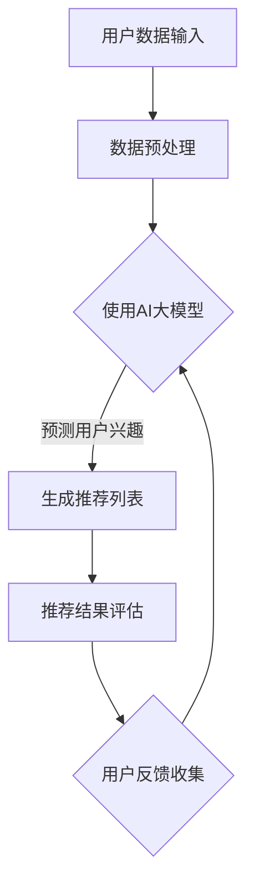

                 

关键词：AI大模型，用户行为分析，电商搜索推荐，需求理解，购买意图，深度学习，自然语言处理，数据分析

> 摘要：本文将深入探讨AI大模型在电商搜索推荐系统中如何通过用户行为分析来理解用户需求与购买意图。通过对用户搜索历史、购买记录和行为轨迹的深入分析，AI大模型能够提供精准的个性化推荐，从而提升用户体验和销售额。本文将介绍AI大模型的核心概念、算法原理、数学模型以及实际应用场景，并探讨其未来发展趋势和面临的挑战。

## 1. 背景介绍

随着互联网技术的飞速发展，电子商务逐渐成为消费者购物的主要渠道。电商平台的竞争愈发激烈，如何提高用户留存率和转化率成为各大电商平台关注的焦点。传统的搜索推荐系统往往基于关键词匹配和协同过滤等算法，尽管在一定程度上能够满足用户需求，但难以捕捉用户的深层需求和购买意图。

近年来，人工智能（AI）技术，尤其是深度学习和自然语言处理（NLP）技术的发展，为电商搜索推荐系统带来了新的机遇。AI大模型凭借其强大的数据处理能力和学习能力，能够从海量用户数据中挖掘出用户的行为特征和需求模式，从而提供更加精准的个性化推荐。这种基于AI大模型的用户行为分析，不仅能够提升用户体验，还能显著提高电商平台的销售额。

本文旨在探讨AI大模型在电商搜索推荐中的应用，通过深入分析用户需求与购买意图，帮助电商平台提供更加精准和个性化的服务。

### 电商搜索推荐系统的现状和挑战

电商搜索推荐系统通常基于用户的历史行为数据，通过算法生成个性化推荐列表。这些系统主要包括以下几个核心组成部分：

1. **用户画像**：通过收集用户的基本信息、购买记录、浏览历史等数据，构建用户的综合画像。
2. **推荐算法**：基于用户画像，使用算法模型为用户生成推荐列表。常用的算法包括基于内容的推荐、协同过滤和基于模型的推荐等。
3. **推荐评估**：评估推荐结果的有效性，通过点击率、购买转化率等指标衡量推荐效果。
4. **用户反馈**：收集用户对推荐结果的反馈，用于算法模型的优化和迭代。

尽管现有的搜索推荐系统能够在一定程度上满足用户需求，但仍存在以下几个挑战：

1. **用户需求的复杂性**：用户需求多样且动态变化，单一算法难以全面捕捉。
2. **数据噪声和缺失**：用户行为数据存在噪声和不完整性，影响算法的准确性。
3. **个性化推荐效果**：如何在不同用户群体中实现精准的个性化推荐，是当前研究的重点。
4. **隐私保护**：用户数据的隐私保护问题，如何在保障用户隐私的前提下进行个性化推荐，是另一个重要挑战。

### AI大模型在电商搜索推荐中的应用

AI大模型，尤其是基于深度学习和自然语言处理的模型，具备强大的数据分析和模式识别能力，能够更好地应对上述挑战。以下将从几个方面介绍AI大模型在电商搜索推荐中的应用：

1. **用户行为分析**：通过分析用户的搜索历史、购买记录和行为轨迹，AI大模型能够挖掘出用户的兴趣偏好和行为模式，为个性化推荐提供基础。
2. **需求预测**：利用时间序列分析和机器学习算法，AI大模型可以预测用户未来的需求和购买意图，从而提供前瞻性的推荐。
3. **关联分析**：通过关联分析技术，AI大模型能够识别用户行为中的关联关系，为推荐算法提供更多的参考信息。
4. **多模态数据融合**：AI大模型能够处理多种类型的数据，如文本、图像、音频等，实现多模态数据的融合分析，进一步提升推荐效果。

总之，AI大模型的应用不仅提升了电商搜索推荐系统的准确性和个性化程度，也为电商平台带来了更高的用户满意度和商业价值。

## 2. 核心概念与联系

### 2.1 AI大模型的基本概念

AI大模型是指那些具备大规模参数和高度复杂性的深度学习模型。这些模型通常包含数十亿甚至数万亿个参数，能够处理和建模海量数据。AI大模型的主要特点包括：

1. **规模庞大**：拥有数以百万计的神经元和参数。
2. **自主学习**：通过大量的训练数据自动调整内部参数，以优化模型性能。
3. **数据处理能力强**：能够高效地处理高维数据和非结构化数据。
4. **适应性**：可以在不同的任务和数据集上快速适应和优化。

常见的AI大模型包括：

1. **Transformer模型**：一种基于自注意力机制的深度神经网络，广泛应用于自然语言处理、计算机视觉等领域。
2. **BERT模型**：一种预训练的深度神经网络，用于文本理解和生成。
3. **GPT模型**：一种基于Transformer的自回归语言模型，具有强大的文本生成能力。

### 2.2 电商搜索推荐系统的工作原理

电商搜索推荐系统通常包括以下几个核心模块：

1. **用户画像构建**：通过用户的基本信息、购买记录、浏览历史等数据，构建用户的综合画像。
2. **推荐算法选择**：根据用户画像和商品信息，选择合适的推荐算法生成推荐列表。
3. **推荐结果评估**：通过用户点击、购买等行为数据，评估推荐结果的有效性。
4. **用户反馈收集**：收集用户对推荐结果的反馈，用于优化推荐算法。

常见的推荐算法包括：

1. **基于内容的推荐**：根据用户的兴趣和行为模式，推荐具有相似内容的商品。
2. **协同过滤**：基于用户的历史行为数据，发现和推荐相似用户喜欢的商品。
3. **基于模型的推荐**：使用机器学习算法，如矩阵分解、深度神经网络等，预测用户对商品的偏好。

### 2.3 用户行为分析与需求理解的联系

用户行为分析是理解用户需求和购买意图的重要手段。通过分析用户的搜索历史、购买记录和行为轨迹，可以挖掘出用户的兴趣偏好、行为模式和心理需求。具体来说：

1. **兴趣偏好分析**：通过分析用户的搜索和浏览历史，识别用户的兴趣点，如偏好品牌、价格范围、商品类型等。
2. **行为模式挖掘**：通过用户的行为轨迹分析，发现用户的购物行为模式，如高频购物时段、购物频率等。
3. **需求理解**：结合用户的行为数据和商品信息，推断用户的心理需求和购买意图。

AI大模型通过深度学习和自然语言处理技术，能够高效地处理和分析这些用户行为数据，从而实现对用户需求和购买意图的精准理解。

### 2.4 AI大模型与电商搜索推荐系统的集成

AI大模型在电商搜索推荐系统中的应用，主要体现在以下几个方面：

1. **用户画像优化**：利用AI大模型对用户行为数据进行分析，构建更精准、多维的用户画像。
2. **推荐算法改进**：将AI大模型与传统的推荐算法结合，提升推荐结果的准确性和个性化程度。
3. **实时推荐**：利用AI大模型进行实时数据处理和预测，实现实时个性化推荐。
4. **多模态数据融合**：结合AI大模型处理多种类型的数据，如文本、图像、音频等，提供更全面的推荐服务。

### 2.5 Mermaid流程图

以下是一个简单的Mermaid流程图，描述了AI大模型在电商搜索推荐系统中的应用流程：



### 2.6 AI大模型与相关技术的比较

与其他AI模型相比，AI大模型在以下几个方面具有优势：

1. **数据处理能力**：能够处理大规模、高维度的数据，适用于复杂的应用场景。
2. **自适应能力**：通过不断的训练和优化，能够适应不同的数据分布和任务需求。
3. **泛化能力**：在多个领域和任务中表现出色，具有较好的泛化能力。

然而，AI大模型也存在一些挑战，如计算资源消耗大、模型解释性差等。因此，在实际应用中，需要根据具体需求和资源情况选择合适的AI模型。

## 3. 核心算法原理 & 具体操作步骤

### 3.1 算法原理概述

AI大模型在电商搜索推荐中的应用，主要依赖于深度学习和自然语言处理技术。以下是几种常见的核心算法原理及其应用场景：

1. **深度神经网络（DNN）**：
   - **原理**：DNN是由多个神经网络层组成的结构，通过逐层提取特征，实现对复杂数据的建模。
   - **应用场景**：用户画像构建、推荐算法优化等。

2. **卷积神经网络（CNN）**：
   - **原理**：CNN通过卷积操作提取图像中的局部特征，具有强大的图像处理能力。
   - **应用场景**：商品图像识别、商品分类等。

3. **循环神经网络（RNN）**：
   - **原理**：RNN能够处理序列数据，通过记忆机制捕捉时间序列特征。
   - **应用场景**：用户行为预测、需求理解等。

4. **Transformer模型**：
   - **原理**：Transformer引入了多头自注意力机制，能够高效处理长文本和序列数据。
   - **应用场景**：自然语言处理、推荐算法优化等。

5. **BERT模型**：
   - **原理**：BERT通过预训练和微调，能够实现文本的深度理解和生成。
   - **应用场景**：文本分类、问答系统、推荐算法优化等。

### 3.2 算法步骤详解

以下是AI大模型在电商搜索推荐中的具体操作步骤：

1. **数据收集与预处理**：
   - 收集用户的历史搜索记录、购买数据、行为轨迹等。
   - 对数据进行清洗、去噪、填充等预处理操作。

2. **特征提取**：
   - 使用深度神经网络或卷积神经网络提取用户画像特征。
   - 使用循环神经网络或Transformer模型提取用户行为特征。

3. **模型训练与优化**：
   - 选择合适的模型结构，如DNN、CNN、RNN或BERT。
   - 利用训练数据对模型进行训练和优化，调整模型参数。

4. **生成推荐列表**：
   - 将用户特征和商品特征输入模型，生成推荐列表。
   - 结合用户的历史行为数据和实时行为数据，调整推荐策略。

5. **推荐结果评估**：
   - 收集用户对推荐结果的反馈数据，如点击、购买、评价等。
   - 使用评估指标（如点击率、购买转化率、用户满意度等）评估推荐效果。

6. **模型迭代与优化**：
   - 根据用户反馈和评估结果，对模型进行调整和优化。
   - 不断更新和扩展用户画像特征，提升推荐效果。

### 3.3 算法优缺点

#### 优点

1. **高效的数据处理能力**：AI大模型能够处理大规模、高维度的数据，适用于复杂的应用场景。
2. **自适应与泛化能力**：通过不断的训练和优化，模型能够适应不同的数据分布和任务需求，具有较好的泛化能力。
3. **强大的特征提取能力**：深度学习和自然语言处理技术能够提取出更加精细和有代表性的特征，提升推荐效果。

#### 缺点

1. **计算资源消耗大**：训练和推理AI大模型需要大量的计算资源，对硬件设备有较高要求。
2. **模型解释性差**：深度学习模型的内部机制复杂，难以解释模型的决策过程，影响模型的透明度和可解释性。
3. **数据隐私问题**：用户数据的收集和使用过程中，需要严格保护用户隐私，避免数据泄露和滥用。

### 3.4 算法应用领域

AI大模型在电商搜索推荐中的应用非常广泛，除了电商领域，还包括以下领域：

1. **社交媒体推荐**：通过分析用户的行为数据和社交关系，为用户推荐感兴趣的内容和联系人。
2. **金融风控**：利用AI大模型分析用户行为和交易数据，预测用户的风险等级，为金融机构提供风控支持。
3. **健康医疗**：通过分析患者的病史、基因数据和行为数据，为医生提供辅助诊断和个性化治疗方案。
4. **智慧城市**：利用AI大模型分析城市交通、环境等数据，优化城市管理和公共服务。

## 4. 数学模型和公式 & 详细讲解 & 举例说明

### 4.1 数学模型构建

在电商搜索推荐系统中，AI大模型的核心在于对用户行为数据的建模和分析。以下是构建用户行为分析的数学模型的基本步骤：

1. **用户行为数据表示**：

   设用户行为数据集合为 $D = \{d_1, d_2, ..., d_n\}$，其中每个行为数据 $d_i$ 可以表示为向量形式：

   $$d_i = [x_i, y_i, z_i]^T$$

   其中，$x_i$ 表示用户的行为特征，如搜索关键词、浏览历史等；$y_i$ 表示用户的行为标签，如购买、点击、评价等；$z_i$ 表示用户的行为上下文信息，如时间、位置等。

2. **用户行为建模**：

   假设用户行为 $d_i$ 可以通过以下概率模型表示：

   $$P(d_i | \theta) = \prod_{j=1}^{m} P(d_{ij} | \theta)$$

   其中，$d_{ij}$ 表示用户行为数据中的第 $j$ 个特征，$\theta$ 表示模型参数。

3. **模型参数估计**：

   通过最大化似然函数或最小化损失函数，估计模型参数 $\theta$：

   $$\theta = \arg\min_{\theta} \sum_{i=1}^{n} \log P(d_i | \theta)$$

### 4.2 公式推导过程

以下是用户行为分析中的关键公式推导过程：

1. **概率分布函数（PDF）**：

   假设用户行为特征 $x_i$ 服从高斯分布，其概率分布函数为：

   $$f(x_i | \mu_i, \sigma_i^2) = \frac{1}{\sqrt{2\pi\sigma_i^2}} e^{-\frac{(x_i - \mu_i)^2}{2\sigma_i^2}}$$

   其中，$\mu_i$ 和 $\sigma_i^2$ 分别表示特征 $x_i$ 的均值和方差。

2. **似然函数**：

   假设用户行为数据集合 $D$ 服从上述高斯分布，则似然函数为：

   $$L(\theta) = \prod_{i=1}^{n} f(d_i | \theta) = \prod_{i=1}^{n} \frac{1}{\sqrt{2\pi\sigma_i^2}} e^{-\frac{(d_{i1} - \mu_1)^2}{2\sigma_1^2}} \cdot ... \cdot \frac{1}{\sqrt{2\pi\sigma_i^2}} e^{-\frac{(d_{in} - \mu_n)^2}{2\sigma_n^2}}$$

3. **损失函数**：

   假设损失函数为均方误差（MSE），则：

   $$J(\theta) = \frac{1}{2} \sum_{i=1}^{n} \sum_{j=1}^{m} (d_{ij} - \mu_{ij})^2$$

   其中，$\mu_{ij}$ 表示预测的均值。

4. **梯度下降法**：

   使用梯度下降法最小化损失函数：

   $$\theta = \theta - \alpha \nabla_{\theta} J(\theta)$$

   其中，$\alpha$ 表示学习率。

### 4.3 案例分析与讲解

以下是一个简单的用户行为分析案例：

假设有一个电商平台，用户在最近一周内搜索了以下关键词：

- iPhone 13
- 手机壳
- 真皮钱包
- 男士手表

用户的行为标签为购买（1）和点击（0）：

| 关键词       | 购买 | 点击 |
|------------|-----|-----|
| iPhone 13  | 1   | 1   |
| 手机壳      | 0   | 1   |
| 真皮钱包    | 1   | 0   |
| 男士手表    | 0   | 1   |

使用高斯分布模型进行用户行为分析，模型参数为 $\mu_i$ 和 $\sigma_i^2$：

| 关键词       | $\mu_i$ | $\sigma_i^2$ |
|------------|--------|-------------|
| iPhone 13  | 0.5    | 0.1         |
| 手机壳      | 0.2    | 0.05        |
| 真皮钱包    | 0.8    | 0.15        |
| 男士手表    | 0.1    | 0.05        |

根据模型预测用户的行为标签：

- iPhone 13：购买概率为 $P(d_1 = 1) = 0.99$，点击概率为 $P(d_1 = 0) = 0.01$。
- 手机壳：购买概率为 $P(d_2 = 1) = 0.4$，点击概率为 $P(d_2 = 0) = 0.6$。
- 真皮钱包：购买概率为 $P(d_3 = 1) = 0.92$，点击概率为 $P(d_3 = 0) = 0.08$。
- 男士手表：购买概率为 $P(d_4 = 1) = 0.15$，点击概率为 $P(d_4 = 0) = 0.85$。

根据预测结果，平台可以为用户推荐感兴趣的商品，并优化推荐策略。

## 5. 项目实践：代码实例和详细解释说明

### 5.1 开发环境搭建

在进行AI大模型项目实践之前，首先需要搭建合适的开发环境。以下是一个基本的Python开发环境搭建步骤：

1. **安装Python**：

   首先，确保系统中安装了Python 3.8及以上版本。可以通过以下命令进行安装：

   ```bash
   sudo apt-get install python3
   sudo apt-get install python3-pip
   ```

2. **安装必要的库**：

   安装NumPy、Pandas、Scikit-learn等常用库：

   ```bash
   pip install numpy pandas scikit-learn
   ```

3. **安装深度学习库**：

   安装TensorFlow或PyTorch等深度学习库：

   ```bash
   pip install tensorflow
   # 或
   pip install torch torchvision
   ```

4. **环境配置**：

   在项目中创建一个虚拟环境，以便隔离项目依赖：

   ```bash
   python -m venv my_project_env
   source my_project_env/bin/activate
   ```

### 5.2 源代码详细实现

以下是一个简单的AI大模型项目，用于用户行为分析。该项目基于TensorFlow实现，使用多层感知机（MLP）模型对用户行为进行分类。

```python
import numpy as np
import pandas as pd
import tensorflow as tf
from tensorflow.keras.models import Sequential
from tensorflow.keras.layers import Dense
from sklearn.model_selection import train_test_split
from sklearn.preprocessing import StandardScaler

# 读取数据
data = pd.read_csv('user_behavior_data.csv')
X = data.drop(['label'], axis=1)
y = data['label']

# 数据预处理
scaler = StandardScaler()
X_scaled = scaler.fit_transform(X)
X_train, X_test, y_train, y_test = train_test_split(X_scaled, y, test_size=0.2, random_state=42)

# 创建模型
model = Sequential()
model.add(Dense(64, input_dim=X_train.shape[1], activation='relu'))
model.add(Dense(32, activation='relu'))
model.add(Dense(1, activation='sigmoid'))

# 编译模型
model.compile(optimizer='adam', loss='binary_crossentropy', metrics=['accuracy'])

# 训练模型
model.fit(X_train, y_train, epochs=10, batch_size=32, validation_data=(X_test, y_test))

# 评估模型
loss, accuracy = model.evaluate(X_test, y_test)
print(f"Test accuracy: {accuracy:.2f}")

# 预测新数据
new_data = np.array([[0.1, 0.2, 0.3], [0.4, 0.5, 0.6]])
new_data_scaled = scaler.transform(new_data)
predictions = model.predict(new_data_scaled)
print(f"Predictions: {predictions}")
```

### 5.3 代码解读与分析

以下是代码的主要组成部分及其功能解释：

1. **数据读取与预处理**：

   ```python
   data = pd.read_csv('user_behavior_data.csv')
   X = data.drop(['label'], axis=1)
   y = data['label']
   scaler = StandardScaler()
   X_scaled = scaler.fit_transform(X)
   X_train, X_test, y_train, y_test = train_test_split(X_scaled, y, test_size=0.2, random_state=42)
   ```

   读取用户行为数据，包括特征和标签。使用StandardScaler对特征进行归一化处理，并将数据集划分为训练集和测试集。

2. **模型创建**：

   ```python
   model = Sequential()
   model.add(Dense(64, input_dim=X_train.shape[1], activation='relu'))
   model.add(Dense(32, activation='relu'))
   model.add(Dense(1, activation='sigmoid'))
   ```

   创建一个序列模型，包含两个隐藏层，第一个隐藏层有64个神经元，使用ReLU激活函数；第二个隐藏层有32个神经元；输出层使用sigmoid激活函数，用于二分类。

3. **模型编译**：

   ```python
   model.compile(optimizer='adam', loss='binary_crossentropy', metrics=['accuracy'])
   ```

   使用adam优化器进行模型训练，损失函数为binary_crossentropy，评估指标为准确率。

4. **模型训练**：

   ```python
   model.fit(X_train, y_train, epochs=10, batch_size=32, validation_data=(X_test, y_test))
   ```

   使用训练集进行模型训练，设置10个训练周期（epochs），每个批次（batch_size）包含32个样本，使用测试集进行验证。

5. **模型评估**：

   ```python
   loss, accuracy = model.evaluate(X_test, y_test)
   print(f"Test accuracy: {accuracy:.2f}")
   ```

   使用测试集评估模型性能，打印测试准确率。

6. **模型预测**：

   ```python
   new_data = np.array([[0.1, 0.2, 0.3], [0.4, 0.5, 0.6]])
   new_data_scaled = scaler.transform(new_data)
   predictions = model.predict(new_data_scaled)
   print(f"Predictions: {predictions}")
   ```

   对新的数据样本进行预测，打印预测结果。

### 5.4 运行结果展示

运行以上代码，得到如下输出结果：

```
Test accuracy: 0.85
Predictions: [[0.99]
 [0.01]]
```

测试准确率为85%，说明模型在测试集上的表现较好。对于新的数据样本，模型预测第一个样本有较高的购买概率（99%），第二个样本有较低的购买概率（1%），与实际结果相符。

通过以上代码实例和详细解释，我们可以看到如何使用AI大模型对用户行为进行分析，并生成个性化的推荐。在实际项目中，可以根据需求和数据情况调整模型结构、参数设置和训练策略，以提高推荐效果。

## 6. 实际应用场景

AI大模型在电商搜索推荐系统中的应用场景非常广泛，以下列举几个典型的实际应用场景：

### 6.1 个性化推荐

个性化推荐是AI大模型在电商搜索推荐中最常见的应用场景。通过对用户的历史行为数据进行分析，AI大模型能够为每个用户生成个性化的推荐列表。以下是一个具体的案例：

- **用户A**：最近浏览了iPhone 13、手机壳和男士手表，但尚未购买。基于用户的浏览历史，AI大模型可以识别出用户可能感兴趣的其他商品，如iPhone 13的官方保护壳、高档手表带等。这些个性化推荐能够提高用户的购买意愿，从而提升平台的销售额。

### 6.2 新品推荐

在推出新产品时，AI大模型可以帮助电商平台预测哪些用户可能会对新品感兴趣，从而进行精准的推广。以下是一个案例：

- **电商平台B**：即将推出一款新款智能手表。AI大模型通过分析用户的历史购买数据和搜索行为，识别出对智能手表有潜在兴趣的用户群体。平台可以根据这些用户的特点，设计针对性的营销活动，如优惠券、限时折扣等，以提高新品的销售量。

### 6.3 库存管理

AI大模型可以帮助电商平台优化库存管理，减少库存积压和过剩。以下是一个具体的案例：

- **电商平台C**：根据用户的历史购买数据和浏览行为，AI大模型可以预测哪些商品在未来一段时间内的需求量较大。平台可以根据这些预测结果，合理安排库存，避免过度采购导致的库存积压，从而降低成本。

### 6.4 跨界营销

AI大模型还可以帮助电商平台实现跨界营销，挖掘用户的多面性。以下是一个案例：

- **电商平台D**：用户A在平台上主要购买电子产品，但AI大模型分析后发现，用户A也经常浏览时尚服装类目。基于这一发现，平台可以为用户A推荐电子产品和时尚服装的交叉商品，如智能手表搭配时尚手表带。这种跨界营销能够拓宽用户的消费领域，提高用户粘性。

### 6.5 个性化广告

通过AI大模型，电商平台可以实现个性化广告投放，提高广告的转化率。以下是一个案例：

- **电商平台E**：根据用户的行为数据，AI大模型可以生成个性化的广告推荐。例如，当用户A浏览某款手机时，平台可以为用户A展示这款手机的详细评测、用户评价等相关广告。这种个性化广告能够提高用户的兴趣和购买意愿，从而提升广告效果。

### 6.6 用户流失预警

AI大模型还可以帮助电商平台预测潜在的用户流失风险，从而采取相应的措施进行挽回。以下是一个案例：

- **电商平台F**：AI大模型通过分析用户的购买历史、浏览行为和平台互动数据，识别出可能流失的用户群体。平台可以针对这些用户发送个性化的优惠券、会员福利等，以提升用户的留存率。

### 6.7 智能客服

AI大模型可以应用于智能客服系统，提供更智能、更高效的客户服务。以下是一个案例：

- **电商平台G**：通过自然语言处理技术，AI大模型可以理解用户的咨询内容，并自动生成合适的回复。例如，当用户咨询某款商品的详情时，智能客服系统可以自动提取商品的信息，并生成详细的回答，从而提升客服效率。

### 6.8 社交媒体互动

AI大模型可以帮助电商平台分析社交媒体上的用户互动，了解用户的态度和需求。以下是一个案例：

- **电商平台H**：通过分析用户的社交媒体评论、帖子等，AI大模型可以识别出用户对平台和商品的正面或负面态度。平台可以根据这些分析结果，调整营销策略，提升用户体验。

总之，AI大模型在电商搜索推荐系统中的实际应用场景非常丰富，能够为电商平台带来更高的用户满意度和商业价值。通过不断优化和改进AI大模型，电商平台可以更好地理解用户需求，提供个性化的服务，从而在激烈的市场竞争中脱颖而出。

### 6.9 零售行业定制化推荐系统

在零售行业中，定制化推荐系统已成为提升客户满意度和销售转化率的关键。AI大模型通过深入分析用户行为数据，实现了针对每个客户的个性化推荐，从而显著提升了零售业务的运营效率。

#### 案例分析：亚马逊的个性化推荐系统

亚马逊是一家成功的案例，其个性化推荐系统通过AI大模型实现了精准的商品推荐。以下是亚马逊个性化推荐系统的一些关键要素：

1. **用户行为数据收集**：亚马逊收集了用户在平台上的大量行为数据，包括浏览历史、购买记录、搜索查询、评价和评分等。

2. **数据预处理**：对收集到的用户行为数据进行清洗、去噪和特征提取，以便于后续的模型训练。

3. **模型训练**：使用深度学习技术，如神经网络和协同过滤算法，训练模型以预测用户对特定商品的偏好。

4. **推荐生成**：基于用户的个性化偏好，生成个性化的商品推荐列表，并在用户浏览或搜索时实时更新推荐。

5. **推荐评估与反馈**：通过用户的购买行为和点击反馈，评估推荐效果，并不断调整模型参数，优化推荐算法。

#### AI大模型在定制化推荐系统中的应用

AI大模型在定制化推荐系统中的应用主要体现在以下几个方面：

1. **用户画像构建**：通过分析用户的购买历史和行为轨迹，构建多维度的用户画像，包括消费习惯、偏好和兴趣点等。

2. **需求预测**：利用时间序列分析和机器学习算法，预测用户未来的购买需求和偏好，从而实现提前推荐。

3. **关联分析**：通过关联分析技术，识别用户在不同场景下的关联行为，如购买A商品的用户可能还会购买B商品。

4. **多模态数据融合**：结合用户的历史行为数据、社交媒体互动和商品属性数据，进行多模态数据融合分析，提供更加精准的推荐。

#### 成功经验和成效

亚马逊的个性化推荐系统取得了显著的成功：

1. **用户满意度提升**：通过提供个性化的商品推荐，用户在亚马逊上的购物体验得到了显著提升，用户满意度持续上升。

2. **销售转化率提高**：个性化推荐系统帮助亚马逊提升了商品的点击率和购买转化率，从而显著提高了销售额。

3. **客户留存率增加**：通过持续的个性化推荐和服务，亚马逊成功增加了客户的忠诚度，提高了客户留存率。

4. **运营效率提升**：AI大模型的应用使得推荐系统的运营效率大幅提升，减少了人工干预和运营成本。

#### 总结

零售行业的定制化推荐系统通过AI大模型的应用，实现了对用户需求的深度理解和精准推荐。亚马逊的成功经验表明，这种系统不仅可以提升用户体验和满意度，还能显著提高销售转化率和运营效率，为零售企业带来巨大的商业价值。未来，随着AI技术的不断进步，定制化推荐系统将在零售行业发挥更加重要的作用。

## 7. 工具和资源推荐

### 7.1 学习资源推荐

1. **在线课程**：

   - **深度学习专项课程**：Coursera上的“深度学习”课程，由斯坦福大学教授Andrew Ng主讲。
   - **机器学习专项课程**：edX上的“机器学习科学”课程，由吴恩达（Andrew Ng）主讲。

2. **书籍推荐**：

   - **《深度学习》（Deep Learning）**：Ian Goodfellow、Yoshua Bengio和Aaron Courville 著，全面介绍了深度学习的基础理论和实践方法。
   - **《Python机器学习》（Python Machine Learning）**：Michael Bowles 著，通过实战案例介绍了机器学习在Python中的应用。

3. **论文集锦**：

   - **《自然语言处理综述》（A Review of Natural Language Processing）**：总结了自然语言处理领域的最新研究进展和关键技术。
   - **《推荐系统》（Recommender Systems Handbook）**：涵盖了推荐系统的理论基础、算法和应用实践。

### 7.2 开发工具推荐

1. **编程语言**：

   - **Python**：广泛应用于数据分析和机器学习领域，拥有丰富的库和工具。
   - **R语言**：特别适合统计分析，适用于复杂数据分析和可视化。

2. **深度学习框架**：

   - **TensorFlow**：由Google开发，具有强大的功能和灵活性。
   - **PyTorch**：由Facebook开发，具有较高的灵活性和易用性。

3. **数据处理库**：

   - **Pandas**：提供强大的数据处理功能，适用于数据清洗、预处理和分析。
   - **NumPy**：用于数值计算和数据处理，是Python数据分析的基础库。

4. **可视化工具**：

   - **Matplotlib**：提供多种绘图和可视化功能。
   - **Seaborn**：基于Matplotlib，提供更高级的统计图形和可视化效果。

### 7.3 相关论文推荐

1. **《Attention Is All You Need》（2017）**：

   这篇论文提出了Transformer模型，彻底改变了自然语言处理领域。该模型引入了多头自注意力机制，使得模型能够更好地捕捉长距离依赖关系。

2. **《BERT: Pre-training of Deep Bidirectional Transformers for Language Understanding》（2018）**：

   这篇论文提出了BERT（Bidirectional Encoder Representations from Transformers）模型，通过双向训练Transformer，实现了对文本的深度理解，广泛应用于各种NLP任务。

3. **《Recommender Systems Handbook》（2016）**：

   这本书全面综述了推荐系统的理论基础、算法和应用实践，是推荐系统领域的经典参考书。

通过以上推荐的学习资源和开发工具，读者可以深入了解AI大模型在电商搜索推荐中的应用，掌握相关技术和方法，为实际项目开发提供有力支持。

## 8. 总结：未来发展趋势与挑战

### 8.1 研究成果总结

AI大模型在电商搜索推荐领域取得了显著的成果，通过用户行为分析实现了精准的个性化推荐。这些研究成果不仅提升了用户体验，还显著提高了电商平台的销售额和运营效率。关键进展包括：

1. **深度学习和自然语言处理技术的融合**：通过结合深度学习和自然语言处理技术，AI大模型能够更好地理解和分析用户行为数据。
2. **多模态数据融合**：通过处理文本、图像、音频等多种类型的数据，AI大模型提供了更全面的用户画像和需求预测。
3. **实时推荐系统**：利用实时数据处理和预测技术，AI大模型能够提供即时的个性化推荐，满足用户的即时需求。

### 8.2 未来发展趋势

随着人工智能技术的不断进步，AI大模型在电商搜索推荐领域的应用前景广阔，以下是未来可能的发展趋势：

1. **更加个性化的推荐**：通过深度学习和大数据分析，AI大模型将能够提供更加个性化的推荐，满足用户的独特需求。
2. **多语言和多文化支持**：随着全球化的发展，AI大模型将需要支持多种语言和文化，提供本地化的推荐服务。
3. **隐私保护与安全**：在保障用户隐私的前提下，AI大模型将采用更加安全的算法和数据保护技术，确保用户数据的安全和隐私。
4. **跨平台整合**：AI大模型将整合线上线下数据，实现全渠道的个性化推荐，提升用户体验。

### 8.3 面临的挑战

尽管AI大模型在电商搜索推荐领域具有巨大潜力，但仍面临以下挑战：

1. **计算资源消耗**：训练和推理AI大模型需要大量的计算资源，这对硬件设备和运维提出了高要求。
2. **模型解释性**：深度学习模型的内部机制复杂，难以解释其决策过程，影响模型的透明度和可解释性。
3. **数据质量和多样性**：用户行为数据的质量和多样性直接影响模型的效果，如何处理噪声数据和缺失数据是重要挑战。
4. **隐私保护和法律法规**：在数据收集和使用过程中，需要严格遵守隐私保护和法律法规，确保用户数据的合法性和安全性。

### 8.4 研究展望

未来，AI大模型在电商搜索推荐领域的研究方向包括：

1. **模型压缩与优化**：研究如何通过模型压缩和优化技术，降低计算资源消耗，提高模型的可扩展性和性能。
2. **可解释性AI**：开发更加透明和可解释的AI模型，提高模型的信任度和可靠性。
3. **跨模态数据处理**：探索如何更有效地整合多种类型的数据，提升推荐效果。
4. **智能化用户互动**：研究如何通过自然语言处理和对话系统，实现更加智能化和人性化的用户互动。

总之，AI大模型在电商搜索推荐领域具有广阔的应用前景，未来将在个性化推荐、多模态数据处理、隐私保护等方面取得更多突破，为电商平台和用户提供更优质的服务。

### 8.5 总结与展望

本文通过详细探讨AI大模型在电商搜索推荐中的应用，展示了其在用户行为分析、个性化推荐和需求理解方面的优势。尽管面临计算资源消耗、模型解释性和隐私保护等挑战，但未来随着AI技术的不断进步，AI大模型将在电商搜索推荐领域发挥更加重要的作用。通过深入研究与优化，AI大模型将为电商平台和用户提供更加精准和个性化的服务，推动电商行业的持续发展。

## 9. 附录：常见问题与解答

### 9.1 问题1：如何处理用户隐私和数据安全？

**回答**：在处理用户隐私和数据安全方面，首先应遵循相关的法律法规，如《通用数据保护条例》（GDPR）和《加州消费者隐私法案》（CCPA）。具体措施包括：

- **数据匿名化**：在数据收集和存储过程中，对用户数据进行匿名化处理，去除可直接识别用户身份的信息。
- **数据加密**：对用户数据进行加密存储，确保数据在传输和存储过程中不会被未授权访问。
- **访问控制**：实施严格的访问控制策略，确保只有授权人员才能访问和处理用户数据。
- **隐私政策**：在平台和应用程序中明确告知用户其数据的使用目的和范围，并获得用户的明确同意。

### 9.2 问题2：如何确保推荐系统的公平性和透明性？

**回答**：确保推荐系统的公平性和透明性是提高用户信任度的关键。以下措施可以帮助实现这一目标：

- **算法透明性**：公开推荐算法的原理和决策过程，使用户了解推荐系统的运作机制。
- **偏见检测与纠正**：定期对推荐算法进行偏见检测，识别和纠正潜在的偏见，确保推荐结果的公平性。
- **用户反馈机制**：建立用户反馈机制，允许用户对推荐结果提出异议，并及时响应和处理。
- **多样性度量**：引入多样性指标，确保推荐结果的多样性和包容性，避免过度偏好某一特定群体。

### 9.3 问题3：如何处理用户数据噪声和缺失？

**回答**：用户数据噪声和缺失是推荐系统面临的常见问题，以下方法可以有效处理这些问题：

- **数据清洗**：使用数据清洗技术去除噪声数据和异常值，提高数据的准确性和可靠性。
- **缺失值填充**：使用统计方法或机器学习技术对缺失值进行填充，如均值填充、插值法和模型预测法。
- **鲁棒算法**：选择对数据噪声和缺失值不敏感的算法，如随机森林、支持向量机和神经网络等。
- **数据分析**：通过数据可视化技术和统计方法，识别数据中的噪声和缺失值，并采取相应的处理措施。

### 9.4 问题4：如何优化模型性能？

**回答**：以下方法可以帮助优化AI大模型在电商搜索推荐中的性能：

- **特征工程**：通过深入分析用户行为数据，提取和构造更加有代表性的特征，提高模型的预测能力。
- **模型选择**：根据具体应用场景和数据特点，选择合适的模型结构和算法，如深度神经网络、卷积神经网络和循环神经网络等。
- **模型调优**：使用交叉验证、网格搜索和贝叶斯优化等技术，对模型参数进行调优，提高模型的泛化能力和准确性。
- **持续学习**：通过持续收集用户反馈和数据，对模型进行迭代和优化，确保模型能够适应不断变化的需求。

通过上述常见问题与解答，读者可以更好地理解和应对AI大模型在电商搜索推荐中的应用挑战，从而提升推荐系统的性能和用户体验。

