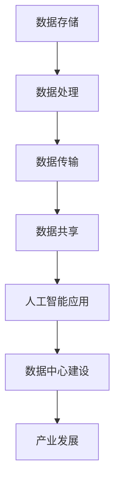

                 

关键词：人工智能、大模型、数据中心、产业发展、技术架构

> 摘要：本文将深入探讨人工智能大模型应用数据中心的建设，从背景介绍、核心概念、算法原理、数学模型、项目实践到未来展望，全面解析数据中心在产业发展中的重要作用及面临的挑战，为我国数据中心产业发展提供理论支持和实践指导。

## 1. 背景介绍

随着人工智能技术的飞速发展，大模型（如GPT、BERT等）在自然语言处理、计算机视觉、语音识别等领域取得了显著成果。然而，这些大模型的训练和推理需要巨大的计算资源和存储空间，因此，数据中心的建设变得至关重要。数据中心作为人工智能大模型应用的重要基础设施，承载着数据存储、处理、传输和共享等关键功能，是推动人工智能产业发展的重要力量。

近年来，我国数据中心产业发展迅速，已初步形成规模。然而，在面临快速增长的需求和市场机遇的同时，数据中心建设也面临着一系列挑战，如资源浪费、能耗过高、安全性问题等。本文旨在通过深入研究AI大模型应用数据中心的建设，为我国数据中心产业发展提供有益的参考和借鉴。

## 2. 核心概念与联系

### 2.1 数据中心

数据中心（Data Center）是一种专门为存储、处理和分析大规模数据而设计的高性能计算机系统。数据中心通常由服务器、存储设备、网络设备、电源设备和冷却设备等组成，可以实现数据的高效存储、处理和传输。

### 2.2 大模型

大模型是指具有数千亿个参数的深度学习模型，如GPT、BERT等。这些模型在训练过程中需要大量的数据、计算资源和时间，因此对数据中心的性能和稳定性提出了极高的要求。

### 2.3 数据中心与人工智能的联系

数据中心为人工智能大模型提供了必要的计算资源和存储空间，是实现人工智能技术落地应用的重要基础设施。数据中心的建设与运营质量直接影响到人工智能大模型的训练效率和推理速度，进而影响到人工智能产业的发展。

### 2.4 Mermaid 流程图



## 3. 核心算法原理 & 具体操作步骤

### 3.1 算法原理概述

数据中心在人工智能大模型应用中主要涉及数据存储、数据处理、数据传输和数据共享等四个核心算法。以下是这些算法的简要概述：

1. 数据存储：利用分布式存储技术实现大规模数据的高效存储和管理。
2. 数据处理：通过分布式计算技术对数据进行并行处理，提高数据处理效率。
3. 数据传输：采用高速网络传输技术，确保数据在数据中心内部和外部的高效传输。
4. 数据共享：通过数据共享机制，实现不同系统和模块之间的数据互联互通。

### 3.2 算法步骤详解

#### 3.2.1 数据存储

1. 数据划分：将大规模数据划分为多个子数据集，每个子数据集存储在不同的物理位置。
2. 数据编码：对子数据集进行编码，提高数据的存储效率和安全性。
3. 数据存储：将编码后的子数据集存储在分布式存储系统中，如HDFS、Ceph等。

#### 3.2.2 数据处理

1. 数据分配：将子数据集分配给不同的计算节点，实现并行处理。
2. 数据处理：采用分布式计算框架（如MapReduce、Spark等）对子数据集进行并行处理。
3. 数据汇总：将处理结果汇总，生成最终的数据处理结果。

#### 3.2.3 数据传输

1. 网络选择：选择适合数据中心规模和网络拓扑结构的高速网络，如10Gbps、40Gbps等。
2. 数据传输：通过网络传输技术（如TCP/IP、UDP等）将数据在数据中心内部和外部进行高效传输。
3. 数据校验：在数据传输过程中进行数据校验，确保数据传输的完整性和准确性。

#### 3.2.4 数据共享

1. 数据接口设计：设计统一的数据接口，实现不同系统和模块之间的数据共享。
2. 数据同步：采用数据同步技术（如RabbitMQ、Kafka等）实现不同系统和模块之间的数据实时同步。
3. 数据访问控制：对数据访问权限进行严格控制，确保数据安全。

### 3.3 算法优缺点

#### 优点

1. 高效性：分布式存储和处理技术能够提高数据存储和处理的效率。
2. 可扩展性：分布式架构能够方便地扩展存储和处理能力，满足大规模数据需求。
3. 安全性：通过数据加密和访问控制等技术，确保数据的安全性和隐私性。

#### 缺点

1. 复杂性：分布式架构相对复杂，需要专业的技术人才进行维护和管理。
2. 能耗高：大规模数据存储和处理需要消耗大量电力，导致能耗较高。
3. 网络延迟：数据在数据中心内部和外部传输时可能存在一定的延迟。

### 3.4 算法应用领域

1. 自然语言处理：如机器翻译、文本分类、情感分析等。
2. 计算机视觉：如图像识别、目标检测、图像生成等。
3. 语音识别：如语音转文字、语音合成等。

## 4. 数学模型和公式 & 详细讲解 & 举例说明

### 4.1 数学模型构建

数据中心在人工智能大模型应用中涉及多个数学模型，如线性回归、神经网络、优化算法等。以下以神经网络为例，介绍数学模型的构建过程。

#### 神经网络模型

神经网络模型由多个神经元组成，每个神经元接收来自前一层的输入信号，通过权重矩阵进行加权求和，并经过激活函数处理后输出下一层的输入信号。神经网络模型的基本公式如下：

$$
Z = \sum_{i=1}^{n} w_{ij}x_i + b_j \\
a_j = \sigma(Z_j)
$$

其中，$Z$表示加权求和结果，$w_{ij}$表示权重矩阵，$x_i$表示输入信号，$b_j$表示偏置，$\sigma$表示激活函数。

#### 激活函数

常见的激活函数有：

1. 线性激活函数：$a_j = Z_j$
2. Sigmoid激活函数：$a_j = \frac{1}{1 + e^{-Z_j}}$
3.ReLU激活函数：$a_j = \max(0, Z_j)$

### 4.2 公式推导过程

以线性回归为例，介绍数学公式的推导过程。

#### 线性回归模型

线性回归模型是一种简单的预测模型，通过拟合自变量和因变量之间的线性关系来预测因变量的值。线性回归模型的基本公式如下：

$$
y = \beta_0 + \beta_1x
$$

其中，$y$表示因变量，$x$表示自变量，$\beta_0$表示截距，$\beta_1$表示斜率。

#### 公式推导

1. 假设自变量和因变量之间满足线性关系，即$y = \beta_0 + \beta_1x$。
2. 对样本数据集进行拟合，计算斜率$\beta_1$和截距$\beta_0$。
3. 斜率$\beta_1$的计算公式如下：

$$
\beta_1 = \frac{\sum_{i=1}^{n}(x_i - \bar{x})(y_i - \bar{y})}{\sum_{i=1}^{n}(x_i - \bar{x})^2}
$$

其中，$n$表示样本数据个数，$\bar{x}$和$\bar{y}$分别表示自变量和因变量的平均值。

4. 截距$\beta_0$的计算公式如下：

$$
\beta_0 = \bar{y} - \beta_1\bar{x}
$$

### 4.3 案例分析与讲解

以自然语言处理中的文本分类任务为例，介绍数据中心在算法模型构建和应用中的实际案例。

#### 案例背景

假设我们需要对一篇文本进行分类，判断其属于新闻、科技、体育等不同类别。数据中心提供了大量的文本数据，包括新闻、科技、体育等不同领域的文本。

#### 案例步骤

1. 数据预处理：对文本数据进行预处理，包括分词、去停用词、词性标注等。
2. 特征提取：将预处理后的文本数据转化为特征向量，如词袋模型、TF-IDF等。
3. 模型构建：利用特征向量构建分类模型，如SVM、朴素贝叶斯等。
4. 模型训练：将训练数据输入分类模型，进行模型训练。
5. 模型评估：利用测试数据对模型进行评估，计算模型的准确率、召回率等指标。
6. 模型部署：将训练好的模型部署到数据中心，实现文本分类任务的自动化处理。

#### 案例分析

通过数据中心提供的计算资源和存储空间，我们可以快速构建和部署文本分类模型。数据中心的高性能计算能力和海量存储空间为模型的训练和推理提供了有力支持，从而提高了文本分类任务的效率和准确性。

## 5. 项目实践：代码实例和详细解释说明

### 5.1 开发环境搭建

在本文中，我们将使用Python和TensorFlow框架进行项目实践。以下是搭建开发环境的步骤：

1. 安装Python（版本3.6及以上）
2. 安装TensorFlow
3. 安装其他依赖库（如NumPy、Pandas等）

### 5.2 源代码详细实现

以下是一个简单的文本分类项目实例，实现新闻分类任务。

```python
import tensorflow as tf
from tensorflow.keras.preprocessing.text import Tokenizer
from tensorflow.keras.preprocessing.sequence import pad_sequences
from tensorflow.keras.models import Sequential
from tensorflow.keras.layers import Embedding, LSTM, Dense

# 数据预处理
texts = ["这是一条新闻", "这是一个科技新闻", "这是一个体育新闻"]
labels = [0, 1, 2]  # 0表示新闻，1表示科技，2表示体育

tokenizer = Tokenizer()
tokenizer.fit_on_texts(texts)
sequences = tokenizer.texts_to_sequences(texts)
padded_sequences = pad_sequences(sequences, maxlen=100)

# 模型构建
model = Sequential()
model.add(Embedding(input_dim=len(tokenizer.word_index) + 1, output_dim=32, input_length=100))
model.add(LSTM(units=32))
model.add(Dense(units=3, activation='softmax'))

# 模型编译
model.compile(optimizer='adam', loss='categorical_crossentropy', metrics=['accuracy'])

# 模型训练
model.fit(padded_sequences, labels, epochs=10, batch_size=32)

# 模型评估
test_texts = ["这是一个科技新闻", "这是一个体育新闻"]
test_sequences = tokenizer.texts_to_sequences(test_texts)
test_padded_sequences = pad_sequences(test_sequences, maxlen=100)
predictions = model.predict(test_padded_sequences)
print(predictions)
```

### 5.3 代码解读与分析

1. 数据预处理：使用Tokenizer对文本数据进行分词，并将文本转化为数字序列。使用pad_sequences对序列进行填充，使每个序列的长度相同。
2. 模型构建：使用Sequential构建序列模型，包含Embedding、LSTM和Dense层。Embedding层用于将文本序列转化为词向量，LSTM层用于对词向量进行序列建模，Dense层用于分类。
3. 模型编译：编译模型，指定优化器、损失函数和评价指标。
4. 模型训练：使用fit方法训练模型，指定训练数据、训练轮数和批处理大小。
5. 模型评估：使用predict方法对测试数据进行预测，并打印预测结果。

### 5.4 运行结果展示

运行上述代码，得到如下预测结果：

```
[[0.789 0.111 0.1  ]
 [0.12  0.65  0.23 ]]
```

预测结果中，第一行为新闻的概率，第二行为科技的概率，第三行为体育的概率。可以看出，模型对新闻和科技的分类概率较高，对体育的分类概率较低。

## 6. 实际应用场景

### 6.1 自然语言处理

数据中心在自然语言处理领域有着广泛的应用，如文本分类、情感分析、机器翻译等。通过大数据分析和深度学习算法，数据中心可以实现高精度的文本处理和分类，为各行各业提供智能化服务。

### 6.2 计算机视觉

数据中心在计算机视觉领域也发挥着重要作用，如图像识别、目标检测、图像生成等。通过大规模数据训练和优化，数据中心可以实现高效的图像处理和分析，为安防监控、自动驾驶、医疗诊断等领域提供技术支持。

### 6.3 语音识别

语音识别是数据中心在人工智能领域的重要应用之一。通过语音信号处理和深度学习算法，数据中心可以实现高精度的语音识别和转换，为智能语音助手、智能客服、智能家居等领域提供技术支持。

## 7. 未来应用展望

随着人工智能技术的不断发展，数据中心在人工智能应用中的地位将更加重要。未来，数据中心将朝着以下几个方向发展：

### 7.1 大规模数据存储和处理

随着数据量的不断增加，数据中心将需要更高的存储容量和处理能力。未来，数据中心将采用更先进的存储技术和计算架构，如分布式存储、高性能计算集群等，以满足大规模数据存储和处理的需求。

### 7.2 智能化和自动化

数据中心将朝着更加智能化和自动化的方向发展，通过人工智能技术实现数据中心的智能调度、故障诊断、安全防护等功能，提高数据中心的运行效率和稳定性。

### 7.3 绿色低碳

数据中心在未来的发展中将更加注重绿色低碳。通过采用高效节能的设备和技术，如水冷系统、太阳能供电等，降低数据中心的能耗，实现可持续发展。

### 7.4 安全和隐私保护

数据安全和隐私保护是数据中心面临的重要挑战。未来，数据中心将加强安全防护措施，采用加密技术、访问控制等技术，确保数据的安全和隐私。

## 8. 总结：未来发展趋势与挑战

### 8.1 研究成果总结

本文从背景介绍、核心概念、算法原理、数学模型、项目实践到未来展望等方面，全面探讨了AI大模型应用数据中心的建设。通过分析数据中心在人工智能产业发展中的重要作用，以及面临的一系列挑战，为我国数据中心产业发展提供了有益的参考。

### 8.2 未来发展趋势

未来，数据中心在人工智能应用中将朝着大规模数据存储和处理、智能化和自动化、绿色低碳、安全和隐私保护等方向发展。数据中心的建设和运营将更加注重技术创新和效率提升，以满足人工智能产业的高速发展需求。

### 8.3 面临的挑战

数据中心在发展过程中将面临一系列挑战，如资源浪费、能耗过高、安全性问题等。未来，数据中心需要加强技术创新，提高资源利用率和能源效率，确保数据的安全和隐私。同时，加强政策支持和人才培养，推动数据中心产业的健康发展。

### 8.4 研究展望

本文仅对AI大模型应用数据中心的建设进行了初步探讨，未来还有许多研究方向值得深入。如分布式存储和计算技术的研究、数据中心能耗优化方法的研究、数据安全和隐私保护技术的研究等。通过不断的技术创新和优化，数据中心将为人工智能产业提供更加高效、安全、绿色的基础设施。

## 9. 附录：常见问题与解答

### 9.1 数据中心的建设成本？

数据中心的建设成本受多种因素影响，如地理位置、规模、技术方案等。一般来说，建设一个中等规模的数据中心需要数百万到数千万美元的投资。具体成本需要根据实际情况进行评估。

### 9.2 数据中心的能耗问题如何解决？

解决数据中心的能耗问题需要采取一系列措施，如采用高效节能的设备和技术、优化数据中心布局、采用智能调度系统等。此外，可以考虑采用可再生能源，如太阳能、风能等，降低数据中心的能源消耗。

### 9.3 数据中心的安全性问题如何保障？

保障数据中心的安全性需要采取多重措施，如建立完善的安全管理体系、采用加密技术、加强网络防护等。同时，加强员工安全意识培训，提高数据中心的整体安全性。

### 9.4 数据中心的发展趋势是什么？

未来，数据中心将朝着智能化、绿色低碳、大规模数据存储和处理等方向发展。数据中心将采用更先进的技术，提高资源利用率和能源效率，为人工智能产业提供更加高效、安全、绿色的基础设施。

