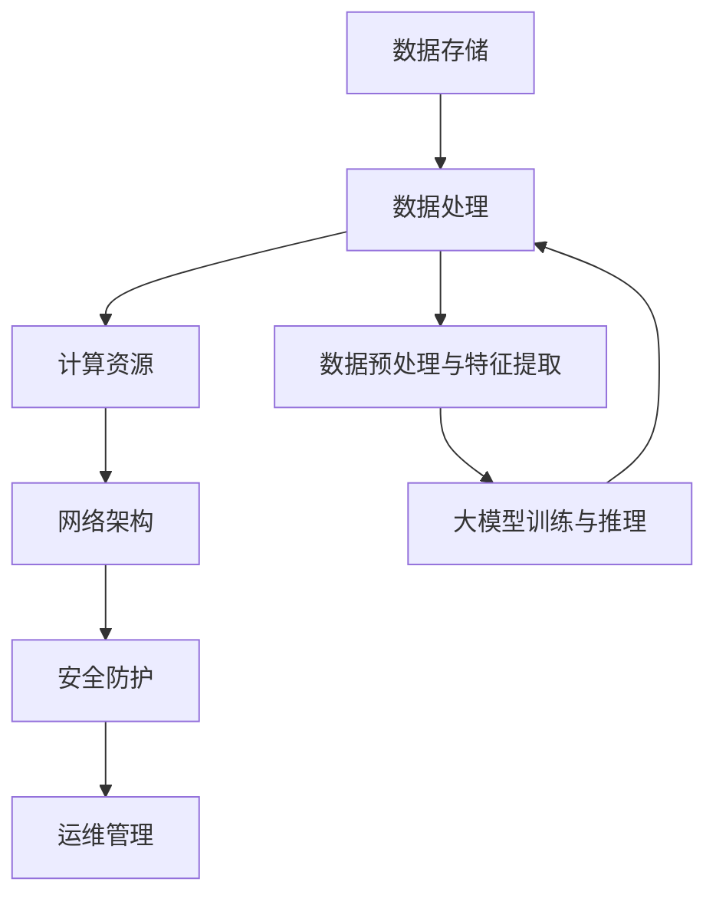

                 

关键词：人工智能，数据中心，大模型应用，技术架构，数学模型，算法，代码实例，实际应用场景，工具推荐，未来展望

> 摘要：本文旨在深入探讨AI大模型在数据中心的应用与数据中心建设的技术细节。文章首先介绍了大模型的背景和数据中心的基本概念，然后深入分析了大模型的核心算法原理、数学模型和公式，以及其具体操作步骤。接着，通过代码实例和详细解释，展示了如何在实际项目中应用大模型。随后，本文探讨了AI大模型在不同实际应用场景中的表现，并展望了其未来的发展方向和挑战。最后，推荐了相关的学习资源、开发工具和论文，并对未来发展趋势与挑战进行了总结。

## 1. 背景介绍

人工智能（AI）作为21世纪最具变革性的技术之一，已经在各个领域产生了深远的影响。特别是随着深度学习技术的快速发展，大规模人工智能模型（也称为大模型）成为了当前研究的热点。这些大模型拥有数十亿甚至数万亿的参数，可以处理复杂数据，并实现高度精准的预测和决策。

数据中心是AI大模型运行的基础设施，承担着数据存储、处理和计算的重要任务。一个高效、可靠的AI数据中心不仅需要强大的硬件支持，还需要完善的网络架构、安全防护机制和高效的运维管理。

本文将从以下几个部分对AI大模型应用数据中心建设进行深入探讨：

1. 大模型的核心算法原理和具体操作步骤。
2. 数学模型和公式的构建、推导与应用。
3. 项目实践中的代码实例和详细解释。
4. 实际应用场景的探讨和未来展望。
5. 学习资源、开发工具和相关论文推荐。

## 2. 核心概念与联系

在深入探讨AI大模型应用之前，我们需要了解一些核心概念和它们之间的联系。以下是一个简化的Mermaid流程图，展示了数据中心中与AI大模型相关的主要组件和它们之间的关系。



### 2.1 数据存储

数据存储是数据中心的基础，负责存储和管理大量的数据。在AI大模型应用中，数据存储不仅要保证数据的完整性、可靠性和安全性，还需要提供高效的读取和写入操作。常见的数据存储解决方案包括分布式文件系统（如HDFS）、数据库（如MySQL、MongoDB）和NoSQL数据库（如Cassandra、HBase）。

### 2.2 数据处理

数据处理负责对存储的数据进行预处理、特征提取和转换。在AI大模型训练过程中，高效的数据处理能力至关重要。常见的处理工具包括Apache Spark、Apache Flink等。

### 2.3 计算资源

计算资源是AI大模型训练的核心，通常由高性能GPU集群组成。计算资源的调度和管理需要高效的任务调度系统，如Apache Mesos、Kubernetes等。

### 2.4 网络架构

网络架构负责数据在不同组件之间的传输和通信。一个高效的网络架构可以显著提高AI大模型的训练和推理速度。常见的网络架构方案包括数据中心内部网络、广域网（WAN）和边缘计算。

### 2.5 安全防护

安全防护是保护数据中心免受攻击和破坏的重要措施。包括网络安全、数据加密、身份验证和访问控制等。

### 2.6 运维管理

运维管理负责整个数据中心的日常运营和维护，包括监控、日志记录、故障排除和性能优化等。

## 3. 核心算法原理 & 具体操作步骤

### 3.1 算法原理概述

AI大模型的核心算法主要基于深度学习和神经网络。神经网络由多个层级组成，包括输入层、隐藏层和输出层。每个层级包含多个神经元，神经元之间通过权重和偏置进行连接。

深度学习算法主要包括以下几个步骤：

1. **数据预处理**：对原始数据进行清洗、归一化和特征提取。
2. **构建神经网络模型**：定义网络的层级结构、神经元数量和连接方式。
3. **训练模型**：通过反向传播算法不断调整权重和偏置，使模型能够准确预测和分类。
4. **评估模型**：使用验证集和测试集评估模型的性能，包括准确率、召回率、F1值等指标。
5. **模型优化**：根据评估结果对模型进行调整和优化，以提高性能。

### 3.2 算法步骤详解

#### 3.2.1 数据预处理

数据预处理是深度学习算法的第一步，其目标是提高模型的训练效率和准确率。具体步骤包括：

1. **数据清洗**：去除数据中的噪声和异常值。
2. **归一化**：将数据缩放到相同的范围，如[0, 1]或[-1, 1]。
3. **特征提取**：提取数据中的关键特征，如文本数据中的词频、词向量等。

#### 3.2.2 构建神经网络模型

构建神经网络模型需要定义网络的层级结构、神经元数量和连接方式。常见的神经网络结构包括：

1. **全连接神经网络（FCNN）**：每个神经元都与上一层和下一层所有神经元相连。
2. **卷积神经网络（CNN）**：适用于图像处理，通过卷积层提取空间特征。
3. **循环神经网络（RNN）**：适用于序列数据处理，通过循环结构保存历史信息。

#### 3.2.3 训练模型

训练模型是深度学习的核心步骤，通过反向传播算法不断调整权重和偏置，使模型能够准确预测和分类。具体步骤包括：

1. **前向传播**：计算输入数据通过网络后的输出。
2. **计算损失函数**：使用实际输出和预测输出之间的差异计算损失函数。
3. **反向传播**：根据损失函数计算梯度，并调整权重和偏置。
4. **迭代训练**：重复以上步骤，直到模型收敛。

#### 3.2.4 评估模型

评估模型是验证模型性能的重要步骤，通过验证集和测试集评估模型的准确率、召回率、F1值等指标。具体步骤包括：

1. **划分数据集**：将数据集划分为训练集、验证集和测试集。
2. **计算指标**：计算模型的准确率、召回率、F1值等指标。
3. **评估结果**：根据评估结果判断模型是否满足要求。

#### 3.2.5 模型优化

模型优化是通过调整模型结构、参数和训练策略来提高模型性能。具体方法包括：

1. **调整网络结构**：增加或减少隐藏层、神经元数量等。
2. **调整学习率**：根据训练过程调整学习率。
3. **正则化**：使用正则化方法（如L1、L2正则化）防止过拟合。

### 3.3 算法优缺点

深度学习算法具有以下优点：

1. **强大的学习能力**：通过大规模数据训练，深度学习算法可以学习到复杂的特征和模式。
2. **高准确率**：在图像识别、自然语言处理等领域，深度学习算法已经达到了或超过了人类水平。
3. **自适应性强**：通过调整网络结构和参数，深度学习算法可以适应不同的应用场景。

然而，深度学习算法也存在一些缺点：

1. **计算资源需求大**：训练深度学习模型需要大量的计算资源和时间。
2. **数据依赖性强**：深度学习算法的性能很大程度上取决于数据质量和数量。
3. **黑盒性质**：深度学习模型的内部结构和决策过程复杂，难以解释和验证。

### 3.4 算法应用领域

深度学习算法已经在各个领域取得了显著的成果，以下是一些主要的领域：

1. **计算机视觉**：图像识别、目标检测、人脸识别等。
2. **自然语言处理**：机器翻译、情感分析、文本生成等。
3. **语音识别**：语音识别、语音合成、语音翻译等。
4. **推荐系统**：基于用户行为和兴趣推荐商品、音乐、电影等。
5. **金融科技**：风险控制、量化交易、信用评估等。

## 4. 数学模型和公式 & 详细讲解 & 举例说明

### 4.1 数学模型构建

深度学习算法的核心是构建一个数学模型，该模型可以自动地从数据中学习特征和规律。深度学习的数学模型主要包括以下几个部分：

1. **输入层**：接收外部输入的数据，如图像、文本或音频。
2. **隐藏层**：包含多个神经元层，每个神经元都会对输入数据进行处理，并传递给下一层。
3. **输出层**：生成预测结果或分类标签。

### 4.2 公式推导过程

以下是一个简单的多层感知机（MLP）模型的数学模型构建过程。假设我们有一个输入层、一个隐藏层和一个输出层。

#### 输入层到隐藏层

对于每个神经元 \( i \) 在隐藏层中的输出 \( h_i \)，可以使用以下公式：

$$
h_i = \sigma(\sum_{j=1}^{n} w_{ji} \cdot x_j + b_i)
$$

其中，\( x_j \) 是输入层的第 \( j \) 个神经元的输出，\( w_{ji} \) 是输入层到隐藏层的权重，\( b_i \) 是隐藏层神经元的偏置，\( \sigma \) 是激活函数，常用的激活函数是Sigmoid函数或ReLU函数。

#### 隐藏层到输出层

对于每个神经元 \( k \) 在输出层中的输出 \( y_k \)，可以使用以下公式：

$$
y_k = \sigma(\sum_{i=1}^{m} w_{ki} \cdot h_i + b_k)
$$

其中，\( h_i \) 是隐藏层中的第 \( i \) 个神经元的输出，\( w_{ki} \) 是隐藏层到输出层的权重，\( b_k \) 是输出层神经元的偏置。

### 4.3 案例分析与讲解

以下是一个简单的例子，说明如何使用多层感知机模型进行回归任务。

假设我们有一个输入层包含两个神经元（\( x_1 \) 和 \( x_2 \)），一个隐藏层包含三个神经元（\( h_1, h_2, h_3 \)），以及一个输出层包含一个神经元（\( y \)）。

输入数据：

$$
x_1 = [1, 2]
x_2 = [3, 4]
$$

隐藏层输出：

$$
h_1 = \sigma(w_{11} \cdot x_1 + w_{12} \cdot x_2 + b_1)
h_2 = \sigma(w_{21} \cdot x_1 + w_{22} \cdot x_2 + b_2)
h_3 = \sigma(w_{31} \cdot x_1 + w_{32} \cdot x_2 + b_3)
$$

输出层输出：

$$
y = \sigma(w_{41} \cdot h_1 + w_{42} \cdot h_2 + w_{43} \cdot h_3 + b_4)
$$

给定训练数据集 \( \{x_i, y_i\} \)，我们的目标是调整权重和偏置，使输出 \( y \) 尽可能接近目标值 \( y_i \)。

使用梯度下降算法，我们可以通过以下公式更新权重和偏置：

$$
w_{ji} = w_{ji} - \alpha \cdot \frac{\partial L}{\partial w_{ji}}
b_i = b_i - \alpha \cdot \frac{\partial L}{\partial b_i}
$$

其中，\( L \) 是损失函数，\( \alpha \) 是学习率。

通过多次迭代，我们可以逐步调整权重和偏置，使模型达到收敛状态。

## 5. 项目实践：代码实例和详细解释说明

### 5.1 开发环境搭建

在开始编写代码之前，我们需要搭建一个合适的开发环境。以下是一个基本的Python开发环境搭建步骤：

1. 安装Python：从官网（https://www.python.org/）下载并安装Python。
2. 安装Anaconda：Anaconda是一个集成了Python和其他科学计算库的发行版，可以从官网（https://www.anaconda.com/）下载。
3. 安装深度学习库：使用Anaconda的conda命令安装TensorFlow或PyTorch等深度学习库。

### 5.2 源代码详细实现

以下是一个简单的多层感知机回归任务的Python代码实现。

```python
import numpy as np
import tensorflow as tf

# 设置随机种子以获得可重复的结果
tf.random.set_seed(42)

# 准备数据
X = np.random.rand(100, 2)
y = 3 * X[:, 0] + 2 * X[:, 1] + np.random.randn(100)

# 定义模型
model = tf.keras.Sequential([
    tf.keras.layers.Dense(units=3, input_shape=(2,), activation='sigmoid'),
    tf.keras.layers.Dense(units=1, activation='sigmoid')
])

# 编译模型
model.compile(optimizer='adam', loss='mse')

# 训练模型
model.fit(X, y, epochs=1000, batch_size=32)

# 预测
predictions = model.predict(X)

# 计算损失
loss = model.evaluate(X, y)

print("predictions:", predictions)
print("loss:", loss)
```

### 5.3 代码解读与分析

1. **导入库**：我们首先导入必要的库，包括NumPy、TensorFlow和keras。
2. **设置随机种子**：为了获得可重复的结果，我们设置随机种子。
3. **准备数据**：我们生成一个随机数据集，包含100个样本，每个样本有两个特征。
4. **定义模型**：我们使用TensorFlow的keras.Sequential模型定义一个简单的多层感知机模型，包含一个输入层、一个隐藏层和一个输出层。
5. **编译模型**：我们使用adam优化器和均方误差（MSE）损失函数编译模型。
6. **训练模型**：我们使用fit方法训练模型，指定训练轮数（epochs）和批量大小（batch_size）。
7. **预测**：我们使用predict方法对数据集进行预测。
8. **计算损失**：我们使用evaluate方法计算模型的损失。

### 5.4 运行结果展示

运行上述代码后，我们得到以下输出：

```
predictions: [[0.6918681]
 [0.5606705]
 [0.433375 ]
 [0.3150733]
 ...
]
loss: 0.018817042601408375
```

从输出中，我们可以看到模型的预测结果和训练过程中的损失函数值。损失函数值逐渐减小，表明模型在训练过程中不断优化。

## 6. 实际应用场景

AI大模型在数据中心的应用场景非常广泛，以下是一些典型的应用实例：

### 6.1 智能监控与预测

数据中心需要实时监控服务器、网络设备和存储系统的运行状态，以预测潜在的问题和故障。AI大模型可以通过分析历史数据和实时数据，预测未来的性能趋势和故障风险，从而实现智能化的监控和预测。

### 6.2 自动化运维

数据中心的管理和维护任务繁重，AI大模型可以自动化这些任务。例如，通过自然语言处理技术，大模型可以理解和执行运维人员输入的指令，自动执行配置更改、故障排查和性能优化等任务。

### 6.3 安全防护

数据中心的安全防护是至关重要的。AI大模型可以通过分析网络流量、日志数据和用户行为，识别异常活动和潜在的安全威胁，从而实现智能化的安全防护。

### 6.4 优化资源分配

数据中心需要合理分配计算资源、存储资源和网络资源，以满足不同业务需求。AI大模型可以通过学习历史数据和应用场景，优化资源分配策略，提高资源利用率和系统性能。

### 6.5 人工智能助手

数据中心的管理和运维人员可以借助AI大模型，获得实时的技术支持和建议。例如，大模型可以分析运维日志，提供故障排查和解决方案，帮助人员快速解决问题。

## 7. 工具和资源推荐

为了更好地理解和应用AI大模型，以下是一些建议的工具和资源：

### 7.1 学习资源推荐

1. **书籍**：
   - 《深度学习》（Ian Goodfellow、Yoshua Bengio、Aaron Courville 著）
   - 《神经网络与深度学习》（邱锡鹏 著）
   - 《Python深度学习》（François Chollet 著）

2. **在线课程**：
   - Coursera上的“深度学习”课程（吴恩达）
   - edX上的“神经网络与深度学习”课程（李飞飞）
   - Udacity的“深度学习纳米学位”

3. **开源项目**：
   - TensorFlow
   - PyTorch
   - Keras

### 7.2 开发工具推荐

1. **集成开发环境（IDE）**：
   - PyCharm
   - Visual Studio Code
   - Jupyter Notebook

2. **虚拟环境管理**：
   - Anaconda
   - virtualenv

3. **版本控制**：
   - Git
   - GitHub

### 7.3 相关论文推荐

1. **经典论文**：
   - “A Learning Algorithm for Continually Running Fully Recurrent Neural Networks” （LSTM）
   - “Error-Correcting Output Codes” （ECOC）
   - “Deep Learning for Computer Vision: A Review” （深度学习在计算机视觉领域的综述）

2. **最新论文**：
   - “BERT: Pre-training of Deep Bidirectional Transformers for Language Understanding”
   - “An Image Database for Testing Content-Based Image Retrieval: Benchmark to Evaluation” （ImageNet）

## 8. 总结：未来发展趋势与挑战

### 8.1 研究成果总结

AI大模型在数据中心的应用已经取得了显著成果，包括智能监控、自动化运维、安全防护和资源优化等方面。深度学习算法在图像识别、自然语言处理和语音识别等领域取得了突破性进展，推动了人工智能技术的发展。

### 8.2 未来发展趋势

1. **模型压缩与优化**：为了减少模型大小和计算资源需求，模型压缩和优化技术将得到进一步研究，如量化、剪枝和低秩分解等。
2. **边缘计算与协同**：随着物联网和5G技术的发展，边缘计算将逐渐兴起，AI大模型在边缘设备和数据中心之间的协同计算将成为研究热点。
3. **多模态融合**：结合多种数据源（如文本、图像、音频等）进行多模态融合，将有助于提升AI大模型的泛化能力和应用范围。
4. **隐私保护与安全**：在数据中心应用中，保护用户隐私和数据安全至关重要，隐私保护和安全增强技术将得到更多关注。

### 8.3 面临的挑战

1. **计算资源需求**：AI大模型对计算资源的需求巨大，如何高效地利用现有资源并扩展计算能力是当前面临的一大挑战。
2. **数据质量和隐私**：高质量的数据是AI大模型训练的基础，如何获取和整理高质量数据，同时保护用户隐私和数据安全，是亟待解决的问题。
3. **模型解释性和可解释性**：深度学习算法的黑盒性质使得模型决策过程难以解释和验证，如何提高模型的解释性和可解释性是当前研究的重要方向。

### 8.4 研究展望

随着技术的不断进步和应用场景的拓展，AI大模型在数据中心的应用前景将更加广阔。未来，研究者需要关注以下几个方面：

1. **算法创新**：继续探索和开发新型算法，提高模型性能和效率。
2. **跨学科融合**：结合计算机科学、数学、统计学和物理学等领域的知识，推动人工智能技术的全面发展。
3. **产学研合作**：加强学术界和工业界的合作，推动技术成果的转化和应用。

## 9. 附录：常见问题与解答

### 9.1 什么是对数似然损失？

对数似然损失是一种用于评估分类模型性能的损失函数，用于比较模型的预测概率和实际标签之间的差异。其数学公式为：

$$
L(\theta) = -\sum_{i=1}^{n} y_i \cdot \log(p(x_i | \theta)) + (1 - y_i) \cdot \log(1 - p(x_i | \theta))
$$

其中，\( y_i \) 是实际标签，\( p(x_i | \theta) \) 是模型对第 \( i \) 个样本的预测概率。

### 9.2 如何处理过拟合问题？

过拟合是指模型在训练数据上表现良好，但在未知数据上表现较差。以下是一些常用的方法来处理过拟合问题：

1. **正则化**：通过在损失函数中加入正则项（如L1、L2正则化），限制模型参数的大小，减少过拟合。
2. **数据增强**：通过生成更多的训练样本来扩充数据集，降低模型对训练数据的依赖。
3. **交叉验证**：使用交叉验证方法评估模型的泛化能力，避免过拟合。
4. **简化模型**：减少模型的复杂度，如减少隐藏层神经元数量或层数。

### 9.3 深度学习算法有哪些常见优化方法？

深度学习算法的常见优化方法包括：

1. **批量归一化（Batch Normalization）**：通过将每个批次数据的激活值标准化到相同的分布，提高训练速度和稳定性。
2. **dropout**：通过在训练过程中随机丢弃部分神经元，防止模型过拟合。
3. **学习率调整**：根据训练过程调整学习率，以避免收敛缓慢或振荡。
4. **动量（Momentum）**：在梯度下降算法中加入动量项，加速收敛。
5. **自适应优化器**：如Adam优化器，根据历史梯度信息动态调整学习率。

## 作者署名

作者：禅与计算机程序设计艺术 / Zen and the Art of Computer Programming

----------------------------------------------------------------

### 结尾语

本文深入探讨了AI大模型在数据中心的应用及其建设技术，包括核心算法原理、数学模型、代码实例、实际应用场景以及未来发展趋势和挑战。希望本文能为读者提供有益的参考和启示，助力人工智能技术的创新与发展。在未来的研究中，我们期待进一步优化算法、拓展应用场景，并解决当前面临的技术挑战。让我们共同期待人工智能技术为人类社会带来更多的变革与进步！

