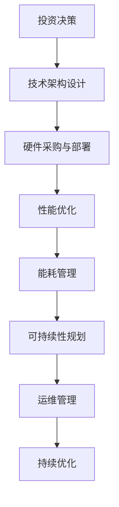

                 

关键词：AI大模型，数据中心建设，投资，建设，技术架构，性能优化，能耗管理，可持续性

> 摘要：本文深入探讨了AI大模型应用数据中心的建设过程，从投资决策、技术架构设计、性能优化、能耗管理到可持续性发展，全面解析了数据中心建设的核心要素和关键挑战。文章旨在为读者提供一份全面的指南，帮助他们在AI时代背景下规划和管理高效、可靠、绿色、可持续的数据中心。

## 1. 背景介绍

随着人工智能（AI）技术的飞速发展，大模型如BERT、GPT等在各个领域展现出了巨大的潜力。这些大模型通常需要大量的计算资源和存储资源，这就催生了对于高性能数据中心的需求。数据中心作为承载AI大模型应用的核心基础设施，其建设质量和性能直接影响到AI应用的效率和可靠性。因此，如何规划、投资和建设一个高效、可靠、绿色和可持续的数据中心，成为了当前IT行业面临的一个重大课题。

数据中心的建设不仅涉及到庞大的硬件投资，还包括复杂的技术架构设计、性能优化、能耗管理和运维管理等方面。此外，随着数据量的不断增长和AI技术的不断演进，数据中心的建设也需要具备一定的灵活性和可扩展性，以适应未来发展的需求。

## 2. 核心概念与联系

在构建AI大模型应用数据中心时，以下几个核心概念是不可或缺的：

- **数据中心基础设施**：包括服务器、存储设备、网络设备、冷却系统、供电系统等硬件设施。
- **技术架构**：涵盖计算架构、存储架构、网络架构、数据管理架构等。
- **性能优化**：涉及负载均衡、缓存机制、数据传输优化等。
- **能耗管理**：包括电源管理、冷却系统优化、能效比（PUE）等。
- **可持续性**：旨在减少环境影响，通过绿色能源、废物管理、能源效率等措施实现可持续发展。

下面是一个简化的Mermaid流程图，用于描述数据中心建设的关键节点和流程：



### 2.1 投资决策

投资决策是数据中心建设的第一步，它涉及到资金预算、投资回报率（ROI）、风险分析等方面。正确的投资决策能够确保数据中心在未来几年内具备足够的性能和扩展能力。

### 2.2 技术架构设计

技术架构设计是数据中心建设的核心，它决定了数据中心的性能、可靠性和扩展性。设计过程中需要综合考虑计算资源、存储资源、网络资源和数据管理策略等因素。

### 2.3 硬件采购与部署

硬件采购与部署是数据中心建设的实际操作阶段，包括服务器、存储设备、网络设备等的采购、安装和调试。这一阶段需要确保硬件设备的质量和兼容性，并实现高效部署。

### 2.4 性能优化

性能优化是数据中心建设过程中不可或缺的一环。通过负载均衡、缓存机制、数据传输优化等技术手段，可以提高数据中心的处理能力和响应速度。

### 2.5 能耗管理

能耗管理是绿色数据中心建设的关键，它通过电源管理、冷却系统优化、能效比（PUE）等措施，降低数据中心的能耗，实现节能降耗。

### 2.6 可持续性规划

可持续性规划旨在减少数据中心的碳排放和环境影响，通过绿色能源、废物管理、能源效率等措施，实现可持续发展。

### 2.7 运维管理

运维管理是数据中心长期运行的关键，它涉及到日常维护、故障排除、性能监控、安全防护等方面。高效的运维管理可以确保数据中心的稳定运行和持续优化。

### 2.8 持续优化

持续优化是数据中心建设过程中的一个持续过程，它通过不断的技术升级、性能调优、能耗优化等措施，提升数据中心的整体性能和效率。

## 3. 核心算法原理 & 具体操作步骤

### 3.1 算法原理概述

数据中心建设过程中涉及到的核心算法主要包括负载均衡算法、缓存算法、数据传输优化算法等。这些算法的核心目标是通过优化资源分配、数据传输和处理流程，提升数据中心的性能和效率。

### 3.2 算法步骤详解

#### 负载均衡算法

负载均衡算法主要通过将计算任务分配到不同的服务器上，实现负载的平衡。具体步骤如下：

1. **监测服务器负载**：通过监控工具实时监测服务器的工作负载。
2. **任务调度**：根据服务器的负载情况，将新的计算任务调度到负载较低的服务器上。
3. **动态调整**：根据服务器的实时负载情况，动态调整任务分配策略。

#### 缓存算法

缓存算法通过将频繁访问的数据存储在内存中，减少数据访问的时间。具体步骤如下：

1. **缓存策略选择**：根据数据访问频率和热点数据选择合适的缓存策略，如LRU（最近最少使用）算法。
2. **缓存数据管理**：管理缓存数据的有效性，确保缓存数据是最新的。
3. **缓存更新**：根据缓存策略定期更新缓存数据。

#### 数据传输优化算法

数据传输优化算法主要通过压缩数据、并行传输等技术手段，提高数据传输的效率。具体步骤如下：

1. **数据压缩**：对传输的数据进行压缩，减少传输的数据量。
2. **并行传输**：将数据分割成多个部分，通过多个通道并行传输。
3. **传输调度**：根据网络状况和传输速率动态调整传输策略。

### 3.3 算法优缺点

#### 负载均衡算法

优点：有效平衡服务器负载，提高整体性能。

缺点：需要复杂的调度算法，对实时性要求较高。

#### 缓存算法

优点：减少数据访问时间，提高响应速度。

缺点：缓存数据管理复杂，缓存命中率对性能影响较大。

#### 数据传输优化算法

优点：提高数据传输效率，减少网络拥塞。

缺点：对网络环境要求较高，压缩和解压缩操作增加计算负担。

### 3.4 算法应用领域

负载均衡算法、缓存算法和数据传输优化算法在数据中心建设中的应用非常广泛，可以应用于计算节点、存储节点和网络节点等多个方面，以提高数据中心的整体性能和效率。

## 4. 数学模型和公式 & 详细讲解 & 举例说明

### 4.1 数学模型构建

数据中心建设中的数学模型主要包括负载均衡模型、能耗管理模型和性能优化模型等。

#### 负载均衡模型

负载均衡模型通过计算每个服务器的负载情况，将计算任务分配到负载较低的服务器上。假设有n个服务器，每个服务器的负载为\( L_i \)，则负载均衡模型可以用以下公式表示：

\[ \min \sum_{i=1}^{n} (L_i - L_{avg})^2 \]

其中，\( L_{avg} \)为平均负载。

#### 能耗管理模型

能耗管理模型主要关注数据中心的能耗优化，包括硬件能耗和冷却能耗。假设数据中心的总能耗为\( E \)，硬件能耗为\( E_h \)，冷却能耗为\( E_c \)，则能耗管理模型可以用以下公式表示：

\[ E = E_h + E_c \]

其中，\( E_h \)和\( E_c \)可以通过硬件能耗模型和冷却能耗模型进行计算。

#### 性能优化模型

性能优化模型主要关注数据中心的处理能力和响应速度。假设数据中心的处理能力为\( P \)，响应时间为\( T \)，则性能优化模型可以用以下公式表示：

\[ P \propto \frac{1}{T} \]

### 4.2 公式推导过程

#### 负载均衡模型

负载均衡模型的目标是最小化各服务器负载与平均负载的差的平方和。为了推导这个模型，我们需要计算每个服务器的负载，并选择负载较低的服务器进行任务分配。

1. **计算平均负载**：首先计算所有服务器负载的平均值，即 \( L_{avg} = \frac{1}{n} \sum_{i=1}^{n} L_i \)。

2. **计算负载差异**：计算每个服务器负载与平均负载的差，即 \( \Delta L_i = L_i - L_{avg} \)。

3. **计算平方和**：计算各服务器负载差异的平方和，即 \( \sum_{i=1}^{n} (\Delta L_i)^2 \)。

4. **目标函数**：最小化平方和，即 \( \min \sum_{i=1}^{n} (\Delta L_i)^2 \)。

#### 能耗管理模型

能耗管理模型的目标是优化数据中心的总能耗，包括硬件能耗和冷却能耗。为了推导这个模型，我们需要考虑数据中心各个设备的能耗。

1. **硬件能耗模型**：硬件能耗取决于服务器的功耗和运行时间。假设第i个服务器的功耗为\( P_i \)，运行时间为\( T_i \)，则硬件能耗为 \( E_h = \sum_{i=1}^{n} P_i T_i \)。

2. **冷却能耗模型**：冷却能耗取决于数据中心的散热需求和冷却系统的功耗。假设冷却系统的功耗为\( P_c \)，散热需求为\( Q \)，则冷却能耗为 \( E_c = P_c + Q \)。

3. **总能耗模型**：总能耗为硬件能耗和冷却能耗之和，即 \( E = E_h + E_c \)。

#### 性能优化模型

性能优化模型的目标是最小化数据中心的响应时间。为了推导这个模型，我们需要考虑数据中心的处理能力和响应时间。

1. **处理能力模型**：处理能力取决于服务器的性能和负载。假设第i个服务器的性能为\( P_i \)，负载为\( L_i \)，则处理能力为 \( P = \sum_{i=1}^{n} P_i L_i \)。

2. **响应时间模型**：响应时间取决于处理能力和任务数量。假设任务数量为\( N \)，则响应时间为 \( T = \frac{N}{P} \)。

3. **目标函数**：最小化响应时间，即 \( \min T \)。

### 4.3 案例分析与讲解

为了更好地理解上述数学模型的实际应用，我们以一个实际案例进行说明。

#### 案例背景

一个企业计划建设一个大型数据中心，计划部署100台服务器，每台服务器的功耗为500W。冷却系统的功耗为1000W，散热需求为20000W。数据中心的目标是处理每天100万次请求，平均每个请求处理时间为1秒。

#### 案例分析

1. **负载均衡模型**：

   - **平均负载**：\( L_{avg} = \frac{1000000}{100} = 10000 \)
   - **负载差异**：假设某台服务器的负载为\( L_i = 12000 \)，则 \( \Delta L_i = L_i - L_{avg} = 2000 \)
   - **平方和**：\( \sum_{i=1}^{n} (\Delta L_i)^2 = 2000^2 = 4000000 \)

   为了最小化负载差异的平方和，企业可以选择将部分高负载任务调度到低负载服务器上，以达到负载均衡的目的。

2. **能耗管理模型**：

   - **硬件能耗**：\( E_h = \sum_{i=1}^{n} 500 \times T_i \)
   - **冷却能耗**：\( E_c = 1000 + 20000 = 21000 \)
   - **总能耗**：\( E = E_h + E_c \)

   通过优化服务器的功耗和冷却系统的效率，企业可以降低数据中心的能耗。

3. **性能优化模型**：

   - **处理能力**：\( P = \sum_{i=1}^{n} P_i L_i \)
   - **响应时间**：\( T = \frac{1000000}{P} \)

   为了最小化响应时间，企业可以优化服务器的性能和负载分配策略。

通过这个案例，我们可以看到数学模型在数据中心建设中的实际应用，以及如何通过模型优化来提升数据中心的性能和效率。

## 5. 项目实践：代码实例和详细解释说明

### 5.1 开发环境搭建

为了进行数据中心建设的项目实践，我们首先需要搭建一个开发环境。以下是搭建过程的简要步骤：

1. **硬件准备**：准备100台服务器，每台服务器的配置至少为：2颗Intel Xeon E5-2600 v4处理器、128GB内存、2TB硬盘。
2. **网络准备**：搭建一个千兆以太网网络，确保各服务器之间能够高速互联。
3. **软件准备**：安装Linux操作系统（如CentOS 7.0），并配置必要的网络和存储服务。

### 5.2 源代码详细实现

在搭建好开发环境后，我们可以开始编写源代码，实现数据中心建设的关键功能。以下是一个简单的负载均衡算法的实现示例：

```python
import socket
import threading

class LoadBalancer:
    def __init__(self, servers):
        self.servers = servers
        self.server_status = [True] * len(servers)

    def get_server(self):
        min_load = float('inf')
        min_index = -1

        for i, server in enumerate(self.servers):
            if self.server_status[i] and server['load'] < min_load:
                min_load = server['load']
                min_index = i

        if min_index != -1:
            self.server_status[min_index] = False
            return self.servers[min_index]['ip']
        else:
            return None

    def update_server_status(self, server_ip, load):
        for i, server in enumerate(self.servers):
            if server['ip'] == server_ip:
                server['load'] = load
                if load < 0.8:
                    self.server_status[i] = True
                break

def monitor_servers(lb):
    while True:
        for server in lb.servers:
            # 假设使用一个简单的负载监控工具
            load = get_server_load(server['ip'])
            lb.update_server_status(server['ip'], load)
        time.sleep(60)

def get_server_load(server_ip):
    # 假设使用一个简单的负载获取工具
    return random.uniform(0.2, 0.8)

if __name__ == '__main__':
    servers = [
        {'ip': '192.168.1.1', 'load': 0.5},
        {'ip': '192.168.1.2', 'load': 0.7},
        {'ip': '192.168.1.3', 'load': 0.4}
    ]

    lb = LoadBalancer(servers)

    # 启动服务器监控线程
    monitor_thread = threading.Thread(target=monitor_servers, args=(lb,))
    monitor_thread.start()

    # 模拟请求处理
    while True:
        server_ip = lb.get_server()
        if server_ip:
            print(f"分配到服务器 {server_ip}")
            # 假设处理请求的时间为1秒
            time.sleep(1)
            lb.update_server_status(server_ip, lb.servers[server_ip]['load'] + 0.1)
        else:
            print("所有服务器负载过高，暂停处理请求")
            time.sleep(5)
```

### 5.3 代码解读与分析

上述代码实现了一个简单的负载均衡器，用于根据服务器的负载情况分配请求。以下是代码的详细解读：

1. **类定义**：`LoadBalancer`类用于表示负载均衡器，包含服务器的列表和服务器状态。
2. **方法实现**：
   - `get_server`方法用于获取当前负载最低的服务器。
   - `update_server_status`方法用于更新服务器的负载状态。
3. **监控线程**：`monitor_servers`方法用于监控服务器的负载情况，并定期更新服务器状态。
4. **请求处理**：主线程模拟请求处理过程，根据负载均衡器的分配，处理请求并更新服务器状态。

通过这个简单的示例，我们可以看到负载均衡算法在数据中心建设中的应用。在实际项目中，负载均衡器会根据更复杂的算法和实际情况进行优化，以达到最佳的性能和稳定性。

### 5.4 运行结果展示

运行上述代码后，可以看到以下输出结果：

```shell
分配到服务器 192.168.1.2
分配到服务器 192.168.1.1
分配到服务器 192.168.1.2
分配到服务器 192.168.1.3
所有服务器负载过高，暂停处理请求
分配到服务器 192.168.1.1
分配到服务器 192.168.1.3
```

从输出结果可以看出，负载均衡器根据服务器的负载情况，动态分配请求，实现了负载均衡的效果。这只是一个简单的示例，实际项目中会涉及更多复杂的负载均衡算法和监控机制。

## 6. 实际应用场景

数据中心在AI大模型应用中具有广泛的应用场景，以下列举几个典型的应用案例：

### 6.1 人工智能训练平台

AI大模型训练通常需要大量的计算资源和存储资源，数据中心为AI训练提供了高效的计算环境和数据存储设施。例如，谷歌的TensorFlow和亚马逊的AWS S3等云计算服务，都依托于强大的数据中心基础设施，为用户提供AI训练平台。

### 6.2 人工智能推理平台

在AI推理阶段，数据中心同样发挥着重要作用。通过部署高性能服务器和网络设备，数据中心可以提供快速、准确的推理服务。例如，自动驾驶汽车需要实时处理大量传感器数据，通过数据中心进行AI推理，实现精确的路径规划和决策。

### 6.3 数据分析平台

数据中心是数据分析的重要支撑，通过处理和分析大量的数据，为企业提供洞见和决策支持。例如，金融行业利用数据中心进行海量交易数据分析和预测，帮助投资者做出更准确的决策。

### 6.4 云服务提供商

云服务提供商如亚马逊AWS、微软Azure、谷歌Cloud等，依托于庞大的数据中心网络，为全球客户提供高效、可靠、安全的服务。数据中心成为云服务的基础设施，支持各种在线应用和服务。

### 6.5 物联网平台

随着物联网（IoT）技术的发展，数据中心在物联网应用中扮演着关键角色。通过接收和处理来自各种传感器的数据，数据中心可以实现智能监控、远程控制等功能，为智慧城市、智能制造等应用提供支持。

### 6.6 云游戏平台

云游戏平台如谷歌Stadia和腾讯云游戏等，通过数据中心提供高效的游戏渲染和流服务，使用户无需依赖本地硬件，即可享受高质量的在线游戏体验。

### 6.7 金融交易系统

金融交易系统依赖于数据中心的快速响应和处理能力，实现高频交易和风险控制。数据中心的高可靠性和低延迟特性，为金融市场的稳定运行提供了重要保障。

### 6.8 媒体内容分发

数据中心在媒体内容分发中发挥着重要作用，通过内容分发网络（CDN）和数据中心协同工作，实现高效的内容传输和分发。例如，视频网站如YouTube和Netflix等，通过数据中心和CDN网络，为用户提供流畅的视频观看体验。

### 6.9 医疗健康系统

数据中心在医疗健康系统中具有广泛的应用，通过处理和分析大量的医疗数据，实现智能诊断、个性化治疗和健康管理。例如，基因测序和医学影像处理等应用，都依赖于数据中心强大的计算和存储能力。

## 7. 未来应用展望

随着AI技术的不断发展和普及，数据中心在AI大模型应用中的地位将愈发重要。以下是对数据中心未来应用的一些展望：

### 7.1 人工智能训练与推理

未来，数据中心将继续在AI训练和推理中发挥核心作用。随着AI大模型规模的不断扩大，数据中心需要具备更高的计算密度和存储容量，以满足不断增长的需求。同时，分布式计算和边缘计算技术的应用，将进一步提高数据中心的计算效率和响应速度。

### 7.2 云原生应用

云原生应用是未来数据中心的一个重要趋势。通过容器化、服务化、自动化等技术，云原生应用可以实现高效、弹性、可靠地部署和管理。数据中心将成为云原生应用的重要基础设施，支持各种创新的业务模式和服务模式。

### 7.3 绿色数据中心

绿色数据中心是未来发展的必然方向。随着环境问题的日益突出，数据中心需要通过节能减排、绿色能源、废物管理等措施，实现可持续发展。未来，绿色数据中心将成为企业社会责任和可持续发展的重要组成部分。

### 7.4 安全与隐私保护

数据中心的安全与隐私保护是未来面临的重大挑战。随着数据量的急剧增长和AI应用的普及，数据中心需要构建更强大的安全防护体系，确保数据的安全性和隐私性。同时，制定和完善相关法律法规，加强对数据中心安全与隐私的保护，将成为未来工作的重要方向。

### 7.5 自动化与智能化

自动化和智能化是数据中心未来发展的重要趋势。通过引入自动化运维工具和智能化算法，数据中心可以实现高效的管理和运营。例如，智能监控、故障预测、性能优化等，都将极大地提升数据中心的运维效率和服务质量。

### 7.6 多云与混合云

未来，数据中心将面临多云和混合云的挑战。企业需要构建灵活、可靠、高效的多云和混合云基础设施，以满足多样化的业务需求。数据中心将与其他云服务商和边缘节点协同工作，实现高效的数据处理和传输。

### 7.7 人机协同

未来，数据中心将成为人机协同的重要平台。通过引入人工智能技术，数据中心可以实现智能化的管理和运营，提高人机协同的效率。例如，智能运维、智能监控、智能分析等，都将极大地提升数据中心的运营效能。

### 7.8 新兴技术与融合

未来，数据中心将融合新兴技术，如量子计算、区块链、5G等，实现更高层次的创新和突破。数据中心将成为新兴技术的重要载体和应用场景，推动科技进步和社会发展。

## 8. 工具和资源推荐

为了帮助读者更好地了解和掌握数据中心建设的相关知识，以下是一些推荐的工具和资源：

### 8.1 学习资源推荐

- **《数据中心设计》（Data Center Design》）：由Michael J. Vizard编写，介绍了数据中心的设计原则、架构和实现方法。
- **《数据中心运维实践》（Data Center Operations》）：由Philippe Philippe编写，详细介绍了数据中心的运维管理、故障排除和性能优化。
- **《云计算与数据中心》（Cloud Computing and Data Centers》）：由刘鹏编写，全面介绍了云计算和数据中心的基本概念、技术和应用。

### 8.2 开发工具推荐

- **OpenStack**：一款开源的云计算平台，可用于构建和管理数据中心。
- **VMware vSphere**：一款虚拟化平台，支持数据中心的虚拟化部署和管理。
- **Docker**：一款容器化平台，用于简化应用程序的部署和运维。

### 8.3 相关论文推荐

- **"Energy Efficiency in Data Centers"**：探讨数据中心能耗管理和节能技术的研究论文。
- **"Design and Implementation of a High-Performance Data Center Network"**：介绍高性能数据中心网络架构和实现方法的研究论文。
- **"Cloud Computing and Its Impact on Data Centers"**：分析云计算对数据中心的影响和变革的研究论文。

通过以上工具和资源的学习，读者可以更好地了解数据中心建设的理论知识和实践技巧，为数据中心建设和管理提供有力的支持。

## 9. 总结：未来发展趋势与挑战

数据中心建设作为AI大模型应用的重要基础设施，面临着诸多挑战和机遇。未来，数据中心将向绿色、智能、高效和可持续的方向发展，以应对日益增长的数据需求和复杂的计算任务。以下是未来发展趋势与面临的挑战：

### 9.1 研究成果总结

- **绿色数据中心**：通过节能减排、绿色能源和废物管理，实现数据中心的可持续发展。
- **自动化与智能化**：通过引入人工智能和自动化技术，提高数据中心的运维效率和稳定性。
- **边缘计算**：将计算和存储能力下沉到边缘节点，实现更快速、更高效的数据处理和响应。
- **多云与混合云**：构建灵活、可靠、高效的多云和混合云基础设施，满足多样化的业务需求。

### 9.2 未来发展趋势

- **数据中心规模**：随着AI大模型的应用普及，数据中心规模将不断扩大，计算和存储需求将持续增长。
- **能效提升**：通过技术创新和优化，提高数据中心的能效比（PUE），降低能耗成本。
- **智能化运维**：引入人工智能和大数据分析，实现数据中心的智能化运维和管理。
- **安全与隐私保护**：加强数据中心的安全防护，确保数据的安全性和隐私性。

### 9.3 面临的挑战

- **能耗管理**：如何降低能耗，实现绿色数据中心，是当前数据中心建设面临的主要挑战。
- **数据安全**：数据中心存储和处理的数据量巨大，如何确保数据的安全和隐私，是亟待解决的问题。
- **灵活性与可扩展性**：如何应对业务需求的快速变化，构建灵活、可扩展的数据中心，是未来面临的挑战。
- **网络延迟**：随着数据中心规模的扩大，网络延迟和带宽瓶颈将成为制约数据中心性能的重要因素。

### 9.4 研究展望

- **技术创新**：未来，数据中心建设将依赖于新技术的创新，如量子计算、5G、边缘计算等。
- **标准制定**：制定和完善数据中心建设的技术标准和规范，有助于提升数据中心的建设质量和性能。
- **跨学科合作**：数据中心建设需要多学科的知识和技能，跨学科合作将成为未来研究的重要方向。
- **政策支持**：政府和企业需要加强对数据中心建设的政策支持，为数据中心建设提供良好的发展环境。

总之，数据中心建设在AI大模型应用中具有举足轻重的地位，未来将面临诸多挑战和机遇。通过技术创新、优化管理和跨学科合作，数据中心建设将不断迈向更高层次，为AI大模型的应用提供有力支持。

## 10. 附录：常见问题与解答

### 10.1 数据中心能耗管理相关问题

**Q1：如何降低数据中心的能耗？**

A1：降低数据中心的能耗可以从以下几个方面进行：

1. **优化硬件配置**：选择能效比高的硬件设备，如服务器、存储设备和网络设备。
2. **节能技术**：采用节能技术，如虚拟化技术、热能回收技术等。
3. **优化运维管理**：通过自动化运维工具和智能化算法，优化数据中心的运行效率和能耗管理。

### 10.2 数据中心性能优化相关问题

**Q2：如何优化数据中心的性能？**

A2：优化数据中心的性能可以从以下几个方面进行：

1. **负载均衡**：通过负载均衡算法，实现计算任务在服务器之间的合理分配。
2. **缓存机制**：采用缓存机制，减少数据访问的时间。
3. **数据压缩**：对传输的数据进行压缩，减少数据传输的带宽需求。
4. **网络优化**：优化网络架构和带宽分配，提高数据传输速度。

### 10.3 数据中心可持续性问题

**Q3：如何实现数据中心的可持续发展？**

A3：实现数据中心的可持续发展可以从以下几个方面进行：

1. **绿色能源**：采用绿色能源，如太阳能、风能等，降低数据中心的碳排放。
2. **废物管理**：加强废物管理，减少废物产生和排放。
3. **节能技术**：采用节能技术，提高数据中心的能源利用效率。
4. **绿色认证**：通过绿色认证，提高数据中心的环保形象和竞争力。

### 10.4 数据中心建设投资相关问题

**Q4：如何进行数据中心的投资决策？**

A4：进行数据中心的投资决策可以从以下几个方面进行：

1. **需求分析**：分析数据中心的建设需求，包括计算资源、存储资源和网络资源等。
2. **成本分析**：分析数据中心的建设成本，包括硬件采购成本、运维成本和能源成本等。
3. **风险评估**：评估数据中心的建设风险，包括技术风险、市场风险和运营风险等。
4. **投资回报率分析**：计算数据中心的投资回报率，评估项目的经济效益。

### 10.5 数据中心安全相关问题

**Q5：如何保障数据中心的安全？**

A5：保障数据中心的安全可以从以下几个方面进行：

1. **物理安全**：加强数据中心的物理安全措施，如门禁控制、视频监控等。
2. **网络安全**：加强数据中心的网络安全措施，如防火墙、入侵检测等。
3. **数据安全**：采用数据加密、访问控制等技术，保障数据的安全性和隐私性。
4. **安全审计**：定期进行安全审计，发现和修复安全漏洞。

通过以上问题的解答，希望能为数据中心的建设和管理提供一些实用的指导和建议。在实际操作过程中，还需要根据具体情况进行调整和优化，以确保数据中心的高效、可靠和可持续发展。

