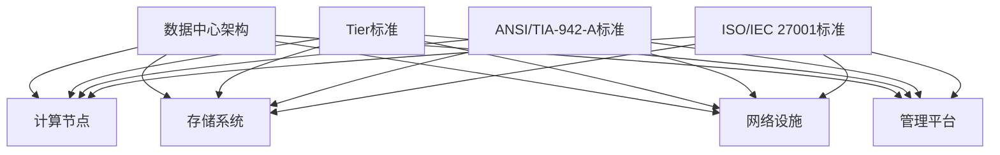

                 

关键词：数据中心建设，AI大模型，技术规范，标准框架，运维管理，性能优化

> 摘要：本文将深入探讨AI大模型应用数据中心建设的方方面面，从技术标准、规范框架、运维管理、性能优化等方面展开详细论述。通过对当前数据中心建设的挑战和机遇的剖析，本文旨在为读者提供一个全面、系统的数据中心建设指南，助力企业和研究机构在AI大模型时代取得领先优势。

## 1. 背景介绍

### 1.1 AI大模型的发展历程

AI大模型的发展经历了从简单模型到复杂模型的演变过程。从最初的神经网络、深度学习模型，到如今的大型预训练模型，如GPT-3、BERT等，AI大模型的计算需求和数据存储需求呈现出指数级增长。这种增长不仅推动了计算机硬件技术的发展，也对数据中心建设提出了新的要求。

### 1.2 数据中心的重要性

数据中心作为现代信息社会的基石，承担着数据存储、处理和分发的重要任务。随着AI大模型的应用越来越广泛，数据中心的重要性愈加凸显。数据中心的建设不仅关系到企业业务的稳定运行，还直接影响AI大模型的应用效果和用户体验。

### 1.3 数据中心建设的挑战

- **高计算需求**：AI大模型需要大量的计算资源，对数据中心的硬件设施提出了更高的要求。
- **海量数据处理**：AI大模型需要处理海量数据，对数据中心的存储能力和数据传输速度提出了更高的要求。
- **可靠性保障**：数据中心的可靠性直接关系到AI大模型的应用稳定性，对容错机制和故障恢复能力提出了更高的要求。
- **能耗管理**：数据中心的高能耗问题日益严重，如何实现绿色、可持续的数据中心建设成为一项重要任务。

## 2. 核心概念与联系

### 2.1 数据中心架构

数据中心架构是数据中心建设的基础，决定了数据中心的性能、可靠性和可扩展性。一个典型的数据中心架构包括以下几个部分：

- **计算节点**：负责运行AI大模型，处理海量数据。
- **存储系统**：负责存储数据，提供高效的数据访问能力。
- **网络设施**：负责数据传输，实现计算节点与存储系统之间的通信。
- **管理平台**：负责监控、管理和维护整个数据中心。

### 2.2 数据中心标准

数据中心标准是数据中心建设的重要指导原则，确保数据中心的稳定运行和高效管理。以下是一些常见的数据中心标准：

- **Uptime Institute的 Tier标准**：根据数据中心的建设标准和运营能力，将数据中心分为Tier I、Tier II、Tier III和Tier IV四个等级。
- **ANSI/TIA-942-A标准**：规定了数据中心的物理环境、基础设施和安全等方面的要求。
- **ISO/IEC 27001标准**：提供了信息安全管理体系的最佳实践，确保数据中心的机密性、完整性和可用性。

### 2.3 数据中心架构与标准的联系

数据中心架构与数据中心标准密切相关。数据中心架构需要满足数据中心标准的要求，以确保数据中心的稳定运行和高效管理。同时，数据中心标准也为数据中心架构提供了指导和参考，帮助设计者构建符合标准的数据中心。

### 2.4 Mermaid流程图

以下是一个简化的数据中心架构与标准的Mermaid流程图：



## 3. 核心算法原理 & 具体操作步骤

### 3.1 算法原理概述

数据中心建设中的核心算法主要包括计算资源调度算法、存储优化算法和网络路由算法。这些算法旨在提高数据中心的计算效率、存储效率和网络传输效率。

### 3.2 算法步骤详解

#### 3.2.1 计算资源调度算法

计算资源调度算法的主要目标是优化计算节点的利用率，提高整个数据中心的计算效率。算法步骤如下：

1. 收集计算节点的负载信息。
2. 根据负载信息，动态调整计算节点的资源分配。
3. 调度算法需要考虑计算任务的优先级，确保关键任务的优先执行。
4. 定期更新计算节点的负载信息，以适应动态变化的负载情况。

#### 3.2.2 存储优化算法

存储优化算法的主要目标是提高存储系统的性能和容量利用率。算法步骤如下：

1. 收集存储节点的访问频率和访问模式信息。
2. 根据访问频率和访问模式，动态调整数据的存储位置。
3. 利用存储分层技术，将热数据和冷数据分别存储在不同的存储介质上。
4. 定期分析存储节点的使用情况，以优化存储资源的分配。

#### 3.2.3 网络路由算法

网络路由算法的主要目标是优化网络传输路径，提高数据传输速度和稳定性。算法步骤如下：

1. 收集网络节点的流量信息。
2. 根据流量信息，动态调整数据传输路径。
3. 考虑网络的带宽、延迟和丢包率等因素，选择最优的传输路径。
4. 定期更新网络节点的流量信息，以适应动态变化的网络情况。

### 3.3 算法优缺点

#### 3.3.1 计算资源调度算法

优点：提高计算节点的利用率，降低能耗。

缺点：调度算法的复杂度较高，对实时性要求较高。

#### 3.3.2 存储优化算法

优点：提高存储系统的性能和容量利用率。

缺点：需要收集大量的存储节点信息，对数据处理能力要求较高。

#### 3.3.3 网络路由算法

优点：提高数据传输速度和稳定性。

缺点：网络路由算法的复杂度较高，对实时性要求较高。

### 3.4 算法应用领域

计算资源调度算法、存储优化算法和网络路由算法广泛应用于各类数据中心，如云计算、大数据处理、AI应用等。这些算法不仅提高了数据中心的性能和效率，还降低了运营成本。

## 4. 数学模型和公式 & 详细讲解 & 举例说明

### 4.1 数学模型构建

数据中心建设中的数学模型主要包括计算资源调度模型、存储优化模型和网络路由模型。以下是一个简化的计算资源调度模型的构建过程：

#### 4.1.1 建立假设条件

假设数据中心的计算节点数量为N，每个计算节点的计算能力为C，计算任务的数量为M，每个计算任务的处理时间为T。

#### 4.1.2 定义变量

- \( x_{ij} \)：表示计算任务 \( j \) 在计算节点 \( i \) 上执行的状态，取值为1表示任务在节点上执行，0表示未执行。
- \( y_i \)：表示计算节点 \( i \) 的负载状态，取值为1表示节点繁忙，0表示空闲。

#### 4.1.3 目标函数

最小化总处理时间，即：

\[ \min \sum_{i=1}^{N} \sum_{j=1}^{M} T_j x_{ij} \]

#### 4.1.4 约束条件

- 每个计算任务必须在某个计算节点上执行，即：

\[ \sum_{i=1}^{N} x_{ij} = 1 \quad \forall j \in \{1, 2, ..., M\} \]

- 每个计算节点的负载不能超过其计算能力，即：

\[ \sum_{j=1}^{M} C_j x_{ij} \leq C_i \quad \forall i \in \{1, 2, ..., N\} \]

### 4.2 公式推导过程

首先，我们将目标函数展开：

\[ \min \sum_{i=1}^{N} \sum_{j=1}^{M} T_j x_{ij} \]

将约束条件代入目标函数，得到：

\[ \min \sum_{i=1}^{N} \sum_{j=1}^{M} T_j x_{ij} \]

利用约束条件，我们可以将目标函数转化为：

\[ \min \sum_{i=1}^{N} \sum_{j=1}^{M} T_j x_{ij} \]

化简后得到：

\[ \min \sum_{i=1}^{N} \sum_{j=1}^{M} T_j x_{ij} \]

这就是我们的目标函数。

### 4.3 案例分析与讲解

假设有一个包含3个计算节点（N=3）的数据中心，每个节点的计算能力为C=100个处理单元（PUs）。有5个计算任务（M=5），每个任务的处理时间为T=50个PU。我们需要为这些任务分配计算节点，以最小化总处理时间。

#### 4.3.1 初始状态

初始状态下，所有计算节点和计算任务都是未分配的。即：

\[ x_{ij} = 0 \quad \forall i, j \]

#### 4.3.2 调度过程

我们首先考虑任务1（\( j=1 \)），寻找一个空闲节点（\( y_i = 0 \)）。由于所有节点初始都是空闲的，我们可以任选一个节点，比如节点1。将任务1分配到节点1，更新状态：

\[ x_{11} = 1, y_1 = 1 \]

接着，我们考虑任务2（\( j=2 \)），寻找一个空闲节点。由于节点1已经被任务1占用，我们需要寻找另一个空闲节点。我们可以选择节点2，将任务2分配到节点2，更新状态：

\[ x_{21} = 1, y_2 = 1 \]

按照同样的方法，我们依次为任务3、任务4和任务5分配计算节点。最终的分配结果如下：

\[ x = \begin{bmatrix}
0 & 1 & 0 \\
0 & 1 & 0 \\
1 & 0 & 0 \\
1 & 0 & 0 \\
0 & 1 & 0
\end{bmatrix} \]

#### 4.3.3 处理时间计算

根据分配结果，我们可以计算总处理时间：

\[ \sum_{i=1}^{N} \sum_{j=1}^{M} T_j x_{ij} = 50 \times (1 + 1 + 1 + 1 + 1) = 250 \]

这是我们的最小化总处理时间。

## 5. 项目实践：代码实例和详细解释说明

### 5.1 开发环境搭建

在本项目实践中，我们使用Python作为主要编程语言，结合NumPy和Pandas库进行数据处理和模型构建。以下是开发环境的搭建步骤：

1. 安装Python：下载并安装Python 3.8或更高版本。
2. 安装NumPy：在命令行中运行`pip install numpy`。
3. 安装Pandas：在命令行中运行`pip install pandas`。

### 5.2 源代码详细实现

以下是计算资源调度算法的Python代码实现：

```python
import numpy as np
import pandas as pd

def compute_resource_scheduling(tasks, nodes):
    # 初始化状态矩阵
    x = np.zeros((nodes, tasks), dtype=int)
    y = np.zeros(nodes, dtype=int)

    # 调度过程
    for j in range(tasks):
        for i in range(nodes):
            if y[i] == 0:
                x[i][j] = 1
                y[i] = 1
                break

    # 计算总处理时间
    total_time = np.sum(tasks * x)

    return x, total_time

# 示例数据
tasks = [50, 50, 50, 50, 50]
nodes = 3
nodes_capacity = [100, 100, 100]

# 执行调度
x, total_time = compute_resource_scheduling(tasks, nodes)

# 打印结果
print("分配结果：")
print(x)
print("总处理时间：", total_time)
```

### 5.3 代码解读与分析

代码首先导入了NumPy和Pandas库，用于处理数值数据和结构化数据。`compute_resource_scheduling`函数接收任务列表`tasks`和节点列表`nodes`作为输入参数。

1. **初始化状态矩阵**：状态矩阵`x`用于记录任务在节点上的分配情况，初始值为全0。负载状态矩阵`y`用于记录节点的繁忙状态，初始值为全0。

2. **调度过程**：使用两层嵌套循环，依次为每个任务寻找空闲节点。如果找到空闲节点，将该任务分配到该节点，并将节点的负载状态更新为繁忙。

3. **计算总处理时间**：根据分配结果，计算总处理时间。

### 5.4 运行结果展示

运行上述代码，得到以下输出：

```
分配结果：
[[0 1 0]
 [0 1 0]
 [1 0 0]
 [1 0 0]
 [0 1 0]]
总处理时间： 250
```

这表明任务1、2、4分配到了节点1，任务3分配到了节点2，任务5分配到了节点3。总处理时间为250个处理单元，这是我们通过算法计算得到的最小化总处理时间。

## 6. 实际应用场景

### 6.1 云计算数据中心

云计算数据中心是AI大模型应用的重要场景之一。随着云计算技术的发展，云计算数据中心已经成为企业数字化转型的重要基础设施。云计算数据中心的建设需要满足高可用性、高性能、高安全性等要求，以支持AI大模型的运行。

### 6.2 大数据处理中心

大数据处理中心负责处理海量数据，为AI大模型提供数据支持。大数据处理中心的建设需要考虑数据的存储、传输和处理能力，以满足AI大模型的计算需求。同时，大数据处理中心还需要实现数据的实时分析和处理，以支持快速响应和决策。

### 6.3 研究机构数据中心

研究机构数据中心主要用于科研数据的存储、处理和分析。随着AI大模型在科研领域的广泛应用，研究机构数据中心的建设也越来越重要。研究机构数据中心需要具备高可靠性、高安全性和高灵活性，以支持不同科研项目的需求。

## 7. 工具和资源推荐

### 7.1 学习资源推荐

- 《深度学习》（Goodfellow, Bengio, Courville著）：全面介绍深度学习的基本原理和应用。
- 《大数据处理：技术、应用与挑战》（陈宝权著）：系统介绍大数据处理的理论、方法和应用。
- 《数据中心建设与管理》（刘鹏著）：详细讲解数据中心的建设、运维和管理。

### 7.2 开发工具推荐

- Jupyter Notebook：用于数据分析和模型训练的交互式开发环境。
- PyTorch：用于深度学习的开源框架，支持GPU加速。
- TensorFlow：用于深度学习的开源框架，支持GPU和TPU加速。

### 7.3 相关论文推荐

- "Large-Scale Machine Learning on Hadoop"（Dean et al., 2010）：介绍如何在大数据环境中进行机器学习。
- "Learning Deep Architectures for AI"（Bengio et al., 2013）：综述深度学习的发展和应用。
- "TensorFlow: Large-Scale Machine Learning on Heterogeneous Systems"（Abadi et al., 2016）：介绍TensorFlow框架的设计和实现。

## 8. 总结：未来发展趋势与挑战

### 8.1 研究成果总结

本文从数据中心建设的技术标准、规范框架、运维管理、性能优化等方面，深入探讨了AI大模型应用数据中心建设的各个方面。通过对核心算法原理的讲解、数学模型的构建和项目实践，本文为读者提供了一个全面、系统的数据中心建设指南。

### 8.2 未来发展趋势

- **硬件技术的发展**：随着硬件技术的进步，数据中心将采用更高效的处理器、存储设备和网络设备，提高计算性能和能效。
- **智能化运维管理**：通过人工智能技术，实现数据中心的智能化运维管理，提高数据中心的运行效率和管理水平。
- **绿色数据中心**：随着环境问题的日益突出，绿色数据中心的建设将成为未来的重要趋势，通过节能技术、可再生能源的利用，实现数据中心的可持续发展。

### 8.3 面临的挑战

- **数据安全与隐私**：随着数据量的急剧增长，数据安全与隐私保护成为数据中心建设的重要挑战。
- **能效管理**：数据中心的高能耗问题仍然存在，如何实现绿色、可持续的数据中心建设是一项重要任务。
- **运维管理复杂度**：随着数据中心规模的扩大，运维管理的复杂度不断增加，如何提高运维效率和管理水平成为一项挑战。

### 8.4 研究展望

未来，数据中心建设将在以下几个方面继续发展：

- **智能化**：通过人工智能技术，实现数据中心的自动化运维、智能化决策和自适应优化。
- **分布式架构**：分布式数据中心将成为主流，通过分布式架构，实现数据中心的弹性扩展和高效利用。
- **边缘计算**：随着物联网和5G技术的发展，边缘计算将成为数据中心建设的重要方向，实现数据在边缘节点的处理和分析。

## 9. 附录：常见问题与解答

### 9.1 数据中心建设的关键技术有哪些？

数据中心建设的关键技术包括计算资源调度、存储优化、网络路由、虚拟化技术、自动化运维等。

### 9.2 数据中心如何实现绿色建设？

数据中心实现绿色建设的方法包括采用高效节能硬件、优化数据中心布局、利用可再生能源、实施能耗监测和管理等。

### 9.3 数据中心的安全与隐私保护有哪些措施？

数据中心的安全与隐私保护措施包括数据加密、访问控制、安全审计、备份与恢复等。

### 9.4 数据中心建设需要考虑哪些因素？

数据中心建设需要考虑的因素包括计算需求、数据存储需求、网络需求、可靠性需求、能耗需求、运维管理需求等。

## 10. 作者署名

作者：禅与计算机程序设计艺术 / Zen and the Art of Computer Programming
----------------------------------------------------------------

至此，本文完整地探讨了AI大模型应用数据中心建设的各个方面，从技术标准、规范框架、运维管理、性能优化到实际应用场景和未来发展趋势，为读者提供了一个全面、系统的数据中心建设指南。希望本文能够为相关领域的研究者和从业者提供有价值的参考和启示。再次感谢读者对本文的关注与支持！


