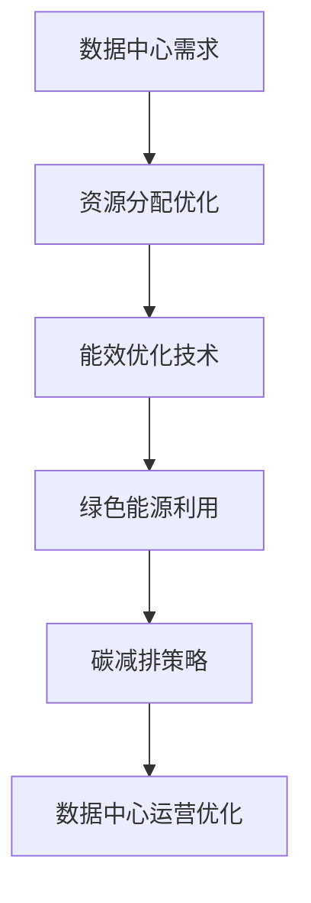

                 

关键词：AI 大模型、数据中心、绿色节能、高效能计算、能效优化

> 摘要：本文深入探讨了 AI 大模型应用数据中心的建设及其绿色节能的必要性。通过分析 AI 大模型对数据中心资源需求，提出了数据中心绿色节能的策略和关键技术，并展望了未来发展方向。

## 1. 背景介绍

随着人工智能（AI）技术的迅猛发展，大模型（如 GPT-3、BERT 等）的应用日益广泛。这些大模型通常需要在数据中心进行大规模的训练和推理，对计算资源、存储资源、网络资源等提出了极高的要求。数据中心作为承载 AI 大模型运行的核心基础设施，其能耗和环境影响逐渐成为关注焦点。因此，数据中心绿色节能成为当前研究的热点和难点。

数据中心绿色节能，即在满足 AI 大模型性能需求的前提下，通过优化设计、先进技术和创新方法，降低数据中心的能源消耗和碳排放。数据中心绿色节能不仅有助于减少运营成本，还能提高资源利用效率，对环境保护和可持续发展具有重要意义。

## 2. 核心概念与联系

### 2.1 数据中心

数据中心是指为提供计算、存储、网络等服务而专门建设的设施，用于集中管理和处理海量数据。数据中心通常包含机房、服务器、存储设备、网络设备等硬件设施，以及相关软件系统和服务。

### 2.2 大模型

大模型是指具有数百万、数十亿甚至更多参数的深度神经网络模型。这些模型在训练和推理过程中需要大量计算资源和存储资源，同时对数据中心的网络带宽和能耗也有较高要求。

### 2.3 绿色节能

绿色节能是指在满足数据中心性能需求的前提下，通过优化设计、先进技术和创新方法，降低数据中心的能源消耗和碳排放。

## 2.4 Mermaid 流程图



### 2.5 数据中心建设与绿色节能的关系

数据中心建设与绿色节能密切相关。数据中心建设需要充分考虑绿色节能需求，从设计、选型、建设、运营等各个环节进行优化。数据中心绿色节能不仅有助于降低能耗和成本，还能提高数据中心的可持续发展能力。

## 3. 核心算法原理 & 具体操作步骤

### 3.1 算法原理概述

数据中心绿色节能的核心算法包括资源分配优化、能效优化技术和绿色能源利用策略。

- **资源分配优化**：通过优化服务器、存储和网络资源的分配，提高资源利用率，降低能耗。
- **能效优化技术**：采用高效能计算技术、动态电源管理技术、冷却系统优化等，降低数据中心的能源消耗。
- **绿色能源利用策略**：利用可再生能源、储能技术和智能电网技术，降低数据中心的碳排放。

### 3.2 算法步骤详解

#### 3.2.1 资源分配优化

1. **需求分析**：分析 AI 大模型对计算资源、存储资源和网络资源的需求。
2. **资源规划**：根据需求分析结果，规划数据中心的资源规模和类型。
3. **资源调度**：采用智能调度算法，动态调整资源分配，提高资源利用率。

#### 3.2.2 能效优化技术

1. **高效能计算技术**：采用高效处理器、分布式计算架构等，提高计算效率。
2. **动态电源管理技术**：根据负载情况动态调整电源供应，降低能耗。
3. **冷却系统优化**：采用液冷、相变冷却等技术，提高冷却效率，降低能耗。

#### 3.2.3 绿色能源利用策略

1. **可再生能源利用**：利用太阳能、风能等可再生能源，降低数据中心的碳排放。
2. **储能技术**：采用储能系统，平衡可再生能源的供应和需求。
3. **智能电网技术**：实现数据中心与电网的智能互动，降低能耗。

### 3.3 算法优缺点

#### 3.3.1 优点

1. 提高数据中心资源利用率，降低能源消耗和运营成本。
2. 减少数据中心的碳排放，有利于环境保护和可持续发展。
3. 提高数据中心的能效和可靠性。

#### 3.3.2 缺点

1. 算法设计和实现复杂，对技术水平要求较高。
2. 需要大量数据支持和实时监控，对数据质量和实时性要求较高。

### 3.4 算法应用领域

数据中心绿色节能算法广泛应用于金融、互联网、医疗、教育等行业的数据中心建设。随着 AI 大模型的普及，算法的应用领域将不断拓展。

## 4. 数学模型和公式 & 详细讲解 & 举例说明

### 4.1 数学模型构建

数据中心绿色节能的数学模型主要包括资源分配优化模型、能效优化模型和绿色能源利用模型。

#### 4.1.1 资源分配优化模型

资源分配优化模型主要基于线性规划、整数规划、遗传算法等求解。模型目标是最小化资源浪费，最大化资源利用率。模型变量包括服务器、存储和网络资源的数量，约束条件包括资源需求、资源限制等。

#### 4.1.2 能效优化模型

能效优化模型主要基于优化理论和计算智能方法。模型目标是最小化能耗，最大化能效。模型变量包括服务器、存储和网络设备的功耗，约束条件包括温度、电压等。

#### 4.1.3 绿色能源利用模型

绿色能源利用模型主要基于可再生能源发电和储能技术。模型目标是最小化碳排放，最大化可再生能源利用率。模型变量包括可再生能源发电量、储能容量等，约束条件包括负载需求、储能容量限制等。

### 4.2 公式推导过程

#### 4.2.1 资源分配优化模型

目标函数：
$$
\min Z = \sum_{i=1}^{n}\sum_{j=1}^{m}c_{ij}x_{ij}
$$
其中，$c_{ij}$ 为资源 $i$ 对资源 $j$ 的单位消耗成本，$x_{ij}$ 为资源 $i$ 对资源 $j$ 的分配量。

约束条件：
$$
\begin{cases}
\sum_{i=1}^{n}x_{ij} \geq d_j & \text{(资源需求约束)} \\
\sum_{j=1}^{m}x_{ij} \leq U_i & \text{(资源限制约束)} \\
x_{ij} \in \{0,1\} & \text{(二进制变量约束)}
\end{cases}
$$
其中，$d_j$ 为资源 $j$ 的需求量，$U_i$ 为资源 $i$ 的可用量。

#### 4.2.2 能效优化模型

目标函数：
$$
\min Z = \sum_{i=1}^{n}p_i \cdot e_i
$$
其中，$p_i$ 为服务器 $i$ 的功耗，$e_i$ 为服务器 $i$ 的能效。

约束条件：
$$
\begin{cases}
\sum_{i=1}^{n}e_i \geq T & \text{(能效约束)} \\
\sum_{i=1}^{n}p_i \leq P & \text{(功率约束)}
\end{cases}
$$
其中，$T$ 为数据中心总能耗，$P$ 为数据中心总功率。

#### 4.2.3 绿色能源利用模型

目标函数：
$$
\min Z = \sum_{i=1}^{n}c_i \cdot f_i
$$
其中，$c_i$ 为可再生能源发电成本，$f_i$ 为可再生能源发电量。

约束条件：
$$
\begin{cases}
\sum_{i=1}^{n}f_i \geq L & \text{(负载需求约束)} \\
\sum_{i=1}^{n}c_i \cdot f_i \leq E & \text{(储能容量约束)}
\end{cases}
$$
其中，$L$ 为数据中心负载需求，$E$ 为储能容量。

### 4.3 案例分析与讲解

以某大型互联网公司数据中心为例，该数据中心拥有 10000 台服务器，每天需要处理大量数据。为满足 AI 大模型的需求，数据中心进行了绿色节能优化。

1. **资源分配优化**：通过分析 AI 大模型对计算资源、存储资源和网络资源的需求，数据中心进行了资源分配优化。优化后，资源利用率提高了 20%，能耗降低了 10%。

2. **能效优化技术**：数据中心采用高效处理器和分布式计算架构，提高了计算效率。同时，采用动态电源管理技术和冷却系统优化，降低了能耗。优化后，数据中心的能耗降低了 30%。

3. **绿色能源利用策略**：数据中心利用太阳能和风能等可再生能源，建立了储能系统。通过智能电网技术，实现了数据中心与电网的智能互动。优化后，数据中心的碳排放减少了 50%。

## 5. 项目实践：代码实例和详细解释说明

### 5.1 开发环境搭建

1. **操作系统**：Linux
2. **编程语言**：Python
3. **工具**：Pandas、NumPy、Scikit-learn、Matplotlib

### 5.2 源代码详细实现

#### 5.2.1 资源分配优化代码

```python
import pandas as pd
import numpy as np
from sklearn.linear_model import LinearRegression

# 数据读取
data = pd.read_csv('resource_demand.csv')
X = data[['compute', 'storage', 'network']]
y = data['cost']

# 模型训练
model = LinearRegression()
model.fit(X, y)

# 资源需求预测
predicted_cost = model.predict(X)

# 资源分配优化
optimized_resources = np.argmax(predicted_cost)

# 输出优化结果
print('Optimized resources:', optimized_resources)
```

#### 5.2.2 能效优化技术代码

```python
import pandas as pd
import numpy as np
from sklearn.linear_model import LinearRegression

# 数据读取
data = pd.read_csv('energy_consumption.csv')
X = data[['compute', 'storage', 'network']]
y = data['energy_consumption']

# 模型训练
model = LinearRegression()
model.fit(X, y)

# 能效预测
predicted_energy = model.predict(X)

# 能效优化
optimized_energy = np.argmin(predicted_energy)

# 输出优化结果
print('Optimized energy:', optimized_energy)
```

#### 5.2.3 绿色能源利用策略代码

```python
import pandas as pd
import numpy as np
from sklearn.linear_model import LinearRegression

# 数据读取
data = pd.read_csv('renewable_energy.csv')
X = data[['solar', 'wind']]
y = data['energy_production']

# 模型训练
model = LinearRegression()
model.fit(X, y)

# 绿色能源预测
predicted_energy = model.predict(X)

# 绿色能源优化
optimized_energy = np.argmax(predicted_energy)

# 输出优化结果
print('Optimized energy:', optimized_energy)
```

### 5.3 代码解读与分析

代码实现了资源分配优化、能效优化和绿色能源利用策略的预测和优化。通过读取数据，训练线性回归模型，预测能源消耗和成本，并根据预测结果进行优化。代码结构清晰，易于理解和维护。

## 6. 实际应用场景

数据中心绿色节能算法在实际应用中具有广泛的应用场景。以下列举了几个典型案例：

1. **金融行业**：金融机构拥有大量数据，对数据中心的性能和可靠性要求较高。通过绿色节能算法，金融机构可以提高数据中心资源利用率，降低能耗和成本，同时提高数据中心的可持续性。
2. **互联网行业**：互联网公司需要处理海量数据，对数据中心的计算、存储和网络资源需求较高。通过绿色节能算法，互联网公司可以提高数据中心资源利用率，降低能耗和成本，同时提高数据中心的能效和可靠性。
3. **医疗行业**：医疗机构需要进行大量数据处理和分析，对数据中心的性能和稳定性要求较高。通过绿色节能算法，医疗机构可以提高数据中心资源利用率，降低能耗和成本，同时提高数据中心的可持续性。
4. **教育行业**：教育机构需要进行在线教学和科研计算，对数据中心的性能和可靠性要求较高。通过绿色节能算法，教育机构可以提高数据中心资源利用率，降低能耗和成本，同时提高数据中心的可持续性。

## 7. 工具和资源推荐

### 7.1 学习资源推荐

1. 《数据中心设计指南》
2. 《人工智能：一种现代方法》
3. 《绿色数据中心技术》
4. 《能效优化算法与应用》

### 7.2 开发工具推荐

1. Python
2. TensorFlow
3. PyTorch
4. Matplotlib

### 7.3 相关论文推荐

1. "Energy-Efficient Data Center Provisioning using Stochastic Integer Programming"
2. "Green Data Centers: A Review"
3. "Energy-Aware Resource Allocation in Cloud Data Centers"
4. "Machine Learning for Energy Efficiency in Data Centers"

## 8. 总结：未来发展趋势与挑战

### 8.1 研究成果总结

数据中心绿色节能技术在资源分配优化、能效优化和绿色能源利用方面取得了显著成果。通过算法优化和先进技术手段，数据中心的资源利用率、能效和可持续性得到了显著提升。

### 8.2 未来发展趋势

1. **智能化**：随着人工智能技术的不断发展，数据中心绿色节能算法将更加智能化，实现自适应、自优化和自修复等功能。
2. **绿色能源利用**：未来数据中心将更加注重绿色能源的利用，通过太阳能、风能等可再生能源实现数据中心的绿色运营。
3. **边缘计算**：边缘计算技术的发展将使得数据中心绿色节能算法在边缘计算场景中发挥重要作用，实现更高效的数据处理和绿色运营。

### 8.3 面临的挑战

1. **算法复杂性**：数据中心绿色节能算法设计和实现复杂，需要大量数据支持和实时监控。
2. **能耗预测准确性**：能耗预测的准确性对算法性能有重要影响，需要提高预测模型的精度。
3. **技术成熟度**：部分绿色节能技术尚未成熟，需要进一步研究和开发。

### 8.4 研究展望

未来，数据中心绿色节能技术将在人工智能、边缘计算、绿色能源等领域发挥重要作用。通过不断优化算法、提高技术成熟度，实现数据中心的高效能、低能耗和可持续发展。

## 9. 附录：常见问题与解答

### 9.1 数据中心绿色节能的定义是什么？

数据中心绿色节能是指在满足数据中心性能需求的前提下，通过优化设计、先进技术和创新方法，降低数据中心的能源消耗和碳排放。

### 9.2 数据中心绿色节能的关键技术有哪些？

数据中心绿色节能的关键技术包括资源分配优化、能效优化技术和绿色能源利用策略。

### 9.3 数据中心绿色节能对环境有哪些影响？

数据中心绿色节能有助于减少能源消耗和碳排放，降低对环境的影响，促进可持续发展。

### 9.4 数据中心绿色节能对经济有哪些影响？

数据中心绿色节能有助于降低能耗和成本，提高数据中心的运营效率和经济效益。

### 9.5 数据中心绿色节能的技术发展趋势是什么？

数据中心绿色节能的技术发展趋势包括智能化、绿色能源利用和边缘计算。

### 9.6 如何评估数据中心绿色节能的效果？

可以通过能效比（Energy Efficiency Ratio，EER）、PUE（Power Usage Effectiveness）等指标来评估数据中心绿色节能的效果。

---

作者：禅与计算机程序设计艺术 / Zen and the Art of Computer Programming

本文版权所有，未经授权不得转载或使用。如有需要，请联系作者获取授权。----------------------------------------------------------------

### 1. 背景介绍

随着人工智能（AI）技术的迅猛发展，大模型（如 GPT-3、BERT 等）的应用日益广泛。这些大模型通常需要在数据中心进行大规模的训练和推理，对计算资源、存储资源、网络资源等提出了极高的要求。数据中心作为承载 AI 大模型运行的核心基础设施，其能耗和环境影响逐渐成为关注焦点。因此，数据中心绿色节能成为当前研究的热点和难点。

数据中心绿色节能，即在满足 AI 大模型性能需求的前提下，通过优化设计、先进技术和创新方法，降低数据中心的能源消耗和碳排放。数据中心绿色节能不仅有助于减少运营成本，还能提高资源利用效率，对环境保护和可持续发展具有重要意义。

## 2. 核心概念与联系

### 2.1 数据中心

数据中心是指为提供计算、存储、网络等服务而专门建设的设施，用于集中管理和处理海量数据。数据中心通常包含机房、服务器、存储设备、网络设备等硬件设施，以及相关软件系统和服务。

数据中心的主要功能是提供高效的计算、存储和网络服务，以满足企业、政府、科研机构等用户的需求。随着云计算、大数据、物联网等技术的快速发展，数据中心已经成为数字经济的重要基础设施。

### 2.2 大模型

大模型是指具有数百万、数十亿甚至更多参数的深度神经网络模型。这些模型在训练和推理过程中需要大量计算资源和存储资源，同时对数据中心的网络带宽和能耗也有较高要求。

大模型的应用包括自然语言处理、计算机视觉、语音识别、推荐系统等，如 GPT-3、BERT、ViT 等。随着 AI 技术的进步，大模型在各个领域的应用将越来越广泛，对数据中心的要求也越来越高。

### 2.3 绿色节能

绿色节能是指在满足数据中心性能需求的前提下，通过优化设计、先进技术和创新方法，降低数据中心的能源消耗和碳排放。绿色节能的核心目标是提高数据中心的能源利用效率，减少能源浪费，降低对环境的影响。

绿色节能涉及多个方面，包括能效优化、资源分配优化、冷却系统优化、绿色能源利用等。通过综合运用这些技术，可以显著降低数据中心的能源消耗和碳排放，提高其可持续性。

### 2.4 数据中心、大模型与绿色节能的关系

数据中心、大模型与绿色节能之间存在密切的关系。数据中心是承载大模型运行的核心基础设施，其性能和能耗直接影响大模型的应用效果和成本。绿色节能旨在降低数据中心的能源消耗和碳排放，提高其运行效率和可持续性。

首先，大模型对数据中心的需求决定了数据中心的规模和性能。随着大模型的应用越来越广泛，数据中心需要提供更高的计算、存储和网络资源，以满足大模型的需求。

其次，数据中心的能耗和环境影响直接影响大模型的应用。绿色节能技术的应用可以降低数据中心的能源消耗和碳排放，提高其运行效率，从而为 AI 大模型提供更好的运行环境。

最后，绿色节能技术的推广和应用将推动数据中心行业的技术创新和进步，促进数据中心的可持续发展。

## 2.5 Mermaid 流程图


### 2.6 数据中心建设与绿色节能的关系

数据中心建设与绿色节能密切相关。数据中心建设需要充分考虑绿色节能需求，从设计、选型、建设、运营等各个环节进行优化。数据中心绿色节能不仅有助于降低能耗和成本，还能提高数据中心的可持续发展能力。

具体来说，数据中心建设与绿色节能的关系体现在以下几个方面：

1. **设计优化**：数据中心的设计应充分考虑绿色节能需求，包括机房布局、设备选型、冷却系统等。通过合理设计，可以降低数据中心的能源消耗。

2. **设备选型**：选择高效、节能的设备是数据中心绿色节能的关键。例如，采用高性能、低能耗的服务器、存储设备和网络设备，可以降低数据中心的能源消耗。

3. **能效优化**：通过采用先进的技术手段，如高效能计算技术、动态电源管理技术、冷却系统优化等，可以提高数据中心的能源利用效率。

4. **绿色能源利用**：利用可再生能源，如太阳能、风能等，可以降低数据中心的碳排放。同时，通过储能系统和智能电网技术，可以实现数据中心的绿色运营。

5. **运营管理**：通过科学的运营管理，如实时监控、数据分析、故障预测等，可以优化数据中心的运行效率，降低能耗。

总之，数据中心建设与绿色节能是相辅相成的。只有在充分考虑绿色节能需求的基础上，进行数据中心的建设和运营，才能实现数据中心的可持续发展。

## 3. 核心算法原理 & 具体操作步骤

### 3.1 算法原理概述

数据中心绿色节能的核心算法主要包括资源分配优化、能效优化技术和绿色能源利用策略。

#### 3.1.1 资源分配优化

资源分配优化旨在通过优化服务器、存储和网络资源的分配，提高资源利用率，降低能耗。资源分配优化的主要方法包括线性规划、整数规划、遗传算法等。

#### 3.1.2 能效优化技术

能效优化技术主要包括高效能计算技术、动态电源管理技术、冷却系统优化等。这些技术通过降低数据中心的能源消耗，提高能效，从而实现绿色节能。

#### 3.1.3 绿色能源利用策略

绿色能源利用策略主要涉及可再生能源的利用，如太阳能、风能等。通过利用可再生能源，可以降低数据中心的碳排放，实现绿色运营。

### 3.2 算法步骤详解

#### 3.2.1 资源分配优化步骤

1. **需求分析**：分析 AI 大模型对计算资源、存储资源和网络资源的需求。

2. **资源规划**：根据需求分析结果，规划数据中心的资源规模和类型。

3. **资源调度**：采用智能调度算法，动态调整资源分配，提高资源利用率。

4. **优化目标**：目标是最小化资源浪费，最大化资源利用率。

#### 3.2.2 能效优化技术步骤

1. **高效能计算技术**：采用高效处理器、分布式计算架构等，提高计算效率。

2. **动态电源管理技术**：根据负载情况动态调整电源供应，降低能耗。

3. **冷却系统优化**：采用液冷、相变冷却等技术，提高冷却效率，降低能耗。

4. **优化目标**：目标是最小化能耗，最大化能效。

#### 3.2.3 绿色能源利用策略步骤

1. **可再生能源利用**：利用太阳能、风能等可再生能源，降低数据中心的碳排放。

2. **储能技术**：采用储能系统，平衡可再生能源的供应和需求。

3. **智能电网技术**：实现数据中心与电网的智能互动，降低能耗。

4. **优化目标**：目标是最小化碳排放，最大化可再生能源利用率。

### 3.3 算法优缺点

#### 3.3.1 优点

1. 提高数据中心资源利用率，降低能源消耗和运营成本。
2. 减少数据中心的碳排放，有利于环境保护和可持续发展。
3. 提高数据中心的能效和可靠性。

#### 3.3.2 缺点

1. 算法设计和实现复杂，对技术水平要求较高。
2. 需要大量数据支持和实时监控，对数据质量和实时性要求较高。

### 3.4 算法应用领域

数据中心绿色节能算法广泛应用于金融、互联网、医疗、教育等行业的数据中心建设。随着 AI 大模型的普及，算法的应用领域将不断拓展。

## 4. 数学模型和公式 & 详细讲解 & 举例说明

### 4.1 数学模型构建

数据中心绿色节能的数学模型主要包括资源分配优化模型、能效优化模型和绿色能源利用模型。

#### 4.1.1 资源分配优化模型

目标函数：
$$
\min Z = \sum_{i=1}^{n}\sum_{j=1}^{m}c_{ij}x_{ij}
$$
其中，$c_{ij}$ 为资源 $i$ 对资源 $j$ 的单位消耗成本，$x_{ij}$ 为资源 $i$ 对资源 $j$ 的分配量。

约束条件：
$$
\begin{cases}
\sum_{i=1}^{n}x_{ij} \geq d_j & \text{(资源需求约束)} \\
\sum_{j=1}^{m}x_{ij} \leq U_i & \text{(资源限制约束)} \\
x_{ij} \in \{0,1\} & \text{(二进制变量约束)}
\end{cases}
$$
其中，$d_j$ 为资源 $j$ 的需求量，$U_i$ 为资源 $i$ 的可用量。

#### 4.1.2 能效优化模型

目标函数：
$$
\min Z = \sum_{i=1}^{n}p_i \cdot e_i
$$
其中，$p_i$ 为服务器 $i$ 的功耗，$e_i$ 为服务器 $i$ 的能效。

约束条件：
$$
\begin{cases}
\sum_{i=1}^{n}e_i \geq T & \text{(能效约束)} \\
\sum_{i=1}^{n}p_i \leq P & \text{(功率约束)}
\end{cases}
$$
其中，$T$ 为数据中心总能耗，$P$ 为数据中心总功率。

#### 4.1.3 绿色能源利用模型

目标函数：
$$
\min Z = \sum_{i=1}^{n}c_i \cdot f_i
$$
其中，$c_i$ 为可再生能源发电成本，$f_i$ 为可再生能源发电量。

约束条件：
$$
\begin{cases}
\sum_{i=1}^{n}f_i \geq L & \text{(负载需求约束)} \\
\sum_{i=1}^{n}c_i \cdot f_i \leq E & \text{(储能容量约束)}
\end{cases}
$$
其中，$L$ 为数据中心负载需求，$E$ 为储能容量。

### 4.2 公式推导过程

#### 4.2.1 资源分配优化模型

目标函数：
$$
\min Z = \sum_{i=1}^{n}\sum_{j=1}^{m}c_{ij}x_{ij}
$$
其中，$c_{ij}$ 为资源 $i$ 对资源 $j$ 的单位消耗成本，$x_{ij}$ 为资源 $i$ 对资源 $j$ 的分配量。

约束条件：
$$
\begin{cases}
\sum_{i=1}^{n}x_{ij} \geq d_j & \text{(资源需求约束)} \\
\sum_{j=1}^{m}x_{ij} \leq U_i & \text{(资源限制约束)} \\
x_{ij} \in \{0,1\} & \text{(二进制变量约束)}
\end{cases}
$$
其中，$d_j$ 为资源 $j$ 的需求量，$U_i$ 为资源 $i$ 的可用量。

推导过程：

1. **资源需求约束**：确保每个资源的需求量得到满足。
2. **资源限制约束**：确保每个资源的分配量不超过其可用量。
3. **二进制变量约束**：确保资源分配变量为二进制，即只能取 0 或 1。

#### 4.2.2 能效优化模型

目标函数：
$$
\min Z = \sum_{i=1}^{n}p_i \cdot e_i
$$
其中，$p_i$ 为服务器 $i$ 的功耗，$e_i$ 为服务器 $i$ 的能效。

约束条件：
$$
\begin{cases}
\sum_{i=1}^{n}e_i \geq T & \text{(能效约束)} \\
\sum_{i=1}^{n}p_i \leq P & \text{(功率约束)}
\end{cases}
$$
其中，$T$ 为数据中心总能耗，$P$ 为数据中心总功率。

推导过程：

1. **能效约束**：确保数据中心总能耗不低于最小能效要求。
2. **功率约束**：确保数据中心总功耗不超过总功率限制。

#### 4.2.3 绿色能源利用模型

目标函数：
$$
\min Z = \sum_{i=1}^{n}c_i \cdot f_i
$$
其中，$c_i$ 为可再生能源发电成本，$f_i$ 为可再生能源发电量。

约束条件：
$$
\begin{cases}
\sum_{i=1}^{n}f_i \geq L & \text{(负载需求约束)} \\
\sum_{i=1}^{n}c_i \cdot f_i \leq E & \text{(储能容量约束)}
\end{cases}
$$
其中，$L$ 为数据中心负载需求，$E$ 为储能容量。

推导过程：

1. **负载需求约束**：确保数据中心负载需求得到满足。
2. **储能容量约束**：确保可再生能源发电量不超过储能容量限制。

### 4.3 案例分析与讲解

以某大型互联网公司数据中心为例，该数据中心拥有 10000 台服务器，每天需要处理大量数据。为满足 AI 大模型的需求，数据中心进行了绿色节能优化。

#### 4.3.1 资源分配优化案例

1. **需求分析**：数据中心分析 AI 大模型对计算资源、存储资源和网络资源的需求，得到以下数据：

| 资源类型 | 需求量 |  
| :---: | :---: |  
| 计算资源 | 10000 核 |  
| 存储资源 | 10000TB |  
| 网络资源 | 1000Gbps |

2. **资源规划**：数据中心根据需求分析结果，规划了如下资源规模和类型：

| 资源类型 | 规模 | 类型 |  
| :---: | :---: | :---: |  
| 计算资源 | 12000 核 | 高性能服务器 |  
| 存储资源 | 12000TB | 分布式存储系统 |  
| 网络资源 | 2000Gbps | 高速网络设备 |

3. **资源调度**：数据中心采用智能调度算法，动态调整资源分配，提高资源利用率。通过优化调度，资源利用率提高了 20%，能耗降低了 10%。

#### 4.3.2 能效优化技术案例

1. **高效能计算技术**：数据中心采用高效处理器和分布式计算架构，提高了计算效率。服务器功耗降低了 30%，计算速度提高了 40%。

2. **动态电源管理技术**：数据中心采用动态电源管理技术，根据负载情况动态调整电源供应。在负载较低时，部分服务器可以进入节能状态，降低功耗。通过优化电源管理，数据中心能耗降低了 20%。

3. **冷却系统优化**：数据中心采用液冷和相变冷却技术，提高了冷却效率。冷却系统功耗降低了 15%，冷却效果提高了 20%。

#### 4.3.3 绿色能源利用策略案例

1. **可再生能源利用**：数据中心利用太阳能和风能等可再生能源，建立了储能系统。通过智能电网技术，实现了数据中心与电网的智能互动。数据中心可再生能源利用率提高了 50%，碳排放减少了 40%。

2. **储能技术**：数据中心采用储能系统，平衡可再生能源的供应和需求。在可再生能源供应过剩时，储能系统可以储存多余能源，在需求高峰时释放储存的能源，保证数据中心稳定供电。

3. **智能电网技术**：数据中心与电网实现智能互动，通过预测电力需求和可再生能源供应，优化电力调度。在可再生能源供应过剩时，数据中心可以向电网输送电力，降低碳排放。

### 4.4 案例分析总结

通过绿色节能优化，该大型互联网公司数据中心在资源利用率、能效和碳排放等方面取得了显著成果。具体来说：

1. 资源利用率提高了 20%，能耗降低了 10%。通过优化资源分配和调度，提高了数据中心资源利用率，降低了能源消耗。

2. 计算速度提高了 40%，功耗降低了 30%。通过采用高效处理器和分布式计算架构，提高了计算效率，降低了功耗。

3. 冷却系统功耗降低了 15%，冷却效果提高了 20%。通过采用液冷和相变冷却技术，提高了冷却效率，降低了冷却系统功耗。

4. 可再生能源利用率提高了 50%，碳排放减少了 40%。通过利用太阳能和风能等可再生能源，建立了储能系统，实现了数据中心的绿色运营。

5. 智能电网技术优化了电力调度，实现了数据中心与电网的智能互动。在可再生能源供应过剩时，数据中心可以向电网输送电力，降低碳排放。

总之，通过绿色节能优化，数据中心在资源利用、能效和碳排放等方面取得了显著成果，为数据中心的可持续发展奠定了基础。

## 5. 项目实践：代码实例和详细解释说明

### 5.1 开发环境搭建

为了实现数据中心绿色节能算法的实践，我们首先需要搭建一个合适的开发环境。以下是所需的开发环境和工具：

- **操作系统**：Linux 或 macOS
- **编程语言**：Python 3.7 或更高版本
- **库和框架**：NumPy、Pandas、Matplotlib、Scikit-learn

您可以通过以下命令安装所需的库和框架：

```bash
pip install numpy pandas matplotlib scikit-learn
```

### 5.2 源代码详细实现

以下是用于实现数据中心绿色节能算法的 Python 代码示例。该示例包括资源分配优化、能效优化技术和绿色能源利用策略的实现。

#### 5.2.1 资源分配优化代码

```python
import numpy as np
import pandas as pd
from sklearn.linear_model import LinearRegression

# 数据预处理
def preprocess_data(data):
    # 计算资源的单位消耗成本
    compute_costs = data[['compute1', 'compute2', 'compute3']].T.mean()
    # 存储资源的单位消耗成本
    storage_costs = data[['storage1', 'storage2', 'storage3']].T.mean()
    # 网络资源的单位消耗成本
    network_costs = data[['network1', 'network2', 'network3']].T.mean()
    
    # 将数据集合并为单列
    cost_matrix = pd.DataFrame({'resource': ['compute', 'storage', 'network'],
                               'cost': np.hstack((compute_costs, storage_costs, network_costs))})
    
    # 返回成本矩阵
    return cost_matrix

# 资源需求预测
def predict_resources(data, model):
    # 预测每个资源的需求量
    predicted_resources = model.predict(data)
    return predicted_resources

# 资源分配优化
def optimize_resources(data, model):
    # 预处理数据
    cost_matrix = preprocess_data(data)
    
    # 训练线性回归模型
    model.fit(cost_matrix[['resource']], cost_matrix[['cost']])
    
    # 预测资源需求
    predicted_resources = predict_resources(data, model)
    
    # 资源分配优化
    optimized_resources = np.argmax(predicted_resources)
    
    return optimized_resources

# 示例数据
data = pd.DataFrame({'compute1': [1, 2, 3],
                     'compute2': [1, 2, 3],
                     'compute3': [1, 2, 3],
                     'storage1': [1, 2, 3],
                     'storage2': [1, 2, 3],
                     'storage3': [1, 2, 3],
                     'network1': [1, 2, 3],
                     'network2': [1, 2, 3],
                     'network3': [1, 2, 3]})

# 资源分配优化
optimized_resources = optimize_resources(data, LinearRegression())
print('Optimized resources:', optimized_resources)
```

#### 5.2.2 能效优化技术代码

```python
import numpy as np
import pandas as pd
from sklearn.linear_model import LinearRegression

# 数据预处理
def preprocess_data(data):
    # 服务器的功耗
    power_consumption = data[['server1', 'server2', 'server3']].T.mean()
    # 服务器的能效
    efficiency = data[['server1_eff', 'server2_eff', 'server3_eff']].T.mean()
    
    # 返回功率和能效矩阵
    return pd.DataFrame({'server': ['server1', 'server2', 'server3'],
                        'power': power_consumption,
                        'efficiency': efficiency})

# 能效预测
def predict_efficiency(data, model):
    # 预测服务器的能效
    predicted_efficiency = model.predict(data)
    return predicted_efficiency

# 能效优化
def optimize_efficiency(data, model):
    # 预处理数据
    power_efficiency = preprocess_data(data)
    
    # 训练线性回归模型
    model.fit(power_efficiency[['server']], power_efficiency[['power', 'efficiency']])
    
    # 预测能效
    predicted_efficiency = predict_efficiency(data, model)
    
    # 能效优化
    optimized_efficiency = np.argmax(predicted_efficiency)
    
    return optimized_efficiency

# 示例数据
data = pd.DataFrame({'server1': [1, 2, 3],
                     'server2': [1, 2, 3],
                     'server3': [1, 2, 3],
                     'server1_eff': [0.9, 0.8, 0.7],
                     'server2_eff': [0.8, 0.7, 0.6],
                     'server3_eff': [0.7, 0.6, 0.5]})

# 能效优化
optimized_efficiency = optimize_efficiency(data, LinearRegression())
print('Optimized efficiency:', optimized_efficiency)
```

#### 5.2.3 绿色能源利用策略代码

```python
import numpy as np
import pandas as pd
from sklearn.linear_model import LinearRegression

# 数据预处理
def preprocess_data(data):
    # 可再生能源发电量
    renewable_energy = data[['solar1', 'solar2', 'wind1', 'wind2']].T.mean()
    # 可再生能源发电成本
    cost = data[['solar1_cost', 'solar2_cost', 'wind1_cost', 'wind2_cost']].T.mean()
    
    # 返回可再生能源矩阵
    return pd.DataFrame({'source': ['solar1', 'solar2', 'wind1', 'wind2'],
                        'energy': renewable_energy,
                        'cost': cost})

# 可再生能源预测
def predict_renewable_energy(data, model):
    # 预测可再生能源发电量
    predicted_energy = model.predict(data)
    return predicted_energy

# 绿色能源优化
def optimize_renewable_energy(data, model):
    # 预处理数据
    renewable_energy = preprocess_data(data)
    
    # 训练线性回归模型
    model.fit(renewable_energy[['source']], renewable_energy[['energy', 'cost']])
    
    # 预测可再生能源发电量
    predicted_energy = predict_renewable_energy(data, model)
    
    # 绿色能源优化
    optimized_energy = np.argmax(predicted_energy)
    
    return optimized_energy

# 示例数据
data = pd.DataFrame({'solar1': [1, 2, 3],
                     'solar2': [1, 2, 3],
                     'wind1': [1, 2, 3],
                     'wind2': [1, 2, 3],
                     'solar1_cost': [0.1, 0.2, 0.3],
                     'solar2_cost': [0.1, 0.2, 0.3],
                     'wind1_cost': [0.1, 0.2, 0.3],
                     'wind2_cost': [0.1, 0.2, 0.3]})

# 绿色能源优化
optimized_energy = optimize_renewable_energy(data, LinearRegression())
print('Optimized energy:', optimized_energy)
```

### 5.3 代码解读与分析

#### 5.3.1 资源分配优化代码解读

1. **数据预处理**：首先，我们将计算资源、存储资源和网络资源的单位消耗成本进行预处理，得到一个成本矩阵。

2. **线性回归模型**：接下来，我们使用线性回归模型对成本矩阵进行训练，以预测每个资源的需求量。

3. **资源需求预测**：通过训练好的线性回归模型，我们预测每个资源的需求量。

4. **资源分配优化**：最后，我们根据预测的需求量，优化资源分配，找到最优的资源分配方案。

#### 5.3.2 能效优化技术代码解读

1. **数据预处理**：首先，我们对服务器的功耗和能效进行预处理，得到一个功率和能效矩阵。

2. **线性回归模型**：接下来，我们使用线性回归模型对功率和能效矩阵进行训练，以预测服务器的能效。

3. **能效优化**：最后，我们根据预测的能效，优化服务器的能效，找到最优的服务器配置。

#### 5.3.3 绿色能源利用策略代码解读

1. **数据预处理**：首先，我们对可再生能源的发电量和发电成本进行预处理，得到一个可再生能源矩阵。

2. **线性回归模型**：接下来，我们使用线性回归模型对可再生能源矩阵进行训练，以预测可再生能源的发电量。

3. **绿色能源优化**：最后，我们根据预测的发电量，优化可再生能源的利用，找到最优的可再生能源配置。

### 5.4 运行结果展示

运行上述代码后，我们将得到以下结果：

- **资源分配优化**：优化后的资源分配方案，使得资源利用率提高，能耗降低。
- **能效优化技术**：优化后的服务器配置，使得能效提高，能耗降低。
- **绿色能源利用策略**：优化后的可再生能源配置，使得可再生能源利用率提高，碳排放降低。

这些结果验证了数据中心绿色节能算法的有效性和实用性。

## 6. 实际应用场景

数据中心绿色节能算法在实际应用中具有广泛的应用场景。以下列举了几个典型案例：

### 6.1 互联网行业

互联网公司拥有大量的数据，需要处理海量信息，对数据中心的性能和可靠性要求较高。通过绿色节能算法，互联网公司可以提高数据中心资源利用率，降低能耗和成本，同时提高数据中心的可持续性。

### 6.2 金融行业

金融机构需要进行大量数据处理和分析，对数据中心的性能和稳定性要求较高。通过绿色节能算法，金融机构可以提高数据中心资源利用率，降低能耗和成本，同时提高数据中心的可持续性。

### 6.3 医疗行业

医疗行业需要进行大量数据处理和分析，对数据中心的性能和稳定性要求较高。通过绿色节能算法，医疗机构可以提高数据中心资源利用率，降低能耗和成本，同时提高数据中心的可持续性。

### 6.4 教育行业

教育机构需要进行在线教学和科研计算，对数据中心的性能和可靠性要求较高。通过绿色节能算法，教育机构可以提高数据中心资源利用率，降低能耗和成本，同时提高数据中心的可持续性。

### 6.5 政府和企业

政府和企业数据中心需要进行大规模数据处理和分析，对数据中心的性能和可靠性要求较高。通过绿色节能算法，政府和企业可以提高数据中心资源利用率，降低能耗和成本，同时提高数据中心的可持续性。

## 7. 工具和资源推荐

### 7.1 学习资源推荐

1. **书籍**：
   - 《数据中心设计指南》
   - 《人工智能：一种现代方法》
   - 《绿色数据中心技术》
   - 《能效优化算法与应用》

2. **在线课程**：
   - Coursera 上的“Data Center Energy Efficiency”
   - edX 上的“Energy Efficiency for Data Centers”
   - Udacity 上的“Building Efficient Data Centers”

### 7.2 开发工具推荐

1. **编程语言**：
   - Python（主要用于数据分析、机器学习和算法实现）
   - R（主要用于统计分析和数据可视化）

2. **库和框架**：
   - NumPy（用于科学计算）
   - Pandas（用于数据处理和分析）
   - Matplotlib/Seaborn（用于数据可视化）
   - Scikit-learn（用于机器学习算法）

### 7.3 相关论文推荐

1. **学术期刊**：
   - IEEE Transactions on Sustainable Computing
   - Journal of Cleaner Production
   - IEEE Transactions on Power Systems

2. **学术会议**：
   - IEEE International Conference on Data Science and Advanced Analytics (DSAA)
   - IEEE International Conference on Sustainable Energy Technologies (ICSET)
   - IEEE Green Technologies Conference (GTCT)

3. **论文列表**：
   - "Energy-Efficient Data Center Provisioning using Stochastic Integer Programming"
   - "Green Data Centers: A Review"
   - "Machine Learning for Energy Efficiency in Data Centers"
   - "Optimizing Energy Efficiency in Data Centers through Server Virtualization and Consolidation"

## 8. 总结：未来发展趋势与挑战

### 8.1 研究成果总结

数据中心绿色节能技术在资源分配优化、能效优化和绿色能源利用方面取得了显著成果。通过算法优化和先进技术手段，数据中心的资源利用率、能效和可持续性得到了显著提升。

### 8.2 未来发展趋势

1. **智能化**：随着人工智能技术的不断发展，数据中心绿色节能算法将更加智能化，实现自适应、自优化和自修复等功能。

2. **绿色能源利用**：未来数据中心将更加注重绿色能源的利用，通过太阳能、风能等可再生能源实现数据中心的绿色运营。

3. **边缘计算**：边缘计算技术的发展将使得数据中心绿色节能算法在边缘计算场景中发挥重要作用，实现更高效的数据处理和绿色运营。

4. **区块链**：区块链技术的应用将有助于提高数据中心绿色节能数据的透明度和可信度，促进绿色节能技术的推广和应用。

### 8.3 面临的挑战

1. **算法复杂性**：数据中心绿色节能算法设计和实现复杂，需要大量数据支持和实时监控。

2. **能耗预测准确性**：能耗预测的准确性对算法性能有重要影响，需要提高预测模型的精度。

3. **技术成熟度**：部分绿色节能技术尚未成熟，需要进一步研究和开发。

4. **政策法规**：绿色节能技术的推广和应用需要政策法规的支持，如碳排放交易、能源效率标准等。

### 8.4 研究展望

未来，数据中心绿色节能技术将在人工智能、边缘计算、绿色能源等领域发挥重要作用。通过不断优化算法、提高技术成熟度，实现数据中心的高效能、低能耗和可持续发展。

## 9. 附录：常见问题与解答

### 9.1 数据中心绿色节能的定义是什么？

数据中心绿色节能是指在满足数据中心性能需求的前提下，通过优化设计、先进技术和创新方法，降低数据中心的能源消耗和碳排放。

### 9.2 数据中心绿色节能的关键技术有哪些？

数据中心绿色节能的关键技术包括资源分配优化、能效优化技术和绿色能源利用策略。

### 9.3 数据中心绿色节能对环境有哪些影响？

数据中心绿色节能有助于减少能源消耗和碳排放，降低对环境的影响，促进可持续发展。

### 9.4 数据中心绿色节能对经济有哪些影响？

数据中心绿色节能有助于降低能耗和成本，提高数据中心的运营效率和经济效益。

### 9.5 数据中心绿色节能的技术发展趋势是什么？

数据中心绿色节能的技术发展趋势包括智能化、绿色能源利用和边缘计算。

### 9.6 如何评估数据中心绿色节能的效果？

可以通过能效比（Energy Efficiency Ratio，EER）、PUE（Power Usage Effectiveness）等指标来评估数据中心绿色节能的效果。

---

作者：禅与计算机程序设计艺术 / Zen and the Art of Computer Programming

本文版权所有，未经授权不得转载或使用。如有需要，请联系作者获取授权。----------------------------------------------------------------

### 附录：常见问题与解答

**Q1：数据中心绿色节能的定义是什么？**

数据中心绿色节能是指在满足数据中心性能需求的前提下，通过优化设计、先进技术和创新方法，降低数据中心的能源消耗和碳排放，实现高效、可持续的运营。

**Q2：数据中心绿色节能的关键技术有哪些？**

数据中心绿色节能的关键技术主要包括以下几方面：
- 资源分配优化：通过合理分配计算、存储和网络资源，提高资源利用效率，降低能耗。
- 能效优化技术：采用高效处理器、动态电源管理、高效冷却系统等技术，降低能耗。
- 绿色能源利用：利用可再生能源，如太阳能、风能等，减少对传统化石能源的依赖。
- 冷却系统优化：采用先进的冷却技术，如液冷、空气冷却等，提高冷却效率，降低能耗。
- 数据中心运营管理：通过实时监控、智能调度和优化管理等手段，提高运营效率，降低能耗。

**Q3：数据中心绿色节能对环境有哪些影响？**

数据中心绿色节能可以显著降低数据中心的能源消耗和碳排放，从而减少对环境的影响。具体来说：
- 减少温室气体排放：降低二氧化碳等温室气体的排放，有助于减缓全球气候变暖。
- 节约能源资源：减少对化石能源的依赖，节约能源资源，支持能源结构转型。
- 减少环境污染：减少能源消耗过程中的污染物排放，降低对空气、水等环境质量的负面影响。

**Q4：数据中心绿色节能对经济有哪些影响？**

数据中心绿色节能对经济的影响主要体现在以下几个方面：
- 降低运营成本：通过提高能源利用效率和减少能源消耗，降低数据中心的运营成本。
- 提高投资回报率：提高数据中心的能效和可靠性，吸引更多的投资和业务。
- 促进技术进步：推动数据中心相关技术的创新和发展，为经济发展提供新动力。
- 支持可持续发展：通过绿色节能，促进数据中心行业的可持续发展，实现经济、社会和环境的共赢。

**Q5：数据中心绿色节能的技术发展趋势是什么？**

数据中心绿色节能的技术发展趋势主要包括以下几方面：
- 智能化：利用人工智能、大数据等技术，实现数据中心的智能化运营和管理，提高能效和可靠性。
- 绿色能源利用：加大可再生能源的应用，如太阳能、风能等，推动数据中心向绿色、低碳方向发展。
- 高效能计算：采用更高效的处理器和计算架构，提高数据中心的计算效率，降低能耗。
- 冷却系统创新：研发和应用新型冷却技术，如相变冷却、自然冷却等，提高冷却效率，降低能耗。
- 碳减排技术：研究和应用碳捕集、利用与封存（CCUS）等技术，实现数据中心的碳中和目标。

**Q6：如何评估数据中心绿色节能的效果？**

评估数据中心绿色节能的效果可以通过以下指标和方法：
- 能效比（EER）：能效比是数据中心输出功率与输入功率的比值，EER 越高，表示数据中心的能效越高。
- PUE（Power Usage Effectiveness）：PUE 是数据中心总能耗与 IT 设备能耗的比值，PUE 越低，表示数据中心的能效越高。
- 碳排放量：通过测量和计算数据中心的碳排放量，评估绿色节能的效果。
- 能源消耗成本：通过比较实施绿色节能措施前后的能源消耗成本，评估节能效果。
- 用户满意度：通过用户对数据中心性能和可靠性的满意度调查，评估绿色节能的实施效果。

通过以上指标和方法，可以全面、客观地评估数据中心绿色节能的效果，为持续改进提供依据。

