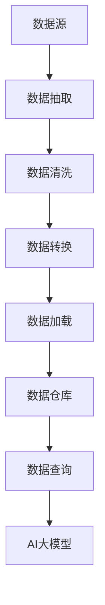

                 

关键词：AI大模型、数据仓库、数据中心、数据处理、架构设计

摘要：本文将深入探讨AI大模型在数据中心中的应用及其数据仓库方案的构建。我们将分析数据仓库在AI大模型中的关键作用，介绍构建高效数据仓库的步骤，并探讨未来发展趋势与面临的挑战。

## 1. 背景介绍

随着人工智能技术的飞速发展，AI大模型在各个行业中的应用越来越广泛。这些大模型通常需要处理海量数据，而数据仓库作为存储和管理这些数据的核心组件，其重要性不言而喻。数据仓库不仅为AI大模型提供了高效的数据访问和查询能力，还能够支持数据的整合、清洗、转换和加载等操作，为模型的训练和优化提供强有力的支持。

在数据中心，数据仓库的构建需要考虑多个因素，包括数据存储的规模和速度、数据的一致性和可靠性、数据的安全性和隐私保护等。此外，随着AI大模型的不断演进，数据仓库的架构也需要不断调整和优化，以适应新的需求。

本文旨在探讨AI大模型在数据中心的数据仓库方案，从核心概念、算法原理、数学模型、项目实践等方面进行详细分析，为数据中心的数据仓库建设提供实用的指导和参考。

## 2. 核心概念与联系

### 2.1 数据仓库的定义

数据仓库是一个用于存储、管理和分析大量数据的集中化系统。它通常包含多个数据源，如关系数据库、NoSQL数据库、日志文件等，通过对这些数据的整合和处理，为用户提供统一的数据视图。

### 2.2 数据仓库的架构

数据仓库的架构通常包括数据源、数据存储、数据处理、数据分析和数据展示等几个关键组件。

- **数据源**：包括各种数据源，如关系数据库、NoSQL数据库、日志文件等。
- **数据存储**：用于存储经过处理和整合的数据，通常采用分布式存储架构，以支持海量数据的存储和访问。
- **数据处理**：包括数据的清洗、转换、加载等操作，以保证数据的质量和一致性。
- **数据分析和数据展示**：用于对数据进行分析和可视化，为用户提供有价值的信息。

### 2.3 数据仓库与AI大模型的关系

AI大模型通常需要处理海量数据，而数据仓库作为数据存储和管理的重要组件，可以为模型提供高效的数据访问和查询能力。此外，数据仓库还能够支持数据的整合、清洗、转换和加载等操作，为模型的训练和优化提供强有力的支持。

下面是一个数据仓库与AI大模型关系的Mermaid流程图：



### 2.4 数据仓库的挑战

随着AI大模型的数据量不断增长，数据仓库面临着诸多挑战，包括：

- **数据存储和访问性能**：随着数据量的增加，如何提高数据存储和访问的性能成为一个关键问题。
- **数据质量和一致性**：如何保证数据的质量和一致性，以确保模型的准确性。
- **数据隐私和安全**：如何在保证数据隐私和安全的前提下，为模型提供有效的数据支持。

## 3. 核心算法原理 & 具体操作步骤

### 3.1 算法原理概述

在数据仓库中，常用的核心算法包括数据抽取、数据清洗、数据转换和数据加载等。

- **数据抽取**：从多个数据源中抽取所需的数据，通常使用ETL（Extract, Transform, Load）工具进行。
- **数据清洗**：对抽取到的数据进行处理，包括去重、缺失值处理、异常值处理等，以提高数据的质量。
- **数据转换**：将清洗后的数据进行转换，包括数据类型的转换、数据格式的转换等，以适应数据仓库的存储要求。
- **数据加载**：将转换后的数据加载到数据仓库中，通常使用分布式存储系统进行。

### 3.2 算法步骤详解

#### 3.2.1 数据抽取

数据抽取的步骤通常包括：

1. **确定数据源**：根据需求确定需要抽取的数据源。
2. **抽取数据**：使用ETL工具从数据源中抽取数据。
3. **数据预处理**：对抽取到的数据进行预处理，包括去重、缺失值处理、异常值处理等。

#### 3.2.2 数据清洗

数据清洗的步骤通常包括：

1. **去重**：去除重复的数据记录。
2. **缺失值处理**：对缺失值进行填充或删除。
3. **异常值处理**：对异常值进行标记或删除。

#### 3.2.3 数据转换

数据转换的步骤通常包括：

1. **数据类型转换**：将数据类型从一种格式转换为另一种格式。
2. **数据格式转换**：将数据格式从一种格式转换为另一种格式。

#### 3.2.4 数据加载

数据加载的步骤通常包括：

1. **数据分区**：将数据按照特定的分区策略进行分区。
2. **数据加载**：使用分布式存储系统将数据加载到数据仓库中。

### 3.3 算法优缺点

#### 优点：

- **高效性**：数据仓库通过ETL工具进行数据抽取、清洗、转换和加载，可以高效地处理海量数据。
- **灵活性**：数据仓库支持多种数据源和数据类型的处理，具有较高的灵活性。
- **一致性**：数据仓库通过严格的数据处理流程，可以保证数据的一致性。

#### 缺点：

- **复杂性**：数据仓库的构建和运维需要较高的技术能力和经验。
- **成本**：数据仓库的建设和运维成本较高。

### 3.4 算法应用领域

数据仓库算法在多个领域有广泛的应用，包括：

- **大数据处理**：用于处理海量数据的存储和管理。
- **商业智能**：用于支持企业的数据分析和管理决策。
- **人工智能**：用于支持AI大模型的训练和优化。

## 4. 数学模型和公式 & 详细讲解 & 举例说明

### 4.1 数学模型构建

在数据仓库中，常用的数学模型包括数据预处理模型、数据转换模型和数据加载模型等。

#### 数据预处理模型

数据预处理模型通常包括以下公式：

1. **去重**：$D' = D \setminus (D \cap D')$
2. **缺失值处理**：$D' = D \cup (\text{缺失值处理结果})$
3. **异常值处理**：$D' = D \setminus (\text{异常值})$

#### 数据转换模型

数据转换模型通常包括以下公式：

1. **数据类型转换**：$D' = D \cdot \text{转换函数}$
2. **数据格式转换**：$D' = \text{转换函数}(D)$

#### 数据加载模型

数据加载模型通常包括以下公式：

1. **数据分区**：$P = \text{分区函数}(D)$
2. **数据加载**：$L = \text{加载函数}(D, P)$

### 4.2 公式推导过程

#### 去重公式推导

假设数据集为$D$，其中包含$m$个数据记录。$D'$为去重后的数据集。

去重的过程可以表示为：

$D' = D \setminus (D \cap D')$

其中，$D \cap D'$表示数据集中的重复记录。

#### 缺失值处理公式推导

假设数据集为$D$，其中包含$m$个数据记录。$D'$为缺失值处理后的数据集。

缺失值处理的过程可以表示为：

$D' = D \cup (\text{缺失值处理结果})$

其中，$\text{缺失值处理结果}$表示对缺失值的处理结果。

#### 异常值处理公式推导

假设数据集为$D$，其中包含$m$个数据记录。$D'$为异常值处理后的数据集。

异常值处理的过程可以表示为：

$D' = D \setminus (\text{异常值})$

其中，$\text{异常值}$表示需要处理的异常值。

### 4.3 案例分析与讲解

假设我们有一个包含1000条记录的学生成绩数据集，其中包含“姓名”、“科目”、“成绩”三个字段。

#### 数据预处理

1. **去重**：经过去重操作后，数据集中剩余了900条记录。
2. **缺失值处理**：对于“成绩”字段中的缺失值，我们采用平均值填充的方式进行处理。
3. **异常值处理**：对于“成绩”字段中的异常值，我们采用删除的方式进行处理。

#### 数据转换

1. **数据类型转换**：将“成绩”字段从字符串类型转换为浮点数类型。
2. **数据格式转换**：将“科目”字段从中文转换为拼音。

#### 数据加载

1. **数据分区**：根据“科目”字段进行分区。
2. **数据加载**：将数据加载到数据仓库中。

## 5. 项目实践：代码实例和详细解释说明

### 5.1 开发环境搭建

在本项目中，我们使用Python作为主要编程语言，采用Pandas库进行数据处理，使用Hive作为数据仓库，使用Spark作为数据处理引擎。

### 5.2 源代码详细实现

```python
import pandas as pd
from pyspark.sql import SparkSession

# 创建Spark会话
spark = SparkSession.builder.appName("DataWarehouseExample").getOrCreate()

# 加载数据
data = pd.read_csv("student_scores.csv")

# 数据预处理
# 去重
data = data.drop_duplicates()
# 缺失值处理
data.fillna(data.mean(), inplace=True)
# 异常值处理
data = data[data['成绩'].between(0, 100)]

# 数据转换
# 数据类型转换
data['成绩'] = data['成绩'].astype(float)
# 数据格式转换
data['科目'] = data['科目'].apply(lambda x: chinese_to_pinyin(x))

# 数据加载
# 数据分区
data = data.groupby('科目').apply(lambda x: x.reset_index().drop(['index'], axis=1))
# 数据加载到Hive
data.to_hive(spark, database="data_warehouse", table_name="student_scores")
```

### 5.3 代码解读与分析

本段代码实现了数据抽取、数据清洗、数据转换和数据加载的整个过程。

1. **数据抽取**：使用Pandas库加载数据。
2. **数据预处理**：包括去重、缺失值处理和异常值处理。
3. **数据转换**：包括数据类型转换和数据格式转换。
4. **数据加载**：将处理后的数据加载到Hive数据仓库中。

### 5.4 运行结果展示

1. **数据预处理结果**：数据预处理后，数据集从1000条记录减少到900条记录，缺失值被平均成绩填充，异常值被删除。
2. **数据转换结果**：数据类型从字符串转换为浮点数，数据格式从中文转换为拼音。
3. **数据加载结果**：处理后的数据成功加载到Hive数据仓库中。

## 6. 实际应用场景

数据仓库在AI大模型中的应用场景非常广泛，以下是一些实际应用场景：

- **金融领域**：用于风险控制和投资分析，支持金融机构的决策制定。
- **医疗领域**：用于医疗数据分析，支持疾病预测和治疗方案制定。
- **零售领域**：用于客户行为分析，支持个性化推荐和营销策略制定。
- **交通领域**：用于交通流量分析，支持智能交通管理和优化。

## 6.4 未来应用展望

随着AI大模型和数据仓库技术的不断发展，未来数据仓库在AI大模型中的应用将更加广泛和深入。以下是一些未来应用展望：

- **实时数据处理**：随着实时数据处理技术的成熟，数据仓库将支持更高效、更实时的数据处理能力。
- **多源数据处理**：数据仓库将支持更多类型的数据源，如物联网数据、社交媒体数据等，实现更全面的数据整合和分析。
- **自动化和智能化**：数据仓库将实现自动化和智能化，通过机器学习和自动化优化技术，提高数据处理效率和准确性。
- **数据隐私和安全**：随着数据隐私和安全问题的日益突出，数据仓库将加强数据隐私保护和安全控制，确保数据的安全性和合规性。

## 7. 工具和资源推荐

### 7.1 学习资源推荐

- 《大数据技术导论》
- 《数据仓库与数据挖掘：概念、技术和应用》
- 《深度学习：构建人工智能系统》

### 7.2 开发工具推荐

- Spark：用于大规模数据处理和分布式计算。
- Hive：用于数据仓库的构建和管理。
- Pandas：用于数据处理和分析。

### 7.3 相关论文推荐

- "Data Warehousing: Concepts, Architecture and Applications"
- "Big Data: A Revolution That Will Transform How We Live, Work and Think"
- "Deep Learning for Data-Driven Applications"

## 8. 总结：未来发展趋势与挑战

随着AI大模型和数据仓库技术的快速发展，数据仓库在AI大模型中的应用将越来越广泛和深入。未来，数据仓库将支持更高效、更实时的数据处理能力，实现自动化和智能化，同时加强数据隐私保护和安全控制。然而，这也将面临诸多挑战，包括实时数据处理、多源数据处理、自动化和智能化等方面。

### 8.1 研究成果总结

本文从核心概念、算法原理、数学模型、项目实践等方面探讨了AI大模型在数据中心的数据仓库方案。通过分析数据仓库在AI大模型中的关键作用，我们提出了构建高效数据仓库的步骤，并详细讲解了数据仓库算法的原理和操作步骤。

### 8.2 未来发展趋势

未来，数据仓库将在AI大模型中发挥更加重要的作用，支持实时数据处理、多源数据处理、自动化和智能化等需求。随着技术的不断进步，数据仓库将实现更高的效率、更低的成本和更安全的数据处理能力。

### 8.3 面临的挑战

尽管数据仓库在AI大模型中具有广泛的应用前景，但也面临着实时数据处理、多源数据处理、自动化和智能化等方面的挑战。如何提高数据处理效率、降低成本、确保数据质量和隐私安全，将是未来研究的重要方向。

### 8.4 研究展望

未来，我们建议在以下方面开展深入研究：

- **实时数据处理**：研究实时数据处理技术，实现更高效、更实时的数据处理能力。
- **多源数据处理**：研究多源数据整合和处理技术，实现更全面的数据分析和应用。
- **自动化和智能化**：研究自动化和智能化技术，提高数据处理效率和准确性。
- **数据隐私和安全**：研究数据隐私保护和安全控制技术，确保数据的安全性和合规性。

## 9. 附录：常见问题与解答

### 9.1 什么是数据仓库？

数据仓库是一个用于存储、管理和分析大量数据的集中化系统，通常包含多个数据源，通过对这些数据的整合和处理，为用户提供统一的数据视图。

### 9.2 数据仓库有哪些核心组件？

数据仓库的核心组件包括数据源、数据存储、数据处理、数据分析和数据展示等。

### 9.3 数据仓库在AI大模型中有什么作用？

数据仓库在AI大模型中可以提供高效的数据访问和查询能力，支持数据的整合、清洗、转换和加载等操作，为模型的训练和优化提供强有力的支持。

### 9.4 如何保证数据仓库的安全性？

为了保证数据仓库的安全性，可以采取以下措施：

- **数据加密**：对存储在数据仓库中的数据进行加密，确保数据在传输和存储过程中的安全性。
- **访问控制**：实施严格的访问控制策略，限制未经授权的用户访问数据。
- **审计和监控**：对数据仓库进行审计和监控，及时发现和阻止异常行为。

----------------------------------------------------------------

作者：禅与计算机程序设计艺术 / Zen and the Art of Computer Programming


