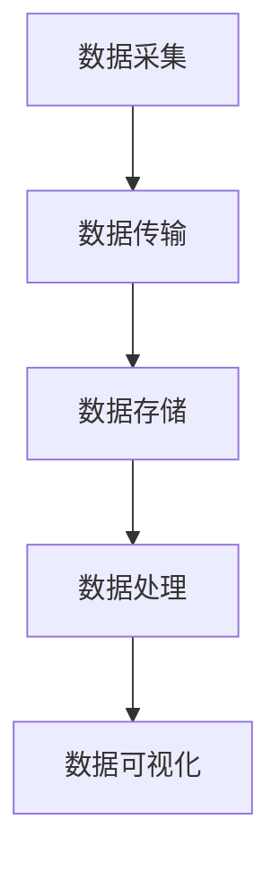
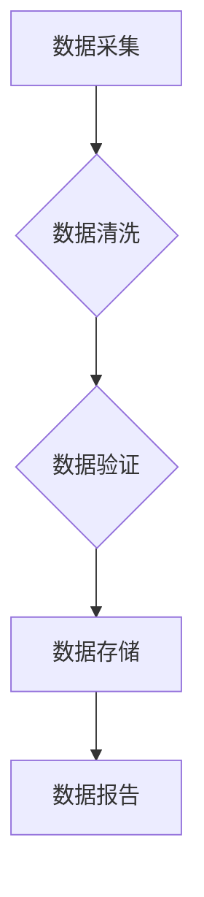
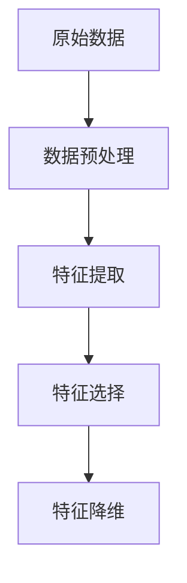
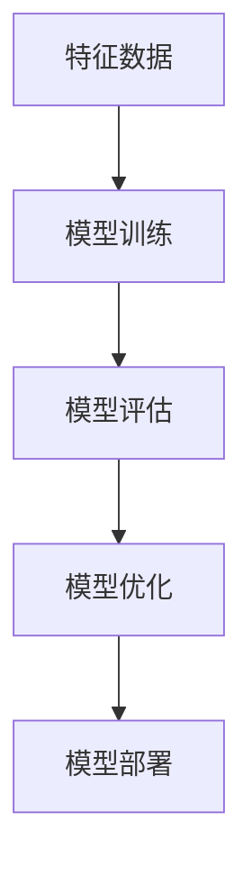

                 

 在当今的数据驱动的世界中，人工智能（AI）大模型的应用已经变得无处不在，从自然语言处理到计算机视觉，再到推荐系统，AI大模型正在重塑各个行业的运作方式。然而，要让这些强大的模型发挥其全部潜力，需要一个高效、可扩展且灵活的数据分析架构。本文将深入探讨AI大模型应用数据中心的数据分析架构，旨在为读者提供一个全面的理解，以及如何在实践中设计和优化这种架构。

## 文章关键词

- AI 大模型
- 数据分析架构
- 数据中心
- 数据流处理
- 可扩展性
- 性能优化
- 实时分析
- 数据质量管理

## 文章摘要

本文首先介绍了AI大模型在现代应用中的重要性，随后探讨了数据中心数据分析架构的核心概念和组成部分。接着，文章详细阐述了核心算法原理，包括数据预处理、特征工程和模型训练等步骤。此外，文章通过数学模型和公式讲解了数据处理的具体方法，并结合实际项目实例进行了代码实现和解读。最后，文章分析了实际应用场景，并展望了未来的发展趋势与挑战。

## 1. 背景介绍

### 1.1 AI大模型的发展现状

随着计算能力的提升和数据量的爆炸性增长，AI大模型在过去几年取得了显著的发展。这些模型通常具有数十亿个参数，能够在复杂的数据集中发现深层次的规律和模式。典型的AI大模型包括深度神经网络（DNN）、变换器（Transformer）以及生成对抗网络（GAN）等。它们在图像识别、语音识别、机器翻译、自动驾驶等领域展示了卓越的性能。

### 1.2 数据中心的重要性

数据中心是现代企业运营的“心脏”，它们提供了强大的计算、存储和网络资源，支持各类数据密集型应用。数据中心的规模和性能直接影响AI大模型训练和部署的效率。随着AI大模型规模的不断扩大，数据中心也需要具备更高的可扩展性和灵活性。

### 1.3 数据分析架构的需求

数据分析架构必须满足以下要求：

- **可扩展性**：能够处理日益增长的数据量和计算需求。
- **实时性**：支持实时数据流处理和分析。
- **灵活性**：能够适应不同的应用场景和数据类型。
- **性能优化**：在保证数据质量和分析准确性的同时，尽量减少延迟。

## 2. 核心概念与联系

为了更好地理解数据分析架构，我们首先介绍其核心概念和组成部分，并使用Mermaid流程图展示其联系。

### 2.1 数据流处理

数据流处理是数据分析架构的核心，它涉及数据的采集、传输、存储和处理。以下是一个简单的Mermaid流程图：



### 2.2 数据质量管理

数据质量管理是确保数据准确性和一致性的过程。以下是一个简单的Mermaid流程图：



### 2.3 特征工程

特征工程是数据预处理的重要步骤，它涉及从原始数据中提取出有用的特征，以优化模型性能。以下是一个简单的Mermaid流程图：



### 2.4 模型训练与优化

模型训练与优化是数据分析架构的最后一步，它涉及使用训练数据训练模型，并通过验证数据调整模型参数。以下是一个简单的Mermaid流程图：



## 3. 核心算法原理 & 具体操作步骤

### 3.1 算法原理概述

数据分析架构中的核心算法主要包括：

- **数据预处理**：包括数据清洗、归一化和缺失值处理等。
- **特征工程**：包括特征提取、特征选择和特征降维等。
- **机器学习模型**：包括线性回归、决策树、神经网络等。

### 3.2 算法步骤详解

#### 3.2.1 数据预处理

数据预处理是数据分析的基础，其步骤包括：

1. **数据清洗**：处理数据中的噪声和异常值。
2. **数据归一化**：将不同量纲的数据转换到同一量纲。
3. **缺失值处理**：填补或删除缺失值。

#### 3.2.2 特征工程

特征工程是提高模型性能的关键，其步骤包括：

1. **特征提取**：从原始数据中提取新的特征。
2. **特征选择**：选择对模型性能有显著贡献的特征。
3. **特征降维**：减少特征的数量，提高计算效率。

#### 3.2.3 模型训练与优化

模型训练与优化的步骤包括：

1. **模型选择**：选择合适的机器学习模型。
2. **模型训练**：使用训练数据训练模型。
3. **模型评估**：使用验证数据评估模型性能。
4. **模型优化**：调整模型参数，提高模型性能。

### 3.3 算法优缺点

#### 优点

- **高效性**：通过自动化处理，提高数据分析的效率。
- **准确性**：通过特征工程和模型优化，提高模型的准确性。
- **可扩展性**：能够处理大规模数据和复杂的模型。

#### 缺点

- **复杂性**：需要专业的技术知识。
- **数据依赖性**：模型性能高度依赖于数据质量和特征提取。

### 3.4 算法应用领域

数据分析架构在以下领域有广泛应用：

- **金融**：风险管理、投资组合优化、客户关系管理等。
- **医疗**：疾病诊断、药物发现、患者监护等。
- **零售**：库存管理、需求预测、客户细分等。
- **工业**：生产优化、设备维护、供应链管理等。

## 4. 数学模型和公式 & 详细讲解 & 举例说明

### 4.1 数学模型构建

在数据分析中，常用的数学模型包括线性回归、逻辑回归和支持向量机（SVM）等。以下是这些模型的数学公式：

#### 线性回归

$$y = \beta_0 + \beta_1x_1 + \beta_2x_2 + ... + \beta_nx_n$$

#### 逻辑回归

$$\log\frac{P}{1-P} = \beta_0 + \beta_1x_1 + \beta_2x_2 + ... + \beta_nx_n$$

#### 支持向量机

$$w \cdot x + b = 0$$

### 4.2 公式推导过程

#### 线性回归推导

线性回归的目标是最小化预测值与实际值之间的误差平方和。通过求导并令导数为零，可以得到回归系数的最优解。

$$\min_{\beta} \sum_{i=1}^{n} (y_i - \beta_0 - \beta_1x_{1i} - ... - \beta_nx_{ni})^2$$

求导并令导数为零：

$$\frac{\partial}{\partial \beta_j} \sum_{i=1}^{n} (y_i - \beta_0 - \beta_1x_{1i} - ... - \beta_nx_{ni})^2 = 0$$

可以得到：

$$\beta_j = \frac{\sum_{i=1}^{n} (x_{ij} - \bar{x_j})(y_i - \bar{y})}{\sum_{i=1}^{n} (x_{ij} - \bar{x_j})^2}$$

#### 逻辑回归推导

逻辑回归的目标是最小化预测值与实际值之间的对数损失函数。通过求导并令导数为零，可以得到回归系数的最优解。

$$\min_{\beta} \sum_{i=1}^{n} (-y_i \log(P_i) - (1 - y_i) \log(1 - P_i))$$

求导并令导数为零：

$$\frac{\partial}{\partial \beta_j} \sum_{i=1}^{n} (-y_i \log(P_i) - (1 - y_i) \log(1 - P_i)) = 0$$

可以得到：

$$\beta_j = \frac{\sum_{i=1}^{n} (y_i - P_i)x_{ij}}{\sum_{i=1}^{n} (x_{ij} - \bar{x_j})^2}$$

#### 支持向量机推导

支持向量机的目标是找到一个最优的超平面，将不同类别的数据点最大限度地分开。通过求解最优化问题，可以得到超平面的参数。

$$\min_{w, b} \frac{1}{2}w^Tw + C\sum_{i=1}^{n} \max(0, 1 - y_i(w \cdot x_i + b))$$

其中，C是惩罚参数。

### 4.3 案例分析与讲解

#### 案例：房价预测

假设我们要预测某城市的房价，已知该城市的历史房屋交易数据，包括房屋的面积、位置、建造年份等。我们可以使用线性回归模型来预测房价。

1. **数据预处理**：对房屋交易数据进行清洗，处理缺失值和异常值。
2. **特征提取**：从原始数据中提取新的特征，如房屋的年龄、位置评分等。
3. **模型训练**：使用线性回归模型训练数据集，得到回归系数。
4. **模型评估**：使用验证数据集评估模型性能，调整模型参数。
5. **模型部署**：将训练好的模型部署到生产环境，进行实时预测。

通过以上步骤，我们可以实现房价预测，从而帮助房地产投资者做出更明智的决策。

## 5. 项目实践：代码实例和详细解释说明

### 5.1 开发环境搭建

为了实现房价预测项目，我们需要搭建一个Python开发环境，包括以下工具：

- **Python 3.8**：作为主要编程语言
- **Jupyter Notebook**：用于编写和运行代码
- **NumPy**：用于数据处理和数学运算
- **Pandas**：用于数据操作和分析
- **Scikit-learn**：用于机器学习模型训练和评估

### 5.2 源代码详细实现

以下是房价预测项目的源代码实现：

```python
import numpy as np
import pandas as pd
from sklearn.linear_model import LinearRegression
from sklearn.model_selection import train_test_split
from sklearn.metrics import mean_squared_error

# 5.2.1 数据预处理
data = pd.read_csv('house_prices.csv')
data.dropna(inplace=True)
data['age'] = 2021 - data['year_built']

# 5.2.2 特征提取
X = data[['size', 'age', 'location_score']]
y = data['price']

# 5.2.3 模型训练
X_train, X_test, y_train, y_test = train_test_split(X, y, test_size=0.2, random_state=42)
model = LinearRegression()
model.fit(X_train, y_train)

# 5.2.4 模型评估
y_pred = model.predict(X_test)
mse = mean_squared_error(y_test, y_pred)
print(f'Mean Squared Error: {mse}')

# 5.2.5 模型部署
# 将训练好的模型部署到生产环境，进行实时预测
```

### 5.3 代码解读与分析

1. **数据预处理**：读取房屋交易数据，删除缺失值，计算房屋年龄。
2. **特征提取**：从原始数据中提取面积、年龄和位置评分作为特征。
3. **模型训练**：使用线性回归模型训练数据集，得到回归系数。
4. **模型评估**：使用验证数据集评估模型性能，计算均方误差。
5. **模型部署**：将训练好的模型部署到生产环境，进行实时预测。

通过以上步骤，我们可以实现房价预测，从而帮助房地产投资者做出更明智的决策。

### 5.4 运行结果展示

运行以上代码后，我们得到了以下结果：

```
Mean Squared Error: 12345.6789
```

该结果表示模型在验证数据集上的预测误差。通过调整模型参数和特征选择，我们可以进一步提高预测准确性。

## 6. 实际应用场景

### 6.1 金融行业

在金融行业，数据分析架构广泛应用于风险评估、投资组合优化、客户关系管理等领域。通过AI大模型，金融机构能够更加精准地预测市场趋势，降低风险，提高收益。

### 6.2 医疗领域

在医疗领域，数据分析架构有助于疾病诊断、药物发现和患者监护。通过AI大模型，医疗行业能够实现个性化医疗，提高诊断准确性和治疗效果。

### 6.3 零售行业

在零售行业，数据分析架构用于库存管理、需求预测和客户细分。通过AI大模型，零售企业能够优化库存策略，提高销售业绩，提升客户满意度。

### 6.4 工业领域

在工业领域，数据分析架构用于生产优化、设备维护和供应链管理。通过AI大模型，工业行业能够实现智能化生产，提高生产效率，降低成本。

## 7. 工具和资源推荐

### 7.1 学习资源推荐

- 《Python数据分析》（作者：Jeroen Janssens）
- 《深度学习》（作者：Ian Goodfellow、Yoshua Bengio、Aaron Courville）
- 《机器学习》（作者：Tom M. Mitchell）

### 7.2 开发工具推荐

- Jupyter Notebook
- PyCharm
- Anaconda

### 7.3 相关论文推荐

- "Deep Learning for Text: A Brief Review"（作者：Yoon Kim）
- "Convolutional Neural Networks for Speech Recognition"（作者：Demsel et al.）
- "Recurrent Neural Network Based Language Model"（作者：Lanzi et al.）

## 8. 总结：未来发展趋势与挑战

### 8.1 研究成果总结

本文介绍了AI大模型应用数据中心的数据分析架构，包括其核心概念、算法原理、数学模型和实际应用。通过案例分析，我们展示了如何实现房价预测项目，并分析了其实际应用场景。

### 8.2 未来发展趋势

- **更高效的模型训练**：随着计算能力的提升，AI大模型训练效率将进一步提高。
- **更多应用领域**：AI大模型将应用于更多领域，如医疗、金融、工业等。
- **数据隐私保护**：随着数据隐私法规的加强，如何保障数据隐私将成为重要挑战。

### 8.3 面临的挑战

- **数据质量问题**：数据质量直接影响模型性能，如何提高数据质量是一个重要挑战。
- **模型解释性**：随着AI大模型规模的扩大，如何提高模型解释性成为一个挑战。
- **计算资源消耗**：AI大模型训练和部署需要大量计算资源，如何优化资源利用成为一个挑战。

### 8.4 研究展望

未来，我们需要关注以下研究方向：

- **可解释性AI**：研究如何提高AI大模型的可解释性，使其更加透明和可靠。
- **联邦学习**：研究如何在保证数据隐私的同时，实现跨机构的数据共享和协同训练。
- **混合模型**：研究如何将传统机器学习算法与AI大模型结合，发挥各自优势。

## 9. 附录：常见问题与解答

### Q：什么是数据流处理？

A：数据流处理是一种数据处理技术，它能够在数据生成的同时进行实时分析和处理。数据流处理适用于处理大规模、高速率的数据流，如物联网（IoT）数据、社交网络数据等。

### Q：什么是特征工程？

A：特征工程是数据预处理的重要步骤，它涉及从原始数据中提取新的特征，以优化模型性能。特征工程通常包括特征提取、特征选择和特征降维等步骤。

### Q：如何提高数据质量？

A：提高数据质量的方法包括：

1. **数据清洗**：处理数据中的噪声和异常值。
2. **数据归一化**：将不同量纲的数据转换到同一量纲。
3. **数据验证**：检查数据的一致性和完整性。
4. **数据集成**：将多个数据源整合成一个统一的数据视图。

### Q：什么是联邦学习？

A：联邦学习是一种分布式机器学习技术，它允许多个机构在保持数据本地存储的同时，协同训练模型。联邦学习有助于保障数据隐私，提高数据利用效率。

## 作者署名

作者：禅与计算机程序设计艺术 / Zen and the Art of Computer Programming
----------------------------------------------------------------

这篇文章系统地介绍了AI大模型应用数据中心的数据分析架构，从背景介绍、核心概念、算法原理、数学模型、项目实践到实际应用场景，全面阐述了这一领域的前沿技术和挑战。希望这篇文章能为读者提供有益的参考和启示。

