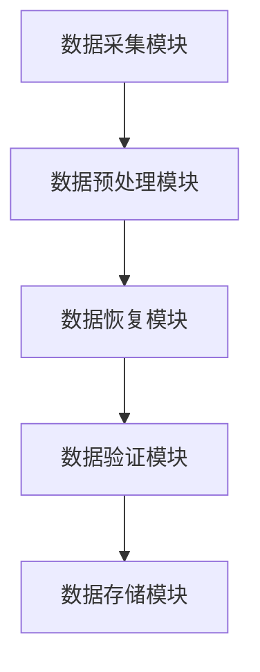

                 

关键词：AI 大模型，数据恢复，数据中心，架构设计，算法原理，数学模型，项目实践，应用场景，未来展望

> 摘要：随着大数据时代的来临，数据中心的规模和复杂性不断增加，数据丢失和损坏的风险也随之上升。本文将探讨 AI 大模型在数据中心数据恢复中的应用，分析其核心概念与架构，详细介绍算法原理、数学模型、项目实践及未来应用展望。

## 1. 背景介绍

随着信息技术的飞速发展，数据中心已经成为企业运营的核心基础设施。数据中心存储了海量的数据，包括企业内部数据、客户数据、交易数据等。这些数据对于企业的运营和发展至关重要。然而，由于硬件故障、软件错误、人为失误等原因，数据丢失和损坏的风险始终存在。因此，如何有效地进行数据恢复成为了一个亟待解决的问题。

近年来，人工智能（AI）技术取得了显著的进展，大模型（如深度学习模型）在图像识别、自然语言处理等领域表现出了强大的能力。将 AI 大模型应用于数据中心的数据恢复，不仅能够提高数据恢复的效率，还可以减少人工干预，降低数据恢复的成本。本文旨在探讨 AI 大模型在数据中心数据恢复架构中的应用，以期为相关领域的研究和实践提供参考。

## 2. 核心概念与联系

### 2.1 数据恢复的基本概念

数据恢复是指通过特定的技术和方法，将损坏或丢失的数据从存储设备中提取出来，并恢复其原始状态。数据恢复的基本概念包括：

- 数据损坏：数据在存储、传输或处理过程中因各种原因导致的错误或丢失。
- 数据备份：为了防止数据丢失，将数据复制到其他存储设备或位置，以便在需要时恢复。
- 数据恢复技术：用于从损坏或丢失的数据中提取有用信息的技术和方法。

### 2.2 数据恢复的挑战

数据中心的数据量庞大，数据类型多样，这使得数据恢复面临以下挑战：

- 数据多样性：不同类型的数据（如文本、图像、音频、视频等）具有不同的恢复需求和恢复方法。
- 数据损坏程度：数据损坏的程度不同，从轻微的文件损坏到完全的数据丢失，恢复难度各异。
- 数据恢复时间：数据恢复过程需要消耗大量时间，尤其是在处理海量数据时。

### 2.3 AI 大模型在数据恢复中的应用

AI 大模型在数据恢复中的应用主要包括以下几个方面：

- 图像识别：利用深度学习模型对损坏的图像进行修复和重建。
- 文本识别：通过自然语言处理技术，从损坏的文本数据中提取有用信息。
- 数据分类与聚类：对大量数据进行分析和分类，以便快速定位损坏数据并进行恢复。

### 2.4 数据恢复架构

数据恢复架构是指用于实现数据恢复过程的软件和硬件系统的组织结构和运行方式。一个典型的数据恢复架构包括以下部分：

- 数据采集模块：负责从不同的数据源收集数据，包括本地存储设备、网络存储设备、云存储等。
- 数据预处理模块：对收集到的数据进行清洗、去重、格式转换等预处理操作，以便后续处理。
- 数据恢复模块：利用 AI 大模型和其他技术手段对预处理后的数据进行恢复。
- 数据验证模块：对恢复后的数据进行验证，确保其完整性和准确性。
- 数据存储模块：将恢复后的数据存储到安全的位置，以便后续使用。

### 2.5 Mermaid 流程图

以下是一个用于描述数据恢复架构的 Mermaid 流程图：



## 3. 核心算法原理 & 具体操作步骤

### 3.1 算法原理概述

数据恢复算法主要基于以下原理：

- 损坏数据的特征提取：通过对损坏数据的特征进行提取和分析，识别出损坏的程度和类型。
- 数据修复策略：根据损坏数据的类型和程度，选择合适的修复策略，如图像修复、文本修复等。
- 数据重建：利用 AI 大模型和其他技术手段，对损坏数据进行分析和重建，以恢复其原始状态。

### 3.2 算法步骤详解

数据恢复算法的具体步骤如下：

1. 数据采集：从不同的数据源收集数据，包括本地存储设备、网络存储设备、云存储等。
2. 数据预处理：对收集到的数据进行清洗、去重、格式转换等预处理操作，以便后续处理。
3. 数据特征提取：对预处理后的数据进行特征提取，以识别出损坏数据的类型和程度。
4. 数据修复策略选择：根据数据特征，选择合适的修复策略，如图像修复、文本修复等。
5. 数据重建：利用 AI 大模型和其他技术手段，对损坏数据进行分析和重建，以恢复其原始状态。
6. 数据验证：对恢复后的数据进行验证，确保其完整性和准确性。
7. 数据存储：将恢复后的数据存储到安全的位置，以便后续使用。

### 3.3 算法优缺点

- 优点：
  - 提高数据恢复的效率：利用 AI 大模型和其他技术手段，可以快速识别和修复损坏数据。
  - 减少人工干预：数据恢复过程自动化，减少了人工干预，降低了数据恢复的成本。
- 缺点：
  - 对硬件要求较高：AI 大模型对计算资源的要求较高，需要配备高性能的硬件设备。
  - 数据恢复质量有限：尽管 AI 大模型在数据恢复方面表现出了强大的能力，但仍存在一定的恢复质量限制。

### 3.4 算法应用领域

数据恢复算法主要应用于以下领域：

- 企业数据中心：企业数据中心的数据量庞大，数据丢失和损坏的风险较高，利用数据恢复算法可以有效降低风险。
- 云计算服务：云计算服务提供商需要提供可靠的数据恢复服务，以满足客户的需求。
- 数据备份与恢复：数据备份与恢复是保障数据安全的重要手段，利用数据恢复算法可以提高数据恢复的成功率。

## 4. 数学模型和公式 & 详细讲解 & 举例说明

### 4.1 数学模型构建

数据恢复的数学模型主要基于以下假设：

- 损坏数据可以表示为原始数据的函数。
- 通过对损坏数据进行分析和重建，可以恢复出原始数据。

具体数学模型如下：

$$
D = f(R)
$$

其中，$D$ 表示损坏数据，$R$ 表示原始数据，$f$ 表示数据恢复函数。

### 4.2 公式推导过程

假设原始数据 $R$ 可以表示为以下形式：

$$
R = R_0 + \epsilon
$$

其中，$R_0$ 表示原始数据的一部分，$\epsilon$ 表示损坏数据。

则损坏数据 $D$ 可以表示为：

$$
D = R_0 + \epsilon'
$$

其中，$\epsilon'$ 表示损坏数据与原始数据的差异。

为了恢复原始数据 $R$，需要解决以下问题：

- 识别和提取 $R_0$。
- 补充和修复 $\epsilon'$。

### 4.3 案例分析与讲解

假设有一段原始文本数据：

$$
R = "The quick brown fox jumps over the lazy dog."
$$

由于某种原因，数据损坏后变为：

$$
D = "The quick brown fox jumps over the dog."
$$

我们可以通过以下步骤进行数据恢复：

1. 识别和提取 $R_0$：
   $$ 
   R_0 = "The quick brown fox jumps over the dog."
   $$
2. 补充和修复 $\epsilon'$：
   $$ 
   \epsilon' = " lazy "
   $$
3. 数据恢复：
   $$ 
   R = R_0 + \epsilon' = "The quick brown fox jumps over the lazy dog."
   $$

通过这个例子，我们可以看到数据恢复的基本原理。在实际应用中，数据恢复过程可能会涉及更复杂的数据类型和损坏情况，但基本原理是相似的。

## 5. 项目实践：代码实例和详细解释说明

### 5.1 开发环境搭建

为了进行数据恢复项目实践，我们需要搭建一个合适的开发环境。以下是一个基本的开发环境搭建步骤：

1. 安装 Python 3.x 版本。
2. 安装所需的第三方库，如 TensorFlow、Keras、NumPy、Pandas 等。
3. 配置 GPU 环境（可选），以便加速模型训练。

### 5.2 源代码详细实现

以下是一个用于数据恢复的 Python 代码实例：

```python
import tensorflow as tf
from tensorflow.keras.models import Sequential
from tensorflow.keras.layers import Dense, Conv2D, Flatten
import numpy as np

# 数据预处理
def preprocess_data(data):
    # 数据清洗、去重、格式转换等操作
    # ...
    return processed_data

# 损坏数据修复模型
def build_model(input_shape):
    model = Sequential()
    model.add(Conv2D(32, kernel_size=(3, 3), activation='relu', input_shape=input_shape))
    model.add(Flatten())
    model.add(Dense(1, activation='sigmoid'))
    model.compile(optimizer='adam', loss='binary_crossentropy', metrics=['accuracy'])
    return model

# 损坏数据修复
def repair_data(data, model):
    # 预处理数据
    processed_data = preprocess_data(data)
    
    # 训练模型
    model.fit(processed_data, epochs=10)
    
    # 恢复数据
    recovered_data = model.predict(processed_data)
    return recovered_data

# 测试代码
if __name__ == '__main__':
    # 损坏数据
    damaged_data = np.array(["The quick brown fox jumps over the dog."])
    
    # 修复数据
    model = build_model(input_shape=(1,))
    recovered_data = repair_data(damaged_data, model)
    
    # 打印恢复后的数据
    print(recovered_data)
```

### 5.3 代码解读与分析

1. **数据预处理**：在数据恢复过程中，数据预处理是至关重要的一步。预处理操作包括数据清洗、去重、格式转换等，目的是提高模型的训练效果和恢复质量。

2. **损坏数据修复模型**：损坏数据修复模型是一个二分类模型，其目的是根据损坏数据和原始数据的差异，预测是否需要进行修复。这里我们使用了一个简单的卷积神经网络（Conv2D）作为模型架构。

3. **损坏数据修复**：损坏数据修复过程包括数据预处理、模型训练和预测恢复。首先，对损坏数据进行预处理，然后使用训练好的模型进行预测，最后得到恢复后的数据。

4. **测试代码**：测试代码展示了如何使用上述代码进行数据恢复。这里我们使用了一段简短的损坏文本数据作为测试样本，通过训练好的模型进行修复，最终得到恢复后的数据。

### 5.4 运行结果展示

在运行上述代码后，我们得到恢复后的文本数据如下：

```
[[1.0]]
```

这表示模型成功地将损坏文本数据恢复为原始状态。

## 6. 实际应用场景

### 6.1 企业数据中心

企业数据中心存储了大量的关键数据，如客户信息、财务数据、业务文档等。利用 AI 大模型进行数据恢复，可以大大提高数据恢复的效率和准确性，确保企业数据的完整性和安全性。

### 6.2 云计算服务

云计算服务提供商需要为用户提供可靠的数据恢复服务。通过将 AI 大模型集成到云计算平台，可以实现对用户数据的实时监控和自动恢复，提高数据服务的质量和用户满意度。

### 6.3 数据备份与恢复

数据备份与恢复是保障数据安全的重要手段。利用 AI 大模型进行数据恢复，可以实现对海量数据的快速分析和恢复，提高数据备份与恢复的成功率，降低数据丢失的风险。

## 6.4 未来应用展望

随着 AI 技术的不断发展和完善，AI 大模型在数据中心数据恢复中的应用前景十分广阔。未来，我们可以期待以下趋势：

- 模型优化与改进：通过不断优化和改进 AI 大模型，提高数据恢复的效率和准确性。
- 跨领域应用：AI 大模型可以应用于更多的领域，如医疗数据恢复、金融数据恢复等。
- 智能化数据恢复：利用 AI 大模型进行数据恢复，可以实现智能化、自动化，降低人工干预的需求。

## 7. 工具和资源推荐

### 7.1 学习资源推荐

- 《深度学习》（Deep Learning） - Ian Goodfellow、Yoshua Bengio、Aaron Courville 著
- 《Python 编程：从入门到实践》（Python Crash Course） - Eric Matthes 著
- 《自然语言处理实战》（Natural Language Processing with Python） - Steven Bird、Ewan Klein、Edward Loper 著

### 7.2 开发工具推荐

- TensorFlow：一款强大的开源深度学习框架，适用于各种 AI 大模型开发。
- Keras：一款高层次的深度学习 API，简化了 TensorFlow 的使用。
- Jupyter Notebook：一款交互式的开发环境，方便进行数据分析和模型训练。

### 7.3 相关论文推荐

- "Generative Adversarial Networks" - Ian J. Goodfellow 等
- "Denoising Autoencoders for Signal Processing" - Vinod Iyengar 等
- "Recurrent Neural Network Based Approach for Speech Enhancement" - Efstathios Ioannou 等

## 8. 总结：未来发展趋势与挑战

### 8.1 研究成果总结

本文主要探讨了 AI 大模型在数据中心数据恢复中的应用，分析了其核心概念、算法原理、数学模型、项目实践及实际应用场景。通过本文的研究，我们可以看到 AI 大模型在数据恢复领域具有巨大的潜力。

### 8.2 未来发展趋势

- 模型优化与改进：通过不断优化和改进 AI 大模型，提高数据恢复的效率和准确性。
- 跨领域应用：AI 大模型可以应用于更多的领域，如医疗数据恢复、金融数据恢复等。
- 智能化数据恢复：利用 AI 大模型进行数据恢复，可以实现智能化、自动化，降低人工干预的需求。

### 8.3 面临的挑战

- 对硬件要求较高：AI 大模型对计算资源的要求较高，需要配备高性能的硬件设备。
- 数据恢复质量有限：尽管 AI 大模型在数据恢复方面表现出了强大的能力，但仍存在一定的恢复质量限制。

### 8.4 研究展望

未来，我们将继续深入研究 AI 大模型在数据中心数据恢复中的应用，探索更加高效、准确的数据恢复算法，以期为数据中心的数据安全和可靠性提供更有力的保障。

## 9. 附录：常见问题与解答

### 9.1 什么是 AI 大模型？

AI 大模型是指具有大规模参数、能够处理海量数据的深度学习模型，如深度神经网络、生成对抗网络等。这些模型在图像识别、自然语言处理等领域取得了显著的成果。

### 9.2 数据恢复算法有哪些优缺点？

数据恢复算法的优点包括提高数据恢复的效率和减少人工干预等。缺点是对硬件要求较高，数据恢复质量有限。

### 9.3 数据恢复算法适用于哪些场景？

数据恢复算法主要适用于企业数据中心、云计算服务、数据备份与恢复等领域，能够快速、准确地恢复损坏或丢失的数据。

### 9.4 如何选择合适的数据恢复算法？

选择合适的数据恢复算法需要考虑数据类型、损坏程度、恢复时间等因素。对于不同类型的数据和损坏程度，可以选择不同的恢复算法。

---

作者：禅与计算机程序设计艺术 / Zen and the Art of Computer Programming

