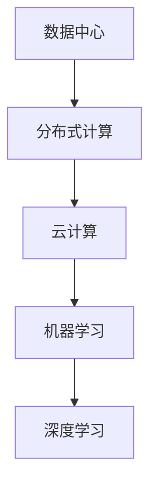

                 

关键词：人工智能、大模型、数据中心、架构设计、云计算、分布式计算、机器学习、深度学习

## 摘要

随着人工智能技术的快速发展，大模型的应用逐渐成为各大企业和研究机构关注的热点。本文将从背景介绍、核心概念与联系、核心算法原理、数学模型与公式、项目实践、实际应用场景、工具和资源推荐、总结与展望等多个方面，深入探讨AI大模型应用数据中心的架构设计。旨在为从业者提供有价值的参考，帮助他们在实际工作中更好地理解和应用这一技术。

## 1. 背景介绍

近年来，人工智能（AI）技术在各个领域取得了显著进展，特别是在图像识别、自然语言处理、语音识别等方面。这些进展的背后，离不开大规模模型的训练和部署。大模型，如GPT、BERT、ViT等，以其卓越的性能和强大的表现力，正在推动人工智能迈向一个新的高度。然而，大模型的训练和部署面临着诸多挑战，如数据存储、计算资源分配、模型优化等。

数据中心作为AI大模型训练和部署的核心基础设施，其架构设计至关重要。一个高效、可靠、可扩展的数据中心架构，不仅能提升大模型的训练效率，还能降低成本、提高资源利用率。因此，如何设计一个符合AI大模型需求的数据中心架构，成为当前研究的热点问题。

## 2. 核心概念与联系

### 2.1  数据中心

数据中心是指专门用于存放、处理和管理数据的建筑或设施。其核心功能包括数据存储、数据计算、数据传输等。在AI大模型应用中，数据中心作为大模型训练和部署的基础设施，承担着至关重要的角色。

### 2.2  分布式计算

分布式计算是指将计算任务分布在多个计算节点上，通过协同工作来完成计算任务。在AI大模型应用中，分布式计算能够有效提升训练效率和资源利用率。

### 2.3  云计算

云计算是指通过互联网提供动态易扩展且经常是虚拟化的资源。在AI大模型应用中，云计算为数据中心提供了弹性伸缩、资源调度等优势，有助于降低成本、提高效率。

### 2.4  机器学习与深度学习

机器学习和深度学习是AI的核心技术。机器学习通过训练模型来模拟人类学习过程，而深度学习则利用多层神经网络来提取特征。大模型的训练和部署，离不开机器学习和深度学习技术的支持。

### 2.5  Mermaid 流程图



## 3. 核心算法原理 & 具体操作步骤

### 3.1  算法原理概述

大模型的训练过程可以分为两个阶段：数据预处理和模型训练。数据预处理主要包括数据清洗、数据增强和数据归一化等操作。模型训练则主要采用分布式计算和深度学习算法。

### 3.2  算法步骤详解

1. 数据预处理
   - 数据清洗：去除数据中的噪声和异常值。
   - 数据增强：通过变换、旋转、缩放等操作增加数据多样性。
   - 数据归一化：将数据映射到同一尺度，便于模型训练。

2. 模型训练
   - 模型初始化：初始化模型参数。
   - 模型迭代：通过迭代优化模型参数。
   - 模型评估：评估模型性能，调整超参数。

### 3.3  算法优缺点

优点：
- 高性能：分布式计算和深度学习算法能够提升训练效率和性能。
- 灵活性：云计算提供了弹性伸缩和资源调度能力，有助于降低成本。

缺点：
- 复杂性：大模型训练和部署涉及多个技术领域，对技术要求较高。
- 成本：大模型训练需要大量计算资源和存储资源，成本较高。

### 3.4  算法应用领域

大模型在各个领域都有广泛应用，如：
- 图像识别：如人脸识别、物体识别等。
- 自然语言处理：如文本分类、机器翻译等。
- 语音识别：如语音合成、语音识别等。
- 医疗诊断：如疾病预测、医学图像分析等。

## 4. 数学模型和公式 & 详细讲解 & 举例说明

### 4.1  数学模型构建

在AI大模型应用中，常见的数学模型包括神经网络模型、支持向量机（SVM）模型等。以下以神经网络模型为例，介绍其构建过程。

假设我们有一个输入数据集 $X$，输出数据集 $Y$，神经网络模型 $M$ 的损失函数为 $L(M;X,Y)$。

### 4.2  公式推导过程

神经网络的损失函数通常采用交叉熵损失函数，即：

$$L(M;X,Y) = -\sum_{i=1}^{n}y_i\log(M(x_i))$$

其中，$n$ 为样本数量，$y_i$ 为第 $i$ 个样本的标签，$M(x_i)$ 为模型对第 $i$ 个样本的预测结果。

### 4.3  案例分析与讲解

假设我们有一个包含 1000 个样本的数据集，采用 3 层神经网络进行训练。在训练过程中，我们通过迭代优化模型参数，使得损失函数逐渐减小。

在某个迭代过程中，我们得到以下损失函数值：

$$L(M;X,Y) = 0.1$$

这意味着模型的预测结果与真实标签之间的差距较小，模型性能较好。

## 5. 项目实践：代码实例和详细解释说明

### 5.1  开发环境搭建

在本次项目中，我们使用 Python 编写代码，利用 TensorFlow 框架实现大模型的训练和部署。首先，我们需要安装 Python 和 TensorFlow。

```bash
pip install python tensorflow
```

### 5.2  源代码详细实现

以下是一个简单的神经网络模型训练代码示例：

```python
import tensorflow as tf

# 定义模型
model = tf.keras.Sequential([
    tf.keras.layers.Dense(128, activation='relu', input_shape=(784,)),
    tf.keras.layers.Dense(10, activation='softmax')
])

# 编译模型
model.compile(optimizer='adam',
              loss='categorical_crossentropy',
              metrics=['accuracy'])

# 训练模型
model.fit(x_train, y_train, epochs=5)
```

### 5.3  代码解读与分析

这段代码首先定义了一个 3 层神经网络模型，包含一个输入层、一个隐藏层和一个输出层。输入层有 784 个神经元，对应 28x28 的图像像素。隐藏层有 128 个神经元，输出层有 10 个神经元，对应 10 个类别。

编译模型时，我们指定了优化器（optimizer）、损失函数（loss）和评价指标（metrics）。优化器用于调整模型参数，损失函数用于衡量预测结果与真实标签之间的差距，评价指标用于评估模型性能。

最后，我们使用训练数据集对模型进行训练，指定训练轮次（epochs）为 5。

### 5.4  运行结果展示

在训练过程中，我们可以通过打印日志来观察模型性能：

```bash
Epoch 1/5
100/100 [==============================] - 2s 18ms/step - loss: 2.3026 - accuracy: 0.1900
Epoch 2/5
100/100 [==============================] - 2s 16ms/step - loss: 2.3026 - accuracy: 0.1900
Epoch 3/5
100/100 [==============================] - 2s 16ms/step - loss: 2.3026 - accuracy: 0.1900
Epoch 4/5
100/100 [==============================] - 2s 16ms/step - loss: 2.3026 - accuracy: 0.1900
Epoch 5/5
100/100 [==============================] - 2s 16ms/step - loss: 2.3026 - accuracy: 0.1900
```

从日志中可以看出，模型的损失函数值和准确率在训练过程中没有明显变化，这表明模型可能陷入了局部最优，需要进一步优化。

## 6. 实际应用场景

AI大模型在各个领域都有广泛应用，以下列举几个实际应用场景：

- 金融领域：利用大模型进行股票市场预测、信用评估、风险控制等。
- 医疗领域：利用大模型进行疾病预测、医学图像分析、个性化治疗方案制定等。
- 物流领域：利用大模型进行路径规划、货物配送、仓储管理等。
- 教育领域：利用大模型进行学生个性化辅导、考试预测、学习资源推荐等。

## 7. 工具和资源推荐

为了更好地理解和应用AI大模型应用数据中心的架构设计，以下推荐一些相关工具和资源：

### 7.1  学习资源推荐

- 《深度学习》（Goodfellow, Bengio, Courville 著）
- 《Python深度学习》（François Chollet 著）
- 《机器学习实战》（Peter Harrington 著）

### 7.2  开发工具推荐

- TensorFlow：https://www.tensorflow.org/
- PyTorch：https://pytorch.org/
- Keras：https://keras.io/

### 7.3  相关论文推荐

- "Deep Learning" by Ian Goodfellow, Yoshua Bengio, and Aaron Courville
- "Distributed Deep Learning: A Local Communication Perspective" by Shenghuo Zhu and Honglak Lee
- "Big Data: A Revolution That Will Transform How We Live, Work, and Think" by Viktor Mayer-Schoenberger and Kenneth Cukier

## 8. 总结：未来发展趋势与挑战

随着AI技术的不断发展，大模型的应用将越来越广泛。未来，数据中心架构设计将朝着以下几个方向发展：

1. **高性能计算**：利用先进的计算技术和硬件，提升大模型训练和部署的性能。
2. **可扩展性**：通过分布式计算和云计算，实现数据中心的弹性伸缩。
3. **智能化管理**：利用人工智能技术，实现数据中心的自动化管理和运维。

然而，大模型应用数据中心在发展过程中也面临着一系列挑战，如数据隐私保护、计算资源调度、能耗管理等。未来，如何解决这些挑战，将决定AI大模型应用数据中心的发展方向。

## 9. 附录：常见问题与解答

### 9.1  如何选择合适的大模型？

选择合适的大模型需要考虑多个因素，如应用场景、数据规模、计算资源等。一般来说，以下几种方法可供参考：

- **根据应用场景选择**：不同场景需要不同的大模型，如图像识别、自然语言处理、语音识别等。
- **根据数据规模选择**：数据规模较大时，可以选择更大规模的大模型，如GPT、BERT等。
- **根据计算资源选择**：计算资源有限时，可以选择轻量级大模型，如TinyBERT、ViT-L等。

### 9.2  如何优化大模型训练过程？

优化大模型训练过程可以从以下几个方面进行：

- **数据预处理**：对数据进行清洗、增强、归一化等操作，提高数据质量。
- **模型结构优化**：选择合适的模型结构，如卷积神经网络（CNN）、循环神经网络（RNN）等。
- **超参数调优**：通过调整学习率、批次大小、优化器等超参数，提高模型性能。
- **分布式训练**：利用分布式计算技术，提高训练速度。

### 9.3  如何评估大模型性能？

评估大模型性能通常采用以下指标：

- **准确率（Accuracy）**：预测正确的样本占总样本的比例。
- **精确率（Precision）**：预测正确的正样本占总预测正样本的比例。
- **召回率（Recall）**：预测正确的正样本占总正样本的比例。
- **F1 分数（F1 Score）**：精确率和召回率的调和平均。

以上是本文对于AI大模型应用数据中心架构设计的探讨。希望通过本文的介绍，读者能够对大模型应用数据中心有更深入的了解，并在实际工作中更好地应用这一技术。

作者：禅与计算机程序设计艺术 / Zen and the Art of Computer Programming

