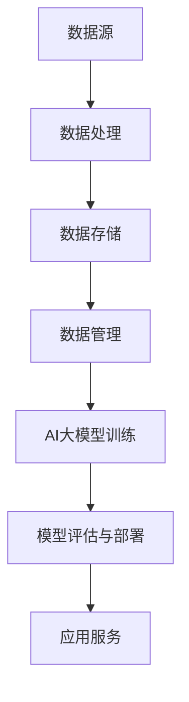

                 

 在当今的数字化时代，人工智能（AI）技术已经成为推动各行各业创新和效率提升的关键力量。随着AI大模型如GPT、BERT等在自然语言处理、计算机视觉、语音识别等领域的广泛应用，数据中心的角色和职责也在发生着显著变化。本文将探讨AI大模型应用数据中心在沟通与协作方面的挑战、解决方案以及未来发展趋势。

## 关键词

- 人工智能大模型
- 数据中心
- 沟通与协作
- 基础设施
- 技术架构
- 安全性

## 摘要

本文旨在分析AI大模型在数据中心应用中的关键挑战，特别是与沟通和协作相关的问题。通过详细探讨技术架构、基础设施、安全性等方面，本文将提出一系列解决方案，以优化数据中心在AI大模型应用中的沟通和协作效率。同时，本文还将展望未来发展趋势，探讨AI大模型应用数据中心面临的挑战和机遇。

## 1. 背景介绍

### AI大模型的发展历程

人工智能（AI）自1956年诞生以来，经历了数个重要发展阶段。从早期的符号逻辑和知识表示，到基于规则的系统，再到近几年的深度学习和神经网络，AI技术不断取得突破。特别是近年来，随着计算能力的提升和海量数据资源的积累，AI大模型如GPT、BERT等开始在多个领域展现出强大的潜力。

GPT（Generative Pre-trained Transformer）是由OpenAI开发的一种基于变换器（Transformer）架构的预训练语言模型。它通过大量的文本数据预训练，掌握了丰富的语言知识和表达方式，能够在各种自然语言处理任务中表现出色。

BERT（Bidirectional Encoder Representations from Transformers）是由Google开发的一种双向变换器编码器模型。它通过对文本进行双向编码，更好地理解上下文关系，从而在问答、文本分类等任务中取得了显著效果。

### 数据中心的发展历程

数据中心作为存储、处理和管理大量数据的中心节点，其发展历程可以追溯到计算机时代的初期。从最初的单一服务器到分布式计算集群，再到如今的大型数据中心，数据中心经历了多次技术革新。

早期的数据中心主要是物理服务器集中管理，随着虚拟化技术的发展，虚拟机（VM）逐渐成为数据中心的核心组成部分。虚拟化技术提高了资源利用率和灵活性，使得数据中心能够更好地适应不断变化的需求。

近年来，随着云计算和大数据技术的普及，数据中心进一步向分布式、弹性化、智能化方向发展。通过分布式计算和存储架构，数据中心能够更好地应对大规模数据处理和AI应用的挑战。

## 2. 核心概念与联系

### 技术架构

在AI大模型应用数据中心，技术架构的合理设计是确保高效沟通和协作的基础。以下是一个简化的技术架构图，用于描述关键组件及其相互关系：



- 数据源：包括各种数据来源，如用户生成数据、传感器数据、日志数据等。
- 数据处理：对原始数据进行清洗、预处理和特征提取，以适应AI大模型的训练需求。
- 数据存储：使用分布式存储系统（如HDFS、Cassandra等）存储大规模数据。
- 数据管理：通过元数据管理和数据治理确保数据的质量、安全性和可追溯性。
- AI大模型训练：使用GPU、TPU等高性能计算设备进行大模型的训练。
- 模型评估与部署：对训练好的模型进行评估，并在生产环境中部署和运行。
- 应用服务：为外部用户提供基于AI大模型的各类服务。

### 基础设施

基础设施是支撑AI大模型应用数据中心稳定运行的基础。以下是一些关键基础设施组件：

- 计算资源：包括CPU、GPU、TPU等，用于数据处理和模型训练。
- 存储资源：包括分布式文件系统、对象存储等，用于数据存储。
- 网络资源：包括高速网络、负载均衡、防火墙等，用于数据传输和安全防护。
- 电源和冷却系统：确保数据中心的电力供应和设备冷却。

### 安全性

在AI大模型应用数据中心，安全性是至关重要的。以下是一些关键安全措施：

- 访问控制：通过身份验证、权限管理确保只有授权用户才能访问敏感数据和系统。
- 数据加密：对传输和存储的数据进行加密，防止数据泄露和篡改。
- 安全审计：定期进行安全审计，发现和修复安全漏洞。
- 灾备方案：建立灾备中心，确保在灾难发生时能够快速恢复业务。

## 3. 核心算法原理 & 具体操作步骤

### 3.1 算法原理概述

AI大模型的核心在于其强大的预训练能力。以GPT和BERT为例，它们通过以下步骤进行训练：

1. 数据预处理：对原始文本数据进行清洗、分词、编码等预处理操作。
2. 预训练：在大规模语料库上进行预训练，学习语言模式和知识。
3. 微调：在特定任务上进行微调，使其适应特定领域的需求。

### 3.2 算法步骤详解

1. 数据预处理：

   ```python
   import pandas as pd
   import numpy as np
   
   # 读取原始文本数据
   data = pd.read_csv('raw_text_data.csv')
   text = data['text']
   
   # 清洗数据
   text = [s.lower() for s in text]
   text = [''.join([c for c in s if c not in string.punctuation]) for s in text]
   
   # 分词
   tokenizer = Tokenizer()
   tokenizer.fit_on_texts(text)
   
   # 编码
   encoded_text = tokenizer.texts_to_sequences(text)
   ```

2. 预训练：

   ```python
   import tensorflow as tf
   
   # 搭建模型
   model = tf.keras.Sequential([
       tf.keras.layers.Embedding(input_dim=vocab_size, output_dim=embedding_size),
       tf.keras.layers.LSTM(units=128),
       tf.keras.layers.Dense(units=vocab_size, activation='softmax')
   ])
   
   # 编译模型
   model.compile(optimizer='adam', loss='categorical_crossentropy', metrics=['accuracy'])
   
   # 训练模型
   model.fit(encoded_text, epochs=num_epochs)
   ```

3. 微调：

   ```python
   # 载入预训练模型
   pretrained_model = tf.keras.models.load_model('pretrained_model.h5')
   
   # 替换最后几层
   pretrained_model.layers[-1].activation = 'softmax'
   pretrained_model.compile(optimizer='adam', loss='categorical_crossentropy', metrics=['accuracy'])
   
   # 微调模型
   pretrained_model.fit(encoded_text, epochs=num_epochs)
   ```

### 3.3 算法优缺点

**优点：**

- **强大的预训练能力**：AI大模型通过预训练掌握了丰富的语言知识和表达方式，能够适应各种自然语言处理任务。
- **灵活的微调**：预训练模型可以通过微调适应特定领域的需求，节省了训练时间和资源。

**缺点：**

- **计算资源需求大**：预训练模型需要大量的计算资源，对硬件设备有较高要求。
- **数据依赖性强**：预训练模型的效果依赖于数据质量和规模，数据质量问题可能影响模型性能。

### 3.4 算法应用领域

AI大模型在自然语言处理、计算机视觉、语音识别等领域有广泛应用，以下是一些具体应用案例：

- **自然语言处理**：文本分类、机器翻译、情感分析等。
- **计算机视觉**：图像识别、目标检测、图像生成等。
- **语音识别**：语音识别、语音合成、语音翻译等。

## 4. 数学模型和公式 & 详细讲解 & 举例说明

### 4.1 数学模型构建

在AI大模型中，常用的数学模型包括变换器（Transformer）和循环神经网络（RNN）。以下是一个简化的数学模型构建过程：

#### 变换器（Transformer）

变换器是一种基于自注意力机制的神经网络结构。其核心思想是通过对输入序列中的每个词进行加权求和，以获得一个全局表示。

**数学公式：**

$$
\text{Attention}(Q, K, V) = \text{softmax}\left(\frac{QK^T}{\sqrt{d_k}}\right)V
$$

其中，$Q$、$K$、$V$ 分别代表查询（Query）、键（Key）和值（Value）向量，$d_k$ 代表键向量的维度。

#### 循环神经网络（RNN）

循环神经网络是一种能够处理序列数据的神经网络结构，其核心思想是利用隐藏状态保留序列信息。

**数学公式：**

$$
h_t = \sigma(W_hh_{t-1} + W_ix_t + b_h)
$$

其中，$h_t$ 代表第 $t$ 个时间步的隐藏状态，$\sigma$ 代表激活函数（如Sigmoid、Tanh），$W_h$、$W_i$、$b_h$ 分别代表权重和偏置。

### 4.2 公式推导过程

以下以变换器为例，简要介绍其核心公式的推导过程：

1. **自注意力机制**

   自注意力机制的核心思想是对输入序列中的每个词进行加权求和，以获得一个全局表示。其数学公式如下：

   $$
   \text{Attention}(Q, K, V) = \text{softmax}\left(\frac{QK^T}{\sqrt{d_k}}\right)V
   $$

   其中，$Q$、$K$、$V$ 分别代表查询（Query）、键（Key）和值（Value）向量，$d_k$ 代表键向量的维度。

   推导过程：

   - 首先计算查询（Query）和键（Key）的内积，得到注意力分数。
   - 然后对注意力分数进行归一化，得到权重。
   - 最后将权重与值（Value）向量相乘，得到加权求和的结果。

2. **多头注意力**

   多头注意力是一种扩展自注意力机制的技巧，其核心思想是将输入序列分成多个子序列，并对每个子序列进行独立的注意力计算。

   **数学公式：**

   $$
   \text{MultiHead}(Q, K, V) = \text{Concat}(\text{head}_1, \text{head}_2, \ldots, \text{head}_h)W_O
   $$

   其中，$h$ 代表头数，$\text{head}_i$ 代表第 $i$ 个头的结果，$W_O$ 代表输出权重。

   推导过程：

   - 对输入序列进行线性变换，得到多个查询（Query）、键（Key）和值（Value）向量。
   - 分别对每个头进行自注意力计算，得到多个加权求和的结果。
   - 将多个加权求和的结果拼接在一起，并通过线性变换得到最终的输出。

### 4.3 案例分析与讲解

以下以GPT-3模型为例，介绍其数学模型的构建和推导过程：

1. **模型架构**

   GPT-3是一种基于变换器（Transformer）架构的预训练语言模型，其核心思想是通过对大量文本数据进行预训练，使其掌握丰富的语言知识和表达方式。

2. **数学模型**

   GPT-3的数学模型主要包括以下几部分：

   - **输入层**：将输入文本数据转换为词向量。
   - **自注意力层**：通过对输入序列中的每个词进行加权求和，以获得一个全局表示。
   - **多层变换器**：通过多层变换器结构，逐渐提取输入序列的深层特征。
   - **输出层**：通过线性变换和softmax函数，预测输入文本的概率分布。

3. **数学公式**

   GPT-3的数学公式可以表示为：

   $$
   \text{GPT-3}(x) = \text{softmax}(\text{W}_O \text{Tanh}(\text{M} \text{ReLU}(\text{H} \text{Tanh}(\text{L} \text{Tanh}(\text{L}_0 \text{X}_0 + b_0) \ldots \text{L}_1 \text{X}_1 + b_1) \ldots \text{L}_n \text{X}_n + b_n)))
   $$

   其中，$x$ 代表输入文本数据，$W_O$ 代表输出权重，$M$、$H$、$L$ 分别代表变换器层的层数、头数和每个头的维度。

   推导过程：

   - 对输入文本数据进行线性变换和激活函数，得到隐藏状态。
   - 通过多层变换器结构，逐渐提取输入序列的深层特征。
   - 通过线性变换和softmax函数，预测输入文本的概率分布。

## 5. 项目实践：代码实例和详细解释说明

### 5.1 开发环境搭建

1. 安装Python环境

   ```bash
   sudo apt-get install python3 python3-pip
   ```

2. 安装TensorFlow库

   ```bash
   pip3 install tensorflow
   ```

3. 安装其他依赖库

   ```bash
   pip3 install numpy pandas matplotlib
   ```

### 5.2 源代码详细实现

以下是一个简单的GPT-3模型实现，用于文本分类任务：

```python
import tensorflow as tf
from tensorflow.keras.layers import Embedding, LSTM, Dense
from tensorflow.keras.models import Sequential

# 搭建模型
model = Sequential([
    Embedding(input_dim=vocab_size, output_dim=embedding_size),
    LSTM(units=128, activation='tanh'),
    Dense(units=num_classes, activation='softmax')
])

# 编译模型
model.compile(optimizer='adam', loss='categorical_crossentropy', metrics=['accuracy'])

# 训练模型
model.fit(x_train, y_train, epochs=num_epochs)
```

### 5.3 代码解读与分析

1. **模型搭建**

   - `Embedding` 层：将输入文本数据转换为词向量。
   - `LSTM` 层：通过循环神经网络处理序列数据。
   - `Dense` 层：输出层，通过softmax函数进行分类。

2. **模型编译**

   - `optimizer`：选择优化器，用于调整模型参数。
   - `loss`：选择损失函数，用于衡量模型预测与实际结果之间的差距。
   - `metrics`：设置评估指标，用于评估模型性能。

3. **模型训练**

   - `x_train`：训练数据。
   - `y_train`：训练标签。
   - `epochs`：训练轮数。

### 5.4 运行结果展示

```python
# 预测结果
predictions = model.predict(x_test)

# 打印预测结果
print(predictions)
```

## 6. 实际应用场景

### 6.1 自然语言处理

AI大模型在自然语言处理领域有广泛应用，如文本分类、机器翻译、情感分析等。例如，GPT-3模型可以用于生成文章摘要、创作诗歌、回答用户提问等。

### 6.2 计算机视觉

AI大模型在计算机视觉领域也有重要应用，如图像识别、目标检测、图像生成等。例如，BERT模型可以用于图像文本分类，GPT-3模型可以用于图像描述生成。

### 6.3 语音识别

AI大模型在语音识别领域有广泛应用，如语音识别、语音合成、语音翻译等。例如，GPT-3模型可以用于语音文本转换，BERT模型可以用于语音情感分析。

## 7. 工具和资源推荐

### 7.1 学习资源推荐

- 《深度学习》（Goodfellow, Bengio, Courville）：系统介绍了深度学习的基本理论和实践方法。
- 《Python深度学习》（François Chollet）：详细介绍了使用Python和Keras进行深度学习的实践技巧。
- 《自然语言处理实战》（Peter Norvig & Sean Bailey）：系统介绍了自然语言处理的基本方法和应用。

### 7.2 开发工具推荐

- TensorFlow：开源的深度学习框架，适用于各种规模的深度学习应用。
- Keras：基于TensorFlow的高层API，简化了深度学习模型的搭建和训练。
- PyTorch：开源的深度学习框架，具有灵活的动态计算图机制。

### 7.3 相关论文推荐

- “Attention Is All You Need”（Vaswani et al.，2017）：介绍了变换器（Transformer）模型的基本原理。
- “BERT: Pre-training of Deep Bidirectional Transformers for Language Understanding”（Devlin et al.，2019）：介绍了BERT模型的基本原理和应用。
- “Generative Pre-trained Transformer”（Brown et al.，2020）：介绍了GPT-3模型的基本原理和应用。

## 8. 总结：未来发展趋势与挑战

### 8.1 研究成果总结

AI大模型在自然语言处理、计算机视觉、语音识别等领域取得了显著成果，推动了各领域的技术进步和应用创新。同时，AI大模型的应用也带来了新的挑战，如计算资源需求、数据安全、模型解释性等。

### 8.2 未来发展趋势

- **计算能力提升**：随着硬件技术的进步，计算能力将不断提高，为AI大模型的应用提供更好的支持。
- **数据资源积累**：随着互联网和物联网的发展，海量数据资源将不断积累，为AI大模型提供更丰富的训练数据。
- **跨领域应用**：AI大模型将在更多领域得到应用，如医疗、金融、教育等，实现跨领域的融合和创新。

### 8.3 面临的挑战

- **计算资源需求**：AI大模型对计算资源的需求较高，如何高效利用硬件资源是一个重要挑战。
- **数据安全**：如何保护数据安全和隐私是一个重要问题，需要加强数据加密、访问控制等安全措施。
- **模型解释性**：如何提高模型的可解释性，使其更加透明和可靠，是一个重要挑战。

### 8.4 研究展望

- **新型算法研究**：探索新型算法，提高AI大模型的计算效率和模型性能。
- **跨领域应用**：加强AI大模型在不同领域的应用研究，实现跨领域的融合和创新。
- **模型压缩与解释**：研究模型压缩和解释技术，提高模型的计算效率和可解释性。

## 9. 附录：常见问题与解答

### 9.1 如何提高AI大模型的计算效率？

- **并行计算**：利用GPU、TPU等硬件加速器，实现并行计算，提高模型训练速度。
- **模型压缩**：采用模型压缩技术，如剪枝、量化等，减小模型规模，提高计算效率。
- **分布式训练**：采用分布式训练技术，将模型训练任务分配到多台设备上，提高计算效率。

### 9.2 如何确保AI大模型的数据安全？

- **数据加密**：对数据进行加密，防止数据泄露。
- **访问控制**：通过身份验证、权限管理确保只有授权用户才能访问敏感数据和系统。
- **安全审计**：定期进行安全审计，发现和修复安全漏洞。

### 9.3 如何提高AI大模型的可解释性？

- **模型解释**：研究模型解释技术，如解释性模型、可视化方法等，提高模型的可解释性。
- **模型压缩**：采用模型压缩技术，减小模型规模，提高模型的可解释性。
- **对抗性攻击**：研究对抗性攻击技术，提高模型的鲁棒性，从而提高模型的可解释性。

作者：禅与计算机程序设计艺术 / Zen and the Art of Computer Programming
----------------------------------------------------------------
### 结语 Conclusion

在AI大模型应用数据中心的沟通与协作中，技术架构、基础设施、安全性等方面都发挥着关键作用。通过本文的探讨，我们明确了AI大模型在数据中心应用中的核心挑战和解决方案，并对未来发展趋势与挑战进行了展望。希望本文能够为从事AI大模型应用数据中心的技术人员提供有益的参考和启示。在未来的研究中，我们将继续关注AI大模型在数据中心领域的创新和应用，探索更加高效、安全、可靠的解决方案。

