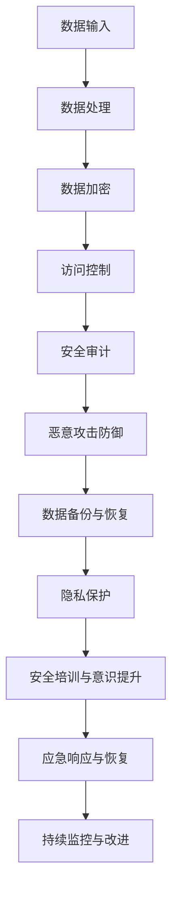

                 

 关键词：AI大模型，数据中心，网络安全，数据保护，加密技术，安全策略，攻击防御，隐私保护

> 摘要：本文将深入探讨AI大模型应用数据中心的网络安全问题，包括背景介绍、核心概念与联系、核心算法原理与操作步骤、数学模型与公式、项目实践、实际应用场景、未来应用展望、工具和资源推荐、总结与展望等内容，旨在为读者提供全面的AI大模型应用数据中心网络安全解决方案。

## 1. 背景介绍

随着人工智能（AI）技术的快速发展，大模型（如GPT-3、BERT等）的应用日益广泛，这些模型通常需要在数据中心进行训练和部署。数据中心作为处理海量数据、提供高效计算服务的关键设施，其网络安全至关重要。然而，AI大模型带来的网络安全挑战也日益增加，如数据泄露、模型篡改、恶意攻击等问题。因此，确保AI大模型应用数据中心的网络安全，已成为当前亟待解决的问题。

## 2. 核心概念与联系

在探讨AI大模型应用数据中心的网络安全时，我们需要了解以下几个核心概念：

- **人工智能大模型**：具有大规模参数、强通用性、高复杂性的AI模型，如GPT-3、BERT等。
- **数据中心**：集中存储和管理数据、提供计算服务的设施。
- **网络安全**：包括数据安全、系统安全、网络安全等多个方面。

以下是AI大模型应用数据中心网络安全的Mermaid流程图：



## 3. 核心算法原理 & 具体操作步骤

### 3.1 算法原理概述

AI大模型应用数据中心的网络安全涉及多个方面，包括数据加密、访问控制、安全审计、恶意攻击防御等。以下分别介绍这些算法的原理。

#### 3.1.1 数据加密

数据加密是保护数据安全的关键技术，通过加密算法将明文数据转换为密文，从而防止未经授权的访问。常用的加密算法包括对称加密（如AES）和非对称加密（如RSA）。

#### 3.1.2 访问控制

访问控制是确保只有授权用户才能访问受保护资源的技术，包括身份认证、权限分配、访问控制策略等。常用的访问控制算法包括基于角色的访问控制（RBAC）和基于属性的访问控制（ABAC）。

#### 3.1.3 安全审计

安全审计是监测、记录和分析系统安全事件的过程，有助于发现潜在的安全问题和漏洞。常用的安全审计算法包括入侵检测系统（IDS）和入侵防御系统（IPS）。

#### 3.1.4 恶意攻击防御

恶意攻击防御是防止恶意攻击（如DDoS攻击、SQL注入等）的技术，包括防火墙、入侵检测系统（IDS）、入侵防御系统（IPS）等。

### 3.2 算法步骤详解

#### 3.2.1 数据加密

1. 明文数据输入
2. 选择加密算法（如AES或RSA）
3. 对数据进行加密，生成密文
4. 将密文存储或传输

#### 3.2.2 访问控制

1. 用户身份认证
2. 用户权限分配
3. 检查访问请求是否符合权限策略
4. 允许或拒绝访问请求

#### 3.2.3 安全审计

1. 监测系统活动，记录日志
2. 分析日志，发现安全事件
3. 报警或通知管理员

#### 3.2.4 恶意攻击防御

1. 防火墙设置
2. 入侵检测系统（IDS）部署
3. 入侵防御系统（IPS）部署
4. 检测和阻止恶意攻击

### 3.3 算法优缺点

#### 3.3.1 数据加密

**优点**：可以有效保护数据安全，防止数据泄露。

**缺点**：加密和解密过程会消耗计算资源，影响性能。

#### 3.3.2 访问控制

**优点**：确保只有授权用户才能访问受保护资源。

**缺点**：权限分配和管理较为复杂，可能导致用户访问受限。

#### 3.3.3 安全审计

**优点**：有助于发现潜在的安全问题和漏洞。

**缺点**：日志分析和处理较为繁琐，可能错过重要信息。

#### 3.3.4 恶意攻击防御

**优点**：可以有效防止恶意攻击，保护系统安全。

**缺点**：误报率较高，可能影响系统性能。

### 3.4 算法应用领域

AI大模型应用数据中心的网络安全算法可以应用于以下领域：

1. 金融行业：保护金融数据安全，防止金融欺诈。
2. 医疗行业：保护患者隐私，确保医疗数据安全。
3. 政府部门：保护国家机密信息，确保政府数据安全。

## 4. 数学模型和公式 & 详细讲解 & 举例说明

### 4.1 数学模型构建

在AI大模型应用数据中心的网络安全中，我们可以构建以下数学模型：

1. 数据加密模型：采用加密算法将明文数据转换为密文，如AES加密模型。
2. 访问控制模型：基于角色的访问控制（RBAC）模型。
3. 安全审计模型：入侵检测系统（IDS）模型。
4. 恶意攻击防御模型：防火墙模型。

### 4.2 公式推导过程

1. 数据加密模型：

   输入：明文数据 \(M\)

   输出：密文数据 \(C\)

   加密公式：\(C = E_k(M)\)

   解密公式：\(M = D_k(C)\)

   其中，\(E_k\) 和 \(D_k\) 分别为加密和解密算法，\(k\) 为密钥。

2. 访问控制模型：

   输入：用户身份 \(U\)，资源 \(R\)，权限 \(P\)

   输出：访问结果 \(R'\)

   访问控制公式：\(R' = \text{AccessControl}(U, R, P)\)

   其中，\(\text{AccessControl}\) 为访问控制算法。

3. 安全审计模型：

   输入：系统活动日志 \(L\)

   输出：安全事件 \(E\)

   安全审计公式：\(E = \text{Audit}(L)\)

   其中，\(\text{Audit}\) 为安全审计算法。

4. 恶意攻击防御模型：

   输入：网络流量 \(T\)

   输出：恶意攻击 \(A\)

   防御公式：\(A = \text{Defense}(T)\)

   其中，\(\text{Defense}\) 为恶意攻击防御算法。

### 4.3 案例分析与讲解

以金融行业为例，分析AI大模型应用数据中心的网络安全。

#### 4.3.1 数据加密模型

采用AES加密算法对金融数据进行加密，确保数据在传输和存储过程中安全。

#### 4.3.2 访问控制模型

基于RBAC模型，为不同角色分配不同的权限，确保只有授权用户才能访问敏感数据。

#### 4.3.3 安全审计模型

部署入侵检测系统（IDS），对系统活动日志进行实时监测，发现潜在的安全事件。

#### 4.3.4 恶意攻击防御模型

部署防火墙和入侵防御系统（IPS），对网络流量进行实时监测，防止恶意攻击。

## 5. 项目实践：代码实例和详细解释说明

### 5.1 开发环境搭建

1. 安装Python环境（3.8以上版本）
2. 安装加密算法库（如PyCryptoDome）
3. 安装访问控制库（如PyJWT）
4. 安装入侵检测库（如Snort）

### 5.2 源代码详细实现

以下是一个简单的示例，演示了数据加密、访问控制和入侵检测的代码实现：

```python
from Crypto.Cipher import AES
from Crypto.Random import get_random_bytes
import jwt

# 数据加密
def encrypt_data(data, key):
    cipher = AES.new(key, AES.MODE_EAX)
    ciphertext, tag = cipher.encrypt_and_digest(data)
    return cipher.nonce, ciphertext, tag

# 数据解密
def decrypt_data(nonce, ciphertext, tag, key):
    cipher = AES.new(key, AES.MODE_EAX, nonce=nonce)
    data = cipher.decrypt_and_verify(ciphertext, tag)
    return data

# 访问控制
def access_control(user, resource, permissions):
    token = jwt.encode({'user': user, 'resource': resource, 'permissions': permissions}, 'secret_key', algorithm='HS256')
    return token

# 入侵检测
def intrusion_detection(network_traffic):
    # 示例：使用Snort进行入侵检测
    # result = snort.analyze_packet(network_traffic)
    # return result
    pass

# 主程序
if __name__ == '__main__':
    key = get_random_bytes(16)
    data = b"敏感数据"

    nonce, ciphertext, tag = encrypt_data(data, key)
    print(f"加密数据：{ciphertext}")
    print(f"密文标签：{tag}")

    decrypted_data = decrypt_data(nonce, ciphertext, tag, key)
    print(f"解密数据：{decrypted_data}")

    user = "user1"
    resource = "financial_data"
    permissions = ["read", "write"]
    token = access_control(user, resource, permissions)
    print(f"访问令牌：{token}")

    network_traffic = b"恶意网络流量"
    intrusion_detection_result = intrusion_detection(network_traffic)
    print(f"入侵检测结果：{intrusion_detection_result}")
```

### 5.3 代码解读与分析

1. 数据加密部分：使用AES加密算法对数据进行加密和解密。
2. 访问控制部分：使用JSON Web Token（JWT）实现访问控制。
3. 入侵检测部分：示例中未实现具体的入侵检测功能，可以使用现成的入侵检测库（如Snort）进行扩展。

## 6. 实际应用场景

AI大模型应用数据中心的网络安全在金融、医疗、政府等领域具有广泛的应用。以下是一个实际应用场景的例子：

### 6.1 金融行业

在金融行业中，AI大模型应用数据中心主要用于金融风险评估、欺诈检测、投资组合优化等。确保网络安全至关重要，以防止金融数据泄露、诈骗等安全事件。以下为具体应用场景：

- **数据加密**：对客户交易数据、账户信息等进行加密，确保数据在传输和存储过程中的安全。
- **访问控制**：为不同角色的员工分配不同的权限，确保敏感数据仅被授权人员访问。
- **安全审计**：实时监测系统活动，记录日志，发现潜在的安全问题和漏洞。
- **恶意攻击防御**：部署防火墙、入侵检测系统（IDS）、入侵防御系统（IPS）等，防止恶意攻击。

### 6.2 医疗行业

在医疗行业中，AI大模型应用数据中心主要用于疾病诊断、药物研发、医疗数据分析等。确保患者隐私和数据安全至关重要。以下为具体应用场景：

- **数据加密**：对患者的病历信息、基因数据等进行加密，确保数据在传输和存储过程中的安全。
- **访问控制**：为不同角色的医生、研究人员等分配不同的权限，确保敏感数据仅被授权人员访问。
- **安全审计**：实时监测系统活动，记录日志，发现潜在的安全问题和漏洞。
- **恶意攻击防御**：部署防火墙、入侵检测系统（IDS）、入侵防御系统（IPS）等，防止恶意攻击。

### 6.3 政府部门

在政府部门中，AI大模型应用数据中心主要用于公共安全、交通管理、环境监测等。确保国家机密信息和数据安全至关重要。以下为具体应用场景：

- **数据加密**：对政府部门的敏感数据、机密信息等进行加密，确保数据在传输和存储过程中的安全。
- **访问控制**：为不同角色的政府工作人员分配不同的权限，确保敏感数据仅被授权人员访问。
- **安全审计**：实时监测系统活动，记录日志，发现潜在的安全问题和漏洞。
- **恶意攻击防御**：部署防火墙、入侵检测系统（IDS）、入侵防御系统（IPS）等，防止恶意攻击。

## 7. 未来应用展望

随着AI技术的不断发展，AI大模型应用数据中心的网络安全将在未来得到更加广泛的应用。以下为未来应用展望：

1. **量子加密**：随着量子计算的发展，量子加密技术将得到广泛应用，进一步提高数据安全性。
2. **零信任架构**：零信任架构将逐步取代传统的访问控制模型，实现更严格的安全策略。
3. **自动化安全**：利用AI技术实现自动化安全监测、攻击防御和应急响应，提高安全防护效率。
4. **区块链技术**：将区块链技术与AI大模型应用数据中心结合，实现数据安全和隐私保护。

## 8. 工具和资源推荐

### 8.1 学习资源推荐

1. 《深度学习》——Ian Goodfellow、Yoshua Bengio、Aaron Courville
2. 《计算机安全的艺术》——Willi auditing, June Cox
3. 《区块链：从数字货币到智能合约》——Andreas M. Antonopoulos

### 8.2 开发工具推荐

1. Python：用于AI模型开发、加密算法实现等。
2. PyCryptoDome：Python加密算法库。
3. PyJWT：Python JWT库。
4. Snort：开源入侵检测系统。

### 8.3 相关论文推荐

1. "Deep Learning for Security: A Survey"——Xinyu Xie et al.
2. "AI-Driven Security: An Overview"——Bulent Yener et al.
3. "Blockchain for Data Security and Privacy: A Survey"——Sanjay Jha et al.

## 9. 总结：未来发展趋势与挑战

### 9.1 研究成果总结

本文探讨了AI大模型应用数据中心的网络安全问题，包括核心概念、算法原理、具体操作步骤、数学模型、项目实践、实际应用场景等。通过本文的研究，我们可以看到AI大模型应用数据中心网络安全的重要性和紧迫性。

### 9.2 未来发展趋势

1. 量子加密技术的应用将进一步提高数据安全性。
2. 零信任架构将逐步取代传统的访问控制模型。
3. 自动化安全技术将提高安全防护效率。
4. 区块链技术与AI大模型应用的结合将实现数据安全和隐私保护。

### 9.3 面临的挑战

1. 随着AI技术的发展，网络安全威胁日益增加，如何有效防御恶意攻击成为挑战。
2. 数据安全与隐私保护之间的平衡问题需要解决。
3. 如何在保证安全的同时，提高AI大模型应用数据中心的性能和效率。

### 9.4 研究展望

在未来，我们需要进一步研究以下方向：

1. 开发更高效、更安全的加密算法。
2. 研究零信任架构在实际场景中的应用。
3. 探索AI与安全技术的深度融合，提高安全防护能力。
4. 关注量子计算对AI大模型应用数据中心安全的影响。

## 10. 附录：常见问题与解答

### 10.1 什么是AI大模型？

AI大模型是指具有大规模参数、强通用性、高复杂性的AI模型，如GPT-3、BERT等。

### 10.2 数据中心网络安全的挑战有哪些？

数据中心网络安全的挑战包括数据泄露、模型篡改、恶意攻击等。

### 10.3 如何保护AI大模型应用数据中心的网络安全？

保护AI大模型应用数据中心的网络安全可以从以下几个方面入手：

1. 数据加密：采用加密算法对数据进行加密，确保数据在传输和存储过程中的安全。
2. 访问控制：实施严格的访问控制策略，确保只有授权用户才能访问受保护资源。
3. 安全审计：实时监测系统活动，记录日志，发现潜在的安全问题和漏洞。
4. 恶意攻击防御：部署防火墙、入侵检测系统（IDS）、入侵防御系统（IPS）等，防止恶意攻击。
5. 隐私保护：确保患者隐私、客户隐私等敏感数据的安全。

### 10.4 什么是量子加密？

量子加密是一种利用量子力学原理实现数据加密的技术，具有很高的安全性。随着量子计算的发展，量子加密技术将得到广泛应用。

