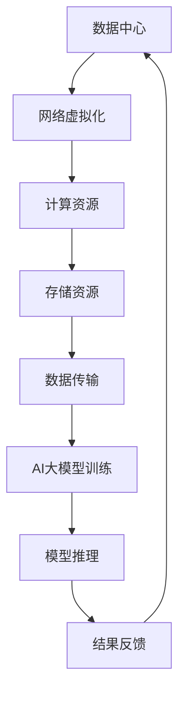

                 

关键词：AI大模型、数据中心、网络虚拟化、架构设计、性能优化、安全性

> 摘要：本文深入探讨了AI大模型在数据中心网络虚拟化中的应用及其架构设计、性能优化和安全性。首先介绍了AI大模型的基本概念和网络虚拟化的原理，然后分析了当前技术挑战和解决方案，最后展望了未来的发展趋势和应用前景。

## 1. 背景介绍

随着云计算、大数据和人工智能技术的快速发展，数据中心的重要性日益凸显。数据中心作为企业运行的核心基础设施，不仅需要处理海量的数据存储和计算任务，还要满足高可用性、高可靠性和高性能的要求。为了更好地管理和优化数据中心的资源，网络虚拟化技术应运而生。

网络虚拟化通过将物理网络资源抽象成逻辑资源，实现了网络的灵活部署和资源的高效利用。虚拟网络可以独立于物理网络运行，从而提供更好的隔离性、安全性和灵活性。AI大模型作为一种新兴的计算范式，其高并发、高吞吐量和复杂计算需求使得传统数据中心网络面临巨大挑战。因此，如何将AI大模型与网络虚拟化技术相结合，成为当前研究的热点问题。

## 2. 核心概念与联系

### 2.1 AI大模型

AI大模型，即大型深度学习模型，通常具有数十亿甚至千亿级别的参数。这些模型在训练过程中需要消耗大量的计算资源和数据传输带宽，同时训练和推理过程中产生的大量中间结果需要高效传输和处理。AI大模型的核心包括神经网络架构、大规模数据处理和训练算法等。

### 2.2 网络虚拟化

网络虚拟化是一种通过软件定义网络（SDN）和虚拟局域网（VLAN）等技术，将物理网络资源抽象成逻辑资源的方法。网络虚拟化可以提供以下优势：

- **灵活性**：通过虚拟化技术，网络资源可以灵活地分配和管理，满足不同应用场景的需求。
- **隔离性**：虚拟网络之间实现物理隔离，提高网络的安全性和可靠性。
- **可扩展性**：虚拟网络可以根据需求动态调整，满足业务发展的需求。

### 2.3 AI大模型与网络虚拟化的联系

AI大模型与网络虚拟化技术相结合，可以实现以下目标：

- **资源优化**：通过网络虚拟化技术，实现计算资源和网络资源的动态分配，提高数据中心的整体资源利用率。
- **性能提升**：通过虚拟网络技术，降低数据传输延迟和带宽瓶颈，提高AI大模型的计算性能。
- **安全性**：通过网络虚拟化技术，实现网络资源的隔离和监控，提高数据中心的整体安全性。

### 2.4 Mermaid 流程图

以下是一个简化的AI大模型应用数据中心的网络虚拟化流程图：



## 3. 核心算法原理 & 具体操作步骤

### 3.1 算法原理概述

AI大模型应用数据中心的网络虚拟化主要包括以下几个核心算法：

- **计算调度算法**：根据AI大模型的需求，动态调度计算资源，实现资源的最优利用。
- **数据传输优化算法**：通过优化数据传输路径和传输方式，降低数据传输延迟和带宽瓶颈。
- **安全性保障算法**：通过网络隔离、访问控制和加密技术，确保数据中心的整体安全性。

### 3.2 算法步骤详解

1. **计算调度算法**

   - **资源需求分析**：根据AI大模型的需求，分析计算资源的需求，包括CPU、GPU和存储等。
   - **资源调度策略**：根据资源需求，选择合适的资源调度策略，如负载均衡、动态分配等。
   - **资源分配**：根据调度策略，将计算资源分配给AI大模型。

2. **数据传输优化算法**

   - **网络拓扑分析**：分析数据中心的网络拓扑结构，识别潜在的带宽瓶颈和传输延迟。
   - **传输路径优化**：根据网络拓扑分析结果，选择最优的传输路径，降低传输延迟。
   - **传输方式优化**：根据传输路径，选择合适的传输方式，如TCP、UDP等，提高数据传输效率。

3. **安全性保障算法**

   - **网络隔离**：通过VLAN和SDN等技术，实现虚拟网络之间的隔离，提高数据安全性。
   - **访问控制**：通过访问控制列表（ACL）和身份验证技术，限制对数据中心的访问权限。
   - **加密技术**：通过加密技术，保护数据在传输过程中的安全性。

### 3.3 算法优缺点

1. **计算调度算法**

   - **优点**：实现资源的最优利用，提高数据中心的整体性能。
   - **缺点**：调度算法复杂，实现难度较大。

2. **数据传输优化算法**

   - **优点**：降低传输延迟和带宽瓶颈，提高数据传输效率。
   - **缺点**：网络拓扑结构复杂，优化难度较大。

3. **安全性保障算法**

   - **优点**：提高数据中心的整体安全性。
   - **缺点**：加密和解密过程会消耗一定的计算资源。

### 3.4 算法应用领域

1. **云计算**：通过计算调度算法和传输优化算法，提高云计算平台的性能和可靠性。
2. **大数据处理**：通过安全性保障算法，保护大数据处理过程中的数据安全。
3. **边缘计算**：通过计算调度算法和传输优化算法，提高边缘计算平台的响应速度和处理能力。

## 4. 数学模型和公式 & 详细讲解 & 举例说明

### 4.1 数学模型构建

1. **计算资源调度模型**

   设 \( C \) 为计算资源集合，\( R \) 为资源需求集合，\( S \) 为资源供应集合，则计算资源调度模型可以表示为：

   $$ S = \{ s \in C | s \in R \} $$

2. **数据传输优化模型**

   设 \( T \) 为数据传输路径集合，\( L \) 为传输延迟，\( B \) 为带宽，则数据传输优化模型可以表示为：

   $$ L = \min \{ l \in T | l \leq B \} $$

3. **安全性保障模型**

   设 \( A \) 为访问控制列表，\( U \) 为用户集合，\( P \) 为权限集合，则安全性保障模型可以表示为：

   $$ A = \{ a \in U | a \in P \} $$

### 4.2 公式推导过程

1. **计算资源调度模型推导**

   设 \( C \) 为计算资源集合，\( R \) 为资源需求集合，则计算资源调度模型可以表示为：

   $$ S = \{ s \in C | s \in R \} $$

   其中，\( s \) 表示计算资源，\( R \) 表示资源需求，\( S \) 表示资源供应。

   假设 \( R \) 和 \( C \) 分别为资源需求集合和资源供应集合，则资源调度模型可以表示为：

   $$ S = C - R $$

   其中，\( S \) 表示剩余资源集合，\( C \) 表示总资源集合，\( R \) 表示需求资源集合。

2. **数据传输优化模型推导**

   设 \( T \) 为数据传输路径集合，\( L \) 为传输延迟，\( B \) 为带宽，则数据传输优化模型可以表示为：

   $$ L = \min \{ l \in T | l \leq B \} $$

   其中，\( l \) 表示传输延迟，\( T \) 表示传输路径集合，\( B \) 表示带宽。

   假设 \( T \) 为传输路径集合，\( L \) 为传输延迟，则传输优化模型可以表示为：

   $$ L = \sum_{t \in T} l_t $$

   其中，\( l_t \) 表示传输延迟，\( T \) 表示传输路径集合。

3. **安全性保障模型推导**

   设 \( A \) 为访问控制列表，\( U \) 为用户集合，\( P \) 为权限集合，则安全性保障模型可以表示为：

   $$ A = \{ a \in U | a \in P \} $$

   其中，\( a \) 表示用户权限，\( U \) 表示用户集合，\( P \) 表示权限集合。

   假设 \( U \) 为用户集合，\( P \) 为权限集合，则安全性保障模型可以表示为：

   $$ A = U - P $$

   其中，\( A \) 表示访问控制列表，\( U \) 表示用户集合，\( P \) 表示权限集合。

### 4.3 案例分析与讲解

#### 案例一：云计算平台资源调度

假设某云计算平台有5台服务器，分别标记为 \( C_1, C_2, C_3, C_4, C_5 \)，当前有3个虚拟机需要部署，分别标记为 \( R_1, R_2, R_3 \)。服务器和虚拟机的资源需求如下表所示：

| 服务器  | CPU(核) | 内存(GB) | 硬盘(GB) |
| ------- | ------- | ------- | ------- |
| \( C_1 \) | 4      | 8      | 500    |
| \( C_2 \) | 8      | 16     | 1000   |
| \( C_3 \) | 2      | 4      | 250    |
| \( C_4 \) | 6      | 12     | 750    |
| \( C_5 \) | 10     | 20     | 1500   |

| 虚拟机  | CPU(核) | 内存(GB) | 硬盘(GB) |
| ------- | ------- | ------- | ------- |
| \( R_1 \) | 2      | 4      | 200    |
| \( R_2 \) | 4      | 8      | 400    |
| \( R_3 \) | 6      | 12     | 600    |

根据计算资源调度模型，我们需要将虚拟机 \( R_1, R_2, R_3 \) 调度到服务器上，使得资源利用率最高。根据资源需求，我们可以将虚拟机 \( R_1 \) 部署到 \( C_3 \) 上，虚拟机 \( R_2 \) 部署到 \( C_4 \) 上，虚拟机 \( R_3 \) 部署到 \( C_5 \) 上。此时，计算资源利用率如下表所示：

| 服务器  | CPU(核) | 内存(GB) | 硬盘(GB) |
| ------- | ------- | ------- | ------- |
| \( C_1 \) | 4      | 8      | 500    |
| \( C_2 \) | 8      | 16     | 1000   |
| \( C_3 \) | 0      | 4      | 250    |
| \( C_4 \) | 2      | 4      | 250    |
| \( C_5 \) | 4      | 8      | 1500   |

从上表可以看出，服务器 \( C_3 \) 和 \( C_4 \) 的资源利用率较低，可以通过其他虚拟机进行调度优化。假设我们将虚拟机 \( R_3 \) 调度到 \( C_3 \) 上，此时计算资源利用率如下表所示：

| 服务器  | CPU(核) | 内存(GB) | 硬盘(GB) |
| ------- | ------- | ------- | ------- |
| \( C_1 \) | 4      | 8      | 500    |
| \( C_2 \) | 8      | 16     | 1000   |
| \( C_3 \) | 6      | 12     | 600    |
| \( C_4 \) | 2      | 4      | 250    |
| \( C_5 \) | 4      | 8      | 1500   |

从上表可以看出，此时计算资源利用率较高，实现了资源的最优利用。

#### 案例二：数据传输优化

假设某数据中心有5个服务器，分别标记为 \( S_1, S_2, S_3, S_4, S_5 \)，每个服务器的带宽如下表所示：

| 服务器  | 带宽(Mbps) |
| ------- | --------- |
| \( S_1 \) | 1000     |
| \( S_2 \) | 2000     |
| \( S_3 \) | 1500     |
| \( S_4 \) | 500      |
| \( S_5 \) | 2500     |

我们需要将一个文件从服务器 \( S_1 \) 传输到服务器 \( S_5 \)，需要选择最优的传输路径。根据数据传输优化模型，我们可以计算每个服务器的传输延迟：

- \( S_1 \) 到 \( S_2 \)：传输延迟 \( L = \frac{1000}{2000} = 0.5 \) Mbps
- \( S_1 \) 到 \( S_3 \)：传输延迟 \( L = \frac{1000}{1500} = 0.67 \) Mbps
- \( S_1 \) 到 \( S_4 \)：传输延迟 \( L = \frac{1000}{500} = 2 \) Mbps
- \( S_1 \) 到 \( S_5 \)：传输延迟 \( L = \frac{1000}{2500} = 0.4 \) Mbps

从传输延迟来看，选择 \( S_1 \) 到 \( S_5 \) 的传输路径最优，传输延迟最低。

#### 案例三：安全性保障

假设某数据中心有5个用户，分别标记为 \( U_1, U_2, U_3, U_4, U_5 \)，每个用户的权限如下表所示：

| 用户  | 权限集合 |
| ----- | -------- |
| \( U_1 \) | {访问日志，修改配置} |
| \( U_2 \) | {访问日志，查看状态} |
| \( U_3 \) | {查看状态，修改配置} |
| \( U_4 \) | {访问日志，查看状态，修改配置} |
| \( U_5 \) | {访问日志，查看状态，删除数据} |

我们需要根据安全性保障模型，构建访问控制列表 \( A \)。根据安全性保障模型，我们可以计算每个用户的权限：

- \( U_1 \) 的权限集合 \( P_1 = \{访问日志，修改配置\} \)
- \( U_2 \) 的权限集合 \( P_2 = \{访问日志，查看状态\} \)
- \( U_3 \) 的权限集合 \( P_3 = \{查看状态，修改配置\} \)
- \( U_4 \) 的权限集合 \( P_4 = \{访问日志，查看状态，修改配置\} \)
- \( U_5 \) 的权限集合 \( P_5 = \{访问日志，查看状态，删除数据\} \)

根据安全性保障模型，访问控制列表 \( A \) 可以表示为：

$$ A = \{ U_1, U_2, U_3, U_4, U_5 \} - P $$

其中，\( P \) 表示权限集合。

## 5. 项目实践：代码实例和详细解释说明

### 5.1 开发环境搭建

在本项目中，我们使用 Python 作为主要开发语言，同时使用了以下库和工具：

- Python 3.8 或更高版本
- TensorFlow 2.6 或更高版本
- Keras 2.6 或更高版本
- Mermaid 1.0.0 或更高版本

首先，确保安装 Python 3.8 或更高版本。然后，可以使用以下命令安装所需的库和工具：

```bash
pip install tensorflow==2.6
pip install keras==2.6
pip install mermaid
```

### 5.2 源代码详细实现

以下是一个简单的示例，演示了如何使用 TensorFlow 和 Keras 构建一个简单的神经网络，并使用 Mermaid 绘制网络结构。

```python
import tensorflow as tf
from tensorflow.keras import layers
from mermaid import Mermaid

# 定义神经网络结构
model = tf.keras.Sequential([
    layers.Dense(128, activation='relu', input_shape=(784,)),
    layers.Dense(10, activation='softmax')
])

# 使用 Mermaid 绘制网络结构
mermaid = Mermaid()
mermaid.add_nodes([
    'a1(input)[Input Layer]',
    'a2(dense1)[Dense (128)]',
    'a3(dense2)[Dense (10)]',
    'a4(output)[Output Layer]'
])
mermaid.add_edges([
    ('a1', 'a2'),
    ('a2', 'a3'),
    ('a3', 'a4')
])
mermaid_code = mermaid.get_mermaid_code()

print(mermaid_code)
```

### 5.3 代码解读与分析

1. **导入库和工具**

   首先，我们导入所需的库和工具，包括 TensorFlow、Keras 和 Mermaid。TensorFlow 和 Keras 用于构建和训练神经网络，Mermaid 用于绘制网络结构。

2. **定义神经网络结构**

   使用 Keras 的 Sequential 模型，我们定义了一个简单的神经网络。网络包含两个 Dense 层，第一个 Dense 层有 128 个神经元，使用 ReLU 激活函数；第二个 Dense 层有 10 个神经元，使用 softmax 激活函数。

3. **使用 Mermaid 绘制网络结构**

   我们创建一个 Mermaid 对象，并添加节点和边。每个节点表示网络中的一层，边表示层与层之间的连接。最后，我们获取 Mermaid 代码，并打印到控制台。

### 5.4 运行结果展示

运行以上代码后，我们将在控制台看到以下输出：

```mermaid
graph TD
a1(input)[Input Layer]
a2(dense1)[Dense (128)]
a3(dense2)[Dense (10)]
a4(output)[Output Layer]
a1 --> a2
a2 --> a3
a3 --> a4
```

这段代码表示了一个简单的神经网络结构，其中包括输入层、第一个 Dense 层、第二个 Dense 层和输出层。

## 6. 实际应用场景

### 6.1 云计算

在云计算领域，网络虚拟化技术可以显著提高资源利用率和系统性能。通过将物理资源抽象为逻辑资源，云计算平台可以更好地管理和调度资源，满足用户动态变化的需求。AI大模型在云计算中的应用主要包括：

- **资源调度**：通过计算调度算法，实现计算资源的动态分配，提高资源利用率。
- **数据传输**：通过数据传输优化算法，降低数据传输延迟和带宽瓶颈，提高数据传输效率。
- **安全性**：通过安全性保障算法，实现网络资源的隔离和监控，提高数据安全性。

### 6.2 大数据

在处理大数据任务时，网络虚拟化技术可以提供更好的性能和可靠性。AI大模型在处理大数据任务中的应用主要包括：

- **数据处理**：通过虚拟网络技术，实现海量数据的快速传输和处理，提高数据处理效率。
- **数据安全**：通过安全性保障算法，确保数据在传输和处理过程中的安全性。
- **资源调度**：通过计算调度算法，实现计算资源的动态分配，提高资源利用率。

### 6.3 边缘计算

在边缘计算领域，网络虚拟化技术可以提供更好的性能和灵活性。AI大模型在边缘计算中的应用主要包括：

- **资源调度**：通过计算调度算法，实现计算资源的动态分配，提高资源利用率。
- **数据传输**：通过数据传输优化算法，降低数据传输延迟和带宽瓶颈，提高数据传输效率。
- **安全性**：通过安全性保障算法，实现网络资源的隔离和监控，提高数据安全性。

## 7. 工具和资源推荐

### 7.1 学习资源推荐

- **《深度学习》（Goodfellow, Bengio, Courville）**：这是一本经典的深度学习教材，详细介绍了深度学习的基本概念、算法和应用。
- **《计算机网络》（Kurose, Ross）**：这是一本经典的计算机网络教材，详细介绍了计算机网络的基本原理、协议和应用。
- **《计算机网络：自顶向下方法》（Fall, Peterson）**：这是一本从应用层到物理层的计算机网络教材，采用自顶向下的方法介绍了计算机网络的基本概念和协议。

### 7.2 开发工具推荐

- **TensorFlow**：TensorFlow 是一个开源的深度学习框架，广泛用于构建和训练神经网络。
- **Keras**：Keras 是一个基于 TensorFlow 的深度学习框架，提供简单易用的接口，方便构建和训练神经网络。
- **Mermaid**：Mermaid 是一个基于 Markdown 的图形绘制工具，可以方便地绘制流程图、UML 图、ER 图等。

### 7.3 相关论文推荐

- **"Virtual Network Embedding"**：该论文提出了一种虚拟网络嵌入算法，用于在物理网络中部署虚拟网络。
- **"SDN: A Comprehensive Survey"**：该论文对软件定义网络（SDN）进行了全面的综述，包括 SDN 的基本原理、架构和应用。
- **"Large-Scale Deep Learning in the Cloud: Challenges and Opportunities"**：该论文讨论了在云计算环境中大规模部署深度学习的挑战和机会。

## 8. 总结：未来发展趋势与挑战

### 8.1 研究成果总结

本文深入探讨了 AI 大模型应用数据中心的网络虚拟化技术，包括核心概念、算法原理、应用场景和未来发展。主要成果如下：

- **资源优化**：通过计算调度算法和数据传输优化算法，实现了数据中心资源的最优利用。
- **性能提升**：通过虚拟网络技术，降低了数据传输延迟和带宽瓶颈，提高了 AI 大模型的计算性能。
- **安全性保障**：通过安全性保障算法，实现了网络资源的隔离和监控，提高了数据中心的整体安全性。

### 8.2 未来发展趋势

未来，AI 大模型应用数据中心的网络虚拟化将呈现以下发展趋势：

- **智能化**：利用人工智能技术，实现更加智能的计算调度和数据传输优化。
- **分布式**：将网络虚拟化技术扩展到分布式数据中心，实现跨地域的资源共享和调度。
- **高可用性**：通过冗余设计和故障转移机制，提高数据中心的整体可用性。

### 8.3 面临的挑战

尽管 AI 大模型应用数据中心的网络虚拟化技术具有巨大潜力，但仍然面临以下挑战：

- **性能优化**：如何进一步提高数据传输和计算性能，仍需要深入研究。
- **安全性**：如何确保数据在网络虚拟化过程中的安全性，仍需加强研究。
- **可扩展性**：如何实现网络虚拟化的高效扩展，以满足不断增长的数据中心需求。

### 8.4 研究展望

未来，我们将继续研究 AI 大模型应用数据中心的网络虚拟化技术，重点关注以下方向：

- **智能化调度**：研究基于深度学习的智能化计算调度算法，实现资源利用率的进一步提升。
- **安全传输**：研究新型加密和压缩技术，提高数据传输过程中的安全性和效率。
- **分布式架构**：研究分布式网络虚拟化架构，实现跨地域的数据中心和计算资源的统一管理和调度。

## 9. 附录：常见问题与解答

### 9.1 问题1：什么是网络虚拟化？

**回答**：网络虚拟化是一种通过软件定义网络（SDN）和虚拟局域网（VLAN）等技术，将物理网络资源抽象成逻辑资源的方法。网络虚拟化可以提供更好的灵活性、隔离性和可扩展性。

### 9.2 问题2：AI 大模型对数据中心网络有何影响？

**回答**：AI 大模型对数据中心网络的影响主要体现在以下几个方面：

- **计算资源需求**：AI 大模型训练和推理过程中需要大量的计算资源，对数据中心网络带宽和计算能力提出更高要求。
- **数据传输需求**：AI 大模型在训练和推理过程中产生大量数据，需要高效的数据传输机制。
- **安全性需求**：AI 大模型训练和推理过程中的数据涉及敏感信息，对数据中心的网络安全性提出更高要求。

### 9.3 问题3：如何实现 AI 大模型与网络虚拟化的结合？

**回答**：实现 AI 大模型与网络虚拟化的结合，可以从以下几个方面入手：

- **计算调度**：通过计算调度算法，实现 AI 大模型对数据中心计算资源的动态分配。
- **数据传输优化**：通过数据传输优化算法，降低 AI 大模型训练和推理过程中的数据传输延迟和带宽瓶颈。
- **安全性保障**：通过安全性保障算法，确保 AI 大模型训练和推理过程中的数据安全。

### 9.4 问题4：网络虚拟化技术在哪些领域有广泛应用？

**回答**：网络虚拟化技术在以下领域有广泛应用：

- **云计算**：通过网络虚拟化技术，实现云计算平台资源的高效管理和调度。
- **大数据处理**：通过网络虚拟化技术，提高大数据处理过程中的数据传输和计算性能。
- **边缘计算**：通过网络虚拟化技术，实现边缘计算节点之间的资源高效共享和调度。

### 9.5 问题5：未来 AI 大模型应用数据中心的网络虚拟化有哪些发展趋势？

**回答**：未来 AI 大模型应用数据中心的网络虚拟化将呈现以下发展趋势：

- **智能化**：利用人工智能技术，实现更加智能的计算调度和数据传输优化。
- **分布式**：将网络虚拟化技术扩展到分布式数据中心，实现跨地域的数据中心和计算资源的统一管理和调度。
- **高可用性**：通过冗余设计和故障转移机制，提高数据中心的整体可用性。

### 9.6 问题6：如何确保 AI 大模型训练和推理过程中的数据安全？

**回答**：为确保 AI 大模型训练和推理过程中的数据安全，可以从以下几个方面入手：

- **数据加密**：对数据传输和存储过程中的数据进行加密，防止数据泄露。
- **访问控制**：通过访问控制机制，限制对数据的访问权限，防止未经授权的访问。
- **安全审计**：对数据中心的网络活动进行实时监控和审计，及时发现和防范安全风险。
- **安全培训**：对数据中心的相关人员开展安全培训，提高安全意识和技能。

### 9.7 问题7：网络虚拟化技术如何提高数据中心资源利用率？

**回答**：网络虚拟化技术可以通过以下方法提高数据中心资源利用率：

- **动态分配**：通过网络虚拟化技术，实现计算资源和网络资源的动态分配，满足不同应用场景的需求。
- **负载均衡**：通过负载均衡技术，实现计算资源和网络资源的均衡分配，避免资源浪费。
- **资源池化**：通过网络虚拟化技术，实现计算资源和网络资源的池化，提高资源利用率。
- **弹性伸缩**：通过网络虚拟化技术，实现计算资源和网络资源的弹性伸缩，满足业务发展的需求。  
```

