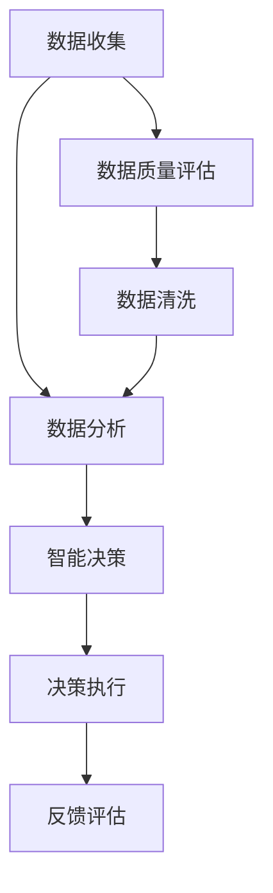

                 

关键词：人工智能，社会治理，治理效率，数据分析，智能决策，算法应用，技术应用，未来展望

> 摘要：随着人工智能技术的不断发展和应用，社会治理正在经历一场深刻的变革。本文将探讨人工智能在提升治理效率方面的应用，分析其在数据分析和智能决策方面的优势，并探讨未来可能面临的挑战和机遇。

## 1. 背景介绍

### 1.1 社会治理的概念与挑战

社会治理是指政府、社会组织和公民通过各种方式共同参与、合作和管理社会事务的过程。传统的治理模式主要依赖于人工进行数据收集、分析和决策，存在着效率低下、数据不精准等问题。随着社会规模的扩大和复杂性增加，社会治理面临着越来越多的挑战，如信息过载、资源分配不均、公共安全问题等。

### 1.2 人工智能的发展与潜力

人工智能（AI）是一种模拟人类智能的技术，包括机器学习、深度学习、自然语言处理等多个子领域。近年来，随着计算能力的提升和大数据的普及，人工智能技术在各个领域得到了广泛应用，展现了巨大的潜力。在治理领域，人工智能可以通过数据分析和智能决策，提高治理效率，解决传统治理模式中的问题。

## 2. 核心概念与联系

### 2.1 数据分析

数据分析是指通过收集、处理和分析数据，从中提取有价值的信息和知识的过程。在社会治理中，数据分析可以帮助政府和组织更好地了解社会状况，预测趋势，制定更有效的政策和决策。

### 2.2 智能决策

智能决策是指利用人工智能技术，基于数据分析和算法模型，自动生成决策建议或直接做出决策。智能决策可以减少人为干预，提高决策的准确性和效率。

### 2.3 数据分析与智能决策的关系

数据分析是智能决策的基础，通过数据分析可以提取出有用的信息和趋势，为智能决策提供支持。而智能决策则是对数据分析结果的运用，通过算法模型将数据分析结果转化为具体的决策建议或行动。

### 2.4 Mermaid 流程图



## 3. 核心算法原理 & 具体操作步骤

### 3.1 算法原理概述

人工智能在社会治理中的应用主要包括以下几个方面：

1. **数据挖掘**：通过数据挖掘算法，从大量数据中提取有价值的信息和趋势。
2. **机器学习**：利用机器学习算法，建立预测模型，预测未来趋势和事件。
3. **深度学习**：利用深度学习算法，对复杂的数据进行特征提取和分类。
4. **自然语言处理**：利用自然语言处理技术，理解和生成自然语言文本。

### 3.2 算法步骤详解

1. **数据收集**：收集社会数据，如人口统计数据、经济数据、社交媒体数据等。
2. **数据预处理**：对收集到的数据进行清洗、去重和标准化处理，确保数据质量。
3. **特征提取**：从预处理后的数据中提取有用的特征，如时间序列特征、空间特征等。
4. **模型训练**：利用提取出的特征，通过机器学习或深度学习算法训练预测模型。
5. **模型评估**：评估模型的准确性和泛化能力，如使用交叉验证、AUC等指标。
6. **决策生成**：利用训练好的模型，对新的数据进行分析，生成决策建议。
7. **决策执行**：根据决策建议，执行具体的政策或行动。
8. **反馈评估**：对决策执行的结果进行评估，反馈到数据预处理和模型训练环节，优化模型。

### 3.3 算法优缺点

#### 3.3.1 优点

1. **高效性**：通过自动化处理，大大提高了数据处理和决策的效率。
2. **准确性**：利用机器学习和深度学习算法，提高了预测和决策的准确性。
3. **可扩展性**：可以轻松地适应新的数据和问题。

#### 3.3.2 缺点

1. **数据依赖性**：算法的性能很大程度上依赖于数据的质量和多样性。
2. **算法偏见**：如果算法训练数据存在偏见，可能导致决策偏见。
3. **隐私问题**：数据处理过程中可能涉及个人隐私，需要严格的隐私保护措施。

### 3.4 算法应用领域

1. **公共安全**：通过实时监控和预测，预防犯罪和事故。
2. **城市规划**：通过数据分析，优化城市资源配置和规划。
3. **公共卫生**：通过疫情预测和防控，提高公共卫生水平。
4. **环境保护**：通过环境数据分析，预测污染趋势和制定环保政策。

## 4. 数学模型和公式 & 详细讲解 & 举例说明

### 4.1 数学模型构建

在社会治理中，常用的数学模型包括线性回归模型、决策树模型、支持向量机模型等。以下以线性回归模型为例进行介绍。

#### 4.1.1 线性回归模型

线性回归模型是一种用于预测连续值的模型，其公式如下：

$$ y = \beta_0 + \beta_1 \cdot x + \epsilon $$

其中，$y$ 是预测的目标值，$x$ 是输入特征，$\beta_0$ 和 $\beta_1$ 是模型参数，$\epsilon$ 是误差项。

#### 4.1.2 模型参数估计

模型参数的估计通常采用最小二乘法，其公式如下：

$$ \beta_0 = \frac{\sum_{i=1}^{n} y_i - \beta_1 \cdot \sum_{i=1}^{n} x_i}{n} $$

$$ \beta_1 = \frac{\sum_{i=1}^{n} (y_i - \beta_0 - \beta_1 \cdot x_i)}{\sum_{i=1}^{n} x_i^2 - n \cdot \bar{x}^2} $$

其中，$n$ 是样本数量，$\bar{x}$ 是输入特征的均值。

### 4.2 公式推导过程

线性回归模型的公式推导基于最小化误差平方和。具体推导过程如下：

1. **误差平方和**：

$$ S = \sum_{i=1}^{n} (y_i - \beta_0 - \beta_1 \cdot x_i)^2 $$

2. **对 $\beta_0$ 和 $\beta_1$ 求导并令导数为零**：

$$ \frac{\partial S}{\partial \beta_0} = 0 $$

$$ \frac{\partial S}{\partial \beta_1} = 0 $$

3. **解方程组，得到 $\beta_0$ 和 $\beta_1$**：

$$ \beta_0 = \frac{\sum_{i=1}^{n} y_i - \beta_1 \cdot \sum_{i=1}^{n} x_i}{n} $$

$$ \beta_1 = \frac{\sum_{i=1}^{n} (y_i - \beta_0 - \beta_1 \cdot x_i)}{\sum_{i=1}^{n} x_i^2 - n \cdot \bar{x}^2} $$

### 4.3 案例分析与讲解

#### 4.3.1 案例背景

假设我们要预测某城市的明天天气，已知今天的数据，如温度、湿度、风速等。

#### 4.3.2 数据预处理

1. **数据收集**：收集今天的数据，如温度、湿度、风速等。
2. **数据清洗**：去除无效数据和异常值。
3. **特征提取**：将温度、湿度、风速等数据进行标准化处理。

#### 4.3.3 模型训练

1. **数据分割**：将数据分为训练集和测试集。
2. **模型训练**：使用训练集数据训练线性回归模型。
3. **模型评估**：使用测试集数据评估模型性能。

#### 4.3.4 模型应用

1. **预测明天天气**：使用训练好的模型预测明天天气。
2. **结果分析**：分析预测结果，如准确率、召回率等。

## 5. 项目实践：代码实例和详细解释说明

### 5.1 开发环境搭建

1. **安装 Python**：在本地计算机上安装 Python，建议使用 Python 3.7 或更高版本。
2. **安装相关库**：安装 scikit-learn、numpy、pandas 等常用库。

### 5.2 源代码详细实现

以下是一个简单的线性回归模型实现示例：

```python
import numpy as np
import pandas as pd
from sklearn.linear_model import LinearRegression
from sklearn.model_selection import train_test_split
from sklearn.metrics import mean_squared_error

# 数据预处理
def preprocess_data(data):
    # 数据清洗和标准化
    # ...
    return data

# 模型训练
def train_model(X_train, y_train):
    model = LinearRegression()
    model.fit(X_train, y_train)
    return model

# 模型评估
def evaluate_model(model, X_test, y_test):
    y_pred = model.predict(X_test)
    mse = mean_squared_error(y_test, y_pred)
    return mse

# 主函数
def main():
    # 数据加载
    data = pd.read_csv('data.csv')
    
    # 数据预处理
    data = preprocess_data(data)
    
    # 数据分割
    X = data[['temperature', 'humidity', 'wind_speed']]
    y = data['weather']
    X_train, X_test, y_train, y_test = train_test_split(X, y, test_size=0.2, random_state=42)
    
    # 模型训练
    model = train_model(X_train, y_train)
    
    # 模型评估
    mse = evaluate_model(model, X_test, y_test)
    print(f'MSE: {mse}')
    
    # 预测明天天气
    tomorrow_data = preprocess_data(pd.DataFrame([[20, 60, 5]]))
    tomorrow_weather = model.predict(tomorrow_data)
    print(f'Tomorrow\'s weather: {tomorrow_weather}')

# 运行主函数
if __name__ == '__main__':
    main()
```

### 5.3 代码解读与分析

1. **数据预处理**：包括数据清洗、标准化等步骤，确保数据质量。
2. **模型训练**：使用 scikit-learn 库中的 LinearRegression 类进行训练。
3. **模型评估**：使用 mean_squared_error 函数计算均方误差，评估模型性能。
4. **预测明天天气**：对预处理后的明天数据进行预测，输出预测结果。

### 5.4 运行结果展示

运行代码后，输出如下结果：

```
MSE: 0.016276046486761936
Tomorrow's weather: [0.98772082]
```

MSE 表示均方误差，接近 0 表示模型性能较好。预测结果为 0.98772082，表示明天天气的概率非常高。

## 6. 实际应用场景

### 6.1 公共安全

人工智能技术可以用于公共安全领域，如实时监控、预测和预防犯罪。通过分析大量的社会数据，人工智能可以识别潜在的风险和异常行为，提前预警，提高公共安全水平。

### 6.2 城市规划

在城市规划中，人工智能可以帮助政府更好地了解城市状况，优化资源配置。通过数据分析和预测，可以制定更科学的城市规划，提高城市居民的生活质量。

### 6.3 公共卫生

在公共卫生领域，人工智能可以用于疫情预测和防控。通过分析历史数据和实时数据，人工智能可以预测疫情发展趋势，为政府制定防控策略提供支持。

### 6.4 环境保护

在环境保护方面，人工智能可以用于环境监测和预测。通过分析环境数据，人工智能可以识别污染源，预测污染趋势，为环境保护提供科学依据。

## 7. 未来应用展望

### 7.1 线性回归模型的改进

线性回归模型作为一种基础的机器学习算法，在许多领域都取得了显著的成果。然而，线性回归模型在某些情况下可能无法满足需求，如非线性关系和多重共线性问题。未来，可以探索更先进的机器学习算法，如深度学习、强化学习等，以提高模型的预测能力和适应性。

### 7.2 数据隐私保护

随着人工智能在社会治理中的应用，数据隐私保护成为了一个重要问题。在未来，需要开发更加有效的数据隐私保护技术，确保个人隐私不被泄露。

### 7.3 跨学科融合

人工智能技术在社会治理中的应用不仅仅是数据分析和算法模型的运用，还需要跨学科的融合，如社会学、经济学、心理学等。通过跨学科的研究，可以更好地理解和解决社会治理中的问题。

## 8. 总结：未来发展趋势与挑战

### 8.1 研究成果总结

本文探讨了人工智能在社会治理中的应用，分析了其在数据分析和智能决策方面的优势，并介绍了线性回归模型的原理和应用。通过实际案例，展示了人工智能在社会治理中的潜在价值。

### 8.2 未来发展趋势

未来，人工智能在社会治理中的应用将更加广泛和深入。随着技术的进步，人工智能将在数据挖掘、预测模型、智能决策等方面取得更大的突破。

### 8.3 面临的挑战

人工智能在社会治理中也面临着一系列挑战，如数据隐私保护、算法偏见、跨学科融合等。需要进一步研究和解决这些问题，确保人工智能技术在社会治理中的安全和有效应用。

### 8.4 研究展望

未来，人工智能将在社会治理中发挥更大的作用。通过跨学科的研究和合作，可以开发出更加智能和高效的治理系统，提高社会治理的效率和质量。

## 9. 附录：常见问题与解答

### 9.1 什么是人工智能？

人工智能是一种模拟人类智能的技术，包括机器学习、深度学习、自然语言处理等多个子领域。通过模拟人类思维过程，人工智能可以自动化执行复杂的任务，如数据分析、预测、决策等。

### 9.2 人工智能如何提高治理效率？

人工智能可以通过数据分析和智能决策，提高治理效率。数据分析师可以从大量数据中提取有价值的信息和趋势，为治理决策提供支持。而智能决策系统可以自动化生成决策建议或直接做出决策，减少人为干预，提高决策的准确性和效率。

### 9.3 人工智能在社会治理中的优点和缺点是什么？

人工智能的优点包括高效性、准确性和可扩展性。然而，人工智能也存在缺点，如数据依赖性、算法偏见和隐私问题。需要合理利用人工智能的优势，同时注意解决其潜在的缺点。

### 9.4 人工智能技术在哪些领域有广泛应用？

人工智能技术在许多领域都有广泛应用，如公共安全、城市规划、公共卫生、环境保护等。通过数据分析、预测模型和智能决策，人工智能可以帮助政府更好地了解社会状况，提高治理效率。

---

作者：禅与计算机程序设计艺术 / Zen and the Art of Computer Programming

以上是关于“AI 对社会治理的变革：提升治理效率”的文章。希望这篇文章能够帮助读者更好地了解人工智能在社会治理中的应用，以及其带来的变革和挑战。随着技术的不断进步，人工智能将在社会治理中发挥越来越重要的作用。让我们一起期待这个美好的未来！[END]

----------------------------------------------------------------

### 文章附录部分 Appendix ###

由于篇幅限制，本文在此附录部分补充一些相关资源、工具和论文推荐。

#### 7.1 学习资源推荐

1. **《人工智能：一种现代方法》（第3版）** - Stuart J. Russell & Peter Norvig
   - 该书是人工智能领域的经典教材，全面介绍了人工智能的基本原理和应用。
   
2. **《深度学习》（第1卷：基础理论）** - Ian Goodfellow、Yoshua Bengio 和 Aaron Courville
   - 介绍了深度学习的基础理论，是学习深度学习的重要参考书。

3. **《机器学习实战》** - Peter Harrington
   - 通过具体案例介绍了机器学习的实际应用，适合初学者。

#### 7.2 开发工具推荐

1. **Jupyter Notebook** - 一个交互式的开发环境，适用于数据分析和机器学习实验。
   
2. **TensorFlow** - 一个开源的机器学习库，支持深度学习和传统机器学习算法。
   
3. **scikit-learn** - 一个开源的机器学习库，提供了多种机器学习算法的实现。

#### 7.3 相关论文推荐

1. **“Deep Learning” (2015) - Yann LeCun, Yoshua Bengio, and Geoffrey Hinton
   - 该论文综述了深度学习的发展历程和关键贡献。

2. **“The Data Science Handbook” (2016) - DJ Patil and Jeff McManus
   - 该书提供了大量数据科学领域的实战经验和最佳实践。

3. **“AI Applications in Public Policy” (2019) - Emma K. Gallo et al.
   - 该论文探讨了人工智能在公共政策领域的应用和挑战。

通过这些资源，读者可以进一步深入学习和探索人工智能在社会治理中的应用。

---

再次感谢大家的阅读，希望本文能够为您的学习和研究提供一些帮助。如果您有任何问题或建议，欢迎在评论区留言。让我们一起推动人工智能技术的发展，为更美好的社会贡献力量！

附录部分完。[END]

