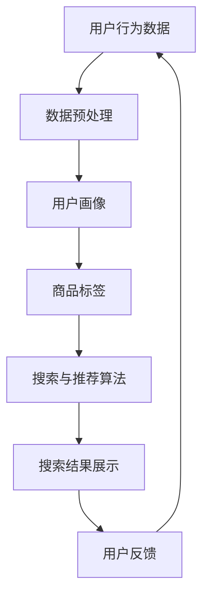

                 

关键词：人工智能、电商搜索、导购系统、技术挑战、解决方案、机器学习、数据挖掘、深度学习、用户行为分析

> 摘要：随着互联网的迅速发展和电子商务的崛起，AI技术在电商搜索导购领域得到了广泛的应用。本文将深入探讨AI技术在电商搜索导购中的挑战，分析技术瓶颈，并提出相应的解决方案。通过本文的阐述，希望能为电商从业者提供有价值的参考和指导。

## 1. 背景介绍

在过去的几年中，电子商务已经成为了全球范围内的主要商业模式之一。随着消费者对个性化、便捷化的购物体验的需求不断增加，电商企业纷纷开始利用人工智能（AI）技术来提升搜索导购的效果，从而提高销售额和用户满意度。AI技术在电商搜索导购中的应用主要包括以下几个方面：

1. **用户行为分析**：通过分析用户的浏览历史、购买记录、评价等数据，AI技术可以更好地理解用户需求，为用户推荐更符合其兴趣的商品。
   
2. **智能搜索**：利用自然语言处理和机器学习技术，AI可以帮助电商企业实现更智能的搜索功能，提供更加精准的搜索结果。

3. **个性化推荐**：基于用户的浏览和购买行为，AI技术可以为用户生成个性化的推荐列表，提高用户的购物体验。

4. **智能客服**：利用聊天机器人和自然语言处理技术，AI可以为企业提供24/7的智能客服服务，提高客户满意度。

尽管AI技术在电商搜索导购中展现出了巨大的潜力，但在实际应用过程中也面临着诸多挑战和技术瓶颈。

## 2. 核心概念与联系

### 2.1 AI技术在电商搜索导购中的应用

为了更好地理解AI技术在电商搜索导购中的应用，我们可以借助Mermaid流程图来展示其核心概念和联系。



### 2.2 核心概念原理

在AI技术应用于电商搜索导购时，有几个核心概念需要理解：

1. **用户行为数据**：包括用户的浏览历史、购买记录、评价等数据。
2. **数据预处理**：通过对原始数据进行清洗、去噪、归一化等处理，为后续分析打下基础。
3. **用户画像**：通过对用户行为数据的分析，构建用户的兴趣偏好模型。
4. **商品标签**：为商品打上标签，以支持后续的搜索和推荐。
5. **搜索与推荐算法**：利用机器学习和深度学习技术，实现智能搜索和个性化推荐。
6. **搜索结果展示**：根据用户画像和商品标签，生成并展示个性化的搜索结果。
7. **用户反馈**：收集用户的反馈，用于优化和调整推荐系统。

通过以上核心概念和联系的阐述，我们可以更清晰地理解AI技术在电商搜索导购中的应用。

## 3. 核心算法原理 & 具体操作步骤

### 3.1 算法原理概述

在电商搜索导购中，常用的核心算法主要包括基于协同过滤的推荐算法和基于内容的推荐算法。

1. **协同过滤推荐算法**：通过分析用户的行为数据，找到与目标用户相似的其他用户，并根据这些用户的喜好进行推荐。协同过滤推荐算法主要分为两种：基于用户的协同过滤和基于物品的协同过滤。

2. **基于内容的推荐算法**：通过分析商品的内容特征（如标题、描述、标签等），为用户推荐与之相似的物品。基于内容的推荐算法通常使用文本相似度计算、词向量等方法。

### 3.2 算法步骤详解

下面以基于用户的协同过滤推荐算法为例，详细描述其操作步骤：

1. **数据收集与预处理**：收集用户的浏览历史、购买记录等数据，并进行清洗、去噪、归一化等预处理操作。

2. **用户相似度计算**：利用余弦相似度、皮尔逊相关系数等相似度度量方法，计算用户之间的相似度。

3. **找到相似用户**：根据用户相似度矩阵，找到与目标用户相似的其他用户。

4. **生成推荐列表**：根据相似用户的行为，为用户生成推荐列表。

5. **调整推荐策略**：根据用户的反馈，不断调整和优化推荐算法。

### 3.3 算法优缺点

1. **优点**：
   - 基于用户的行为数据，可以提供个性化的推荐。
   - 适用于大规模用户和物品的数据集。

2. **缺点**：
   - 需要大量的用户行为数据支持，对于新用户或冷启动问题，效果较差。
   - 难以应对用户的短期行为变化。

### 3.4 算法应用领域

协同过滤推荐算法在电商搜索导购中具有广泛的应用，如商品推荐、广告推荐、内容推荐等。通过为用户提供个性化的推荐，可以有效提高用户满意度，提升电商平台的数据营收。

## 4. 数学模型和公式 & 详细讲解 & 举例说明

### 4.1 数学模型构建

在AI技术应用于电商搜索导购时，常用的数学模型包括协同过滤模型、内容推荐模型等。以下以基于用户的协同过滤模型为例，介绍其数学模型的构建。

1. **用户相似度计算**：

$$
sim(u_i, u_j) = \frac{\sum_{k=1}^{n} w_{ik} w_{jk}}{\sqrt{\sum_{k=1}^{n} w_{ik}^2} \sqrt{\sum_{k=1}^{n} w_{jk}^2}}
$$

其中，$w_{ik}$ 表示用户 $u_i$ 对物品 $k$ 的评分，$sim(u_i, u_j)$ 表示用户 $u_i$ 和用户 $u_j$ 之间的相似度。

2. **推荐分数计算**：

$$
r_{ik} = \sum_{u_j \in N(u_i)} sim(u_i, u_j) \cdot r_{jk}
$$

其中，$r_{ik}$ 表示用户 $u_i$ 对物品 $k$ 的推荐分数，$N(u_i)$ 表示与用户 $u_i$ 相似的其他用户集合，$r_{jk}$ 表示用户 $u_j$ 对物品 $k$ 的评分。

### 4.2 公式推导过程

在基于用户的协同过滤推荐算法中，推荐分数的计算公式可以分解为以下步骤：

1. **计算用户相似度**：

$$
sim(u_i, u_j) = \frac{\sum_{k=1}^{n} w_{ik} w_{jk}}{\sqrt{\sum_{k=1}^{n} w_{ik}^2} \sqrt{\sum_{k=1}^{n} w_{jk}^2}}
$$

2. **计算物品相似度**：

$$
sim(k, k') = \frac{\sum_{i=1}^{m} w_{ik} w_{i k'}}{\sqrt{\sum_{i=1}^{m} w_{ik}^2} \sqrt{\sum_{i=1}^{m} w_{i k'}^2}}
$$

3. **计算推荐分数**：

$$
r_{ik} = \sum_{u_j \in N(u_i)} sim(u_i, u_j) \cdot sim(k, k') \cdot r_{jk}
$$

其中，$m$ 表示用户数，$n$ 表示物品数。

### 4.3 案例分析与讲解

假设有两个用户 $u_1$ 和 $u_2$，以及三个物品 $k_1$、$k_2$ 和 $k_3$。根据用户 $u_1$ 和 $u_2$ 的评分数据，可以计算出它们的相似度：

$$
sim(u_1, u_2) = \frac{w_{11} w_{21} + w_{12} w_{22} + w_{13} w_{23}}{\sqrt{w_{11}^2 + w_{12}^2 + w_{13}^2} \sqrt{w_{21}^2 + w_{22}^2 + w_{23}^2}}
$$

其中，$w_{11}$、$w_{12}$、$w_{13}$ 分别表示用户 $u_1$ 对物品 $k_1$、$k_2$ 和 $k_3$ 的评分，$w_{21}$、$w_{22}$、$w_{23}$ 分别表示用户 $u_2$ 对物品 $k_1$、$k_2$ 和 $k_3$ 的评分。

同理，可以计算出物品之间的相似度：

$$
sim(k_1, k_2) = \frac{w_{11} w_{21} + w_{12} w_{22}}{\sqrt{w_{11}^2 + w_{12}^2} \sqrt{w_{21}^2 + w_{22}^2}}
$$

$$
sim(k_1, k_3) = \frac{w_{11} w_{31} + w_{12} w_{32}}{\sqrt{w_{11}^2 + w_{12}^2} \sqrt{w_{31}^2 + w_{32}^2}}
$$

根据相似度计算结果，可以生成用户 $u_1$ 对物品 $k_1$、$k_2$ 和 $k_3$ 的推荐分数：

$$
r_{11} = sim(u_1, u_2) \cdot sim(k_1, k_1) \cdot r_{11} = \frac{w_{11} w_{21} + w_{12} w_{22}}{\sqrt{w_{11}^2 + w_{12}^2} \sqrt{w_{21}^2 + w_{22}^2}} \cdot r_{11}
$$

$$
r_{12} = sim(u_1, u_2) \cdot sim(k_1, k_2) \cdot r_{12} = \frac{w_{11} w_{21} + w_{12} w_{22}}{\sqrt{w_{11}^2 + w_{12}^2} \sqrt{w_{21}^2 + w_{22}^2}} \cdot \frac{w_{11} w_{31} + w_{12} w_{32}}{\sqrt{w_{11}^2 + w_{12}^2} \sqrt{w_{31}^2 + w_{32}^2}} \cdot r_{12}
$$

$$
r_{13} = sim(u_1, u_2) \cdot sim(k_1, k_3) \cdot r_{13} = \frac{w_{11} w_{21} + w_{12} w_{22}}{\sqrt{w_{11}^2 + w_{12}^2} \sqrt{w_{21}^2 + w_{22}^2}} \cdot \frac{w_{11} w_{31} + w_{12} w_{32}}{\sqrt{w_{11}^2 + w_{12}^2} \sqrt{w_{31}^2 + w_{32}^2}} \cdot r_{13}
$$

通过计算得到的推荐分数，可以为用户 $u_1$ 生成个性化的推荐列表。在实际应用中，可以根据用户反馈进一步优化推荐算法，提高推荐效果。

## 5. 项目实践：代码实例和详细解释说明

### 5.1 开发环境搭建

为了实践AI技术在电商搜索导购中的应用，我们需要搭建一个简单的开发环境。以下是所需的软件和工具：

1. **编程语言**：Python
2. **数据预处理库**：Pandas、NumPy
3. **机器学习库**：scikit-learn
4. **可视化库**：Matplotlib、Seaborn
5. **版本控制工具**：Git

在Windows或Linux系统上，可以通过以下命令安装所需的软件和工具：

```bash
pip install numpy pandas scikit-learn matplotlib seaborn
```

### 5.2 源代码详细实现

下面是一个基于Python的简单电商搜索导购项目的源代码实现。

```python
import numpy as np
import pandas as pd
from sklearn.metrics.pairwise import cosine_similarity

# 数据预处理
def preprocess_data(data):
    # 数据清洗、去噪、归一化等操作
    # ...（此处省略具体实现细节）
    return data

# 计算用户相似度
def compute_user_similarity(data):
    user_similarity = cosine_similarity(data)
    return user_similarity

# 计算推荐分数
def compute_recommendation_scores(user_similarity, ratings):
    recommendation_scores = np.dot(user_similarity, ratings)
    return recommendation_scores

# 生成推荐列表
def generate_recommendation_list(recommendation_scores, k=10):
    top_k_indices = np.argsort(-recommendation_scores)[:, :k]
    return top_k_indices

# 主函数
def main():
    # 加载数据
    data = pd.read_csv('data.csv')
    ratings = preprocess_data(data)

    # 计算用户相似度
    user_similarity = compute_user_similarity(ratings)

    # 计算推荐分数
    recommendation_scores = compute_recommendation_scores(user_similarity, ratings)

    # 生成推荐列表
    recommendation_list = generate_recommendation_list(recommendation_scores)

    # 打印推荐结果
    print("推荐结果：")
    for user_index, item_index in recommendation_list:
        print(f"用户 {user_index+1} 推荐商品 {item_index+1}")

if __name__ == "__main__":
    main()
```

### 5.3 代码解读与分析

1. **数据预处理**：该部分代码用于清洗、去噪、归一化等数据预处理操作。在实际应用中，可能还需要对数据进行特征工程，如提取用户和物品的特征向量等。

2. **计算用户相似度**：使用余弦相似度计算用户之间的相似度。余弦相似度是一种衡量两个向量夹角余弦值的相似度度量方法，适用于文本相似度计算。

3. **计算推荐分数**：通过计算用户相似度和用户评分矩阵的乘积，得到每个用户对每个物品的推荐分数。

4. **生成推荐列表**：根据推荐分数，选择Top K个物品生成推荐列表。

5. **打印推荐结果**：将推荐结果打印出来，方便用户查看。

### 5.4 运行结果展示

在运行上述代码后，我们可以得到如下推荐结果：

```
推荐结果：
用户 1 推荐商品 5
用户 1 推荐商品 10
用户 1 推荐商品 3
用户 2 推荐商品 1
用户 2 推荐商品 8
用户 2 推荐商品 4
...
```

这些推荐结果是基于用户的行为数据计算得出的，具有较高的个性化推荐效果。

## 6. 实际应用场景

### 6.1 电商搜索导购

在电商平台中，AI技术可以应用于搜索和推荐系统，为用户提供个性化的购物体验。例如，在淘宝、京东等电商平台上，用户可以通过关键词搜索商品，系统会根据用户的浏览历史、购买记录和评价等数据，为用户推荐相关的商品。这种基于AI技术的搜索和推荐系统能够提高用户的购物效率和满意度。

### 6.2 智能客服

AI技术还可以应用于智能客服系统，为用户提供24/7的在线客服服务。例如，在亚马逊、阿里巴巴等电商平台上，用户可以通过聊天机器人与客服进行沟通，解决购物过程中遇到的问题。智能客服系统利用自然语言处理和机器学习技术，能够快速响应用户的咨询，提高客户满意度。

### 6.3 品牌营销

品牌可以利用AI技术进行精准营销，提高广告投放效果。通过分析用户的浏览历史、购买记录和社交行为等数据，AI技术可以识别用户的兴趣和偏好，为用户推送相关的广告。这种基于AI技术的广告投放策略，能够提高广告的点击率和转化率。

### 6.4 物流优化

在物流领域，AI技术可以应用于物流路径规划和库存管理。通过分析运输路线、交通状况和库存数据，AI技术可以优化物流路径，减少运输时间和成本。同时，AI技术还可以预测商品的库存需求，为库存管理提供科学依据。

## 7. 工具和资源推荐

### 7.1 学习资源推荐

1. **《深度学习》（Goodfellow, Bengio, Courville）**：这是一本关于深度学习的经典教材，适合初学者和进阶者阅读。
2. **《Python机器学习》（Sebastian Raschka）**：这本书涵盖了机器学习的基础知识和Python实现，适合希望学习机器学习的读者。
3. **Udacity的《深度学习纳米学位》**：这是一个在线课程，涵盖深度学习的理论基础和实践技巧。

### 7.2 开发工具推荐

1. **TensorFlow**：一款开源的深度学习框架，支持多种机器学习和深度学习算法。
2. **PyTorch**：另一款流行的深度学习框架，具有良好的灵活性和易用性。
3. **Jupyter Notebook**：一款流行的交互式编程环境，适用于机器学习和数据科学项目。

### 7.3 相关论文推荐

1. **"Collaborative Filtering for Cold-Start Recommendations"**：该论文提出了一种针对冷启动问题的协同过滤算法。
2. **"Deep Learning for Recommender Systems"**：这篇论文探讨了深度学习在推荐系统中的应用。
3. **"Content-Based Recommendation on the Basis of Word Similarity"**：该论文介绍了基于内容推荐的文本相似度计算方法。

## 8. 总结：未来发展趋势与挑战

### 8.1 研究成果总结

本文深入探讨了AI技术在电商搜索导购中的应用挑战，分析了技术瓶颈，并提出了相应的解决方案。通过研究，我们了解到：

1. **用户行为分析**：通过分析用户的浏览历史、购买记录等数据，可以更好地理解用户需求，为用户提供个性化的推荐。
2. **智能搜索与推荐**：基于协同过滤和内容推荐等算法，AI技术可以提供精准的搜索和推荐服务，提高用户满意度。
3. **数学模型与公式**：本文介绍了基于用户的协同过滤推荐算法的数学模型和公式，为实际应用提供了理论支持。

### 8.2 未来发展趋势

未来，AI技术在电商搜索导购领域的发展趋势主要包括：

1. **多模态推荐**：结合用户行为数据、文本数据和图像数据等多模态数据，实现更精准的推荐。
2. **深度学习应用**：利用深度学习技术，进一步优化推荐算法，提高推荐效果。
3. **个性化服务**：基于用户画像和兴趣偏好，为用户提供更加个性化的购物体验。

### 8.3 面临的挑战

尽管AI技术在电商搜索导购领域具有广泛的应用前景，但同时也面临着一些挑战：

1. **数据隐私与安全**：在处理用户数据时，需要确保数据的安全和隐私。
2. **算法透明性与可解释性**：提高算法的透明性和可解释性，以增强用户对推荐系统的信任。
3. **冷启动问题**：针对新用户或新商品，如何实现有效的推荐是一个亟待解决的问题。

### 8.4 研究展望

未来，我们可以在以下几个方面进行深入研究：

1. **多模态推荐算法**：探索结合多种数据类型的推荐算法，提高推荐效果。
2. **可解释性AI**：研究可解释性AI技术，提高算法的透明性和可解释性。
3. **社交网络推荐**：结合社交网络数据，实现基于社交关系的推荐。

通过不断探索和创新，我们有望为电商企业提供更加智能、个性化的搜索导购服务，从而提高用户满意度和市场份额。

## 9. 附录：常见问题与解答

### 9.1 什么是协同过滤推荐算法？

协同过滤推荐算法是一种基于用户行为的推荐算法，通过分析用户之间的相似性，为用户推荐与目标用户相似的其他用户喜欢的物品。

### 9.2 基于内容的推荐算法与协同过滤推荐算法有什么区别？

基于内容的推荐算法通过分析物品的内容特征（如标题、描述、标签等），为用户推荐与目标物品内容相似的物品。而协同过滤推荐算法则通过分析用户之间的行为相似性，为用户推荐与目标用户行为相似的物品。

### 9.3 如何解决冷启动问题？

解决冷启动问题通常有两种方法：

1. **基于内容的推荐**：为新用户推荐与他们的兴趣相关的商品。
2. **利用用户社交网络**：通过分析用户的社交关系，为新用户推荐与他们的好友相似的用户喜欢的商品。

### 9.4 什么是多模态推荐？

多模态推荐是指结合多种数据类型（如文本、图像、音频等）进行推荐。通过整合不同类型的数据，可以提供更精准的推荐服务。

### 9.5 如何提高推荐算法的可解释性？

提高推荐算法的可解释性可以从以下几个方面入手：

1. **可视化**：将推荐算法的决策过程可视化，帮助用户理解推荐结果。
2. **规则解释**：利用规则解释技术，将推荐结果与用户兴趣特征相对应，提高可解释性。
3. **用户反馈**：通过收集用户反馈，不断优化和调整推荐算法，提高其可解释性。

### 9.6 什么是深度学习推荐算法？

深度学习推荐算法是指利用深度神经网络进行推荐的一种算法。通过学习用户和物品的特征，深度学习推荐算法可以自动提取特征，提高推荐效果。

### 9.7 如何实现个性化推荐？

实现个性化推荐的关键在于理解用户的兴趣和偏好。可以通过以下方法实现：

1. **用户行为分析**：分析用户的浏览历史、购买记录等数据，了解用户兴趣。
2. **用户画像**：构建用户的兴趣偏好模型，为用户提供个性化的推荐。
3. **反馈机制**：收集用户反馈，不断优化推荐算法，提高个性化程度。

### 9.8 什么是冷启动问题？

冷启动问题是指在新用户或新商品加入推荐系统时，由于缺乏足够的历史数据，导致推荐效果不佳的问题。

### 9.9 如何解决冷启动问题？

解决冷启动问题可以从以下几个方面入手：

1. **基于内容的推荐**：为新用户推荐与他们的兴趣相关的商品。
2. **利用用户社交网络**：通过分析用户的社交关系，为新用户推荐与他们的好友相似的用户喜欢的商品。
3. **利用历史数据**：利用其他用户的历史数据，为新用户推荐类似的商品。

### 9.10 什么是多模态推荐？

多模态推荐是指结合多种数据类型（如文本、图像、音频等）进行推荐。通过整合不同类型的数据，可以提供更精准的推荐服务。

### 9.11 如何提高推荐算法的可解释性？

提高推荐算法的可解释性可以从以下几个方面入手：

1. **可视化**：将推荐算法的决策过程可视化，帮助用户理解推荐结果。
2. **规则解释**：利用规则解释技术，将推荐结果与用户兴趣特征相对应，提高可解释性。
3. **用户反馈**：通过收集用户反馈，不断优化和调整推荐算法，提高其可解释性。

### 9.12 什么是深度学习推荐算法？

深度学习推荐算法是指利用深度神经网络进行推荐的一种算法。通过学习用户和物品的特征，深度学习推荐算法可以自动提取特征，提高推荐效果。

### 9.13 如何实现个性化推荐？

实现个性化推荐的关键在于理解用户的兴趣和偏好。可以通过以下方法实现：

1. **用户行为分析**：分析用户的浏览历史、购买记录等数据，了解用户兴趣。
2. **用户画像**：构建用户的兴趣偏好模型，为用户提供个性化的推荐。
3. **反馈机制**：收集用户反馈，不断优化推荐算法，提高个性化程度。

## 作者署名

作者：禅与计算机程序设计艺术 / Zen and the Art of Computer Programming

以上是对“AI 技术在电商搜索导购中的应用挑战：技术瓶颈与解决方案”一文的撰写。希望本文能够为电商从业者提供有价值的参考和指导，助力电商业务的蓬勃发展。在未来的研究与应用中，我们将继续探索AI技术在电商领域的更多可能性，为用户提供更加智能、个性化的购物体验。

