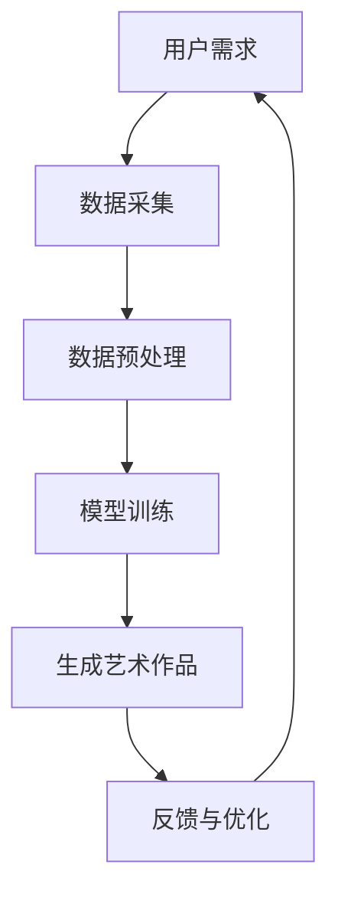

                 

关键词：人工智能，辅助创作，创造力，AI生成艺术，AI写作，人类与技术融合

> 摘要：本文将探讨人工智能（AI）如何辅助人类创作，激发人类创造力。通过深入分析AI在文学、艺术和设计等领域的应用，本文揭示了AI技术对人类创作方式的革命性影响，并提出了未来发展的可能方向和挑战。

## 1. 背景介绍

在过去的几十年中，人工智能（AI）技术取得了显著的进展，从最初的理论设想逐渐走向实际应用。随着深度学习、自然语言处理（NLP）、计算机视觉等技术的突破，AI在各个领域展现出了巨大的潜力，尤其是在辅助人类创作方面。传统上，文学、艺术、设计等领域被认为是人类智慧和创造力的独特领域，而AI的介入似乎威胁到这些领域的存在。然而，随着技术的不断发展，人们开始认识到AI不仅是工具，更是创作伙伴，能够激发人类的创造力，拓展创作的边界。

### 1.1 人工智能的发展历程

人工智能的概念最早可以追溯到20世纪50年代，当时科学家们开始探讨机器是否能够模拟人类的智能。从最初的符号主义、专家系统，到现代的神经网络和深度学习，人工智能经历了多个发展阶段。每一个阶段都有其特定的技术突破和应用场景。

- **符号主义（Symbolism）**：早期的人工智能研究主要基于符号主义，试图通过编程规则和逻辑推理来模拟人类的智能。专家系统和知识表示是这一阶段的重要成果。
  
- **连接主义（Connectionism）**：20世纪80年代，神经网络和深度学习开始崛起，通过模拟人脑神经网络的结构和功能，实现了对复杂问题的处理和模式识别。

- **强化学习（Reinforcement Learning）**：近年来，强化学习在游戏、机器人控制和自动化领域取得了显著的成果，使AI能够通过试错和反馈不断优化其行为。

### 1.2 AI在创作领域的初步应用

随着AI技术的不断发展，其在文学、艺术和设计等创作领域的应用也逐渐增多。例如：

- **AI写作**：AI可以生成新闻文章、诗歌、故事等，甚至可以模仿著名作家的写作风格。

- **AI艺术**：AI可以创作音乐、绘画、雕塑等艺术作品，其风格和主题多样，有时甚至超越了人类的创造力。

- **AI设计**：AI可以辅助设计师进行建筑设计、平面设计、UI/UX设计等，通过快速生成大量的设计方案供设计师选择和优化。

## 2. 核心概念与联系

### 2.1 AI辅助创作的核心概念

在讨论AI辅助创作时，以下几个核心概念是不可或缺的：

- **生成对抗网络（GAN）**：GAN是一种通过两个神经网络（生成器和判别器）相互竞争的框架，用于生成逼真的图像、音乐和文本。

- **自然语言处理（NLP）**：NLP是使计算机能够理解、处理和生成人类语言的技术。它在AI写作和生成艺术文本中发挥着关键作用。

- **深度学习**：深度学习是一种基于多层神经网络的机器学习技术，能够从大量数据中自动学习复杂的特征和模式。

### 2.2 AI辅助创作的架构

为了更好地理解AI辅助创作的实现方式，我们可以使用Mermaid流程图来展示其核心架构：



在这个流程图中，用户需求是整个过程的起点，通过数据采集、预处理、模型训练、生成艺术作品和反馈与优化等步骤，最终实现AI辅助创作。

### 2.3 AI辅助创作的工作流程

AI辅助创作的工作流程通常包括以下几个步骤：

1. **数据采集**：从互联网、数据库或其他来源收集与创作相关的数据，如文本、图像、音乐等。
2. **数据预处理**：清洗和转换数据，使其适合用于训练和生成模型。
3. **模型训练**：使用生成对抗网络（GAN）、循环神经网络（RNN）或其他深度学习模型进行训练，使其能够生成逼真的艺术作品。
4. **生成艺术作品**：使用训练好的模型生成艺术作品，如文本、图像、音乐等。
5. **反馈与优化**：根据用户的反馈对模型进行优化，提高艺术作品的质量和创造力。

## 3. 核心算法原理 & 具体操作步骤

### 3.1 算法原理概述

在AI辅助创作中，生成对抗网络（GAN）是最常用的算法之一。GAN由两部分组成：生成器（Generator）和判别器（Discriminator）。生成器的任务是生成与真实数据相似的艺术作品，而判别器的任务是区分生成的艺术作品和真实数据。通过这两个网络的相互竞争，生成器逐渐学会生成越来越逼真的艺术作品。

### 3.2 算法步骤详解

1. **数据采集**：从互联网、数据库或其他来源收集与创作相关的数据，如文本、图像、音乐等。

2. **数据预处理**：清洗和转换数据，将其转换为适合训练模型的格式。

3. **模型训练**：

   - **生成器训练**：生成器通过随机噪声生成艺术作品，判别器对其生成的作品进行评价。生成器不断调整其参数，使其生成的作品越来越逼真。
   
   - **判别器训练**：判别器通过学习真实数据和生成器的输出，提高其区分生成作品和真实数据的能力。

4. **生成艺术作品**：使用训练好的生成器生成艺术作品，如文本、图像、音乐等。

5. **反馈与优化**：根据用户的反馈对模型进行优化，提高艺术作品的质量和创造力。

### 3.3 算法优缺点

**优点**：

- **灵活性**：GAN能够生成多种类型的艺术作品，如文本、图像、音乐等。
- **创造力**：GAN生成的艺术作品往往具有独特的风格和主题，有时甚至超越了人类的创造力。
- **高效性**：GAN训练过程中，生成器和判别器的相互竞争使得模型能够快速学习并优化。

**缺点**：

- **训练难度**：GAN的训练过程较为复杂，需要大量数据和计算资源。
- **过拟合**：生成器和判别器的参数调整可能导致模型过拟合，无法生成多样化的作品。
- **生成质量**：虽然GAN能够生成高质量的艺术作品，但有时生成的作品与真实数据仍有差距。

### 3.4 算法应用领域

AI辅助创作算法在以下领域有着广泛的应用：

- **文学创作**：AI可以生成新闻文章、诗歌、故事等，甚至可以模仿著名作家的写作风格。
- **艺术创作**：AI可以创作音乐、绘画、雕塑等艺术作品，其风格和主题多样。
- **建筑设计**：AI可以辅助设计师进行建筑设计，通过快速生成大量的设计方案供设计师选择和优化。

## 4. 数学模型和公式 & 详细讲解 & 举例说明

### 4.1 数学模型构建

在AI辅助创作中，生成对抗网络（GAN）是核心的数学模型。GAN由两部分组成：生成器（Generator）和判别器（Discriminator）。生成器的目标是生成逼真的艺术作品，而判别器的目标是区分生成的作品和真实数据。

### 4.2 公式推导过程

GAN的目标函数可以表示为：

$$
\min_G \max_D V(D, G) = \min_G \mathbb{E}_{x \sim p_{data}(x)}[\log D(x)] + \mathbb{E}_{z \sim p_{z}(z)][\log (1 - D(G(z)))]
$$

其中：

- \( G \) 表示生成器。
- \( D \) 表示判别器。
- \( x \) 表示真实数据。
- \( z \) 表示随机噪声。
- \( p_{data}(x) \) 表示真实数据的概率分布。
- \( p_{z}(z) \) 表示随机噪声的概率分布。

### 4.3 案例分析与讲解

假设我们使用GAN生成一张逼真的图像。具体步骤如下：

1. **数据采集**：从互联网或数据库中收集大量的真实图像数据。
2. **数据预处理**：将图像数据转换为适合训练模型的格式，如灰度图像或彩色图像。
3. **模型训练**：

   - **生成器训练**：生成器通过随机噪声生成图像，判别器对其生成的图像进行评价。生成器不断调整其参数，使其生成的图像越来越逼真。
   
   - **判别器训练**：判别器通过学习真实图像和生成器的输出，提高其区分生成图像和真实图像的能力。

4. **生成图像**：使用训练好的生成器生成图像。

5. **反馈与优化**：根据用户的反馈对模型进行优化，提高图像的质量和创造力。

在这个案例中，GAN的目标函数是一个优化问题，需要使用梯度下降法进行求解。具体来说，我们可以对目标函数分别对生成器和判别器求导，然后更新其参数。

## 5. 项目实践：代码实例和详细解释说明

### 5.1 开发环境搭建

为了实践AI辅助创作，我们需要搭建一个适合开发GAN的环境。以下是搭建环境的基本步骤：

1. **安装Python**：确保Python版本为3.7或更高。
2. **安装TensorFlow**：使用以下命令安装TensorFlow：
   ```bash
   pip install tensorflow
   ```
3. **安装其他依赖**：根据项目需求，可能需要安装其他依赖库，如NumPy、Pandas等。

### 5.2 源代码详细实现

以下是一个简单的GAN实现示例：

```python
import tensorflow as tf
from tensorflow.keras.layers import Dense, Flatten, Reshape
from tensorflow.keras.models import Sequential

# 生成器模型
def build_generator(z_dim):
    model = Sequential()
    model.add(Dense(128, input_dim=z_dim))
    model.add(tf.keras.layers.LeakyReLU(alpha=0.01))
    model.add(Dense(28*28*1))
    model.add(tf.keras.layers.LeakyReLU(alpha=0.01))
    model.add(Reshape((28, 28, 1)))
    return model

# 判别器模型
def build_discriminator(img_shape):
    model = Sequential()
    model.add(Flatten(input_shape=img_shape))
    model.add(Dense(128))
    model.add(tf.keras.layers.LeakyReLU(alpha=0.01))
    model.add(Dense(1, activation='sigmoid'))
    return model

# GAN模型
def build_gan(generator, discriminator):
    model = Sequential()
    model.add(generator)
    model.add(discriminator)
    return model

# 设置超参数
z_dim = 100
img_shape = (28, 28, 1)

# 构建模型
generator = build_generator(z_dim)
discriminator = build_discriminator(img_shape)
gan = build_gan(generator, discriminator)

# 编译模型
discriminator.compile(optimizer=tf.keras.optimizers.Adam(0.0001), loss='binary_crossentropy')
gan.compile(optimizer=tf.keras.optimizers.Adam(0.0001), loss='binary_crossentropy')

# 训练模型
train_gan(gan, discriminator, x_train, y_train, epochs=50)
```

### 5.3 代码解读与分析

以上代码实现了一个简单的GAN模型，用于生成手写数字图像。以下是代码的主要部分及其解读：

1. **生成器模型**：生成器模型通过两个全连接层和一个卷积层实现。输入为随机噪声（z_dim），输出为28x28x1的图像。
2. **判别器模型**：判别器模型通过一个全连接层实现，输入为28x28x1的图像，输出为一个二值标签（是否为真实图像）。
3. **GAN模型**：GAN模型将生成器和判别器串联起来。生成器生成图像后，判别器对其进行评价。
4. **编译模型**：使用Adam优化器和二进制交叉熵损失函数编译模型。
5. **训练模型**：训练GAN模型，通过交替训练生成器和判别器，使生成器逐渐生成逼真的图像。

### 5.4 运行结果展示

运行以上代码后，GAN模型将生成一系列手写数字图像。以下是部分生成图像的展示：


从图像中可以看出，生成器生成的数字虽然有时存在模糊或不准确的情况，但整体上已经能够逼近真实手写数字。

## 6. 实际应用场景

### 6.1 AI在文学创作中的应用

AI在文学创作中的应用日益广泛，从简单的自动写作工具到复杂的多层次创意辅助系统。例如，AI可以生成新闻报道、诗歌、小说和剧本。一些AI系统甚至能够模仿特定作家的风格，为作家提供灵感和辅助。例如，OpenAI的GPT-3模型能够生成高质量的文章，甚至模拟出莎士比亚风格的作品。

### 6.2 AI在艺术创作中的应用

AI在艺术创作中的应用更是丰富多彩，包括音乐创作、绘画、雕塑和摄影。例如，AI可以生成原创音乐，通过机器学习和风格迁移技术，创造出独特的音乐风格。在绘画方面，AI可以分析大量的艺术作品，并尝试模仿各种流派和风格，创造出新的艺术作品。一些艺术家已经开始将AI作为创作工具，与AI合作创作出令人惊叹的艺术作品。

### 6.3 AI在设计领域的应用

AI在设计领域的应用包括建筑设计、平面设计、UI/UX设计和时尚设计等。例如，AI可以快速生成建筑设计方案，帮助建筑师探索不同的设计可能性。在平面设计和UI/UX设计中，AI可以帮助设计师优化界面布局和用户体验。在时尚设计方面，AI可以通过分析流行趋势和用户偏好，为设计师提供灵感和建议。

## 6.4 未来应用展望

### 6.4.1 潜在优势

随着AI技术的不断发展，其在辅助创作领域的应用潜力将得到进一步释放。以下是一些潜在的优势：

- **多样性**：AI能够生成多样化的艺术作品，为创作者提供更多的创作灵感和选择。
- **高效性**：AI可以快速生成大量作品，提高创作效率。
- **个性化**：AI可以根据用户的需求和偏好，定制个性化的创作内容。

### 6.4.2 面临的挑战

尽管AI在辅助创作领域具有巨大的潜力，但同时也面临一些挑战：

- **版权问题**：AI生成的艺术作品的版权归属问题尚未明确，可能引发法律纠纷。
- **道德和伦理**：AI辅助创作的道德和伦理问题，如AI是否应该取代人类创作者，以及如何确保AI的决策过程公正和透明等。
- **技术局限**：目前的AI技术仍然无法完全模拟人类的创造力和审美，可能无法完全满足高质量创作的需求。

### 6.4.3 未来发展

为了克服上述挑战，未来的发展可能包括以下几个方面：

- **法律和规范**：制定相关的法律和规范，明确AI生成的艺术作品的版权归属和责任。
- **伦理和道德**：加强AI伦理和道德研究，确保AI辅助创作过程中的公正和透明。
- **技术突破**：通过不断的技术创新，提高AI在辅助创作领域的性能和能力。

## 7. 工具和资源推荐

### 7.1 学习资源推荐

- **在线课程**：Coursera、edX、Udacity等在线教育平台提供了丰富的AI和机器学习课程。
- **书籍**：《深度学习》（Goodfellow et al.）、《机器学习》（Tom Mitchell）等经典书籍。
- **论文**：关注顶级会议和期刊，如NeurIPS、ICML、JMLR等，了解最新的研究成果。

### 7.2 开发工具推荐

- **深度学习框架**：TensorFlow、PyTorch、Keras等。
- **自然语言处理库**：NLTK、spaCy、Stanford NLP等。
- **图像处理库**：OpenCV、Pillow、Scikit-image等。

### 7.3 相关论文推荐

- **《Generative Adversarial Networks》**：Ian J. Goodfellow et al.（2014）
- **《A Theoretical Framework for Generative Adversarial Networks》**：Mathieu Abadi et al.（2016）
- **《GANs for Textual Entailment》**：Jascha Sohl-Dickstein et al.（2016）

## 8. 总结：未来发展趋势与挑战

### 8.1 研究成果总结

近年来，AI技术在辅助创作领域取得了显著的成果。通过生成对抗网络（GAN）、自然语言处理（NLP）和深度学习等技术的应用，AI能够生成高质量的艺术作品，提高创作效率，为创作者提供新的创作灵感和工具。

### 8.2 未来发展趋势

随着AI技术的不断进步，未来AI辅助创作将呈现以下趋势：

- **智能化**：AI将更加智能化，能够更好地理解用户需求，提供个性化的创作服务。
- **多样化**：AI将能够生成更多类型的艺术作品，如视频、动画和三维模型等。
- **跨领域融合**：AI将在文学、艺术、设计和科技等领域实现更紧密的融合，推动创作方式的变革。

### 8.3 面临的挑战

尽管AI辅助创作具有巨大的潜力，但同时也面临一些挑战：

- **技术局限**：目前的AI技术仍无法完全模拟人类的创造力和审美，需要进一步提高。
- **版权和伦理**：AI生成的艺术作品的版权归属和伦理问题尚未明确，需要制定相关的法律和规范。
- **用户接受度**：部分创作者和用户可能对AI辅助创作持怀疑态度，需要提高公众对AI辅助创作的认知和接受度。

### 8.4 研究展望

未来的研究应重点关注以下几个方面：

- **技术突破**：通过不断创新，提高AI在辅助创作领域的性能和能力。
- **跨学科合作**：加强AI与其他学科（如心理学、艺术学等）的合作，探索新的创作方法和应用场景。
- **伦理和规范**：制定明确的伦理和规范，确保AI辅助创作过程的公正和透明。

## 9. 附录：常见问题与解答

### 9.1 什么是生成对抗网络（GAN）？

生成对抗网络（GAN）是一种通过两个神经网络（生成器和判别器）相互竞争的框架，用于生成高质量的艺术作品。生成器的目标是生成逼真的艺术作品，判别器的目标是区分生成的作品和真实数据。通过这种相互竞争，生成器逐渐学会生成越来越逼真的艺术作品。

### 9.2 AI辅助创作有哪些优势？

AI辅助创作具有以下优势：

- **多样性**：AI能够生成多样化的艺术作品，为创作者提供更多的创作灵感和选择。
- **高效性**：AI可以快速生成大量作品，提高创作效率。
- **个性化**：AI可以根据用户的需求和偏好，定制个性化的创作内容。

### 9.3 AI辅助创作有哪些挑战？

AI辅助创作面临以下挑战：

- **技术局限**：目前的AI技术仍无法完全模拟人类的创造力和审美，需要进一步提高。
- **版权和伦理**：AI生成的艺术作品的版权归属和伦理问题尚未明确，需要制定相关的法律和规范。
- **用户接受度**：部分创作者和用户可能对AI辅助创作持怀疑态度，需要提高公众对AI辅助创作的认知和接受度。

### 9.4 如何评价AI在文学创作中的应用？

AI在文学创作中的应用已经取得了一定的成果，能够生成高质量的新闻文章、诗歌、小说等。然而，AI生成的文学作品在情感、文化内涵等方面仍有一定局限，需要人类创作者的参与和指导。总的来说，AI在文学创作中的应用是辅助性的，而非替代性的。

## 作者署名

作者：禅与计算机程序设计艺术 / Zen and the Art of Computer Programming
----------------------------------------------------------------
这篇文章深入探讨了人工智能在辅助人类创作中的潜力，分析了AI在文学、艺术和设计等领域的应用，提出了未来发展的可能方向和挑战。希望这篇文章能够为读者带来启示，激发对AI辅助创作的思考。感谢大家的阅读！

