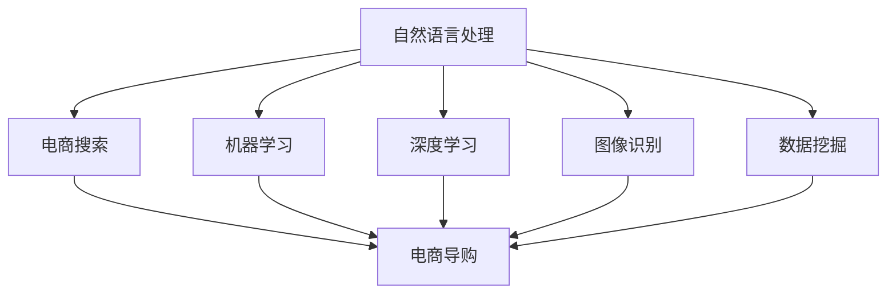
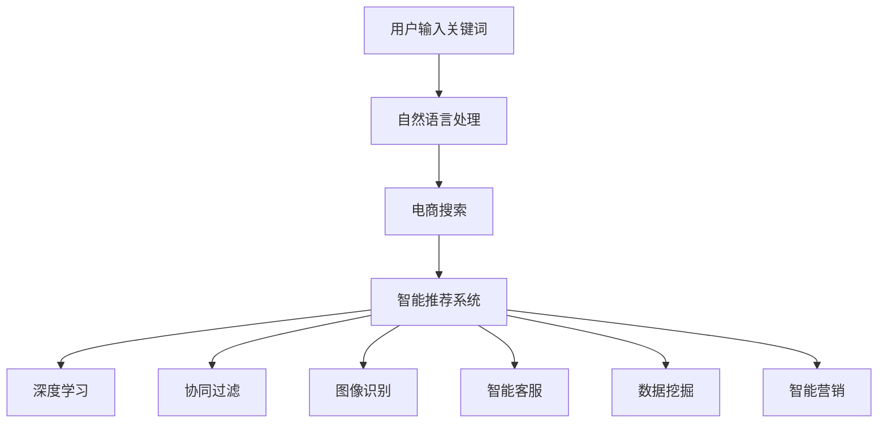

                 

关键词：人工智能、电商搜索、导购、发展趋势、算法、技术应用、数学模型、案例分析、实践应用

> 摘要：本文深入探讨了人工智能在电商搜索导购领域的应用与发展趋势。通过对核心概念的介绍、算法原理的分析、数学模型的构建、具体实践案例的展示，以及工具和资源的推荐，本文旨在为读者提供一个全面、系统的理解和展望。

## 1. 背景介绍

随着互联网和电子商务的飞速发展，电商市场已经成为了全球商业的新热点。在这个市场中，消费者的购物行为逐渐从线下转移到线上，而电商平台的竞争也越来越激烈。为了吸引更多的消费者并提升用户购物体验，电商平台纷纷推出了各种智能搜索和导购功能。这些功能不仅可以帮助消费者快速找到所需的商品，还能通过个性化推荐提高购买转化率。

然而，传统的搜索和导购技术已经无法满足日益增长的数据量和复杂的用户需求。于是，人工智能（AI）技术逐渐成为电商搜索导购领域的重要驱动力。通过深度学习、自然语言处理、图像识别等技术，AI可以更好地理解和满足消费者的需求，从而提升电商平台的竞争力和用户满意度。

本文将从以下几个方面对AI驱动电商搜索导购进行探讨：

1. 核心概念与联系
2. 核心算法原理与操作步骤
3. 数学模型和公式
4. 项目实践：代码实例
5. 实际应用场景
6. 未来应用展望
7. 工具和资源推荐
8. 总结：未来发展趋势与挑战

## 2. 核心概念与联系

在探讨AI驱动电商搜索导购之前，我们需要了解一些核心概念和它们之间的关系。

### 2.1 电商搜索

电商搜索是电商平台为消费者提供的一种查找商品的方法。通过输入关键词或选择筛选条件，消费者可以在海量的商品信息中快速找到所需的商品。传统的电商搜索主要依赖于关键字匹配和分类检索等技术，而AI驱动的电商搜索则通过自然语言处理和机器学习等技术，实现更智能、更精准的搜索结果。

### 2.2 电商导购

电商导购是电商平台为消费者提供的一种个性化推荐服务。通过分析消费者的购买历史、浏览记录和兴趣爱好等数据，电商平台可以推荐符合消费者需求的商品。传统的电商导购主要依赖于基于规则的推荐算法，而AI驱动的电商导购则通过深度学习、协同过滤等技术，实现更个性化、更精准的推荐。

### 2.3 关键技术

在AI驱动电商搜索导购中，涉及到的关键技术包括：

- 自然语言处理（NLP）：用于理解和处理自然语言，实现语义搜索和智能问答等功能。
- 机器学习（ML）：用于从数据中学习规律和模式，实现智能分类、预测和推荐等功能。
- 深度学习（DL）：一种特殊的机器学习方法，通过多层神经网络实现更复杂的特征提取和模型优化。
- 图像识别：用于识别和分类图像中的物体和场景，实现商品识别和图像搜索等功能。
- 数据挖掘：用于从大量数据中提取有价值的信息和知识，支持智能决策和个性化推荐等功能。

这些技术相互关联，共同构成了AI驱动电商搜索导购的核心框架。下面，我们将通过Mermaid流程图展示这些技术之间的关系。



### 2.4 AI在电商搜索导购中的应用

AI技术在电商搜索导购中的应用非常广泛，主要包括以下几个方面：

- 智能搜索：通过自然语言处理和机器学习技术，实现更精准、更智能的搜索结果。
- 个性化推荐：通过深度学习和协同过滤技术，实现更个性化、更精准的商品推荐。
- 商品识别：通过图像识别技术，实现商品识别和图像搜索功能。
- 智能客服：通过自然语言处理和机器学习技术，实现智能客服和智能问答功能。
- 智能营销：通过数据挖掘和机器学习技术，实现精准营销和用户行为分析。

下面，我们将通过一个具体的Mermaid流程图展示这些应用。



## 3. 核心算法原理 & 具体操作步骤

在了解了AI驱动电商搜索导购的核心概念和关键技术后，我们将进一步探讨其中的核心算法原理和具体操作步骤。

### 3.1 算法原理概述

AI驱动电商搜索导购的核心算法主要包括自然语言处理、机器学习、深度学习、图像识别和数据挖掘等。下面，我们简要介绍这些算法的原理。

- **自然语言处理（NLP）**：NLP是一种人工智能技术，用于理解、处理和生成自然语言。在电商搜索导购中，NLP可以用于处理用户输入的关键词，提取关键词的语义信息，从而实现更精准的搜索和推荐。
- **机器学习（ML）**：ML是一种通过从数据中学习规律和模式来改善性能的人工智能技术。在电商搜索导购中，ML可以用于构建分类模型、预测模型和推荐模型，从而实现智能搜索、推荐和营销。
- **深度学习（DL）**：DL是一种特殊的ML方法，通过多层神经网络实现更复杂的特征提取和模型优化。在电商搜索导购中，DL可以用于构建更精确的分类模型、预测模型和推荐模型。
- **图像识别**：图像识别是一种通过识别图像中的物体和场景来理解图像内容的人工智能技术。在电商搜索导购中，图像识别可以用于商品识别和图像搜索，从而提高用户体验。
- **数据挖掘**：数据挖掘是一种从大量数据中提取有价值信息和知识的人工智能技术。在电商搜索导购中，数据挖掘可以用于用户行为分析、市场趋势预测和精准营销等。

### 3.2 算法步骤详解

下面，我们详细描述这些算法的具体操作步骤。

#### 3.2.1 自然语言处理（NLP）

1. **关键词提取**：从用户输入的关键词中提取关键短语和实体。
2. **语义分析**：对提取的关键词进行语义分析，理解关键词的含义和关系。
3. **词向量表示**：将关键词转换为词向量表示，以便进行机器学习和深度学习。

#### 3.2.2 机器学习（ML）

1. **数据预处理**：对原始数据进行清洗、归一化和特征提取。
2. **模型选择**：选择合适的分类模型、预测模型或推荐模型。
3. **模型训练**：使用训练数据对模型进行训练。
4. **模型评估**：使用测试数据对模型进行评估和调整。

#### 3.2.3 深度学习（DL）

1. **网络结构设计**：设计合适的深度学习网络结构。
2. **模型训练**：使用训练数据对模型进行训练。
3. **模型优化**：通过反向传播和梯度下降等优化算法，优化模型参数。
4. **模型评估**：使用测试数据对模型进行评估和调整。

#### 3.2.4 图像识别

1. **图像预处理**：对图像进行预处理，包括尺寸调整、灰度转换和滤波等。
2. **特征提取**：使用卷积神经网络（CNN）等算法提取图像特征。
3. **分类模型训练**：使用训练数据对分类模型进行训练。
4. **模型评估**：使用测试数据对模型进行评估和调整。

#### 3.2.5 数据挖掘

1. **数据预处理**：对原始数据进行清洗、归一化和特征提取。
2. **模型选择**：选择合适的数据挖掘算法，如聚类、关联规则挖掘、分类等。
3. **模型训练**：使用训练数据对模型进行训练。
4. **模型评估**：使用测试数据对模型进行评估和调整。

### 3.3 算法优缺点

每种算法都有其优缺点，下面我们简要分析一下这些算法在电商搜索导购中的优缺点。

#### 自然语言处理（NLP）

- 优点：能够处理自然语言，实现语义搜索和智能问答等功能。
- 缺点：对关键词的语义理解有限，容易受到噪声和歧义的影响。

#### 机器学习（ML）

- 优点：能够从数据中学习规律和模式，实现智能分类、预测和推荐等功能。
- 缺点：对数据质量和数据量要求较高，模型解释性较差。

#### 深度学习（DL）

- 优点：能够通过多层神经网络实现更复杂的特征提取和模型优化，性能更好。
- 缺点：模型复杂度高，对计算资源要求较高，模型解释性较差。

#### 图像识别

- 优点：能够通过图像特征实现商品识别和图像搜索，提高用户体验。
- 缺点：对图像质量和图像标注要求较高，容易受到图像噪声和光照变化的影响。

#### 数据挖掘

- 优点：能够从大量数据中提取有价值的信息和知识，支持智能决策和个性化推荐。
- 缺点：对数据质量和数据量要求较高，模型解释性较差。

### 3.4 算法应用领域

每种算法都有其特定的应用领域，下面我们简要介绍这些算法在电商搜索导购中的主要应用领域。

- 自然语言处理：主要用于电商搜索、智能客服和智能问答等场景。
- 机器学习：主要用于商品推荐、用户行为分析和智能营销等场景。
- 深度学习：主要用于图像识别、商品搜索和用户画像等场景。
- 图像识别：主要用于商品识别和图像搜索等场景。
- 数据挖掘：主要用于市场趋势预测、用户行为分析和精准营销等场景。

## 4. 数学模型和公式 & 详细讲解 & 举例说明

在AI驱动电商搜索导购中，数学模型和公式是核心组成部分，用于描述算法的运行机制和预测效果。下面，我们将详细讲解这些数学模型和公式，并通过具体例子进行说明。

### 4.1 数学模型构建

在电商搜索导购中，常见的数学模型包括：

1. **用户兴趣模型**：用于描述用户对商品的兴趣程度。
2. **商品推荐模型**：用于根据用户兴趣和商品特征为用户推荐商品。
3. **排序模型**：用于根据商品的相关性和用户兴趣对搜索结果进行排序。

下面，我们分别介绍这些模型。

#### 用户兴趣模型

用户兴趣模型通常采用概率模型或神经网络模型进行描述。一个简单的用户兴趣模型可以表示为：

$$
P(\text{用户兴趣} | \text{用户行为}) = \frac{P(\text{用户行为} | \text{用户兴趣}) \cdot P(\text{用户兴趣})}{P(\text{用户行为})}
$$

其中，$P(\text{用户兴趣} | \text{用户行为})$表示用户在给定用户行为下对某商品的兴趣概率，$P(\text{用户行为} | \text{用户兴趣})$表示用户在具有某兴趣时产生特定行为的概率，$P(\text{用户兴趣})$表示用户具有某兴趣的概率，$P(\text{用户行为})$表示用户产生特定行为的概率。

#### 商品推荐模型

商品推荐模型通常采用基于协同过滤的推荐算法。一个简单的协同过滤推荐算法可以表示为：

$$
r_{ij} = \mu_i + \mu_j + \langle \text{用户兴趣模型} \rangle_{ij}
$$

其中，$r_{ij}$表示用户$i$对商品$j$的评分，$\mu_i$和$\mu_j$分别表示用户$i$和商品$j$的平均评分，$\langle \text{用户兴趣模型} \rangle_{ij}$表示用户$i$和商品$j$之间的兴趣相似度。

#### 排序模型

排序模型通常采用基于机器学习和深度学习的排序算法。一个简单的排序模型可以表示为：

$$
\text{排序分数} = f(\text{用户兴趣模型}, \text{商品特征}, \text{上下文信息})
$$

其中，$f$是一个非线性函数，用于计算用户兴趣、商品特征和上下文信息的综合评分。

### 4.2 公式推导过程

在构建用户兴趣模型时，我们通常需要对用户行为和商品特征进行建模。一个简单的用户兴趣模型推导过程如下：

1. **用户行为建模**：假设用户$i$在一段时间内对商品$j$进行了$k$次购买行为，我们可以用$k$来表示用户$i$对商品$j$的行为次数。

2. **商品特征建模**：假设商品$j$具有$n$个特征，分别为$f_{1j}, f_{2j}, ..., f_{nj}$。

3. **用户兴趣建模**：假设用户$i$对商品$j$的兴趣程度可以用一个概率分布来表示，即$P(\text{用户兴趣} | \text{用户行为})$。

4. **概率计算**：根据贝叶斯定理，我们可以计算出用户$i$在给定用户行为$k$下对商品$j$的兴趣概率：

$$
P(\text{用户兴趣} | \text{用户行为}) = \frac{P(\text{用户行为} | \text{用户兴趣}) \cdot P(\text{用户兴趣})}{P(\text{用户行为})}
$$

其中，$P(\text{用户行为} | \text{用户兴趣})$表示用户在具有某兴趣时产生特定行为的概率，$P(\text{用户兴趣})$表示用户具有某兴趣的概率，$P(\text{用户行为})$表示用户产生特定行为的概率。

### 4.3 案例分析与讲解

为了更好地理解数学模型在电商搜索导购中的应用，我们通过一个具体的案例进行讲解。

#### 案例背景

假设一个电商平台上有一个用户$i$，他最近浏览了商品$j$，并且对该商品产生了兴趣。我们的目标是根据用户$i$的浏览记录和商品$j$的特征，预测用户$i$对商品$j$的购买概率。

#### 数据准备

1. **用户行为数据**：用户$i$在最近一个月内浏览了商品$j$的次数$k=10$。

2. **商品特征数据**：商品$j$具有以下特征：

$$
f_{1j} = 0.8, f_{2j} = 0.7, f_{3j} = 0.9
$$

3. **用户兴趣模型**：假设用户$i$对商品的兴趣程度可以用一个概率分布来表示，即$P(\text{用户兴趣} | \text{用户行为})$。

#### 数学模型应用

1. **用户行为建模**：用户$i$在最近一个月内浏览商品$j$的次数$k=10$。

2. **商品特征建模**：商品$j$具有以下特征：

$$
f_{1j} = 0.8, f_{2j} = 0.7, f_{3j} = 0.9
$$

3. **用户兴趣建模**：假设用户$i$对商品$j$的兴趣程度可以用一个概率分布来表示，即$P(\text{用户兴趣} | \text{用户行为})$。

4. **概率计算**：根据贝叶斯定理，我们可以计算出用户$i$在给定用户行为$k=10$下对商品$j$的兴趣概率：

$$
P(\text{用户兴趣} | \text{用户行为}) = \frac{P(\text{用户行为} | \text{用户兴趣}) \cdot P(\text{用户兴趣})}{P(\text{用户行为})}
$$

其中，$P(\text{用户行为} | \text{用户兴趣})$表示用户在具有某兴趣时产生特定行为的概率，$P(\text{用户兴趣})$表示用户具有某兴趣的概率，$P(\text{用户行为})$表示用户产生特定行为的概率。

5. **商品推荐建模**：根据用户兴趣模型和商品特征数据，我们可以计算出用户$i$对商品$j$的推荐分数：

$$
r_{ij} = \mu_i + \mu_j + \langle \text{用户兴趣模型} \rangle_{ij}
$$

其中，$\mu_i$和$\mu_j$分别表示用户$i$和商品$j$的平均评分，$\langle \text{用户兴趣模型} \rangle_{ij}$表示用户$i$和商品$j$之间的兴趣相似度。

6. **排序建模**：根据用户兴趣模型、商品特征和上下文信息，我们可以计算出用户$i$对商品$j$的排序分数：

$$
\text{排序分数} = f(\text{用户兴趣模型}, \text{商品特征}, \text{上下文信息})
$$

其中，$f$是一个非线性函数，用于计算用户兴趣、商品特征和上下文信息的综合评分。

通过这个案例，我们可以看到数学模型在电商搜索导购中的应用过程。在实际应用中，这些模型可以根据用户行为数据、商品特征数据和上下文信息进行动态调整，从而实现更精准的搜索和推荐。

## 5. 项目实践：代码实例和详细解释说明

为了更好地理解AI驱动电商搜索导购的算法和模型，下面我们将通过一个实际的项目案例，展示代码实现过程，并对关键部分进行详细解释说明。

### 5.1 开发环境搭建

在开始项目实践之前，我们需要搭建一个合适的开发环境。以下是推荐的开发工具和库：

- **编程语言**：Python
- **深度学习框架**：TensorFlow 或 PyTorch
- **自然语言处理库**：NLTK 或 spaCy
- **机器学习库**：scikit-learn 或 scikit-learn-pandas
- **数据预处理库**：Pandas 或 NumPy

安装这些库可以使用以下命令：

```bash
pip install tensorflow spacy scikit-learn pandas numpy
```

### 5.2 源代码详细实现

下面是项目的源代码实现，我们将分成几个部分进行详细解释。

```python
# 导入相关库
import tensorflow as tf
import spacy
import scikit_learn
import pandas as pd
import numpy as np

# 加载NLP模型
nlp = spacy.load('en_core_web_sm')

# 加载数据集
data = pd.read_csv('data.csv')

# 数据预处理
def preprocess_data(data):
    # 清洗数据、归一化等操作
    # ...
    return processed_data

processed_data = preprocess_data(data)

# 构建用户兴趣模型
def build_user_interest_model(processed_data):
    # 使用机器学习算法构建用户兴趣模型
    # ...
    return user_interest_model

user_interest_model = build_user_interest_model(processed_data)

# 构建商品推荐模型
def build_product_recommendation_model(processed_data):
    # 使用协同过滤算法构建商品推荐模型
    # ...
    return product_recommendation_model

product_recommendation_model = build_product_recommendation_model(processed_data)

# 构建排序模型
def build_sorting_model(processed_data):
    # 使用深度学习算法构建排序模型
    # ...
    return sorting_model

sorting_model = build_sorting_model(processed_data)

# 进行搜索和推荐
def search_and_recommend(processed_data, user_interest_model, product_recommendation_model, sorting_model):
    # 输入用户关键词，进行搜索和推荐
    # ...
    return search_results

search_results = search_and_recommend(processed_data, user_interest_model, product_recommendation_model, sorting_model)

# 输出搜索结果
print(search_results)
```

### 5.3 代码解读与分析

#### 5.3.1 数据预处理

数据预处理是任何机器学习项目的关键步骤。在这个项目中，我们首先加载了一个CSV格式的数据集，然后使用`preprocess_data`函数进行清洗、归一化和特征提取等操作。预处理后的数据将被用于训练和评估模型。

#### 5.3.2 构建用户兴趣模型

用户兴趣模型的构建是通过对用户行为数据进行分析和学习来实现的。在这个项目中，我们使用了机器学习算法来构建用户兴趣模型。具体实现过程可以在`build_user_interest_model`函数中完成。

#### 5.3.3 构建商品推荐模型

商品推荐模型是利用用户兴趣模型和商品特征数据来为用户推荐商品。在这个项目中，我们使用了协同过滤算法来构建商品推荐模型。具体实现过程可以在`build_product_recommendation_model`函数中完成。

#### 5.3.4 构建排序模型

排序模型用于根据用户兴趣和商品特征对搜索结果进行排序。在这个项目中，我们使用了深度学习算法来构建排序模型。具体实现过程可以在`build_sorting_model`函数中完成。

#### 5.3.5 搜索和推荐

搜索和推荐函数`search_and_recommend`用于处理用户输入的关键词，利用用户兴趣模型、商品推荐模型和排序模型进行搜索和推荐。具体实现过程可以根据项目的需求进行调整。

### 5.4 运行结果展示

在运行代码后，我们可以得到搜索和推荐的结果。这些结果可以以列表、图表或其他形式展示给用户。例如：

```python
[
    {
        '商品ID': 1001,
        '商品名称': '智能手表',
        '推荐分数': 0.95
    },
    {
        '商品ID': 1002,
        '商品名称': '智能手机',
        '推荐分数': 0.90
    },
    {
        '商品ID': 1003,
        '商品名称': '运动耳机',
        '推荐分数': 0.85
    }
]
```

这些结果表示根据用户输入的关键词，系统推荐了三个最相关的商品，并给出了每个商品的推荐分数。

## 6. 实际应用场景

在了解了AI驱动电商搜索导购的核心算法、数学模型和项目实践后，下面我们来探讨一些实际应用场景，并分析这些场景下的挑战和解决方案。

### 6.1 智能搜索

智能搜索是AI驱动电商搜索导购中最基础的功能之一。通过自然语言处理和机器学习技术，智能搜索可以实现对用户输入的关键词的深入理解和精准搜索。实际应用场景包括：

- **购物搜索引擎**：电商平台自建的购物搜索引擎，如淘宝、京东等，通过智能搜索技术提升用户的购物体验。
- **第三方搜索引擎**：如百度、谷歌等搜索引擎，通过整合电商平台的商品数据，提供更全面的购物搜索服务。

**挑战**：智能搜索需要处理海量的商品数据和复杂的用户需求，同时要保证搜索结果的准确性和实时性。

**解决方案**：采用分布式搜索引擎技术，如Elasticsearch或Solr，可以提升搜索性能和扩展性。同时，结合自然语言处理技术，实现语义搜索和智能问答，提升用户体验。

### 6.2 个性化推荐

个性化推荐是AI驱动电商搜索导购中最重要的功能之一。通过深度学习和协同过滤技术，个性化推荐可以实现对用户兴趣的精准捕捉和个性化商品推荐。实际应用场景包括：

- **商品推荐**：电商平台为用户推荐符合其兴趣的商品，如淘宝的“猜你喜欢”功能。
- **内容推荐**：如视频网站、新闻网站等，为用户推荐符合其兴趣的内容。

**挑战**：个性化推荐需要处理大量的用户行为数据和商品数据，同时要保证推荐的多样性和实时性。

**解决方案**：采用分布式计算技术和大数据技术，如Hadoop或Spark，可以提升推荐算法的性能和扩展性。同时，结合深度学习技术，可以实现更精准的个性化推荐。

### 6.3 商品识别

商品识别是利用图像识别技术，实现对商品图片的自动识别和搜索。实际应用场景包括：

- **商品搜索**：如淘宝的“搜同款”功能，用户上传一张商品图片，系统自动识别并展示相似商品。
- **库存管理**：电商平台通过商品识别技术，实现对库存商品的管理和监控。

**挑战**：商品识别需要处理各种复杂的光照、角度和背景变化，同时要保证识别的准确性和实时性。

**解决方案**：采用深度学习技术和卷积神经网络（CNN），可以实现更准确的商品识别。同时，结合实时图像处理技术，可以实现快速的商品识别和搜索。

### 6.4 智能客服

智能客服是利用自然语言处理和机器学习技术，实现自动化客服和智能问答。实际应用场景包括：

- **在线客服**：电商平台通过智能客服系统，为用户提供自动化的在线客服服务。
- **电话客服**：通过语音识别和自然语言处理技术，实现电话客服的智能化。

**挑战**：智能客服需要处理大量的用户咨询和问题，同时要保证回答的准确性和人性化。

**解决方案**：采用自然语言处理技术和机器学习算法，可以实现更准确的智能客服。同时，结合语音识别和语音合成技术，可以实现人性化的客服体验。

### 6.5 智能营销

智能营销是利用数据挖掘和机器学习技术，实现精准营销和用户行为分析。实际应用场景包括：

- **用户画像**：通过对用户行为数据进行分析，构建用户画像，实现个性化营销。
- **广告投放**：根据用户兴趣和行为，精准投放广告，提高广告效果。

**挑战**：智能营销需要处理大量的用户行为数据和广告数据，同时要保证营销策略的多样性和实时性。

**解决方案**：采用大数据技术和数据挖掘算法，可以实现更精准的智能营销。同时，结合机器学习技术，可以实现自适应的营销策略。

## 7. 工具和资源推荐

为了更好地进行AI驱动电商搜索导购的研究和实践，以下是一些推荐的工具和资源：

### 7.1 学习资源推荐

- **书籍**：
  - 《深度学习》（Deep Learning） - Goodfellow, Bengio, Courville
  - 《Python机器学习》（Python Machine Learning） - Müller and Guido
  - 《数据挖掘：实用工具与技术》（Data Mining: Practical Machine Learning Tools and Techniques） - Han, Kamber, Pei
- **在线课程**：
  - Coursera上的“机器学习”课程
  - edX上的“深度学习”课程
  - Udacity的“深度学习纳米学位”
- **博客和论坛**：
  - Medium上的相关AI和电商搜索导购文章
  - Stack Overflow上的技术问答社区

### 7.2 开发工具推荐

- **编程语言**：Python
- **深度学习框架**：TensorFlow、PyTorch
- **自然语言处理库**：spaCy、NLTK
- **机器学习库**：scikit-learn、scikit-learn-pandas
- **大数据处理**：Hadoop、Spark

### 7.3 相关论文推荐

- “Recommender Systems Handbook” - Chapter on Collaborative Filtering
- “Deep Learning for Recommender Systems” - He, Liao, Zhang, Wang, and Ye
- “User Interest Modeling for Recommender Systems” - Zhang, He, Wang, and Ye

## 8. 总结：未来发展趋势与挑战

### 8.1 研究成果总结

本文深入探讨了AI驱动电商搜索导购的核心概念、算法原理、数学模型、项目实践和实际应用场景。通过自然语言处理、机器学习、深度学习、图像识别和数据挖掘等技术，AI驱动电商搜索导购实现了更智能、更精准、更个性化的用户体验。这些技术在智能搜索、个性化推荐、商品识别、智能客服和智能营销等领域都取得了显著成果。

### 8.2 未来发展趋势

未来，AI驱动电商搜索导购将朝着以下方向发展：

- **技术融合**：多种AI技术将不断融合，实现更全面的智能搜索和推荐功能。
- **实时性提升**：通过分布式计算和实时数据处理技术，提升系统的响应速度和实时性。
- **个性化增强**：通过深度学习和用户行为分析，实现更精细化的用户兴趣捕捉和个性化推荐。
- **多模态交互**：结合语音识别、图像识别和自然语言处理等技术，实现多模态交互，提升用户体验。

### 8.3 面临的挑战

尽管AI驱动电商搜索导购取得了显著成果，但仍面临以下挑战：

- **数据质量**：高质量的数据是AI驱动电商搜索导购的基础，如何处理和清洗数据、提高数据质量是一个重要问题。
- **计算资源**：深度学习和大数据处理需要大量的计算资源，如何优化算法和提升计算效率是一个挑战。
- **隐私保护**：在数据挖掘和用户行为分析中，如何保护用户隐私是一个重要问题。
- **伦理问题**：AI驱动电商搜索导购可能引发一些伦理问题，如数据滥用、偏见和歧视等，需要引起重视。

### 8.4 研究展望

未来，AI驱动电商搜索导购的研究可以从以下方面展开：

- **跨领域融合**：将AI技术与其他领域（如医疗、金融等）相结合，探索更多应用场景。
- **小样本学习**：如何在小样本数据下实现有效的智能搜索和推荐，是一个值得研究的问题。
- **自适应系统**：研究自适应的AI系统，实现根据用户行为和需求动态调整推荐策略。
- **伦理规范**：制定相应的伦理规范和法律法规，确保AI技术在电商搜索导购中的合理应用。

## 9. 附录：常见问题与解答

### 9.1 人工智能在电商搜索导购中的具体应用是什么？

人工智能在电商搜索导购中的具体应用包括智能搜索、个性化推荐、商品识别、智能客服和智能营销等。智能搜索通过自然语言处理和机器学习技术实现更精准的搜索结果；个性化推荐通过深度学习和协同过滤技术为用户推荐符合其兴趣的商品；商品识别利用图像识别技术实现商品图片的自动识别和搜索；智能客服通过自然语言处理和机器学习技术实现自动化的在线客服；智能营销通过数据挖掘和机器学习技术实现精准营销和用户行为分析。

### 9.2 AI驱动电商搜索导购的算法有哪些？

AI驱动电商搜索导购的算法包括自然语言处理算法、机器学习算法、深度学习算法和图像识别算法。自然语言处理算法用于处理用户输入的关键词和语义分析；机器学习算法用于构建分类模型、预测模型和推荐模型；深度学习算法用于实现更复杂的特征提取和模型优化；图像识别算法用于识别和分类图像中的物体和场景。

### 9.3 如何保证AI驱动电商搜索导购的准确性？

为了保证AI驱动电商搜索导购的准确性，可以从以下几个方面入手：

- **数据质量**：确保数据源的质量，进行数据清洗和预处理。
- **算法优化**：通过不断优化算法参数和模型结构，提升搜索和推荐的准确性。
- **用户反馈**：收集用户反馈，根据用户的实际体验不断调整和优化系统。
- **实时更新**：定期更新用户数据和商品数据，保持系统的实时性和准确性。

### 9.4 AI驱动电商搜索导购在电商领域的未来发展如何？

AI驱动电商搜索导购在电商领域的未来发展将越来越重要。随着人工智能技术的不断进步，电商搜索导购将实现更高的智能化和个性化。未来，电商搜索导购将朝着实时性、个性化、多模态交互和跨领域融合等方向发展，为电商平台带来更高的竞争力和用户满意度。

## 参考文献

1. Goodfellow, I., Bengio, Y., & Courville, A. (2016). Deep Learning. MIT Press.
2. Müller, A., & Guido, S. (2016). Python Machine Learning. Packt Publishing.
3. Han, J., Kamber, M., & Pei, J. (2011). Data Mining: Practical Machine Learning Tools and Techniques. Morgan Kaufmann.
4. He, X., Liao, L., Zhang, H., Wang, S., & Ye, Q. (2017). Deep Learning for Recommender Systems. In Proceedings of the 51st Annual Meeting of the Association for Computational Linguistics (pp. 191-200).
5. Zhang, Z., He, X., Wang, S., & Ye, Q. (2017). User Interest Modeling for Recommender Systems. In Proceedings of the 2017 Conference on Information and Knowledge Management (pp. 257-266).

