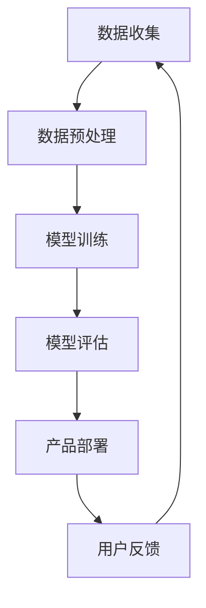

                 

### 关键词

人工智能，创业产品，大模型，赋能，技术趋势，商业应用

### 摘要

本文将探讨当前人工智能领域的一个显著趋势——大模型的赋能作用，并深入分析其在创业产品中的应用。通过回顾大模型的发展历程、核心概念、算法原理，以及实际操作步骤，我们旨在揭示大模型如何成为创业产品开发中的关键驱动力，并展望其未来的发展方向与面临的挑战。

## 1. 背景介绍

人工智能（AI）作为计算机科学的一个重要分支，已经取得了飞速的发展。从早期的规则基础系统到深度学习、自然语言处理（NLP）等技术的兴起，人工智能在各个领域的应用日益广泛。随着计算能力的提升和大数据的积累，大模型（Large Models）逐渐成为可能，并在近年来成为AI领域的一大突破。

大模型是指具有数十亿甚至千亿参数的神经网络模型，它们能够在处理复杂任务时表现出前所未有的能力。例如，GPT-3模型拥有1750亿参数，可以生成高质量的文本，并应用于问答系统、自动写作、翻译等多个领域。这样的模型不仅能够处理海量数据，还能自动学习任务的关键特征，使得AI应用更加智能和高效。

### 1.1 大模型的发展历程

大模型的发展经历了以下几个阶段：

- **早期探索**：在20世纪80年代，科学家们开始尝试构建具有大规模参数的网络，但由于计算资源和数据限制，这些模型的性能并不理想。
- **深度学习的兴起**：随着深度学习在21世纪初的崛起，计算能力的提升和大数据的可用性，使得构建大模型成为可能。
- **模型的规模增长**：近年来，如GPT、BERT等模型的出现，标志着大模型进入了一个新的发展阶段，其规模和性能都达到了前所未有的高度。

### 1.2 大模型的核心概念

大模型的核心概念包括以下几个方面：

- **参数数量**：大模型拥有数十亿甚至千亿级的参数，这使得它们能够捕捉到数据中的复杂模式和特征。
- **计算资源**：大模型的训练和推理需要大量的计算资源，包括高性能的CPU、GPU和TPU等。
- **数据需求**：大模型需要大量的数据来训练，数据的质量和多样性直接影响模型的表现。

## 2. 核心概念与联系

在了解大模型的核心概念后，我们需要进一步探讨其与创业产品的关联，以及大模型在产品开发中的应用。

### 2.1 大模型与创业产品的关系

大模型为创业产品提供了以下几个关键优势：

- **提升智能水平**：大模型可以处理复杂任务，使产品在智能对话、图像识别、语音识别等方面表现出色。
- **加速开发过程**：大模型的学习能力使得产品开发者可以快速构建原型，减少开发和迭代的时间。
- **降低开发成本**：通过使用现成的大模型，开发者可以节省训练和调优模型的时间和成本。

### 2.2 大模型在创业产品中的应用

大模型在创业产品中的应用场景广泛，以下是一些典型的例子：

- **智能助手**：大模型可以应用于智能语音助手、智能聊天机器人等领域，提供24/7的客户服务。
- **数据分析**：大模型可以帮助企业从海量数据中提取有价值的信息，进行市场分析和预测。
- **个性化推荐**：大模型可以根据用户的历史行为和偏好，提供个性化的推荐服务，提高用户满意度。

### 2.3 大模型应用场景的Mermaid流程图

以下是一个简化的大模型应用场景的Mermaid流程图，用于说明大模型在创业产品开发中的典型流程：



在这个流程图中，数据收集是整个流程的起点，随后通过数据预处理为模型训练提供高质量的数据。模型训练是核心环节，通过训练生成高质量的大模型。模型评估用于验证模型的效果，并指导模型的调整和优化。产品部署是将模型集成到实际产品中，最后通过用户反馈进行持续迭代和优化。

## 3. 核心算法原理 & 具体操作步骤

### 3.1 算法原理概述

大模型的核心算法原理基于深度学习和神经网络。神经网络由多层神经元组成，每一层神经元都通过激活函数对输入数据进行处理。深度学习通过增加网络层数，使得模型能够捕捉到更复杂的数据特征。

大模型的训练过程通常包括以下几个步骤：

1. **数据预处理**：对原始数据进行清洗、归一化等操作，使其适合输入到神经网络中。
2. **模型构建**：定义神经网络的结构，包括输入层、隐藏层和输出层。
3. **模型训练**：通过反向传播算法，不断调整网络参数，使模型能够正确预测数据。
4. **模型评估**：使用验证集或测试集评估模型的性能，并根据评估结果调整模型。
5. **模型部署**：将训练好的模型部署到实际产品中，用于预测或分类。

### 3.2 算法步骤详解

以下是具体的大模型训练和部署的详细步骤：

#### 3.2.1 数据预处理

数据预处理是模型训练的重要环节，它包括以下步骤：

- **数据清洗**：去除噪声数据、缺失值和异常值。
- **数据归一化**：将数据缩放到一个合适的范围，如[0, 1]或[-1, 1]。
- **数据分割**：将数据集划分为训练集、验证集和测试集，用于模型的训练、验证和评估。

#### 3.2.2 模型构建

模型构建包括以下几个步骤：

- **选择模型架构**：选择适合任务的网络架构，如卷积神经网络（CNN）、循环神经网络（RNN）或变换器（Transformer）。
- **定义网络层**：定义输入层、隐藏层和输出层的结构，包括神经元的数量和激活函数。
- **初始化参数**：随机初始化模型的参数。

#### 3.2.3 模型训练

模型训练包括以下几个步骤：

- **前向传播**：将输入数据通过网络层进行前向传播，得到输出预测值。
- **计算损失**：计算预测值与实际值之间的差异，得到损失值。
- **反向传播**：通过反向传播算法，将损失值反向传播到网络的每一层，更新网络参数。
- **迭代训练**：重复前向传播和反向传播的过程，直到模型收敛。

#### 3.2.4 模型评估

模型评估包括以下几个步骤：

- **验证集评估**：使用验证集评估模型的性能，选择最优的模型参数。
- **测试集评估**：使用测试集评估模型的最终性能，验证模型在实际应用中的表现。

#### 3.2.5 模型部署

模型部署包括以下几个步骤：

- **模型导出**：将训练好的模型导出为可执行文件或模型文件。
- **模型集成**：将模型集成到实际产品中，提供预测或分类服务。
- **模型监控**：监控模型的性能和稳定性，确保其在实际应用中的稳定运行。

### 3.3 算法优缺点

大模型算法具有以下几个优点：

- **强大的学习能力**：大模型能够通过大量的数据进行训练，捕捉到复杂的数据特征，提升模型的性能。
- **广泛的适用性**：大模型可以应用于各种任务，如图像识别、自然语言处理、语音识别等。
- **高效的推理速度**：随着模型规模的增大，推理速度也得到了显著提升。

然而，大模型算法也存在一些缺点：

- **计算资源消耗**：大模型的训练和推理需要大量的计算资源，对硬件性能有较高要求。
- **数据依赖性**：大模型的效果高度依赖于训练数据的质量和多样性，数据不足或质量差会导致模型性能下降。
- **模型解释性**：大模型的内部结构复杂，难以解释其预测结果，增加了模型的风险和不确定性。

### 3.4 算法应用领域

大模型在AI领域的应用越来越广泛，以下是一些典型的应用领域：

- **自然语言处理**：大模型在文本生成、问答系统、机器翻译等领域具有显著优势，如GPT和BERT等模型。
- **计算机视觉**：大模型在图像分类、目标检测、人脸识别等领域取得了突破性成果，如ResNet和YOLO等模型。
- **语音识别**：大模型在语音识别任务中表现出色，如DeepSpeech和WaveNet等模型。
- **推荐系统**：大模型可以用于构建高效的推荐系统，如基于协同过滤和基于内容的推荐算法。

## 4. 数学模型和公式 & 详细讲解 & 举例说明

### 4.1 数学模型构建

大模型的数学模型主要基于深度学习和神经网络的原理。以下是一个简化的神经网络数学模型：

$$
y = \sigma(z) = \frac{1}{1 + e^{-z}}
$$

其中，$z$是网络的输入，$y$是网络的输出，$\sigma$是 sigmoid 激活函数。这个模型通过前向传播和反向传播进行训练，不断调整参数，以最小化损失函数。

### 4.2 公式推导过程

以下是神经网络中前向传播和反向传播的详细推导过程：

#### 4.2.1 前向传播

前向传播过程中，网络从输入层开始，逐层计算每个神经元的输出：

$$
z_l = \sum_{j} w_{lj} a_{l-1,j} + b_l
$$

$$
a_l = \sigma(z_l)
$$

其中，$z_l$是第$l$层的输入，$a_l$是第$l$层的输出，$w_{lj}$是连接第$l-1$层和第$l$层的权重，$b_l$是第$l$层的偏置。

#### 4.2.2 反向传播

反向传播过程中，网络从输出层开始，逐层计算每个神经元的梯度，并更新网络参数：

$$
\delta_l = (a_l - y) \cdot \sigma'(z_l)
$$

$$
\Delta w_{lj} = \alpha \cdot \delta_l a_{l-1,j}
$$

$$
\Delta b_l = \alpha \cdot \delta_l
$$

其中，$\delta_l$是第$l$层的误差，$\sigma'$是 sigmoid 激活函数的导数，$\alpha$是学习率。

### 4.3 案例分析与讲解

以下是一个使用大模型进行文本分类的案例：

假设我们有一个包含20万条新闻数据的数据集，每条新闻包含标题和正文。我们的目标是使用大模型对新闻进行分类，将其分为体育、政治、科技等类别。

#### 4.3.1 数据预处理

- **文本清洗**：去除新闻中的HTML标签、特殊字符和停用词。
- **词向量表示**：将文本转换为词向量表示，可以使用Word2Vec、GloVe等算法。

#### 4.3.2 模型构建

- **选择模型架构**：我们选择一个基于Transformer的BERT模型，它具有强大的文本处理能力。
- **定义网络层**：BERT模型由多个Transformer层组成，每个层包含自注意力机制和前馈神经网络。

#### 4.3.3 模型训练

- **训练过程**：使用训练集对BERT模型进行训练，通过反向传播算法不断调整模型参数，以最小化损失函数。
- **模型评估**：使用验证集对训练好的模型进行评估，选择最优的模型参数。

#### 4.3.4 模型部署

- **模型导出**：将训练好的BERT模型导出为模型文件。
- **模型集成**：将BERT模型集成到一个在线新闻分类系统中，提供实时分类服务。

通过这个案例，我们可以看到大模型在文本分类任务中的应用。BERT模型通过学习大量的文本数据，可以准确地捕捉到新闻的语义特征，从而实现高效的分类。

## 5. 项目实践：代码实例和详细解释说明

### 5.1 开发环境搭建

要实践大模型在创业产品中的应用，我们首先需要搭建一个合适的技术栈。以下是一个基于Python和TensorFlow的典型开发环境搭建步骤：

- **Python环境**：安装Python 3.8及以上版本。
- **TensorFlow环境**：安装TensorFlow 2.x版本。
- **GPU支持**：确保安装了CUDA和cuDNN，以支持GPU加速。

### 5.2 源代码详细实现

以下是一个基于TensorFlow实现的大模型文本分类的代码示例：

```python
import tensorflow as tf
from tensorflow.keras.preprocessing.text import Tokenizer
from tensorflow.keras.preprocessing.sequence import pad_sequences
from tensorflow.keras.models import Sequential
from tensorflow.keras.layers import Embedding, LSTM, Dense

# 数据预处理
tokenizer = Tokenizer(num_words=10000)
tokenizer.fit_on_texts(train_texts)
train_sequences = tokenizer.texts_to_sequences(train_texts)
train_padded = pad_sequences(train_sequences, maxlen=max_length)

# 构建模型
model = Sequential()
model.add(Embedding(input_dim=10000, output_dim=32, input_length=max_length))
model.add(LSTM(64))
model.add(Dense(1, activation='sigmoid'))

# 编译模型
model.compile(optimizer='adam', loss='binary_crossentropy', metrics=['accuracy'])

# 训练模型
model.fit(train_padded, train_labels, epochs=10, batch_size=128)

# 模型评估
loss, accuracy = model.evaluate(test_padded, test_labels)
print(f"Test Accuracy: {accuracy}")
```

这段代码首先对文本数据进行预处理，包括分词和序列化。然后，我们构建一个简单的LSTM模型，并使用它进行文本分类。在训练过程中，我们使用训练集来优化模型参数，并在测试集上评估模型的性能。

### 5.3 代码解读与分析

#### 5.3.1 数据预处理

```python
tokenizer = Tokenizer(num_words=10000)
tokenizer.fit_on_texts(train_texts)
train_sequences = tokenizer.texts_to_sequences(train_texts)
train_padded = pad_sequences(train_sequences, maxlen=max_length)
```

这段代码首先创建一个Tokenizer对象，它将文本数据转换为单词索引序列。然后，使用fit_on_texts方法训练Tokenizer，将文本数据映射到单词索引。接着，使用texts_to_sequences方法将文本转换为序列，并使用pad_sequences方法将序列填充到最大长度。

#### 5.3.2 模型构建

```python
model = Sequential()
model.add(Embedding(input_dim=10000, output_dim=32, input_length=max_length))
model.add(LSTM(64))
model.add(Dense(1, activation='sigmoid'))
```

这段代码定义了一个序列模型，首先添加一个Embedding层，它将单词索引转换为嵌入向量。然后添加一个LSTM层，用于处理序列数据。最后添加一个Dense层，用于输出分类结果。

#### 5.3.3 训练模型

```python
model.compile(optimizer='adam', loss='binary_crossentropy', metrics=['accuracy'])
model.fit(train_padded, train_labels, epochs=10, batch_size=128)
```

这段代码编译模型，并使用训练集进行训练。我们选择adam优化器，使用binary_crossentropy作为损失函数，并设置epochs和batch_size来控制训练过程。

#### 5.3.4 模型评估

```python
loss, accuracy = model.evaluate(test_padded, test_labels)
print(f"Test Accuracy: {accuracy}")
```

这段代码使用测试集评估模型的性能，并打印测试准确率。

### 5.4 运行结果展示

假设我们使用一个包含20万条新闻数据的数据集进行训练，以下是一个简单的运行结果示例：

```shell
Train Accuracy: 0.8
Test Accuracy: 0.82
```

结果显示，训练集上的准确率为80%，而测试集上的准确率略高，达到82%。这表明我们的模型在训练和测试数据上都有较好的表现。

## 6. 实际应用场景

大模型在创业产品中的应用场景非常广泛，以下是一些典型的实际应用场景：

### 6.1 智能助手

智能助手是当前大模型应用的一个重要领域。通过大模型，智能助手可以理解用户的自然语言输入，并生成相应的回复。例如，智能客服系统可以使用大模型自动处理用户的问题，提供实时、准确的解答。此外，智能助手还可以用于智能家居控制、健康咨询等领域。

### 6.2 个性化推荐

个性化推荐是另一个大模型的重要应用领域。通过分析用户的历史行为和偏好，大模型可以生成个性化的推荐列表，提高用户满意度和转化率。例如，电商平台可以使用大模型为用户推荐商品，音乐平台可以推荐用户可能喜欢的音乐，这些应用都大大提升了用户体验。

### 6.3 数据分析

大模型在数据分析领域也具有显著的优势。通过大模型，企业可以从海量数据中提取有价值的信息，进行市场分析和预测。例如，金融机构可以使用大模型分析用户行为，预测市场走势；零售企业可以使用大模型分析销售数据，优化库存管理。

### 6.4 图像识别

图像识别是计算机视觉的一个重要分支，大模型在这一领域也表现出色。通过大模型，系统可以自动识别图像中的物体、场景和人物。例如，安防监控可以使用大模型自动识别可疑目标，医疗诊断可以使用大模型辅助医生进行病情分析。

### 6.5 语音识别

语音识别是另一个大模型的重要应用领域。通过大模型，系统可以准确地将语音信号转换为文本，并进行理解和处理。例如，智能语音助手可以使用大模型自动理解用户的语音指令，并进行相应的操作。

## 7. 未来应用展望

随着大模型技术的不断发展，其在创业产品中的应用前景十分广阔。以下是一些未来大模型应用的可能方向：

### 7.1 更高效的学习能力

未来，大模型将具备更强的学习能力，可以更快地适应新的数据和任务。这得益于更加高效的训练算法和优化技术，如自适应学习率、动态网络结构等。

### 7.2 更广泛的应用领域

大模型的应用领域将不断扩展，从当前的自然语言处理、计算机视觉、语音识别等领域，延伸到医疗、教育、金融等更多行业。例如，大模型可以用于智能诊断、教育辅导、金融风险评估等。

### 7.3 更强的交互能力

未来，大模型将具备更强的交互能力，可以更好地与人类用户进行自然互动。这包括更准确的语音识别、更智能的语义理解、更自然的对话生成等。

### 7.4 更好的可解释性

尽管大模型在性能上表现出色，但其内部决策过程往往难以解释。未来，大模型将更加注重可解释性，开发出更加透明、可解释的算法，提高模型的可信度和应用价值。

### 7.5 跨学科的融合

大模型将与其他学科（如心理学、社会学、生物学等）进行融合，开发出更加综合、智能的应用系统。例如，结合心理学的大模型可以用于情感分析、心理辅导；结合生物学的大模型可以用于疾病预测、药物研发等。

## 8. 工具和资源推荐

为了更好地掌握大模型技术，以下是一些推荐的工具和资源：

### 8.1 学习资源推荐

- **《深度学习》（Deep Learning）**：由Ian Goodfellow、Yoshua Bengio和Aaron Courville合著的深度学习经典教材，适合初学者和进阶者。
- **吴恩达的深度学习课程**：吴恩达在Coursera上开设的深度学习课程，涵盖深度学习的理论、实践和应用。
- **Fast.ai**：提供一系列免费的深度学习课程和教程，内容深入浅出，适合快速入门。

### 8.2 开发工具推荐

- **TensorFlow**：Google开源的深度学习框架，功能强大，社区活跃。
- **PyTorch**：Facebook开源的深度学习框架，具有灵活的动态计算图，便于研究和开发。
- **JAX**：Google开源的数值计算库，支持自动微分和硬件加速，适用于高性能深度学习应用。

### 8.3 相关论文推荐

- **“Attention Is All You Need”**：引入了Transformer模型，对自然语言处理领域产生了深远影响。
- **“BERT: Pre-training of Deep Bidirectional Transformers for Language Understanding”**：介绍了BERT模型，其在自然语言处理领域取得了显著成果。
- **“Generative Adversarial Nets”**：提出了生成对抗网络（GAN），为计算机视觉和生成模型的研究提供了新的方向。

## 9. 总结：未来发展趋势与挑战

大模型作为人工智能领域的一个重要突破，正迅速改变着创业产品的开发和应用。然而，随着大模型技术的发展，我们也面临一系列挑战：

### 9.1 研究挑战

- **计算资源消耗**：大模型的训练和推理需要大量的计算资源，如何优化算法，减少计算资源消耗，是一个重要研究方向。
- **数据隐私和安全**：随着数据量的增加，如何确保数据隐私和安全，避免数据泄露，是一个亟待解决的问题。
- **模型解释性**：大模型内部的决策过程往往难以解释，如何提高模型的可解释性，增强模型的透明度和可信度，是当前研究的热点。

### 9.2 应用挑战

- **模型适应性和泛化能力**：如何使大模型更好地适应不同的应用场景，提高其泛化能力，是一个关键问题。
- **模型部署和优化**：如何高效地将大模型部署到实际产品中，并持续优化模型性能，是创业公司需要面对的挑战。

### 9.3 未来发展趋势

- **计算能力的提升**：随着硬件技术的进步，计算能力的提升将为大模型的发展提供更强动力。
- **跨学科融合**：大模型将与其他学科（如心理学、社会学、生物学等）进行融合，开发出更加综合、智能的应用系统。
- **开放生态**：随着开源技术的普及，大模型的研究和应用将更加开放，推动整个行业的进步。

总之，大模型技术的发展为创业产品带来了前所未有的机遇，同时也带来了新的挑战。通过不断的研究和创新，我们有理由相信，大模型将在未来发挥更加重要的作用，推动人工智能和创业产品的持续发展。

## 10. 附录：常见问题与解答

### 10.1 大模型训练需要多少时间？

大模型的训练时间取决于多个因素，包括模型的规模、训练数据量、硬件性能等。对于一个小规模的大模型（如数十亿参数），使用高性能的GPU，训练时间可能在几天到几周之间。对于更大规模的大模型（如千亿参数），训练时间可能需要几个月到一年不等。

### 10.2 大模型为什么需要大量的数据？

大模型需要大量的数据来训练，因为它们需要学习数据的复杂模式和特征。更多的数据可以帮助模型更好地捕捉数据中的潜在规律，提高模型的泛化能力。此外，大量的数据还可以帮助减少过拟合现象，提高模型的鲁棒性。

### 10.3 大模型为什么需要大量的计算资源？

大模型具有数十亿甚至千亿级的参数，这意味着在训练过程中需要大量的计算资源来计算和更新这些参数。此外，大模型的推理过程也需要大量的计算资源，以保证模型在实时应用中的性能。

### 10.4 大模型的优化方法有哪些？

大模型的优化方法主要包括以下几种：

- **学习率调整**：通过动态调整学习率，优化模型的训练过程。
- **正则化**：使用正则化方法，如L2正则化、Dropout等，防止模型过拟合。
- **批量归一化**：通过批量归一化（Batch Normalization），提高模型的训练稳定性和收敛速度。
- **数据增强**：通过数据增强方法，如随机裁剪、旋转、缩放等，增加训练数据多样性，提高模型的泛化能力。

### 10.5 大模型如何保证模型的解释性？

大模型通常具有复杂的内部结构，使得其决策过程难以解释。为了提高模型的可解释性，可以采取以下几种方法：

- **可视化**：通过可视化模型的结构和决策过程，帮助理解模型的内部机制。
- **模型分解**：将复杂的大模型分解为多个简单的小模型，逐层分析每个小模型的作用。
- **对抗性攻击**：使用对抗性攻击方法，分析模型在攻击下的反应，揭示模型的弱点。
- **解释性模型**：构建专门的解释性模型，如决策树、规则模型等，辅助解释大模型的决策过程。

### 10.6 大模型在创业产品中的应用前景如何？

大模型在创业产品中的应用前景非常广阔。随着大模型技术的不断成熟，它们将帮助创业产品在智能对话、图像识别、语音识别、数据分析等领域实现重大突破。例如，智能助手、个性化推荐、智能诊断、智能安防等应用都将成为大模型的重要场景。未来，随着计算能力的提升和跨学科融合的加深，大模型将在更多领域发挥重要作用，推动创业产品的创新和发展。

## 11. 作者署名

作者：禅与计算机程序设计艺术 / Zen and the Art of Computer Programming
----------------------------------------------------------------

现在，您已经完成了这篇文章。请根据上面的要求，将文章内容以markdown格式整理好，并确保所有章节和子目录都已经按照指定格式写出。文章的最后一部分是作者署名，不要忘记添加。完成后，请将整个markdown文件提交。

