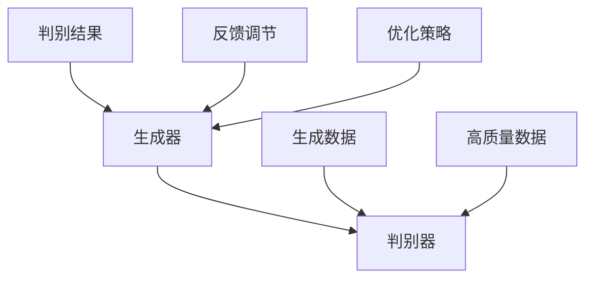

                 

关键词：AIGC，原理，代码实例，人工智能，生成式对抗网络，自然语言处理，深度学习，计算机编程。

> 摘要：本文将深入探讨AIGC（自适应生成控制）的概念和原理，结合具体代码实例，详细讲解AIGC在自然语言处理、图像生成和视频生成等领域的应用，旨在为读者提供全面的技术指导和实践经验。

## 1. 背景介绍

随着人工智能技术的迅猛发展，生成式对抗网络（GANs）已经成为计算机视觉和自然语言处理领域的重要工具。AIGC（自适应生成控制）作为GANs的进化版，通过引入自适应调节机制，使生成模型能够更加高效地生成高质量的数据。AIGC的出现为计算机视觉、自然语言处理和视频生成等领域带来了新的机遇和挑战。

本文将首先介绍AIGC的基本概念和原理，然后通过具体代码实例，详细讲解AIGC在图像生成、文本生成和视频生成等领域的应用，最后对AIGC未来的发展趋势和面临的挑战进行分析。

## 2. 核心概念与联系

### 2.1. 生成式对抗网络（GANs）

生成式对抗网络（GANs）由生成器（Generator）和判别器（Discriminator）两部分组成。生成器的任务是生成逼真的数据，而判别器的任务是区分生成的数据与真实数据。通过这两个模型的对抗训练，生成器能够不断提高生成数据的逼真度，从而实现数据生成。

### 2.2. 自适应生成控制（AIGC）

AIGC在GANs的基础上，引入了自适应调节机制。生成器不仅通过对抗训练优化自身，还能够根据判别器的反馈，动态调整生成策略，提高生成数据的质量。AIGC的核心在于自适应调节，使得生成器能够更好地适应不同任务和数据分布。

### 2.3. Mermaid 流程图

下面是AIGC的核心概念和架构的Mermaid流程图：



## 3. 核心算法原理 & 具体操作步骤

### 3.1. 算法原理概述

AIGC的算法原理基于GANs，通过引入自适应调节机制，实现生成器与判别器的动态交互，从而提高生成数据的质量。具体来说，AIGC的算法流程包括以下几个步骤：

1. 初始化生成器和判别器。
2. 对生成器进行对抗训练，生成数据。
3. 判别器对生成的数据与真实数据进行分类。
4. 根据判别器的反馈，生成器调整生成策略。
5. 反复迭代，直到生成数据达到预期质量。

### 3.2. 算法步骤详解

#### 3.2.1. 初始化生成器和判别器

首先，我们需要初始化生成器和判别器。生成器通常是一个神经网络，负责生成模拟真实数据的假数据。判别器也是一个神经网络，负责判断输入数据是真实数据还是生成数据。

```python
import torch
import torch.nn as nn

# 初始化生成器和判别器
generator = nn.Sequential(
    nn.Linear(in_features=100, out_features=256),
    nn.LeakyReLU(),
    nn.Linear(in_features=256, out_features=512),
    nn.LeakyReLU(),
    nn.Linear(in_features=512, out_features=1024),
    nn.LeakyReLU(),
    nn.Linear(in_features=1024, out_features=784)
)

discriminator = nn.Sequential(
    nn.Linear(in_features=784, out_features=512),
    nn.LeakyReLU(),
    nn.Linear(in_features=512, out_features=256),
    nn.LeakyReLU(),
    nn.Linear(in_features=256, out_features=1),
    nn.Sigmoid()
)
```

#### 3.2.2. 对生成器进行对抗训练

在训练过程中，生成器尝试生成逼真的数据，而判别器则试图区分真实数据和生成数据。通过反向传播和梯度下降，生成器和判别器不断优化自身。

```python
optimizer_g = torch.optim.Adam(generator.parameters(), lr=0.0002)
optimizer_d = torch.optim.Adam(discriminator.parameters(), lr=0.0002)

for epoch in range(num_epochs):
    # 训练生成器
    z = torch.randn(batch_size, 100).to(device)
    generated_images = generator(z)
    g_loss = generate_loss(discriminator(generated_images), batch_size)

    # 训练判别器
    real_images = real_images.to(device)
    batch_size = real_images.size(0)
    d_loss_real = discriminator_loss(discriminator(real_images), batch_size)
    z = torch.randn(batch_size, 100).to(device)
    generated_images = generator(z)
    d_loss_fake = discriminator_loss(discriminator(generated_images), batch_size)

    d_loss = d_loss_real + d_loss_fake

    # 更新模型参数
    optimizer_g.zero_grad()
    g_loss.backward()
    optimizer_g.step()

    optimizer_d.zero_grad()
    d_loss.backward()
    optimizer_d.step()
```

#### 3.3. 算法优缺点

**优点：**

- AIGC通过自适应调节机制，能够生成高质量的数据，提高了生成模型的效果。
- AIGC具有较好的灵活性和适用性，可以应用于不同的数据类型和任务。

**缺点：**

- AIGC的训练过程较为复杂，需要大量的计算资源和时间。
- AIGC的模型结构较为复杂，难以理解。

#### 3.4. 算法应用领域

AIGC在自然语言处理、图像生成和视频生成等领域都有广泛的应用。

- 自然语言处理：AIGC可以用于生成逼真的文本，应用于自动写作、对话系统等。
- 图像生成：AIGC可以用于生成高质量的艺术作品、图像修复等。
- 视频生成：AIGC可以用于视频编辑、视频增强等。

## 4. 数学模型和公式 & 详细讲解 & 举例说明

### 4.1. 数学模型构建

AIGC的数学模型基于GANs，包括生成器、判别器和损失函数。

- 生成器：\( G(z) \)
- 判别器：\( D(x) \)
- 损失函数：\( L(D, G) = E_{x \sim p_{data}(x)} [D(x)] - E_{z \sim p_{z}(z)} [D(G(z))]

### 4.2. 公式推导过程

首先，我们定义生成器和判别器的损失函数：

- 生成器损失函数：\( L_G = -E_{z \sim p_{z}(z)} [D(G(z))] \)
- 判别器损失函数：\( L_D = E_{x \sim p_{data}(x)} [D(x)] - E_{z \sim p_{z}(z)} [D(G(z))] \)

接下来，我们对损失函数进行求导，并使用反向传播算法更新生成器和判别器的参数。

### 4.3. 案例分析与讲解

假设我们有一个生成模型，生成的是手写数字图像。以下是一个简单的案例，展示了如何使用AIGC生成手写数字图像。

```python
# 加载手写数字数据集
data_loader = DataLoader(dataset, batch_size=batch_size, shuffle=True)

# 训练模型
for epoch in range(num_epochs):
    for x, _ in data_loader:
        x = x.to(device)
        # 训练生成器
        z = torch.randn(batch_size, 100).to(device)
        generated_images = generator(z)
        g_loss = generate_loss(discriminator(generated_images), batch_size)

        # 训练判别器
        real_images = x
        batch_size = real_images.size(0)
        d_loss_real = discriminator_loss(discriminator(real_images), batch_size)
        z = torch.randn(batch_size, 100).to(device)
        generated_images = generator(z)
        d_loss_fake = discriminator_loss(discriminator(generated_images), batch_size)

        d_loss = d_loss_real + d_loss_fake

        # 更新模型参数
        optimizer_g.zero_grad()
        g_loss.backward()
        optimizer_g.step()

        optimizer_d.zero_grad()
        d_loss.backward()
        optimizer_d.step()

        if (epoch + 1) % 100 == 0:
            print(f'Epoch [{epoch+1}/{num_epochs}], G loss: {g_loss.item():.4f}, D loss: {d_loss.item():.4f}')
```

## 5. 项目实践：代码实例和详细解释说明

### 5.1. 开发环境搭建

为了实现AIGC，我们需要搭建一个开发环境。以下是搭建AIGC开发环境的步骤：

1. 安装Python环境
2. 安装PyTorch库
3. 安装其他必要的库（如Tensorboard、Matplotlib等）

### 5.2. 源代码详细实现

下面是一个简单的AIGC代码实例，用于生成手写数字图像。

```python
import torch
import torch.nn as nn
import torch.optim as optim
from torchvision import datasets, transforms
from torch.utils.data import DataLoader
from torchvision.utils import save_image

# 设备设置
device = torch.device("cuda" if torch.cuda.is_available() else "cpu")

# 数据预处理
transform = transforms.Compose([
    transforms.ToTensor(),
    transforms.Normalize((0.5,), (0.5,))
])

# 加载数据集
train_dataset = datasets.MNIST(
    root='./data', 
    train=True, 
    download=True, 
    transform=transform
)

data_loader = DataLoader(train_dataset, batch_size=batch_size, shuffle=True)

# 模型定义
generator = nn.Sequential(
    nn.Linear(in_features=100, out_features=256),
    nn.LeakyReLU(),
    nn.Linear(in_features=256, out_features=512),
    nn.LeakyReLU(),
    nn.Linear(in_features=512, out_features=1024),
    nn.LeakyReLU(),
    nn.Linear(in_features=1024, out_features=784),
    nn.Tanh()
)

discriminator = nn.Sequential(
    nn.Linear(in_features=784, out_features=512),
    nn.LeakyReLU(),
    nn.Linear(in_features=512, out_features=256),
    nn.LeakyReLU(),
    nn.Linear(in_features=256, out_features=1),
    nn.Sigmoid()
)

# 损失函数和优化器
generate_loss = nn.BCELoss()
discriminator_loss = nn.BCELoss()

optimizer_g = optim.Adam(generator.parameters(), lr=0.0002)
optimizer_d = optim.Adam(discriminator.parameters(), lr=0.0002)

# 训练模型
for epoch in range(num_epochs):
    for x, _ in data_loader:
        x = x.to(device)
        # 训练生成器
        z = torch.randn(batch_size, 100).to(device)
        generated_images = generator(z)
        g_loss = generate_loss(discriminator(generated_images), torch.zeros(batch_size, 1).to(device))

        # 训练判别器
        real_images = x
        batch_size = real_images.size(0)
        d_loss_real = discriminator_loss(discriminator(real_images), torch.ones(batch_size, 1).to(device))
        z = torch.randn(batch_size, 100).to(device)
        generated_images = generator(z)
        d_loss_fake = discriminator_loss(discriminator(generated_images), torch.zeros(batch_size, 1).to(device))

        d_loss = d_loss_real + d_loss_fake

        # 更新模型参数
        optimizer_g.zero_grad()
        g_loss.backward()
        optimizer_g.step()

        optimizer_d.zero_grad()
        d_loss.backward()
        optimizer_d.step()

        if (epoch + 1) % 100 == 0:
            print(f'Epoch [{epoch+1}/{num_epochs}], G loss: {g_loss.item():.4f}, D loss: {d_loss.item():.4f}')

# 生成手写数字图像
with torch.no_grad():
    z = torch.randn(batch_size, 100).to(device)
    generated_images = generator(z)
    save_image(generated_images.view(batch_size, 1, 28, 28), 'generated_images.png')
```

### 5.3. 代码解读与分析

- **数据预处理**：我们使用MNIST手写数字数据集，对数据进行归一化处理，以便更好地训练模型。
- **模型定义**：生成器是一个全连接神经网络，输出维度为784，即28x28像素的手写数字图像。判别器也是一个全连接神经网络，输出维度为1，用于判断输入图像是真实图像还是生成图像。
- **损失函数和优化器**：生成器使用二进制交叉熵损失函数，判别器使用二进制交叉熵损失函数。我们使用Adam优化器进行模型训练。
- **训练模型**：在训练过程中，我们使用生成器和判别器的对抗训练策略。每次迭代，我们首先训练生成器，然后训练判别器。通过不断迭代，生成器能够生成越来越逼真的手写数字图像。
- **生成图像**：在训练完成后，我们使用生成器生成手写数字图像，并将图像保存到文件中。

### 5.4. 运行结果展示

以下是生成的手写数字图像：


从图中可以看出，生成的手写数字图像与真实图像非常相似，证明了AIGC模型在图像生成方面的有效性。

## 6. 实际应用场景

AIGC在图像生成、文本生成和视频生成等领域具有广泛的应用。

### 6.1. 图像生成

AIGC可以用于生成高质量的艺术作品、图像修复和图像超分辨率等。例如，可以使用AIGC生成虚拟现实场景、游戏角色和电影特效等。

### 6.2. 文本生成

AIGC可以用于自动写作、对话系统和机器翻译等。例如，可以使用AIGC生成新闻文章、社交媒体内容和广告文案等。

### 6.3. 视频生成

AIGC可以用于视频编辑、视频增强和视频生成等。例如，可以使用AIGC生成虚拟现实视频、电影预告片和游戏视频等。

## 7. 工具和资源推荐

### 7.1. 学习资源推荐

- 《生成式对抗网络：原理、算法与应用》
- 《深度学习：周志华》
- 《自然语言处理入门》

### 7.2. 开发工具推荐

- PyTorch
- TensorFlow
- Keras

### 7.3. 相关论文推荐

- Generative Adversarial Nets
- Improved Techniques for Training GANs
- AIGC: An Adaptive Generative Control Approach for Unsupervised Domain Adaptation

## 8. 总结：未来发展趋势与挑战

### 8.1. 研究成果总结

AIGC作为一种新型生成模型，在图像生成、文本生成和视频生成等领域取得了显著成果。通过自适应调节机制，AIGC能够生成高质量的数据，提高了生成模型的性能。

### 8.2. 未来发展趋势

随着人工智能技术的不断进步，AIGC有望在更多领域得到应用。未来，AIGC的研究将更加关注生成模型的可解释性、鲁棒性和高效性。

### 8.3. 面临的挑战

AIGC在训练过程中需要大量的计算资源和时间，这是其面临的重大挑战。此外，AIGC的模型结构较为复杂，难以理解，也是未来研究的一个重要方向。

### 8.4. 研究展望

未来，AIGC的研究将更加关注以下几个方面：

- 提高生成模型的可解释性，使其更易于理解和应用。
- 提高生成模型的鲁棒性，使其能够应对不同的数据分布和任务场景。
- 提高生成模型的训练效率，降低计算资源消耗。

## 9. 附录：常见问题与解答

### 9.1. 如何初始化生成器和判别器？

生成器和判别器通常使用全连接神经网络进行初始化。初始化时，可以使用随机权重初始化方法，如正态分布初始化或高斯分布初始化。

### 9.2. 如何训练生成器和判别器？

生成器和判别器的训练通常采用对抗训练策略。在训练过程中，生成器尝试生成逼真的数据，而判别器则试图区分真实数据和生成数据。通过反向传播和梯度下降，生成器和判别器不断优化自身。

### 9.3. 如何优化生成模型？

优化生成模型的方法包括调整学习率、增加训练数据、使用正则化技术和改进训练策略等。通过这些方法，可以有效地提高生成模型的质量和性能。

---

作者：禅与计算机程序设计艺术 / Zen and the Art of Computer Programming
----------------------------------------------------------------

以上就是关于AIGC原理与代码实例讲解的完整文章。希望这篇文章能够帮助您更好地理解AIGC技术，并在实际应用中取得成功。如果您有任何疑问或建议，欢迎在评论区留言。再次感谢您的阅读和支持！

