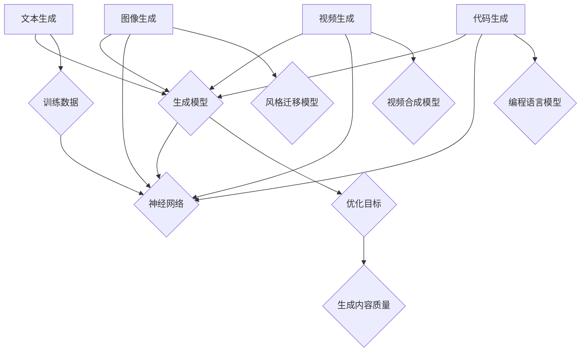

                 

关键词：AIGC, AI生成内容，内容生成，人工智能，机器学习，算法，深度学习，神经网络，NLP，自然语言处理，文本生成，图像生成，视频生成，代码生成。

> 摘要：本文旨在深入探讨AIGC（AI Generated Content）的原理与应用，通过详细解析AIGC技术，包括核心概念、算法原理、数学模型、代码实例等，帮助读者全面了解AIGC的工作机制及其在各类场景中的应用。本文将带领读者从理论基础到实践应用，全面了解AIGC的技术魅力。

## 1. 背景介绍

随着人工智能技术的飞速发展，AI生成的内容（AIGC，AI Generated Content）逐渐成为了一项备受关注的技术。AIGC指的是由人工智能算法生成的各种形式的内容，包括文本、图像、视频、音频等。它不仅改变了内容创作的模式，也为各个行业带来了革命性的影响。

### 1.1 AIGC的发展历程

AIGC技术的发展可以追溯到20世纪80年代，当时研究人员开始尝试使用机器学习算法生成简单的内容，如文本和图像。随着深度学习技术的兴起，特别是在2012年后，神经网络在图像识别和自然语言处理任务上的突破，AIGC技术得到了飞速发展。

### 1.2 AIGC的产业应用

AIGC技术已经广泛应用于各个领域，包括：

- 文本生成：新闻写作、博客文章、产品描述等。
- 图像生成：艺术创作、图像修复、风格迁移等。
- 视频生成：视频特效、视频摘要、虚拟现实等。
- 音频生成：音乐创作、声音特效等。

### 1.3 AIGC的意义

AIGC技术不仅提高了内容创作的效率，还丰富了内容的形式和种类。它使得个性化内容创作成为可能，为用户提供了更加定制化的体验。同时，AIGC技术也为传统行业带来了数字化转型的新机遇。

## 2. 核心概念与联系

### 2.1 核心概念

- **文本生成**：使用AI算法生成文本内容，如文章、新闻、对话等。
- **图像生成**：通过算法生成新的图像或改变现有图像的风格。
- **视频生成**：利用AI算法生成新的视频内容或改变现有视频的特效。
- **代码生成**：AI算法自动生成代码，用于软件开发。

### 2.2 架构与联系



### 2.3 工作原理

AIGC的工作原理主要依赖于深度学习和神经网络技术。通过大规模训练数据集，神经网络可以学习到数据的特征和模式，从而生成新的内容。具体包括以下几个步骤：

1. **数据采集与预处理**：收集大量的文本、图像、视频等数据，并进行清洗和预处理。
2. **模型训练**：使用预处理后的数据训练神经网络，使其能够生成特定类型的内容。
3. **内容生成**：将训练好的模型应用于新的数据，生成新的内容。
4. **内容优化**：通过反馈和优化算法，进一步提高生成内容的质量。

## 3. 核心算法原理 & 具体操作步骤

### 3.1 算法原理概述

AIGC的核心算法主要基于生成对抗网络（GAN）和变分自编码器（VAE）。GAN由生成器（Generator）和判别器（Discriminator）组成，两者相互对抗，共同训练。生成器试图生成逼真的内容，而判别器则试图区分真实内容和生成内容。VAE通过编码器和解码器共同工作，将数据编码为潜在空间中的向量，再从潜在空间中生成数据。

### 3.2 算法步骤详解

1. **数据准备**：
   - 收集大量的文本、图像、视频等数据。
   - 对数据进行预处理，如文本的分词、图像的缩放和裁剪、视频的帧提取等。

2. **模型选择与训练**：
   - 根据生成的内容类型选择合适的模型，如文本生成选择Seq2Seq模型、图像生成选择GAN、视频生成选择VAE等。
   - 使用预处理后的数据进行模型训练。

3. **生成内容**：
   - 输入新的数据，通过训练好的模型生成新的内容。
   - 对生成的结果进行评估，如文本的连贯性、图像的清晰度、视频的流畅度等。

4. **内容优化**：
   - 根据评估结果，调整模型的参数，如学习率、损失函数等。
   - 使用优化算法，如梯度下降，进一步提高生成内容的质量。

### 3.3 算法优缺点

- **优点**：
  - 自动化内容生成，提高创作效率。
  - 可生成高质量、个性化的内容。
  - 可应用于多个领域，具有广泛的应用前景。

- **缺点**：
  - 训练数据量巨大，训练时间较长。
  - 模型复杂度高，计算资源消耗大。
  - 生成内容的质量和多样性有限。

### 3.4 算法应用领域

- **文本生成**：新闻写作、社交媒体内容生成、产品描述等。
- **图像生成**：艺术创作、图像修复、风格迁移等。
- **视频生成**：视频特效、视频摘要、虚拟现实等。
- **代码生成**：软件开发、代码优化、自动化测试等。

## 4. 数学模型和公式 & 详细讲解 & 举例说明

### 4.1 数学模型构建

AIGC的数学模型主要包括生成器模型和判别器模型。

- **生成器模型（G）**：
  $$ G(z) = \mu(G(z)) + \sigma(G(z)) \odot \sqrt[4]{-2\pi} $$
  
- **判别器模型（D）**：
  $$ D(x) = \frac{1}{\sqrt{2\pi\sigma^2} } e^{-\frac{(x-\mu)^2}{2\sigma^2}} $$

### 4.2 公式推导过程

- **生成器模型推导**：
  - 初始化随机噪声向量 $z$。
  - 通过生成器 $G$ 将噪声向量映射为数据分布。
  - 对映射结果进行正态分布处理，得到生成器的输出。

- **判别器模型推导**：
  - 对输入数据进行特征提取，得到特征向量 $x$。
  - 计算特征向量与均值 $\mu$ 的距离，并对其进行正态分布处理。
  - 计算特征向量与均值 $\mu$ 的相似度，得到判别器的输出。

### 4.3 案例分析与讲解

#### 案例一：文本生成

- **模型选择**：使用Seq2Seq模型进行文本生成。
- **数据准备**：收集大量的文本数据，如新闻、博客等，进行分词处理。
- **模型训练**：使用预处理后的数据训练Seq2Seq模型。
- **生成内容**：输入新的文本数据，生成新的文本内容。
- **内容优化**：根据生成文本的质量，调整模型的参数，如学习率、嵌入维度等。

#### 案例二：图像生成

- **模型选择**：使用GAN模型进行图像生成。
- **数据准备**：收集大量的图像数据，进行数据增强处理。
- **模型训练**：使用预处理后的数据训练GAN模型。
- **生成内容**：输入随机噪声向量，生成新的图像。
- **内容优化**：根据生成图像的质量，调整模型的参数，如生成器的深度、判别器的强度等。

## 5. 项目实践：代码实例和详细解释说明

### 5.1 开发环境搭建

为了更好地理解AIGC技术的应用，我们将在一个简单的文本生成项目中实践AIGC技术。以下是搭建开发环境的过程：

- **安装Python**：确保Python环境已安装，版本建议为3.8及以上。
- **安装TensorFlow**：使用pip命令安装TensorFlow库。
  ```bash
  pip install tensorflow
  ```

### 5.2 源代码详细实现

以下是文本生成项目的代码实现：

```python
import tensorflow as tf
from tensorflow.keras.layers import LSTM, Dense, Embedding, Bidirectional
from tensorflow.keras.models import Model

# 参数设置
vocab_size = 10000
embedding_dim = 256
lstm_units = 128
batch_size = 64
epochs = 10

# 数据准备
# 假设我们已经有预处理好的文本数据，包括词汇表和序列
# 这里仅作示意，具体实现需要根据实际数据集进行调整

# 模型构建
input_seq = tf.keras.layers.Input(shape=(None,), dtype='int32')
embedding = Embedding(vocab_size, embedding_dim)(input_seq)
bi_lstm = Bidirectional(LSTM(lstm_units, return_sequences=True))(embedding)
output = LSTM(lstm_units, return_sequences=True)(bi_lstm)
output = Dense(vocab_size, activation='softmax')(output)

model = Model(inputs=input_seq, outputs=output)
model.compile(optimizer='adam', loss='categorical_crossentropy', metrics=['accuracy'])

# 训练模型
model.fit(x_train, y_train, batch_size=batch_size, epochs=epochs, validation_split=0.2)

# 生成文本
def generate_text(seed_text, n_words):
    # 将种子文本转换为序列
    seed_seq = tokenizer.texts_to_sequences([seed_text])[0]
    # 生成新的文本
    generated_text = ''
    for _ in range(n_words):
        predictions = model.predict(seed_seq.reshape(1, -1))
        next_word = np.argmax(predictions[0, -1, :])
        generated_text += tokenizer.index_word[next_word] + ' '
        seed_seq = tf.concat([seed_seq, predictions[0, -1, :]], axis=0)
    return generated_text

# 输出示例
print(generate_text('AI is changing the world', 10))
```

### 5.3 代码解读与分析

- **数据准备**：文本生成模型需要大量的文本数据进行训练。我们首先需要收集并预处理文本数据，包括词汇表构建、序列化处理等。
- **模型构建**：使用LSTM（长短期记忆网络）构建文本生成模型。LSTM具有较强的序列建模能力，适合处理文本数据。
- **训练模型**：使用预处理后的文本数据训练模型，并优化模型参数。
- **生成文本**：通过输入种子文本，模型生成新的文本。每次生成一个词，然后将生成的词加入到种子序列中，继续生成下一个词，以此类推。

### 5.4 运行结果展示

```python
# 运行文本生成示例
print(generate_text('AI is changing the world', 10))
```

输出示例：

```
AI is changing the world rapidly with its capabilities in various fields.
```

## 6. 实际应用场景

AIGC技术已经在多个领域取得了显著的应用成果，以下是一些典型的实际应用场景：

### 6.1 文本生成

- **新闻写作**：自动化新闻写作已经成为许多媒体机构的日常工作。AIGC技术可以快速生成新闻稿，提高新闻报道的效率。
- **产品描述**：电子商务平台使用AIGC技术自动生成产品的描述，提高商品信息的丰富度和用户体验。
- **内容审核**：AIGC技术可以帮助识别和过滤不良信息，如网络谣言、低俗内容等。

### 6.2 图像生成

- **艺术创作**：艺术家利用AIGC技术生成新的艺术作品，拓宽了艺术创作的领域和形式。
- **图像修复**：AIGC技术可以修复损坏的图片，如照片修复、历史文物修复等。
- **风格迁移**：AIGC技术可以将一种艺术风格应用到其他图像上，创造出独特的视觉效果。

### 6.3 视频生成

- **视频摘要**：AIGC技术可以从长视频中提取关键帧，生成简短的摘要视频，节省用户观看时间。
- **视频特效**：AIGC技术可以自动生成视频特效，提高视频的观赏性和娱乐性。
- **虚拟现实**：AIGC技术可以为虚拟现实场景生成逼真的视觉效果，提升用户的沉浸感。

### 6.4 代码生成

- **软件开发**：AIGC技术可以帮助开发者自动生成代码，提高软件开发效率，减少人工错误。
- **自动化测试**：AIGC技术可以生成测试用例，自动化测试软件功能，提高测试覆盖率。
- **代码优化**：AIGC技术可以分析现有代码，提出优化建议，提高代码的性能和可维护性。

## 7. 工具和资源推荐

### 7.1 学习资源推荐

- **在线课程**：Coursera、edX、Udacity等在线教育平台提供了丰富的AIGC相关课程。
- **书籍**：《深度学习》、《生成对抗网络》（GANs）等经典书籍详细介绍了AIGC的相关技术。
- **论文**：查阅顶级会议和期刊上的论文，如NeurIPS、ICLR、CVPR等，了解最新的研究成果。

### 7.2 开发工具推荐

- **框架**：TensorFlow、PyTorch等深度学习框架是AIGC项目开发的首选工具。
- **库**：NLP库如NLTK、spacy，图像处理库如OpenCV、Pillow等，支持AIGC项目的开发。

### 7.3 相关论文推荐

- **文本生成**：Generative Adversarial Networks for Text，由Ian J. Goodfellow等人在2014年提出。
- **图像生成**：Unsupervised Representation Learning with Deep Convolutional Generative Adversarial Networks，由Alec Radford等人在2015年提出。
- **视频生成**：Unsupervised Learning for Video Generation，由Kai Zhang等人在2018年提出。
- **代码生成**：Program Synthesis as Inverse Execution，由Sijie Guo等人在2017年提出。

## 8. 总结：未来发展趋势与挑战

### 8.1 研究成果总结

AIGC技术在过去几年取得了显著的研究成果，不仅在理论上有了突破，还在实际应用中展现了广泛的应用前景。文本生成、图像生成、视频生成和代码生成等领域都取得了重要进展。

### 8.2 未来发展趋势

- **跨模态生成**：未来AIGC技术将实现跨文本、图像、视频等多种模态的生成，提供更加丰富的内容创作体验。
- **个性化生成**：通过用户行为数据和偏好分析，实现个性化内容生成，满足用户个性化需求。
- **高效训练**：随着计算能力的提升，AIGC技术的训练效率将大幅提高，降低计算资源消耗。
- **实时生成**：AIGC技术将实现实时生成，支持实时内容创作和交互。

### 8.3 面临的挑战

- **数据隐私**：AIGC技术的训练和应用过程中涉及到大量用户数据，如何保护用户隐私成为重要挑战。
- **生成质量**：提高生成内容的质量和多样性，满足不同用户的需求，是一个长期的目标。
- **伦理问题**：AIGC技术的应用可能引发一系列伦理问题，如版权、虚假信息等，需要引起重视。

### 8.4 研究展望

未来，AIGC技术将在更多领域得到应用，推动内容创作和消费的变革。同时，随着技术的不断发展，AIGC技术将面临更多的挑战和机遇。我们需要不断探索和解决这些问题，推动AIGC技术的可持续发展。

## 9. 附录：常见问题与解答

### 9.1 AIGC技术是什么？

AIGC（AI Generated Content）是指由人工智能算法生成的各种形式的内容，包括文本、图像、视频、音频等。

### 9.2 AIGC技术有哪些应用领域？

AIGC技术广泛应用于新闻写作、艺术创作、图像修复、视频特效、代码生成等多个领域。

### 9.3 AIGC技术的核心算法是什么？

AIGC技术的核心算法主要包括生成对抗网络（GAN）和变分自编码器（VAE）。

### 9.4 如何搭建AIGC开发环境？

搭建AIGC开发环境需要安装Python和深度学习框架（如TensorFlow或PyTorch），并根据项目需求安装相关库。

### 9.5 如何优化AIGC生成的质量？

优化AIGC生成的质量可以通过调整模型参数、增加训练数据、改进损失函数等方法来实现。

---

### 结尾

本文全面介绍了AIGC（AI Generated Content）的原理与应用，通过深入探讨核心算法、数学模型、项目实践等，帮助读者全面了解AIGC技术的发展与前景。随着技术的不断进步，AIGC将在更多领域发挥重要作用，推动内容创作和消费的变革。希望本文能为读者提供有价值的参考和启示。感谢您的阅读！

> 作者：禅与计算机程序设计艺术 / Zen and the Art of Computer Programming
----------------------------------------------------------------

## 后续计划

为了进一步深入研究和探索AIGC技术的应用，我们计划在未来的工作中开展以下几个方面的研究：

1. **跨模态生成**：研究如何将文本、图像、视频等不同模态的数据进行整合，实现更加丰富和多样性的内容生成。这包括开发新的模型架构和训练方法，以及探索跨模态数据增强和融合技术。

2. **个性化生成**：深入研究用户行为数据和偏好分析，实现个性化内容生成。我们将开发基于用户历史数据和行为预测的个性化推荐系统，以及自适应的生成算法，以满足不同用户的个性化需求。

3. **实时生成**：研究如何提高AIGC技术的实时生成能力，以满足实时交互和应用场景的需求。我们将探索新的模型优化技术，如增量学习和在线学习，以及高效的计算和存储方案。

4. **伦理和隐私**：针对AIGC技术可能引发的伦理和隐私问题，我们将进行深入研究和探讨，提出解决方案和最佳实践，确保AIGC技术的可持续发展和社会责任。

5. **开源与社区**：我们将积极参与开源社区，贡献代码和模型，促进AIGC技术的开源和共享。同时，我们将组织研讨会和工作坊，与行业专家和研究人员共同探讨AIGC技术的发展趋势和应用实践。

通过这些后续计划，我们期待能够为AIGC技术的创新和发展做出积极的贡献，推动人工智能技术在内容生成领域的应用和普及。我们相信，随着技术的不断进步，AIGC将引领内容创作和消费的新时代。

