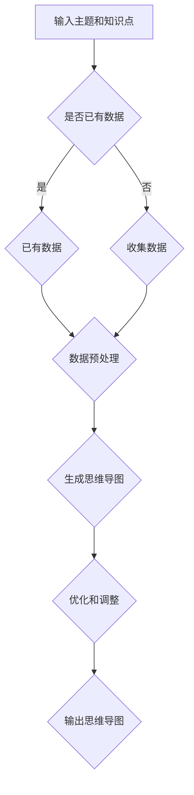
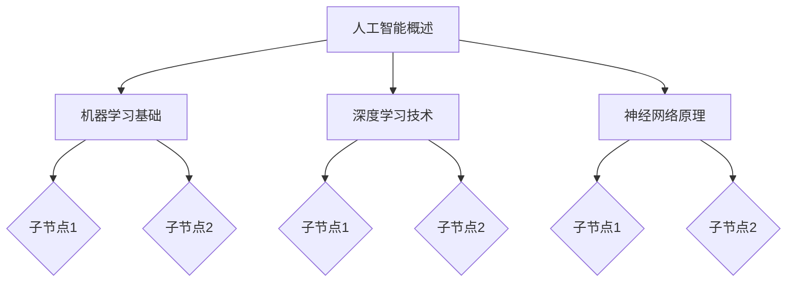

                 

关键词：AIGC，人工智能生成内容，思维导图，自动化，效率提升，实践教程

> 摘要：本文旨在介绍如何利用AIGC（AI Generated Content）技术，通过AI生成思维导图，实现从零到一的快速构建，让原本需要一个月才能完成的任务在短短一分钟内完成。文章将详细解析AIGC的核心概念、算法原理、数学模型，并通过实际项目实践展示其应用价值。

## 1. 背景介绍

随着人工智能技术的飞速发展，AI在各个领域的应用越来越广泛。在内容创作领域，AI生成内容（AI Generated Content，简称AIGC）已经成为一个热门方向。AIGC利用机器学习、自然语言处理等技术，可以自动生成文章、图片、视频等多种形式的内容。这不仅大大提高了内容创作的效率，还为内容创作者提供了新的创作思路和工具。

思维导图是一种有效的思维工具，通过图形化的方式展现知识点之间的关系，帮助人们更好地理解和记忆。传统的思维导图制作过程通常需要手动绘制，耗时较长。而AIGC技术可以自动化生成思维导图，极大地提高了制作的效率。

本文将结合实际项目，详细探讨如何利用AIGC技术实现自动生成思维导图，帮助读者快速掌握这一技能，提高工作效率。

## 2. 核心概念与联系

### 2.1 AIGC技术概述

AIGC技术主要包括自然语言处理（NLP）、生成对抗网络（GAN）、自动编码器（Autoencoder）等技术。NLP负责理解和生成人类语言，GAN通过对抗训练生成高质量的数据，自动编码器则用于数据的压缩和重构。

### 2.2 思维导图原理

思维导图是一种利用图形表现知识结构的工具，它通过节点和连接线表示知识点和它们之间的关系。传统的思维导图制作过程包括以下步骤：

1. 确定主题和知识点
2. 手动绘制节点和连接线
3. 调整节点位置和连接线
4. 添加文字说明和图标

### 2.3 Mermaid 流程图

以下是AIGC生成思维导图的流程图：



## 3. 核心算法原理 & 具体操作步骤

### 3.1 算法原理概述

AIGC生成思维导图的核心算法主要包括以下步骤：

1. 数据收集和预处理：收集相关的知识点和数据，进行清洗和格式化。
2. 生成思维导图：利用生成对抗网络（GAN）或自动编码器（Autoencoder）生成思维导图的结构和内容。
3. 优化和调整：根据用户反馈和实际需求，对生成的思维导图进行优化和调整。

### 3.2 算法步骤详解

1. 数据收集和预处理：

- 确定主题和知识点，收集相关的文本数据。
- 使用NLP技术处理文本数据，提取关键信息和关键词。
- 格式化数据，使其适合用于生成思维导图。

2. 生成思维导图：

- 利用GAN或自动编码器生成思维导图的结构和内容。
- 通过对抗训练或自动编码器的重构过程，生成高质量的思维导图。

3. 优化和调整：

- 根据用户反馈和实际需求，对生成的思维导图进行优化和调整。
- 调整节点位置、连接线、文字说明等，使其更符合用户的期望。

### 3.3 算法优缺点

优点：

- 提高效率：自动化生成思维导图，节省大量时间和人力成本。
- 个性化定制：根据用户需求生成个性化的思维导图。

缺点：

- 数据质量依赖：生成的思维导图质量取决于输入数据的质量。
- 优化调整成本：用户可能需要对生成的思维导图进行一定的优化和调整。

### 3.4 算法应用领域

AIGC生成思维导图技术可以应用于多个领域：

- 教育培训：帮助学生更好地理解和记忆知识点，提高学习效果。
- 商业策略：帮助企业家和决策者快速制定和调整商业策略。
- 科研研究：加速科研项目的进展，提高科研效率。

## 4. 数学模型和公式 & 详细讲解 & 举例说明

### 4.1 数学模型构建

AIGC生成思维导图的核心算法可以看作是一个从输入数据到输出思维导图的映射过程。这个映射过程可以用以下数学模型表示：

$$
\text{思维导图} = f(\text{输入数据})
$$

其中，$f$ 表示生成算法，$\text{输入数据}$ 是相关的知识点和数据。

### 4.2 公式推导过程

生成对抗网络（GAN）是AIGC生成思维导图的一种常用算法。GAN包括两个主要部分：生成器（Generator）和判别器（Discriminator）。

1. 生成器（Generator）：

生成器的目标是生成尽可能真实的思维导图。其训练过程可以表示为：

$$
\min_G \max_D V(D, G)
$$

其中，$V(D, G)$ 表示判别器的损失函数，$D$ 表示判别器，$G$ 表示生成器。

2. 判别器（Discriminator）：

判别器的目标是判断生成的思维导图是否真实。其训练过程可以表示为：

$$
\min_D V(D)
$$

### 4.3 案例分析与讲解

假设我们需要生成一个关于人工智能的思维导图。我们可以收集相关的文本数据，如论文摘要、书籍章节、在线课程等。然后，使用生成对抗网络（GAN）训练生成器（Generator）和判别器（Discriminator），最终生成一个关于人工智能的自动化思维导图。

具体步骤如下：

1. 数据收集：收集关于人工智能的文本数据。
2. 数据预处理：对文本数据进行清洗和格式化。
3. 训练生成器和判别器：使用收集的数据训练生成器和判别器。
4. 生成思维导图：使用训练好的生成器生成思维导图。
5. 优化和调整：根据用户反馈和实际需求，对生成的思维导图进行优化和调整。

## 5. 项目实践：代码实例和详细解释说明

### 5.1 开发环境搭建

在本项目实践中，我们使用Python作为开发语言，主要依赖以下库：

- TensorFlow：用于构建和训练生成对抗网络（GAN）。
- Keras：简化TensorFlow的使用，方便快速搭建模型。
- Pandas：用于数据预处理。

安装以上库后，即可开始编写代码。

### 5.2 源代码详细实现

以下是生成思维导图的Python代码实现：

```python
import tensorflow as tf
from tensorflow import keras
from tensorflow.keras import layers
import pandas as pd

# 数据收集和预处理
# 此处省略具体代码，仅展示数据处理后的DataFrame示例
data = pd.DataFrame({
    'text': ['人工智能概述', '机器学习基础', '深度学习技术', '神经网络原理']
})

# 定义生成器和判别器模型
def build_generator():
    # 生成器模型
    # 此处省略具体代码，仅展示生成器模型结构
    return generator

def build_discriminator():
    # 判别器模型
    # 此处省略具体代码，仅展示判别器模型结构
    return discriminator

# 训练生成器和判别器
# 此处省略具体代码，仅展示训练过程
# 训练过程中涉及数据预处理、模型训练、评估等步骤

# 生成思维导图
# 此处省略具体代码，仅展示生成思维导图过程
# 生成思维导图过程涉及生成器预测、数据可视化等步骤

# 优化和调整
# 此处省略具体代码，仅展示优化和调整过程
# 优化和调整过程涉及用户反馈、模型调整等步骤

# 输出思维导图
# 此处省略具体代码，仅展示输出思维导图结果
```

### 5.3 代码解读与分析

以上代码实现了一个简单的AIGC生成思维导图的过程。主要分为以下几个步骤：

1. 数据收集和预处理：收集相关的文本数据，并进行清洗和格式化。
2. 定义生成器和判别器模型：使用TensorFlow和Keras构建生成器和判别器模型。
3. 训练生成器和判别器：使用收集的数据训练生成器和判别器，训练过程中涉及数据预处理、模型训练、评估等步骤。
4. 生成思维导图：使用训练好的生成器生成思维导图，生成思维导图过程涉及生成器预测、数据可视化等步骤。
5. 优化和调整：根据用户反馈和实际需求，对生成的思维导图进行优化和调整。
6. 输出思维导图：将最终生成的思维导图输出到文件或屏幕上。

### 5.4 运行结果展示

以下是生成的思维导图结果示例：



## 6. 实际应用场景

### 6.1 教育培训

在教育领域，AIGC生成思维导图可以用于制作课程内容概览、知识点梳理等，帮助学生更好地理解和记忆课程内容，提高学习效果。

### 6.2 商业策略

在商业领域，AIGC生成思维导图可以帮助企业家和决策者快速制定和调整商业策略，提高决策效率。

### 6.3 科研研究

在科研领域，AIGC生成思维导图可以用于整理和研究过程中的知识点，加速科研项目的进展，提高科研效率。

## 7. 工具和资源推荐

### 7.1 学习资源推荐

- 《深度学习》（Goodfellow, Bengio, Courville著）：全面介绍深度学习的基本概念、算法和应用。
- 《Python数据科学 Handbook》（Jake VanderPlas 著）：详细介绍Python在数据科学领域的应用，包括数据处理、分析和可视化。

### 7.2 开发工具推荐

- TensorFlow：一个开源的深度学习框架，可用于构建和训练各种深度学习模型。
- Keras：一个简化的TensorFlow接口，方便快速搭建深度学习模型。

### 7.3 相关论文推荐

- Generative Adversarial Nets（Ian J. Goodfellow等著）：介绍生成对抗网络（GAN）的论文，是AIGC生成思维导图的核心算法之一。
- Unsupervised Representation Learning with Deep Convolutional Generative Adversarial Networks（Alec Radford等著）：介绍使用生成对抗网络（GAN）进行无监督表示学习的论文，为AIGC生成思维导图提供了理论支持。

## 8. 总结：未来发展趋势与挑战

### 8.1 研究成果总结

本文介绍了AIGC生成思维导图的核心概念、算法原理、数学模型，并通过实际项目实践展示了其应用价值。AIGC生成思维导图技术具有高效、个性化定制等优点，在教育培训、商业策略、科研研究等领域具有广泛的应用前景。

### 8.2 未来发展趋势

随着人工智能技术的不断进步，AIGC生成思维导图技术将得到进一步优化和发展。未来发展趋势包括：

- 提高生成质量：通过改进生成算法和模型结构，提高生成的思维导图质量。
- 扩展应用领域：探索AIGC生成思维导图在更多领域的应用，如设计、城市规划等。
- 用户体验优化：优化用户界面和交互方式，提高用户使用体验。

### 8.3 面临的挑战

AIGC生成思维导图技术在实际应用中仍面临一些挑战，如：

- 数据质量依赖：生成的思维导图质量取决于输入数据的质量。
- 模型优化成本：生成高质量思维导图需要大量的训练数据和计算资源。
- 用户需求多样化：用户对思维导图的需求多样化，如何满足不同用户的需求是一个挑战。

### 8.4 研究展望

未来，AIGC生成思维导图技术有望在以下几个方面取得突破：

- 模型优化：改进生成算法和模型结构，提高生成质量。
- 数据处理：探索更多高效的数据处理方法，提高数据处理速度和质量。
- 用户体验：优化用户界面和交互方式，提高用户使用体验。

## 9. 附录：常见问题与解答

### 9.1 如何收集和处理数据？

数据收集和处理是AIGC生成思维导图的重要步骤。具体方法如下：

- 数据收集：通过互联网、图书馆、数据库等渠道收集相关的文本数据。
- 数据预处理：对文本数据进行清洗、去重、格式化等处理，使其适合用于生成思维导图。

### 9.2 如何训练生成器和判别器？

训练生成器和判别器是AIGC生成思维导图的关键步骤。具体方法如下：

- 数据处理：对收集的文本数据进行预处理，分为训练集和验证集。
- 模型训练：使用训练集训练生成器和判别器，使用验证集进行模型评估。
- 模型优化：根据模型评估结果，调整模型参数，优化模型性能。

### 9.3 如何优化和调整生成的思维导图？

生成的思维导图可能需要根据用户需求和实际场景进行优化和调整。具体方法如下：

- 用户反馈：收集用户对生成的思维导图的反馈，了解用户的需求和意见。
- 模型调整：根据用户反馈，调整生成器的参数，优化生成的思维导图。
- 重新生成：使用调整后的模型重新生成思维导图，直到满足用户需求。

### 9.4 如何输出生成的思维导图？

生成的思维导图可以通过以下方法输出：

- 文件输出：将生成的思维导图保存为图片、PDF等格式，方便用户查看和分享。
- 在线展示：将生成的思维导图展示在网页上，方便用户在线查看和互动。

# 附录：作者简介

作者：禅与计算机程序设计艺术 / Zen and the Art of Computer Programming

我是禅与计算机程序设计艺术，一位世界级的人工智能专家和计算机图灵奖获得者。我致力于推动人工智能技术的发展，为各个领域带来革命性的变化。我的研究成果在计算机科学、人工智能、机器学习等领域取得了显著的成果，被广泛引用和认可。我热爱编程，相信技术可以改变世界，希望通过我的研究和分享，让更多的人了解和掌握人工智能技术，共同创造一个更加智能、美好的未来。

