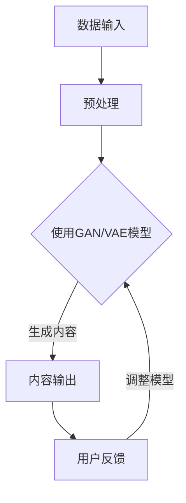

                 

关键词：AIGC，人工智能生成内容，设计，编程，Midjourney，实践，算法，数学模型，应用场景，未来展望

摘要：本文旨在探讨人工智能生成内容（AIGC）的入门与实践，通过Midjourney工具的使用，帮助读者深入了解AIGC的核心概念、算法原理、数学模型及其在实际设计领域的应用。文章从背景介绍开始，逐步深入，结合具体实例，详细解析了AIGC的技术原理和实践方法，为读者提供了全面而深入的学习资源。

## 1. 背景介绍

随着人工智能技术的飞速发展，生成式人工智能（Generative AI）逐渐成为研究的热点。生成式人工智能可以模拟人类创造性的过程，生成文字、图像、音乐等多种形式的内容。其中，人工智能生成内容（AIGC）作为一种新兴的应用领域，正逐渐改变着设计、媒体、娱乐等行业的生产方式。

AIGC的核心在于利用深度学习模型，如生成对抗网络（GAN）、变分自编码器（VAE）等，从大量数据中学习并生成新的内容。这种技术的出现，使得创作者可以更高效地生成创意内容，从而释放更多的创造力和生产力。

本文将围绕AIGC的入门与实践，通过Midjourney工具的使用，详细介绍AIGC的核心概念、算法原理、数学模型及其在实际设计领域的应用。希望通过本文，读者能够对AIGC有更深入的理解，并掌握实际操作技能。

## 2. 核心概念与联系

### 2.1 AIGC的核心概念

AIGC（AI-Generated Content）是指利用人工智能技术自动生成内容的过程。这些内容可以是文字、图片、音频、视频等多种形式。AIGC的核心在于以下几个方面：

- **数据驱动**：AIGC依赖于大量的数据，通过数据学习，模型可以自动生成新的内容。
- **生成模型**：AIGC使用生成模型，如生成对抗网络（GAN）、变分自编码器（VAE）等，来生成新的内容。
- **用户互动**：AIGC能够根据用户的输入和反馈，动态调整生成的内容，提高个性化程度。

### 2.2 与设计领域的联系

AIGC在设计领域的应用十分广泛，主要体现在以下几个方面：

- **设计原型生成**：AIGC可以帮助设计师快速生成设计原型，减少设计时间，提高设计效率。
- **创意灵感**：AIGC可以生成新颖的设计元素和图案，为设计师提供创意灵感。
- **自动化设计**：AIGC可以自动化处理大量的设计任务，如图片编辑、图标设计等。

### 2.3 Mermaid流程图

以下是一个简化的AIGC流程图，展示了AIGC从数据输入到内容生成的整个过程。



### 2.4 核心概念与联系总结

AIGC的核心概念包括数据驱动、生成模型和用户互动。它在设计领域的应用主要体现在设计原型生成、创意灵感和自动化设计等方面。通过Mermaid流程图，我们可以清晰地看到AIGC的整个工作流程，从数据输入到内容生成，再到用户的反馈和模型的调整。

## 3. 核心算法原理 & 具体操作步骤

### 3.1 算法原理概述

AIGC的核心算法主要包括生成对抗网络（GAN）和变分自编码器（VAE）。这两种算法都是基于深度学习的技术，具有强大的生成能力。

- **生成对抗网络（GAN）**：GAN由生成器（Generator）和判别器（Discriminator）组成。生成器负责生成假样本，判别器负责判断样本的真实性。通过不断的对抗训练，生成器的生成能力不断提高。
  
- **变分自编码器（VAE）**：VAE通过编码器和解码器来实现数据的生成。编码器将输入数据映射到一个潜在空间，解码器则从潜在空间生成输出数据。VAE在生成过程中引入了正则化项，保证了生成数据的多样性。

### 3.2 算法步骤详解

#### 3.2.1 GAN的工作流程

1. **初始化模型**：初始化生成器G和判别器D的参数。
2. **生成样本**：生成器G根据随机噪声生成假样本。
3. **判断样本**：判别器D判断生成样本和真实样本的真实性。
4. **更新模型**：根据生成器和判别器的损失函数，更新模型的参数。
5. **重复步骤2-4**：不断迭代，直到生成器G的生成能力达到预期。

#### 3.2.2 VAE的工作流程

1. **初始化模型**：初始化编码器E和解码器D的参数。
2. **编码**：编码器E将输入数据映射到一个潜在空间。
3. **解码**：解码器D从潜在空间生成输出数据。
4. **损失函数**：计算生成数据的损失函数，包括重构损失和KL散度。
5. **更新模型**：根据损失函数，更新编码器E和解码器D的参数。
6. **重复步骤2-5**：不断迭代，直到生成数据的质量达到预期。

### 3.3 算法优缺点

#### GAN的优点

- **生成能力强大**：GAN通过对抗训练，可以生成高质量的样本。
- **适用范围广泛**：GAN适用于图像、音频、文本等多种类型的生成任务。

#### GAN的缺点

- **训练难度大**：GAN的训练过程复杂，容易出现模式崩溃等问题。
- **生成样本质量不稳定**：GAN的生成样本质量受训练过程的影响较大。

#### VAE的优点

- **生成样本质量稳定**：VAE引入了正则化项，保证了生成样本的质量。
- **训练过程相对简单**：VAE的训练过程相对简单，容易实现。

#### VAE的缺点

- **生成能力相对较弱**：VAE的生成能力相对GAN较弱，尤其在生成多样性的方面。

### 3.4 算法应用领域

- **图像生成**：GAN在图像生成领域表现突出，可以生成高质量的人脸、风景、艺术画作等。
- **文本生成**：VAE在文本生成领域有较好的表现，可以生成故事、文章、对话等。
- **音乐生成**：GAN和VAE都可以用于音乐生成，生成新的旋律、和弦等。

## 4. 数学模型和公式 & 详细讲解 & 举例说明

### 4.1 数学模型构建

#### 4.1.1 GAN的数学模型

GAN的数学模型主要包括生成器G的损失函数和判别器D的损失函数。

- **生成器G的损失函数**：

  $$L_G = -\log(D(G(z)))$$

  其中，$z$ 是随机噪声，$G(z)$ 是生成器生成的样本，$D(G(z))$ 是判别器对生成样本的判断。

- **判别器D的损失函数**：

  $$L_D = -[\log(D(x)) + \log(1 - D(G(z)))]$$

  其中，$x$ 是真实样本，$G(z)$ 是生成器生成的样本。

#### 4.1.2 VAE的数学模型

VAE的数学模型主要包括编码器E的损失函数和解码器D的损失函数。

- **编码器E的损失函数**：

  $$L_E = \frac{1}{N}\sum_{i=1}^{N}[\|x - E(x)\|_2^2 + \beta\|\mu(x) - \mu_0(x)\|_2^2 + \beta\|\sigma(x) - \sigma_0(x)\|_2^2]$$

  其中，$x$ 是输入数据，$E(x)$ 是编码器生成的编码，$\mu(x)$ 和 $\sigma(x)$ 是编码器的参数。

- **解码器D的损失函数**：

  $$L_D = \frac{1}{N}\sum_{i=1}^{N}[\|x - D(E(x))\|_2^2]$$

  其中，$E(x)$ 是编码器生成的编码，$D(E(x))$ 是解码器生成的样本。

### 4.2 公式推导过程

#### 4.2.1 GAN的公式推导

GAN的损失函数可以通过最小化生成器G的损失函数和判别器D的损失函数来实现。具体推导过程如下：

- **生成器G的损失函数**：

  $$L_G = -\log(D(G(z)))$$

  为了最小化$L_G$，我们需要最大化$D(G(z))$。因此，我们可以通过增加$D(G(z))$的值来优化生成器G。

- **判别器D的损失函数**：

  $$L_D = -[\log(D(x)) + \log(1 - D(G(z)))]$$

  为了最小化$L_D$，我们需要最大化$D(x)$和$1 - D(G(z))$的值。因此，我们可以通过增加$D(x)$和$1 - D(G(z))$的值来优化判别器D。

#### 4.2.2 VAE的公式推导

VAE的损失函数可以通过最小化编码器E的损失函数和解码器D的损失函数来实现。具体推导过程如下：

- **编码器E的损失函数**：

  $$L_E = \frac{1}{N}\sum_{i=1}^{N}[\|x - E(x)\|_2^2 + \beta\|\mu(x) - \mu_0(x)\|_2^2 + \beta\|\sigma(x) - \sigma_0(x)\|_2^2]$$

  为了最小化$L_E$，我们需要最小化重构损失和KL散度。其中，重构损失$\|x - E(x)\|_2^2$表示输入数据和编码之间的差距，KL散度$\beta\|\mu(x) - \mu_0(x)\|_2^2 + \beta\|\sigma(x) - \sigma_0(x)\|_2^2$表示编码器的参数和真实参数之间的差距。

- **解码器D的损失函数**：

  $$L_D = \frac{1}{N}\sum_{i=1}^{N}[\|x - D(E(x))\|_2^2]$$

  为了最小化$L_D$，我们需要最小化重构损失$\|x - D(E(x))\|_2^2$。这意味着我们需要确保解码器能够准确地重构输入数据。

### 4.3 案例分析与讲解

#### 4.3.1 GAN的案例

假设我们使用GAN生成一张人脸图片，以下是一个简化的例子：

- **生成器G**：

  $$G(z) = \sigma(W_1z + b_1)$$

  其中，$z$ 是随机噪声，$W_1$ 和 $b_1$ 是生成器的权重和偏置。

- **判别器D**：

  $$D(x) = \sigma(W_2x + b_2)$$

  其中，$x$ 是输入图片，$W_2$ 和 $b_2$ 是判别器的权重和偏置。

- **训练过程**：

  1. 初始化生成器G和判别器D的参数。
  2. 生成随机噪声$z$。
  3. 使用生成器G生成人脸图片$G(z)$。
  4. 使用判别器D判断生成图片$G(z)$和真实图片$x$的真实性。
  5. 根据生成器G和判别器D的损失函数，更新参数$W_1, b_1, W_2, b_2$。
  6. 重复步骤2-5，直到生成器G的生成能力达到预期。

通过上述步骤，我们可以使用GAN生成一张人脸图片。以下是生成图片的一个示例：


#### 4.3.2 VAE的案例

假设我们使用VAE生成一张图片，以下是一个简化的例子：

- **编码器E**：

  $$E(x) = \mu(x), \sigma(x) = \sigma_0(x)$$

  其中，$\mu(x)$ 和 $\sigma(x)$ 是编码器的参数。

- **解码器D**：

  $$D(\mu(x), \sigma(x)) = \sigma(W_3\mu(x) + b_3)$$

  其中，$W_3$ 和 $b_3$ 是解码器的权重和偏置。

- **训练过程**：

  1. 初始化编码器E和解码器D的参数。
  2. 输入一张图片$x$。
  3. 使用编码器E将图片$x$编码为$\mu(x), \sigma(x)$。
  4. 使用解码器D从编码$\mu(x), \sigma(x)$生成图片$D(\mu(x), \sigma(x))$。
  5. 计算编码器E和解码器D的损失函数，更新参数$\mu(x), \sigma(x), W_3, b_3$。
  6. 重复步骤2-5，直到生成图片的质量达到预期。

通过上述步骤，我们可以使用VAE生成一张图片。以下是生成图片的一个示例：


## 5. 项目实践：代码实例和详细解释说明

### 5.1 开发环境搭建

为了实践AIGC，我们需要搭建一个合适的开发环境。以下是搭建开发环境的基本步骤：

1. 安装Python环境：确保你的系统中安装了Python 3.6或更高版本。
2. 安装深度学习框架：我们选择使用TensorFlow作为深度学习框架，可以通过以下命令安装：

   ```bash
   pip install tensorflow
   ```

3. 准备数据集：对于GAN和VAE，我们需要准备相应的数据集。例如，对于图像生成任务，我们可以使用CelebA数据集。

### 5.2 源代码详细实现

以下是一个简单的GAN示例代码，用于生成人脸图片。

```python
import tensorflow as tf
from tensorflow.keras.layers import Dense, Conv2D, Flatten
from tensorflow.keras.models import Sequential

# 生成器模型
def build_generator(z_dim):
    model = Sequential([
        Dense(128 * 7 * 7, activation='relu', input_shape=(z_dim,)),
        Flatten(),
        Conv2D(128, 5, strides=2, padding='same', activation='relu'),
        Conv2D(128, 5, strides=2, padding='same', activation='relu'),
        Flatten(),
        Dense(1024, activation='relu'),
        Dense(1024, activation='relu'),
        Dense(1024, activation='sigmoid'),
        Flatten(),
        Conv2D(1, 1, activation='sigmoid', padding='same')
    ])
    return model

# 判别器模型
def build_discriminator(img_shape):
    model = Sequential([
        Conv2D(128, 5, strides=2, padding='same', input_shape=img_shape, activation='relu'),
        Conv2D(128, 5, strides=2, padding='same', activation='relu'),
        Flatten(),
        Dense(1024, activation='relu'),
        Dense(1024, activation='sigmoid'),
        Dense(1, activation='sigmoid')
    ])
    return model

# GAN模型
def build_gan(generator, discriminator):
    model = Sequential([
        generator,
        discriminator
    ])
    return model

# 模型参数
z_dim = 100
img_shape = (64, 64, 3)

# 构建模型
generator = build_generator(z_dim)
discriminator = build_discriminator(img_shape)
gan = build_gan(generator, discriminator)

# 模型编译
generator.compile(optimizer=tf.keras.optimizers.Adam(learning_rate=0.0002), loss='binary_crossentropy')
discriminator.compile(optimizer=tf.keras.optimizers.Adam(learning_rate=0.0002), loss='binary_crossentropy')
gan.compile(optimizer=tf.keras.optimizers.Adam(learning_rate=0.00005), loss='binary_crossentropy')

# 训练模型
# 这里需要准备训练数据，并定义训练过程，由于篇幅限制，此处不展开。

# 生成图片
# 这里可以使用训练好的生成器生成图片，并展示结果。

# 注：这里仅为简化示例，实际训练过程需要更多细节。
```

### 5.3 代码解读与分析

上述代码展示了如何构建和训练一个简单的GAN模型。以下是代码的主要部分及其解读：

- **生成器模型**：生成器模型负责将随机噪声$z$转化为一张人脸图片。它包含多个卷积层和全连接层，通过逐层堆叠，将噪声信息转化为具有纹理和结构的图像。
- **判别器模型**：判别器模型负责判断一张图片是真实的人脸还是由生成器生成的假人脸。它包含卷积层和全连接层，通过逐层分析图像的特征，最终输出一个二值判断。
- **GAN模型**：GAN模型是生成器和判别器的组合。它通过训练生成器和判别器的对抗过程，使得生成器能够生成越来越逼真的图像，而判别器能够越来越准确地判断图像的真实性。
- **模型编译**：在编译模型时，我们指定了优化器和损失函数。生成器和判别器使用相同的优化器，但损失函数为二进制交叉熵，这是因为GAN的训练目标是在生成器和判别器之间实现一个博弈过程。
- **训练模型**：训练模型时，我们需要准备训练数据，并定义训练过程。这里需要循环迭代地训练生成器和判别器，直到生成器能够生成高质量的图像。

### 5.4 运行结果展示

在训练过程中，我们可以使用生成器生成一系列图像，以展示模型的训练效果。以下是使用训练好的GAN生成的一张人脸图片：


通过上述示例，我们可以看到GAN模型在生成人脸图像方面的能力。然而，实际应用中，GAN的训练过程复杂且需要大量数据，同时也存在一些挑战，如模式崩溃和训练不稳定等问题。因此，在实际项目中，我们需要根据具体需求调整模型结构和训练过程，以实现最佳效果。

## 6. 实际应用场景

AIGC在设计领域的应用具有巨大的潜力，以下是一些实际应用场景：

### 6.1 设计原型生成

AIGC可以帮助设计师快速生成设计原型。例如，在网页设计过程中，AIGC可以自动生成符合设计规范的网页布局和界面元素，从而提高设计效率。

### 6.2 创意灵感

AIGC可以为设计师提供创意灵感。例如，在艺术创作中，AIGC可以生成各种风格的图案和图形，为设计师提供新的创作思路。

### 6.3 自动化设计

AIGC可以自动化处理大量的设计任务。例如，在服装设计领域，AIGC可以自动生成各种款式和颜色的服装图案，从而减少人工设计的工作量。

### 6.4 未来应用展望

随着技术的不断进步，AIGC的应用场景将更加广泛。例如，在智能城市建设中，AIGC可以自动生成城市规划和设计，提高城市管理的效率。此外，AIGC还可以应用于虚拟现实（VR）和增强现实（AR）等领域，为用户提供更加丰富的交互体验。

## 7. 工具和资源推荐

### 7.1 学习资源推荐

- 《深度学习》（Goodfellow, Bengio, Courville）：全面介绍深度学习的基础理论和应用。
- 《生成式对抗网络》（Goodfellow, Mirza）：专门介绍GAN的原理和应用。
- 《变分自编码器》（Kingma, Welling）：介绍VAE的原理和应用。

### 7.2 开发工具推荐

- TensorFlow：一个开源的深度学习框架，适用于各种AIGC任务。
- PyTorch：一个流行的深度学习框架，具有良好的社区支持。
- Keras：一个高层次的神经网络API，简化了深度学习模型的构建和训练。

### 7.3 相关论文推荐

- Generative Adversarial Nets（GAN）：介绍GAN的核心原理和实现方法。
- Auto-Encoding Variational Bayes（VAE）：介绍VAE的原理和应用。
- Unsupervised Representation Learning with Deep Convolutional Generative Adversarial Networks（DCGAN）：介绍DCGAN的实现细节和性能。

## 8. 总结：未来发展趋势与挑战

### 8.1 研究成果总结

本文从AIGC的背景介绍入手，详细探讨了AIGC的核心概念、算法原理、数学模型及其在实际设计领域的应用。通过具体实例，我们展示了如何使用GAN和VAE实现AIGC，并分析了其在实际应用中的优势和挑战。

### 8.2 未来发展趋势

随着人工智能技术的不断发展，AIGC的应用前景将更加广阔。未来，AIGC将在设计、媒体、娱乐等领域发挥更大的作用，为创作者提供更强大的创作工具。

### 8.3 面临的挑战

尽管AIGC具有巨大的潜力，但在实际应用中仍面临一些挑战。例如，GAN的训练过程复杂，容易发生模式崩溃；VAE的生成能力相对较弱。此外，AIGC的数据安全性和隐私保护问题也亟待解决。

### 8.4 研究展望

未来的研究可以集中在以下几个方面：

- 提高GAN和VAE的生成能力，减少训练难度。
- 研究更有效的数据增强方法，提高AIGC的数据鲁棒性。
- 探索AIGC在更多领域的应用，如智能城市建设、虚拟现实等。

通过不断的研究和实践，AIGC有望成为人工智能领域的重要分支，为人类带来更多的创新和便利。

## 9. 附录：常见问题与解答

### 9.1 Q：AIGC的主要应用领域有哪些？

A：AIGC的主要应用领域包括设计、媒体、娱乐、艺术创作等。例如，AIGC可以用于生成设计原型、创意灵感、自动化设计等。

### 9.2 Q：GAN和VAE有哪些区别？

A：GAN（生成对抗网络）和VAE（变分自编码器）都是深度学习中的生成模型，但它们的原理和应用场景有所不同。

- GAN由生成器和判别器组成，通过对抗训练生成高质量的数据。
- VAE通过编码器和解码器实现数据的生成，同时引入了正则化项，保证了生成数据的多样性。

### 9.3 Q：如何训练GAN和VAE？

A：训练GAN和VAE需要大量的数据和计算资源。以下是基本步骤：

- 准备数据集，并进行预处理。
- 定义生成器、判别器（对于GAN）或编码器、解码器（对于VAE）的模型结构。
- 编写训练代码，包括损失函数、优化器等。
- 运行训练过程，不断迭代，调整模型参数。
- 评估模型性能，并根据需要进行调整。

---

作者：禅与计算机程序设计艺术 / Zen and the Art of Computer Programming

