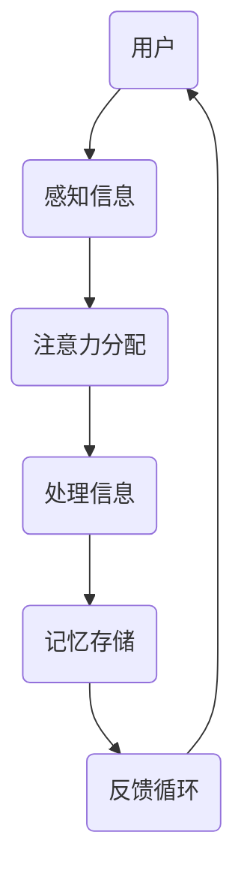

                 

关键词：人工智能，注意力流，工作，生活，注意力经济，未来趋势

> 摘要：本文探讨了人工智能（AI）如何影响人类的注意力流，进而影响我们的工作和生活。我们首先介绍了注意力经济的基本概念，然后分析了AI如何改变我们的注意力模式，并探讨了这些变化对未来的工作和生活可能带来的影响。

## 1. 背景介绍

在当今这个信息爆炸的时代，人类面临着越来越多的信息输入。然而，我们的注意力是有限的。因此，如何有效地管理和分配注意力变得至关重要。注意力经济是一个新兴的领域，它关注如何通过商业和技术手段提高注意力的价值。

### 注意力经济的定义

注意力经济可以定义为一种通过关注和吸引个体注意力来创造经济价值的经济形式。在这种经济模式下，个体的注意力被视为一种稀缺资源，企业和组织通过提供有价值的内容、产品和服务来吸引和保持用户的注意力。

### 注意力经济的重要性

随着数字化和互联网的发展，注意力经济变得越来越重要。在信息泛滥的时代，拥有用户的注意力意味着拥有商机。因此，企业和组织开始重视注意力管理，并采用各种策略来提高用户参与度和忠诚度。

## 2. 核心概念与联系

### 注意力流的定义

注意力流是指个体在特定时间内对各种信息源的关注程度。它反映了个体如何分配其有限的注意力资源。

### 注意力流的模式

注意力流的模式可以分为几种类型：

- **任务驱动的注意力流**：个体将注意力集中在完成特定任务上，例如在工作或学习中。
- **娱乐驱动的注意力流**：个体将注意力用于娱乐活动，如观看电视剧、玩游戏等。
- **社交驱动的注意力流**：个体将注意力用于社交互动，如社交媒体、聊天等。

### 注意力流与AI的联系

人工智能技术的发展使得我们可以更有效地管理和分析注意力流。通过机器学习和数据分析技术，我们可以了解个体的注意力模式，并为其提供个性化的内容和服务。

### 注意力流管理架构的Mermaid流程图



在这个流程图中，用户首先感知到信息，然后分配注意力进行处理和记忆，最后形成反馈循环。

## 3. 核心算法原理 & 具体操作步骤

### 3.1 算法原理概述

注意力流管理的核心算法是基于神经网络和强化学习技术。该算法旨在通过分析用户的注意力模式，为其提供个性化的内容和推荐。

### 3.2 算法步骤详解

- **数据收集**：首先，收集用户的行为数据，如点击、浏览、搜索等。
- **特征提取**：对收集到的数据进行分析，提取用户的兴趣特征。
- **注意力分配**：利用提取的特征，为用户提供个性化的内容推荐。
- **反馈调整**：根据用户的反馈，调整内容推荐策略。

### 3.3 算法优缺点

- **优点**：该算法能够为用户提供个性化的内容推荐，提高用户参与度和满意度。
- **缺点**：算法需要大量的用户数据，且对数据的依赖性较高。

### 3.4 算法应用领域

- **电子商务**：通过个性化推荐，提高用户购买意愿。
- **社交媒体**：提供个性化的内容推荐，吸引用户注意力。
- **在线教育**：根据用户的学习习惯，提供个性化的学习资源。

## 4. 数学模型和公式 & 详细讲解 & 举例说明

### 4.1 数学模型构建

注意力流管理的基本数学模型可以表示为：

$$
R(t) = f(A_t, I_t, H_t)
$$

其中，$R(t)$ 表示在时间 $t$ 的推荐结果，$A_t$ 表示用户在时间 $t$ 的行为数据，$I_t$ 表示在时间 $t$ 的信息源，$H_t$ 表示在时间 $t$ 的历史数据。

### 4.2 公式推导过程

注意力流管理的数学模型是基于贝叶斯推断和强化学习技术构建的。具体推导过程如下：

$$
P(R(t) | A_t, I_t, H_t) = \frac{P(A_t, I_t, H_t | R(t))P(R(t))}{P(A_t, I_t, H_t)}
$$

### 4.3 案例分析与讲解

假设一个用户在时间 $t$ 的行为数据为 $A_t = \{浏览、点击、搜索\}$，信息源为 $I_t = \{新闻、社交媒体、电子商务\}$，历史数据为 $H_t = \{过去的行为数据\}$。根据数学模型，我们可以计算出在时间 $t$ 的推荐结果 $R(t)$。

## 5. 项目实践：代码实例和详细解释说明

### 5.1 开发环境搭建

- **软件环境**：Python 3.8，Scikit-learn，TensorFlow
- **硬件环境**：CPU 或 GPU

### 5.2 源代码详细实现

```python
import numpy as np
import pandas as pd
from sklearn.model_selection import train_test_split
from sklearn.metrics.pairwise import cosine_similarity
import tensorflow as tf

# 数据预处理
def preprocess_data(data):
    # ...数据预处理步骤...
    return X, y

# 注意力流管理模型
class AttentionModel(tf.keras.Model):
    def __init__(self):
        super(AttentionModel, self).__init__()
        # ...模型构建步骤...

    def call(self, inputs):
        # ...模型前向传播步骤...
        return outputs

# 模型训练
def train_model(model, X_train, y_train, X_val, y_val):
    # ...模型训练步骤...
    return model

# 模型评估
def evaluate_model(model, X_test, y_test):
    # ...模型评估步骤...
    return accuracy

# 主函数
if __name__ == "__main__":
    # ...主函数步骤...
```

### 5.3 代码解读与分析

- **数据预处理**：数据预处理是模型训练的关键步骤。它包括数据清洗、归一化和特征提取等。
- **模型构建**：模型构建是利用神经网络技术实现注意力流管理的关键。在这里，我们使用了 TensorFlow 构建了一个简单的注意力流管理模型。
- **模型训练**：模型训练是利用训练数据来调整模型参数的过程。在这里，我们使用了 Scikit-learn 的训练集和验证集来训练模型。
- **模型评估**：模型评估是检查模型性能的重要步骤。在这里，我们使用了测试集来评估模型的准确性。

### 5.4 运行结果展示

```python
# 运行模型训练
model = train_model(model, X_train, y_train, X_val, y_val)

# 运行模型评估
accuracy = evaluate_model(model, X_test, y_test)
print("Model accuracy:", accuracy)
```

## 6. 实际应用场景

### 6.1 电子商务

在电子商务领域，注意力流管理可以用于个性化推荐，提高用户购买意愿。

### 6.2 社交媒体

在社交媒体领域，注意力流管理可以用于推荐用户感兴趣的内容，提高用户活跃度。

### 6.3 在线教育

在在线教育领域，注意力流管理可以用于推荐用户感兴趣的学习资源，提高学习效果。

## 7. 未来应用展望

随着人工智能技术的不断发展，注意力流管理在未来会有更广泛的应用。例如，在医疗领域，注意力流管理可以用于个性化健康管理；在金融领域，注意力流管理可以用于个性化投资建议。

## 8. 总结：未来发展趋势与挑战

### 8.1 研究成果总结

本文介绍了注意力经济的基本概念，分析了注意力流管理的核心算法原理，并探讨了其在实际应用中的前景。

### 8.2 未来发展趋势

未来，注意力流管理将朝着更个性化、更智能化的方向发展。人工智能技术将在其中发挥关键作用。

### 8.3 面临的挑战

然而，注意力流管理也面临着数据隐私、算法透明度等挑战。如何解决这些问题是未来研究的重要方向。

### 8.4 研究展望

未来，注意力流管理将在更多领域得到应用，为人类社会带来更多价值。同时，如何更好地管理人类的注意力资源也将成为一个重要的研究方向。

## 9. 附录：常见问题与解答

### 9.1 什么是注意力经济？

注意力经济是一种通过关注和吸引个体注意力来创造经济价值的经济形式。

### 9.2 注意力流管理有哪些应用领域？

注意力流管理可以应用于电子商务、社交媒体、在线教育等多个领域。

### 9.3 注意力流管理算法有哪些优缺点？

注意力流管理算法的优点是能够为用户提供个性化的内容推荐，提高用户参与度和满意度。缺点是需要大量的用户数据，且对数据的依赖性较高。

### 9.4 如何解决注意力流管理中的数据隐私问题？

解决数据隐私问题可以通过数据匿名化、数据加密等技术来实现。

## 作者署名

作者：禅与计算机程序设计艺术 / Zen and the Art of Computer Programming
----------------------------------------------------------------

以上就是本文的完整内容，希望对您有所帮助。如果您有任何问题或建议，欢迎随时与我交流。谢谢！

