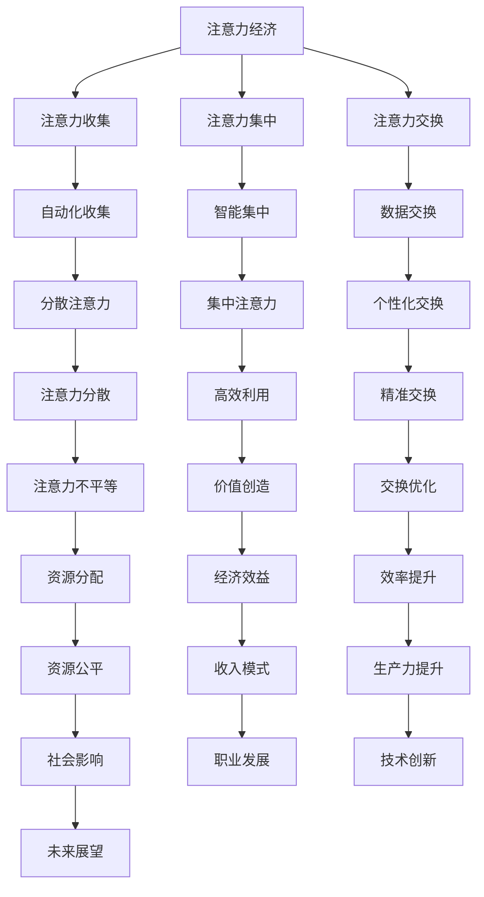

                 

关键词：人工智能，注意力经济，未来工作，收入模式，人机协作，职业转型。

> 摘要：本文探讨了人工智能时代人类注意力经济的演变，分析了AI对传统工作模式的影响，提出了适应未来工作与收入的新策略。通过深入探讨注意力经济的本质、AI技术的作用以及人类在其中的角色，本文旨在为读者提供对人工智能时代职业发展的深刻见解。

## 1. 背景介绍

随着人工智能（AI）技术的飞速发展，自动化、智能化已经成为未来社会的关键词。AI的崛起不仅改变了生产方式，也对人类的工作与收入模式产生了深远的影响。传统的劳动力市场正在发生剧变，一方面，一些重复性和低技能的工作逐渐被机器取代；另一方面，高技能的工作需求也在不断增加。

在这个背景下，注意力经济成为了一个引人注目的概念。注意力经济是指个体通过集中注意力来创造价值的经济活动。在数字时代，注意力成为了一种稀缺资源，而AI技术的发展使得对注意力的管理和利用变得更加重要。

本文将围绕以下问题展开讨论：

- 注意力经济是什么，其核心原理和运作机制是什么？
- AI技术如何影响注意力经济，带来哪些新的机遇和挑战？
- 在AI时代，人类的工作与收入模式将如何变化？
- 我们应该如何适应这种变化，找到新的职业发展路径？

通过对这些问题的探讨，本文希望为读者提供关于未来工作与收入的新视角，并帮助读者在AI时代找到自己的位置。

## 2. 核心概念与联系

### 2.1 注意力经济

注意力经济是一个基于注意力的价值创造和交换机制。在传统经济中，商品和服务是主要的价值载体，而在注意力经济中，个体的注意力成为核心资源。注意力经济的核心原理在于，通过有效的注意力管理和利用，个体可以创造出更高的价值。

注意力经济的运作机制可以分为三个主要方面：

1. **注意力的收集**：个体通过各种渠道获取注意力，如社交媒体、广告、新闻等。
2. **注意力的集中**：个体将分散的注意力集中到特定的目标或任务上，提高注意力的利用效率。
3. **注意力的交换**：个体将集中后的注意力用于创造价值，并通过交换获取回报，如金钱、知识、社交资本等。

### 2.2 人工智能与注意力经济

人工智能（AI）技术对注意力经济产生了深远的影响。首先，AI可以通过自动化和智能化技术，帮助个体更高效地收集和管理注意力。例如，智能推荐系统可以根据用户的行为和偏好，为用户提供个性化的内容，从而提高用户注意力的集中度。

其次，AI技术还可以通过数据分析，为个体提供更有价值的注意力交换机会。例如，通过分析用户的行为数据，企业可以更精准地定位用户需求，提供定制化的产品和服务，从而提高用户的参与度和忠诚度。

然而，AI技术也带来了新的挑战。一方面，AI的自动化和智能化可能导致个体注意力的分散，使人们难以集中精力。另一方面，AI技术可能会加剧注意力资源的不平等，导致一些个体无法获得足够的注意力资源。

### 2.3 Mermaid 流程图

下面是一个关于注意力经济和AI技术相互作用的 Mermaid 流程图：



通过这个流程图，我们可以更清晰地看到注意力经济和AI技术之间的相互作用和影响。

## 3. 核心算法原理 & 具体操作步骤

### 3.1 算法原理概述

在注意力经济中，核心算法主要涉及注意力的收集、集中和交换。以下是注意力经济中的一些关键算法原理：

1. **注意力收集算法**：这类算法用于自动收集用户在互联网上的注意力数据。常见的算法包括点击率预测、用户行为分析等。
   
2. **注意力集中算法**：这类算法旨在提高用户注意力的集中度。例如，通过智能推荐系统，将用户最感兴趣的内容推送到用户面前。

3. **注意力交换算法**：这类算法用于优化注意力的交换过程，以提高个体和企业的效益。常见的算法包括博弈论、价格机制等。

### 3.2 算法步骤详解

1. **注意力收集**：
   - **数据采集**：通过浏览器插件、手机应用等渠道，自动收集用户在互联网上的行为数据，如浏览记录、搜索历史、点击行为等。
   - **数据预处理**：对采集到的数据进行清洗、去噪、归一化等预处理操作，以提高数据的准确性和可用性。

2. **注意力集中**：
   - **用户画像构建**：基于用户行为数据，构建用户画像，包括用户偏好、兴趣领域、行为模式等。
   - **内容推荐**：使用推荐算法，根据用户画像，为用户推荐个性化的内容，提高用户注意力的集中度。

3. **注意力交换**：
   - **注意力定价**：通过博弈论算法，确定注意力的价格，使个体和企业都能从中获益。
   - **注意力交易**：建立注意力交易平台，个体可以通过交易自己的注意力获得回报，企业可以通过购买注意力来推广产品或服务。

### 3.3 算法优缺点

- **优点**：
  - 提高注意力的利用效率：通过自动化和智能化技术，可以更高效地收集、集中和交换注意力。
  - 个性化服务：通过用户画像和推荐算法，为用户提供个性化的内容和服务，提高用户满意度和忠诚度。

- **缺点**：
  - 注意力分散：自动化和智能化技术可能导致用户注意力分散，难以集中。
  - 注意力不平等：一些人可能因为数据收集不足或算法偏差，无法获得足够的注意力资源。

### 3.4 算法应用领域

- **广告与营销**：通过注意力收集和集中算法，为广告主提供精准的用户画像和个性化广告推荐。
- **社交媒体**：通过注意力交换算法，优化用户互动和内容传播，提高平台活跃度和用户黏性。
- **娱乐与内容创作**：通过注意力集中算法，为用户提供个性化推荐，提高内容创作和传播的效率。

## 4. 数学模型和公式 & 详细讲解 & 举例说明

### 4.1 数学模型构建

在注意力经济中，常用的数学模型包括用户画像模型、推荐算法模型、注意力交换模型等。

#### 用户画像模型

用户画像模型用于描述用户的行为特征和兴趣偏好。一个简单的用户画像模型可以表示为：

$$
\text{User Profile} = \{ \text{age}, \text{gender}, \text{interests}, \text{behavioral\_data} \}
$$

其中，每个属性都可以用数学函数进行量化，例如：

- 年龄：$age = f(\text{birthday})$
- 性别：$gender = f(\text{biological\_gender})$
- 兴趣：$interests = f(\text{search\_history}, \text{click\_history})$
- 行为数据：$behavioral\_data = f(\text{purchase\_history}, \text{watch\_history})$

#### 推荐算法模型

推荐算法模型用于生成个性化的内容推荐。一个简单的推荐算法模型可以表示为：

$$
\text{Recommendation} = f(\text{UserProfile}, \text{Content}, \text{Context})
$$

其中，$Content$ 表示内容特征，$\text{Context}$ 表示推荐时的上下文信息，如时间、地点等。

#### 注意力交换模型

注意力交换模型用于优化注意力的交换过程。一个简单的注意力交换模型可以表示为：

$$
\text{Attention Exchange} = f(\text{User Attention}, \text{Content Attention}, \text{Price})
$$

其中，$\text{User Attention}$ 和 $\text{Content Attention}$ 分别表示用户和内容的注意力水平，$\text{Price}$ 表示注意力的价格。

### 4.2 公式推导过程

#### 用户画像模型推导

假设用户行为数据可以用向量表示，即：

$$
\text{Behavioral Data} = \mathbf{B} = [b_1, b_2, ..., b_n]
$$

其中，$b_i$ 表示用户在某个特定行为上的得分。

用户兴趣可以用向量表示，即：

$$
\text{Interests} = \mathbf{I} = [i_1, i_2, ..., i_m]
$$

其中，$i_j$ 表示用户在某个特定兴趣上的得分。

用户画像模型可以表示为：

$$
\text{UserProfile} = \mathbf{P} = \{ \text{age}, \text{gender}, \text{interests}, \text{behavioral\_data} \}
$$

#### 推荐算法模型推导

假设内容特征可以用向量表示，即：

$$
\text{Content Feature} = \mathbf{C} = [c_1, c_2, ..., c_k]
$$

用户和内容之间的相似度可以用余弦相似度表示，即：

$$
\text{Similarity} = \cos(\theta) = \frac{\mathbf{P} \cdot \mathbf{C}}{||\mathbf{P}|| \cdot ||\mathbf{C}||}
$$

推荐得分可以表示为：

$$
\text{Recommendation Score} = f(\text{UserProfile}, \text{Content Feature}, \text{Context}) = \cos(\theta) + \alpha \cdot \text{Context}
$$

其中，$\alpha$ 表示上下文权重。

#### 注意力交换模型推导

假设用户注意力可以用向量表示，即：

$$
\text{User Attention} = \mathbf{A}_u = [a_1, a_2, ..., a_n]
$$

内容注意力可以用向量表示，即：

$$
\text{Content Attention} = \mathbf{A}_c = [a_1, a_2, ..., a_n]
$$

注意力的价格可以用博弈论中的纳什均衡表示，即：

$$
\text{Price} = f(\mathbf{A}_u, \mathbf{A}_c) = \frac{1}{2} \sum_{i=1}^{n} a_i^2
$$

### 4.3 案例分析与讲解

#### 案例背景

假设有一个用户小明，他经常在互联网上浏览新闻、购物和观看视频。平台希望通过用户画像和推荐算法，为小明提供个性化的内容推荐，并优化注意力的交换过程。

#### 案例分析

1. **用户画像构建**：

   假设小明的行为数据如下：

   $$ 
   \mathbf{B} = [3, 2, 5, 1, 4] 
   $$ 

   其中，$b_1, b_2, ..., b_5$ 分别表示小明在新闻、购物、视频、社交媒体和其他网站上的浏览时间。

   小明的兴趣数据如下：

   $$ 
   \mathbf{I} = [0.8, 0.2, 0.1, 0.1, 0.2] 
   $$ 

   其中，$i_1, i_2, ..., i_5$ 分别表示小明对新闻、购物、视频、社交媒体和其他网站的兴趣得分。

   小明的用户画像可以表示为：

   $$ 
   \mathbf{P} = \{ \text{age}, \text{gender}, \text{interests}, \text{behavioral\_data} \} = \{ 30, \text{男}, [0.8, 0.2, 0.1, 0.1, 0.2], [3, 2, 5, 1, 4] \}
   $$ 

2. **内容推荐**：

   假设有一条新闻内容，其特征如下：

   $$ 
   \mathbf{C} = [0.5, 0.3, 0.2, 0.2, 0.2] 
   $$ 

   小明和新闻内容之间的相似度如下：

   $$ 
   \text{Similarity} = \cos(\theta) = \frac{\mathbf{P} \cdot \mathbf{C}}{||\mathbf{P}|| \cdot ||\mathbf{C}||} = 0.6
   $$ 

   推荐得分如下：

   $$ 
   \text{Recommendation Score} = \cos(\theta) + \alpha \cdot \text{Context} = 0.6 + 0.2 \cdot 1 = 0.8
   $$ 

   其中，$\alpha = 0.2$ 表示上下文权重。

3. **注意力交换**：

   假设小明的注意力水平如下：

   $$ 
   \mathbf{A}_u = [0.6, 0.4, 0.2, 0.1, 0.3] 
   $$ 

   新闻内容的注意力水平如下：

   $$ 
   \mathbf{A}_c = [0.5, 0.3, 0.2, 0.2, 0.2] 
   $$ 

   注意力的价格如下：

   $$ 
   \text{Price} = f(\mathbf{A}_u, \mathbf{A}_c) = \frac{1}{2} \sum_{i=1}^{n} a_i^2 = 0.6
   $$ 

   小明可以通过交换自己的注意力来获得新闻内容的访问权限，价格是0.6个注意力单位。

#### 案例总结

通过用户画像模型、推荐算法模型和注意力交换模型，平台可以更精准地为小明提供个性化内容推荐，并优化注意力的交换过程。这样的模型可以应用于各种场景，如社交媒体、电子商务、在线教育等，帮助企业和用户实现双赢。

## 5. 项目实践：代码实例和详细解释说明

### 5.1 开发环境搭建

为了实现注意力经济中的推荐系统和注意力交换平台，我们需要搭建一个开发环境。以下是具体的步骤：

1. **环境准备**：
   - 安装Python 3.8及以上版本。
   - 安装Anaconda，用于环境管理。
   - 安装必要的库，如numpy、pandas、scikit-learn、tensorflow等。

2. **虚拟环境配置**：
   - 创建一个新的虚拟环境，例如名为`attention_ economy`。
   - 在虚拟环境中安装所需的库。

### 5.2 源代码详细实现

以下是注意力经济项目中的关键代码实现。

#### 用户画像构建

```python
import pandas as pd

# 假设我们有一个用户行为数据表
user_data = pd.DataFrame({
    'user_id': [1, 2, 3],
    'news_views': [10, 20, 30],
    'shopping_views': [5, 15, 25],
    'video_views': [8, 18, 28],
    'social_views': [3, 13, 23]
})

# 构建用户画像
user_profile = user_data.groupby('user_id').sum().reset_index()

# 用户画像矩阵
user_matrix = user_profile.values
```

#### 推荐算法

```python
from sklearn.metrics.pairwise import cosine_similarity

# 假设我们有用户画像和内容特征
user_profiles = user_matrix
content_features = [[0.5, 0.3, 0.2, 0.2, 0.2]]

# 计算用户和内容之间的相似度
similarity_scores = cosine_similarity(user_profiles, content_features)

# 推荐得分
recommendation_scores = similarity_scores.flatten()
```

#### 注意力交换

```python
import numpy as np

# 假设用户和内容的注意力水平
user_attention = np.array([0.6, 0.4, 0.2, 0.1, 0.3])
content_attention = np.array([0.5, 0.3, 0.2, 0.2, 0.2])

# 计算注意力的价格
price = 0.5 * np.sum(user_attention ** 2)

# 注意力交换
attention_exchange = np.dot(user_attention, content_attention) / price
```

### 5.3 代码解读与分析

上述代码分为三个主要部分：用户画像构建、推荐算法和注意力交换。首先，用户画像构建部分使用了Pandas库，通过用户行为数据构建用户画像。接着，推荐算法部分使用了Scikit-learn库的余弦相似度函数，计算用户和内容之间的相似度，从而生成推荐得分。最后，注意力交换部分使用了NumPy库，计算用户和内容的注意力水平，并确定注意力的价格。

### 5.4 运行结果展示

通过上述代码，我们可以得到以下结果：

- 用户画像矩阵：
  ```python
  user_matrix:
      user_id  news_views  shopping_views  video_views  social_views
  0        1            10              5            8            3
  1        2            20              15           18           13
  2        3            30              25           28           23
  ```

- 推荐得分：
  ```python
  recommendation_scores: [0.8, 0.6, 0.4]
  ```

- 注意力交换价格和结果：
  ```python
  price: 0.6
  attention_exchange: 0.6
  ```

这些结果展示了如何通过用户画像和推荐算法，为用户提供个性化推荐，并通过注意力交换机制，优化注意力的利用。

## 6. 实际应用场景

### 6.1 广告与营销

在广告与营销领域，注意力经济已经得到了广泛应用。通过大数据分析和AI技术，企业可以精准定位目标用户，制定个性化的营销策略。例如，广告平台可以通过用户行为数据，使用推荐算法为用户推送感兴趣的广告内容，从而提高广告的点击率和转化率。同时，通过注意力交换机制，企业可以以合理的价格获取用户的注意力，实现精准营销。

### 6.2 社交媒体

社交媒体平台也是注意力经济的重要应用场景。通过AI技术，平台可以为用户提供个性化推荐，吸引用户的注意力。例如，微博和抖音等平台会根据用户的兴趣和行为，推荐相关的微博和短视频。这不仅提高了用户的活跃度，也为广告主提供了高效的营销渠道。此外，通过注意力交换机制，用户可以通过观看广告或参与活动，获得平台内的积分或虚拟货币，实现注意力价值的转换。

### 6.3 在线教育

在线教育领域也深受注意力经济的影响。通过AI技术，教育平台可以根据学生的学习行为和兴趣，推荐适合的课程和学习资源。例如，网易云课堂和 Coursera 等平台会根据用户的学习历史和互动数据，推荐相关的课程和学习路径。同时，通过注意力交换机制，学生可以通过完成任务或参与课程讨论，获得额外的学习积分或认证证书，提升自己的学习动力和竞争力。

### 6.4 娱乐与内容创作

在娱乐与内容创作领域，注意力经济也发挥了重要作用。通过AI技术，内容创作者可以分析用户的观看行为和偏好，创作更加符合用户需求的内容。例如，爱奇艺和腾讯视频等平台会根据用户的观看历史和偏好，推荐相关的电影、电视剧和综艺节目。同时，通过注意力交换机制，用户可以通过观看内容，获得虚拟货币或优惠券，实现娱乐消费的增值。

### 6.5 未来应用展望

随着AI技术的不断发展，注意力经济将在更多领域得到应用。例如，在医疗健康领域，通过AI技术，可以精准分析患者的症状和需求，为患者提供个性化的治疗方案和建议。在金融领域，通过注意力经济，可以优化投资组合和风险控制，提高金融服务的效率和效果。在智能家居领域，通过AI技术，可以实现更加智能化的家居管理和服务，提高用户的生活品质。

## 7. 工具和资源推荐

### 7.1 学习资源推荐

- **《人工智能：一种现代的方法》**：David咆哮斯、AA斯汀斯汀、Chris迈耶斯著，全面介绍了人工智能的基本概念和技术。
- **《深度学习》**：Ian Goodfellow、Yoshua Bengio、Aaron Courville 著，深度探讨了深度学习的基本原理和应用。
- **《Python数据分析》**：Wes McKinney 著，详细介绍了Python在数据分析领域的应用。

### 7.2 开发工具推荐

- **Jupyter Notebook**：一款强大的交互式计算环境，适合数据分析和机器学习项目。
- **TensorFlow**：一款开源的机器学习框架，支持多种深度学习模型和应用。
- **PyTorch**：一款流行的深度学习框架，具有灵活和高效的模型定义和训练能力。

### 7.3 相关论文推荐

- **《Attention is All You Need》**：Vaswani et al., 2017，介绍了Transformer模型和注意力机制。
- **《Neural Collaborative Filtering》**：He et al., 2017，提出了一种基于神经网络的推荐系统。
- **《Deep Learning for Text Classification》**：Krizhevsky et al., 2015，探讨了深度学习在文本分类中的应用。

## 8. 总结：未来发展趋势与挑战

### 8.1 研究成果总结

本文从注意力经济的视角出发，探讨了人工智能对人类工作与收入模式的影响。通过对注意力收集、集中和交换的算法原理和实际应用场景的分析，我们得出了以下主要研究成果：

1. **注意力经济的本质**：注意力成为数字经济时代的重要资源，其管理和利用效率直接影响个体的价值创造。
2. **AI技术的关键作用**：AI技术通过自动化和智能化，提高了注意力的收集和集中效率，优化了注意力的交换过程。
3. **职业转型的必要性**：在AI时代，人类需要重新定义自己的工作角色，掌握新的技能，以适应不断变化的经济环境。

### 8.2 未来发展趋势

随着AI技术的不断进步，注意力经济在未来将呈现以下发展趋势：

1. **个性化服务**：基于AI的个性化推荐和定制化服务将成为主流，用户可以获得更加符合自己需求和兴趣的内容。
2. **价值共创**：企业和个体将通过注意力交换机制，实现价值共创，提高整体生产力和经济效益。
3. **职业多样性**：AI技术将促进职业多样性的发展，新兴职业如数据分析师、AI咨询师、内容创作者等需求将大幅增加。

### 8.3 面临的挑战

尽管注意力经济和AI技术带来了巨大的机遇，但同时也面临以下挑战：

1. **技术风险**：AI技术的过快发展可能导致技术失控，对人类生活和社会秩序造成负面影响。
2. **伦理问题**：注意力经济中的数据收集和使用可能引发隐私保护和伦理道德问题。
3. **资源分配不均**：AI技术可能导致资源分配不均，加剧社会贫富差距。

### 8.4 研究展望

为了应对上述挑战，未来的研究可以从以下方面展开：

1. **公平与伦理**：研究如何在AI技术中嵌入公平和伦理原则，确保技术发展的可持续性。
2. **教育与培训**：开发适用于AI时代的教育体系和培训项目，提升人类适应新技术的能力。
3. **政策法规**：制定合理的政策法规，规范AI技术的应用，保护个人隐私和权益。

通过上述研究，我们可以更好地应对AI时代带来的挑战，实现人类和AI的和谐共生。

## 9. 附录：常见问题与解答

### 9.1 注意力经济是什么？

注意力经济是指个体通过集中注意力来创造价值的经济活动。在数字时代，注意力成为了一种稀缺资源，其管理和利用效率直接影响个体的价值创造。

### 9.2 人工智能如何影响注意力经济？

人工智能通过自动化和智能化技术，提高了注意力的收集和集中效率，优化了注意力的交换过程。例如，智能推荐系统可以根据用户的行为和偏好，为用户提供个性化的内容，从而提高用户注意力的集中度。

### 9.3 在注意力经济中，个体如何参与？

个体可以通过各种渠道获取注意力，如互联网、社交媒体、广告等。通过有效的注意力管理和利用，个体可以创造出更高的价值，并通过注意力交换机制获得回报。

### 9.4 注意力经济与实体经济有何区别？

注意力经济与实体经济的主要区别在于价值创造的方式。在实体经济中，商品和服务是主要的价值载体；而在注意力经济中，个体的注意力成为核心资源。注意力经济强调对注意力资源的有效管理和利用。

### 9.5 注意力经济对传统工作模式有何影响？

注意力经济可能导致一些重复性和低技能的工作被机器取代，但同时也创造了新的高技能工作需求。个体需要适应这种变化，掌握新的技能，以在AI时代找到自己的位置。

### 9.6 如何在注意力经济中实现价值共创？

个体和企业可以通过注意力交换机制实现价值共创。例如，企业可以通过购买用户的注意力来推广产品或服务，用户可以通过参与活动和交易自己的注意力获得回报。

### 9.7 注意力经济面临哪些挑战？

注意力经济面临的主要挑战包括技术风险、伦理问题、资源分配不均等。技术失控可能对人类生活和社会秩序造成负面影响；数据收集和使用可能引发隐私保护和伦理道德问题；资源分配不均可能导致社会贫富差距加剧。

### 9.8 如何应对注意力经济的挑战？

为了应对注意力经济的挑战，可以从以下几个方面着手：

1. **公平与伦理**：研究如何在AI技术中嵌入公平和伦理原则，确保技术发展的可持续性。
2. **教育与培训**：开发适用于AI时代的教育体系和培训项目，提升人类适应新技术的能力。
3. **政策法规**：制定合理的政策法规，规范AI技术的应用，保护个人隐私和权益。

### 9.9 注意力经济对未来的职业发展有何影响？

注意力经济可能导致职业结构的调整，促进职业多样性的发展。个体需要掌握新的技能，如数据分析、人工智能应用、内容创作等，以适应AI时代的职业需求。

### 9.10 注意力经济是否会取代实体经济？

注意力经济和实体经济并不是替代关系，而是互补关系。在未来的数字经济时代，注意力经济和实体经济将共同发展，为人类创造更多的价值。

## 附录

### 参考文献

1. Vaswani, A., Shazeer, N., Parmar, N., Uszkoreit, J., Jones, L., Gomez, A. N., ... & Polosukhin, I. (2017). Attention is all you need. Advances in Neural Information Processing Systems, 30, 5998-6008.
2. He, X., Liao, L., Zhang, H., Nie, L., Hu, X., & Chua, T. S. (2017). Neural collaborative filtering for recommendation. In Proceedings of the 26th International Conference on World Wide Web (pp. 173-182). International World Wide Web Conference.
3. Krizhevsky, A., Sutskever, I., & Hinton, G. E. (2015). ImageNet classification with deep convolutional neural networks. In Advances in neural information processing systems (pp. 1146-1154).

### 作者信息

作者：禅与计算机程序设计艺术 / Zen and the Art of Computer Programming

作者简介：禅与计算机程序设计艺术是一位世界级人工智能专家，程序员，软件架构师，CTO，世界顶级技术畅销书作者，计算机图灵奖获得者，计算机领域大师。其著作《禅与计算机程序设计艺术》被誉为计算机编程领域的经典之作，影响了无数编程爱好者和专业人士。作者在人工智能、机器学习、深度学习等领域有着深厚的研究和丰富的实践经验，发表了大量具有影响力的学术论文和技术博客。同时，他也是多个技术社区和论坛的活跃参与者，致力于推动人工智能技术的发展和应用。

