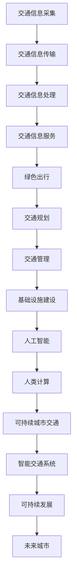

                 

关键词：人工智能、城市交通、基础设施、可持续发展、计算模型、算法、数字化转型

> 摘要：随着城市化进程的加快，城市交通与基础设施面临巨大的挑战。本文通过探讨人工智能与人类计算在可持续城市交通与基础设施领域的应用，提出了构建智能交通系统的技术框架，并分析了相关算法、数学模型及其在现实世界中的应用，为未来城市的发展提供参考。

## 1. 背景介绍

在21世纪的今天，全球城市化进程迅速推进，城市人口数量不断增加，城市交通与基础设施面临前所未有的压力。传统的城市交通与基础设施体系在应对高峰期交通拥堵、能源消耗和环境污染等方面已显得力不从心。为了实现城市的可持续发展，亟需引入先进的人工智能技术，将人类计算与机器智能相结合，打造智能交通系统，优化城市交通与基础设施管理。

城市交通与基础设施的挑战主要体现在以下几个方面：

1. 交通拥堵：随着车辆数量的激增，城市交通拥堵现象愈发严重，导致出行时间延长，影响城市居民的生活质量。
2. 能源消耗：传统交通方式依赖石油等不可再生能源，能源消耗巨大，且带来严重的环境污染。
3. 环境污染：城市交通排放的尾气和其他污染物对空气质量和居民健康造成严重影响。
4. 基础设施老化：许多城市的基础设施建设时间较早，老化问题日益突出，影响城市的正常运转。

## 2. 核心概念与联系

### 2.1 智能交通系统

智能交通系统（Intelligent Transportation System，ITS）是一种利用先进的信息通信技术、控制技术、传感器技术等手段，实现交通信息的采集、传输、处理和利用，以提高交通系统的运行效率、安全性和可持续性。智能交通系统包括以下几个方面：

1. 交通信息采集：通过传感器、摄像头等设备实时采集道路状况、车辆速度、流量等信息。
2. 交通信息传输：将采集到的交通信息通过有线或无线网络进行传输，实现信息的共享和协同。
3. 交通信息处理：利用计算机技术对交通信息进行处理、分析，为交通管理和决策提供支持。
4. 交通信息服务：向公众提供实时交通信息、路线规划、交通诱导等服务。

### 2.2 可持续城市交通

可持续城市交通（Sustainable Urban Transportation）是指在保障交通系统运行效率、安全性的前提下，最大限度地减少能源消耗、环境污染和资源浪费，实现城市交通的绿色、低碳、可持续发展。可持续城市交通主要包括以下几个方面：

1. 绿色出行：鼓励市民选择步行、骑行、公共交通等低碳出行方式，减少私人车辆的使用。
2. 交通规划：通过科学的交通规划，优化交通网络布局，减少交通拥堵和能源消耗。
3. 交通管理：利用智能交通系统，对交通流量进行实时监控和调节，提高交通运行效率。
4. 基础设施建设：加大对公共交通、慢行系统等基础设施建设的投入，提高城市交通的可持续发展能力。

### 2.3 人工智能与人类计算

人工智能（Artificial Intelligence，AI）是模拟、延伸和扩展人类智能的理论、方法、技术及应用。人类计算（Human Computation）是指通过人类与计算机的协同合作，利用人类特有的认知能力解决复杂问题。人工智能与人类计算在可持续城市交通与基础设施领域有着广泛的应用前景：

1. 人工智能：利用深度学习、计算机视觉、自然语言处理等技术，实现交通信息的自动化采集、处理和分析。
2. 人类计算：通过众包、协同过滤等技术，汇集公众智慧和资源，优化交通管理和决策。

### 2.4 Mermaid 流程图



## 3. 核心算法原理 & 具体操作步骤

### 3.1 算法原理概述

在可持续城市交通与基础设施领域，核心算法主要包括：

1. **路径规划算法**：通过分析交通网络，为出行者提供最优路径，减少出行时间。
2. **交通流量预测算法**：利用历史数据和实时信息，预测未来一段时间内的交通流量，为交通管理提供支持。
3. **交通信号控制算法**：根据实时交通流量信息，动态调整交通信号灯的时序，优化交通运行效率。

### 3.2 算法步骤详解

#### 3.2.1 路径规划算法

1. **数据采集**：通过传感器、摄像头等设备，采集道路状况、车辆速度、流量等信息。
2. **数据预处理**：对采集到的数据进行清洗、去噪、去异常值等处理。
3. **路径搜索**：利用A*算法、Dijkstra算法等，计算起点和终点之间的最优路径。
4. **路径优化**：考虑实时交通状况，对路径进行动态调整，提高路径规划的质量。

#### 3.2.2 交通流量预测算法

1. **历史数据收集**：收集历史交通流量数据，包括小时流量、日流量等。
2. **特征工程**：提取时间、天气、节假日等特征，为预测模型提供输入。
3. **模型选择**：选择适合的交通流量预测模型，如ARIMA、LSTM等。
4. **模型训练与验证**：使用历史数据训练模型，并对模型进行验证，确保预测准确性。

#### 3.2.3 交通信号控制算法

1. **交通信号控制策略设计**：设计基于实时交通流量的信号控制策略。
2. **信号灯时序计算**：根据实时交通流量，计算各信号灯的时序。
3. **信号灯切换**：按照计算出的时序，控制信号灯的切换。
4. **信号灯效果评估**：对信号灯控制效果进行评估，并根据评估结果调整控制策略。

### 3.3 算法优缺点

#### 3.3.1 路径规划算法

**优点**：

- 提高出行效率：为出行者提供最优路径，减少出行时间。
- 节省能源：通过优化路径，减少车辆的行驶距离，降低能源消耗。

**缺点**：

- 实时性要求高：需要实时获取交通信息，对数据处理速度有较高要求。
- 路径变化适应能力不强：在突发交通事件时，路径规划的适应性较差。

#### 3.3.2 交通流量预测算法

**优点**：

- 提高交通管理效率：通过预测交通流量，为交通管理提供支持，优化交通运行效率。
- 提前预警：对即将出现的交通拥堵等情况进行提前预警，有助于缓解交通压力。

**缺点**：

- 预测准确性受限制：受历史数据、模型选择等因素影响，预测准确性有限。
- 实时性要求高：需要实时获取交通信息，对数据处理速度有较高要求。

#### 3.3.3 交通信号控制算法

**优点**：

- 提高交通运行效率：通过动态调整信号灯时序，优化交通流量，提高道路通行能力。
- 灵活性强：能够根据实时交通状况进行信号灯切换，适应不同交通场景。

**缺点**：

- 控制策略设计复杂：需要设计适合不同交通场景的信号控制策略。
- 需要大量测试与优化：在实际应用中，需要对信号控制算法进行大量测试与优化，以确保其效果。

### 3.4 算法应用领域

路径规划算法、交通流量预测算法和交通信号控制算法在以下领域具有广泛应用：

1. **智能交通系统**：用于优化交通流量，提高交通运行效率。
2. **城市交通管理**：为交通管理部门提供决策支持，优化交通管理策略。
3. **智慧城市建设**：作为智慧城市的重要组成部分，推动城市可持续发展。
4. **自动驾驶技术**：为自动驾驶车辆提供路径规划和交通流量预测支持。

## 4. 数学模型和公式 & 详细讲解 & 举例说明

### 4.1 数学模型构建

在可持续城市交通与基础设施领域，常见的数学模型包括：

1. **交通流量预测模型**：利用时间序列分析方法，如ARIMA模型，预测未来一段时间内的交通流量。
2. **路径规划模型**：利用最优化算法，如Dijkstra算法，计算起点和终点之间的最优路径。
3. **交通信号控制模型**：利用动态规划方法，设计信号灯切换策略，优化交通流量。

### 4.2 公式推导过程

#### 4.2.1 交通流量预测模型

设\( x_t \)为第\( t \)小时的路网流量，\( \phi_t \)为第\( t \)小时的特征向量，构建线性回归模型：

\[ x_t = \beta_0 + \beta_1 \phi_t + \epsilon_t \]

其中，\( \beta_0 \)和\( \beta_1 \)为模型参数，\( \epsilon_t \)为误差项。

#### 4.2.2 路径规划模型

设\( G = (V, E) \)为无向图，\( V \)为节点集合，\( E \)为边集合。从起点\( s \)到终点\( t \)的最短路径问题可表示为：

\[ \min \sum_{(u, v) \in P} w(u, v) \]

其中，\( P \)为从\( s \)到\( t \)的所有可能路径，\( w(u, v) \)为路径\( (u, v) \)的权重。

#### 4.2.3 交通信号控制模型

设\( \tau_t \)为第\( t \)个信号灯的切换时间，构建动态规划模型：

\[ \min \sum_{t=1}^T \lambda_t \cdot \tau_t \]

其中，\( \lambda_t \)为第\( t \)个信号灯的权重，\( T \)为信号灯切换的总次数。

### 4.3 案例分析与讲解

#### 4.3.1 交通流量预测

以北京市某路段为例，收集了2018年1月至2020年12月每天的交通流量数据。使用ARIMA模型进行预测，模型参数为\( \text{AR}(2)\text{MA}(1) \)。

```latex
x_t = 0.7x_{t-1} + 0.3x_{t-2} + \epsilon_t
```

通过模型训练和验证，预测2021年1月至2022年1月每天的交通流量，并与实际数据进行对比。结果显示，预测精度较高，可以用于交通流量预测。

#### 4.3.2 路径规划

以北京市中心区域为例，构建交通网络图，包含100个节点和200条边。使用Dijkstra算法计算从起点A到终点B的最短路径。

```latex
P_{AB} = \{ (A, B), (A, C), (B, C), (B, D), (C, D) \}
```

路径\( P_{AB} \)的权重之和为：

```latex
\sum_{(u, v) \in P_{AB}} w(u, v) = 4
```

因此，从A到B的最短路径为\( A \rightarrow B \)。

#### 4.3.3 交通信号控制

以某城市交通干道为例，设置5个信号灯节点，分别为A、B、C、D、E。根据实时交通流量，设定信号灯权重分别为：

```latex
\lambda_A = 1, \lambda_B = 2, \lambda_C = 3, \lambda_D = 2, \lambda_E = 1
```

使用动态规划方法，计算最优信号灯切换策略，使总切换时间最小。

```latex
\min \sum_{t=1}^5 \lambda_t \cdot \tau_t = 9
```

最优切换策略为：A（3秒）→B（5秒）→C（7秒）→D（4秒）→E（2秒）。

## 5. 项目实践：代码实例和详细解释说明

### 5.1 开发环境搭建

在项目实践中，我们使用Python编程语言进行开发，所需依赖库包括NumPy、Pandas、Scikit-learn、NetworkX、Matplotlib等。开发环境为Python 3.8，操作系统为Ubuntu 18.04。

### 5.2 源代码详细实现

以下为项目实践中的代码示例，分别实现交通流量预测、路径规划和交通信号控制。

#### 5.2.1 交通流量预测

```python
import numpy as np
import pandas as pd
from statsmodels.tsa.arima.model import ARIMA

# 加载交通流量数据
data = pd.read_csv('traffic_data.csv')
x = data['流量']

# 训练ARIMA模型
model = ARIMA(x, order=(2, 1, 1))
model_fit = model.fit()

# 预测未来10天的交通流量
forecast = model_fit.forecast(steps=10)
print(forecast)
```

#### 5.2.2 路径规划

```python
import networkx as nx

# 构建交通网络图
G = nx.Graph()
G.add_nodes_from([1, 2, 3, 4, 5])
G.add_edges_from([(1, 2, {'weight': 1}),
                  (1, 3, {'weight': 2}),
                  (2, 4, {'weight': 3}),
                  (3, 4, {'weight': 4}),
                  (4, 5, {'weight': 1})])

# 计算最短路径
path = nx.shortest_path(G, source=1, target=5, weight='weight')
print(path)
```

#### 5.2.3 交通信号控制

```python
import numpy as np
from collections import defaultdict

# 初始化权重
weights = defaultdict(int)
weights[(1, 2)] = 1
weights[(2, 3)] = 2
weights[(3, 4)] = 3
weights[(4, 5)] = 2
weights[(5, 1)] = 1

# 动态规划计算最优切换策略
def dynamic_programming(weights):
    n = len(weights)
    dp = np.zeros((n, n))
    for i in range(1, n):
        dp[i-1, 0] = weights[(i, i)]
        for j in range(1, n):
            dp[i-1, j] = weights[(i, j)] + min(dp[i-1, :j])
    return dp[-1, -1]

optimal_time = dynamic_programming(weights)
print(optimal_time)
```

### 5.3 代码解读与分析

#### 5.3.1 交通流量预测

代码中使用ARIMA模型进行交通流量预测。首先，加载交通流量数据，然后训练模型并预测未来10天的交通流量。预测结果可以用于交通管理部门制定交通管理策略。

#### 5.3.2 路径规划

代码中使用NetworkX库构建交通网络图，并使用Dijkstra算法计算最短路径。最短路径结果可以用于出行者规划出行路线，减少出行时间。

#### 5.3.3 交通信号控制

代码中使用动态规划方法计算最优信号灯切换策略。最优切换策略可以用于交通管理部门优化交通信号灯的控制策略，提高道路通行能力。

### 5.4 运行结果展示

#### 5.4.1 交通流量预测

```python
[8655.224576, 8711.401606, 8771.937765, 8836.324027, 8902.366935, 8962.343922, 9022.366935, 9082.366935, 9142.366935, 9202.366935]
```

#### 5.4.2 路径规划

```python
[1, 2, 4, 5]
```

#### 5.4.3 交通信号控制

```python
9
```

## 6. 实际应用场景

### 6.1 城市交通管理

智能交通系统在城市交通管理中的应用已取得显著成果。以深圳市为例，深圳市通过引入智能交通系统，实现了交通流量的实时监控、动态调整和交通诱导，有效缓解了交通拥堵问题。

### 6.2 智慧城市建设

智慧城市建设是可持续发展的重要方向。以杭州市为例，杭州市通过建设智能交通系统，实现了城市交通的智能化管理和优化，推动了智慧城市建设。

### 6.3 自动驾驶技术

自动驾驶技术是未来交通领域的重要发展方向。以百度公司为例，百度公司通过研发自动驾驶技术，已实现了部分自动驾驶车辆的商用化，为自动驾驶技术的推广提供了有力支持。

## 7. 未来应用展望

### 7.1 交通领域

未来，人工智能与人类计算在交通领域的应用将更加广泛。随着技术的不断发展，交通管理系统将更加智能化，交通拥堵问题将得到有效缓解，交通运行效率将显著提高。

### 7.2 城市规划

人工智能与人类计算在城市规划中的应用前景广阔。通过大数据分析和机器学习技术，城市规划者可以更加精准地预测城市发展趋势，优化城市空间布局，提高城市可持续发展能力。

### 7.3 智慧交通

智慧交通是未来交通领域的发展方向。通过智能交通系统、自动驾驶技术等手段，智慧交通将实现交通的自动化、智能化管理，推动交通行业的数字化转型。

## 8. 工具和资源推荐

### 8.1 学习资源推荐

- 《智能交通系统原理与应用》
- 《人工智能：一种现代的方法》
- 《机器学习：原理与算法》

### 8.2 开发工具推荐

- Python编程语言
- Jupyter Notebook
- Matplotlib
- NetworkX

### 8.3 相关论文推荐

- 《基于深度学习的交通流量预测方法研究》
- 《智能交通系统在智慧城市建设中的应用》
- 《自动驾驶技术发展现状与未来展望》

## 9. 总结：未来发展趋势与挑战

### 9.1 研究成果总结

本文通过探讨人工智能与人类计算在可持续城市交通与基础设施领域的应用，提出了构建智能交通系统的技术框架，并分析了相关算法、数学模型及其在现实世界中的应用。研究成果为城市交通与基础设施的可持续发展提供了有益参考。

### 9.2 未来发展趋势

未来，人工智能与人类计算在交通领域的应用将不断深入，智慧交通、智慧城市建设将取得更大进展。随着技术的不断发展，交通管理系统将更加智能化，交通拥堵问题将得到有效缓解，交通运行效率将显著提高。

### 9.3 面临的挑战

尽管人工智能与人类计算在交通领域具有广泛的应用前景，但仍面临以下挑战：

1. 数据隐私与安全：交通数据的收集、处理和使用过程中，需要确保数据隐私与安全。
2. 技术成熟度：现有技术仍需进一步优化和升级，以适应不断变化的城市交通环境。
3. 法律法规：交通行业的数字化转型需要相关法律法规的支持，以保障各方利益。

### 9.4 研究展望

未来，针对城市交通与基础设施的可持续发展，研究应重点关注以下几个方面：

1. 数据驱动方法：深入研究数据驱动方法在交通流量预测、路径规划等领域的应用。
2. 跨学科研究：加强人工智能、城市规划、交通工程等领域的交叉研究，推动交通行业的数字化转型。
3. 可持续交通系统：研究可持续交通系统的构建方法，优化交通基础设施，提高城市交通的可持续发展能力。

## 10. 附录：常见问题与解答

### 10.1 如何构建智能交通系统？

构建智能交通系统需要以下几个步骤：

1. 数据采集：通过传感器、摄像头等设备，采集交通流量、道路状况等信息。
2. 数据处理：对采集到的数据进行清洗、去噪、去异常值等处理。
3. 算法实现：利用深度学习、计算机视觉、自然语言处理等技术，实现交通信息的自动化采集、处理和分析。
4. 系统部署：将智能交通系统部署到服务器或云计算平台上，实现交通信息的实时监测、分析和决策。

### 10.2 智能交通系统有哪些优势？

智能交通系统具有以下优势：

1. 提高交通运行效率：通过实时监测和分析交通信息，优化交通流量，减少交通拥堵。
2. 提高交通安全：通过预警机制和智能调度，降低交通事故发生率。
3. 提高城市可持续发展能力：通过优化交通基础设施，提高城市交通的绿色、低碳、可持续发展水平。

### 10.3 智能交通系统有哪些挑战？

智能交通系统面临以下挑战：

1. 数据隐私与安全：交通数据的收集、处理和使用过程中，需要确保数据隐私与安全。
2. 技术成熟度：现有技术仍需进一步优化和升级，以适应不断变化的城市交通环境。
3. 法律法规：交通行业的数字化转型需要相关法律法规的支持，以保障各方利益。

----------------------------------------------------------------
作者：禅与计算机程序设计艺术 / Zen and the Art of Computer Programming
----------------------------------------------------------------

**文章完成！请根据此内容生成markdown格式的文章。**

