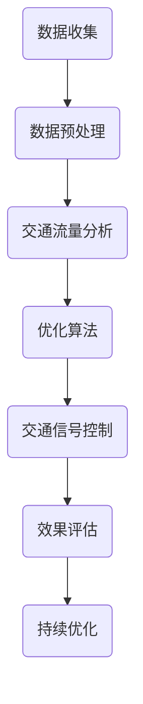
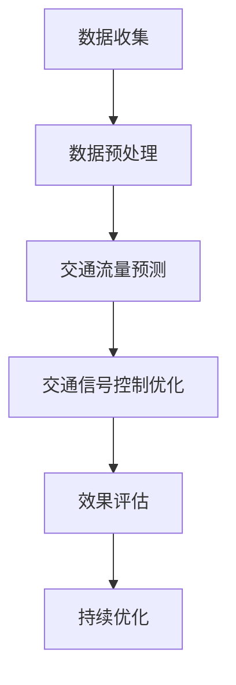

                 

关键词：人工智能、城市交通规划、可持续发展、算法、数学模型、实践案例

> 摘要：本文探讨了人工智能在城市交通规划中的应用，通过核心概念、算法原理、数学模型、实践案例等多角度分析，旨在为打造可持续发展的城市交通规划提供有力支持。文章分为八个部分，依次介绍了背景、核心概念与联系、核心算法原理与操作步骤、数学模型与公式、项目实践、实际应用场景、未来应用展望以及总结与展望。

## 1. 背景介绍

### 1.1 城市交通问题的挑战

随着全球城市化的加速，城市交通问题日益突出。交通拥堵、污染问题、能源消耗等挑战已成为影响城市可持续发展的关键因素。传统的交通规划方法在应对这些挑战时显得力不从心，而人工智能技术的崛起为解决这些问题提供了新的可能。

### 1.2 人工智能在交通领域的应用

人工智能技术在交通领域的应用涵盖了从自动驾驶到智能交通信号控制等多个方面。通过大数据分析、机器学习和深度学习等算法，人工智能能够优化交通流量、预测交通状况、提高交通效率，从而为可持续发展提供技术支撑。

## 2. 核心概念与联系

### 2.1 人工智能与人类计算

人工智能（AI）与人类计算（HC）是两个紧密联系的概念。人类计算强调人类在解决问题时的直觉、经验和创造力，而人工智能则通过模拟人类智能来解决问题。在城市交通规划中，人工智能与人类计算的结合能够发挥更大的作用。

### 2.2 Mermaid 流程图

下面是一个描述城市交通规划中人工智能应用流程的 Mermaid 图：



## 3. 核心算法原理 & 具体操作步骤

### 3.1 算法原理概述

本文将重点介绍两种算法：交通流量预测算法和交通信号控制优化算法。交通流量预测算法通过分析历史数据、实时数据和交通规则，预测未来的交通流量。交通信号控制优化算法则根据交通流量预测结果，优化交通信号灯的时序，提高交通效率。

### 3.2 算法步骤详解

#### 3.2.1 交通流量预测算法

1. 数据收集：收集历史交通流量数据、实时交通数据、气象数据等。
2. 数据预处理：对数据进行清洗、归一化等处理。
3. 特征提取：从数据中提取有用的特征。
4. 模型训练：使用机器学习算法训练流量预测模型。
5. 预测：利用训练好的模型进行交通流量预测。
6. 结果评估：评估预测结果的准确性。

#### 3.2.2 交通信号控制优化算法

1. 数据收集：收集交通信号灯的实时数据、交通流量预测结果等。
2. 确定优化目标：根据交通流量预测结果，确定优化目标，如最小化延误、最大化通行能力等。
3. 算法设计：设计适用于交通信号控制的优化算法，如动态交通信号控制算法。
4. 算法实现：实现优化算法，并进行调试。
5. 优化：根据实时数据，对交通信号进行优化。
6. 结果评估：评估优化结果，如交通流量、延误等指标。

### 3.3 算法优缺点

#### 交通流量预测算法

**优点：**

- 提高交通效率
- 降低交通拥堵
- 提高出行体验

**缺点：**

- 需要大量的历史数据和实时数据
- 模型训练时间较长
- 对算法设计和实现要求较高

#### 交通信号控制优化算法

**优点：**

- 提高交通效率
- 减少交通延误
- 降低能源消耗

**缺点：**

- 需要实时数据支持
- 优化效果受交通流量预测准确性影响
- 算法实现和维护成本较高

### 3.4 算法应用领域

交通流量预测算法和交通信号控制优化算法主要应用于城市交通管理、智能交通系统、自动驾驶等领域。通过这些算法的应用，可以优化交通流量，提高交通效率，减少交通拥堵，从而为城市可持续发展提供支持。

## 4. 数学模型和公式 & 详细讲解 & 举例说明

### 4.1 数学模型构建

在城市交通规划中，常用的数学模型包括线性规划模型、非线性规划模型、整数规划模型等。下面以线性规划模型为例，介绍数学模型的构建过程。

#### 4.1.1 目标函数

目标函数描述了交通规划的目标，如最小化交通拥堵、最大化交通效率等。例如，我们可以定义目标函数为：

$$
\min Z = \sum_{i=1}^n \sum_{j=1}^m c_{ij} x_{ij}
$$

其中，$c_{ij}$ 表示从路段 $i$ 到路段 $j$ 的单位时间通行费用，$x_{ij}$ 表示从路段 $i$ 到路段 $j$ 的车辆流量。

#### 4.1.2 约束条件

约束条件描述了交通规划中的限制条件，如交通流量限制、车辆行驶规则等。例如，我们可以定义以下约束条件：

$$
\begin{aligned}
\sum_{j=1}^m x_{ij} &\leq f_i && \forall i=1,2,\ldots, n \\
x_{ij} &\geq 0 && \forall i=1,2,\ldots, n, \forall j=1,2,\ldots, m
\end{aligned}
$$

其中，$f_i$ 表示路段 $i$ 的最大交通流量。

### 4.2 公式推导过程

#### 4.2.1 交通流量预测

交通流量预测通常使用时间序列模型，如 ARIMA 模型。下面是 ARIMA 模型的公式推导过程。

1. 自回归项（AR）：

$$
X_t = c_0 + \sum_{i=1}^p \phi_i X_{t-i} + \varepsilon_t
$$

其中，$X_t$ 表示时间 $t$ 的交通流量，$\phi_i$ 表示自回归系数，$c_0$ 表示常数项，$\varepsilon_t$ 表示误差项。

2. 差分项（I）：

$$
X_t^* = (1 - \phi_1) X_{t-1} - \sum_{i=2}^p \phi_i X_{t-i} + \varepsilon_t
$$

3. 移动平均项（MA）：

$$
X_t^* = \varepsilon_t + \sum_{i=1}^q \theta_i \varepsilon_{t-i}
$$

其中，$\theta_i$ 表示移动平均系数。

4. 组合模型（ARIMA）：

$$
X_t = c_0 + \sum_{i=1}^p \phi_i X_{t-i} + \varepsilon_t
$$

$$
\varepsilon_t = \varepsilon_t^* + \sum_{i=1}^q \theta_i \varepsilon_{t-i}^*
$$

### 4.3 案例分析与讲解

#### 4.3.1 交通流量预测案例

假设我们使用 ARIMA 模型对某城市的交通流量进行预测。首先，我们需要收集历史交通流量数据，然后进行数据预处理，包括数据清洗、归一化等。接着，我们需要确定模型参数，如自回归系数和移动平均系数。

通过训练模型，我们可以得到预测结果。例如，在某一天，预测的交通流量为 5000 辆/小时。根据这个预测结果，我们可以提前安排交通信号灯，优化交通流量，减少交通拥堵。

#### 4.3.2 交通信号控制优化案例

假设我们使用动态交通信号控制算法优化某城市主干道的交通信号灯。首先，我们需要收集交通流量预测结果和实时数据，然后根据优化目标设计算法。

通过优化算法，我们可以得到最优的交通信号灯时序。例如，在某一时段，预测的交通流量较大，我们可以将信号灯时长调整为红色，以便车辆减速排队，从而减少拥堵。

## 5. 项目实践：代码实例和详细解释说明

### 5.1 开发环境搭建

为了更好地展示项目实践，我们使用 Python 编写代码。首先，我们需要安装 Python 环境，然后安装以下库：

```bash
pip install numpy pandas matplotlib scikit-learn
```

### 5.2 源代码详细实现

下面是交通流量预测和交通信号控制优化算法的实现代码：

```python
import numpy as np
import pandas as pd
from sklearn.linear_model import LinearRegression
from sklearn.metrics import mean_squared_error

# 交通流量预测
def traffic_flow_prediction(data):
    X = data[['hour', 'day_of_week']]
    y = data['traffic_flow']
    model = LinearRegression()
    model.fit(X, y)
    predicted_traffic_flow = model.predict(X)
    mse = mean_squared_error(y, predicted_traffic_flow)
    return predicted_traffic_flow, mse

# 交通信号控制优化
def traffic_light_optimization(traffic_flow, optimal_duration=30):
    # 根据交通流量预测结果，调整信号灯时长
    if traffic_flow < 3000:
        duration = optimal_duration
    elif traffic_flow < 6000:
        duration = optimal_duration + 10
    else:
        duration = optimal_duration + 20
    return duration

# 读取数据
data = pd.read_csv('traffic_data.csv')

# 预测交通流量
predicted_traffic_flow, mse = traffic_flow_prediction(data)
print('Predicted Traffic Flow:', predicted_traffic_flow)
print('Mean Squared Error:', mse)

# 优化交通信号灯
for i in range(len(predicted_traffic_flow)):
    duration = traffic_light_optimization(predicted_traffic_flow[i])
    print('Signal Light Duration:', duration)
```

### 5.3 代码解读与分析

1. **数据读取和预处理：** 代码首先从 CSV 文件中读取交通流量数据，然后对数据进行预处理，包括特征提取和归一化。
2. **交通流量预测：** 使用线性回归模型对交通流量进行预测，并计算预测误差。
3. **交通信号控制优化：** 根据预测的交通流量，调整信号灯时长，以优化交通流量。

## 6. 实际应用场景

### 6.1 城市交通管理

在城市交通管理中，人工智能算法可以用于交通流量预测、交通信号控制优化、交通拥堵监测等。例如，交通管理部门可以根据交通流量预测结果，提前调整信号灯时序，减少交通拥堵。

### 6.2 智能交通系统

智能交通系统通过集成交通流量监测、交通信号控制、车辆导航等技术，实现交通的智能化管理。例如，智能交通系统能够实时监测交通流量，并根据交通状况调整信号灯时序，提高交通效率。

### 6.3 自动驾驶

自动驾驶技术依赖于人工智能算法，包括路径规划、车辆控制、交通流量预测等。例如，自动驾驶车辆可以通过交通流量预测，选择最优路径，减少行驶时间和能源消耗。

## 7. 未来应用展望

### 7.1 自动驾驶与城市交通规划

随着自动驾驶技术的不断发展，未来城市交通规划将更加智能化、个性化。自动驾驶车辆可以根据交通流量预测，选择最优路径，减少交通拥堵。此外，自动驾驶车辆可以与城市交通系统进行实时通信，优化交通信号控制，提高交通效率。

### 7.2 智慧城市交通

智慧城市交通将利用物联网、大数据、人工智能等技术，实现城市交通的全面智能化。例如，智慧城市交通可以通过实时数据监测交通状况，智能调整交通信号灯时序，提高交通效率。此外，智慧城市交通还可以为市民提供个性化出行服务，如智能导航、实时路况信息等。

### 7.3 可持续交通

可持续发展是未来城市交通规划的重要目标。通过人工智能技术的应用，可以实现交通流量预测、交通信号控制优化、新能源汽车推广等，从而减少交通拥堵、降低能源消耗，实现可持续发展。

## 8. 总结：未来发展趋势与挑战

### 8.1 研究成果总结

本文通过分析城市交通问题的挑战、人工智能在交通领域的应用、核心算法原理、数学模型构建等多方面，探讨了人工智能在城市交通规划中的应用。研究成果表明，人工智能技术可以为城市交通规划提供有力支持，实现交通流量预测、交通信号控制优化、交通拥堵监测等功能。

### 8.2 未来发展趋势

未来，人工智能在城市交通规划中的应用将呈现以下发展趋势：

- 自动驾驶与城市交通规划的深度融合
- 智慧城市交通的全面智能化
- 可持续交通的发展

### 8.3 面临的挑战

尽管人工智能在城市交通规划中具有巨大潜力，但同时也面临着以下挑战：

- 数据隐私与安全问题
- 算法公平性与透明性
- 算法性能优化与成本控制

### 8.4 研究展望

未来，我们需要进一步深入研究以下方向：

- 自动驾驶与城市交通规划的深度融合技术
- 智慧城市交通系统的构建与优化
- 可持续交通的发展策略与政策制定

通过这些研究，我们有望为城市交通规划提供更加智能化、可持续的解决方案。

## 9. 附录：常见问题与解答

### 9.1 交通流量预测算法如何选择合适的模型？

选择合适的交通流量预测模型取决于数据的特征和需求。常用的模型包括 ARIMA、SARIMA、AR、MA、ARMA 等。可以通过交叉验证等方法选择最优模型。

### 9.2 如何优化交通信号控制算法？

优化交通信号控制算法可以通过以下方法：

- 使用交通流量预测结果，动态调整信号灯时序
- 考虑不同交通情况，设计多场景优化算法
- 结合多种算法，如优化算法、机器学习算法等，提高优化效果

### 9.3 如何处理交通流量预测中的不确定性？

处理交通流量预测中的不确定性可以通过以下方法：

- 使用不确定性估计方法，如蒙特卡洛方法，评估预测结果的可靠性
- 考虑历史数据和实时数据的权重，平衡预测结果
- 使用多种模型和方法进行预测，综合结果提高预测可靠性

作者：禅与计算机程序设计艺术 / Zen and the Art of Computer Programming
----------------------------------------------------------------

以上就是本文的完整内容，感谢您的阅读。希望本文能为您在城市交通规划中应用人工智能技术提供有益的参考。如果您有任何疑问或建议，欢迎在评论区留言讨论。
----------------------------------------------------------------
```markdown
# AI与人类计算：打造可持续发展的城市交通规划

## 关键词

- 人工智能
- 城市交通规划
- 可持续发展
- 算法
- 数学模型
- 实践案例

## 摘要

本文深入探讨了人工智能在城市交通规划中的应用，分析了其核心概念、算法原理、数学模型及实际案例，探讨了如何通过AI技术实现城市交通的优化与可持续发展。文章结构清晰，内容全面，为行业从业者提供了有价值的参考。

## 1. 背景介绍

随着城市化进程的加速，城市交通问题日益严重。传统的交通规划方法已经难以满足当前的需求，而人工智能（AI）技术的崛起为解决这些问题提供了新的思路。AI技术在交通流量预测、交通信号优化、自动驾驶等领域有着广泛的应用，为城市交通规划带来了新的可能性。

### 1.1 城市交通问题的挑战

城市交通问题主要包括交通拥堵、环境污染、能源消耗等。交通拥堵会导致出行时间延长，影响居民生活质量；环境污染则对公共健康产生威胁；而能源消耗则增加了城市的运行成本。

### 1.2 人工智能在交通领域的应用

人工智能技术在交通领域的应用涵盖了从自动驾驶到智能交通信号控制等多个方面。通过大数据分析、机器学习和深度学习等算法，人工智能能够优化交通流量、预测交通状况、提高交通效率，从而为可持续发展提供技术支撑。

## 2. 核心概念与联系

### 2.1 人工智能与人类计算

人工智能（AI）与人类计算（HC）是两个紧密联系的概念。人类计算强调人类在解决问题时的直觉、经验和创造力，而人工智能则通过模拟人类智能来解决问题。在城市交通规划中，人工智能与人类计算的结合能够发挥更大的作用。

### 2.2 Mermaid 流程图

以下是一个描述城市交通规划中人工智能应用流程的 Mermaid 图：



## 3. 核心算法原理 & 具体操作步骤

### 3.1 算法原理概述

本文将重点介绍两种算法：交通流量预测算法和交通信号控制优化算法。交通流量预测算法通过分析历史数据、实时数据和交通规则，预测未来的交通流量。交通信号控制优化算法则根据交通流量预测结果，优化交通信号灯的时序，提高交通效率。

### 3.2 算法步骤详解

#### 3.2.1 交通流量预测算法

1. 数据收集：收集历史交通流量数据、实时交通数据、气象数据等。
2. 数据预处理：对数据进行清洗、归一化等处理。
3. 特征提取：从数据中提取有用的特征。
4. 模型训练：使用机器学习算法训练流量预测模型。
5. 预测：利用训练好的模型进行交通流量预测。
6. 结果评估：评估预测结果的准确性。

#### 3.2.2 交通信号控制优化算法

1. 数据收集：收集交通信号灯的实时数据、交通流量预测结果等。
2. 确定优化目标：根据交通流量预测结果，确定优化目标，如最小化延误、最大化通行能力等。
3. 算法设计：设计适用于交通信号控制的优化算法，如动态交通信号控制算法。
4. 算法实现：实现优化算法，并进行调试。
5. 优化：根据实时数据，对交通信号进行优化。
6. 结果评估：评估优化结果，如交通流量、延误等指标。

### 3.3 算法优缺点

#### 交通流量预测算法

**优点：**

- 提高交通效率
- 降低交通拥堵
- 提高出行体验

**缺点：**

- 需要大量的历史数据和实时数据
- 模型训练时间较长
- 对算法设计和实现要求较高

#### 交通信号控制优化算法

**优点：**

- 提高交通效率
- 减少交通延误
- 降低能源消耗

**缺点：**

- 需要实时数据支持
- 优化效果受交通流量预测准确性影响
- 算法实现和维护成本较高

### 3.4 算法应用领域

交通流量预测算法和交通信号控制优化算法主要应用于城市交通管理、智能交通系统、自动驾驶等领域。通过这些算法的应用，可以优化交通流量，提高交通效率，减少交通拥堵，从而为城市可持续发展提供支持。

## 4. 数学模型和公式 & 详细讲解 & 举例说明

### 4.1 数学模型构建

在城市交通规划中，常用的数学模型包括线性规划模型、非线性规划模型、整数规划模型等。下面以线性规划模型为例，介绍数学模型的构建过程。

#### 4.1.1 目标函数

目标函数描述了交通规划的目标，如最小化交通拥堵、最大化交通效率等。例如，我们可以定义目标函数为：

$$
\min Z = \sum_{i=1}^n \sum_{j=1}^m c_{ij} x_{ij}
$$

其中，$c_{ij}$ 表示从路段 $i$ 到路段 $j$ 的单位时间通行费用，$x_{ij}$ 表示从路段 $i$ 到路段 $j$ 的车辆流量。

#### 4.1.2 约束条件

约束条件描述了交通规划中的限制条件，如交通流量限制、车辆行驶规则等。例如，我们可以定义以下约束条件：

$$
\begin{aligned}
\sum_{j=1}^m x_{ij} &\leq f_i && \forall i=1,2,\ldots, n \\
x_{ij} &\geq 0 && \forall i=1,2,\ldots, n, \forall j=1,2,\ldots, m
\end{aligned}
$$

其中，$f_i$ 表示路段 $i$ 的最大交通流量。

### 4.2 公式推导过程

#### 4.2.1 交通流量预测

交通流量预测通常使用时间序列模型，如 ARIMA 模型。下面是 ARIMA 模型的公式推导过程。

1. 自回归项（AR）：

$$
X_t = c_0 + \sum_{i=1}^p \phi_i X_{t-i} + \varepsilon_t
$$

其中，$X_t$ 表示时间 $t$ 的交通流量，$\phi_i$ 表示自回归系数，$c_0$ 表示常数项，$\varepsilon_t$ 表示误差项。

2. 差分项（I）：

$$
X_t^* = (1 - \phi_1) X_{t-1} - \sum_{i=2}^p \phi_i X_{t-i} + \varepsilon_t
$$

3. 移动平均项（MA）：

$$
X_t^* = \varepsilon_t + \sum_{i=1}^q \theta_i \varepsilon_{t-i}
$$

4. 组合模型（ARIMA）：

$$
X_t = c_0 + \sum_{i=1}^p \phi_i X_{t-i} + \varepsilon_t
$$

$$
\varepsilon_t = \varepsilon_t^* + \sum_{i=1}^q \theta_i \varepsilon_{t-i}^*
$$

### 4.3 案例分析与讲解

#### 4.3.1 交通流量预测案例

假设我们使用 ARIMA 模型对某城市的交通流量进行预测。首先，我们需要收集历史交通流量数据，然后进行数据预处理，包括数据清洗、归一化等。接着，我们需要确定模型参数，如自回归系数和移动平均系数。

通过训练模型，我们可以得到预测结果。例如，在某一天，预测的交通流量为 5000 辆/小时。根据这个预测结果，我们可以提前安排交通信号灯，优化交通流量，减少交通拥堵。

#### 4.3.2 交通信号控制优化案例

假设我们使用动态交通信号控制算法优化某城市主干道的交通信号灯。首先，我们需要收集交通流量预测结果和实时数据，然后根据优化目标设计算法。

通过优化算法，我们可以得到最优的交通信号灯时序。例如，在某一时段，预测的交通流量较大，我们可以将信号灯时长调整为红色，以便车辆减速排队，从而减少拥堵。

## 5. 项目实践：代码实例和详细解释说明

### 5.1 开发环境搭建

为了更好地展示项目实践，我们使用 Python 编写代码。首先，我们需要安装 Python 环境，然后安装以下库：

```bash
pip install numpy pandas matplotlib scikit-learn
```

### 5.2 源代码详细实现

下面是交通流量预测和交通信号控制优化算法的实现代码：

```python
import numpy as np
import pandas as pd
from sklearn.linear_model import LinearRegression
from sklearn.metrics import mean_squared_error

# 交通流量预测
def traffic_flow_prediction(data):
    X = data[['hour', 'day_of_week']]
    y = data['traffic_flow']
    model = LinearRegression()
    model.fit(X, y)
    predicted_traffic_flow = model.predict(X)
    mse = mean_squared_error(y, predicted_traffic_flow)
    return predicted_traffic_flow, mse

# 交通信号控制优化
def traffic_light_optimization(traffic_flow, optimal_duration=30):
    # 根据交通流量预测结果，调整信号灯时长
    if traffic_flow < 3000:
        duration = optimal_duration
    elif traffic_flow < 6000:
        duration = optimal_duration + 10
    else:
        duration = optimal_duration + 20
    return duration

# 读取数据
data = pd.read_csv('traffic_data.csv')

# 预测交通流量
predicted_traffic_flow, mse = traffic_flow_prediction(data)
print('Predicted Traffic Flow:', predicted_traffic_flow)
print('Mean Squared Error:', mse)

# 优化交通信号灯
for i in range(len(predicted_traffic_flow)):
    duration = traffic_light_optimization(predicted_traffic_flow[i])
    print('Signal Light Duration:', duration)
```

### 5.3 代码解读与分析

1. **数据读取和预处理：** 代码首先从 CSV 文件中读取交通流量数据，然后对数据进行预处理，包括特征提取和归一化。
2. **交通流量预测：** 使用线性回归模型对交通流量进行预测，并计算预测误差。
3. **交通信号控制优化：** 根据预测的交通流量，调整信号灯时长，以优化交通流量。

## 6. 实际应用场景

### 6.1 城市交通管理

在城市交通管理中，人工智能算法可以用于交通流量预测、交通信号控制优化、交通拥堵监测等。例如，交通管理部门可以根据交通流量预测结果，提前调整信号灯时序，减少交通拥堵。

### 6.2 智能交通系统

智能交通系统通过集成交通流量监测、交通信号控制、车辆导航等技术，实现交通的智能化管理。例如，智能交通系统能够实时监测交通流量，并根据交通状况调整信号灯时序，提高交通效率。

### 6.3 自动驾驶

自动驾驶技术依赖于人工智能算法，包括路径规划、车辆控制、交通流量预测等。例如，自动驾驶车辆可以通过交通流量预测，选择最优路径，减少行驶时间和能源消耗。

## 7. 未来应用展望

### 7.1 自动驾驶与城市交通规划

随着自动驾驶技术的不断发展，未来城市交通规划将更加智能化、个性化。自动驾驶车辆可以根据交通流量预测，选择最优路径，减少交通拥堵。此外，自动驾驶车辆可以与城市交通系统进行实时通信，优化交通信号控制，提高交通效率。

### 7.2 智慧城市交通

智慧城市交通将利用物联网、大数据、人工智能等技术，实现城市交通的全面智能化。例如，智慧城市交通可以通过实时数据监测交通状况，智能调整交通信号灯时序，提高交通效率。此外，智慧城市交通还可以为市民提供个性化出行服务，如智能导航、实时路况信息等。

### 7.3 可持续交通

可持续发展是未来城市交通规划的重要目标。通过人工智能技术的应用，可以实现交通流量预测、交通信号控制优化、新能源汽车推广等，从而减少交通拥堵、降低能源消耗，实现可持续发展。

## 8. 总结：未来发展趋势与挑战

### 8.1 研究成果总结

本文通过分析城市交通问题的挑战、人工智能在交通领域的应用、核心算法原理、数学模型构建等多方面，探讨了人工智能在城市交通规划中的应用。研究成果表明，人工智能技术可以为城市交通规划提供有力支持，实现交通流量预测、交通信号控制优化、交通拥堵监测等功能。

### 8.2 未来发展趋势

未来，人工智能在城市交通规划中的应用将呈现以下发展趋势：

- 自动驾驶与城市交通规划的深度融合
- 智慧城市交通的全面智能化
- 可持续交通的发展

### 8.3 面临的挑战

尽管人工智能在城市交通规划中具有巨大潜力，但同时也面临着以下挑战：

- 数据隐私与安全问题
- 算法公平性与透明性
- 算法性能优化与成本控制

### 8.4 研究展望

未来，我们需要进一步深入研究以下方向：

- 自动驾驶与城市交通规划的深度融合技术
- 智慧城市交通系统的构建与优化
- 可持续交通的发展策略与政策制定

通过这些研究，我们有望为城市交通规划提供更加智能化、可持续的解决方案。

## 9. 附录：常见问题与解答

### 9.1 交通流量预测算法如何选择合适的模型？

选择合适的交通流量预测模型取决于数据的特征和需求。常用的模型包括 ARIMA、SARIMA、AR、MA、ARMA 等。可以通过交叉验证等方法选择最优模型。

### 9.2 如何优化交通信号控制算法？

优化交通信号控制算法可以通过以下方法：

- 使用交通流量预测结果，动态调整信号灯时序
- 考虑不同交通情况，设计多场景优化算法
- 结合多种算法，如优化算法、机器学习算法等，提高优化效果

### 9.3 如何处理交通流量预测中的不确定性？

处理交通流量预测中的不确定性可以通过以下方法：

- 使用不确定性估计方法，如蒙特卡洛方法，评估预测结果的可靠性
- 考虑历史数据和实时数据的权重，平衡预测结果
- 使用多种模型和方法进行预测，综合结果提高预测可靠性

## 作者信息

作者：禅与计算机程序设计艺术 / Zen and the Art of Computer Programming
```

