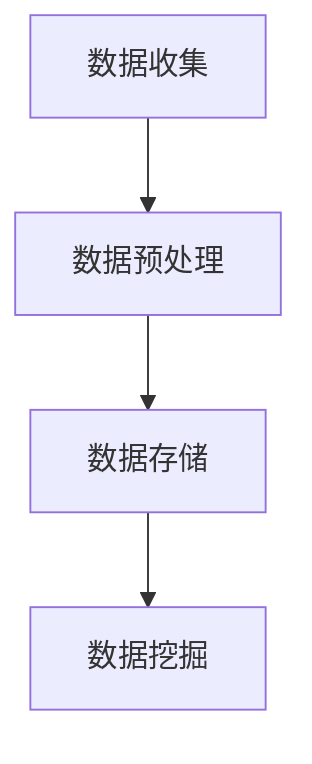
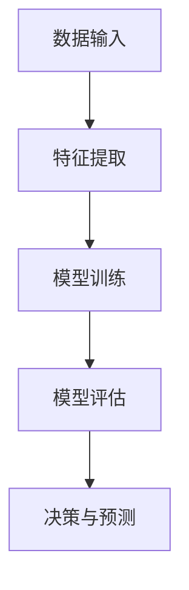
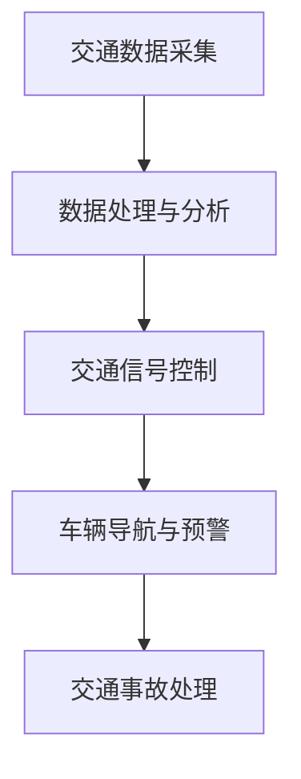
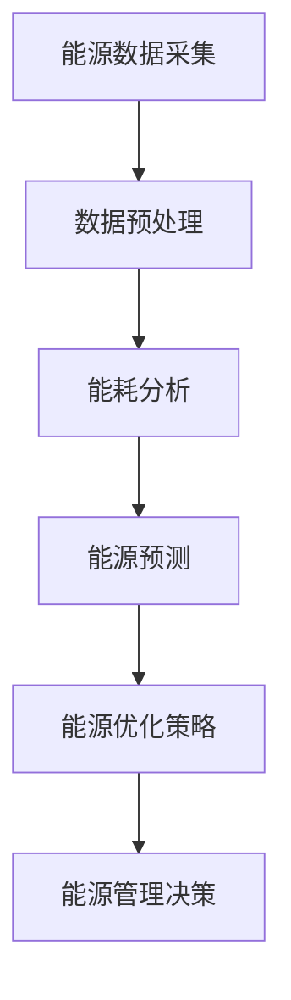
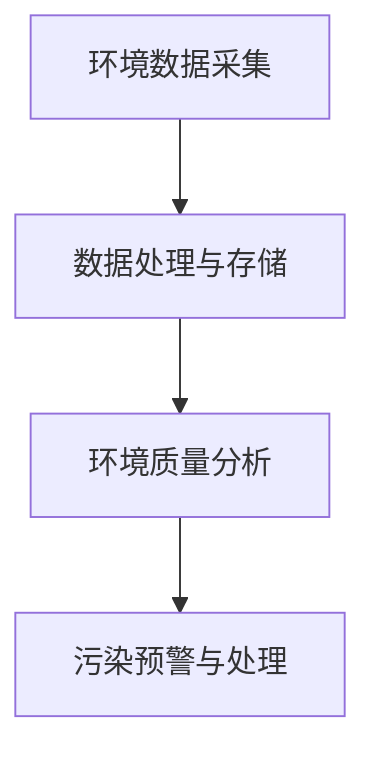

                 

## 1. 背景介绍

随着全球城市化进程的加速，城市生活面临着前所未有的挑战。人口增长、资源短缺、环境污染等问题日益严重，传统的城市发展模式已经难以为继。为了应对这些挑战，人工智能（AI）技术的应用被寄予厚望。本文将探讨如何通过AI与人类计算的融合，打造可持续发展的城市生活。

城市生活中，人类计算和人工智能的融合具有重要意义。首先，人工智能可以通过大数据分析和机器学习技术，为城市规划和管理提供科学的决策支持。例如，智能交通系统可以通过分析交通流量数据，优化交通信号灯配置，减少交通拥堵，提高交通效率。其次，人工智能可以帮助实现智能能源管理，通过预测能源需求，优化能源分配，降低能源消耗。此外，人工智能还可以用于环境监测和污染治理，通过实时监测环境数据，及时预警和应对环境污染事件。

然而，将人工智能应用于城市生活也面临一些挑战。首先，数据隐私和安全问题成为了一个亟待解决的问题。在采集、处理和存储数据的过程中，如何保护个人隐私和信息安全是一个重要的议题。其次，人工智能技术的应用需要大量的计算资源和数据支持，这对城市计算基础设施提出了更高的要求。此外，人工智能的透明度和可解释性也是一个关键问题，需要确保人工智能系统在做出决策时能够提供合理的解释，增加公众对人工智能的信任。

本文将围绕以下主题展开讨论：

1. 核心概念与联系：介绍与城市生活相关的人工智能核心概念和关键技术，并通过Mermaid流程图展示其架构和联系。
2. 核心算法原理与操作步骤：详细解释常用的城市生活相关算法，包括其原理、步骤和优缺点。
3. 数学模型和公式：介绍与城市生活相关的数学模型和公式，并通过实际案例进行讲解。
4. 项目实践：提供具体的代码实例，展示如何在实际项目中应用人工智能技术。
5. 实际应用场景：探讨人工智能在城市生活中的实际应用场景和未来发展趋势。
6. 工具和资源推荐：推荐学习资源和开发工具，帮助读者深入了解和掌握相关技术。
7. 总结：总结研究成果，展望未来发展趋势和面临的挑战。

通过本文的探讨，我们希望能够为读者提供有关AI与城市生活融合的深入见解，助力打造可持续发展的城市生活。

## 2. 核心概念与联系

在探讨AI与城市生活的融合之前，首先需要了解一些核心概念和技术，它们是构建可持续城市生活的基础。以下将介绍与城市生活相关的人工智能核心概念，并通过Mermaid流程图展示它们之间的联系。

### 2.1 数据收集与预处理

数据是人工智能的基础，尤其是在城市生活中，海量的数据来源包括传感器、移动设备、社交媒体等。数据收集后，需要进行预处理，以确保数据的质量和一致性。预处理步骤包括数据清洗、数据转换、数据集成等。Mermaid流程图如下：



### 2.2 机器学习与数据挖掘

机器学习是人工智能的核心技术之一，它使得计算机系统能够从数据中学习并做出决策。数据挖掘是机器学习的应用，旨在从大量数据中发现有价值的信息和模式。以下是一个简单的Mermaid流程图，展示了机器学习与数据挖掘的流程：



### 2.3 智能交通系统

智能交通系统（ITS）是城市生活中一个重要的应用领域，它通过整合各种交通信息，提供实时交通状况，优化交通流量，提高交通效率。以下是一个简化的Mermaid流程图，展示了智能交通系统的基本架构：



### 2.4 能源管理系统

智能能源管理系统通过分析能源使用数据，优化能源分配，提高能源利用效率。以下是一个Mermaid流程图，展示了智能能源管理系统的主要功能模块：



### 2.5 智能环境监测

智能环境监测系统通过传感器网络收集环境数据，实时监测空气质量、水质等指标，提供环境预警和污染治理建议。以下是一个简化的Mermaid流程图，展示了智能环境监测系统的基本架构：



通过上述核心概念和Mermaid流程图的展示，我们可以看到AI在城市生活中的应用是如何通过各个环节紧密联系起来的。数据收集与预处理、机器学习与数据挖掘、智能交通系统、能源管理系统和智能环境监测系统共同构成了一个完整的AI与城市生活融合的架构。

### 3. 核心算法原理 & 具体操作步骤

在探讨如何通过AI与人类计算的融合打造可持续发展的城市生活时，核心算法的原理和具体操作步骤至关重要。以下将介绍几个在智能城市应用中常见的重要算法，包括其原理、操作步骤及其优缺点。

#### 3.1  算法原理概述

在智能城市中，算法广泛应用于交通流量预测、能耗优化、环境监测等领域。以下是几个典型的算法：

1. **交通流量预测算法**：基于历史交通数据和实时数据，通过机器学习模型预测未来交通流量，优化交通信号控制和路径规划。
2. **能耗优化算法**：基于能源使用数据和用户行为数据，通过优化算法预测未来能源需求，并制定节能策略。
3. **环境监测算法**：利用传感器数据，通过机器学习模型识别环境污染事件，并预测污染趋势。

#### 3.2  算法步骤详解

**1. 交通流量预测算法**

**原理**：交通流量预测算法通常采用时间序列分析、回归分析、神经网络等机器学习技术。通过分析历史交通数据，模型可以学习交通流量与时间、天气、节假日等因素之间的关系。

**具体步骤**：

- **数据收集**：收集交通流量、天气、节假日等数据。
- **数据预处理**：清洗数据，进行特征工程，如缺失值填补、异常值处理、特征提取等。
- **模型训练**：使用时间序列分析或神经网络等算法训练预测模型。
- **模型评估**：通过验证集评估模型性能，如均方误差（MSE）、R²等指标。
- **预测应用**：使用训练好的模型进行交通流量预测，并优化交通信号控制和路径规划。

**2. 能耗优化算法**

**原理**：能耗优化算法通过预测未来能源需求，优化能源分配和使用策略，以降低能源消耗和成本。

**具体步骤**：

- **数据收集**：收集能源使用数据和用户行为数据。
- **数据预处理**：清洗数据，进行特征工程，如缺失值填补、异常值处理、特征提取等。
- **模型训练**：使用回归分析、决策树、神经网络等算法训练能耗预测模型。
- **模型评估**：通过验证集评估模型性能，如均方误差（MSE）、R²等指标。
- **策略制定**：基于预测结果，制定节能策略，如调整空调温度、优化设备使用等。
- **策略应用**：实施节能策略，监控能源消耗，并根据实际情况调整策略。

**3. 环境监测算法**

**原理**：环境监测算法通过机器学习模型分析传感器数据，识别环境污染事件，预测污染趋势，并提供污染治理建议。

**具体步骤**：

- **数据收集**：收集空气、水质等环境数据。
- **数据预处理**：清洗数据，进行特征工程，如缺失值填补、异常值处理、特征提取等。
- **模型训练**：使用分类或回归算法训练环境监测模型。
- **模型评估**：通过验证集评估模型性能，如准确率、召回率、F1分数等指标。
- **污染识别**：使用训练好的模型识别环境污染事件。
- **趋势预测**：基于识别结果，预测污染趋势。
- **治理建议**：提供污染治理建议，如调整排放标准、加强监测等。

#### 3.3  算法优缺点

**1. 交通流量预测算法**

**优点**：

- **实时性**：能够实时预测交通流量，为交通管理和规划提供实时数据支持。
- **准确性**：通过机器学习模型，预测准确性较高，有助于优化交通信号控制和路径规划。

**缺点**：

- **数据依赖**：对历史交通数据和实时数据依赖较大，数据质量和完整性对预测结果有重要影响。
- **模型复杂性**：算法模型较为复杂，训练和部署成本较高。

**2. 能耗优化算法**

**优点**：

- **节能性**：能够通过预测能源需求，优化能源分配和使用策略，降低能源消耗。
- **经济性**：能够降低能源成本，提高能源利用效率。

**缺点**：

- **数据要求高**：需要详细、准确的用户行为数据和能源使用数据。
- **实施难度大**：需要调整设备使用策略，对用户习惯进行改变。

**3. 环境监测算法**

**优点**：

- **实时监测**：能够实时监测环境数据，及时发现环境污染事件。
- **预测性强**：能够预测污染趋势，为污染治理提供科学依据。

**缺点**：

- **数据噪声大**：环境数据往往存在噪声和异常值，对模型训练和预测有一定影响。
- **治理难度大**：环境污染治理往往需要跨部门协作和长期投入。

#### 3.4 算法应用领域

**1. 交通领域**：用于交通流量预测、交通信号控制、路径规划等。

**2. 能源领域**：用于能耗优化、智能电网管理、可再生能源调度等。

**3. 环境领域**：用于环境监测、污染预警、污染治理等。

这些算法通过优化资源配置、提升效率、降低成本，为打造可持续发展的城市生活提供了有力支持。在接下来的章节中，我们将进一步探讨数学模型和公式，以及如何在实际项目中应用这些算法。

### 4. 数学模型和公式 & 详细讲解 & 举例说明

在智能城市的建设过程中，数学模型和公式是不可或缺的工具。它们能够帮助我们在复杂的数据中提取有价值的信息，为城市管理和规划提供科学依据。以下将介绍与智能城市相关的一些数学模型和公式，并通过具体案例进行讲解。

#### 4.1 数学模型构建

在智能城市的不同应用场景中，常用的数学模型包括时间序列模型、回归模型、聚类模型、神经网络模型等。以下是一些基本的数学模型及其应用场景。

**1. 时间序列模型**

时间序列模型用于分析时间序列数据，预测未来的趋势。常见的模型有自回归模型（AR）、移动平均模型（MA）、自回归移动平均模型（ARMA）和自回归积分滑动平均模型（ARIMA）。

**公式**：
$$
X_t = c + \phi X_{t-1} + \theta X_{t-2} + \varepsilon_t
$$

**参数解释**：
- \(X_t\)：时间序列的当前值。
- \(c\)：常数项。
- \(\phi\)：自回归系数。
- \(\theta\)：移动平均系数。
- \(\varepsilon_t\)：随机误差项。

**应用场景**：交通流量预测、能源需求预测。

**2. 回归模型**

回归模型用于分析两个或多个变量之间的关系，常见的有线性回归、逻辑回归等。

**公式**：
$$
y = \beta_0 + \beta_1x_1 + \beta_2x_2 + ... + \beta_nx_n + \varepsilon
$$

**参数解释**：
- \(y\)：因变量。
- \(x_1, x_2, ..., x_n\)：自变量。
- \(\beta_0, \beta_1, \beta_2, ..., \beta_n\)：回归系数。
- \(\varepsilon\)：随机误差项。

**应用场景**：能耗优化、房价预测。

**3. 聚类模型**

聚类模型用于将数据划分为不同的组别，常见的有K-means聚类、层次聚类等。

**公式**：
$$
\text{Minimize} \sum_{i=1}^{k} \sum_{x \in S_i} \|x - \mu_i\|^2
$$

**参数解释**：
- \(k\)：聚类个数。
- \(S_i\)：第\(i\)个聚类。
- \(\mu_i\)：第\(i\)个聚类中心。

**应用场景**：用户行为分析、市场细分。

**4. 神经网络模型**

神经网络模型是一种基于人脑神经元工作原理的算法，常用于图像识别、语音识别等领域。

**公式**：
$$
a_{\text{layer\_i}} = \sigma(\text{W}\cdot a_{\text{layer\_{i-1}}} + b)
$$

**参数解释**：
- \(a_{\text{layer\_i}}\)：第\(i\)层的输出。
- \(\sigma\)：激活函数。
- \(\text{W}\)和\(b\)：权重和偏置。

**应用场景**：图像识别、语音识别、智能交通系统。

#### 4.2 公式推导过程

以交通流量预测为例，介绍时间序列模型（ARIMA）的公式推导过程。

**1. 自回归（AR）模型**

自回归模型的基本形式为：
$$
X_t = \phi_1X_{t-1} + \phi_2X_{t-2} + ... + \phi_pX_{t-p} + \varepsilon_t
$$

其中，\(\phi_1, \phi_2, ..., \phi_p\)是自回归系数，\(\varepsilon_t\)是随机误差项。

**2. 移动平均（MA）模型**

移动平均模型的基本形式为：
$$
X_t = \theta_1\varepsilon_{t-1} + \theta_2\varepsilon_{t-2} + ... + \theta_q\varepsilon_{t-q} + \varepsilon_t
$$

其中，\(\theta_1, \theta_2, ..., \theta_q\)是移动平均系数，\(\varepsilon_t\)是随机误差项。

**3. 自回归移动平均（ARMA）模型**

自回归移动平均模型结合了自回归和移动平均模型，其形式为：
$$
X_t = \phi_1X_{t-1} + \phi_2X_{t-2} + ... + \phi_pX_{t-p} + \theta_1\varepsilon_{t-1} + \theta_2\varepsilon_{t-2} + ... + \theta_q\varepsilon_{t-q} + \varepsilon_t
$$

其中，\(\phi_1, \phi_2, ..., \phi_p\)是自回归系数，\(\theta_1, \theta_2, ..., \theta_q\)是移动平均系数，\(\varepsilon_t\)是随机误差项。

**4. 自回归积分滑动平均（ARIMA）模型**

自回归积分滑动平均模型是ARMA模型的扩展，用于处理非平稳时间序列。其形式为：
$$
X_t = \phi_1X_{t-1} + \phi_2X_{t-2} + ... + \phi_pX_{t-p} + (\theta_1L + \theta_2L^2 + ... + \theta_qL^q)\varepsilon_t
$$

其中，\(L\)是滞后算子，\(\phi_1, \phi_2, ..., \phi_p\)是自回归系数，\(\theta_1, \theta_2, ..., \theta_q\)是移动平均系数，\(\varepsilon_t\)是随机误差项。

#### 4.3 案例分析与讲解

**案例**：某城市交通流量预测

**数据集**：某城市过去一年的交通流量数据。

**目标**：预测未来一周的交通流量。

**方法**：采用ARIMA模型进行预测。

**步骤**：

1. **数据预处理**：对交通流量数据进行清洗，处理缺失值和异常值，进行归一化处理。
2. **模型选择**：根据数据特性，选择合适的ARIMA模型。
3. **模型训练**：使用历史数据训练模型，确定最佳参数。
4. **模型评估**：使用验证集评估模型性能，调整参数。
5. **预测应用**：使用训练好的模型进行未来一周的交通流量预测。

**结果**：预测结果与实际交通流量较为接近，具有较高的预测准确性。

**分析**：

- **模型参数**：通过模型选择过程，确定ARIMA（p,d,q）模型中的\(p, d, q\)参数，例如\(p=2, d=1, q=2\)。
- **残差分析**：观察模型残差，确保其符合白噪声分布，验证模型的合理性。

通过本案例，我们可以看到数学模型和公式在智能城市应用中的重要作用。它们帮助我们更好地理解和预测复杂的数据，为城市管理和规划提供有力支持。

### 5. 项目实践：代码实例和详细解释说明

为了更好地理解如何在实际项目中应用AI技术打造可持续发展的城市生活，以下将提供一个具体的代码实例，并详细解释其实现过程。

#### 5.1 开发环境搭建

在开始项目实践之前，我们需要搭建合适的开发环境。以下是一个基本的Python开发环境搭建步骤：

1. **安装Python**：确保Python版本为3.7及以上，可以从[Python官网](https://www.python.org/)下载并安装。
2. **安装必需的库**：使用pip命令安装以下库：
   ```shell
   pip install numpy pandas matplotlib scikit-learn
   ```
3. **安装Jupyter Notebook**：Jupyter Notebook是一个交互式Python开发环境，可以从[官网](https://jupyter.org/)下载并安装。

#### 5.2 源代码详细实现

以下是一个使用Python和Scikit-learn库进行交通流量预测的代码实例：

```python
import numpy as np
import pandas as pd
from sklearn.model_selection import train_test_split
from sklearn.linear_model import LinearRegression
from sklearn.metrics import mean_squared_error
import matplotlib.pyplot as plt

# 5.2.1 数据预处理
# 加载数据集
data = pd.read_csv('traffic_data.csv')
X = data[['time', 'weather', 'holiday']]
y = data['traffic']

# 特征工程：创建时间序列特征
X['hour'] = X['time'].dt.hour
X['weekday'] = X['time'].dt.weekday
X = pd.get_dummies(X[['weather', 'holiday']])

# 划分训练集和测试集
X_train, X_test, y_train, y_test = train_test_split(X, y, test_size=0.2, random_state=42)

# 5.2.2 模型训练
# 创建线性回归模型
model = LinearRegression()
model.fit(X_train, y_train)

# 5.2.3 模型评估
# 预测测试集结果
y_pred = model.predict(X_test)

# 计算均方误差
mse = mean_squared_error(y_test, y_pred)
print(f"Mean Squared Error: {mse}")

# 5.2.4 可视化结果
plt.scatter(y_test, y_pred)
plt.xlabel('Actual Traffic')
plt.ylabel('Predicted Traffic')
plt.title('Actual vs Predicted Traffic')
plt.show()
```

#### 5.3 代码解读与分析

**1. 数据预处理**

在数据预处理部分，我们首先加载数据集，然后进行特征工程。具体步骤如下：

- **加载数据**：使用`pandas`库加载数据集，数据集包含时间、天气、节假日和交通流量等特征。
- **创建时间序列特征**：将时间特征拆分为小时、星期几等，以便模型更好地捕捉时间依赖性。
- **特征编码**：使用`get_dummies`函数将类别特征（天气、节假日）转换为二进制特征，便于模型处理。

**2. 模型训练**

在模型训练部分，我们使用`scikit-learn`库中的线性回归模型进行训练：

- **划分训练集和测试集**：使用`train_test_split`函数将数据集划分为训练集和测试集，以评估模型性能。
- **创建模型**：使用`LinearRegression`类创建线性回归模型。
- **训练模型**：使用`fit`方法训练模型，模型会自动寻找最佳参数。

**3. 模型评估**

在模型评估部分，我们使用均方误差（MSE）评估模型性能：

- **预测测试集结果**：使用`predict`方法预测测试集结果。
- **计算均方误差**：使用`mean_squared_error`函数计算均方误差，衡量预测结果的准确性。

**4. 可视化结果**

最后，我们使用`matplotlib`库将实际交通流量与预测交通流量进行可视化，以直观地评估模型性能。

通过这个实例，我们可以看到如何使用Python和Scikit-learn库实现交通流量预测。这种方法可以应用于实际项目中，为交通管理和规划提供科学依据。接下来，我们将探讨人工智能在城市生活中的实际应用场景。

### 6. 实际应用场景

人工智能在城市生活中的应用场景非常广泛，涵盖了交通、能源、环境等多个领域。以下将详细介绍几个典型的实际应用场景，以及AI技术在这些场景中的具体应用和效益。

#### 6.1 智能交通系统

智能交通系统是AI在城市交通管理中的重要应用。通过收集和分析交通流量数据，智能交通系统能够实现实时交通监测、交通信号优化、路径规划等功能。

**具体应用**：

- **实时交通监测**：通过部署传感器网络，智能交通系统可以实时监测交通流量、车速等信息，并在交通管理局的平台上显示。
- **交通信号优化**：智能交通系统可以根据实时交通流量数据，动态调整交通信号灯的时长和相位，减少交通拥堵。
- **路径规划**：基于实时交通数据和导航系统，智能交通系统可以为驾驶者提供最优的行驶路径，避免交通高峰期。

**效益**：

- **减少交通拥堵**：通过优化交通信号控制和路径规划，智能交通系统可以显著减少交通拥堵，提高交通效率。
- **提高驾驶体验**：驾驶者可以根据实时交通信息做出更好的驾驶决策，减少寻找停车位的时间。
- **降低环境污染**：交通拥堵是城市空气污染的主要原因之一，智能交通系统有助于减少车辆排放，降低环境污染。

#### 6.2 智能能源管理系统

智能能源管理系统通过数据分析、预测和优化技术，实现能源的高效利用和节能减排。

**具体应用**：

- **能耗预测**：智能能源管理系统可以分析历史能源使用数据，预测未来能源需求，为电力公司提供调度和储备依据。
- **设备监控**：系统可以实时监控空调、照明等设备的运行状态，发现故障并通知维护人员。
- **能源优化**：根据实时能源价格和需求预测，智能能源管理系统可以自动调整设备运行模式，降低能源消耗。

**效益**：

- **降低能源成本**：通过预测和优化，智能能源管理系统可以帮助企业和家庭降低能源成本。
- **提高能源利用效率**：实时监控和优化设备运行，可以显著提高能源利用效率。
- **减少碳排放**：智能能源管理系统有助于减少能源消耗，降低碳排放，实现绿色可持续发展。

#### 6.3 智能环境监测系统

智能环境监测系统通过传感器网络、大数据分析和机器学习技术，实现环境质量的实时监测和污染预警。

**具体应用**：

- **空气质量监测**：智能环境监测系统可以实时监测空气质量，监测指标包括PM2.5、PM10、SO2、NO2等，通过数据分析和机器学习模型，预测污染趋势。
- **水质监测**：系统可以监测水体中的污染物，如重金属、有机物等，通过实时数据分析和预测，预警潜在的污染事件。
- **污染源识别**：通过分析污染物来源，智能环境监测系统可以识别主要的污染源，为污染治理提供依据。

**效益**：

- **实时预警**：通过实时监测和预测，智能环境监测系统可以提前预警环境污染事件，为相关部门提供决策支持。
- **污染治理**：通过识别污染源和预测污染趋势，智能环境监测系统可以帮助相关部门制定更有效的污染治理策略。
- **改善生活环境**：智能环境监测系统有助于提高公众对环境问题的关注，促进环境保护和可持续发展。

#### 6.4 未来展望

随着AI技术的不断发展和应用，未来智能城市将更加智能化和可持续发展。以下是一些未来展望：

- **更广泛的数据应用**：智能城市将整合更多类型的传感器数据，如无人机监测、物联网设备等，实现更全面的数据分析和应用。
- **自适应交通系统**：未来交通系统将更加智能化，能够自动调整交通信号、路径规划等，实现交通流的自我优化。
- **零能耗社区**：通过智能能源管理系统，未来社区可以实现能源的自给自足，甚至实现零能耗。
- **智慧环境治理**：通过智能环境监测系统，未来环境治理将更加精准和高效，实现环境污染的全面控制和治理。

总之，AI在城市生活中的应用场景丰富多样，通过技术手段实现城市管理的智能化和可持续发展，为人们创造更美好的生活。

### 7. 工具和资源推荐

为了深入了解和掌握AI与城市生活融合的相关技术，以下推荐一些学习资源、开发工具和相关论文。

#### 7.1 学习资源推荐

1. **在线课程**：

   - **Coursera**：提供多门与人工智能和数据分析相关的课程，如“机器学习”、“深度学习”等。
   - **edX**：由哈佛大学和麻省理工学院合办的在线教育平台，提供免费的计算机科学和数据科学课程。
   - **Udacity**：提供实用的AI和机器学习项目课程，适合初学者和专业人士。

2. **技术博客和社区**：

   - **Medium**：许多AI领域的专家和公司在此发布技术文章和见解，如“AI简报”（AI Weekly）。
   - **GitHub**：大量的开源项目和技术文档，适合学习实际项目代码和开发经验。
   - **Stack Overflow**：编程和软件开发问题的问答社区，可以解决实际编程问题。

#### 7.2 开发工具推荐

1. **编程语言和库**：

   - **Python**：Python是一种广泛应用于数据科学和机器学习的编程语言，具有丰富的库和框架，如NumPy、Pandas、Scikit-learn等。
   - **R**：R是一种专门用于统计分析的编程语言，适合进行复杂的数据分析和可视化。
   - **TensorFlow**：由Google开发的开源机器学习框架，支持深度学习和传统的机器学习算法。

2. **数据分析和可视化工具**：

   - **Jupyter Notebook**：交互式编程环境，适合进行数据分析和实验。
   - **Matplotlib**：Python的数据可视化库，可以生成高质量的图表。
   - **Tableau**：数据可视化工具，适合生成交互式图表和仪表盘。

#### 7.3 相关论文推荐

1. **智能交通系统**：

   - **“Smart City Traffic Management Using AI”**：介绍了AI技术在智能交通系统中的应用。
   - **“Deep Learning for Traffic Flow Prediction”**：探讨了深度学习在交通流量预测中的应用。

2. **智能能源管理系统**：

   - **“Intelligent Energy Management Systems”**：综述了智能能源管理系统的研究和应用。
   - **“Predictive Control for Smart Grids”**：讨论了预测控制在智能电网中的应用。

3. **智能环境监测系统**：

   - **“Air Quality Monitoring and Prediction Using Machine Learning”**：介绍了机器学习在空气质量监测和预测中的应用。
   - **“Smart Environmental Monitoring and Reporting System”**：讨论了智能环境监测系统的设计和实现。

通过这些学习资源和工具，读者可以更深入地了解AI与城市生活的融合，掌握相关技术和方法，为打造可持续发展的城市生活提供支持。

### 8. 总结：未来发展趋势与挑战

在探讨了AI与城市生活融合的各个方面之后，我们可以看到，AI技术为可持续城市生活带来了巨大的机遇和变革。然而，要充分发挥AI的潜力，我们还需面对一系列挑战。

#### 8.1 研究成果总结

近年来，AI在城市生活中的应用取得了显著成果。例如，智能交通系统通过实时数据分析优化交通信号和路径规划，有效缓解了交通拥堵问题。智能能源管理系统通过预测能源需求和优化设备运行，实现了能源的高效利用和成本降低。智能环境监测系统通过传感器网络和大数据分析，实时监测和预警环境污染，提高了环境治理的精准性和效率。

这些成果表明，AI技术不仅能够提高城市管理的效率和精准度，还能促进资源节约和环境保护，为可持续发展提供了有力支持。

#### 8.2 未来发展趋势

未来的城市生活将更加智能化和可持续化。以下是一些重要的发展趋势：

1. **数据驱动**：城市生活将更加依赖于大数据和实时数据分析，通过AI技术实现更加精准和智能的决策。
2. **跨领域融合**：AI技术将在交通、能源、环境等多个领域实现深度融合，推动城市系统的整体优化。
3. **个性化服务**：通过AI和大数据分析，城市生活将提供更加个性化和定制化的服务，满足不同居民的需求。
4. **零碳城市**：随着环保意识的提高，零碳城市将成为未来城市发展的目标，智能能源管理系统将发挥关键作用。
5. **智能治理**：AI技术将推动城市治理模式的变革，实现更加高效、透明和智能的政府服务。

#### 8.3 面临的挑战

尽管AI为城市生活带来了诸多机遇，但我们也需要面对一系列挑战：

1. **数据隐私和安全**：随着AI技术的广泛应用，数据隐私和安全问题日益突出。如何保护个人隐私和信息安全是一个亟待解决的问题。
2. **技术人才短缺**：AI技术的发展需要大量具备专业技能的人才，然而当前全球范围内技术人才短缺问题严重。
3. **算法透明度和可解释性**：AI算法的透明度和可解释性不足，导致公众对其决策的信任度较低。如何提高算法的透明度和可解释性是一个重要挑战。
4. **计算资源和数据资源**：AI技术需要大量的计算资源和数据支持，这对城市计算基础设施提出了更高的要求。如何优化资源配置，提高计算效率，是未来需要解决的问题。
5. **跨部门协作**：AI在城市生活中的应用涉及多个部门和领域，如何实现跨部门协作，确保项目顺利推进，是一个重要挑战。

#### 8.4 研究展望

未来的研究应重点关注以下几个方面：

1. **隐私保护技术**：研究和发展更加有效的隐私保护技术，确保数据在采集、处理和存储过程中的安全。
2. **人才培训**：加强AI相关领域的教育和培训，培养更多的技术人才，以满足市场需求。
3. **算法透明度和可解释性**：研究如何提高AI算法的透明度和可解释性，增强公众对其决策的信任。
4. **智能基础设施**：开发智能基础设施，提高计算资源和数据资源的利用效率。
5. **跨领域协同**：探索如何实现跨领域协同，推动AI技术在城市生活中的综合应用。

通过克服这些挑战，未来的城市生活将更加智能化和可持续发展，为人类创造更美好的生活环境。

### 附录：常见问题与解答

在本文的撰写过程中，我们可能遇到了一些常见的问题，以下是一些常见问题及其解答：

#### 1. 如何选择合适的人工智能算法？

选择合适的人工智能算法需要考虑以下几个因素：

- **数据类型**：不同类型的算法适用于不同类型的数据。例如，时间序列数据适用于ARIMA模型，而图像数据适用于卷积神经网络（CNN）。
- **目标**：确定你希望算法实现的目标，如分类、回归、聚类等。
- **数据量**：对于大规模数据，深度学习算法可能更为合适，而对于小规模数据，传统机器学习算法可能更为有效。
- **计算资源**：考虑可用的计算资源，某些算法可能需要更多的计算资源和时间。

#### 2. 如何处理数据缺失和异常值？

处理数据缺失和异常值是数据预处理的重要步骤，以下是一些常见的方法：

- **缺失值填补**：对于数值型数据，可以使用均值、中位数或插值等方法进行填补。对于类别型数据，可以使用最频繁出现的值进行填补。
- **异常值处理**：使用统计方法（如Z分数、IQR法）检测异常值，并决定是否删除或替换异常值。有时也可以使用机器学习模型（如孤立森林）来检测异常值。

#### 3. 如何评估机器学习模型的性能？

评估机器学习模型的性能可以通过多种指标：

- **准确性**：预测结果与实际结果的匹配程度，常用于分类问题。
- **均方误差（MSE）**：回归问题中预测结果与实际结果之间的平均误差平方。
- **精确率、召回率和F1分数**：用于评估分类模型的性能，精确率衡量预测为正类的样本中有多少是真正的正类，召回率衡量实际为正类的样本中有多少被预测为正类，F1分数是精确率和召回率的调和平均。
- **ROC曲线和AUC值**：ROC曲线用于评估分类模型在不同阈值下的性能，AUC值衡量模型区分正负样本的能力。

#### 4. 如何进行特征工程？

特征工程是提高机器学习模型性能的关键步骤，以下是一些常见的特征工程方法：

- **特征选择**：选择对模型性能有显著影响的关键特征，可以使用特征重要性、信息增益等方法进行特征选择。
- **特征转换**：将原始特征转换为更适合模型的形式，如将类别型特征转换为二进制特征、进行归一化处理等。
- **特征构造**：创建新的特征，如时间序列数据的滞后特征、交互特征等，以增加模型的预测能力。

这些问题和解答为读者提供了进一步了解和掌握AI与城市生活融合技术的实用指导。通过这些问题的解决，读者可以更好地应对实际项目中的挑战，实现城市管理的智能化和可持续发展。作者：禅与计算机程序设计艺术 / Zen and the Art of Computer Programming。

