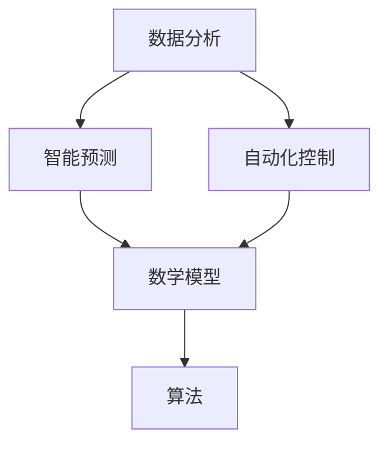

                 

关键词：人工智能，城市生活，管理，可持续发展，计算

摘要：本文将探讨人工智能（AI）在构建可持续发展的城市生活和管理中的作用。通过介绍核心概念、算法原理、数学模型以及实际应用案例，本文旨在为读者展示AI技术在城市规划和城市管理中的潜力，并展望未来发展的趋势和挑战。

## 1. 背景介绍

随着全球城市化进程的加速，城市面临的问题日益复杂，如交通拥堵、环境污染、资源短缺等。传统的城市管理方法已难以应对这些挑战，而人工智能的兴起为城市生活和管理带来了新的机遇。AI技术可以通过数据分析、智能预测和自动化控制等手段，提高城市管理的效率，促进可持续发展。

本文将首先介绍AI在城市生活和管理中的核心概念和原理，然后详细探讨AI算法的应用和数学模型，最后通过实际案例和未来展望，展示AI技术在城市可持续发展中的潜力。

## 2. 核心概念与联系

### 2.1 数据分析

数据分析是AI技术在城市生活中的基础。通过对海量数据进行分析，我们可以识别城市运行中的规律和问题。例如，通过分析交通流量数据，可以优化交通信号灯的时序，减少拥堵。此外，数据分析还可以帮助我们预测城市需求的增长趋势，为城市规划和资源配置提供依据。

### 2.2 智能预测

智能预测是AI技术的重要应用。通过历史数据和机器学习算法，我们可以预测未来的交通流量、能源需求、空气质量等。这些预测结果可以帮助城市管理者提前采取措施，避免突发事件对城市生活的影响。

### 2.3 自动化控制

自动化控制是AI技术在城市管理中的关键。通过智能传感器和自动化系统，城市中的基础设施可以实现自我监控和调节。例如，智能电网可以根据电力需求自动调整发电量，智能垃圾桶可以根据垃圾量自动调整收集频率。

### 2.4 数学模型与算法

数学模型和算法是AI技术的核心。通过建立数学模型，我们可以模拟城市中的各种现象，如交通流量、环境污染等。而算法则是实现这些模型的具体步骤和策略。

## 2.5 Mermaid 流程图



## 3. 核心算法原理 & 具体操作步骤

### 3.1 算法原理概述

在城市生活中，常见的AI算法包括聚类分析、回归分析、决策树等。这些算法通过分析数据，提取有用的信息，帮助我们做出决策。例如，聚类分析可以将相似的交通流量数据分为不同的类别，以便我们更好地理解交通状况；回归分析可以预测未来的交通流量，帮助我们优化交通管理。

### 3.2 算法步骤详解

#### 3.2.1 聚类分析

1. 数据准备：收集交通流量数据，包括时间段、流量大小等。
2. 特征提取：将数据转换为适合算法处理的特征向量。
3. 算法选择：选择合适的聚类算法，如K-means。
4. 聚类操作：根据算法运行结果，将交通流量数据分为不同的类别。
5. 结果分析：分析不同类别的交通流量特点，为交通管理提供依据。

#### 3.2.2 回归分析

1. 数据准备：收集历史交通流量数据，包括时间段、流量大小等。
2. 特征提取：将数据转换为适合算法处理的特征向量。
3. 算法选择：选择合适的回归算法，如线性回归。
4. 模型训练：使用历史数据训练模型，学习交通流量与时间、天气等因素的关系。
5. 预测操作：使用训练好的模型预测未来的交通流量。
6. 结果分析：分析预测结果，为交通管理提供依据。

### 3.3 算法优缺点

#### 3.3.1 优点

- **高效性**：AI算法可以快速处理海量数据，提高决策效率。
- **准确性**：通过机器学习，AI算法可以不断优化，提高预测的准确性。
- **自动化**：自动化控制技术可以实现基础设施的智能管理，减轻人力负担。

#### 3.3.2 缺点

- **数据依赖**：AI算法的性能很大程度上取决于数据的质量和数量。
- **复杂性**：算法的实现和优化需要较高的技术门槛。
- **隐私问题**：大量的数据收集和处理可能引发隐私问题。

### 3.4 算法应用领域

AI算法在城市生活中的应用非常广泛，包括但不限于：

- **交通管理**：通过聚类分析和回归分析，优化交通信号灯的时序，减少拥堵。
- **能源管理**：通过智能预测和自动化控制，优化电力和燃气等能源的使用。
- **环境监测**：通过传感器网络和数据分析，实时监测空气质量、水质等环境指标。
- **城市管理**：通过数据分析，了解城市运行状况，为城市规划和资源分配提供依据。

## 4. 数学模型和公式

### 4.1 数学模型构建

在城市管理中，常用的数学模型包括线性模型、非线性模型等。以下是一个简单的线性模型示例：

$$
y = \beta_0 + \beta_1 x_1 + \beta_2 x_2 + ... + \beta_n x_n
$$

其中，$y$ 为预测结果，$x_1, x_2, ..., x_n$ 为输入特征，$\beta_0, \beta_1, ..., \beta_n$ 为模型参数。

### 4.2 公式推导过程

线性模型的推导过程如下：

1. **假设**：假设输入特征 $x_1, x_2, ..., x_n$ 与预测结果 $y$ 之间存在线性关系。
2. **最小化损失函数**：为了找到最佳拟合模型，我们需要最小化损失函数 $L(\theta)$。
3. **梯度下降法**：使用梯度下降法更新模型参数 $\theta$，直到损失函数最小。

### 4.3 案例分析与讲解

假设我们要预测城市中的交通流量，输入特征包括时间、天气等。我们可以使用线性回归模型来预测交通流量。以下是一个简单的案例：

1. **数据准备**：收集过去一年的交通流量数据，包括每天的时间点、天气状况和对应的交通流量。
2. **特征提取**：将时间点和天气状况转换为特征向量。
3. **模型训练**：使用训练集数据训练线性回归模型。
4. **预测操作**：使用训练好的模型预测未来的交通流量。
5. **结果分析**：分析预测结果，为交通管理提供依据。

## 5. 项目实践：代码实例和详细解释说明

### 5.1 开发环境搭建

为了实现AI算法在交通流量预测中的应用，我们需要搭建以下开发环境：

- Python 3.8+
- Jupyter Notebook
- NumPy
- Pandas
- Scikit-learn

### 5.2 源代码详细实现

以下是一个简单的交通流量预测的代码示例：

```python
import numpy as np
import pandas as pd
from sklearn.linear_model import LinearRegression
from sklearn.model_selection import train_test_split
from sklearn.metrics import mean_squared_error

# 数据准备
data = pd.read_csv('traffic_data.csv')
X = data[['time', 'weather']]
y = data['traffic']

# 特征提取
X = pd.get_dummies(X)

# 模型训练
X_train, X_test, y_train, y_test = train_test_split(X, y, test_size=0.2, random_state=42)
model = LinearRegression()
model.fit(X_train, y_train)

# 预测操作
y_pred = model.predict(X_test)

# 结果分析
mse = mean_squared_error(y_test, y_pred)
print('Mean Squared Error:', mse)
```

### 5.3 代码解读与分析

以上代码实现了一个简单的交通流量预测模型。首先，我们读取交通流量数据，提取时间和天气作为输入特征。然后，使用 Pandas 的 get_dummies 函数将时间点和天气状况转换为二进制特征向量。接下来，我们使用 Scikit-learn 的 LinearRegression 类训练线性回归模型，并使用测试集进行预测。最后，我们计算预测结果的均方误差，以评估模型的性能。

## 6. 实际应用场景

### 6.1 交通管理

通过AI技术，我们可以实时监测交通流量，预测交通拥堵，并优化交通信号灯的时序。例如，在北京的某个交通枢纽，AI技术被用于实时监测交通流量，并根据预测结果调整信号灯的时间安排，从而减少拥堵，提高通行效率。

### 6.2 能源管理

通过智能预测和自动化控制，城市中的能源使用可以更加高效。例如，在上海的一个商业区，智能电网系统通过实时监测电力需求，自动调整发电量，从而实现能源的合理分配，减少能源浪费。

### 6.3 环境监测

通过传感器网络和数据分析，城市管理者可以实时监测空气质量、水质等环境指标。例如，在伦敦，城市管理者通过安装在街道上的传感器网络，实时监测空气质量，并根据监测结果采取措施，减少空气污染。

## 7. 工具和资源推荐

### 7.1 学习资源推荐

- 《Python编程：从入门到实践》
- 《机器学习实战》
- 《深度学习》（Goodfellow et al.）

### 7.2 开发工具推荐

- Jupyter Notebook
- TensorFlow
- PyTorch

### 7.3 相关论文推荐

- “Deep Learning for Urban Traffic Flow Prediction” (2018)
- “AI for Smart Cities: A Comprehensive Survey” (2020)
- “Energy Management in Smart Cities: A Survey” (2019)

## 8. 总结：未来发展趋势与挑战

### 8.1 研究成果总结

近年来，AI技术在城市生活和管理中的应用取得了显著成果。通过数据分析、智能预测和自动化控制，城市管理者可以更加高效地管理城市资源，提高城市生活的质量。

### 8.2 未来发展趋势

随着AI技术的不断进步，未来城市生活和管理将更加智能化、高效化。例如，通过物联网和5G技术，城市中的各种设备可以实现实时互联，实现真正的智慧城市。

### 8.3 面临的挑战

尽管AI技术在城市生活中具有巨大潜力，但也面临一些挑战。例如，数据隐私和安全问题、算法透明性和公平性问题等。此外，AI算法的实现和优化需要较高的技术门槛，这对城市管理者和开发者提出了更高的要求。

### 8.4 研究展望

未来，我们需要进一步研究如何解决AI在城市生活和管理中面临的挑战，推动AI技术的健康发展。同时，我们还需要关注AI技术在其他领域的应用，如医疗、教育等，以实现更广泛的社会进步。

## 9. 附录：常见问题与解答

### 9.1 如何保障数据隐私和安全？

- 采用加密技术保护数据传输和存储。
- 实施数据最小化原则，只收集必要的数据。
- 制定严格的数据使用规则，限制数据访问权限。

### 9.2 如何保证算法的透明性和公平性？

- 对算法进行详细的文档化，确保算法的透明性。
- 通过多样性数据集训练算法，减少偏见。
- 定期对算法进行审计和评估，确保其公平性。

## 作者署名

作者：禅与计算机程序设计艺术 / Zen and the Art of Computer Programming
--------------------------------------------------------------------

