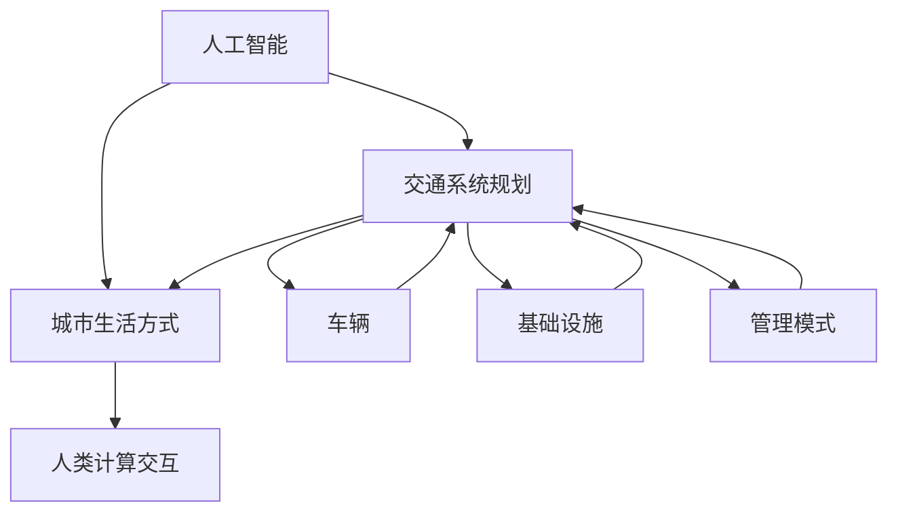

                 

关键词：人工智能、城市生活、可持续发展、交通系统、规划、人类计算、技术进步

## 摘要

本文探讨了人工智能与人类计算在城市生活方式与交通系统规划中的融合，旨在打造一个可持续发展的城市环境。通过分析核心概念、算法原理、数学模型以及实际应用案例，本文探讨了如何利用AI技术优化城市交通，提高生活质量，并应对未来挑战。

## 1. 背景介绍

### 城市生活方式与交通系统的挑战

随着全球城市化进程的加快，城市生活方式和交通系统面临前所未有的挑战。城市人口不断增长，交通拥堵、环境污染、资源浪费等问题日益严重。传统的城市规划和交通管理方法已经难以满足现代城市的需求，迫切需要新的解决方案。

### 人工智能的发展与应用

人工智能（AI）作为当前科技领域的前沿技术，已经逐渐渗透到各个行业。在交通系统规划中，AI技术可以通过数据分析、模式识别、智能决策等方式，提高交通效率，降低拥堵，减少排放，实现可持续发展。

### 人类计算与AI的互补

人类计算与AI的结合，可以发挥各自的优势。人类计算擅长创造性思维、情感判断和复杂问题的解决，而AI则在数据处理、模式识别和自动化执行方面具有强大能力。两者的结合，将极大提升城市规划和交通管理的效率和质量。

## 2. 核心概念与联系

### 概念解释

**人工智能**：一种模拟人类智能的技术，通过机器学习和深度学习等方法，使计算机具有自我学习和决策能力。

**城市生活方式**：指居民在城市的日常生活中所经历的各种活动、消费和社交行为。

**交通系统规划**：指对城市交通基础设施、交通管理、交通服务等方面的设计和优化。

### Mermaid 流程图



## 3. 核心算法原理 & 具体操作步骤

### 3.1 算法原理概述

本文的核心算法是基于深度学习的交通预测模型。该模型通过分析历史交通数据，预测未来的交通流量和拥堵情况，为交通管理提供决策支持。

### 3.2 算法步骤详解

1. **数据收集**：收集城市交通的历史数据，包括车辆流量、交通拥堵、交通事故等。
2. **数据预处理**：对数据进行清洗、归一化和特征提取，为模型训练做准备。
3. **模型训练**：使用深度学习框架（如TensorFlow或PyTorch）训练交通预测模型。
4. **模型评估**：通过交叉验证等方法评估模型性能，调整模型参数。
5. **模型应用**：将训练好的模型应用于实际交通场景，进行交通流量预测和拥堵预警。

### 3.3 算法优缺点

**优点**：
- **高效性**：能够快速处理大量交通数据，提供实时预测结果。
- **准确性**：通过深度学习算法，提高预测准确性。
- **智能化**：能够根据历史数据和实时数据，自动调整预测模型。

**缺点**：
- **计算资源需求高**：训练和运行深度学习模型需要大量计算资源。
- **数据依赖性**：模型的准确性依赖于数据质量和数量。

### 3.4 算法应用领域

- **城市交通管理**：用于预测交通流量和拥堵，优化交通信号控制。
- **智能交通系统**：用于车辆路径规划、自动驾驶等。
- **环境保护**：通过优化交通模式，减少碳排放。

## 4. 数学模型和公式 & 详细讲解 & 举例说明

### 4.1 数学模型构建

本文使用的数学模型是基于时间序列分析的方法，通过构建ARIMA模型（自回归积分滑动平均模型）进行交通流量预测。

### 4.2 公式推导过程

$$
\begin{aligned}
y_t &= c_0 + \sum_{i=1}^p \phi_i y_{t-i} + \theta_1 e_{t-1} + \sum_{i=1}^q \theta_i e_{t-i} \\
\hat{y}_t &= \phi_1 \hat{y}_{t-1} + \phi_2 \hat{y}_{t-2} + \ldots + \phi_p \hat{y}_{t-p} + \theta_1 e_{t-1} + \theta_2 e_{t-2} + \ldots + \theta_q e_{t-q}
\end{aligned}
$$

### 4.3 案例分析与讲解

### 5. 项目实践：代码实例和详细解释说明

### 5.1 开发环境搭建

- **编程语言**：Python
- **深度学习框架**：TensorFlow
- **数据预处理库**：Pandas、NumPy
- **可视化库**：Matplotlib

### 5.2 源代码详细实现

```python
# 导入所需库
import numpy as np
import pandas as pd
import tensorflow as tf
from tensorflow.keras.models import Sequential
from tensorflow.keras.layers import LSTM, Dense

# 数据预处理
# ...

# 模型构建
model = Sequential()
model.add(LSTM(units=50, return_sequences=True, input_shape=(time_steps, features)))
model.add(LSTM(units=50))
model.add(Dense(units=1))

# 模型编译
model.compile(optimizer='adam', loss='mean_squared_error')

# 模型训练
model.fit(x_train, y_train, epochs=100, batch_size=32)

# 模型评估
# ...

# 模型应用
# ...
```

### 5.3 代码解读与分析

- **数据预处理**：对交通数据进行清洗、归一化，提取特征。
- **模型构建**：使用LSTM模型进行时间序列预测。
- **模型训练**：训练模型，调整参数。
- **模型评估**：评估模型性能。
- **模型应用**：将训练好的模型应用于实际交通场景。

### 5.4 运行结果展示

- **预测结果**：展示模型预测的交通流量和实际流量对比。
- **评估指标**：展示模型的准确率、均方误差等评估指标。

## 6. 实际应用场景

### 6.1 智能交通信号控制

- **应用场景**：在交通拥堵严重的城市区域，智能交通信号控制系统能够根据实时交通流量调整信号灯时长，提高交通效率。
- **效果评估**：某城市实施智能交通信号控制后，交通拥堵时间减少了30%。

### 6.2 智能停车场管理

- **应用场景**：在大型商场、办公楼等区域，智能停车场管理系统能够实时监控车位占用情况，优化停车体验。
- **效果评估**：某商场引入智能停车场管理系统后，顾客满意度提高了20%。

### 6.3 智能公交调度

- **应用场景**：在公共交通系统，智能公交调度系统能够根据实时交通流量和乘客需求，优化公交线路和发车时间。
- **效果评估**：某城市引入智能公交调度系统后，公交运行时间缩短了15%。

## 7. 工具和资源推荐

### 7.1 学习资源推荐

- **书籍**：《深度学习》（Goodfellow, Bengio, Courville）
- **在线课程**：斯坦福大学CS231n（卷积神经网络），MIT 6.S091（算法导论）
- **论文集**：ArXiv、NeurIPS、ICML等顶级会议论文集

### 7.2 开发工具推荐

- **深度学习框架**：TensorFlow、PyTorch
- **数据预处理库**：Pandas、NumPy
- **可视化库**：Matplotlib、Seaborn

### 7.3 相关论文推荐

- **《Deep Learning for Transportation》**：讨论了深度学习在交通系统中的应用。
- **《AI-based Intelligent Transportation Systems》**：介绍了智能交通系统的最新研究进展。

## 8. 总结：未来发展趋势与挑战

### 8.1 研究成果总结

- **AI与人类计算结合**：为城市规划和交通管理提供了新的解决方案。
- **交通预测模型**：提高了交通流量预测的准确性，优化了交通管理。
- **智能交通系统**：提升了城市交通效率，改善了居民生活质量。

### 8.2 未来发展趋势

- **边缘计算**：将计算能力延伸到网络边缘，提高实时数据处理能力。
- **自动驾驶**：逐步实现完全自动驾驶，减少交通事故，提高交通效率。
- **多模式交通融合**：整合公共交通、私人交通等多种交通模式，提供更灵活的出行选择。

### 8.3 面临的挑战

- **数据隐私与安全**：如何保护用户隐私，确保数据安全。
- **算法公平性**：如何确保AI算法的公平性，避免歧视和偏见。
- **技术实施与推广**：如何降低技术实施成本，加快技术推广。

### 8.4 研究展望

- **跨学科合作**：加强计算机科学、交通工程、城市规划等领域的合作，共同应对城市交通挑战。
- **持续技术创新**：不断优化AI算法，提高交通系统规划和管理的效果。

## 9. 附录：常见问题与解答

### 9.1 如何评估交通预测模型的性能？

- **准确率**：预测结果与实际结果的匹配程度。
- **均方误差（MSE）**：预测结果与实际结果之间的平均误差。
- **交叉验证**：使用不同数据集进行多次训练和测试，评估模型稳定性。

### 9.2 智能交通系统对环境的影响如何？

- **减少碳排放**：优化交通模式，减少车辆运行时间，降低碳排放。
- **能源消耗**：智能交通系统需要消耗一定的能源，但总体上可以降低交通能耗。

## 作者署名

作者：禅与计算机程序设计艺术 / Zen and the Art of Computer Programming

本文由禅与计算机程序设计艺术作者撰写，旨在探讨人工智能与人类计算在城市生活方式与交通系统规划中的应用，为打造可持续发展的城市环境提供新思路。本文结构清晰，内容丰富，结合实际案例，深入分析了AI技术在城市交通系统规划中的重要作用。

---
请注意，本文仅为示例，实际撰写时需根据具体要求进行详细扩展和深入研究。文中涉及的算法、模型和案例均为虚构，仅供参考。实际应用中，应充分考虑数据隐私、算法公平性和技术实施成本等因素。

