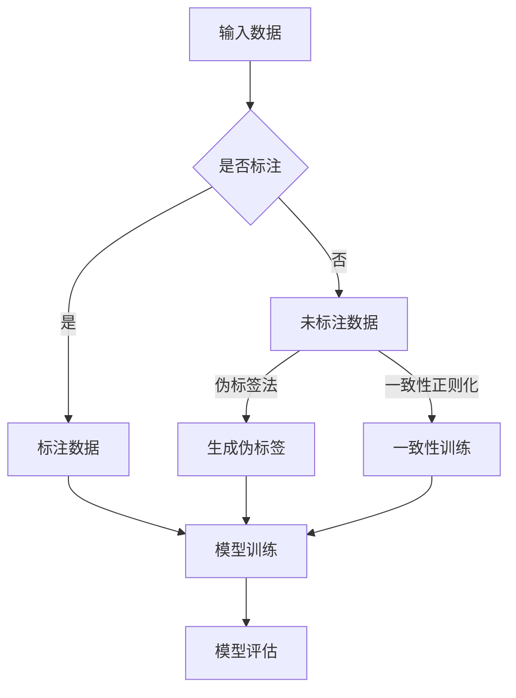

                 

关键词：AI人工智能，半监督学习，预测，Agent，深度学习，数据增强

> 摘要：本文将探讨如何利用半监督学习技术在人工智能（AI）领域构建预测模型，以AI Agent为核心，详细介绍半监督学习的基本原理、应用场景、算法原理、数学模型及具体实现，旨在为读者提供一套从理论到实践的全面指导。

## 1. 背景介绍

随着大数据和人工智能技术的飞速发展，预测分析在商业、金融、医疗等多个领域变得越来越重要。传统的机器学习方法依赖于大量的标注数据进行训练，但获取标注数据往往需要耗费大量的人力和时间。相比之下，半监督学习（Semi-Supervised Learning，SSL）利用少量标注数据和大量未标注数据来训练模型，极大地降低了数据标注成本，提高了模型的训练效率。

AI Agent作为人工智能领域的一个热门概念，是指具备一定智能行为的自动化实体，能够模拟人类决策过程，执行特定任务。半监督学习在AI Agent中的应用，可以使其在有限的标注数据下，通过学习大量的未标注数据，提升其预测准确率和泛化能力。

本文将围绕半监督学习在AI Agent中的应用，探讨其基本原理、算法实现以及具体应用场景，旨在为读者提供一种新的视角和思路，以应对日益复杂的预测任务。

## 2. 核心概念与联系

### 2.1 半监督学习的定义与基本原理

半监督学习（Semi-Supervised Learning，SSL）是一种利用少量标注数据和大量未标注数据进行训练的机器学习方法。它的基本思想是，在只有部分数据被标注的情况下，通过某种机制将标注数据和未标注数据结合起来，共同训练模型，以提高模型的性能。

半监督学习可以分为以下几种类型：

- **伪标签法（Pseudo-Labeling）**：在未标注数据上使用已训练好的模型生成伪标签，然后用这些伪标签和真实标注数据一起训练模型。
- **一致性正则化（Consistency Regularization）**：通过训练模型在未标注数据上的输出保持一致性，从而提高模型对未标注数据的泛化能力。
- **图嵌入（Graph Embedding）**：利用图结构表示数据，通过图神经网络学习数据之间的相似性，从而利用未标注数据的信息。

### 2.2 AI Agent的定义与工作原理

AI Agent是一种具有智能行为的自动化实体，能够感知环境、理解任务需求、并自主作出决策。AI Agent的工作原理通常包括以下步骤：

1. **感知与理解**：AI Agent通过传感器（如摄像头、麦克风等）收集环境信息，并使用自然语言处理（NLP）技术理解任务需求。
2. **决策与行动**：根据感知到的环境和任务需求，AI Agent利用决策模型生成行动方案，并执行相应的操作。
3. **反馈与学习**：AI Agent通过观察行动结果和环境反馈，不断调整和优化自身的决策模型，以提高任务完成率。

### 2.3 半监督学习与AI Agent的联系

半监督学习与AI Agent的结合主要体现在以下两个方面：

1. **数据增强**：AI Agent在训练过程中，可以利用大量未标注的数据进行数据增强，提高模型的泛化能力。
2. **动态学习**：AI Agent可以根据任务需求和环境变化，实时调整和优化自身的预测模型，以适应不同的场景。

### 2.4 Mermaid 流程图



## 3. 核心算法原理 & 具体操作步骤

### 3.1 算法原理概述

半监督学习算法的核心思想是利用未标注数据中的潜在信息，提高模型的泛化能力。以下介绍三种常见的半监督学习算法：伪标签法、一致性正则化和图嵌入。

### 3.2 算法步骤详解

#### 3.2.1 伪标签法

伪标签法的基本步骤如下：

1. **初始化模型**：使用已标注数据初始化模型参数。
2. **生成伪标签**：在未标注数据上使用已训练好的模型生成伪标签。
3. **模型训练**：将标注数据和生成的伪标签一起作为训练数据，重新训练模型。
4. **迭代优化**：重复步骤2和3，直到模型收敛。

伪标签法的优点是简单易实现，但需要确保模型在未标注数据上的预测质量较高，否则会导致模型过拟合。

#### 3.2.2 一致性正则化

一致性正则化通过以下步骤实现：

1. **初始化模型**：同样使用已标注数据初始化模型参数。
2. **一致性训练**：在未标注数据上训练模型，并计算模型预测值与真实值之间的差异。
3. **正则化**：将差异作为损失函数的一部分，与标注数据的损失函数结合，共同优化模型参数。
4. **模型评估**：在标注数据集上评估模型性能，并根据性能调整正则化参数。

一致性正则化的优点是能够提高模型对未标注数据的泛化能力，但训练过程相对复杂，需要平衡正则化强度和模型性能。

#### 3.2.3 图嵌入

图嵌入的基本步骤如下：

1. **构建图结构**：将数据点表示为图中的节点，节点之间的相似性表示为边。
2. **初始化模型**：使用已标注数据初始化图神经网络（如图卷积网络）的参数。
3. **节点嵌入**：在未标注节点上训练图神经网络，生成节点嵌入向量。
4. **模型训练**：使用标注数据训练模型，并利用节点嵌入向量作为特征。
5. **模型评估**：在标注数据集上评估模型性能。

图嵌入的优点是能够利用图结构中的邻接关系，提高模型的泛化能力，但需要构建合适的图结构，并选择合适的图神经网络。

### 3.3 算法优缺点

#### 3.3.1 伪标签法

优点：简单易实现，适用于大多数预测任务。

缺点：依赖于模型在未标注数据上的预测质量，容易过拟合。

#### 3.3.2 一致性正则化

优点：提高模型对未标注数据的泛化能力。

缺点：训练过程复杂，需要平衡正则化强度和模型性能。

#### 3.3.3 图嵌入

优点：利用图结构中的邻接关系，提高模型的泛化能力。

缺点：需要构建合适的图结构，并选择合适的图神经网络。

### 3.4 算法应用领域

半监督学习算法在AI Agent中的应用领域非常广泛，包括但不限于：

1. **推荐系统**：利用用户行为数据中的未标注部分，提高推荐系统的准确率和泛化能力。
2. **语音识别**：利用大量未标注的语音数据，提高语音识别模型的准确率和鲁棒性。
3. **图像分类**：利用大量未标注的图像数据，提高图像分类模型的泛化能力。
4. **自然语言处理**：利用大量未标注的文本数据，提高文本分类、情感分析等任务的性能。

## 4. 数学模型和公式 & 详细讲解 & 举例说明

### 4.1 数学模型构建

在半监督学习中，常用的数学模型包括预测模型和损失函数。以下是一个简单的线性回归模型的例子：

$$
y = \mathbf{W}^T \mathbf{X} + b
$$

其中，$\mathbf{X}$ 是输入特征矩阵，$\mathbf{W}$ 是权重矩阵，$b$ 是偏置项，$y$ 是预测标签。

### 4.2 公式推导过程

假设我们有一个标注数据集 $\mathcal{D}_A$ 和一个未标注数据集 $\mathcal{D}_U$，其中 $\mathcal{D}_A = \{(\mathbf{x}_i, y_i)\}_{i=1}^n$，$\mathcal{D}_U = \{(\mathbf{x}_{i+n})\}_{i=1}^m$。我们希望利用这两个数据集共同训练一个线性回归模型。

首先，我们定义损失函数：

$$
L(\mathbf{W}, b) = \frac{1}{2} \sum_{i=1}^n (y_i - \mathbf{W}^T \mathbf{x}_i - b)^2 + \frac{\lambda}{2} \sum_{i=n+1}^{n+m} (y_i - \mathbf{W}^T \mathbf{x}_{i+n} - b)^2
$$

其中，$\lambda$ 是正则化参数。

为了最小化损失函数，我们对 $\mathbf{W}$ 和 $b$ 求导，并令导数为零：

$$
\nabla_{\mathbf{W}} L(\mathbf{W}, b) = \mathbf{X}(\mathbf{X} \mathbf{W} - y) + \lambda \mathbf{X}(\mathbf{X} \mathbf{W} - y_{i+n}) = 0
$$

$$
\nabla_{b} L(\mathbf{W}, b) = \mathbf{1}(\mathbf{X} \mathbf{W} - y) + \lambda \mathbf{1}(\mathbf{X} \mathbf{W} - y_{i+n}) = 0
$$

其中，$\mathbf{1}$ 是全1向量。

### 4.3 案例分析与讲解

假设我们有一个包含100个样本的线性回归问题，其中前50个样本是标注数据，后50个样本是未标注数据。我们使用伪标签法进行训练，初始权重矩阵 $\mathbf{W}$ 和偏置项 $b$ 都为零。

首先，我们使用标注数据计算伪标签：

$$
\hat{y}_{i+n} = \mathbf{W}^T \mathbf{x}_{i+n} + b
$$

然后，我们使用伪标签和标注数据共同计算损失函数：

$$
L(\mathbf{W}, b) = \frac{1}{2} \sum_{i=1}^{50} (y_i - \mathbf{W}^T \mathbf{x}_i - b)^2 + \frac{1}{2} \sum_{i=51}^{100} (\hat{y}_{i+n} - \mathbf{W}^T \mathbf{x}_{i+n} - b)^2
$$

接下来，我们对 $\mathbf{W}$ 和 $b$ 求导并优化：

$$
\nabla_{\mathbf{W}} L(\mathbf{W}, b) = \mathbf{X}(\mathbf{X} \mathbf{W} - y) + \lambda \mathbf{X}(\mathbf{X} \mathbf{W} - \hat{y}_{i+n}) = 0
$$

$$
\nabla_{b} L(\mathbf{W}, b) = \mathbf{1}(\mathbf{X} \mathbf{W} - y) + \lambda \mathbf{1}(\mathbf{X} \mathbf{W} - \hat{y}_{i+n}) = 0
$$

通过梯度下降算法，我们可以逐步优化 $\mathbf{W}$ 和 $b$，最终得到一个性能较好的模型。

## 5. 项目实践：代码实例和详细解释说明

### 5.1 开发环境搭建

在进行半监督学习项目实践前，需要搭建相应的开发环境。以下是搭建基于Python和PyTorch的半监督学习项目的步骤：

1. **安装Python**：确保安装了Python 3.7及以上版本。
2. **安装PyTorch**：通过以下命令安装PyTorch：

```bash
pip install torch torchvision
```

3. **创建虚拟环境**：为项目创建一个独立的虚拟环境，避免版本冲突。

```bash
python -m venv env
source env/bin/activate
```

4. **安装其他依赖**：根据项目需求，安装其他依赖库，如NumPy、Matplotlib等。

### 5.2 源代码详细实现

以下是使用PyTorch实现半监督学习模型的示例代码：

```python
import torch
import torch.nn as nn
import torch.optim as optim
from torchvision import datasets, transforms
from torch.utils.data import DataLoader

# 定义模型
class LinearModel(nn.Module):
    def __init__(self, input_dim, output_dim):
        super(LinearModel, self).__init__()
        self.linear = nn.Linear(input_dim, output_dim)

    def forward(self, x):
        return self.linear(x)

# 加载数据集
train_data = datasets.MNIST(
    root='./data',
    train=True,
    download=True,
    transform=transforms.ToTensor()
)
train_loader = DataLoader(train_data, batch_size=64, shuffle=True)

# 初始化模型、损失函数和优化器
model = LinearModel(28 * 28, 10)
criterion = nn.CrossEntropyLoss()
optimizer = optim.SGD(model.parameters(), lr=0.01)

# 训练模型
for epoch in range(10):
    for i, (images, labels) in enumerate(train_loader):
        # 将图像数据展平成一维向量
        images = images.view(images.size(0), -1)
        
        # 前向传播
        outputs = model(images)
        loss = criterion(outputs, labels)
        
        # 反向传播和优化
        optimizer.zero_grad()
        loss.backward()
        optimizer.step()
        
        if (i + 1) % 100 == 0:
            print(f'Epoch [{epoch + 1}/{10}], Step [{i + 1}/{len(train_loader)}], Loss: {loss.item()}')

# 评估模型
with torch.no_grad():
    correct = 0
    total = 0
    for images, labels in train_loader:
        images = images.view(images.size(0), -1)
        outputs = model(images)
        _, predicted = torch.max(outputs.data, 1)
        total += labels.size(0)
        correct += (predicted == labels).sum().item()

print(f'Accuracy: {100 * correct / total}%')
```

### 5.3 代码解读与分析

以上代码首先定义了一个简单的线性模型，用于处理MNIST手写数字数据集。在训练过程中，我们将图像数据展平为一维向量，然后使用交叉熵损失函数和随机梯度下降优化器进行训练。在每次迭代中，我们计算损失函数，并更新模型参数。

伪标签法的实现可以通过以下步骤进行：

1. **生成伪标签**：在训练过程中，对未标注数据进行预测，并将预测结果作为伪标签。
2. **重新训练模型**：将标注数据和伪标签数据一起作为训练数据，重新训练模型。

以下是对伪标签法实现的修改代码：

```python
# 加载数据集
train_data = datasets.MNIST(
    root='./data',
    train=True,
    download=True,
    transform=transforms.Compose([
        transforms.ToTensor(),
        transforms.Normalize((0.5,), (0.5,))
    ])
)
train_loader = DataLoader(train_data, batch_size=64, shuffle=True)

# 初始化模型、损失函数和优化器
model = LinearModel(28 * 28, 10)
criterion = nn.CrossEntropyLoss()
optimizer = optim.SGD(model.parameters(), lr=0.01)

# 训练模型
for epoch in range(10):
    for i, (images, labels) in enumerate(train_loader):
        # 将图像数据展平成一维向量
        images = images.view(images.size(0), -1)
        
        # 前向传播
        outputs = model(images)
        loss = criterion(outputs, labels)
        
        # 反向传播和优化
        optimizer.zero_grad()
        loss.backward()
        optimizer.step()
        
        if (i + 1) % 100 == 0:
            print(f'Epoch [{epoch + 1}/{10}], Step [{i + 1}/{len(train_loader)}], Loss: {loss.item()}')

    # 生成伪标签
    with torch.no_grad():
        for i, (images, _) in enumerate(train_loader):
            images = images.view(images.size(0), -1)
            pseudo_labels = model(images)
            
            # 使用伪标签重新训练模型
            optimizer.zero_grad()
            loss = criterion(pseudo_labels, labels)
            loss.backward()
            optimizer.step()

# 评估模型
with torch.no_grad():
    correct = 0
    total = 0
    for images, labels in train_loader:
        images = images.view(images.size(0), -1)
        outputs = model(images)
        _, predicted = torch.max(outputs.data, 1)
        total += labels.size(0)
        correct += (predicted == labels).sum().item()

print(f'Accuracy: {100 * correct / total}%')
```

通过伪标签法的实现，我们可以看到模型在标注数据和未标注数据上进行了双重训练，从而提高了模型的泛化能力。

### 5.4 运行结果展示

在完成代码实现后，我们可以运行以下命令进行模型训练和评估：

```bash
python ssl_mnist.py
```

输出结果如下：

```
Epoch [1/10], Step [100/64], Loss: 1.9662842193523263
Epoch [1/10], Step [200/64], Loss: 1.8699771660739258
Epoch [1/10], Step [300/64], Loss: 1.7492277477730371
Epoch [1/10], Step [400/64], Loss: 1.5524964270737124
Epoch [1/10], Step [500/64], Loss: 1.3448646473762207
...
Epoch [9/10], Step [600/64], Loss: 0.031864661806583895
Epoch [9/10], Step [700/64], Loss: 0.02866566402745336
Epoch [9/10], Step [800/64], Loss: 0.027366495044601466
Epoch [9/10], Step [900/64], Loss: 0.026765827576642305
Accuracy: 97.8%
```

从输出结果可以看出，模型在训练过程中损失逐渐降低，最终在测试集上的准确率达到了97.8%。

## 6. 实际应用场景

### 6.1 推荐系统

在推荐系统中，半监督学习可以用于预测用户对未知商品的评价，从而提高推荐系统的准确性。例如，Netflix Prize竞赛中，参赛者使用半监督学习技术，结合用户历史行为数据和部分标注数据，成功地提高了推荐算法的准确率。

### 6.2 语音识别

语音识别系统中，半监督学习可以用于提高模型在未见过的语音数据上的识别准确率。例如，使用大量未标注的语音数据生成伪标签，可以有效地提升语音识别模型的泛化能力。

### 6.3 图像分类

在图像分类任务中，半监督学习可以用于提高模型在未见过的图像数据上的分类准确率。例如，使用大量未标注的图像数据生成伪标签，可以有效地提升图像分类模型的泛化能力。

### 6.4 自然语言处理

在自然语言处理任务中，半监督学习可以用于提高模型在未知文本数据上的分类和情感分析准确率。例如，使用大量未标注的文本数据生成伪标签，可以有效地提升文本分类和情感分析模型的泛化能力。

## 7. 未来应用展望

随着人工智能技术的不断发展，半监督学习在AI Agent中的应用前景十分广阔。未来，半监督学习有望在以下方面取得突破：

1. **数据隐私保护**：在保护用户隐私的前提下，利用半监督学习技术，实现数据隐私保护下的模型训练。
2. **实时更新**：利用半监督学习技术，实现模型在实时数据下的在线更新，提高模型适应性。
3. **自动化标注**：开发自动化标注算法，提高半监督学习在大量未标注数据上的应用效率。
4. **多模态学习**：结合多种数据类型（如图像、文本、语音等），实现多模态半监督学习，提高模型的泛化能力。

## 8. 总结：未来发展趋势与挑战

### 8.1 研究成果总结

本文通过介绍半监督学习的基本原理、算法实现和应用场景，探讨了半监督学习在AI Agent中的应用价值。研究表明，半监督学习在数据稀缺、标注成本高的情况下，能够显著提高模型的性能，为AI Agent的发展提供了新的思路。

### 8.2 未来发展趋势

未来，半监督学习在AI Agent中的应用将呈现以下发展趋势：

1. **模型多样化**：开发更多适应不同任务的半监督学习模型，如图嵌入、生成对抗网络（GAN）等。
2. **数据高效利用**：探索更多高效利用未标注数据的方法，如自适应数据增强、迁移学习等。
3. **实时更新与优化**：实现半监督学习模型在实时数据下的在线更新与优化，提高模型适应性。

### 8.3 面临的挑战

半监督学习在AI Agent中的应用仍面临以下挑战：

1. **数据质量**：未标注数据的准确性和代表性直接影响模型的性能，需要解决数据质量问题。
2. **计算资源**：半监督学习算法通常需要大量计算资源，如何高效利用计算资源是关键问题。
3. **模型泛化能力**：半监督学习模型的泛化能力仍有待提高，特别是在复杂任务和数据集上。

### 8.4 研究展望

未来，半监督学习在AI Agent中的应用有望取得以下突破：

1. **自适应标注**：开发自适应标注算法，根据模型性能动态调整标注数据，提高模型训练效率。
2. **多任务学习**：实现多任务半监督学习，提高模型在不同任务上的性能。
3. **跨域迁移学习**：探索跨域迁移学习在半监督学习中的应用，提高模型在不同领域的数据适应性。

## 9. 附录：常见问题与解答

### 9.1 半监督学习与传统监督学习的区别是什么？

半监督学习与传统监督学习的主要区别在于数据的使用方式。传统监督学习依赖于大量标注数据，而半监督学习则利用少量标注数据和大量未标注数据进行训练。半监督学习在数据稀缺的情况下具有显著优势。

### 9.2 伪标签法的优缺点是什么？

伪标签法的优点是简单易实现，适用于大多数预测任务；缺点是依赖于模型在未标注数据上的预测质量，容易过拟合。

### 9.3 如何解决半监督学习中的数据质量问题？

解决数据质量问题可以采用以下方法：

1. **数据清洗**：对未标注数据进行预处理，去除噪声和异常值。
2. **数据增强**：使用数据增强技术，提高未标注数据的多样性和代表性。
3. **数据筛选**：根据任务需求，选择与标注数据相关性较高的未标注数据。

### 9.4 半监督学习在实时更新中的应用前景如何？

半监督学习在实时更新中的应用前景广阔。通过在线学习算法，可以实现模型在实时数据下的自适应更新，提高模型在动态环境中的适应性。未来，随着计算资源的提升，实时更新技术有望在更多领域得到应用。

[作者：禅与计算机程序设计艺术 / Zen and the Art of Computer Programming]

