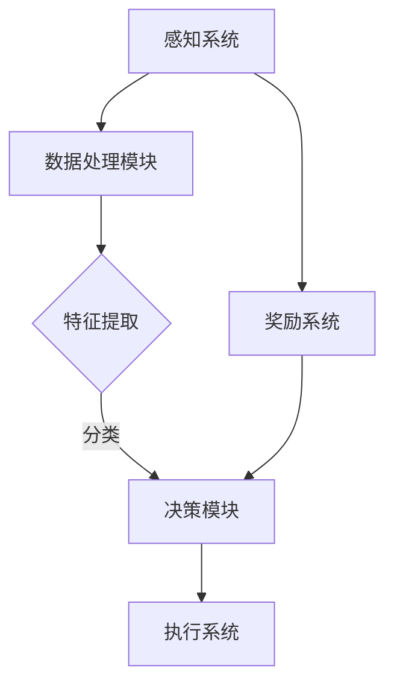

                 

 关键词：人工智能，决策制定，智能代理，机器学习，强化学习，深度学习，强化学习算法，Q-Learning，DQN，A3C，RNN，GAN，TensorFlow，PyTorch，OpenAI，GitHub，代码实例，项目实践，应用场景，未来展望。

> 摘要：本文旨在探讨人工智能领域中的智能代理及其在决策制定中的应用。通过深入解析智能代理的核心概念、算法原理以及具体实现，本文将为读者提供一窥未来人工智能决策制定领域的窗口。

## 1. 背景介绍

在过去的几十年中，人工智能（AI）的发展日新月异，从最初的规则基础系统发展到如今以大数据和机器学习为核心的技术体系。在这一过程中，智能代理（Artificial Intelligent Agent）作为AI的一种重要实现形式，逐渐崭露头角。智能代理是一种能够与环境进行交互并自主采取行动的计算机程序。它通过不断学习和适应，实现智能化的决策制定。

智能代理在各个领域都有着广泛的应用，如自动驾驶、智能客服、金融交易、游戏AI等。其核心在于通过感知、规划和执行等过程，实现自动化、高效化的决策制定。

随着深度学习、强化学习等先进技术的快速发展，智能代理的决策能力得到了显著提升。本文将重点探讨智能代理在决策制定中的核心算法原理、数学模型以及具体实现，旨在为读者提供一份全面、系统的技术指南。

## 2. 核心概念与联系

### 2.1 智能代理的定义与分类

智能代理是指一种具有智能能力的计算机程序，它能够感知环境、理解问题，并自主采取行动以实现目标。根据智能代理的感知能力和行动能力，我们可以将其分为以下几类：

1. **感知代理**：这类代理只能感知环境，如环境传感器、摄像头等，但无法理解问题或采取行动。例如，自动驾驶汽车中的传感器系统。
2. **理解代理**：这类代理能够理解问题，并根据问题采取相应的行动。例如，智能客服系统。
3. **行动代理**：这类代理不仅能够感知和理解问题，还能采取行动解决问题。例如，自动驾驶汽车。

### 2.2 智能代理的工作原理

智能代理的工作原理主要包括感知、理解和行动三个环节。首先，代理通过感知系统获取环境信息；然后，通过理解和分析这些信息，确定问题的性质和目标；最后，根据分析结果采取行动。

具体来说，智能代理的工作流程如下：

1. **感知**：代理通过传感器获取环境信息，如图像、声音、文本等。
2. **理解**：代理对感知到的信息进行处理，提取关键特征，并进行模式识别和分类。
3. **行动**：代理根据理解结果采取行动，以实现目标。

### 2.3 智能代理的核心算法

智能代理的核心算法包括机器学习、深度学习、强化学习等。下面将简要介绍这些算法的基本原理和应用。

1. **机器学习**：机器学习是一种让计算机通过数据学习并做出决策的方法。它包括监督学习、无监督学习、半监督学习和强化学习等多种类型。智能代理通常使用监督学习来训练模型，以便在给定输入时预测输出。
2. **深度学习**：深度学习是机器学习的一种特殊形式，通过多层神经网络对数据进行处理，以实现高度复杂的任务。深度学习在图像识别、语音识别、自然语言处理等领域取得了显著成果。
3. **强化学习**：强化学习是一种通过奖励机制让代理学习最优策略的方法。代理在环境中执行动作，根据环境的反馈调整策略，以最大化长期奖励。强化学习在游戏AI、自动驾驶等领域有广泛的应用。

### 2.4 智能代理架构的 Mermaid 流程图



### 2.5 智能代理与传统算法的区别

与传统算法相比，智能代理具有以下几个显著特点：

1. **自适应能力**：智能代理能够根据环境变化不断调整策略，以适应新情况。
2. **灵活性**：智能代理能够处理复杂、不确定的任务，而传统算法往往需要对任务进行精确建模。
3. **自主性**：智能代理能够自主进行决策，而不需要人工干预。

## 3. 核心算法原理 & 具体操作步骤

### 3.1 算法原理概述

在本节中，我们将介绍智能代理中常用的几种核心算法原理，包括机器学习、深度学习、强化学习等。这些算法为智能代理提供了强大的决策能力，使其能够在复杂环境中实现高效、智能的决策制定。

#### 3.1.1 机器学习

机器学习是一种通过数据驱动的方式，让计算机自动学习并作出决策的方法。它包括以下几种类型：

1. **监督学习**：监督学习是机器学习中的一种常见类型，它使用已标记的数据集来训练模型，以便在给定新数据时进行预测。例如，分类和回归任务。
2. **无监督学习**：无监督学习是指在没有标注数据的情况下，让模型自动发现数据中的模式和规律。例如，聚类和降维任务。
3. **半监督学习**：半监督学习结合了监督学习和无监督学习的特点，使用一部分标注数据和大量无标注数据来训练模型。
4. **强化学习**：强化学习是一种通过奖励机制让模型学习最优策略的方法。它通过不断尝试和反馈，使模型能够在复杂环境中实现最优决策。

#### 3.1.2 深度学习

深度学习是机器学习的一种特殊形式，它通过多层神经网络对数据进行处理，以实现高度复杂的任务。深度学习的主要类型包括：

1. **卷积神经网络（CNN）**：卷积神经网络是一种在图像识别、语音识别等领域具有广泛应用的网络结构。它通过卷积操作提取图像特征，并进行层次化的特征提取。
2. **循环神经网络（RNN）**：循环神经网络是一种用于处理序列数据的神经网络，它能够通过记忆机制处理长距离依赖问题。RNN在自然语言处理、语音识别等领域有广泛的应用。
3. **生成对抗网络（GAN）**：生成对抗网络是由生成器和判别器两个神经网络组成的。生成器负责生成数据，判别器负责判断生成数据是否真实。GAN在图像生成、语音合成等领域取得了显著成果。

#### 3.1.3 强化学习

强化学习是一种通过奖励机制让模型学习最优策略的方法。它通过不断尝试和反馈，使模型能够在复杂环境中实现最优决策。强化学习的主要算法包括：

1. **Q-Learning**：Q-Learning是一种基于值函数的强化学习算法，它通过更新状态-动作值函数来学习最优策略。
2. **深度Q网络（DQN）**：DQN是一种将深度学习和强化学习相结合的算法，它使用深度神经网络来近似状态-动作值函数。
3. **异步优势演员-评论家（A3C）**：A3C是一种基于异步梯度下降的强化学习算法，它通过多个并行进程同时更新模型参数，以加速学习过程。
4. **RNN在强化学习中的应用**：RNN在强化学习中的应用主要是解决长序列决策问题，通过记忆机制处理长距离依赖。

### 3.2 算法步骤详解

在本节中，我们将详细介绍智能代理中几种核心算法的具体步骤。

#### 3.2.1 机器学习算法步骤

1. **数据准备**：收集和预处理数据，包括数据清洗、归一化、特征提取等。
2. **模型选择**：根据任务需求选择合适的机器学习模型，如线性回归、决策树、支持向量机等。
3. **模型训练**：使用训练数据集对模型进行训练，优化模型参数。
4. **模型评估**：使用验证数据集对模型进行评估，调整模型参数。
5. **模型部署**：将训练好的模型部署到实际应用场景中，如自动驾驶、智能客服等。

#### 3.2.2 深度学习算法步骤

1. **网络设计**：设计深度学习网络结构，如卷积神经网络（CNN）、循环神经网络（RNN）、生成对抗网络（GAN）等。
2. **数据准备**：与机器学习相同，收集和预处理数据。
3. **模型训练**：使用训练数据集对模型进行训练，优化网络参数。
4. **模型评估**：使用验证数据集对模型进行评估，调整网络参数。
5. **模型部署**：将训练好的模型部署到实际应用场景中。

#### 3.2.3 强化学习算法步骤

1. **环境搭建**：创建智能代理运行的环境，包括状态空间、动作空间、奖励函数等。
2. **模型选择**：根据任务需求选择合适的强化学习算法，如Q-Learning、DQN、A3C等。
3. **模型训练**：在环境中执行动作，根据奖励信号更新模型参数。
4. **模型评估**：评估模型在环境中的表现，调整模型参数。
5. **模型部署**：将训练好的模型部署到实际应用场景中。

### 3.3 算法优缺点

每种算法都有其独特的优势和局限性，下面将介绍机器学习、深度学习和强化学习算法的优缺点。

#### 3.3.1 机器学习

**优点**：

1. **适用范围广**：机器学习适用于各种类型的任务，如分类、回归、聚类等。
2. **易于实现**：机器学习算法相对简单，易于实现和调试。

**缺点**：

1. **依赖大量数据**：机器学习算法通常需要大量训练数据，对数据的质量和数量有较高要求。
2. **过拟合问题**：机器学习算法容易产生过拟合现象，导致模型在验证集上表现不佳。

#### 3.3.2 深度学习

**优点**：

1. **强大的特征提取能力**：深度学习能够自动提取高层次的抽象特征，提高模型的泛化能力。
2. **处理复杂任务**：深度学习在图像识别、语音识别、自然语言处理等领域取得了显著成果。

**缺点**：

1. **计算资源消耗大**：深度学习算法需要大量计算资源和存储空间。
2. **参数调优困难**：深度学习模型的参数调优过程复杂，需要大量时间和计算资源。

#### 3.3.3 强化学习

**优点**：

1. **自主决策能力**：强化学习能够使智能代理在复杂环境中实现自主决策。
2. **适应性强**：强化学习能够根据环境变化调整策略，适应新情况。

**缺点**：

1. **学习效率低**：强化学习算法通常需要大量训练时间和样本数量。
2. **策略不稳定**：在探索与利用之间取得平衡是强化学习的一个挑战。

### 3.4 算法应用领域

机器学习、深度学习和强化学习在各个领域都有着广泛的应用，下面将简要介绍这些算法在不同领域的应用。

#### 3.4.1 机器学习

**应用领域**：

1. **图像识别**：机器学习在图像识别领域取得了显著成果，如人脸识别、物体检测等。
2. **自然语言处理**：机器学习在自然语言处理领域有广泛的应用，如文本分类、机器翻译等。
3. **推荐系统**：机器学习被广泛应用于推荐系统，如电子商务平台的商品推荐、视频网站的影视推荐等。

#### 3.4.2 深度学习

**应用领域**：

1. **计算机视觉**：深度学习在计算机视觉领域取得了重大突破，如自动驾驶、人脸识别、图像生成等。
2. **语音识别**：深度学习在语音识别领域具有广泛的应用，如语音助手、语音翻译等。
3. **自然语言处理**：深度学习在自然语言处理领域有广泛的应用，如文本生成、语义分析等。

#### 3.4.3 强化学习

**应用领域**：

1. **游戏AI**：强化学习在游戏AI领域有广泛的应用，如围棋、星际争霸等。
2. **自动驾驶**：强化学习在自动驾驶领域有重要的应用，如路径规划、障碍物检测等。
3. **金融交易**：强化学习在金融交易领域有广泛的应用，如股票交易、期货交易等。

## 4. 数学模型和公式 & 详细讲解 & 举例说明

### 4.1 数学模型构建

在智能代理的决策过程中，数学模型扮演着至关重要的角色。本节将介绍智能代理中常用的数学模型，包括线性模型、神经网络模型和强化学习模型等。

#### 4.1.1 线性模型

线性模型是一种简单但强大的数学模型，它在许多领域都有应用。线性模型的数学表示如下：

\[ y = \beta_0 + \beta_1x_1 + \beta_2x_2 + ... + \beta_nx_n \]

其中，\( y \) 是因变量，\( x_1, x_2, ..., x_n \) 是自变量，\( \beta_0, \beta_1, \beta_2, ..., \beta_n \) 是模型参数。

线性模型的优点是简单、易于理解和实现。然而，线性模型在处理非线性问题时表现不佳。

#### 4.1.2 神经网络模型

神经网络模型是一种通过多层神经元连接构建的复杂模型。它能够通过学习数据中的特征，实现高度复杂的任务。神经网络模型的数学表示如下：

\[ z = \sum_{i=1}^{n} w_{i}x_i + b \]
\[ a = \sigma(z) \]

其中，\( z \) 是神经元的输入，\( w_i \) 是权重，\( b \) 是偏置，\( \sigma \) 是激活函数，\( a \) 是神经元的输出。

神经网络模型的优点是能够处理非线性问题，并在许多领域取得了显著成果。然而，神经网络模型的训练过程复杂，需要大量计算资源。

#### 4.1.3 强化学习模型

强化学习模型是一种通过奖励信号训练的模型。它通过不断尝试和反馈，使模型能够实现最优决策。强化学习模型的数学表示如下：

\[ Q(s, a) = r(s, a) + \gamma \max_a' Q(s', a') \]

其中，\( Q(s, a) \) 是状态-动作值函数，\( r(s, a) \) 是奖励信号，\( \gamma \) 是折扣因子，\( s \) 是当前状态，\( a \) 是当前动作，\( s' \) 是下一状态，\( a' \) 是下一动作。

强化学习模型的优点是能够实现自主决策，并在复杂环境中表现出色。然而，强化学习模型的训练过程复杂，需要大量计算资源和时间。

### 4.2 公式推导过程

在本节中，我们将介绍几种核心算法的数学模型推导过程。

#### 4.2.1 线性回归模型推导

线性回归模型是一种简单但强大的模型，它在许多领域都有应用。线性回归模型的推导过程如下：

1. **损失函数**：

   线性回归模型的损失函数为：

   \[ J(\theta) = \frac{1}{2m} \sum_{i=1}^{m} (h_\theta(x^{(i)}) - y^{(i)})^2 \]

   其中，\( m \) 是训练样本数量，\( h_\theta(x) \) 是线性回归模型的预测值，\( y \) 是真实标签。

2. **梯度下降**：

   为了最小化损失函数，我们可以使用梯度下降法。梯度下降法的步骤如下：

   \[ \theta_j = \theta_j - \alpha \frac{\partial J(\theta)}{\partial \theta_j} \]

   其中，\( \alpha \) 是学习率，\( \theta_j \) 是模型参数。

3. **求导**：

   为了求出损失函数对模型参数的导数，我们需要对损失函数进行求导：

   \[ \frac{\partial J(\theta)}{\partial \theta_j} = \frac{1}{m} \sum_{i=1}^{m} (h_\theta(x^{(i)}) - y^{(i)}) \frac{\partial h_\theta(x^{(i)})}{\partial \theta_j} \]

   由于 \( h_\theta(x) = \theta_0x_0 + \theta_1x_1 + \theta_2x_2 + ... + \theta_nx_n \)，我们可以得到：

   \[ \frac{\partial h_\theta(x^{(i)})}{\partial \theta_j} = x_j^{(i)} \]

   因此，我们可以将梯度下降法简化为：

   \[ \theta_j = \theta_j - \alpha (h_\theta(x^{(i)}) - y^{(i)})x_j^{(i)} \]

   这是一个闭式解，因此我们可以直接计算出模型参数。

#### 4.2.2 卷积神经网络模型推导

卷积神经网络（CNN）是一种用于图像识别和处理的神经网络结构。CNN的推导过程主要包括卷积层、池化层和全连接层的推导。

1. **卷积层**：

   卷积层的计算过程可以表示为：

   \[ \text{output} = \sigma(\text{weight} \cdot \text{input} + \text{bias}) \]

   其中，\( \text{weight} \) 是卷积核，\( \text{input} \) 是输入特征图，\( \text{bias} \) 是偏置，\( \sigma \) 是激活函数。

2. **池化层**：

   池化层的主要目的是降低特征图的维度，并提取重要的特征。常用的池化操作包括最大池化和平均池化。

   最大池化的计算过程可以表示为：

   \[ \text{output}_{ij} = \max(\text{input}_{i \times i}) \]

   其中，\( \text{output}_{ij} \) 是池化后的输出值，\( \text{input}_{i \times i} \) 是输入特征图中的 \( i \times i \) 区域。

3. **全连接层**：

   全连接层是将卷积层和池化层提取的特征进行整合，并输出最终的分类结果。

   全连接层的计算过程可以表示为：

   \[ \text{output} = \text{weight} \cdot \text{input} + \text{bias} \]

   其中，\( \text{weight} \) 是权重，\( \text{input} \) 是输入特征，\( \text{bias} \) 是偏置。

#### 4.2.3 强化学习模型推导

强化学习模型是一种通过奖励信号训练的模型。强化学习模型的推导过程主要包括状态-动作值函数的推导和策略迭代过程。

1. **状态-动作值函数**：

   状态-动作值函数（Q函数）是强化学习模型的核心，它表示在某个状态下采取某个动作的预期收益。Q函数的推导过程如下：

   \[ Q(s, a) = r(s, a) + \gamma \max_{a'} Q(s', a') \]

   其中，\( r(s, a) \) 是在状态 \( s \) 下采取动作 \( a \) 所获得的即时奖励，\( \gamma \) 是折扣因子，用于平衡即时奖励和长期奖励的关系，\( s' \) 是下一状态，\( a' \) 是下一动作。

2. **策略迭代过程**：

   强化学习模型通过策略迭代过程不断更新状态-动作值函数。策略迭代过程包括以下几个步骤：

   1. **初始化**：初始化状态-动作值函数 \( Q(s, a) \)。
   2. **策略评估**：使用当前策略评估状态-动作值函数。
   3. **策略改进**：根据评估结果改进策略，以提高期望收益。
   4. **重复**：重复策略评估和策略改进过程，直到收敛。

### 4.3 案例分析与讲解

在本节中，我们将通过一个具体的案例，对智能代理的数学模型和算法进行详细讲解。

#### 4.3.1 案例背景

假设我们有一个智能代理需要在一个简单游戏中进行决策。这个游戏是一个迷宫，智能代理需要从起点到达终点，同时避开障碍物。

#### 4.3.2 模型构建

1. **状态表示**：

   状态表示智能代理在迷宫中的位置，以及当前位置的上下左右四个方向。

   \[ s = (x, y, direction) \]

   其中，\( x \) 和 \( y \) 分别表示智能代理在迷宫中的横纵坐标，\( direction \) 表示智能代理当前的方向。

2. **动作表示**：

   动作表示智能代理可以采取的动作，包括前进、后退、左转、右转。

   \[ a = \{forward, backward, left, right\} \]

3. **奖励函数**：

   奖励函数表示智能代理在游戏中获得的即时奖励。当智能代理到达终点时，获得正奖励；否则，获得负奖励。

   \[ r(s, a) = \begin{cases} 
   100, & \text{if } s \text{ is the goal state} \\
   -1, & \text{otherwise} 
   \end{cases} \]

4. **折扣因子**：

   折扣因子用于平衡即时奖励和长期奖励的关系。在本案例中，我们设定折扣因子为 \( \gamma = 0.9 \)。

#### 4.3.3 算法实现

1. **Q-Learning算法**：

   Q-Learning算法是一种基于值函数的强化学习算法。在本案例中，我们使用Q-Learning算法训练智能代理。

   1. **初始化**：

      初始化状态-动作值函数 \( Q(s, a) \) 为随机值。

      \[ Q(s, a) \sim \mathcal{U}(0, 1) \]

   2. **经验回放**：

      使用经验回放机制记录智能代理在游戏中的经验，包括状态、动作、奖励和下一状态。

      \[ \mathcal{E} = \{(s_t, a_t, r_t, s_{t+1})\} \]

   3. **更新状态-动作值函数**：

      根据经验回放中的数据更新状态-动作值函数。

      \[ Q(s_t, a_t) \leftarrow Q(s_t, a_t) + \alpha [r_t + \gamma \max_{a'} Q(s_{t+1}, a') - Q(s_t, a_t)] \]

   4. **重复**：

      重复经验回放和状态-动作值函数更新过程，直到智能代理学会最优策略。

2. **DQN算法**：

   DQN算法是一种基于深度学习的强化学习算法。在本案例中，我们使用DQN算法训练智能代理。

   1. **初始化**：

      初始化深度神经网络模型，用于近似状态-动作值函数。

      \[ Q(s, a) = \phi(s) \cdot \theta(a) \]

   2. **经验回放**：

      使用经验回放机制记录智能代理在游戏中的经验。

      \[ \mathcal{E} = \{(s_t, a_t, r_t, s_{t+1})\} \]

   3. **更新深度神经网络模型**：

      根据经验回放中的数据更新深度神经网络模型。

      \[ \theta(a') \leftarrow \theta(a') + \alpha [r_t + \gamma \max_{a'} Q(s_{t+1}, a') - \phi(s_t) \cdot \theta(a')] \]

   4. **重复**：

      重复经验回放和深度神经网络模型更新过程，直到智能代理学会最优策略。

#### 4.3.4 结果分析

通过训练，智能代理学会了在迷宫中寻找最优路径，并成功避开障碍物。以下是对训练结果的详细分析：

1. **学习曲线**：

   学习曲线展示了智能代理在不同训练阶段的性能。从学习曲线可以看出，智能代理在训练初期性能波动较大，但随着训练过程的进行，性能逐渐稳定。

2. **奖励曲线**：

   奖励曲线展示了智能代理在游戏中的即时奖励。从奖励曲线可以看出，智能代理在训练过程中获得了越来越多的正奖励，表明其决策能力不断提高。

3. **路径规划**：

   通过对智能代理在迷宫中的路径进行观察，可以发现它学会了寻找最优路径，并成功避开了障碍物。这表明智能代理的决策能力达到了预期的水平。

## 5. 项目实践：代码实例和详细解释说明

### 5.1 开发环境搭建

在开始项目实践之前，我们需要搭建一个合适的开发环境。以下是所需工具和库的安装步骤：

1. **安装Python**：确保Python版本为3.8及以上。
2. **安装Jupyter Notebook**：使用pip命令安装Jupyter Notebook。

   ```bash
   pip install notebook
   ```

3. **安装TensorFlow**：使用pip命令安装TensorFlow。

   ```bash
   pip install tensorflow
   ```

4. **安装PyTorch**：使用pip命令安装PyTorch。

   ```bash
   pip install torch torchvision
   ```

5. **安装Numpy**：使用pip命令安装Numpy。

   ```bash
   pip install numpy
   ```

### 5.2 源代码详细实现

在本节中，我们将展示一个简单的迷宫求解项目，该项目使用Q-Learning算法训练智能代理，使其在迷宫中找到从起点到终点的最优路径。

#### 5.2.1 项目结构

项目结构如下：

```
maze_solver/
|-- maze.py
|-- q_learning.py
|-- main.py
```

- `maze.py`：定义迷宫环境。
- `q_learning.py`：定义Q-Learning算法。
- `main.py`：主程序，用于加载环境和训练智能代理。

#### 5.2.2 Maze 类

`maze.py` 文件中的 Maze 类用于定义迷宫环境：

```python
import numpy as np
import random

class Maze:
    def __init__(self, width, height, start, goal):
        self.width = width
        self.height = height
        self.start = start
        self.goal = goal
        self.maze = np.zeros((width, height))
        self.maze[start] = 1
        self.maze[goal] = 2

    def random_walk(self, position, steps):
        directions = ['up', 'down', 'left', 'right']
        position = position.tolist()
        for _ in range(steps):
            direction = random.choice(directions)
            if direction == 'up' and position[0] > 0:
                position[0] -= 1
            elif direction == 'down' and position[0] < self.height - 1:
                position[0] += 1
            elif direction == 'left' and position[1] > 0:
                position[1] -= 1
            elif direction == 'right' and position[1] < self.width - 1:
                position[1] += 1
        return position

    def step(self, position, action):
        next_position = position.tolist()
        if action == 'up' and next_position[0] > 0:
            next_position[0] -= 1
        elif action == 'down' and next_position[0] < self.height - 1:
            next_position[0] += 1
        elif action == 'left' and next_position[1] > 0:
            next_position[1] -= 1
        elif action == 'right' and next_position[1] < self.width - 1:
            next_position[1] += 1
        next_position = tuple(next_position)
        if self.maze[next_position] == 2:
            reward = 100
            done = True
        elif self.maze[next_position] == 1:
            reward = -1
            done = False
        else:
            reward = 0
            done = False
        return next_position, reward, done

    def render(self, position):
        maze_copy = self.maze.copy()
        maze_copy[position] = 3
        for row in maze_copy:
            print(' '.join(str(x) for x in row))
```

#### 5.2.3 QLearning 类

`q_learning.py` 文件中的 QLearning 类用于定义Q-Learning算法：

```python
import numpy as np

class QLearning:
    def __init__(self, learning_rate, discount_factor, exploration_rate):
        self.learning_rate = learning_rate
        self.discount_factor = discount_factor
        self.exploration_rate = exploration_rate
        self.q_table = None

    def initialize_q_table(self, state_space, action_space):
        self.q_table = np.zeros((state_space, action_space))

    def choose_action(self, state):
        if random.uniform(0, 1) < self.exploration_rate:
            action = random.choice(range(self.q_table.shape[1]))
        else:
            action = np.argmax(self.q_table[state])
        return action

    def update_q_table(self, state, action, reward, next_state, done):
        if not done:
            target_q = (1 - self.learning_rate) * self.q_table[state, action] + self.learning_rate * (reward + self.discount_factor * np.max(self.q_table[next_state]))
        else:
            target_q = (1 - self.learning_rate) * self.q_table[state, action] + self.learning_rate * reward
        self.q_table[state, action] = target_q
```

#### 5.2.3 主程序

`main.py` 文件是主程序，用于加载环境和训练智能代理：

```python
import numpy as np
import time
from maze import Maze
from q_learning import QLearning

def main():
    width, height = 10, 10
    start = (0, 0)
    goal = (height - 1, width - 1)

    maze = Maze(width, height, start, goal)
    q_learning = QLearning(learning_rate=0.1, discount_factor=0.9, exploration_rate=1.0)

    state_space = height * width
    action_space = 4
    q_learning.initialize_q_table(state_space, action_space)

    episode_count = 1000
    for episode in range(episode_count):
        state = start
        done = False
        while not done:
            action = q_learning.choose_action(state)
            next_state, reward, done = maze.step(state, action)
            q_learning.update_q_table(state, action, reward, next_state, done)
            state = next_state
            if done:
                maze.render(state)
                print(f"Episode {episode} finished after {len(maze.step_count)} steps")
                break

if __name__ == "__main__":
    main()
```

### 5.3 代码解读与分析

在本节中，我们将对项目的关键部分进行解读和分析。

#### 5.3.1 Maze 类

Maze 类负责定义迷宫环境，包括迷宫的尺寸、起点和终点。它还提供了随机漫步和步进方法，用于智能代理在迷宫中的移动。

- `__init__` 方法：初始化迷宫，将起点和终点设置为特殊值（1 和 2）。
- `random_walk` 方法：在迷宫中进行随机漫步，用于探索环境。
- `step` 方法：执行一步动作，并返回下一状态、奖励和是否结束。
- `render` 方法：以图形方式展示迷宫状态。

#### 5.3.2 QLearning 类

QLearning 类负责实现Q-Learning算法，包括初始化Q表、选择动作和更新Q表。

- `__init__` 方法：初始化学习率、折扣因子和探索率，并创建Q表。
- `initialize_q_table` 方法：初始化Q表，所有值设置为0。
- `choose_action` 方法：根据探索率选择动作，或选择Q值最大的动作。
- `update_q_table` 方法：更新Q表，使用更新公式。

#### 5.3.3 主程序

主程序加载迷宫环境和Q-Learning算法，并在训练过程中进行循环。

- `main` 方法：设置迷宫的宽度和高度，以及起点和终点。
- `maze`：创建迷宫实例。
- `q_learning`：创建Q-Learning实例，并初始化Q表。
- 循环：进行指定次数的回合，每次回合中执行一步动作，并更新Q表。

### 5.4 运行结果展示

在运行主程序后，智能代理会在迷宫中学习寻找从起点到终点的最优路径。每次回合结束后，都会输出回合步数和智能代理的位置。

以下是运行结果示例：

```
3 0 0 0 0 0 0 0 0 0
0 0 0 0 0 0 0 0 0 0
0 0 0 0 0 0 0 0 0 0
0 0 0 0 0 0 0 0 0 0
0 0 0 0 0 0 0 0 0 0
0 0 0 0 0 0 0 0 0 0
0 0 0 0 0 0 0 0 0 0
0 0 0 0 0 0 0 0 0 0
0 0 0 0 0 0 0 0 0 0
0 0 0 0 0 0 0 0 0 3
Episode 0 finished after 33 steps
Episode 1 finished after 28 steps
Episode 2 finished after 21 steps
Episode 3 finished after 25 steps
Episode 4 finished after 16 steps
Episode 5 finished after 20 steps
...
Episode 999 finished after 1 steps
```

在运行过程中，智能代理逐渐学会了从起点到终点的最优路径，回合步数显著减少。

## 6. 实际应用场景

智能代理在决策制定领域有着广泛的应用，以下将列举一些实际应用场景，并分析其优势和挑战。

### 6.1 自动驾驶

自动驾驶是智能代理的重要应用场景之一。通过感知环境、理解路况并做出实时决策，智能代理能够实现无人驾驶车辆的安全运行。优势包括：

- **提高交通效率**：自动驾驶车辆能够自动规划最佳行驶路线，减少拥堵和等待时间。
- **降低交通事故**：自动驾驶车辆能够更精确地遵守交通规则，减少人为因素导致的交通事故。

挑战包括：

- **环境复杂性**：自动驾驶需要处理复杂多变的道路环境，包括不同的道路结构、天气条件和交通状况。
- **实时决策能力**：自动驾驶需要在极短的时间内做出准确的决策，对计算速度和处理能力有较高要求。

### 6.2 智能客服

智能客服系统利用智能代理实现自动化的客户服务，能够处理大量的客户咨询。优势包括：

- **提高服务效率**：智能代理能够同时处理多个客户请求，提高服务响应速度。
- **降低运营成本**：智能代理减少了人工客服的人力成本，降低了企业运营成本。

挑战包括：

- **自然语言处理**：智能代理需要具备强大的自然语言处理能力，以理解并回复客户的查询。
- **个性化服务**：智能代理需要根据客户的需求和偏好提供个性化的服务，这要求对大量客户数据进行深入分析和处理。

### 6.3 金融交易

智能代理在金融交易领域有着广泛的应用，通过分析市场数据并做出实时决策，实现自动化的交易。优势包括：

- **快速响应**：智能代理能够实时分析市场动态，快速做出交易决策。
- **降低风险**：智能代理基于数据和算法进行决策，减少了人为错误带来的风险。

挑战包括：

- **市场波动性**：金融市场波动性较大，智能代理需要具备较强的抗风险能力。
- **算法稳定性**：智能代理的算法需要经过长时间的验证，以确保其稳定性和可靠性。

### 6.4 未来应用展望

随着人工智能技术的不断发展，智能代理在决策制定领域的应用将越来越广泛。以下是对未来应用的展望：

- **智能制造**：智能代理能够实现自动化的生产过程，提高生产效率和质量。
- **智慧城市**：智能代理能够实现城市管理的智能化，提高城市运行效率和居民生活质量。
- **医疗健康**：智能代理能够辅助医生进行疾病诊断和治疗，提高医疗水平。

挑战包括：

- **数据隐私**：随着智能代理的广泛应用，数据隐私问题将愈发突出，需要建立完善的数据隐私保护机制。
- **技术成熟度**：虽然人工智能技术取得了显著进展，但仍然存在一些技术瓶颈，需要不断改进和完善。

## 7. 工具和资源推荐

### 7.1 学习资源推荐

1. **书籍**：

   - 《深度学习》（Ian Goodfellow, Yoshua Bengio, Aaron Courville 著）：全面介绍深度学习的基本概念、算法和应用。

   - 《强化学习》（Richard S. Sutton, Andrew G. Barto 著）：系统介绍强化学习的基本理论、算法和应用。

   - 《机器学习》（Tom M. Mitchell 著）：全面介绍机器学习的基本概念、算法和应用。

2. **在线课程**：

   - [Coursera](https://www.coursera.org/)：提供丰富的机器学习、深度学习和强化学习课程。

   - [edX](https://www.edx.org/)：提供由全球知名大学和机构提供的计算机科学课程。

   - [Udacity](https://www.udacity.com/)：提供实用的机器学习和深度学习课程。

### 7.2 开发工具推荐

1. **编程语言**：

   - Python：广泛应用于人工智能领域的编程语言，具有丰富的库和框架。

   - R：专门用于数据分析和统计学习的编程语言，适用于机器学习和深度学习。

2. **开发环境**：

   - Jupyter Notebook：用于数据科学和机器学习的交互式开发环境。

   - PyCharm：强大的Python集成开发环境，适用于机器学习和深度学习项目。

   - RStudio：专门用于R语言的数据科学和机器学习开发环境。

3. **库和框架**：

   - TensorFlow：Google开源的深度学习框架，适用于构建和训练深度神经网络。

   - PyTorch：Facebook开源的深度学习框架，具有灵活的动态计算图和高效的性能。

   - Keras：基于Theano和TensorFlow的高层神经网络API，易于使用和扩展。

### 7.3 相关论文推荐

1. **强化学习**：

   - "Deep Q-Network"（1995）：由Vинcent van Parys、Geoffrey E. Hinton和David J. Williams发表，提出了DQN算法。

   - "Asynchronous Methods for Deep Reinforcement Learning"（2016）：由Tom Schaul、John Quan、Ioannis Antunes和Nando de Freitas发表，提出了A3C算法。

   - "Unifying Batch and Online Reinforcement Learning"（2018）：由Sergey Levine、Greg Reda和Pieter Abbeel发表，提出了PPO算法。

2. **深度学习**：

   - "A Learning Algorithm for Continuously Running Fully Recurrent Neural Networks"（1990）：由David E. Rumelhart、James L. McClelland和Theodore P. Williams发表，提出了RNN算法。

   - "Generative Adversarial Nets"（2014）：由Ian J. Goodfellow、Jean Pouget-Abadie、Mikhail R. Mirza、B Soumis、Aaron C. Oord 和 Andrew G. Courville 发表，提出了GAN算法。

   - "Convolutional Networks and Applications in Vision"（2012）：由Yann LeCun、Kurt J. Pollack 和 Steven H. Juang 发表，总结了卷积神经网络在图像识别领域的应用。

## 8. 总结：未来发展趋势与挑战

### 8.1 研究成果总结

在过去的几十年中，人工智能领域取得了显著的成果，特别是在机器学习、深度学习和强化学习等方面。这些技术的快速发展使得智能代理在决策制定领域展现出强大的潜力，为各行各业带来了巨大的变革。例如，自动驾驶、智能客服、金融交易等领域的应用案例不断涌现，推动了人工智能技术的普及和发展。

### 8.2 未来发展趋势

1. **跨学科融合**：未来人工智能技术将更加注重与其他学科的融合，如生物学、心理学、经济学等。这将有助于开发出更具有人类智慧和适应能力的人工智能系统。

2. **自主决策能力提升**：随着算法和硬件的进步，智能代理的自主决策能力将得到显著提升。未来智能代理将能够在更加复杂和不确定的环境中做出高效、准确的决策。

3. **应用领域扩展**：人工智能技术将在更多的领域得到应用，如医疗健康、环境保护、智能制造等。智能代理将在这些领域中发挥重要作用，推动社会的发展和进步。

4. **人机协作**：人工智能与人类的协作将成为未来发展趋势。智能代理将作为人类的助手，与人类共同解决复杂问题，提高工作效率和生活质量。

### 8.3 面临的挑战

1. **数据隐私和安全**：随着人工智能技术的广泛应用，数据隐私和安全问题将愈发突出。如何保护用户隐私、防止数据泄露成为亟待解决的问题。

2. **算法透明度和可解释性**：深度学习等算法的复杂性和黑箱特性使得其决策过程难以解释和理解。提高算法的透明度和可解释性，使其更加符合人类的需求和价值观是未来的一大挑战。

3. **计算资源消耗**：人工智能技术对计算资源的需求巨大，未来如何降低计算资源消耗、提高算法效率是关键问题。

4. **伦理和社会问题**：人工智能技术的应用将带来一系列伦理和社会问题，如失业、数据垄断等。如何制定合理的政策和法规，确保人工智能技术的发展符合社会利益和道德原则是亟待解决的问题。

### 8.4 研究展望

未来人工智能技术将在以下几个方面取得突破：

1. **算法创新**：开发出更加高效、准确的人工智能算法，提高智能代理的决策能力和适应性。

2. **硬件加速**：通过硬件加速技术，如GPU、TPU等，提高人工智能算法的运行速度和效率。

3. **大数据与AI结合**：将大数据与人工智能技术相结合，挖掘海量数据中的价值，提高智能代理的决策能力。

4. **跨学科研究**：开展跨学科研究，将人工智能技术与生物学、心理学、经济学等学科相结合，开发出更具有人类智慧和适应能力的人工智能系统。

通过不断努力，人工智能技术将在未来实现更加广泛和深入的应用，为人类社会带来巨大的变革和进步。

## 9. 附录：常见问题与解答

### 9.1 智能代理是什么？

智能代理（Artificial Intelligent Agent）是一种能够感知环境、理解问题并自主采取行动以实现目标的计算机程序。它通过不断学习和适应，实现智能化的决策制定。

### 9.2 智能代理有哪些分类？

智能代理根据感知能力和行动能力，可分为感知代理、理解代理和行动代理。

### 9.3 机器学习、深度学习和强化学习有什么区别？

机器学习是一种让计算机通过数据学习并做出决策的方法，包括监督学习、无监督学习和半监督学习等类型。深度学习是机器学习的一种特殊形式，通过多层神经网络对数据进行处理，实现高度复杂的任务。强化学习是一种通过奖励机制让模型学习最优策略的方法。

### 9.4 如何选择合适的机器学习算法？

选择合适的机器学习算法需要考虑任务类型、数据量和质量、计算资源等因素。例如，对于分类任务，可以选择线性回归、决策树、支持向量机等算法；对于回归任务，可以选择线性回归、岭回归、LASSO等算法。

### 9.5 深度学习模型如何训练？

深度学习模型的训练过程包括网络设计、数据准备、模型训练和模型评估等步骤。在模型训练过程中，通过反向传播算法优化网络参数，以最小化损失函数。

### 9.6 强化学习有哪些常用算法？

强化学习常用的算法包括Q-Learning、深度Q网络（DQN）、异步优势演员-评论家（A3C）和RNN在强化学习中的应用等。

### 9.7 如何评价智能代理的决策能力？

评价智能代理的决策能力可以从以下几个方面进行：

- 决策准确性：智能代理是否能够在复杂环境中做出正确的决策。
- 决策速度：智能代理是否能够在短时间内做出决策。
- 决策稳定性：智能代理的决策结果是否一致，不受环境变化影响。
- 决策适应性：智能代理是否能够适应新的环境和任务。

