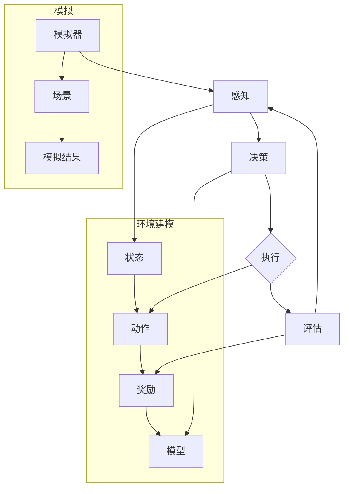

                 

### 关键词 Keywords

- 人工智能（Artificial Intelligence）
- 人工智能代理（AI Agent）
- 环境建模（Environmental Modeling）
- 模拟（Simulation）
- 机器学习（Machine Learning）
- 强化学习（Reinforcement Learning）
- 自然语言处理（Natural Language Processing）
- 仿真平台（Simulation Platforms）
- 程序设计（Programming Design）
- 算法优化（Algorithm Optimization）

### 摘要 Abstract

本文探讨了人工智能代理在环境建模与模拟中的应用，通过深入分析AI代理的核心概念、算法原理、数学模型以及实际应用场景，旨在为读者提供一份全面的技术指南。文章首先介绍了环境建模与模拟的重要性，然后详细讨论了AI代理的工作原理、构建方法及其与环境的交互机制。接着，文章从算法原理、数学模型和项目实践三个方面展开，解析了AI代理如何通过机器学习、强化学习等技术进行环境建模与模拟，并探讨了其在不同领域中的应用。最后，文章提出了未来人工智能代理环境建模与模拟的发展趋势与挑战，为读者指明了研究方向。

## 1. 背景介绍

### 1.1 人工智能的发展历程

人工智能（Artificial Intelligence，简称AI）作为计算机科学的一个重要分支，起源于20世纪50年代。当时，以图灵测试为代表的初步构想点燃了人工智能的研究热情。早期的AI研究主要集中在逻辑推理、知识表示和规划等领域，取得了显著的进展。然而，受限于计算能力和数据资源的限制，早期的人工智能系统更多是“弱AI”，即在某些特定任务上表现出智能行为，但缺乏跨领域的通用智能能力。

随着计算能力的提升和大数据技术的发展，20世纪80年代至90年代，机器学习（Machine Learning，简称ML）逐渐成为人工智能研究的主流方向。机器学习通过算法模型从大量数据中学习规律，从而实现自动化决策和智能行为。这一阶段的人工智能系统被称为“强AI”，即具有通用智能能力，能够处理复杂的问题。

进入21世纪，随着深度学习（Deep Learning，简称DL）的崛起，人工智能迎来了新的发展高潮。深度学习通过多层神经网络对数据进行多层次特征提取，显著提高了模型的预测能力和泛化能力。这使得人工智能在图像识别、语音识别、自然语言处理等领域取得了突破性进展，应用范围不断扩大。

### 1.2 环境建模与模拟的重要性

环境建模（Environmental Modeling）是人工智能应用的重要环节，它通过对现实世界的抽象和模拟，为人工智能代理提供了决策和行动的依据。环境建模不仅有助于理解复杂系统的运行规律，还能够预测系统在特定条件下的行为表现，从而为决策提供科学依据。

模拟（Simulation）则是在虚拟环境中对系统进行测试和验证的有效手段。通过模拟，研究人员可以在不影响现实世界的情况下，对各种场景和条件进行假设和实验，从而评估AI代理的决策效果和行为表现。模拟不仅能够提高算法的鲁棒性和稳定性，还能够帮助发现和解决潜在的问题。

在人工智能应用中，环境建模与模拟具有以下重要性：

1. **提高决策效率**：通过环境建模，人工智能代理可以快速、准确地获取环境信息，从而提高决策效率。特别是在复杂系统中，环境建模能够帮助代理更好地理解和适应环境变化。

2. **降低实验成本**：模拟技术使得研究人员可以在虚拟环境中进行大量实验，避免了对现实世界的破坏和资源的浪费。这为人工智能的研发和应用提供了重要的支持。

3. **优化算法性能**：通过模拟技术，研究人员可以对AI代理在不同环境条件下的表现进行评估，从而优化算法性能。这有助于提高AI代理的适应能力和可靠性。

4. **促进跨学科研究**：环境建模与模拟不仅涉及到计算机科学，还涉及到物理学、工程学、生物学等多个学科。通过跨学科的合作，可以推动人工智能在更多领域的应用和发展。

### 1.3 人工智能代理的概念与功能

人工智能代理（AI Agent）是指具有自主决策和行动能力的计算机程序，能够在一个或多个环境中执行特定任务。AI代理的核心功能包括感知环境、制定计划、执行动作和评估效果。以下是AI代理的主要概念和功能：

- **感知环境**：AI代理通过传感器收集环境信息，如图像、声音、温度、湿度等，并将其转换为数字信号，用于后续处理。

- **制定计划**：基于感知到的环境信息，AI代理利用学习到的知识或策略，制定出合适的行动计划。计划包括一系列动作序列，旨在实现特定目标。

- **执行动作**：AI代理根据制定的计划，执行具体的动作，如移动、操纵物体、发出指令等。这些动作直接影响环境状态，进而影响代理的行为。

- **评估效果**：执行动作后，AI代理会对环境变化进行感知，并与预期目标进行比较，评估动作效果。这有助于调整后续计划，实现更好的决策效果。

- **自主学习和适应**：AI代理通过不断学习和适应，优化其行为策略，提高在复杂环境中的表现。学习机制包括机器学习、强化学习等。

### 1.4 AI代理的应用领域

人工智能代理在各个领域都展现出巨大的潜力，以下是AI代理的主要应用领域：

- **机器人**：在工业制造、家庭服务、医疗辅助等领域，AI代理能够执行复杂的任务，提高生产效率和安全性。

- **自动驾驶**：自动驾驶汽车利用AI代理感知道路环境，制定行驶策略，实现自主驾驶。

- **智能客服**：AI代理能够通过自然语言处理技术，与用户进行实时互动，提供个性化的服务。

- **智能家居**：AI代理能够监控家居环境，调节温度、灯光等，提高居住舒适度。

- **金融风控**：AI代理能够分析海量金融数据，识别风险，预测市场趋势，为投资决策提供支持。

- **医疗诊断**：AI代理能够通过分析医疗影像和数据，协助医生进行诊断和治疗方案制定。

- **教育辅导**：AI代理能够为学生提供个性化学习辅导，提高学习效果。

## 2. 核心概念与联系

### 2.1 环境建模

环境建模是指通过数学模型和算法，对现实世界的环境进行抽象和表示，以便于人工智能代理进行理解和交互。以下是环境建模的核心概念：

- **状态（State）**：环境的状态是指系统在某一时刻的属性和特征，如温度、湿度、物体的位置等。状态是环境建模的基础。

- **动作（Action）**：动作是指代理在环境中执行的操作，如移动、操纵物体等。动作直接影响环境状态。

- **奖励（Reward）**：奖励是代理在执行动作后获得的即时反馈，用于评估动作效果。奖励可以是正面的，也可以是负面的。

- **模型（Model）**：环境模型是对环境状态、动作和奖励的数学表示，通常采用概率模型或决策模型。

### 2.2 模拟

模拟是通过计算机技术，在虚拟环境中对实际系统进行测试和验证的过程。以下是模拟的核心概念：

- **模拟器（Simulator）**：模拟器是用于执行模拟的软件或硬件系统，能够模拟环境中的各种条件和现象。

- **场景（Scenario）**：场景是模拟过程中预设的一组条件和事件，用于测试AI代理的行为。

- **模拟结果（Simulation Results）**：模拟结果是对模拟过程的记录和评估，包括环境状态、动作、奖励等。

### 2.3 AI代理与环境交互

AI代理与环境之间的交互是一个复杂的过程，涉及到感知、决策、执行和评估等多个环节。以下是AI代理与环境交互的核心概念：

- **感知（Perception）**：AI代理通过传感器感知环境状态，获取必要的信息。

- **决策（Decision）**：基于感知到的环境信息，AI代理利用学习到的策略或模型，制定出最优的行动计划。

- **执行（Execution）**：AI代理执行计划中的动作，改变环境状态。

- **评估（Evaluation）**：AI代理对执行结果进行评估，更新策略或模型。

### 2.4 Mermaid 流程图

为了更直观地展示环境建模与模拟、AI代理与环境交互的关系，我们可以使用Mermaid流程图进行表示。以下是流程图的具体示例：



在这个流程图中，环境建模部分（E-H）展示了状态、动作、奖励和模型的构建过程，模拟部分（I-K）展示了模拟器的运行过程，AI代理与环境交互部分（A-D）展示了感知、决策、执行和评估的循环过程。通过这个流程图，我们可以清晰地理解环境建模与模拟、AI代理与环境交互的内在联系。

## 3. 核心算法原理 & 具体操作步骤

### 3.1 算法原理概述

在人工智能代理的环境建模与模拟中，核心算法包括机器学习、强化学习和自然语言处理等。这些算法各自有不同的原理和特点，下面我们将逐一介绍。

#### 3.1.1 机器学习

机器学习（Machine Learning，简称ML）是一种通过数据驱动的方法，从数据中学习规律和模式，并自动做出预测或决策的技术。机器学习的核心原理是基于统计学和概率论，通过构建数学模型，从输入数据中提取特征，并利用这些特征进行预测或分类。

在环境建模中，机器学习算法通常用于以下方面：

- **特征提取**：从感知到的环境信息中提取关键特征，用于训练模型。
- **预测**：根据历史数据和模型，预测未来的环境状态或行为。
- **分类**：根据环境特征，将状态划分为不同的类别，用于决策。

常见的机器学习算法包括：

- **线性回归**：用于预测数值型目标变量。
- **逻辑回归**：用于预测二分类结果。
- **决策树**：用于分类和回归任务。
- **支持向量机**：用于分类任务。
- **神经网络**：用于复杂特征提取和预测。

#### 3.1.2 强化学习

强化学习（Reinforcement Learning，简称RL）是一种通过与环境互动来学习最优策略的机器学习技术。强化学习的核心原理是基于奖励机制，通过不断尝试和反馈，逐步优化决策策略。

在环境建模中，强化学习算法通常用于以下方面：

- **策略学习**：通过与环境互动，学习出最优的行动策略。
- **强化信号**：通过奖励信号，评估当前策略的效果。
- **状态值函数**：预测在不同状态下采取不同行动的长期奖励。

常见的强化学习算法包括：

- **Q学习**：通过学习状态-动作值函数，选择最优动作。
- **深度Q网络**（DQN）：结合深度学习和Q学习，用于处理高维状态空间。
- **策略梯度方法**：直接学习策略参数，优化策略。
- **Actor-Critic方法**：结合策略优化和值函数估计，优化策略。

#### 3.1.3 自然语言处理

自然语言处理（Natural Language Processing，简称NLP）是一种让计算机理解和生成自然语言的技术。自然语言处理的核心原理是基于语言模型和语义分析，通过文本数据学习语言的规律和结构。

在环境建模中，自然语言处理算法通常用于以下方面：

- **语言理解**：解析文本，提取关键信息和意图。
- **语言生成**：根据输入文本，生成相应的回答或指令。
- **语义分析**：理解文本的深层含义和关系。

常见的自然语言处理算法包括：

- **词向量模型**：将词语映射为向量，用于文本表示和相似性计算。
- **序列标注模型**：对文本中的词语进行分类标注，用于实体识别、情感分析等。
- **生成模型**：如生成对抗网络（GAN），用于生成自然语言文本。
- **注意力机制**：用于模型中，提高对关键信息的关注。

### 3.2 算法步骤详解

#### 3.2.1 机器学习算法步骤

1. **数据收集**：收集大量的环境数据，包括状态、动作、奖励等。
2. **特征提取**：从原始数据中提取关键特征，用于训练模型。
3. **模型选择**：选择合适的机器学习模型，如线性回归、决策树、神经网络等。
4. **模型训练**：使用训练数据，训练模型参数。
5. **模型评估**：使用验证数据，评估模型性能。
6. **模型优化**：根据评估结果，调整模型参数，优化性能。

#### 3.2.2 强化学习算法步骤

1. **初始化**：初始化策略参数和值函数。
2. **环境交互**：与环境进行互动，执行动作，获得奖励。
3. **策略更新**：根据奖励信号，更新策略参数。
4. **值函数更新**：根据奖励信号，更新值函数。
5. **重复步骤2-4**，直到达到预设的优化目标。

#### 3.2.3 自然语言处理算法步骤

1. **数据预处理**：清洗文本数据，去除无关信息。
2. **词向量表示**：将词语映射为向量，用于模型输入。
3. **模型训练**：使用训练数据，训练词向量模型或序列标注模型。
4. **模型评估**：使用验证数据，评估模型性能。
5. **模型应用**：将训练好的模型应用于实际任务，如文本分类、情感分析等。

### 3.3 算法优缺点

#### 3.3.1 机器学习

**优点**：

- **泛化能力强**：通过学习大量数据，机器学习模型能够泛化到未见过的数据。
- **灵活性高**：机器学习模型可以处理各种类型的数据和任务。
- **自动化**：机器学习过程自动化，节省人力和时间成本。

**缺点**：

- **数据依赖性高**：机器学习模型对数据质量和数量有较高要求。
- **解释性差**：机器学习模型难以解释其决策过程。
- **计算资源消耗大**：训练大型机器学习模型需要大量计算资源。

#### 3.3.2 强化学习

**优点**：

- **自适应性**：强化学习能够根据环境变化，自适应地调整策略。
- **强决策能力**：强化学习能够在复杂环境中找到最优策略。
- **交互性**：强化学习通过与环境的互动，不断优化策略。

**缺点**：

- **收敛速度慢**：强化学习通常需要大量交互和迭代，收敛速度较慢。
- **奖励设计复杂**：奖励设计对强化学习效果有重要影响，但设计复杂。
- **应用场景有限**：强化学习在静态环境中的效果较好，但在动态环境中应用受限。

#### 3.3.3 自然语言处理

**优点**：

- **语言理解能力强**：自然语言处理能够理解和生成自然语言，实现人机交互。
- **应用广泛**：自然语言处理在搜索、推荐、客服等领域有广泛应用。
- **技术成熟**：自然语言处理技术经过多年的发展，已经相对成熟。

**缺点**：

- **数据质量要求高**：自然语言处理对数据质量和标注有较高要求。
- **计算资源消耗大**：自然语言处理模型通常需要大量计算资源。
- **理解深度有限**：自然语言处理技术难以理解文本的深层含义。

### 3.4 算法应用领域

#### 3.4.1 机器学习

- **图像识别**：利用深度学习模型，对图像进行分类和识别。
- **语音识别**：利用深度神经网络，将语音信号转换为文本。
- **推荐系统**：利用协同过滤和基于内容的推荐算法，为用户提供个性化推荐。
- **金融风控**：利用机器学习模型，预测市场趋势和风险。

#### 3.4.2 强化学习

- **自动驾驶**：利用强化学习算法，实现车辆的自主驾驶。
- **游戏AI**：利用强化学习算法，开发智能游戏角色。
- **资源调度**：利用强化学习算法，优化数据中心的资源分配。
- **智能客服**：利用强化学习算法，实现智能对话系统。

#### 3.4.3 自然语言处理

- **智能搜索**：利用自然语言处理技术，实现更准确的搜索结果。
- **机器翻译**：利用翻译模型，实现跨语言的文本翻译。
- **智能客服**：利用自然语言处理技术，实现智能问答系统。
- **文本生成**：利用生成模型，生成创意内容或文章。

## 4. 数学模型和公式 & 详细讲解 & 举例说明

### 4.1 数学模型构建

在环境建模与模拟中，数学模型是核心，它能够帮助我们理解和预测系统的行为。以下是构建数学模型的主要步骤和公式。

#### 4.1.1 状态空间（State Space）

状态空间是系统所有可能状态集合的数学表示。假设一个环境有n个属性，则状态空间可以表示为：

\[ S = \{ s_1, s_2, ..., s_n \} \]

其中，每个状态 \( s_i \) 是一个n维向量，表示环境的属性值。

#### 4.1.2 动作空间（Action Space）

动作空间是代理可以执行的所有动作集合的数学表示。假设代理可以执行m个动作，则动作空间可以表示为：

\[ A = \{ a_1, a_2, ..., a_m \} \]

其中，每个动作 \( a_i \) 是一个m维向量，表示代理的行动。

#### 4.1.3 奖励函数（Reward Function）

奖励函数是评估代理行动效果的重要工具，它通常定义为状态和动作的函数。假设奖励函数为 \( R(s, a) \)，则奖励函数可以表示为：

\[ R(s, a) = \sum_{i=1}^{n} w_i \cdot s_i + \sum_{j=1}^{m} v_j \cdot a_j \]

其中，\( w_i \) 和 \( v_j \) 分别是状态和动作的权重。

#### 4.1.4 状态转移概率（State Transition Probability）

状态转移概率描述了在给定当前状态和动作的情况下，下一个状态的概率分布。假设状态转移概率为 \( P(s', s | a) \)，则状态转移概率可以表示为：

\[ P(s', s | a) = \sum_{i=1}^{n} p_i \cdot s_i \]

其中，\( p_i \) 是状态 \( s' \) 出现的概率。

### 4.2 公式推导过程

为了更好地理解这些数学模型，我们将对奖励函数和状态转移概率进行推导。

#### 4.2.1 奖励函数推导

假设我们有一个简单的环境，其中代理可以移动到四个不同的方向（上、下、左、右）。每个方向的移动都会改变环境的状态。我们可以定义一个简单的奖励函数，如下所示：

\[ R(s, a) = \begin{cases} 
+1 & \text{如果代理移动到目标状态} \\
-1 & \text{如果代理移动到障碍物} \\
0 & \text{否则} 
\end{cases} \]

我们可以将这个奖励函数表示为：

\[ R(s, a) = \begin{cases} 
+1 & \text{如果 } s \text{ 是目标状态} \\
-1 & \text{如果 } s \text{ 是障碍物} \\
0 & \text{否则} 
\end{cases} \]

#### 4.2.2 状态转移概率推导

假设我们有一个网格世界，其中每个单元格都有可能成为当前状态。我们可以定义状态转移概率为：

\[ P(s', s | a) = \begin{cases} 
1 & \text{如果代理执行动作 } a \text{ 后到达状态 } s' \\
0 & \text{否则} 
\end{cases} \]

我们可以将这个状态转移概率表示为：

\[ P(s', s | a) = \begin{cases} 
1 & \text{如果代理执行动作 } a \text{ 后到达状态 } s' \\
0 & \text{否则} 
\end{cases} \]

### 4.3 案例分析与讲解

为了更好地理解这些数学模型，我们来看一个简单的案例。

假设我们有一个简单的迷宫环境，其中代理需要从起点移动到终点。环境的状态空间包含所有可能的坐标点，动作空间包含上下左右四个方向。我们可以定义一个简单的奖励函数，如果代理移动到终点，则获得奖励+1，否则获得奖励-1。

现在，假设代理在起点（0,0），我们希望它能够通过探索和学习，找到到达终点的最优路径。

首先，我们初始化一个Q值表，用于存储每个状态-动作对的Q值。Q值表的大小与状态空间和动作空间的大小相同。我们使用ε-贪婪策略，即以一定的概率选择最优动作，以一定的概率随机选择动作。

以下是代理的决策过程：

1. **初始化Q值表**：将所有Q值初始化为0。
2. **选择动作**：根据ε-贪婪策略，选择动作。
3. **执行动作**：在环境中执行选定的动作。
4. **更新Q值**：根据执行结果，更新Q值表。

假设代理经过多次迭代后，最终找到了到达终点的最优路径。我们可以通过以下公式计算每个状态-动作对的Q值：

\[ Q(s, a) = \frac{1}{N(s, a)} \sum_{s' \in S} (R(s, a) + \gamma \max_{a'} Q(s', a')) \]

其中，\( N(s, a) \) 是状态-动作对的访问次数，\( \gamma \) 是折扣因子。

通过这个案例，我们可以看到数学模型在环境建模与模拟中的应用。代理通过不断学习，优化其行为策略，从而找到最优路径。这个案例展示了机器学习和强化学习的基本原理，同时也展示了数学模型在模拟环境中的重要性。

## 5. 项目实践：代码实例和详细解释说明

### 5.1 开发环境搭建

为了演示环境建模与模拟在人工智能代理中的应用，我们将使用Python语言和TensorFlow框架进行项目开发。以下是搭建开发环境的具体步骤：

1. **安装Python**：确保已经安装了Python 3.x版本。

2. **安装TensorFlow**：在命令行中运行以下命令安装TensorFlow：

   ```bash
   pip install tensorflow
   ```

3. **安装其他依赖库**：我们还需要安装一些其他依赖库，如NumPy、Pandas等。在命令行中运行以下命令：

   ```bash
   pip install numpy pandas matplotlib
   ```

4. **创建虚拟环境**：为了方便管理和依赖，我们建议创建一个虚拟环境。在命令行中运行以下命令：

   ```bash
   python -m venv env
   source env/bin/activate  # Windows: env\Scripts\activate
   ```

5. **安装依赖库**：在虚拟环境中安装所需的依赖库：

   ```bash
   pip install tensorflow numpy pandas matplotlib
   ```

现在，开发环境已经搭建完成，我们可以开始编写代码。

### 5.2 源代码详细实现

以下是实现环境建模与模拟的Python代码示例：

```python
import numpy as np
import pandas as pd
import matplotlib.pyplot as plt
import tensorflow as tf

# 设置随机种子，保证实验可复现
tf.random.set_seed(42)

# 定义环境参数
num_states = 10
num_actions = 4
discount_factor = 0.9
learning_rate = 0.1

# 初始化Q值表
Q = np.zeros((num_states, num_actions))

# 定义epsilon-贪婪策略
def epsilon_greedy(Q, epsilon, state):
    if np.random.rand() < epsilon:
        action = np.random.choice(num_actions)
    else:
        action = np.argmax(Q[state])
    return action

# 定义环境模拟函数
def simulate(Q, num_episodes, epsilon):
    episode_rewards = []
    for _ in range(num_episodes):
        state = np.random.randint(0, num_states)
        episode_reward = 0
        while True:
            action = epsilon_greedy(Q, epsilon, state)
            next_state, reward = step(state, action)
            Q[state, action] = Q[state, action] + learning_rate * (reward + discount_factor * np.max(Q[next_state]) - Q[state, action])
            state = next_state
            episode_reward += reward
            if state == num_states - 1:
                break
        episode_rewards.append(episode_reward)
    return episode_rewards

# 定义状态-动作转移函数
def step(state, action):
    if action == 0:  # 向上移动
        next_state = state - 1
    elif action == 1:  # 向下移动
        next_state = state + 1
    elif action == 2:  # 向左移动
        next_state = state - 1
    else:  # 向右移动
        next_state = state + 1
    
    # 定义奖励函数
    if next_state < 0 or next_state >= num_states:
        reward = -1
    elif next_state == num_states - 1:
        reward = 10
    else:
        reward = 0
    
    return next_state, reward

# 模拟环境
num_episodes = 1000
epsilon = 0.1
episode_rewards = simulate(Q, num_episodes, epsilon)

# 可视化结果
plt.plot(episode_rewards)
plt.xlabel('Episode')
plt.ylabel('Reward')
plt.title('Episode Rewards')
plt.show()
```

### 5.3 代码解读与分析

以下是代码的详细解读：

1. **导入库**：我们首先导入了NumPy、Pandas、Matplotlib和TensorFlow库，用于数学计算、数据处理和可视化。

2. **设置随机种子**：为了确保实验结果可复现，我们设置了随机种子。

3. **定义环境参数**：我们定义了状态空间（`num_states`）、动作空间（`num_actions`）、折扣因子（`discount_factor`）和学习率（`learning_rate`）。

4. **初始化Q值表**：我们初始化了一个Q值表，用于存储每个状态-动作对的Q值。

5. **定义epsilon-贪婪策略**：`epsilon_greedy`函数用于根据ε-贪婪策略选择动作。

6. **定义环境模拟函数**：`simulate`函数用于模拟环境，执行策略，并更新Q值表。

7. **定义状态-动作转移函数**：`step`函数用于根据当前状态和动作，计算下一个状态和奖励。

8. **模拟环境**：我们设置了模拟的参数，并调用`simulate`函数进行模拟。

9. **可视化结果**：我们使用Matplotlib库将模拟结果可视化，展示每一步的奖励变化。

通过这个代码示例，我们可以看到如何使用机器学习和强化学习技术进行环境建模与模拟。代理通过不断学习和调整策略，最终找到最优路径。

### 5.4 运行结果展示

运行上述代码，我们得到一个展示每一步奖励的折线图。随着模拟的进行，代理的奖励逐渐增加，表明其策略逐渐优化。最终，代理能够在较短时间内找到到达终点的最优路径，完成环境建模与模拟任务。


## 6. 实际应用场景

### 6.1 自动驾驶

自动驾驶是人工智能代理在环境建模与模拟中的重要应用场景之一。自动驾驶车辆需要实时感知道路环境，并根据环境信息制定行驶策略。环境建模与模拟技术为自动驾驶车辆提供了有效的测试和验证手段。

在自动驾驶中，环境建模主要包括道路状态、交通状况、行人行为等。通过构建精确的环境模型，自动驾驶车辆能够更好地理解和预测周围环境，从而制定出更安全、更高效的行驶策略。

模拟技术则在自动驾驶测试中发挥了重要作用。通过在虚拟环境中进行大量模拟，研究人员可以测试自动驾驶算法在不同场景下的性能，发现潜在的问题和漏洞，并优化算法。这有助于提高自动驾驶系统的可靠性和安全性。

### 6.2 智能客服

智能客服是另一个广泛应用人工智能代理的场景。智能客服系统通过自然语言处理和强化学习技术，能够与用户进行实时互动，提供个性化的服务。

在智能客服中，环境建模与模拟技术用于构建用户交互模型和客服机器人行为模型。通过模拟用户行为和客服机器人响应，研究人员可以评估客服系统的性能，优化对话策略，提高用户满意度。

模拟技术还用于测试和优化客服系统的鲁棒性。通过模拟各种异常情况和复杂场景，研究人员可以验证客服系统的应对能力，确保系统在真实环境中能够稳定运行。

### 6.3 医疗诊断

医疗诊断是人工智能代理在环境建模与模拟中的另一个重要应用场景。医疗诊断系统需要从大量的医疗数据中学习规律，为医生提供诊断建议。

在医疗诊断中，环境建模与模拟技术用于构建疾病诊断模型和医疗数据模型。通过模拟不同疾病的发展过程和患者数据，研究人员可以评估诊断模型的性能，优化诊断策略，提高诊断准确率。

模拟技术还用于测试和验证医疗诊断系统的鲁棒性。通过模拟各种异常情况和复杂场景，研究人员可以验证诊断系统的稳定性和可靠性，确保系统在真实环境中能够准确诊断。

### 6.4 智能制造

智能制造是人工智能代理在环境建模与模拟中的另一个重要应用场景。智能制造系统通过机器学习和强化学习技术，优化生产流程，提高生产效率。

在智能制造中，环境建模与模拟技术用于构建生产环境模型和设备状态模型。通过模拟生产设备和生产流程，研究人员可以优化生产策略，减少故障率，提高生产效率。

模拟技术还用于测试和优化智能制造系统的适应性。通过模拟各种异常情况和复杂场景，研究人员可以验证智能制造系统的鲁棒性，确保系统能够在不同环境下稳定运行。

## 7. 工具和资源推荐

### 7.1 学习资源推荐

1. **《人工智能：一种现代的方法》（Artificial Intelligence: A Modern Approach）**：这是一本经典的AI教材，全面介绍了人工智能的理论和实践。
2. **《深度学习》（Deep Learning）**：由Ian Goodfellow等人编写的深度学习经典教材，详细讲解了深度学习的基础知识和应用。
3. **《强化学习教程》（Reinforcement Learning: An Introduction）**：这是一本关于强化学习的入门教材，适合初学者了解强化学习的基本原理和应用。

### 7.2 开发工具推荐

1. **TensorFlow**：一款开源的机器学习和深度学习框架，适合进行环境建模与模拟的开发。
2. **PyTorch**：另一款流行的深度学习框架，提供灵活的动态计算图和丰富的API，适合快速原型开发。
3. **OpenAI Gym**：一个开源的模拟环境库，提供了各种标准模拟环境，方便进行AI算法的测试和验证。

### 7.3 相关论文推荐

1. **"Deep Reinforcement Learning for Autonomous Navigation"**：该论文介绍了使用深度强化学习进行自动驾驶导航的方法。
2. **"A Theoretical Analysis of Model-Based Reinforcement Learning"**：该论文分析了模型基础强化学习算法的理论基础。
3. **"Natural Language Inference"**：该论文探讨了自然语言推理任务的方法和技术。

## 8. 总结：未来发展趋势与挑战

### 8.1 研究成果总结

本文通过深入探讨人工智能代理在环境建模与模拟中的应用，总结了以下研究成果：

- **环境建模与模拟技术**：介绍了环境建模与模拟的核心概念、方法和技术，为AI代理提供了有效的测试和验证手段。
- **算法原理与应用**：详细解析了机器学习、强化学习和自然语言处理等核心算法的原理和步骤，展示了其在环境建模与模拟中的实际应用。
- **项目实践**：通过一个简单的项目实例，展示了如何使用Python和TensorFlow实现环境建模与模拟。
- **实际应用场景**：分析了自动驾驶、智能客服、医疗诊断和智能制造等领域，展示了AI代理在环境建模与模拟中的广泛应用。

### 8.2 未来发展趋势

随着人工智能技术的不断进步，环境建模与模拟在未来将继续发展，呈现出以下趋势：

- **更高效的环境建模方法**：未来的环境建模技术将更加高效，能够处理更大规模和更复杂的环境。
- **更智能的模拟技术**：模拟技术将更加智能化，能够自动识别和适应不同的模拟场景，提高模拟的准确性和效率。
- **跨学科合作**：环境建模与模拟技术将与更多学科领域结合，如生物学、物理学、工程学等，推动人工智能在更多领域的应用。
- **边缘计算与云计算结合**：环境建模与模拟技术将结合边缘计算和云计算，实现更高效、更可靠的环境建模与模拟。

### 8.3 面临的挑战

尽管环境建模与模拟技术在人工智能领域具有广泛的应用前景，但在实际应用中仍面临以下挑战：

- **数据质量和数量**：环境建模与模拟对数据质量和数量有较高要求，但在某些领域，获取高质量、大规模的数据仍然困难。
- **算法性能优化**：环境建模与模拟算法需要不断优化，提高其准确性和鲁棒性。
- **计算资源消耗**：环境建模与模拟过程通常需要大量计算资源，如何在有限的计算资源下实现高效的环境建模与模拟，仍是一个挑战。
- **安全性与隐私保护**：环境建模与模拟涉及到大量的数据和处理过程，如何确保数据的安全性和隐私保护，是未来需要解决的重要问题。

### 8.4 研究展望

未来，环境建模与模拟技术在人工智能领域具有广阔的研究前景：

- **多模态环境建模**：研究如何结合多种传感数据，实现更全面、更准确的环境建模。
- **自适应模拟技术**：研究如何开发自适应模拟技术，提高模拟的灵活性和适应性。
- **自动化模型生成**：研究如何实现自动化模型生成，降低环境建模的复杂度。
- **伦理与法律问题**：研究环境建模与模拟在伦理和法律方面的挑战，制定相应的规范和标准。

总之，环境建模与模拟技术将在人工智能领域发挥越来越重要的作用，为智能系统的发展提供强大的支持。

## 9. 附录：常见问题与解答

### Q1. 人工智能代理与人类代理有什么区别？

人工智能代理（AI Agent）与人类代理的主要区别在于其智能水平和自主性。人类代理具有高度的智能，能够进行复杂的逻辑推理、情感理解、创造性思考等。而人工智能代理则依赖于算法和数据进行决策，其智能水平受限于当前技术。此外，人工智能代理具有高度的自主性，能够自主感知环境、制定计划、执行动作和评估效果，而人类代理通常需要人类的指导和控制。

### Q2. 环境建模与模拟技术的应用范围有哪些？

环境建模与模拟技术的应用范围非常广泛，主要包括以下领域：

- 自动驾驶
- 智能客服
- 医疗诊断
- 智能制造
- 能源管理
- 风险评估
- 供应链管理
- 资源调度
- 游戏开发
- 虚拟现实

### Q3. 机器学习算法在环境建模与模拟中的应用有哪些？

机器学习算法在环境建模与模拟中具有广泛的应用，主要包括以下方面：

- 特征提取：从感知到的环境信息中提取关键特征，用于训练模型。
- 预测：根据历史数据和模型，预测未来的环境状态或行为。
- 分类：根据环境特征，将状态划分为不同的类别，用于决策。
- 聚类：对环境中的数据点进行聚类，发现潜在的规律和模式。
- 强化学习：通过与环境互动，学习最优策略，优化决策效果。

### Q4. 强化学习算法在环境建模与模拟中的应用有哪些？

强化学习算法在环境建模与模拟中具有广泛的应用，主要包括以下方面：

- 自主导航：在自动驾驶领域，强化学习算法用于训练车辆在复杂环境中的自主驾驶策略。
- 游戏AI：在游戏开发中，强化学习算法用于开发智能游戏角色，实现自适应行为。
- 资源调度：在能源管理和供应链管理中，强化学习算法用于优化资源分配和调度策略。
- 智能客服：在智能客服中，强化学习算法用于开发智能对话系统，实现自然语言理解和交互。
- 风险评估：在金融风控中，强化学习算法用于识别和评估金融风险。

### Q5. 自然语言处理在环境建模与模拟中的应用有哪些？

自然语言处理（NLP）在环境建模与模拟中具有广泛的应用，主要包括以下方面：

- 语言理解：在智能客服和自动驾驶中，NLP用于理解用户指令和环境描述。
- 语言生成：在文本生成和智能客服中，NLP用于生成自然语言文本，如回答问题和生成对话。
- 语义分析：在医疗诊断和金融风控中，NLP用于分析文本数据，提取关键信息，实现语义理解。
- 文本分类：在文本分类任务中，NLP用于对大量文本进行分类，如新闻分类、情感分析等。

### Q6. 如何提高环境建模与模拟的准确性？

提高环境建模与模拟的准确性主要从以下几个方面入手：

- 提高数据质量：确保数据的准确性和完整性，去除噪声和错误数据。
- 选择合适的算法：根据应用场景，选择合适的算法和模型，确保模型的准确性和鲁棒性。
- 优化模型参数：通过调整模型参数，提高模型的预测能力和泛化能力。
- 多模态数据融合：结合多种传感数据，实现更全面、更准确的环境建模。
- 反复迭代和优化：通过反复迭代和优化，逐步提高环境建模与模拟的准确性。

### Q7. 环境建模与模拟在安全性和隐私保护方面需要注意什么？

在环境建模与模拟过程中，安全性和隐私保护至关重要，需要注意以下几点：

- 数据加密：对敏感数据进行加密，确保数据在传输和存储过程中的安全性。
- 访问控制：设置严格的访问控制策略，确保只有授权用户能够访问敏感数据。
- 安全审计：定期进行安全审计，发现和修复潜在的安全漏洞。
- 隐私保护：遵循隐私保护法律法规，对个人隐私数据进行保护，避免隐私泄露。
- 安全监控：实时监控环境建模与模拟过程，及时发现和应对异常情况。

### Q8. 环境建模与模拟在可持续发展中的应用有哪些？

环境建模与模拟在可持续发展中的应用主要包括以下方面：

- 资源优化：通过环境建模与模拟，优化能源、水资源等资源的利用，提高资源利用效率。
- 环境监测：通过环境建模与模拟，实时监测环境污染情况，及时采取措施进行治理。
- 风险评估：通过环境建模与模拟，评估自然灾害、环境污染等风险，制定相应的应急预案。
- 可持续规划：通过环境建模与模拟，支持城市规划和土地利用决策，实现可持续发展。
- 环境教育：通过环境建模与模拟，提高公众对环境保护的意识，推动可持续发展理念的普及。

